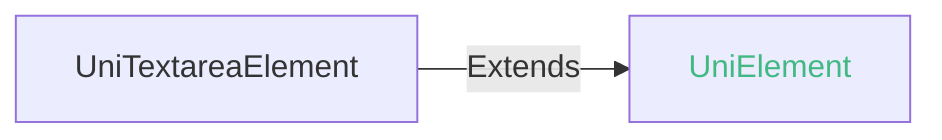

## UniTextareaElement

textarea 组件的 DOM 元素对象。

### UniTextareaElement 兼容性 
 | Web | 微信小程序 | Android | iOS | iOS uni-app x UTS 插件 | HarmonyOS |
| :- | :- | :- | :- | :- | :- |
| 4.0 | x | 4.0 | 4.11 | 4.25 | 4.61 |

### UniTextareaElement 的属性值 @unitextareaelement-values
| 名称 | 类型 | 必备 | 默认值 | 兼容性 | 描述 |
| :- | :- | :- | :- |  :-: | :- |
| name | string | 是 | - | Web: -; 微信小程序: x; Android: 4.0; iOS: 4.11; iOS uni-app x UTS 插件: 4.25; HarmonyOS: - | 表单的控件名称，作为键值对的一部分与表单(form组件)一同提交 |
| type | string | 是 | - | Web: -; 微信小程序: x; Android: 4.0; iOS: 4.11; iOS uni-app x UTS 插件: 4.25; HarmonyOS: - | input的类型 |
| disabled | boolean | 是 | - | Web: -; 微信小程序: x; Android: 4.0; iOS: 4.11; iOS uni-app x UTS 插件: 4.25; HarmonyOS: - | 是否禁用 |
| autofocus | boolean | 是 | - | Web: -; 微信小程序: x; Android: 4.0; iOS: 4.11; iOS uni-app x UTS 插件: 4.25; HarmonyOS: - | 自动获取焦点 |
| value | string | 是 | - | Web: -; 微信小程序: -; Android: 4.0; iOS: 4.11; iOS uni-app x UTS 插件: 4.25; HarmonyOS: - | 输入框的初始内容 |

<!-- CUSTOMTYPEJSON.UniTextareaElement.example -->
