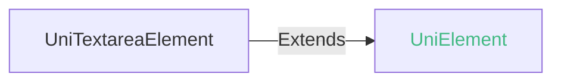

## UniTextareaElement

textarea 组件的 DOM 元素对象。

### UniTextareaElement 兼容性 <Help /> 
 | Web | 微信小程序 | 支付宝小程序 | Android | iOS | iOS(VDOM) UTS 插件 | HarmonyOS |
| :- | :- | :- | :- | :- | :- | :- |
| 4.0 | x | x | 4.0 | 4.11 | 4.25 | 4.61 |

```mermaid
graph LR
  
UniTextareaElement -- Extends --> UniElement
  style UniElement color:#42b983
  click UniElement "https://doc.dcloud.net.cn/uni-app-x/api/dom/unielement.html"
```

### UniTextareaElement 的属性值 @unitextareaelement-values
| 名称 | 类型 | 必备 | 兼容性 | 描述 |
| :- | :- | :- |  :-: | :- |
| name | string | 是 | 微信小程序: x; 支付宝小程序: x; Android: 4.0; iOS: 4.11; iOS(VDOM) UTS 插件: 4.25 | 表单的控件名称，作为键值对的一部分与表单(form组件)一同提交 |
| type | string | 是 | 微信小程序: x; 支付宝小程序: x; Android: 4.0; iOS: 4.11; iOS(VDOM) UTS 插件: 4.25 | input的类型 |
| disabled | boolean | 是 | 微信小程序: x; 支付宝小程序: x; Android: 4.0; iOS: 4.11; iOS(VDOM) UTS 插件: 4.25 | 是否禁用 |
| autofocus | boolean | 是 | 微信小程序: x; 支付宝小程序: x; Android: 4.0; iOS: 4.11; iOS(VDOM) UTS 插件: 4.25 | 自动获取焦点 |
| value | string | 是 | Android: 4.0; iOS: 4.11; iOS(VDOM) UTS 插件: 4.25 | 输入框的初始内容 |

<!-- CUSTOMTYPEJSON.UniTextareaElement.example -->
