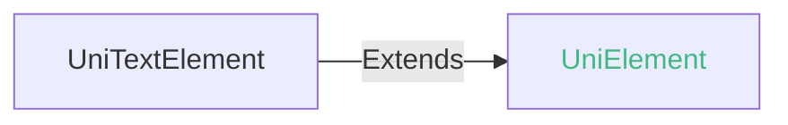

## UniTextElement

text 组件的 DOM 元素对象。

### UniTextElement 兼容性 
 | Web | 微信小程序 | Android | iOS | iOS uni-app x UTS 插件 | HarmonyOS | HarmonyOS(Vapor) |
| :- | :- | :- | :- | :- | :- | :- |
| 4.0 | x | 4.0 | 4.11 | 4.25 | 4.61 | 5.0 |

### UniTextElement 的属性值 @unitextelement-values
| 名称 | 类型 | 必备 | 默认值 | 兼容性 | 描述 |
| :- | :- | :- | :- |  :-: | :- |
| value | string | 是 | - | Web: x; 微信小程序: x; Android: 4.0; iOS: 4.11; iOS uni-app x UTS 插件: 4.25; HarmonyOS: 4.61; HarmonyOS(Vapor): 5.0 | 只读属性 text元素的文案内容 |

### UniTextElement 的方法 @unitextelement-methods
<!-- CUSTOMTYPEJSON.UniTextElement.methods.getTextExtra.name -->

<!-- CUSTOMTYPEJSON.UniTextElement.methods.getTextExtra.description -->

<!-- CUSTOMTYPEJSON.UniTextElement.methods.getTextExtra.compatibility -->

<!-- CUSTOMTYPEJSON.UniTextElement.methods.getTextExtra.param -->

<!-- CUSTOMTYPEJSON.UniTextElement.methods.getTextExtra.returnValue -->

<!-- CUSTOMTYPEJSON.UniTextElement.methods.getTextExtra.tutorial -->

#### setTextLayout(layout: UniTextLayout): void @settextlayout

设置文本内容

##### setTextLayout 兼容性 
| Web | 微信小程序 | Android | iOS | iOS uni-app x UTS 插件 | HarmonyOS | HarmonyOS(Vapor) |
| :- | :- | :- | :- | :- | :- | :- |
| x | x | 4.81 | x | x | x | x |

##### 参数 

| 名称 | 类型 | 必填 | 默认值 | 兼容性 | 描述 |
| :- | :- | :- | :- |  :-: | :- |
| layout | [UniTextLayout](#unitextlayout-values) | 是 | - | Web: x; 微信小程序: x; Android: -; iOS: x; HarmonyOS: x | 文本对象 | 

##### UniTextLayout 的方法 @unitextlayout-values 

##### setText(text: string): void @settext
setText
设置文本
###### setText 兼容性 
| Web | 微信小程序 | Android | iOS | HarmonyOS |
| :- | :- | :- | :- | :- |
| x | x | 4.81 | x | x |

##### 参数 

| 名称 | 类型 | 必填 | 默认值 | 兼容性 | 描述 |
| :- | :- | :- | :- |  :-: | :- |
| text | string | 是 | - | Web: x; 微信小程序: x; Android: -; iOS: x; HarmonyOS: x |  | 

##### setColor(color: string): void @setcolor
setColor
设置文本颜色
###### setColor 兼容性 
| Web | 微信小程序 | Android | iOS | HarmonyOS |
| :- | :- | :- | :- | :- |
| x | x | 4.81 | x | x |

##### 参数 

| 名称 | 类型 | 必填 | 默认值 | 兼容性 | 描述 |
| :- | :- | :- | :- |  :-: | :- |
| color | string | 是 | - | Web: x; 微信小程序: x; Android: -; iOS: x; HarmonyOS: x |  | 

##### setFontFamily(family: string): void @setfontfamily
setFontFamily
设置字体名称
###### setFontFamily 兼容性 
| Web | 微信小程序 | Android | iOS | HarmonyOS |
| :- | :- | :- | :- | :- |
| x | x | 4.81 | x | x |

##### 参数 

| 名称 | 类型 | 必填 | 默认值 | 兼容性 | 描述 |
| :- | :- | :- | :- |  :-: | :- |
| family | string | 是 | - | Web: x; 微信小程序: x; Android: -; iOS: x; HarmonyOS: x |  | 

##### setFontSize(size: string): void @setfontsize
setFontSize
设置字体大小
###### setFontSize 兼容性 
| Web | 微信小程序 | Android | iOS | HarmonyOS |
| :- | :- | :- | :- | :- |
| x | x | 4.81 | x | x |

##### 参数 

| 名称 | 类型 | 必填 | 默认值 | 兼容性 | 描述 |
| :- | :- | :- | :- |  :-: | :- |
| size | string | 是 | - | Web: x; 微信小程序: x; Android: -; iOS: x; HarmonyOS: x |  | 

##### setFontStyle(style: string): void @setfontstyle
setFontStyle
设置字体样式
###### setFontStyle 兼容性 
| Web | 微信小程序 | Android | iOS | HarmonyOS |
| :- | :- | :- | :- | :- |
| x | x | 4.81 | x | x |

##### 参数 

| 名称 | 类型 | 必填 | 默认值 | 兼容性 | 描述 |
| :- | :- | :- | :- |  :-: | :- |
| style | string | 是 | - | Web: x; 微信小程序: x; Android: -; iOS: x; HarmonyOS: x |  | 

##### setFontWeight(weight: string): void @setfontweight
setFontWeight
设置字体粗细
###### setFontWeight 兼容性 
| Web | 微信小程序 | Android | iOS | HarmonyOS |
| :- | :- | :- | :- | :- |
| x | x | 4.81 | x | x |

##### 参数 

| 名称 | 类型 | 必填 | 默认值 | 兼容性 | 描述 |
| :- | :- | :- | :- |  :-: | :- |
| weight | string | 是 | - | Web: x; 微信小程序: x; Android: -; iOS: x; HarmonyOS: x |  | 

##### setLineHeight(height: string): void @setlineheight
setLineHeight
设置行高
###### setLineHeight 兼容性 
| Web | 微信小程序 | Android | iOS | HarmonyOS |
| :- | :- | :- | :- | :- |
| x | x | 4.81 | x | x |

##### 参数 

| 名称 | 类型 | 必填 | 默认值 | 兼容性 | 描述 |
| :- | :- | :- | :- |  :-: | :- |
| height | string | 是 | - | Web: x; 微信小程序: x; Android: -; iOS: x; HarmonyOS: x |  | 

##### setTextAlign(align: string): void @settextalign
setTextAlign
设置文字水平对齐方式
###### setTextAlign 兼容性 
| Web | 微信小程序 | Android | iOS | HarmonyOS |
| :- | :- | :- | :- | :- |
| x | x | 4.81 | x | x |

##### 参数 

| 名称 | 类型 | 必填 | 默认值 | 兼容性 | 描述 |
| :- | :- | :- | :- |  :-: | :- |
| align | string | 是 | - | Web: x; 微信小程序: x; Android: -; iOS: x; HarmonyOS: x |  | 

##### setTextOverflow(overflow: string): void @settextoverflow
setTextOverflow
设置文字溢出裁剪方式
###### setTextOverflow 兼容性 
| Web | 微信小程序 | Android | iOS | HarmonyOS |
| :- | :- | :- | :- | :- |
| x | x | 4.81 | x | x |

##### 参数 

| 名称 | 类型 | 必填 | 默认值 | 兼容性 | 描述 |
| :- | :- | :- | :- |  :-: | :- |
| overflow | string | 是 | - | Web: x; 微信小程序: x; Android: -; iOS: x; HarmonyOS: x |  | 

##### setTextShadow(shadow: string): void @settextshadow
setTextShadow
设置文字阴影
###### setTextShadow 兼容性 
| Web | 微信小程序 | Android | iOS | HarmonyOS |
| :- | :- | :- | :- | :- |
| x | x | 4.81 | x | x |

##### 参数 

| 名称 | 类型 | 必填 | 默认值 | 兼容性 | 描述 |
| :- | :- | :- | :- |  :-: | :- |
| shadow | string | 是 | - | Web: x; 微信小程序: x; Android: -; iOS: x; HarmonyOS: x |  | 

##### setTextDecorationLine(decorationLine: string): void @settextdecorationline
setTextDecorationLine
设置文本修饰类型
###### setTextDecorationLine 兼容性 
| Web | 微信小程序 | Android | iOS | HarmonyOS |
| :- | :- | :- | :- | :- |
| x | x | 4.81 | x | x |

##### 参数 

| 名称 | 类型 | 必填 | 默认值 | 兼容性 | 描述 |
| :- | :- | :- | :- |  :-: | :- |
| decorationLine | string | 是 | - | Web: x; 微信小程序: x; Android: -; iOS: x; HarmonyOS: x |  | 

##### setWhiteSpace(whiteSpace: string): void @setwhitespace
setWhiteSpace
设置处理空白字符
###### setWhiteSpace 兼容性 
| Web | 微信小程序 | Android | iOS | HarmonyOS |
| :- | :- | :- | :- | :- |
| x | x | 4.81 | x | x |

##### 参数 

| 名称 | 类型 | 必填 | 默认值 | 兼容性 | 描述 |
| :- | :- | :- | :- |  :-: | :- |
| whiteSpace | string | 是 | - | Web: x; 微信小程序: x; Android: -; iOS: x; HarmonyOS: x |  | 

##### append(layout: UniTextLayout): void @append
append
添加子文本对象
###### append 兼容性 
| Web | 微信小程序 | Android | iOS | HarmonyOS |
| :- | :- | :- | :- | :- |
| x | x | 4.81 | x | x |

##### 参数 

| 名称 | 类型 | 必填 | 默认值 | 兼容性 | 描述 |
| :- | :- | :- | :- |  :-: | :- |
| layout | [UniTextLayout](#unitextlayout-values) | 是 | - | Web: x; 微信小程序: x; Android: -; iOS: x; HarmonyOS: x | 文本对象 | 

##### measure(constraint: UniLayoutConstraintSize): UniLayoutSize @measure
measure
测量文本大小
###### measure 兼容性 
| Web | 微信小程序 | Android | iOS | HarmonyOS |
| :- | :- | :- | :- | :- |
| x | x | 4.81 | x | x |

##### 参数 

| 名称 | 类型 | 必填 | 默认值 | 兼容性 | 描述 |
| :- | :- | :- | :- |  :-: | :- |
| constraint | **UniLayoutConstraintSize** | 是 | - | Web: x; 微信小程序: x; Android: -; iOS: x; HarmonyOS: x | 布局约束大小 |

#### constraint 的属性描述

| 名称 | 类型 | 必备 | 默认值 | 兼容性 | 描述 |
| :- | :- | :- | :- |  :-: | :- |
| minWidth | number | 否 | - | Web: x; 微信小程序: x; Android: 4.81; iOS: x; HarmonyOS: x | 元素最小宽度，逻辑像素值 可选值，不设置则认为没有最小宽度 |
| maxWidth | number | 否 | - | Web: x; 微信小程序: x; Android: 4.81; iOS: x; HarmonyOS: x | 元素最大宽度，逻辑像素值 可选值，不设置则认为可以无限宽 |
| minHeight | number | 否 | - | Web: x; 微信小程序: x; Android: 4.81; iOS: x; HarmonyOS: x | 元素最小高度，逻辑像素值 可选值，不设置则认为没有最小高度 |
| maxHeight | number | 否 | - | Web: x; 微信小程序: x; Android: 4.81; iOS: x; HarmonyOS: x | 元素最大高度，逻辑像素值 可选值，不设置则认为可以无限高 | 

###### 返回值 

| 类型 | 描述 |
| :- | :- |
| **UniLayoutSize** | 布局大小 |

#### UniLayoutSize 的属性描述

| 名称 | 类型 | 必备 | 默认值 | 兼容性 | 描述 |
| :- | :- | :- | :- |  :-: | :- |
| width | number | 是 | - | Web: x; 微信小程序: x; Android: 4.81; iOS: x; HarmonyOS: x | 元素宽度，逻辑像素值 |
| height | number | 是 | - | Web: x; 微信小程序: x; Android: 4.81; iOS: x; HarmonyOS: x | 元素高度，逻辑像素值 | 

#### getContentSize(): UniLayoutSize @getcontentsize

获取内容宽高

##### getContentSize 兼容性 
| Web | 微信小程序 | Android | iOS | iOS uni-app x UTS 插件 | HarmonyOS | HarmonyOS(Vapor) |
| :- | :- | :- | :- | :- | :- | :- |
| x | x | 4.81 | x | x | x | x |

##### 返回值 

| 类型 | 描述 |
| :- | :- |
| **UniLayoutSize** | 布局大小 |

#### UniLayoutSize 的属性描述

| 名称 | 类型 | 必备 | 默认值 | 兼容性 | 描述 |
| :- | :- | :- | :- |  :-: | :- |
| width | number | 是 | - | Web: x; 微信小程序: x; Android: 4.81; iOS: x; HarmonyOS: x | 元素宽度，逻辑像素值 |
| height | number | 是 | - | Web: x; 微信小程序: x; Android: 4.81; iOS: x; HarmonyOS: x | 元素高度，逻辑像素值 | 

<!-- CUSTOMTYPEJSON.UniTextElement.example -->
