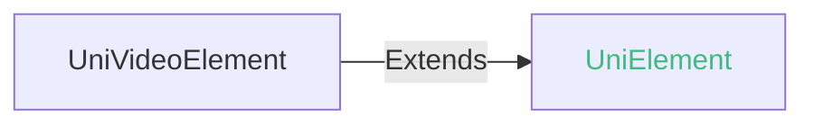

## UniVideoElement

video元素对象

### UniVideoElement 兼容性 
 | Web | 微信小程序 | Android | iOS | HarmonyOS |
| :- | :- | :- | :- | :- |
| 4.0 | x | - | - | - |

### UniVideoElement 的方法 @univideoelement-methods
#### play(): void @play

播放

##### play 兼容性 
| Web | 微信小程序 | Android | iOS | HarmonyOS |
| :- | :- | :- | :- | :- |
| 4.0 | x | - | - | - |

#### pause(): void @pause

暂停

##### pause 兼容性 
| Web | 微信小程序 | Android | iOS | HarmonyOS |
| :- | :- | :- | :- | :- |
| 4.0 | x | - | - | - |

#### seek(position: number): void @seek

跳转到指定位置

##### seek 兼容性 
| Web | 微信小程序 | Android | iOS | HarmonyOS |
| :- | :- | :- | :- | :- |
| 4.0 | x | - | - | - |

##### 参数 

| 名称 | 类型 | 必填 | 默认值 | 兼容性 | 描述 |
| :- | :- | :- | :- |  :-: | :- |
| position | number | 是 | - | Web: -; 微信小程序: x; Android: -; iOS: -; HarmonyOS: - | 跳转到指定位置(秒) | 

#### stop(): void @stop

停止视频

##### stop 兼容性 
| Web | 微信小程序 | Android | iOS | HarmonyOS |
| :- | :- | :- | :- | :- |
| 4.0 | x | - | - | - |

#### sendDanmu(danmu: Danmu): void @senddanmu

发送弹幕

##### sendDanmu 兼容性 
| Web | 微信小程序 | Android | iOS | HarmonyOS |
| :- | :- | :- | :- | :- |
| 4.0 | x | - | - | - |

##### 参数 

| 名称 | 类型 | 必填 | 默认值 | 兼容性 | 描述 |
| :- | :- | :- | :- |  :-: | :- |
| danmu | **Danmu** | 是 | - | Web: -; 微信小程序: x; Android: -; iOS: -; HarmonyOS: - | 弹幕数据 |

#### danmu 的属性描述

| 名称 | 类型 | 必备 | 默认值 | 兼容性 | 描述 |
| :- | :- | :- | :- |  :-: | :- |
| text | string | 否 | - | Web: -; 微信小程序: x; Android: -; iOS: -; HarmonyOS: - | 弹幕文字 |
| color | string | 否 | - | Web: -; 微信小程序: x; Android: -; iOS: -; HarmonyOS: - | 弹幕颜色 |
| time | number | 否 | - | Web: -; 微信小程序: x; Android: -; iOS: -; HarmonyOS: - | 显示时刻 | 

#### playbackRate(rate: number): void @playbackrate

设置倍速播放

##### playbackRate 兼容性 
| Web | 微信小程序 | Android | iOS | HarmonyOS |
| :- | :- | :- | :- | :- |
| 4.0 | x | - | - | - |

##### 参数 

| 名称 | 类型 | 必填 | 默认值 | 兼容性 | 描述 |
| :- | :- | :- | :- |  :-: | :- |
| rate | number | 是 | - | Web: -; 微信小程序: x; Android: -; iOS: -; HarmonyOS: - | 支持倍率 0.5/0.8/1.0/1.25/1.5 | 

#### requestFullScreen(direction?: RequestFullScreenOptions \| null): void @requestfullscreen

进入全屏

##### requestFullScreen 兼容性 
| Web | 微信小程序 | Android | iOS | HarmonyOS |
| :- | :- | :- | :- | :- |
| 4.0 | x | - | - | - |

##### 参数 

| 名称 | 类型 | 必填 | 默认值 | 兼容性 | 描述 |
| :- | :- | :- | :- |  :-: | :- |
| direction | **RequestFullScreenOptions** | 否 | - | Web: -; 微信小程序: x; Android: -; iOS: -; HarmonyOS: - | 0\|正常竖向, 90\|屏幕逆时针90度, -90\|屏幕顺时针90度 |

#### direction 的属性描述

| 名称 | 类型 | 必备 | 默认值 | 兼容性 | 描述 |
| :- | :- | :- | :- |  :-: | :- |
| direction | number | 否 | - | Web: x; 微信小程序: x; Android: 3.9.0; iOS: 4.11; HarmonyOS: - | direction |

##### direction 的属性描述

| 合法值 | 兼容性 | 描述 |
| :- |  :-: | :- |
| 0 | Web: -; 微信小程序: x; Android: -; iOS: -; HarmonyOS: - | 正常竖向 |
| 90 | Web: -; 微信小程序: x; Android: -; iOS: -; HarmonyOS: - | 屏幕逆时针90度 |
| -90 | Web: -; 微信小程序: x; Android: -; iOS: -; HarmonyOS: - | 屏幕顺时针90度 | 

#### exitFullScreen(): void @exitfullscreen

退出全屏

##### exitFullScreen 兼容性 
| Web | 微信小程序 | Android | iOS | HarmonyOS |
| :- | :- | :- | :- | :- |
| 4.0 | x | - | - | - |

<!-- CUSTOMTYPEJSON.UniVideoElement.example -->
