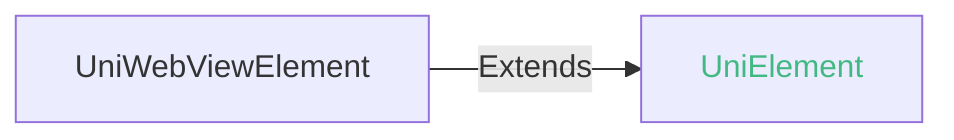

## UniWebViewElement

web-view 组件的 DOM 元素对象。

### UniWebViewElement 兼容性 
 | Web | 微信小程序 | Android | iOS | iOS uni-app x UTS 插件 | HarmonyOS |
| :- | :- | :- | :- | :- | :- |
| 4.0 | x | 4.0 | 4.11 | 4.25 | 4.61 |

### UniWebViewElement 的方法 @uniwebviewelement-methods

#### back(): void @back

后退

##### back 兼容性 
| Web | 微信小程序 | Android | iOS | iOS uni-app x UTS 插件 | HarmonyOS |
| :- | :- | :- | :- | :- | :- |
| 4.0 | x | 4.0 | 4.11 | 4.25 | - |

#### forward(): void @forward

前进

##### forward 兼容性 
| Web | 微信小程序 | Android | iOS | iOS uni-app x UTS 插件 | HarmonyOS |
| :- | :- | :- | :- | :- | :- |
| 4.0 | x | 4.0 | 4.11 | 4.25 | - |

#### reload(): void @reload

重新加载

##### reload 兼容性 
| Web | 微信小程序 | Android | iOS | iOS uni-app x UTS 插件 | HarmonyOS |
| :- | :- | :- | :- | :- | :- |
| 4.0 | x | 4.0 | 4.11 | 4.25 | - |

#### stop(): void @stop

停止加载

##### stop 兼容性 
| Web | 微信小程序 | Android | iOS | iOS uni-app x UTS 插件 | HarmonyOS |
| :- | :- | :- | :- | :- | :- |
| 4.0 | x | 4.0 | 4.11 | 4.25 | - |

#### evalJS(js: string): void @evaljs

原生和WebView通信（执行JS脚本）

##### evalJS 兼容性 
| Web | 微信小程序 | Android | iOS | iOS uni-app x UTS 插件 | HarmonyOS |
| :- | :- | :- | :- | :- | :- |
| 4.0 | x | 4.0 | 4.11 | 4.25 | - |

##### 参数 

| 名称 | 类型 | 必填 | 默认值 | 兼容性 | 描述 |
| :- | :- | :- | :- |  :-: | :- |
| js | string | 是 | - | Web: -; 微信小程序: x; Android: -; iOS: -; HarmonyOS: - |  | 

#### getContentHeight(): number @getcontentheight

获取webview内容高度

##### getContentHeight 兼容性 
| Web | 微信小程序 | Android | iOS | iOS uni-app x UTS 插件 | HarmonyOS |
| :- | :- | :- | :- | :- | :- |
| x | x | 4.63 | 4.63 | 4.63 | - |

##### 返回值 

| 类型 |
| :- |
| number |
 

#### loadData(options: UniWebViewElementLoadDataOptions): void @loaddata

加载页面内容

##### loadData 兼容性 
| Web | 微信小程序 | Android | iOS | iOS uni-app x UTS 插件 | HarmonyOS |
| :- | :- | :- | :- | :- | :- |
| x | x | 4.65 | 4.65 | 4.65 | - |

##### 参数 

| 名称 | 类型 | 必填 | 默认值 | 兼容性 | 描述 |
| :- | :- | :- | :- |  :-: | :- |
| options | **UniWebViewElementLoadDataOptions** | 是 | - | Web: x; 微信小程序: x; Android: -; iOS: -; HarmonyOS: - |  |

#### options 的属性描述

| 名称 | 类型 | 必备 | 默认值 | 兼容性 | 描述 |
| :- | :- | :- | :- |  :-: | :- |
| data | string | 是 | - | Web: x; 微信小程序: x; Android: 4.65; iOS: 4.65; iOS uni-app x UTS 插件: 4.65; HarmonyOS: - | 要加载的html字符串，注意：这里是编码过的字符串 |
| baseURL | string | 否 | - | Web: x; 微信小程序: x; Android: 4.65; iOS: 4.65; iOS uni-app x UTS 插件: 4.65; HarmonyOS: - | 页面的基础URL, 可选 |
| mimeType | string | 否 | - | Web: x; 微信小程序: x; Android: 4.65; iOS: 4.65; iOS uni-app x UTS 插件: 4.65; HarmonyOS: - | 加载的页面内容类型，默认值为"text/html"，可选 |
| encoding | string | 否 | - | Web: x; 微信小程序: x; Android: 4.65; iOS: 4.65; iOS uni-app x UTS 插件: 4.65; HarmonyOS: - | 页面内容的编码类型，默认值为"utf-8"，可选 | 

<!-- CUSTOMTYPEJSON.UniWebViewElement.example -->
