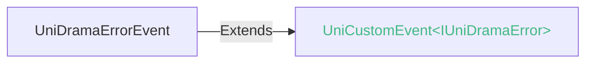

<!-- ## ad-drama -->

::: sourceCode
## ad-drama
:::

uni-app x 短剧插件：uni.createDramaAd API 与 ad-drama 组件（独立运行，不依赖其他插件）

ad-drama 组件是短剧广告的组件模式接入方式：组件挂载即自动加载短剧模块，适合快速接入短剧广告。

与 API 模式（[uni.createDramaAd](../api/create-drama-ad.md)）的区别：组件模式直接使用渠道提供的短剧首页界面（含推荐、榜单等内容分发），无需自行搭建短剧列表页；API 模式则自行搭建列表页，可深度定制样式与业务。

- 示例Demo介绍：[详见](https://gitcode.com/dcloud/uni-ad-drama)
- uni-ad的业务介绍：[详见](https://uniapp.dcloud.net.cn/uni-ad/)

**开通配置广告**

[开通广告步骤详情](https://uniapp.dcloud.net.cn/uni-ad/ad-open.html)

**Tips**
- 标准基座不支持测试短剧功能。
- 使用短剧组件需要先开通穿山甲广告。开通问题请咨询：[uni-ad交流群](https://im.dcloud.net.cn/#/?joinGroup=65d85fc09847e92db03ff81a)。
- 标准基座不包含短剧运行时，需制作自定义基座后运行，否则报错 `-5020`。

### 配置文件

在穿山甲后台 内容输出->接入管理 找到需要接入内容SDK的应用，点击"下载SDK参数配置"，然后将SDK配置文件（例如 sdk_setting_file.json）拷贝到项目的 assets 文件夹下。

文件下载之后重命名为：`gm_SDK_Setting.json`，然后将文件放到项目根目录的`nativeResources->android->assets`目录下。
完整配置说明与错误码见 [uni.createDramaAd](../api/create-drama-ad.md)。

### 兼容性 <Help />
| Web | 微信小程序 | 支付宝小程序 | Android | iOS | HarmonyOS |
| :- | :- | :- | :- | :- | :- |
| <a style="color:unset;" href="https://vote.dcloud.net.cn/#/?name=uni-app%20x">x</a> | <a style="color:unset;" href="https://vote.dcloud.net.cn/#/?name=uni-app%20x">x</a> | <a style="color:unset;" href="https://vote.dcloud.net.cn/#/?name=uni-app%20x">x</a> | 5.31 | <a style="color:unset;" href="https://vote.dcloud.net.cn/#/?name=uni-app%20x">x</a> | <a style="color:unset;" href="https://vote.dcloud.net.cn/#/?name=uni-app%20x">x</a> |

### 属性 
| 名称 | 类型 | 默认值 | 兼容性 | 描述 |
| :- | :- | :- |  :-: | :- |
| adpid | string | "" | Web: x; 微信小程序: x; 支付宝小程序: x; Android: 5.31; iOS: x; HarmonyOS: x | 短剧广告位id，在uniAD官网申请广告位 |
| free | number | 1 | Web: x; 微信小程序: x; 支付宝小程序: x; Android: 5.31; iOS: x; HarmonyOS: x | 初始可免费观看的剧集数 |
| lock | number | 1 | Web: x; 微信小程序: x; 支付宝小程序: x; Android: 5.31; iOS: x; HarmonyOS: x | 单次激励视频可解锁的剧集数 |
| urlCallback | any | null | Web: x; 微信小程序: x; 支付宝小程序: x; Android: 5.31; iOS: x; HarmonyOS: x | 服务端回调透传参数（userId/extra），激励发放时透传服务器校验 |
| url-callback | any | null |   |   |
| @load | (event: [UniNativeViewEvent](/component/common.md#uninativeviewevent)) => void |   | Web: x; 微信小程序: x; 支付宝小程序: x; Android: 5.31; iOS: x; HarmonyOS: x | 短剧加载成功的回调 |
| @error | (e:[UniDramaErrorEvent](#unidramaerrorevent)) => void |   | Web: x; 微信小程序: x; 支付宝小程序: x; Android: 5.31; iOS: x; HarmonyOS: x | 短剧加载失败的回调 |
| @click | (event: [UniNativeViewEvent](/component/common.md#uninativeviewevent)) => void |   | Web: x; 微信小程序: x; 支付宝小程序: x; Android: 5.31; iOS: x; HarmonyOS: x | 点击短剧的回调 |
| @close | (event: [UniNativeViewEvent](/component/common.md#uninativeviewevent)) => void |   | Web: x; 微信小程序: x; 支付宝小程序: x; Android: 5.31; iOS: x; HarmonyOS: x | 短剧关闭的回调 |

<!-- UTSCOMJSON.ad-drama.fileFormates -->

### 事件
#### UniDramaErrorEvent
ad-drama 组件 error 事件的专属类型：detail 为 IUniDramaError。 对齐 uni-ad 的 UniAdErrorEvent、uni-video 的 UniVideoErrorEvent 模式 （class extends UniCustomEvent\<T>，编译为真实类，运行时类型安全）， 便于语法库与文档系统连接类型定义渲染事件详情。

##### IUniDramaError

###### IUniDramaError 的属性值
| 名称 | 类型 | 必填 | 描述 |
| :- | :- | :- | :- |
| errCode | number | 是 | 错误码 - -5001 广告位标识adpid为空，请传入有效的adpid - -5002 无效的广告位标识adpid，请使用正确的adpid - -5003 广告位未开通广告，请在广告平台申请并确保已审核通过 - -5004 无广告模块，打包时请配置要使用的广告模块 - -5005 广告加载失败，请稍后重试 - -5006 广告已经展示过了，请重新加载 - -5007 广告不可用或已过期，请重新请求 - -5008 广告不可用或已过期，请重新请求 - -5009 广告类型不符，请检查后再试 - -5011 打包或开通的渠道，不支持此类型广告 - -5013 广告播放失败，请重新加载 - -5020 短剧运行时加载异常，请使用包含短剧运行时的自定义基座 |
| errSubject | string | 是 | 统一错误主题（模块）名称 |
| data | any | 否 | 错误信息中包含的数据 |
| cause | [Error](/err-spec.md#unierror) | 否 | 源错误信息，可以包含多个错误，详见SourceError |
| errMsg | string | 是 |  |

<!-- UTSCOMJSON.ad-drama.component_type -->

### 子组件 @children-tags
不可以嵌套组件

## Tips

+ 短剧广告仅支持 Android 平台。

### 参见
- [相关 Bug](https://issues.dcloud.net.cn/?mid=component.ad.ad-drama)
- [微信小程序文档](https://developers.weixin.qq.com/doc/search.html?source=enter&query=ad-drama&doc_type=miniprogram)
- [支付宝小程序文档](https://open.alipay.com/portal/zhichi/search?keyword=ad-drama&pageIndex=1&pageSize=10&source=doc_top&type=all)
- [百度小程序文档](https://smartprogram.baidu.com/forum/search?query=ad-drama&scope=devdocs&source=docs)
- [抖音小程序文档](https://developer.open-douyin.com/search-page?keyword=ad-drama&secondType=all&type=1)
- [飞书小程序文档](https://open.feishu.cn/search?from=header&page=1&pageSize=10&q=ad-drama&topicFilter=)
- [钉钉小程序文档](https://open.dingtalk.com/search?keyword=ad-drama)
- [QQ小程序文档](https://q.qq.com/wiki/develop/miniprogram/frame/)
- [快手小程序文档](https://developers.kuaishou.com/page?keyword=ad-drama&from=docs)
- [京东小程序文档](https://mp-docs.jd.com/doc/dev/framework/-1)
- [华为快应用文档](https://developer.huawei.com/consumer/cn/doc/quickApp-References/webview-frame-overview-0000001124793625)
- [360小程序文档](https://mp.360.cn/doc/miniprogram/dev/#/b770a184ff1f06c6b3393a0fd1132380)
