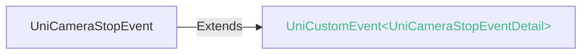
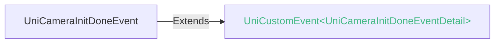
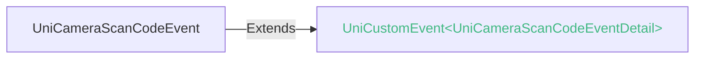

<!-- ## camera -->

::: sourceCode
## camera

> GitCode: https://gitcode.com/dcloud/uni-component/tree/alpha/uni_modules/uni-camera


> GitHub: https://github.com/dcloudio/uni-component/tree/alpha/uni_modules/uni-camera

:::

相机组件


### 兼容性
| Web | 微信小程序 | Android | iOS | HarmonyOS | HarmonyOS(Vapor) |
| :- | :- | :- | :- | :- | :- |
| <a style="color:unset;" href="https://vote.dcloud.net.cn/#/?name=uni-app%20x">x</a> | 4.41 | 4.61 | 4.61 | <a style="color:unset;" href="https://vote.dcloud.net.cn/#/?name=uni-app%20x">x</a> | <a style="color:unset;" href="https://vote.dcloud.net.cn/#/?name=uni-app%20x">x</a> |


### 属性 
| 名称 | 类型 | 默认值 | 兼容性 | 描述 |
| :- | :- | :- |  :-: | :- |
| flash | auto \| on \| off \| torch | - | Web: x; 微信小程序: 4.41; Android: 4.61; iOS: 4.61; HarmonyOS: -; HarmonyOS(Vapor): - | 闪光灯，值为auto, on, off, torch |
| device-position | back \| front | - | Web: x; 微信小程序: 4.41; Android: 4.61; iOS: 4.61; HarmonyOS: -; HarmonyOS(Vapor): - | 前置或后置，值为front, back |
| mode | normal \| scanCode | - | Web: x; 微信小程序: 4.41; Android: 4.71; iOS: 4.71; HarmonyOS: x; HarmonyOS(Vapor): - | *(string)*<br/>应用模式，只在初始化时有效，不能动态变更 |
| resolution | low \| medium \| high | - | Web: x; 微信小程序: 4.41; Android: 4.61; iOS: 4.61; HarmonyOS: x; HarmonyOS(Vapor): - | *(string)*<br/>分辨率，不支持动态修改 |
| frame-size | small \| medium \| large | - | Web: x; 微信小程序: 4.41; Android: 4.61; iOS: 4.61; HarmonyOS: x; HarmonyOS(Vapor): - | *(string)*<br/>指定期望的相机帧数据尺寸 |
| photo-resolution | low \| medium \| high \| original | - | Web: x; 微信小程序: x; Android: 4.81; iOS: x; HarmonyOS: x; HarmonyOS(Vapor): - | *(string)*<br/>指定期望的拍照图片分辨率，不支持动态修改 |
| @stop | (event: [UniCameraStopEvent](#unicamerastopevent)) => void | - | Web: x; 微信小程序: 4.41; Android: 4.61; iOS: 4.61; HarmonyOS: -; HarmonyOS(Vapor): - | 摄像头在非正常终止时触发，如退出后台等情况 |
| @error | (event: [UniCameraErrorEvent](#unicameraerrorevent)) => void | - | Web: x; 微信小程序: 4.41; Android: 4.61; iOS: 4.61; HarmonyOS: -; HarmonyOS(Vapor): - | 用户不允许使用摄像头时触发 |
| @initdone | (event: [UniCameraInitDoneEvent](#unicamerainitdoneevent)) => void | - | Web: x; 微信小程序: 4.41; Android: 4.61; iOS: 4.61; HarmonyOS: x; HarmonyOS(Vapor): - | *(eventhandle)*<br/>相机初始化完成时触发，`e.detail = {maxZoom}` |
| @scancode | (event: [UniCameraScanCodeEvent](#unicamerascancodeevent)) => void | - | Web: x; 微信小程序: 4.41; Android: 4.71; iOS: 4.71; HarmonyOS: x; HarmonyOS(Vapor): - | *(eventhandle)*<br/>在扫码识别成功时触发，仅在 mode="scanCode" 时生效 |

#### flash 的属性描述

| 合法值 | 兼容性 | 描述 |
| :- |  :-: | :- |
| auto | Web: x; 微信小程序: 4.41; Android: 4.61; iOS: 4.61; HarmonyOS: x; HarmonyOS(Vapor): - | 自动 |
| on | Web: x; 微信小程序: 4.41; Android: 4.61; iOS: 4.61; HarmonyOS: x; HarmonyOS(Vapor): - | 开 |
| off | Web: x; 微信小程序: 4.41; Android: 4.61; iOS: 4.61; HarmonyOS: x; HarmonyOS(Vapor): - | 关 |
| torch | Web: x; 微信小程序: 4.41; Android: 4.61; iOS: 4.61; HarmonyOS: x; HarmonyOS(Vapor): - | 常亮 |

#### device-position 的属性描述

| 合法值 | 兼容性 | 描述 |
| :- |  :-: | :- |
| back | Web: x; 微信小程序: 4.41; Android: 4.61; iOS: 4.61; HarmonyOS: x; HarmonyOS(Vapor): - | 后置 |
| front | Web: x; 微信小程序: 4.41; Android: 4.61; iOS: 4.61; HarmonyOS: x; HarmonyOS(Vapor): - | 前置 |

#### mode 的属性描述

| 合法值 | 兼容性 | 描述 |
| :- |  :-: | :- |
| normal | Web: x; 微信小程序: 4.41; Android: 4.71; iOS: 4.71; HarmonyOS: x; HarmonyOS(Vapor): - | 相机模式 |
| scanCode | Web: x; 微信小程序: 4.41; Android: 4.71; iOS: 4.71; HarmonyOS: x; HarmonyOS(Vapor): - | 扫码模式 |

#### resolution 的属性描述

| 合法值 | 兼容性 | 描述 |
| :- |  :-: | :- |
| low | Web: x; 微信小程序: 4.41; Android: 4.61; iOS: 4.61; HarmonyOS: x; HarmonyOS(Vapor): - | 低 |
| medium | Web: x; 微信小程序: 4.41; Android: 4.61; iOS: 4.61; HarmonyOS: x; HarmonyOS(Vapor): - | 中 |
| high | Web: x; 微信小程序: 4.41; Android: 4.61; iOS: 4.61; HarmonyOS: x; HarmonyOS(Vapor): - | 高 |

#### frame-size 的属性描述

| 合法值 | 兼容性 | 描述 |
| :- |  :-: | :- |
| small | Web: x; 微信小程序: 4.41; Android: 4.61; iOS: 4.61; HarmonyOS: x; HarmonyOS(Vapor): - | 小尺寸帧数据 |
| medium | Web: x; 微信小程序: 4.41; Android: 4.61; iOS: 4.61; HarmonyOS: x; HarmonyOS(Vapor): - | 中尺寸帧数据 |
| large | Web: x; 微信小程序: 4.41; Android: 4.61; iOS: 4.61; HarmonyOS: x; HarmonyOS(Vapor): - | 大尺寸帧数据 |

#### photo-resolution 的属性描述

| 合法值 | 兼容性 | 描述 |
| :- |  :-: | :- |
| low | Web: x; 微信小程序: x; Android: 4.81; iOS: x; HarmonyOS: x; HarmonyOS(Vapor): - | 低分辨率 |
| medium | Web: x; 微信小程序: x; Android: 4.81; iOS: x; HarmonyOS: x; HarmonyOS(Vapor): - | 中分辨率 |
| high | Web: x; 微信小程序: x; Android: 4.81; iOS: x; HarmonyOS: x; HarmonyOS(Vapor): - | 高分辨率 |
| original | Web: x; 微信小程序: x; Android: 4.81; iOS: x; HarmonyOS: x; HarmonyOS(Vapor): - | 原始分辨率，相机的原始分辨率拍照质量最高，但是保存速度可能会较慢 |


### 事件
#### UniCameraStopEvent


##### UniCameraStopEventDetail


###### UniCameraStopEventDetail 的属性值
| 名称 | 类型 | 必填 | 默认值 | 兼容性 | 描述 |
| :- | :- | :- | :- |  :-: | :- |
| errorCause | string | 否 | - | - | - |
| errSubject | string | 否 | - | - | - |
| errCode | number | 否 | - | - | - |
| errMsg | string | 否 | - | - | - |
| data | Object | 否 | - | - | - |
| cause | Object | 否 | - | - | - |


#### UniCameraErrorEvent


##### UniCameraErrorEventDetail


###### UniCameraErrorEventDetail 的属性值
| 名称 | 类型 | 必填 | 默认值 | 兼容性 | 描述 |
| :- | :- | :- | :- |  :-: | :- |
| msg | string | 否 | - | - | - |
| errSubject | string | 否 | - | - | - |
| errCode | number | 否 | - | - | - |
| errMsg | string | 否 | - | - | - |
| data | Object | 否 | - | - | - |
| cause | Object | 否 | - | - | - |


#### UniCameraInitDoneEvent


##### UniCameraInitDoneEventDetail


###### UniCameraInitDoneEventDetail 的属性值
| 名称 | 类型 | 必填 | 默认值 | 兼容性 | 描述 |
| :- | :- | :- | :- |  :-: | :- |
| maxZoom | number | 否 | - | - | - |


#### UniCameraScanCodeEvent


##### UniCameraScanCodeEventDetail


###### UniCameraScanCodeEventDetail 的属性值
| 名称 | 类型 | 必填 | 默认值 | 兼容性 | 描述 |
| :- | :- | :- | :- |  :-: | :- |
| type | string | 否 | - | - | - |
| result | string | 否 | - | - | - |
| rawData | string | 否 | - | - | - |
| charSet | string | 否 | - | - | - |
| scanArea | number[\] | 否 | - | - | - |


<!-- UTSCOMJSON.camera.component_type -->


### 上下文对象API

camera组件的操作api为[uni.createCameraContext()](../api/create-camera-context.md)。

给camera组件设一个id属性，将id的值传入uni.createCameraContext()，即可得到camera组件的上下文对象，进一步可使用`.takePhoto()`、`.startRecord()`等方法。

### 示例
示例为[hello uni-app x alpha分支](https://gitcode.com/dcloud/hello-uni-app-x/blob/prod_alpha/pages/component/camera/camera.uvue)，与最新HBuilderX Alpha版同步。与最新正式版同步的master分支示例[另见](https://gitcode.com/dcloud/hello-uni-app-x/blob/master//pages/component/camera/camera.uvue) 
>
> 该 API 不支持 Web，请运行 hello uni-app x 到 App 平台体验 

::: preview
> appRedirect https://hellouniappx.dcloud.net.cn/appredirect.html?path=pages/component/camera/camera
```uvue
<template>
	<view style="flex: 1;">
		<camera style="width: 100%; height: 300px;" :resolution="'medium'" :device-position="devicePosition" photo-resolution="high"
			:flash="flash" :frame-size="frameSize" @stop="handleStop" @error="handleError" @initdone="handleInitDone">
		</camera>

		<scroll-view style="flex: 1;">
			<view>
        		<button type="default" @click="handleScanCode">扫码</button>
				<button type="default" @click="switchDevicePosition">切换前后摄像头</button>
				<button type="default" @click="switchFlash">闪光灯</button>

				<button type="default" @click="setOnFrameListener">设置帧数据监听</button>
				<button type="default" @click="startFrameListener">开始捕捉帧数据</button>
				<button type="default" @click="stopFrameListener">停止捕捉帧数据</button>
				<view>
					<view class="uni-title">
						<text class="uni-title-text">设置预览缩放</text>
					</view>
					<view class="uni-camera-wrapper">
						<slider class="uni-camera-test-host" :disabled="maxZoom == 0" :show-value="true" :min="1"
							:max="maxZoom" :value="1" @change="zoomSliderChange" />
					</view>
				</view>

				<view>
					<view class="uni-title">
						<text class="uni-title-text">拍摄照片示例</text>
						<button type="default" @click="handleTakePhoto">拍摄照片</button>
						<radio-group style="flex-direction: row;" name="成像质量" @change="takePhotoQualityChange">
							<radio value="normal" :checked="true">普通质量</radio>
							<radio value="low">低质量</radio>
							<radio value="high">高质量</radio>
							<radio value="original">原图</radio>
						</radio-group>
					</view>
					<view class="uni-camera-wrapper">
						<image class="uni-camera-test-host-without-flex" style="width: 150px;height: 150px;"
							v-if="imageSrc != ''" :src="imageSrc"></image>
					</view>
				</view>

				<view>
					<view class="uni-title">
						<text class="uni-title-text">录制视频示例</text>
						<view style="flex-direction: row;margin-top: 8px;">
							<text class="uni-title-size">录制时长：</text>
							<input class="uni-title-size"
								style="width: 50px; margin-left: 10px;border: 0.5px solid grey;text-align: right;"
								type="number" @input="timeoutInput" :value="timeout" />
							<text class="uni-title-size" style="margin-left: 8px;">秒</text>
						</view>
						<button type="default" style="font-family: monospace;margin-top: 8px;" @click="startRecord"
							:disabled="startRecordStatus">{{ startRecordStatus ? `${remain}秒` : "录制视频" }}</button>
						<button type="default" @click="stopRecord">停止录制</button>
						<radio-group style="flex-direction: row;margin-top: 8px;" name="是否压缩"
							@change="startRecordCompressChange">
							<radio value="0" :checked="true">未启动视频压缩</radio>
							<radio value="1">启动视频压缩</radio>
						</radio-group>
					</view>
					<view class="uni-camera-wrapper">
						<video class="uni-camera-test-host-without-flex" style="width: 300px;height: 300px;"
							v-if="videoSrc != ''" :src="videoSrc" :controls="true"></video>
					</view>
				</view>
			</view>
		</scroll-view>
	</view>
</template>

<script setup lang="uts">
	const devicePosition = ref("back")
	const flash = ref("off")
	const frameSize = ref("medium")
	let listener: CameraContextCameraFrameListener | null = null
	const maxZoom = ref(0)
	const imageSrc = ref("")
	let quality = "normal"
	const timeout = ref(30)
	let compressed = false
	const videoSrc = ref("")
	const startRecordStatus = ref(false)
	const remain = ref(0)
	let intervalId = -1
	let timeoutStr = '30'

	const handleScanCode = () => {
		uni.navigateTo({
			url:"/pages/component/camera/camera-scan-code"
		})
	}

	const switchDevicePosition = () => {
		devicePosition.value = devicePosition.value == "back" ? "front" : "back"
	}

	const switchFlash = () => {
		flash.value = flash.value == "torch" ? "off" : "torch"
	}

	const handleStop = (e : UniCameraStopEvent) => {
		console.log("stop", e.detail);
	}

	const handleError = (e : UniCameraErrorEvent) => {
		console.log("error", e.detail);
	}

	const handleInitDone = (e : UniCameraInitDoneEvent) => {
		console.log("initdone", e.detail);
		maxZoom.value = e.detail.maxZoom ?? 0
	}

	const zoomSliderChange = (event : UniSliderChangeEvent) => {
		const value = event.detail.value
		const context = uni.createCameraContext();
		context?.setZoom({
			zoom: value,
			success: (e : any) => {
				console.log(e);
			}
		} as CameraContextSetZoomOptions)
	}

	const handleTakePhoto = () => {
		const context = uni.createCameraContext();
		context?.takePhoto({
			quality: quality,
			selfieMirror: false,
			success: (res : CameraContextTakePhotoResult) => {
				console.log("res.tempImagePath", res.tempImagePath);
				imageSrc.value = res.tempImagePath ?? ''
			},
			fail: (e : any) => {
				console.log("take photo", e);
			}
		} as CameraContextTakePhotoOptions)
	}

	const takePhotoQualityChange = (event : UniRadioGroupChangeEvent) => {
		quality = event.detail.value
		console.log("quality", quality);
	}

	const setOnFrameListener = () => {
		const context = uni.createCameraContext();
		listener = context?.onCameraFrame((frame : CameraContextOnCameraFrame) => {
			console.log("OnFrame :", frame);
		})
	}

	const startFrameListener = () => {
		listener?.start({
			success: (res : any) => {
				console.log("startFrameListener success", res);
			}
		} as CameraContextCameraFrameListenerStartOptions)
	}

	const stopFrameListener = () => {
		listener?.stop({
			success: (res : any) => {
				console.log("stopFrameListener success", res);
			}
		} as CameraContextCameraFrameListenerStopOptions)
	}

  const getTimeout = () : number => {
  	let value = parseInt(timeoutStr)
  	if (Number.isNaN(value)) {
  		return 30
  	} else {
  		if (value < 1) {
  			return 1
  		} else if (value > 60 * 5) {
  			return 60 * 5
  		} else {
  			return value
  		}
  	}
  }

	const startRecord = () => {
		const context = uni.createCameraContext();
		let timeoutValue = getTimeout()
		timeout.value = timeoutValue
		context?.startRecord({
			timeout: timeoutValue,
			selfieMirror: false,
			timeoutCallback: (res : any) => {
				console.log("timeoutCallback", res);
				startRecordStatus.value = false
				if (typeof res != "string") {
					const result = res as CameraContextStartRecordTimeoutResult
					videoSrc.value = result.tempVideoPath ?? ''
				}
				clearInterval(intervalId)
			},
			success: (res : any) => {
				startRecordStatus.value = true
				console.log("start record success", res);
				remain.value = timeoutValue
				intervalId = setInterval(() => {
					if (remain.value <= 0) {
						clearInterval(intervalId)
					} else {
						remain.value--
					}
				}, 1000)
			},
			fail: (res : any) => {
				console.log("start record fail", res);
				startRecordStatus.value = false
				remain.value = 0
				clearInterval(intervalId)
			}
		} as CameraContextStartRecordOptions)
	}

	const stopRecord = () => {
		startRecordStatus.value = false
		const context = uni.createCameraContext();
		context?.stopRecord({
			compressed: compressed,
			success: (res : CameraContextStopRecordResult) => {
				console.log("stop record success", res);
				videoSrc.value = res.tempVideoPath ?? ''
			},
			fail: (res : any) => {
				console.log("stop record fail", res);
			}
		} as CameraContextStopRecordOptions)
		clearInterval(intervalId)
		remain.value = 0
	}

	const startRecordCompressChange = (event : UniRadioGroupChangeEvent) => {
		compressed = parseInt(event.detail.value) == 1
	}

	const timeoutInput = (event : UniInputEvent) => {
		timeoutStr = event.detail.value
	}

</script>

<style>
	.uni-title {
		padding: 10px 0;
	}

	.uni-title-text {
		font-size: 15px;
		font-weight: bold;
	}

	.uni-camera-wrapper {
		display: flex;
		padding: 8px 13px;
		margin: 5px 0;
		flex-direction: row;
		flex-wrap: nowrap;
		background-color: #ffffff;
	}

	.uni-camera-test-host {
		height: 28px;
		padding: 0px;
		flex: 1;
		background-color: #ffffff;
	}

	.uni-camera-test-host-without-flex {
		height: 28px;
		padding: 0px;
		background-color: #ffffff;
	}

	.uni-title-size {
		font-size: 22px;
	}
</style>

```
:::

### 依赖库版本

Android端实现相机组件所使用的依赖库

```
"androidx.camera:camera-core:1.4.1",
"androidx.camera:camera-camera2:1.4.1",
"androidx.camera:camera-lifecycle:1.4.1",
"androidx.camera:camera-view:1.4.1",
"androidx.appcompat:appcompat:1.7.0"
```

### 关于相机组件扫码能力的注意事项

- camera组件仅在 uni-app x 项目中支持，扫码功能需更新到 4.71 及以上版本。
- 扫码功能是独立模块，目前需要手动配置。后续版本会提供可视化界面配置。

    在manfiest.json中的 "app-android" -> "distribute" -> "modules" 节点下手动添加 "uni-barcode-scanning"，如下示例：

```
"app-android" : {
    "distribute" : {
        "modules" : {
            "uni-barcode-scanning" : {}
        }
    }
}
```

### 关于预览画面与拍照尺寸的注意事项

- camera 预览画面采用 FILL_CENTER（aspectFill）方式显示，会保持宽高比填满组件区域，超出部分居中裁剪。
- `resolution`（预览）和 `photo-resolution`（拍照）是两个独立配置，系统分别协商实际分辨率，最终宽高比可能不同。
- `takePhoto` 返回的是完整拍照画面，不会按预览可见区域裁剪，照片中可能包含预览中看不到的内容。
- 不同设备支持的分辨率列表不同，预览与拍照的差异程度因设备而异。
- 实现取景框裁剪时，需先根据 camera 组件显示宽高与照片实际宽高，按 FILL_CENTER 逻辑计算预览可见区域在照片中的对应范围，裁剪一致后再进行取景框二次裁剪。


### 参见
- [相关 Bug](https://issues.dcloud.net.cn/?mid=component.media.camera)
- [参见uni-app相关文档](https://uniapp.dcloud.io/component/camera.html)
- [微信小程序文档](https://developers.weixin.qq.com/miniprogram/dev/component/camera.html)
- [支付宝小程序文档](https://open.alipay.com/portal/zhichi/search?keyword=camera&pageIndex=1&pageSize=10&source=doc_top&type=all)
- [百度小程序文档](https://smartprogram.baidu.com/forum/search?query=camera&scope=devdocs&source=docs)
- [抖音小程序文档](https://developer.open-douyin.com/search-page?keyword=camera&secondType=all&type=1)
- [飞书小程序文档](https://open.feishu.cn/search?from=header&page=1&pageSize=10&q=camera&topicFilter=)
- [钉钉小程序文档](https://open.dingtalk.com/search?keyword=camera)
- [QQ小程序文档](https://q.qq.com/wiki/develop/miniprogram/frame/)
- [快手小程序文档](https://developers.kuaishou.com/page?keyword=camera&from=docs)
- [京东小程序文档](https://mp-docs.jd.com/doc/dev/framework/-1)
- [华为快应用文档](https://developer.huawei.com/consumer/cn/doc/quickApp-References/webview-frame-overview-0000001124793625)
- [360小程序文档](https://mp.360.cn/doc/miniprogram/dev/#/b770a184ff1f06c6b3393a0fd1132380)
