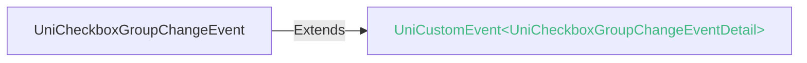

<!-- ## checkbox-group -->

::: sourceCode
## checkbox-group
:::

> 组件类型：UniCheckboxGroupElement 

 多选框组

给checkbox-group设置name属性后，内部包含的多个checkbox将以数组的方式统一提交表单。详见[form](./form.md)

### 兼容性
| Web | 微信小程序 | Android | iOS | HarmonyOS | HarmonyOS(Vapor) |
| :- | :- | :- | :- | :- | :- |
| 4.0 | 4.41 | 3.9 | 4.11 | 4.61 | 5.0 |

### 属性 
| 名称 | 类型 | 默认值 | 兼容性 | 描述 |
| :- | :- | :- |  :-: | :- |
| name | string | - | Web: 4.0; 微信小程序: 4.41; Android: 3.9; iOS: 4.11; HarmonyOS: 4.61; HarmonyOS(Vapor): 5.0 | 表单的控件名称，作为键值对的一部分与表单(form组件)一同提交 |
| @change | (event: [UniCheckboxGroupChangeEvent](#unicheckboxgroupchangeevent)) => void | - | Web: 4.0; 微信小程序: 4.41; Android: 3.9; iOS: 4.11; HarmonyOS: 4.61; HarmonyOS(Vapor): 5.0 | checkbox-group中选中项发生改变是触发 change 事件，detail = {value:\[选中的checkbox的value的数组] |

### 事件
#### UniCheckboxGroupChangeEvent

##### UniCheckboxGroupChangeEventDetail

###### UniCheckboxGroupChangeEventDetail 的属性值
| 名称 | 类型 | 必填 | 默认值 | 兼容性 | 描述 |
| :- | :- | :- | :- |  :-: | :- |
| value | Array&lt;string&gt; | 是 | - | - | - |

<!-- UTSCOMJSON.checkbox-group.component_type-->

### 子组件 @children-tags
| 子组件 | 兼容性 |
| :- | :- |
| [*](*.md) | Web: 4.0; 微信小程序: 4.41; Android: 3.9; iOS: 4.11; HarmonyOS: 4.61; HarmonyOS(Vapor): 5.0 |

### 参见
- [相关 Bug](https://issues.dcloud.net.cn/?mid=component.form-component.checkbox.checkbox-group)
- [参见uni-app相关文档](https://uniapp.dcloud.io/component/checkbox.html)
- [微信小程序文档](https://developers.weixin.qq.com/miniprogram/dev/component/checkbox-group.html)
- [支付宝小程序文档](https://open.alipay.com/portal/zhichi/search?keyword=checkbox-group&pageIndex=1&pageSize=10&source=doc_top&type=all)
- [百度小程序文档](https://smartprogram.baidu.com/forum/search?query=checkbox-group&scope=devdocs&source=docs)
- [抖音小程序文档](https://developer.open-douyin.com/search-page?keyword=checkbox-group&secondType=all&type=1)
- [飞书小程序文档](https://open.feishu.cn/search?from=header&page=1&pageSize=10&q=checkbox-group&topicFilter=)
- [钉钉小程序文档](https://open.dingtalk.com/search?keyword=checkbox-group)
- [QQ小程序文档](https://q.qq.com/wiki/develop/miniprogram/frame/)
- [快手小程序文档](https://developers.kuaishou.com/page?keyword=checkbox-group&from=docs)
- [京东小程序文档](https://mp-docs.jd.com/doc/dev/framework/-1)
- [华为快应用文档](https://developer.huawei.com/consumer/cn/doc/quickApp-References/webview-frame-overview-0000001124793625)
- [360小程序文档](https://mp.360.cn/doc/miniprogram/dev/#/b770a184ff1f06c6b3393a0fd1132380)
