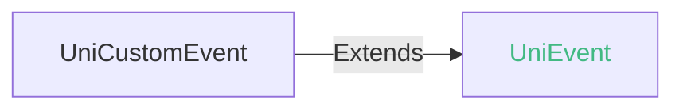
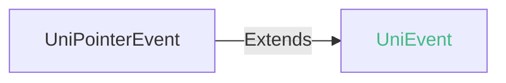
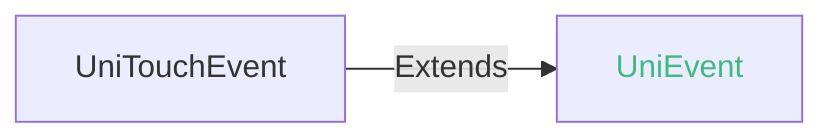
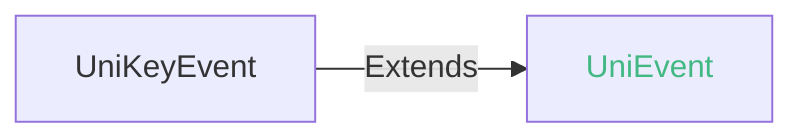
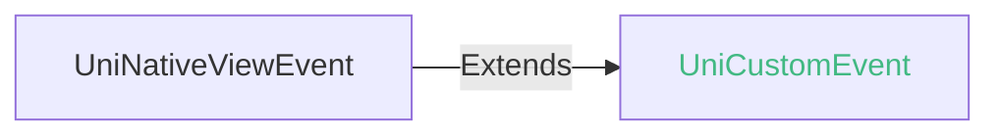

# 组件的全局属性和事件

每个组件都有属性和事件。有些属性和事件，是所有组件都支持的。

## 组件全局属性

| 名称 | 类型 | 兼容性 | 描述 |
| :- | :- | :- | :- |
| id | string(string.IDString) | Web: 4.0; 微信小程序: 4.41; Android: 3.9; iOS: 4.11; HarmonyOS: 4.61 | 组件的唯一标识。需避免同页面中不同组件设置重复id；需避免使用uni-、uni.等前缀 |
| style | string \| UTSJSONObject \| Array\<string \| UTSJSONObject> | Web: 4.0; 微信小程序: 4.41; Android: 3.9; iOS: 4.11; HarmonyOS: 4.61 | 组件的内联样式，可以动态设置的内联样式 |
| class | string(string.ClassString) \| UTSJSONObject \| Array\<string(string.ClassString) \| UTSJSONObject> | Web: 4.0; 微信小程序: 4.41; Android: 3.9; iOS: 4.11; HarmonyOS: 4.61 | 组件的样式类，在对应的 css 中定义的样式类 |
| ref | string \| Function | Web: 4.0; 微信小程序: 4.41; Android: 3.9; iOS: 4.11; HarmonyOS: 4.61 | vue中组件的唯一标识，用来给子组件注册引用信息，[详见](https://doc.dcloud.net.cn/uni-app-x/vue/built-in.html#ref) |
| data-* | any | Web: 4.0; 微信小程序: 4.41; Android: 3.9; iOS: 4.11; HarmonyOS: 4.61 | 自定义属性，组件上触发的事件时，会发送给事件处理函数 |
| android-* | any | Web: x; 微信小程序: -; Android: 3.9; iOS: x; HarmonyOS: x | App-Android平台专有属性，详见[App-Android平台专有属性](https://doc.dcloud.net.cn/uni-app-x/component/common.html#attribute-android)章节 |


### App-Android平台专有属性@attribute-android

> android-开头的属性名称为App-Android平台专有属性

#### android-layer-type <Badge text="HBuilderX 4.01+"/>

> 不支持动态修改此属性
>
> 更多信息可参考Android官方文档[硬件加速](https://developer.android.google.cn/topic/performance/hardware-accel?hl=zh-cn)。

App-Android平台设置组件视图渲染模型，字符串类型，可取值：
- "hardware": 视图在硬件中渲染为硬件纹理
- "software": 视图在软件中渲染为位图
- "none": 视图正常渲染，不使用缓冲区
默认值为"none"。

::: tip Tips
- 不建议对所有的组件设置`hardware`，大量的视图在硬件中渲染会占用巨大的显存开销、增加Android原生渲染的复杂度。
- 不建议对频繁修改的组件设置`hardware`，频繁修改的会增加硬件的缓存更新。
- 通过[DrawableContext](../dom/drawablecontext.md)或其他方式绘制复杂图形时，建议设置为`hardware`。
- 执行复杂动画或大量动画时，建议设置为`hardware`。
- 由于安卓原生限制，当设置`android-layer-type`为`hardware`或`software`时，`overflow: visible`不生效。
:::

::: warning 注意
- App-Android 平台，`4.61+` `style` 支持 `UTSJSONObject` 类型。
:::

### 示例 
 示例为[hello uni-app x alpha分支](https://gitcode.com/dcloud/hello-uni-app-x/blob/prod_alpha/pages/component/global-properties/global-properties.uvue)，与最新HBuilderX Alpha版同步。与最新正式版同步的master分支示例[另见](https://gitcode.com/dcloud/hello-uni-app-x/blob/master//pages/component/global-properties/global-properties.uvue) 
::: preview https://hellouniappx.dcloud.net.cn/web/#/pages/component/global-properties/global-properties

> appRedirect https://hellouniappx.dcloud.net.cn/appredirect.html?path=pages/component/global-properties/global-properties

>示例
```vue
<template>
  <!-- #ifdef APP -->
  <scroll-view style="flex: 1">
  <!-- #endif -->
    <view>
      <page-head title="global-properties"></page-head>
      <view class="uni-padding-wrap">
        <view :id="generalId" :class="generalClass"
          <!-- #ifdef !VUE3-VAPOR-->
          :data-test="generalData"
          <!-- #endif-->
          :style="generalStyle" ref="generalTargetRef">
          <text>id: {{ generalId }}</text>
          <text>class: {{ generalClass }}</text>
          <text>data-test: {{ generalData }}</text>
          <text>style: {{ generalStyle }}</text>
        </view>
        <view class="btn btn-style uni-common-mt" @click="validateGeneralAttributes">
          <text class="btn-inner">{{ validateGeneralAttrText }}</text>
        </view>
        <view class="btn btn-ref uni-common-mt" @click="changeHeight">
          <text class="btn-inner">{{ changeHeightByRefText }}</text>
        </view>
        <view class="view-class" :hover-class="hoverClass" ref="viewTargetRef">
          <text class="text">按下 50 ms 后背景变红</text>
          <text class="text">抬起 400 ms 后背景恢复</text>
        </view>
        <view class="view-class" :hover-class="hoverClass" :hover-start-time="1000" :hover-stay-time="1000"
          ref="viewTargetRef">
          <text class="text">按下 1000 ms 后背景变红</text>
          <text class="text">抬起 1000 ms 后背景恢复</text>
        </view>
      </view>
    </view>
  <!-- #ifdef APP -->
  </scroll-view>
  <!-- #endif -->
</template>

<script setup lang="uts">
  const generalId = ref('general-id')
  const generalClass = ref('general-class')
  const generalData = ref('general-data')
  const generalStyle = ref('background-color: aqua')
  const validateGeneralAttrText = ref('验证基础属性')
  const hoverClass = ref('hover-class')
  const validateViewAttrText = ref('验证 view 属性')
  const changeHeightByRefText = ref('通过 ref 修改高度')

  const generalTargetRef = ref<UniElement | null>(null)
  const viewTargetRef = ref<UniElement | null>(null)

  const validateGeneralAttributes = () => {
    const generalTargetElement = generalTargetRef.value as UniElement
    const generalIdValue = generalTargetElement.getAttribute('id')
    if (generalIdValue != generalId.value) {
      validateGeneralAttrText.value = '基础属性 id 验证失败'
      return
    }
    // #ifdef APP
    if (!generalTargetElement.classList.includes('general-class')) {
      validateGeneralAttrText.value = '基础属性 class 验证失败'
      return
    }
    // #endif
    // #ifdef WEB
    if (!Array.from(generalTargetElement.classList).includes('general-class')) {
      validateGeneralAttrText.value = '基础属性 class 验证失败'
      return
    }
    // #endif
    // #ifndef MP
    // #ifdef !VUE3-VAPOR
    // TODO: vapor模式暂未实现data-xxx属性获取，后续需补充并放开测试
    const generalDataValue = generalTargetElement.getAttribute('data-test')
    if (generalDataValue != generalData.value) {
      validateGeneralAttrText.value = '基础属性 data-test 验证失败'
      return
    }
    // #endif
    // #endif
    validateGeneralAttrText.value = '基础属性验证成功'
  }

  const changeHeight = () => {
    const generalTargetElement = generalTargetRef.value as UniElement
    changeHeightByRefText.value = '已通过 ref 修改高度'
    generalTargetElement.style.setProperty('height', '200px')
  }

</script>

<style>
  .btn {
    height: 50px;
    display: flex;
    align-items: center;
    justify-content: center;
    background-color: #409eff;
    border-radius: 5px;
  }

  .btn-inner {
    color: #fff;
  }

  .general-class {
    margin-left: 40px;
    padding: 10px;
    width: 260px;
    height: 160px;
    background-color: antiquewhite;
  }

  .view-class {
    margin: 20px 0 0 50px;
    padding: 10px;
    width: 240px;
    height: 100px;
    background-color: antiquewhite;
  }

  .text {
    margin-top: 5px;
    text-align: center;
  }

  .hover-class {
    background-color: red;
  }
</style>

```

:::

### 参见

- [相关 Bug](https://issues.dcloud.net.cn/?mid=component.global-properties-events.global-properties)

## 组件全局事件

| 名称 | 类型 | 兼容性 | 描述 |
| :- | :- | :- | :- |
| @click | (event: [UniPointerEvent](/component/common.md#unipointerevent)) => void | Web: 4.0; 微信小程序: 4.41; Android: 3.9; iOS: 4.11; HarmonyOS: 4.61 | 手指触摸后马上离开。与tap相同，（推荐使用tap事件代替），冒泡事件 |
| @mousedown | (event: [UniMouseEvent](/component/common.md#unimouseevent)) => void | Web: 4.0; 微信小程序: -; Android: x; iOS: x; HarmonyOS: x | 鼠标在元素上点击后触发 |
| @mousemove | (event: [UniMouseEvent](/component/common.md#unimouseevent)) => void | Web: 4.0; 微信小程序: -; Android: x; iOS: x; HarmonyOS: x | 鼠标在元素上移动时触发 |
| @mouseup | (event: [UniMouseEvent](/component/common.md#unimouseevent)) => void | Web: 4.0; 微信小程序: -; Android: x; iOS: x; HarmonyOS: x | 鼠标主按钮在元素上松开时触发 |
| @touchstart | (event: [UniTouchEvent](/component/common.md#unitouchevent)) => void | Web: 4.0; 微信小程序: 4.41; Android: 3.9; iOS: 4.11; HarmonyOS: 4.61 | 手指触摸动作开始，冒泡事件，event.type 值为 touchstart |
| @touchmove | (event: [UniTouchEvent](/component/common.md#unitouchevent)) => void | Web: 4.0; 微信小程序: 4.41; Android: 3.9; iOS: 4.11; HarmonyOS: 4.61 | 手指触摸后移动，冒泡事件，event.type 值为 touchmove |
| @touchcancel | (event: [UniTouchEvent](/component/common.md#unitouchevent)) => void | Web: 4.0; 微信小程序: 4.41; Android: 3.9; iOS: 4.11; HarmonyOS: 4.61 | 手指触摸动作被打断，如来电提醒，弹窗，冒泡事件，event.type 值为 touchcancel |
| @touchend | (event: [UniTouchEvent](/component/common.md#unitouchevent)) => void | Web: 4.0; 微信小程序: 4.41; Android: 3.9; iOS: 4.11; HarmonyOS: 4.61 | 手指触摸动作结束，冒泡事件，event.type 值为 touchend |
| @tap | (event: [UniPointerEvent](/component/common.md#unipointerevent)) => void | Web: 4.0; 微信小程序: 4.41; Android: 3.9; iOS: 4.11; HarmonyOS: 4.61 | 手指触摸后马上离开，冒泡事件 |
| @longpress | (event: [UniTouchEvent](/component/common.md#unitouchevent)) => void | Web: 4.0; 微信小程序: 4.41; Android: 3.9; iOS: 4.11; HarmonyOS: 4.61 | 如果一个组件被绑定了 longpress 事件，那么当用户手指触摸后，超过350ms再离开会触发，冒泡事件 |
| @longtap | (event: [UniTouchEvent](/component/common.md#unitouchevent)) => void | Web: 4.0; 微信小程序: 4.41; Android: 3.9; iOS: 4.11; HarmonyOS: 4.61 | 手指触摸后，超过350ms再离开（推荐使用 longpress 事件代替） |
| @transitionend | (event: [UniEvent](/component/common.md#unievent)) => void | Web: 4.0; 微信小程序: 4.41; Android: 3.93; iOS: 4.11; HarmonyOS: 4.61 | transition 效果结束时触发 |
| @fullscreenchange | (event: [UniEvent](/component/common.md#unievent)) => void | Web: x; 微信小程序: x; Android: 4.61; iOS: 4.61; HarmonyOS: 4.61 | 进入或退出全屏模式时触发 |
| @fullscreenerror | (event: [UniEvent](/component/common.md#unievent)) => void | Web: x; 微信小程序: x; Android: 4.61; iOS: 4.61; HarmonyOS: 4.61 | 进入或退出全屏模式失败时触发 |


### 示例 
 示例为[hello uni-app x alpha分支](https://gitcode.com/dcloud/hello-uni-app-x/blob/prod_alpha/pages/component/global-events/global-events.uvue)，与最新HBuilderX Alpha版同步。与最新正式版同步的master分支示例[另见](https://gitcode.com/dcloud/hello-uni-app-x/blob/master//pages/component/global-events/global-events.uvue) 
::: preview https://hellouniappx.dcloud.net.cn/web/#/pages/component/global-events/global-events

> appRedirect https://hellouniappx.dcloud.net.cn/appredirect.html?path=pages/component/global-events/global-events

>示例
```vue
<template>
  <!-- #ifdef APP -->
  <scroll-view style="flex: 1">
  <!-- #endif -->
    <page-head title="组件全局事件示例"></page-head>
    <view class="uni-padding-wrap uni-common-mt container">
      <view class="section">
        <text class="section-title">触摸事件区域：touchstart/touchmove/touchend/touchcancel</text>
        <text class="section-desc">在下方蓝色区域滑动查看触摸事件详情</text>
        <view class="target touch-area" id="touch-target" @touchstart="onTouchStart" @touchcancel="onTouchCancel"
          @touchmove="onTouchMove" @touchend="onTouchEnd">
          <text class="target-text">在此区域滑动</text>
        </view>
      </view>

      <view class="section">
        <text class="section-title">点击/长按事件区域：tap/click/longpress</text>
        <text class="section-desc">点击或长按下方绿色区域查看事件详情</text>
        <view class="target click-area" id="longpress-target" @tap="onTap" @click="onClick" @longpress="onLongPress">
          <text class="target-text">点击或长按</text>
        </view>
      </view>

      <view class="section" v-if="touchStartEvent !== null || touchMoveEvent !== null || touchEndEvent !== null || touchCancelEvent !== null || tapEvent !== null || clickEvent !== null || longPressEvent !== null">
        <view class="clear-btn-wrapper">
          <button class="clear-btn" @click="clearAllEvents">清除所有事件</button>
        </view>
      </view>
      <view v-if="touchStartEvent !== null" class="event-detail">
        <text class="event-title">touchStart Event（触摸开始事件）</text>
        <view class="event-base-info">
          <text class="info-title">UniEvent 基础属性:</text>
          <view class="info-row">
            <text class="info-label">event.type (事件类型):</text>
            <text class="info-value">{{ touchStartEvent!.type }}</text>
          </view>
          <view class="info-row">
            <text class="info-label">event.bubbles (是否冒泡):</text>
            <text class="info-value">{{ touchStartEvent!.bubbles }}</text>
          </view>
          <view class="info-row">
            <text class="info-label">event.cancelable (是否可取消):</text>
            <text class="info-value">{{ touchStartEvent!.cancelable }}</text>
          </view>
          <view class="info-row">
            <text class="info-label">event.timeStamp (时间戳):</text>
            <text class="info-value">{{ touchStartEvent!.timeStamp }}</text>
          </view>
        </view>
        <text class="touches-title">event.touches (当前所有触摸点):</text>
        <template v-for="(touch, index) in touchStartEvent!.touches" :key="index">
          <view class="touch-item">
            <text class="touch-index">event.touches[{{ index }}]:</text>
            <view class="touch-props">
              <view class="prop-row">
                <text class="prop-label">  .identifier (触摸点标识符):</text>
                <text class="prop-value" id="touch-start-touch-identifier">{{ touch.identifier }}</text>
              </view>
              <view class="prop-row">
                <text class="prop-label">  .pageX (相对于页面左边,含滚动):</text>
                <text class="prop-value" id="touch-start-touch-page-x">{{ touch.pageX }}</text>
              </view>
              <view class="prop-row">
                <text class="prop-label">  .pageY (相对于页面顶部,含滚动):</text>
                <text class="prop-value" id="touch-start-touch-page-y">{{ touch.pageY }}</text>
              </view>
              <view class="prop-row">
                <text class="prop-label">  .clientX (相对于可视区域左边):</text>
                <text class="prop-value" id="touch-start-touch-client-x">{{ touch.clientX }}</text>
              </view>
              <view class="prop-row">
                <text class="prop-label">  .clientY (相对于可视区域顶部):</text>
                <text class="prop-value" id="touch-start-touch-client-y">{{ touch.clientY }}</text>
              </view>
              <view class="prop-row">
                <text class="prop-label">  .screenX (相对于屏幕左边,不含滚动):</text>
                <text class="prop-value" id="touch-start-touch-screen-x">{{ touch.screenX }}</text>
              </view>
              <view class="prop-row">
                <text class="prop-label">  .screenY (相对于屏幕顶部,不含滚动):</text>
                <text class="prop-value" id="touch-start-touch-screen-y">{{ touch.screenY }}</text>
              </view>
              <view class="prop-row">
                <text class="prop-label">  .force (触摸点的压力大小):</text>
                <text class="prop-value" id="touch-start-touch-force">{{ touch.force }}</text>
              </view>
            </view>
          </view>
        </template>
        <text class="touches-title">event.changedTouches (变化的触摸点):</text>
        <template v-for="(touch, index) in touchStartEvent!.changedTouches" :key="index">
          <view class="touch-item">
            <text class="touch-index">event.changedTouches[{{ index }}]:</text>
            <view class="touch-props">
              <view class="prop-row">
                <text class="prop-label">  .identifier:</text>
                <text class="prop-value" id="touch-start-changed-touch-identifier">{{ touch.identifier }}</text>
              </view>
              <view class="prop-row">
                <text class="prop-label">  .pageX:</text>
                <text class="prop-value" id="touch-start-changed-touch-page-x">{{ touch.pageX }}</text>
              </view>
              <view class="prop-row">
                <text class="prop-label">  .pageY:</text>
                <text class="prop-value" id="touch-start-changed-touch-page-y">{{ touch.pageY }}</text>
              </view>
              <view class="prop-row">
                <text class="prop-label">  .clientX:</text>
                <text class="prop-value" id="touch-start-changed-touch-client-x">{{ touch.clientX }}</text>
              </view>
              <view class="prop-row">
                <text class="prop-label">  .clientY:</text>
                <text class="prop-value" id="touch-start-changed-touch-client-y">{{ touch.clientY }}</text>
              </view>
              <view class="prop-row">
                <text class="prop-label">  .screenX:</text>
                <text class="prop-value" id="touch-start-changed-touch-screen-x">{{ touch.screenX }}</text>
              </view>
              <view class="prop-row">
                <text class="prop-label">  .screenY:</text>
                <text class="prop-value" id="touch-start-changed-touch-screen-y">{{ touch.screenY }}</text>
              </view>
              <view class="prop-row">
                <text class="prop-label">  .force:</text>
                <text class="prop-value" id="touch-start-changed-touch-force">{{ touch.force }}</text>
              </view>
            </view>
          </view>
        </template>
      </view>
      <view v-if="touchCancelEvent !== null" class="event-detail">
        <text class="event-title">touchCancel Event（触摸取消事件）</text>
        <view class="event-base-info">
          <text class="info-title">UniEvent 基础属性:</text>
          <view class="info-row">
            <text class="info-label">event.type (事件类型):</text>
            <text class="info-value">{{ touchCancelEvent!.type }}</text>
          </view>
          <view class="info-row">
            <text class="info-label">event.bubbles (是否冒泡):</text>
            <text class="info-value">{{ touchCancelEvent!.bubbles }}</text>
          </view>
          <view class="info-row">
            <text class="info-label">event.cancelable (是否可取消):</text>
            <text class="info-value">{{ touchCancelEvent!.cancelable }}</text>
          </view>
          <view class="info-row">
            <text class="info-label">event.timeStamp (时间戳):</text>
            <text class="info-value">{{ touchCancelEvent!.timeStamp }}</text>
          </view>
        </view>
        <text class="touches-title">event.touches (当前所有触摸点):</text>
        <template v-for="(touch, index) in touchCancelEvent!.touches" :key="index">
          <view class="touch-item">
            <text class="touch-index">event.touches[{{ index }}]:</text>
            <view class="touch-props">
              <view class="prop-row">
                <text class="prop-label">  .identifier (触摸点标识符):</text>
                <text class="prop-value" id="touch-cancel-touch-identifier">{{
              touch.identifier
            }}</text>
              </view>
              <view class="prop-row">
                <text class="prop-label">  .pageX (相对于页面左边,含滚动):</text>
                <text class="prop-value" id="touch-cancel-touch-page-x">{{ touch.pageX }}</text>
              </view>
              <view class="prop-row">
                <text class="prop-label">  .pageY (相对于页面顶部,含滚动):</text>
                <text class="prop-value" id="touch-cancel-touch-page-y">{{ touch.pageY }}</text>
              </view>
              <view class="prop-row">
                <text class="prop-label">  .clientX (相对于可视区域左边):</text>
                <text class="prop-value" id="touch-cancel-touch-client-x">{{ touch.clientX }}</text>
              </view>
              <view class="prop-row">
                <text class="prop-label">  .clientY (相对于可视区域顶部):</text>
                <text class="prop-value" id="touch-cancel-touch-client-y">{{ touch.clientY }}</text>
              </view>
              <view class="prop-row">
                <text class="prop-label">  .screenX (相对于屏幕左边,不含滚动):</text>
                <text class="prop-value" id="touch-cancel-touch-screen-x">{{ touch.screenX }}</text>
              </view>
              <view class="prop-row">
                <text class="prop-label">  .screenY (相对于屏幕顶部,不含滚动):</text>
                <text class="prop-value" id="touch-cancel-touch-screen-y">{{ touch.screenY }}</text>
              </view>
              <view class="prop-row">
                <text class="prop-label">  .force (触摸点的压力大小):</text>
                <text class="prop-value" id="touch-cancel-touch-force">{{ touch.force }}</text>
              </view>
            </view>
          </view>
        </template>
        <text class="touches-title">event.changedTouches (变化的触摸点):</text>
        <template v-for="(touch, index) in touchCancelEvent!.changedTouches" :key="index">
          <view class="touch-item">
            <text class="touch-index">event.changedTouches[{{ index }}]:</text>
            <view class="touch-props">
              <view class="prop-row">
                <text class="prop-label">  .identifier:</text>
                <text class="prop-value" id="touch-cancel-changed-touch-identifier">{{
              touch.identifier
            }}</text>
              </view>
              <view class="prop-row">
                <text class="prop-label">  .pageX:</text>
                <text class="prop-value" id="touch-cancel-changed-touch-page-x">{{
              touch.pageX
            }}</text>
              </view>
              <view class="prop-row">
                <text class="prop-label">  .pageY:</text>
                <text class="prop-value" id="touch-cancel-changed-touch-page-y">{{
              touch.pageY
            }}</text>
              </view>
              <view class="prop-row">
                <text class="prop-label">  .clientX:</text>
                <text class="prop-value" id="touch-cancel-changed-touch-client-x">{{
              touch.clientX
            }}</text>
              </view>
              <view class="prop-row">
                <text class="prop-label">  .clientY:</text>
                <text class="prop-value" id="touch-cancel-changed-touch-client-y">{{
              touch.clientY
            }}</text>
              </view>
              <view class="prop-row">
                <text class="prop-label">  .screenX:</text>
                <text class="prop-value" id="touch-cancel-changed-touch-screen-x">{{
              touch.screenX
            }}</text>
              </view>
              <view class="prop-row">
                <text class="prop-label">  .screenY:</text>
                <text class="prop-value" id="touch-cancel-changed-touch-screen-y">{{
              touch.screenY
            }}</text>
              </view>
              <view class="prop-row">
                <text class="prop-label">  .force:</text>
                <text class="prop-value" id="touch-cancel-changed-touch-force">{{
              touch.force
            }}</text>
              </view>
            </view>
          </view>
        </template>
      </view>
      <view v-if="touchMoveEvent !== null" class="event-detail">
        <text class="event-title">touchMove Event（触摸移动事件）</text>
        <view class="event-base-info">
          <text class="info-title">UniEvent 基础属性:</text>
          <view class="info-row">
            <text class="info-label">event.type (事件类型):</text>
            <text class="info-value">{{ touchMoveEvent!.type }}</text>
          </view>
          <view class="info-row">
            <text class="info-label">event.bubbles (是否冒泡):</text>
            <text class="info-value">{{ touchMoveEvent!.bubbles }}</text>
          </view>
          <view class="info-row">
            <text class="info-label">event.cancelable (是否可取消):</text>
            <text class="info-value">{{ touchMoveEvent!.cancelable }}</text>
          </view>
          <view class="info-row">
            <text class="info-label">event.timeStamp (时间戳):</text>
            <text class="info-value">{{ touchMoveEvent!.timeStamp }}</text>
          </view>
        </view>
        <text class="touches-title">event.touches (当前所有触摸点):</text>
        <template v-for="(touch, index) in touchMoveEvent!.touches" :key="index">
          <view class="touch-item">
            <text class="touch-index">event.touches[{{ index }}]:</text>
            <view class="touch-props">
              <view class="prop-row">
                <text class="prop-label">  .identifier (触摸点标识符):</text>
                <text class="prop-value" id="touch-move-touch-identifier">{{ touch.identifier }}</text>
              </view>
              <view class="prop-row">
                <text class="prop-label">  .pageX (相对于页面左边,含滚动):</text>
                <text class="prop-value" id="touch-move-touch-page-x">{{ touch.pageX }}</text>
              </view>
              <view class="prop-row">
                <text class="prop-label">  .pageY (相对于页面顶部,含滚动):</text>
                <text class="prop-value" id="touch-move-touch-page-y">{{ touch.pageY }}</text>
              </view>
              <view class="prop-row">
                <text class="prop-label">  .clientX (相对于可视区域左边):</text>
                <text class="prop-value" id="touch-move-touch-client-x">{{ touch.clientX }}</text>
              </view>
              <view class="prop-row">
                <text class="prop-label">  .clientY (相对于可视区域顶部):</text>
                <text class="prop-value" id="touch-move-touch-client-y">{{ touch.clientY }}</text>
              </view>
              <view class="prop-row">
                <text class="prop-label">  .screenX (相对于屏幕左边,不含滚动):</text>
                <text class="prop-value" id="touch-move-touch-screen-x">{{ touch.screenX }}</text>
              </view>
              <view class="prop-row">
                <text class="prop-label">  .screenY (相对于屏幕顶部,不含滚动):</text>
                <text class="prop-value" id="touch-move-touch-screen-y">{{ touch.screenY }}</text>
              </view>
              <view class="prop-row">
                <text class="prop-label">  .force (触摸点的压力大小):</text>
                <text class="prop-value" id="touch-move-touch-force">{{ touch.force }}</text>
              </view>
            </view>
          </view>
        </template>
        <text class="touches-title">event.changedTouches (变化的触摸点):</text>
        <template v-for="(touch, index) in touchMoveEvent!.changedTouches" :key="index">
          <view class="touch-item">
            <text class="touch-index">event.changedTouches[{{ index }}]:</text>
            <view class="touch-props">
              <view class="prop-row">
                <text class="prop-label">  .identifier:</text>
                <text class="prop-value" id="touch-move-changed-touch-identifier">{{ touch.identifier }}</text>
              </view>
              <view class="prop-row">
                <text class="prop-label">  .pageX:</text>
                <text class="prop-value" id="touch-move-changed-touch-page-x">{{ touch.pageX }}</text>
              </view>
              <view class="prop-row">
                <text class="prop-label">  .pageY:</text>
                <text class="prop-value" id="touch-move-changed-touch-page-y">{{ touch.pageY }}</text>
              </view>
              <view class="prop-row">
                <text class="prop-label">  .clientX:</text>
                <text class="prop-value" id="touch-move-changed-touch-client-x">{{ touch.clientX }}</text>
              </view>
              <view class="prop-row">
                <text class="prop-label">  .clientY:</text>
                <text class="prop-value" id="touch-move-changed-touch-client-y">{{ touch.clientY }}</text>
              </view>
              <view class="prop-row">
                <text class="prop-label">  .screenX:</text>
                <text class="prop-value" id="touch-move-changed-touch-screen-x">{{ touch.screenX }}</text>
              </view>
              <view class="prop-row">
                <text class="prop-label">  .screenY:</text>
                <text class="prop-value" id="touch-move-changed-touch-screen-y">{{ touch.screenY }}</text>
              </view>
              <view class="prop-row">
                <text class="prop-label">  .force:</text>
                <text class="prop-value" id="touch-move-changed-touch-force">{{ touch.force }}</text>
              </view>
            </view>
          </view>
        </template>
      </view>
      <view v-if="touchEndEvent !== null" class="event-detail">
        <text class="event-title">touchEnd Event（触摸结束事件）</text>
        <view class="event-base-info">
          <text class="info-title">UniEvent 基础属性:</text>
          <view class="info-row">
            <text class="info-label">event.type (事件类型):</text>
            <text class="info-value">{{ touchEndEvent!.type }}</text>
          </view>
          <view class="info-row">
            <text class="info-label">event.bubbles (是否冒泡):</text>
            <text class="info-value">{{ touchEndEvent!.bubbles }}</text>
          </view>
          <view class="info-row">
            <text class="info-label">event.cancelable (是否可取消):</text>
            <text class="info-value">{{ touchEndEvent!.cancelable }}</text>
          </view>
          <view class="info-row">
            <text class="info-label">event.timeStamp (时间戳):</text>
            <text class="info-value">{{ touchEndEvent!.timeStamp }}</text>
          </view>
        </view>
        <text class="touches-title">event.touches (当前所有触摸点):</text>
        <template v-for="(touch, index) in touchEndEvent!.touches" :key="index">
          <view class="touch-item">
            <text class="touch-index">event.touches[{{ index }}]:</text>
            <view class="touch-props">
              <view class="prop-row">
                <text class="prop-label">  .identifier (触摸点标识符):</text>
                <text class="prop-value" id="touch-end-touch-identifier">{{ touch.identifier }}</text>
              </view>
              <view class="prop-row">
                <text class="prop-label">  .pageX (相对于页面左边,含滚动):</text>
                <text class="prop-value" id="touch-end-touch-page-x">{{ touch.pageX }}</text>
              </view>
              <view class="prop-row">
                <text class="prop-label">  .pageY (相对于页面顶部,含滚动):</text>
                <text class="prop-value" id="touch-end-touch-page-y">{{ touch.pageY }}</text>
              </view>
              <view class="prop-row">
                <text class="prop-label">  .clientX (相对于可视区域左边):</text>
                <text class="prop-value" id="touch-end-touch-client-x">{{ touch.clientX }}</text>
              </view>
              <view class="prop-row">
                <text class="prop-label">  .clientY (相对于可视区域顶部):</text>
                <text class="prop-value" id="touch-end-touch-client-y">{{ touch.clientY }}</text>
              </view>
              <view class="prop-row">
                <text class="prop-label">  .screenX (相对于屏幕左边,不含滚动):</text>
                <text class="prop-value" id="touch-end-touch-screen-x">{{ touch.screenX }}</text>
              </view>
              <view class="prop-row">
                <text class="prop-label">  .screenY (相对于屏幕顶部,不含滚动):</text>
                <text class="prop-value" id="touch-end-touch-screen-y">{{ touch.screenY }}</text>
              </view>
              <view class="prop-row">
                <text class="prop-label">  .force (触摸点的压力大小):</text>
                <text class="prop-value" id="touch-end-touch-force">{{ touch.force }}</text>
              </view>
            </view>
          </view>
        </template>
        <text class="touches-title">event.changedTouches (变化的触摸点):</text>
        <template v-for="(touch, index) in touchEndEvent!.changedTouches" :key="index">
          <view class="touch-item">
            <text class="touch-index">event.changedTouches[{{ index }}]:</text>
            <view class="touch-props">
              <view class="prop-row">
                <text class="prop-label">  .identifier:</text>
                <text class="prop-value" id="touch-end-changed-touch-identifier">{{ touch.identifier }}</text>
              </view>
              <view class="prop-row">
                <text class="prop-label">  .pageX:</text>
                <text class="prop-value" id="touch-end-changed-touch-page-x">{{ touch.pageX }}</text>
              </view>
              <view class="prop-row">
                <text class="prop-label">  .pageY:</text>
                <text class="prop-value" id="touch-end-changed-touch-page-y">{{ touch.pageY }}</text>
              </view>
              <view class="prop-row">
                <text class="prop-label">  .clientX:</text>
                <text class="prop-value" id="touch-end-changed-touch-client-x">{{ touch.clientX }}</text>
              </view>
              <view class="prop-row">
                <text class="prop-label">  .clientY:</text>
                <text class="prop-value" id="touch-end-changed-touch-client-y">{{ touch.clientY }}</text>
              </view>
              <view class="prop-row">
                <text class="prop-label">  .screenX:</text>
                <text class="prop-value" id="touch-end-changed-touch-screen-x">{{ touch.screenX }}</text>
              </view>
              <view class="prop-row">
                <text class="prop-label">  .screenY:</text>
                <text class="prop-value" id="touch-end-changed-touch-screen-y">{{ touch.screenY }}</text>
              </view>
              <view class="prop-row">
                <text class="prop-label">  .force:</text>
                <text class="prop-value" id="touch-end-changed-touch-force">{{ touch.force }}</text>
              </view>
            </view>
          </view>
        </template>
      </view>
      <view v-if="longPressEvent !== null" class="event-detail">
        <text class="event-title">longPress Event（长按事件）</text>
        <view class="event-base-info">
          <text class="info-title">UniEvent 基础属性:</text>
          <view class="info-row">
            <text class="info-label">event.type (事件类型):</text>
            <text class="info-value">{{ longPressEvent!.type }}</text>
          </view>
          <view class="info-row">
            <text class="info-label">event.bubbles (是否冒泡):</text>
            <text class="info-value">{{ longPressEvent!.bubbles }}</text>
          </view>
          <view class="info-row">
            <text class="info-label">event.cancelable (是否可取消):</text>
            <text class="info-value">{{ longPressEvent!.cancelable }}</text>
          </view>
          <view class="info-row">
            <text class="info-label">event.timeStamp (时间戳):</text>
            <text class="info-value">{{ longPressEvent!.timeStamp }}</text>
          </view>
        </view>
        <text class="touches-title">event.touches (当前所有触摸点):</text>
        <template v-for="(touch, index) in longPressEvent!.touches"
          :key="index">
          <view class="touch-item">
            <text class="touch-index">event.touches[{{ index }}]:</text>
            <view class="touch-props">
              <view class="prop-row">
                <text class="prop-label">  .identifier (触摸点标识符):</text>
                <text class="prop-value" id="long-press-touch-identifier">{{ touch.identifier }}</text>
              </view>
              <view class="prop-row">
                <text class="prop-label">  .pageX (相对于页面左边,含滚动):</text>
                <text class="prop-value" id="long-press-touch-page-x">{{ touch.pageX }}</text>
              </view>
              <view class="prop-row">
                <text class="prop-label">  .pageY (相对于页面顶部,含滚动):</text>
                <text class="prop-value" id="long-press-touch-page-y">{{ touch.pageY }}</text>
              </view>
              <view class="prop-row">
                <text class="prop-label">  .clientX (相对于可视区域左边):</text>
                <text class="prop-value" id="long-press-touch-client-x">{{ touch.clientX }}</text>
              </view>
              <view class="prop-row">
                <text class="prop-label">  .clientY (相对于可视区域顶部):</text>
                <text class="prop-value" id="long-press-touch-client-y">{{ touch.clientY }}</text>
              </view>
              <view class="prop-row">
                <text class="prop-label">  .screenX (相对于屏幕左边,不含滚动):</text>
                <text class="prop-value" id="long-press-touch-screen-x">{{ touch.screenX }}</text>
              </view>
              <view class="prop-row">
                <text class="prop-label">  .screenY (相对于屏幕顶部,不含滚动):</text>
                <text class="prop-value" id="long-press-touch-screen-y">{{ touch.screenY }}</text>
              </view>
              <view class="prop-row">
                <text class="prop-label">  .force (触摸点的压力大小):</text>
                <text class="prop-value" id="long-press-touch-force">{{ touch.force }}</text>
              </view>
            </view>
          </view>
        </template>
        <text class="touches-title">event.changedTouches (变化的触摸点):</text>
        <template v-for="(touch, index) in longPressEvent!.changedTouches" :key="index">
          <view class="touch-item">
            <text class="touch-index">event.changedTouches[{{ index }}]:</text>
            <view class="touch-props">
              <view class="prop-row">
                <text class="prop-label">  .identifier:</text>
                <text class="prop-value" id="long-press-changed-touch-identifier">{{
              touch.identifier
            }}</text>
              </view>
              <view class="prop-row">
                <text class="prop-label">  .pageX:</text>
                <text class="prop-value" id="long-press-changed-touch-page-x">{{ touch.pageX }}</text>
              </view>
              <view class="prop-row">
                <text class="prop-label">  .pageY:</text>
                <text class="prop-value" id="long-press-changed-touch-page-y">{{ touch.pageY }}</text>
              </view>
              <view class="prop-row">
                <text class="prop-label">  .clientX:</text>
                <text class="prop-value" id="long-press-changed-touch-client-x">{{
              touch.clientX
            }}</text>
              </view>
              <view class="prop-row">
                <text class="prop-label">  .clientY:</text>
                <text class="prop-value" id="long-press-changed-touch-client-y">{{
              touch.clientY
            }}</text>
              </view>
              <view class="prop-row">
                <text class="prop-label">  .screenX:</text>
                <text class="prop-value" id="long-press-changed-touch-screen-x">{{
              touch.screenX
            }}</text>
              </view>
              <view class="prop-row">
                <text class="prop-label">  .screenY:</text>
                <text class="prop-value" id="long-press-changed-touch-screen-y">{{
              touch.screenY
            }}</text>
              </view>
              <view class="prop-row">
                <text class="prop-label">  .force:</text>
                <text class="prop-value" id="long-press-changed-touch-force">{{
              touch.force
            }}</text>
              </view>
            </view>
          </view>
        </template>
      </view>
      <view v-if="tapEvent !== null" class="event-detail">
        <text class="event-title">tap Event（点击事件）</text>
        <view class="event-base-info">
          <text class="info-title">UniEvent 基础属性:</text>
          <view class="info-row">
            <text class="info-label">event.type (事件类型):</text>
            <text class="info-value">{{ tapEvent!.type }}</text>
          </view>
          <view class="info-row">
            <text class="info-label">event.bubbles (是否冒泡):</text>
            <text class="info-value">{{ tapEvent!.bubbles }}</text>
          </view>
          <view class="info-row">
            <text class="info-label">event.cancelable (是否可取消):</text>
            <text class="info-value">{{ tapEvent!.cancelable }}</text>
          </view>
          <view class="info-row">
            <text class="info-label">event.timeStamp (时间戳):</text>
            <text class="info-value">{{ tapEvent!.timeStamp }}</text>
          </view>
        </view>
        <view class="event-base-info">
          <text class="info-title">PointerEvent 位置信息:</text>
          <view class="info-row">
            <text class="info-label">event.x (同clientX):</text>
            <text class="info-value" id="tap-event-x">{{ tapEvent!.x }}</text>
          </view>
          <view class="info-row">
            <text class="info-label">event.y (同clientY):</text>
            <text class="info-value" id="tap-event-y">{{ tapEvent!.y }}</text>
          </view>
          <view class="info-row">
            <text class="info-label">event.clientX (相对于可视区域左边):</text>
            <text class="info-value">{{ tapEvent!.clientX }}</text>
          </view>
          <view class="info-row">
            <text class="info-label">event.clientY (相对于可视区域顶部):</text>
            <text class="info-value">{{ tapEvent!.clientY }}</text>
          </view>
          <view class="info-row">
            <text class="info-label">event.pageX (相对于页面左边,含滚动):</text>
            <text class="info-value">{{ tapEvent!.pageX }}</text>
          </view>
          <view class="info-row">
            <text class="info-label">event.pageY (相对于页面顶部,含滚动):</text>
            <text class="info-value">{{ tapEvent!.pageY }}</text>
          </view>
          <view class="info-row">
            <text class="info-label">event.screenX (相对于屏幕左边,不含滚动):</text>
            <text class="info-value">{{ tapEvent!.screenX }}</text>
          </view>
          <view class="info-row">
            <text class="info-label">event.screenY (相对于屏幕顶部,不含滚动):</text>
            <text class="info-value">{{ tapEvent!.screenY }}</text>
          </view>
        </view>
      </view>
      <view v-if="clickEvent !== null" class="event-detail">
        <text class="event-title">click Event（点击事件）</text>
        <view class="event-base-info">
          <text class="info-title">UniEvent 基础属性:</text>
          <view class="info-row">
            <text class="info-label">event.type (事件类型):</text>
            <text class="info-value">{{ clickEvent!.type }}</text>
          </view>
          <view class="info-row">
            <text class="info-label">event.bubbles (是否冒泡):</text>
            <text class="info-value">{{ clickEvent!.bubbles }}</text>
          </view>
          <view class="info-row">
            <text class="info-label">event.cancelable (是否可取消):</text>
            <text class="info-value">{{ clickEvent!.cancelable }}</text>
          </view>
          <view class="info-row">
            <text class="info-label">event.timeStamp (时间戳):</text>
            <text class="info-value">{{ clickEvent!.timeStamp }}</text>
          </view>
        </view>
        <view class="event-base-info">
          <text class="info-title">PointerEvent 位置信息:</text>
          <view class="info-row">
            <text class="info-label">event.x (同clientX):</text>
            <text class="info-value" id="click-event-x">{{ clickEvent!.x }}</text>
          </view>
          <view class="info-row">
            <text class="info-label">event.y (同clientY):</text>
            <text class="info-value" id="click-event-y">{{ clickEvent!.y }}</text>
          </view>
          <view class="info-row">
            <text class="info-label">event.clientX (相对于可视区域左边):</text>
            <text class="info-value">{{ clickEvent!.clientX }}</text>
          </view>
          <view class="info-row">
            <text class="info-label">event.clientY (相对于可视区域顶部):</text>
            <text class="info-value">{{ clickEvent!.clientY }}</text>
          </view>
          <view class="info-row">
            <text class="info-label">event.pageX (相对于页面左边,含滚动):</text>
            <text class="info-value">{{ clickEvent!.pageX }}</text>
          </view>
          <view class="info-row">
            <text class="info-label">event.pageY (相对于页面顶部,含滚动):</text>
            <text class="info-value">{{ clickEvent!.pageY }}</text>
          </view>
          <view class="info-row">
            <text class="info-label">event.screenX (相对于屏幕左边,不含滚动):</text>
            <text class="info-value">{{ clickEvent!.screenX }}</text>
          </view>
          <view class="info-row">
            <text class="info-label">event.screenY (相对于屏幕顶部,不含滚动):</text>
            <text class="info-value">{{ clickEvent!.screenY }}</text>
          </view>
        </view>
      </view>
    </view>
  <!-- #ifdef APP -->
  </scroll-view>
  <!-- #endif -->
</template>
<script setup lang="uts">
  const title = ref('global-events')
  const touchStartEvent = ref<TouchEvent | null>(null)
  const touchCancelEvent = ref<TouchEvent | null>(null)
  const touchMoveEvent = ref<TouchEvent | null>(null)
  const longPressEvent = ref<TouchEvent | null>(null)
  const touchEndEvent = ref<TouchEvent | null>(null)
  const tapEvent = ref<PointerEvent | null>(null)
  const clickEvent = ref<PointerEvent | null>(null)

  type Rect = {
    x: number
    y: number
    width: number
    height: number
  }
  const longPressTargetRect = reactive<Rect>({
    x: 0,
    y: 0,
    width: 0,
    height: 0,
  })
  // 获取 #longpress-target 位置信息，供自动化测试使用
  // #ifndef MP
  onReady(() => {
    const longpressTarget = uni.getElementById('longpress-target')!
    const rect = longpressTarget.getBoundingClientRect()
    longPressTargetRect.x = rect.x
    longPressTargetRect.y = rect.y
    longPressTargetRect.width = rect.width
    longPressTargetRect.height = rect.height
  })
  // #endif
  // #ifdef MP
  onReady(async () => {
    const longpressTarget = uni.getElementById('longpress-target')!
    const rect = await longpressTarget.getBoundingClientRectAsync()!
    longPressTargetRect.x = rect.x
    longPressTargetRect.y = rect.y
    longPressTargetRect.width = rect.width
    longPressTargetRect.height = rect.height
  })
  // #endif

  const onTouchStart = (e : TouchEvent) => {
    touchStartEvent.value = e
    console.log('onTouchStart', e)
  }

  const onTouchCancel = (e : TouchEvent) => {
    touchCancelEvent.value = e
    console.log('onTouchCancel')
  }

  const onTouchMove = (e : TouchEvent) => {
    touchMoveEvent.value = e
    console.log('onTouchMove', e)
  }

  const onLongPress = (e : TouchEvent) => {
    longPressEvent.value = e
    console.log('onLongPress', e)
  }

  const onTouchEnd = (e : TouchEvent) => {
    touchEndEvent.value = e
    console.log('onTouchEnd', e)
  }

  const onTap = (e : PointerEvent) => {
    tapEvent.value = e
    // tap 和 longPress 在同一个元素上,tap 触发时清除 longPress 事件
    longPressEvent.value = null
    console.log('onTap', e)
  }

  const onClick = (e : PointerEvent) => {
    clickEvent.value = e
    // click 和 longPress 在同一个元素上,click 触发时清除 longPress 事件
    longPressEvent.value = null
    console.log('onClick', e)
  }

  const clearAllEvents = () => {
    touchStartEvent.value = null
    touchCancelEvent.value = null
    touchMoveEvent.value = null
    longPressEvent.value = null
    touchEndEvent.value = null
    tapEvent.value = null
    clickEvent.value = null
  }

  defineExpose({
    clearAllEvents,
    longPressTargetRect
  })
</script>

<style>
  .container {
    padding-bottom: 10px;
  }

  .section {
    margin-bottom: 20px;
  }

  .section-title {
    font-size: 16px;
    font-weight: bold;
    color: #333;
    margin-bottom: 8px;
  }

  .section-desc {
    font-size: 14px;
    color: #666;
    margin-bottom: 10px;
  }

  .target {
    width: 100%;
    height: 200rpx;
    border-radius: 10rpx;
    display: flex;
    align-items: center;
    justify-content: center;
  }

  .touch-area {
    background-color: #409eff;
  }

  .click-area {
    background-color: #67c23a;
  }

  .target-text {
    color: #fff;
    font-size: 16px;
    font-weight: bold;
  }

  .clear-btn-wrapper {
    display: flex;
    justify-content: center;
    margin: 20px 0;
  }

  .clear-btn {
    width: 100%;
    background-color: #f56c6c;
    color: #fff;
    padding: 12px 0;
    border-radius: 6px;
    font-size: 14px;
  }

  .event-detail {
    background-color: #f5f7fa;
    padding: 15px;
    border-radius: 8px;
    margin-bottom: 20px;
  }

  .event-title {
    font-size: 18px;
    font-weight: bold;
    color: #303133;
    margin-bottom: 12px;
  }

  .event-base-info {
    background-color: #fff;
    padding: 10px;
    border-radius: 6px;
    margin-bottom: 12px;
  }

  .info-title {
    font-size: 15px;
    font-weight: bold;
    color: #606266;
    margin-bottom: 8px;
  }

  .info-row {
    display: flex;
    flex-direction: row;
    justify-content: space-between;
    align-items: flex-start;
    margin-bottom: 8px;
  }

  .info-label {
    font-size: 14px;
    color: #909399;
    flex: 0 0 120px;
    max-width: 120px;
    margin-right: 10px;
    white-space: normal;
  }

  .info-value {
    font-size: 14px;
    color: #303133;
    font-weight: bold;
    text-align: right;
    flex: 1;
    min-width: 60px;
    white-space: normal;
  }

  .touches-title {
    font-size: 15px;
    font-weight: bold;
    color: #606266;
    margin-top: 12px;
    margin-bottom: 8px;
  }

  .touch-item {
    background-color: #fff;
    padding: 10px;
    border-radius: 6px;
    margin-bottom: 10px;
  }

  .touch-index {
    font-size: 14px;
    font-weight: bold;
    color: #409eff;
    margin-bottom: 8px;
  }

  .touch-props {
    padding-left: 10px;
  }

  .prop-row {
    display: flex;
    flex-direction: row;
    margin-bottom: 6px;
    align-items: flex-start;
  }

  .prop-label {
    font-size: 13px;
    color: #909399;
    flex: 0 0 120px;
    max-width: 120px;
    margin-right: 8px;
    white-space: normal;
  }

   .prop-value {
    font-size: 13px;
    color: #303133;
    font-weight: bold;
    flex: 1;
    min-width: 60px;
    text-align: right;
    white-space: normal;
  }

  .title1 {
    margin-top: 15px;
    font-size: 20px;
  }

  .title2 {
    margin-top: 10px;
    font-size: 18px;
  }

  .title3 {
    margin-top: 5px;
    font-size: 16px;
  }

  .uni-list-cell {
    display: flex;
    flex-direction: row;
    margin-bottom: 5px;
  }
</style>

```

:::

### touch 事件@touch
触摸事件包括：touchstart、touchmove、touchcancel、touchend 等。

在多点触摸的屏幕上，touch事件返回数组，包含了每个touch点对应的x、y坐标。

### tap/click 事件@tap

- App端
App端手指按下后在组件区域内移动不会取消tap/click事件的触发，移动到组件区域外才会取消tap/click事件的触发。

注意老版问题：uni-app x 4.0及以下版本手指按下后移动会取消tap/click事件的触发，即手指移动后抬起不会响应tap/click事件。

- Web端
手指按下后移动会取消tap/click事件的触发，即手指移动后抬起不会响应tap/click事件


### transition 事件

- @transitionend

	transition 效果结束时触发

	#### 兼容性

	安卓 3.93+ 版本开始支持

  ```vue
  <template>
    <image class="transition-transform" id="transition-transform" @transitionend="onEnd" src="/static/uni.png"></image>
  </template>
  <script>
    export default {
      data() {
        return {}
      },
      onReady() {
        var element = uni.getElementById('transition-transform')
        element!.style.setProperty('transform', 'rotate(360deg)')
      },
      methods: {
        onEnd() {
          console.log("transition效果结束")
        }
      }
    }
  </script>

  <style>
    .transition-transform {
      transition-duration: 2000ms;
      transition-property: transform;
      transform: rotate(0deg);
    }
  </style>
  ```

### 冒泡事件系统

> DOM事件主要有三个阶段：`捕获阶段`、`目标阶段`和`冒泡阶段`。
>
> `uvue` 目前暂不支持事件的捕获阶段。

以点击事件为例，当触发点击时，
1. 首先从根节点逐级向下分发，直到监听点击事件的节点为止（捕获阶段）；
2. 然后事件到达当前节点并触发点击事件（目标阶段）；
3. 接着继续向上逐级触发父节点的点击事件，直到根节点为止（冒泡阶段）。

::: warning 注意
虽然有3个阶段，但第2个阶段（“目标阶段”：事件到达了元素）并没有单独处理：捕获和冒泡阶段的处理程序都会在该阶段触发。

我们一般使用默认的事件注册机制，将事件注册到冒泡阶段，相对来说，大多数处理情况都在冒泡阶段。
:::

#### 阻止冒泡

在事件回调中，可以通过调用`event.stopPropagation`方法阻止事件冒泡。

```ts
handleClick (event : UniPointerEvent) {
    // 阻止继续冒泡.
    event.stopPropagation();
}
```

#### 阻止默认行为

在事件回调中，可以通过调用`event.preventDefault`方法阻止默认行为。`event.preventDefault`仅处理默认行为，事件冒泡不会被阻止。

```vue
<template>
	<scroll-view style="flex: 1;">
		<view style="width: 750rpx;height: 1750rpx;background-color: bisque;">
			滑动框中区域修改进度并阻止滚动，滑动其余空白区域触发滚动
			<view style="width: 750rpx;height: 40rpx; margin-top: 100rpx;border:5rpx;" @touchmove="slider">
				<view ref="view1" style="background-color: chocolate;width: 0rpx;height: 30rpx;"></view>
			</view>
		</view>
	</scroll-view>
</template>
<script>
	export default {
		data() {
			return {
				$view1Element: null as UniElement | null
			}
		},
    onReady() {
      this.$view1Element = this.$refs['view1'] as UniElement
    },
		methods: {
			slider(e : TouchEvent) {
				e.preventDefault() // 阻止外层scroll-view滚动行为
				this.$view1Element!.style?.setProperty('width', e.touches[0].screenX);
			}
		}
	}
</script>
```

### Bug & Tips

- uni-app x 4.0以前，连续触发`click`或`tap`事件，可能会出现事件丢失的情况。请升级新版

::: info 调整

1. uni-app x 4.0+ ，组件事件类型的名称增加 Uni 前缀，避免与浏览器全局事件冲突
2. 非 Uni 开头的事件类型名称被标记为废弃，功能不受影响。
3. 如您使用uni-app x 4.0以下版本，仍需去掉 Uni 前缀

变更示例
```html
<template>
  <slider @change="sliderChange" />
</template>
<script>
  export default {
    data() {
      return {
      }
    },
    methods: {
      // 变更之前类型为 SliderChangeEvent
      // sliderChange(e : SliderChangeEvent) {
      // }

      // 变更之后类型为 UniSliderChangeEvent
      sliderChange(e : UniSliderChangeEvent) {
      }
    }
  }
</script>
```
:::

### 参见

- [相关 Bug](https://issues.dcloud.net.cn/?mid=component.global-properties-events.global-events)

## UniEvent

> 在小程序端各种Event事件名称只能作为类型是用，不能作为值使用。比如：`let xx: UniTouchEvent = e`是支持的，`xx instanceof UniTouchEvent`是不支持的


### 构造函数
| 名称 | 类型 | 必备 | 默认值 | 兼容性 | 描述 |
| :- | :- | :- | :- |  :-: | :- |
| type | string | 是 | - | - | 事件的名称 |

### 构造函数
| 名称 | 类型 | 必备 | 默认值 | 兼容性 | 描述 |
| :- | :- | :- | :- |  :-: | :- |
| type | string | 是 | - | - | 事件的名称 |
| eventInit | any | 是 | - | - | 事件初始参数。支持字段：`bubbles`表明该事件是否冒泡。可选，默认为false；`cancelable`表明该事件是否可以被取消。可选，默认为false。 |

### UniEvent 的属性值 @unievent-values
| 名称 | 类型 | 必备 | 默认值 | 兼容性 | 描述 |
| :- | :- | :- | :- |  :-: | :- |
| bubbles | boolean | 是 | - | - | 是否冒泡 |
| cancelable | boolean | 是 | - | - | 是否可以取消 |
| type | string | 是 | - | Web: 4.0; 微信小程序: -; Android: 3.9; iOS: -; HarmonyOS: 4.61 | 事件类型<br/> |
| target | [UniElement](/api/dom/unielement.md) | 否 | - | Web: 4.0; 微信小程序: -; Android: 3.9; iOS: -; HarmonyOS: 4.61 | 触发事件的组件<br/> |
| currentTarget | [UniElement](/api/dom/unielement.md) | 否 | - | Web: 4.0; 微信小程序: -; Android: 3.9; iOS: -; HarmonyOS: 4.61 | 当前组件<br/> |
| timeStamp | number | 是 | - | Web: 4.0; 微信小程序: -; Android: 3.9; iOS: -; HarmonyOS: 4.61 | 事件发生时的时间戳<br/> |


### UniEvent 方法 @event-methods
#### stopPropagation(): void @stoppropagation

阻止当前事件的进一步传播


##### stopPropagation 兼容性 
| Web | 微信小程序 | Android | iOS | HarmonyOS |
| :- | :- | :- | :- | :- |
| 4.0 | - | 3.9 | 4.0 | 4.61 |


#### preventDefault(): void @preventdefault

阻止当前事件的默认行为


##### preventDefault 兼容性 
| Web | 微信小程序 | Android | iOS | HarmonyOS |
| :- | :- | :- | :- | :- |
| 4.0 | - | 3.9 | 4.55 | 4.61 |


## UniCustomEvent\<T> @unicustomevent





### 构造函数
| 名称 | 类型 | 必备 | 默认值 | 兼容性 | 描述 |
| :- | :- | :- | :- |  :-: | :- |
| type | string | 是 | - | - | - |
| detail | T | 是 | - | - | - |

### 构造函数
| 名称 | 类型 | 必备 | 默认值 | 兼容性 | 描述 |
| :- | :- | :- | :- |  :-: | :- |
| type | string | 是 | - | - | - |
| options | any | 是 | - | - | - |

### UniCustomEvent 的属性值 @unicustomevent-values
| 名称 | 类型 | 必备 | 默认值 | 兼容性 | 描述 |
| :- | :- | :- | :- |  :-: | :- |
| detail | T | 是 | - | - | - |


## UniPointerEvent





### UniPointerEvent 的属性值 @unipointerevent-values
| 名称 | 类型 | 必备 | 默认值 | 兼容性 | 描述 |
| :- | :- | :- | :- |  :-: | :- |
| clientX | number | 是 | - | - | 相对于页面可显示区域左边的距离 |
| clientY | number | 是 | - | - | 相对于页面可显示区域顶部的距离 |
| x | number | 是 | - | - | 相对于页面可显示区域左边的距离，同`clientX` |
| y | number | 是 | - | - | 相对于页面可显示区域顶部的距离，同`clientY` |
| pageX | number | 是 | - | - | 相对于屏幕左边的距离，包括滚动距离。 |
| pageY | number | 是 | - | - | 相对于屏幕顶部的距离，包括滚动距离。 |
| screenX | number | 是 | - | - | 相对于屏幕左边的距离，不包括滚动距离。 |
| screenY | number | 是 | - | - | 相对于屏幕顶部的距离，不包括滚动距离。 |


<!-- CUSTOMTYPEJSON.UniPointerEvent.example -->

## UniTouchEvent





### UniTouchEvent 的属性值 @unitouchevent-values
| 名称 | 类型 | 必备 | 默认值 | 兼容性 | 描述 |
| :- | :- | :- | :- |  :-: | :- |
| touches | Array&lt;**UniTouch**&gt; | 是 | - | - | 当前停留在屏幕中的触摸点信息的数组 |
| changedTouches | Array&lt;**UniTouch**&gt; | 是 | - | - | 当前变化的触摸点信息的数组 |

#### touches 的属性描述

| 名称 | 类型 | 必备 | 默认值 | 兼容性 | 描述 |
| :- | :- | :- | :- |  :-: | :- |
| clientX | number | 是 | - | - | 相对于页面可显示区域左边的距离 |
| clientY | number | 是 | - | - | 相对于页面可显示区域顶部的距离 |
| identifier | number | 是 | - | - | 触摸点的标识符。这个值在这根手指所引发的所有事件中保持一致，直到手指抬起。 |
| pageX | number | 是 | - | - | 相对于屏幕左边的距离，包括滚动距离。 |
| pageY | number | 是 | - | - | 相对于屏幕顶部的距离，包括滚动距离。 |
| screenX | number | 是 | - | - | 相对于屏幕左边的距离，不包括滚动距离。 |
| screenY | number | 是 | - | - | 相对于屏幕顶部的距离，不包括滚动距离。 |
| force | number | 否 | - | - | 返回当前触摸点按下的压力大小 |

#### changedTouches 的属性描述

| 名称 | 类型 | 必备 | 默认值 | 兼容性 | 描述 |
| :- | :- | :- | :- |  :-: | :- |
| clientX | number | 是 | - | - | 相对于页面可显示区域左边的距离 |
| clientY | number | 是 | - | - | 相对于页面可显示区域顶部的距离 |
| identifier | number | 是 | - | - | 触摸点的标识符。这个值在这根手指所引发的所有事件中保持一致，直到手指抬起。 |
| pageX | number | 是 | - | - | 相对于屏幕左边的距离，包括滚动距离。 |
| pageY | number | 是 | - | - | 相对于屏幕顶部的距离，包括滚动距离。 |
| screenX | number | 是 | - | - | 相对于屏幕左边的距离，不包括滚动距离。 |
| screenY | number | 是 | - | - | 相对于屏幕顶部的距离，不包括滚动距离。 |
| force | number | 否 | - | - | 返回当前触摸点按下的压力大小 |


UniTouchEvent 的 type 类型包括：touchstart、touchmove、touchend、touchcancel、longpress。

## UniTouch


### UniTouch 的属性值 @unitouch-values
| 名称 | 类型 | 必备 | 默认值 | 兼容性 | 描述 |
| :- | :- | :- | :- |  :-: | :- |
| clientX | number | 是 | - | - | 相对于页面可显示区域左边的距离 |
| clientY | number | 是 | - | - | 相对于页面可显示区域顶部的距离 |
| identifier | number | 是 | - | - | 触摸点的标识符。这个值在这根手指所引发的所有事件中保持一致，直到手指抬起。 |
| pageX | number | 是 | - | - | 相对于屏幕左边的距离，包括滚动距离。 |
| pageY | number | 是 | - | - | 相对于屏幕顶部的距离，包括滚动距离。 |
| screenX | number | 是 | - | - | 相对于屏幕左边的距离，不包括滚动距离。 |
| screenY | number | 是 | - | - | 相对于屏幕顶部的距离，不包括滚动距离。 |
| force | number | 否 | - | - | 返回当前触摸点按下的压力大小 |


<!-- CUSTOMTYPEJSON.Unigeneral-event.example -->

## UniMouseEvent


### UniMouseEvent 的属性值 @unimouseevent-values
| 名称 | 类型 | 必备 | 默认值 | 兼容性 | 描述 |
| :- | :- | :- | :- |  :-: | :- |
| clientX | number | 是 | - | - | 相对于页面可显示区域左边的距离 |
| clientY | number | 是 | - | - | 相对于页面可显示区域顶部的距离 |
| x | number | 是 | - | - | 相对于页面可显示区域左边的距离，同`clientX` |
| y | number | 是 | - | - | 相对于页面可显示区域顶部的距离，同`clientY` |
| pageX | number | 是 | - | - | 相对于屏幕左边的距离，包括滚动距离。 |
| pageY | number | 是 | - | - | 相对于屏幕顶部的距离，包括滚动距离。 |
| screenX | number | 是 | - | - | 相对于屏幕左边的距离，不包括滚动距离。 |
| screenY | number | 是 | - | - | 相对于屏幕顶部的距离，不包括滚动距离。 |


<!-- CUSTOMTYPEJSON.UniMouseEvent.example -->

## UniKeyEvent





### UniKeyEvent 的属性值 @unikeyevent-values
| 名称 | 类型 | 必备 | 默认值 | 兼容性 | 描述 |
| :- | :- | :- | :- |  :-: | :- |
| keyCode | number | 是 | - | - | - |
| keyType | string | 是 | - | - | - |


### UniKeyEvent 兼容性 
 | Web | 微信小程序 | Android | iOS | HarmonyOS |
| :- | :- | :- | :- | :- |
| - | - | - | - | - |

<!-- CUSTOMTYPEJSON.UniKeyEvent.example -->

## UniNativeViewEvent

native-view自定义事件




### 构造函数
| 名称 | 类型 | 必备 | 默认值 | 兼容性 | 描述 |
| :- | :- | :- | :- |  :-: | :- |
| type | string | 是 | - | - | - |
| detail | any | 是 | - | - | - |

### 构造函数
| 名称 | 类型 | 必备 | 默认值 | 兼容性 | 描述 |
| :- | :- | :- | :- |  :-: | :- |
| type | string | 是 | - | - | - |

### UniNativeViewEvent 的属性值 @uninativeviewevent-values
| 名称 | 类型 | 必备 | 默认值 | 兼容性 | 描述 |
| :- | :- | :- | :- |  :-: | :- |
| type | string | 是 | - | - | 事件类型 |
| detail | [UTSJSONObject](/uts/buildin-object-api/utsjsonobject.md) | 是 | - | - | - |


### UniNativeViewEvent 兼容性 
 | Web | 微信小程序 | Android | iOS | HarmonyOS | HarmonyOS(Vapor) |
| :- | :- | :- | :- | :- | :- |
| - | - | 4.31 | 4.31 | 4.61 | 5.0 |

<!-- CUSTOMTYPEJSON.UniNativeViewEvent.example -->

## UniVideoEvent

通用事件<br/>临时方案，规避组件Event接口无法直接继承UniEvent的问题


### UniVideoEvent 的属性值 @univideoevent-values
| 名称 | 类型 | 必备 | 默认值 | 兼容性 | 描述 |
| :- | :- | :- | :- |  :-: | :- |
| bubbles | boolean | 是 | - | - | 是否冒泡 |
| cancelable | boolean | 是 | - | - | 是否可以取消 |
| type | string | 是 | - | - | 事件类型 |
| target | [UniElement](/api/dom/unielement.md) | 否 | - | - | 触发事件的组件 |
| currentTarget | [UniElement](/api/dom/unielement.md) | 否 | - | - | 当前组件 |
| timeStamp | number | 是 | - | - | 事件发生时的时间戳 |


### UniVideoEvent 兼容性 
 | Web | 微信小程序 | Android | iOS | HarmonyOS |
| :- | :- | :- | :- | :- |
| - | - | - | - | - |

<!-- CUSTOMTYPEJSON.UniVideoEvent.example -->

### UniVideoEvent 的方法 @univideoevent-methods
#### stopPropagation(): void @stoppropagation

阻止当前事件的进一步传播

##### stopPropagation 兼容性 
| Web | 微信小程序 | Android | iOS | HarmonyOS |
| :- | :- | :- | :- | :- |
| - | - | - | - | - |


#### preventDefault(): void @preventdefault

阻止当前事件的默认行为

##### preventDefault 兼容性 
| Web | 微信小程序 | Android | iOS | HarmonyOS |
| :- | :- | :- | :- | :- |
| - | - | - | - | - |


## 参见

- [相关 Bug](https://issues.dcloud.net.cn/?mid=component.global-properties-events)
