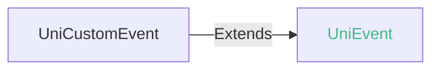
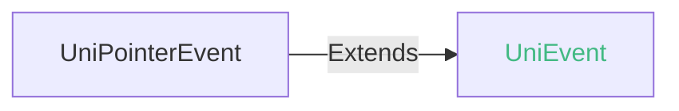
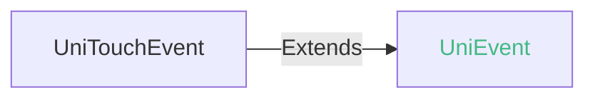
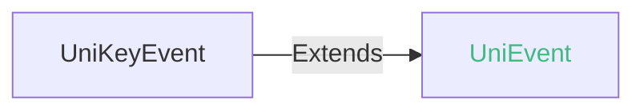
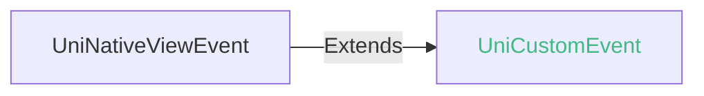

# 组件的全局属性和事件

每个组件都有属性和事件。有些属性和事件，是所有组件都支持的。

## 组件全局属性 <Help>

| 名称 | 类型 | 兼容性 | 描述 |
| :- | :- | :- | :- |
| id | string(string.IDString) | Web: 4.0; 微信小程序: 4.41; Android: 3.9; iOS: 4.11; HarmonyOS: 4.61 | 组件的唯一标识。需避免同页面中不同组件设置重复id；需避免使用uni-、uni.等前缀 |
| style | string \| UTSJSONObject \| Array\<string \| UTSJSONObject> | Web: 4.0; 微信小程序: 4.41; Android: 3.9; iOS: 4.11; HarmonyOS: 4.61 | 组件的内联样式，可以动态设置的内联样式 |
| class | string(string.ClassString) \| UTSJSONObject \| Array\<string(string.ClassString) \| UTSJSONObject> | Web: 4.0; 微信小程序: 4.41; Android: 3.9; iOS: 4.11; HarmonyOS: 4.61 | 组件的样式类，在对应的 css 中定义的样式类 |
| ref | string \| Function | Web: 4.0; 微信小程序: 4.41; Android: 3.9; iOS: 4.11; HarmonyOS: 4.61 | vue中组件的唯一标识，用来给子组件注册引用信息，[详见](https://doc.dcloud.net.cn/uni-app-x/vue/built-in.html#ref) |
| data-* | any | Web: 4.0; 微信小程序: 4.41; Android: √; iOS(VDOM): 4.11; iOS(Vapor): 5.21; HarmonyOS(VDOM): 4.61; HarmonyOS(Vapor): 5.21 | 自定义属性，组件上触发的事件时，会发送给事件处理函数 |
| android-* | any | Web: x; Android: 3.9; iOS: x; HarmonyOS: x | App-Android平台专有属性，详见[App-Android平台专有属性](https://doc.dcloud.net.cn/uni-app-x/component/common.html#attribute-android)章节 |

#### data-*@dataset

从 5.21 起全平台 dataset 调整为 UniDOMStringMap 类型。

支持能力：

- 支持 Map 相关 API 操作，如 get、set、has 等。
- 支持索引访问，如 dataset['foo']。
- 支持点操作符访问，如 dataset.foo。

注意：

- dataset 赋值、修改操作仅影响 dataset 自身，不会写入 attribute 或底层原生节点属性。
- 如果定义了 get、set、has 等与 Map 标准 API 冲突的 key，需要通过 Map API 获取数据值。例如 data-get 使用 dataset.get('get')，data-set 使用 dataset.get('set')；不支持通过索引或点操作符读取这些冲突 key 的数据值。
- App 蒸汽模式不支持通过 UniElement.getAttribute 获取 data-*，仅支持通过 dataset 获取。
- App 蒸汽模式目前仅支持在 uvue 中使用 dataset；uts插件的utssdk中暂不支持获取 uvue/JS 层设置的 dataset。
- 小程序平台仅支持通过事件 target/currentTarget 以及 createSelectorQuery、createIntersectionObserver 获取实际 dataset；通过 getElementById 无法获取到实际 dataset。


### App-Android平台专有属性@attribute-android

> android-开头的属性名称为App-Android平台专有属性

#### android-layer-type <Badge text="HBuilderX 4.01"/>

> 不支持动态修改此属性
>
> 更多信息可参考Android官方文档[硬件加速](https://developer.android.google.cn/topic/performance/hardware-accel?hl=zh-cn)。

App-Android平台设置组件视图渲染模型，字符串类型，可取值：
- "hardware": 视图在硬件中渲染为硬件纹理
- "software": 视图在软件中渲染为位图
- "none": 视图正常渲染，不使用缓冲区
默认值为"none"。

::: tip Tips
- 不建议对所有的组件设置`hardware`，大量的视图在硬件中渲染会占用巨大的显存开销、增加Android原生渲染的复杂度。
- 不建议对频繁修改的组件设置`hardware`，频繁修改的会增加硬件的缓存更新。
- 通过[DrawableContext](../dom/drawablecontext.md)或其他方式绘制复杂图形时，建议设置为`hardware`。
- 执行复杂动画或大量动画时，建议设置为`hardware`。
- 由于安卓原生限制，当设置`android-layer-type`为`hardware`或`software`时，`overflow: visible`不生效。
:::

### 示例 
 示例为[hello uni-app x alpha分支](https://gitcode.com/dcloud/hello-uni-app-x/blob/prod_alpha/pages/component/global-properties/global-properties.uvue)，与最新HBuilderX Alpha版同步。与最新正式版同步的master分支示例[另见](https://gitcode.com/dcloud/hello-uni-app-x/blob/master//pages/component/global-properties/global-properties.uvue) 
::: preview https://hellouniappx.dcloud.net.cn/web/#/pages/component/global-properties/global-properties

> appRedirect https://hellouniappx.dcloud.net.cn/appredirect.html?path=pages/component/global-properties/global-properties

>示例
```vue
<template>
  <!-- #ifdef APP && !VUE3-VAPOR -->
  <scroll-view style="flex: 1">
  <!-- #endif -->
    <view>
      <page-head title="global-properties"></page-head>
      <page-intro content="本页演示组件通用属性：id、class、data、style 的绑定与校验，以及 ref、hover-class、hover-start-time、hover-stay-time 等点击态效果。"></page-intro>
      <view class="uni-padding-wrap">
        <view :id="generalId" :class="generalClass"
          :data-test="generalData"
          :style="generalStyle" ref="generalTargetRef">
          <text>id: {{ generalId }}</text>
          <text>class: {{ generalClass }}</text>
          <text>data-test: {{ generalData }}</text>
          <text>style: {{ generalStyle }}</text>
        </view>
        <view class="btn btn-style uni-common-mt" @click="validateGeneralAttributes">
          <text class="btn-inner">{{ validateGeneralAttrText }}</text>
        </view>
        <view class="btn btn-ref uni-common-mt" @click="changeHeight">
          <text class="btn-inner">{{ changeHeightByRefText }}</text>
        </view>
        <view class="view-class" :hover-class="hoverClass" ref="viewTargetRef">
          <text class="text">按下 50 ms 后背景变红</text>
          <text class="text">抬起 400 ms 后背景恢复</text>
        </view>
        <view class="view-class" :hover-class="hoverClass" :hover-start-time="1000" :hover-stay-time="1000"
          ref="viewTargetRef">
          <text class="text">按下 1000 ms 后背景变红</text>
          <text class="text">抬起 1000 ms 后背景恢复</text>
        </view>
      </view>
    </view>
  <!-- #ifdef APP && !VUE3-VAPOR -->
  </scroll-view>
  <!-- #endif -->
</template>

<script setup lang="uts">
  const generalId = ref('general-id')
  const generalClass = ref('general-class')
  const generalData = ref('general-data')
  const generalStyle = ref('background-color: aqua')
  const validateGeneralAttrText = ref('验证基础属性')
  const hoverClass = ref('hover-class')
  const validateViewAttrText = ref('验证 view 属性')
  const changeHeightByRefText = ref('通过 ref 修改高度')

  const generalTargetRef = ref<UniElement | null>(null)
  const viewTargetRef = ref<UniElement | null>(null)

  const validateGeneralAttributes = () => {
    const generalTargetElement = generalTargetRef.value as UniElement
    const generalIdValue = generalTargetElement.getAttribute('id')
    if (generalIdValue != generalId.value) {
      validateGeneralAttrText.value = '基础属性 id 验证失败'
      return
    }
    // #ifdef APP
    if (!generalTargetElement.classList.includes('general-class')) {
      validateGeneralAttrText.value = '基础属性 class 验证失败'
      return
    }
    // #endif
    // #ifdef WEB
    if (!Array.from(generalTargetElement.classList).includes('general-class')) {
      validateGeneralAttrText.value = '基础属性 class 验证失败'
      return
    }
    // #endif
    // #ifndef MP
    const generalDataValue = generalTargetElement.dataset.test
    if (generalDataValue != generalData.value) {
      validateGeneralAttrText.value = '基础属性 data-test 验证失败'
      return
    }
    // #endif
    validateGeneralAttrText.value = '基础属性验证成功'
  }

  const changeHeight = () => {
    const generalTargetElement = generalTargetRef.value as UniElement
    changeHeightByRefText.value = '已通过 ref 修改高度'
    generalTargetElement.style.setProperty('height', '200px')
  }

</script>

<style>
  .btn {
    height: 50px;
    display: flex;
    align-items: center;
    justify-content: center;
    background-color: #409eff;
    border-radius: 5px;
  }

  .btn-inner {
    color: #fff;
  }

  .general-class {
    margin-left: 40px;
    padding: 10px;
    width: 260px;
    height: 160px;
    background-color: antiquewhite;
  }

  .view-class {
    margin: 20px 0 0 50px;
    padding: 10px;
    width: 240px;
    height: 100px;
    background-color: antiquewhite;
  }

  .text {
    margin-top: 5px;
    text-align: center;
  }

  .hover-class {
    background-color: red;
  }
</style>

```

:::

### 参见

- [相关 Bug](https://issues.dcloud.net.cn/?mid=component.global-properties-events.global-properties)

## 组件全局事件 <Help>

| 名称 | 类型 | 兼容性 | 描述 |
| :- | :- | :- | :- |
| @click | (event: [UniPointerEvent](/component/common.md#unipointerevent)) => void | Web: 4.0; 微信小程序: 4.41; Android: 3.9; iOS: 4.11; HarmonyOS: 4.61 | 手指触摸后马上离开。与tap相同，（推荐使用tap事件代替），冒泡事件 |
| @mousedown | (event: [UniMouseEvent](/component/common.md#unimouseevent)) => void | Web: 4.0; Android: x; iOS: x; HarmonyOS: x | 鼠标在元素上点击后触发 |
| @mousemove | (event: [UniMouseEvent](/component/common.md#unimouseevent)) => void | Web: 4.0; Android: x; iOS: x; HarmonyOS: x | 鼠标在元素上移动时触发 |
| @mouseup | (event: [UniMouseEvent](/component/common.md#unimouseevent)) => void | Web: 4.0; Android: x; iOS: x; HarmonyOS: x | 鼠标主按钮在元素上松开时触发 |
| @touchstart | (event: [UniTouchEvent](/component/common.md#unitouchevent)) => void | Web: 4.0; 微信小程序: 4.41; Android: 3.9; iOS: 4.11; HarmonyOS: 4.61 | 手指触摸动作开始，冒泡事件，event.type 值为 touchstart |
| @touchmove | (event: [UniTouchEvent](/component/common.md#unitouchevent)) => void | Web: 4.0; 微信小程序: 4.41; Android: 3.9; iOS: 4.11; HarmonyOS: 4.61 | 手指触摸后移动，冒泡事件，event.type 值为 touchmove |
| @touchcancel | (event: [UniTouchEvent](/component/common.md#unitouchevent)) => void | Web: 4.0; 微信小程序: 4.41; Android: 3.9; iOS: 4.11; HarmonyOS: 4.61 | 手指触摸动作被打断，如来电提醒，弹窗，冒泡事件，event.type 值为 touchcancel |
| @touchend | (event: [UniTouchEvent](/component/common.md#unitouchevent)) => void | Web: 4.0; 微信小程序: 4.41; Android: 3.9; iOS: 4.11; HarmonyOS: 4.61 | 手指触摸动作结束，冒泡事件，event.type 值为 touchend |
| @tap | (event: [UniPointerEvent](/component/common.md#unipointerevent)) => void | Web: 4.0; 微信小程序: 4.41; Android: 3.9; iOS: 4.11; HarmonyOS: 4.61 | 手指触摸后马上离开，冒泡事件 |
| @longpress | (event: [UniTouchEvent](/component/common.md#unitouchevent)) => void | Web: 4.0; 微信小程序: 4.41; Android: 3.9; iOS: 4.11; HarmonyOS: 4.61 | 如果一个组件被绑定了 longpress 事件，那么当用户手指触摸后，超过350ms再离开会触发，冒泡事件 |
| @longtap | (event: [UniTouchEvent](/component/common.md#unitouchevent)) => void | Web: 4.0; 微信小程序: 4.41; Android: 3.9; iOS: 4.11; HarmonyOS: 4.61 | 手指触摸后，超过350ms再离开（推荐使用 longpress 事件代替） |
| @transitionend | (event: [UniEvent](/component/common.md#unievent)) => void | Web: 4.0; 微信小程序: 4.41; Android: 3.93; iOS: 4.11; HarmonyOS: 4.61 | transition 效果结束时触发 |
| @fullscreenchange | (event: [UniEvent](/component/common.md#unievent)) => void | Web: x; 微信小程序: x; Android: 4.61; iOS: 4.61; HarmonyOS: 4.61 | 进入或退出全屏模式时触发 |
| @fullscreenerror | (event: [UniEvent](/component/common.md#unievent)) => void | Web: x; 微信小程序: x; Android: 4.61; iOS: 4.61; HarmonyOS: 4.61 | 进入或退出全屏模式失败时触发 |


### touch 事件@touch
触摸事件包括：touchstart、touchmove、touchcancel、touchend 等。

在多点触摸的屏幕上，touch事件返回数组，包含了每个touch点对应的x、y坐标。

双指缩放，可以参考uni.preview的源码，这是一个uvue页面，监听双指来缩放图片。[详见](https://gitcode.com/dcloud/uni-api/tree/alpha/uni_modules/uni-previewImage)

##### 示例 
 示例为[hello uni-app x alpha分支](https://gitcode.com/dcloud/hello-uni-app-x/blob/prod_alpha/pages/component/global-events/touch-events.uvue)，与最新HBuilderX Alpha版同步。与最新正式版同步的master分支示例[另见](https://gitcode.com/dcloud/hello-uni-app-x/blob/master//pages/component/global-events/touch-events.uvue) 
::: preview https://hellouniappx.dcloud.net.cn/web/#/pages/component/global-events/touch-events

> appRedirect https://hellouniappx.dcloud.net.cn/appredirect.html?path=pages/component/global-events/touch-events

>示例
```vue
<template>
  <scroll-view style="flex: 1">
    <page-head title="拖拽图标测试相关事件"></page-head>
    <view class="uni-padding-wrap uni-common-mt" style="bottom: 20px;">
      <navigator url="/pages/component/global-events/touch-events-case" hover-class="none">
        <button type="default">
          stopPropagation / preventDefault
        </button>
      </navigator>
    </view>
    <view class="container">
      <view class="view-box" @touchstart="onViewTouchStart">
        <image class="icon" id="icon" src="../image/logo.png" @touchstart="onTouchStart" @touchcancel="onTouchCancel"
          @touchmove="onTouchMove" @touchend="onTouchEnd"></image>
      </view>

    </view>
    <view v-if="touchEvent !== null">
      <text class="title1">touches: </text>
      <template v-for="(touch, index) in touchEvent!.touches" :key="index">
        <text class="title2">touch[{{ index }}]:</text>
        <text>identifier: {{touch.identifier}}</text>
        <text>pageX: {{ touch.pageX }}, pageY: {{ touch.pageY }}</text>
        <text>clientX: {{ touch.clientX }}, clientY: {{ touch.clientY }}</text>
        <text>screenX: {{ touch.screenX }}, screenY: {{ touch.screenY }}</text>
      </template>
    </view>
  </scroll-view>
</template>

<script setup lang="uts">
type DataType = {
  touchTargets: string,
  touchTargetsCount: number,
  iconRect: DOMRect | null,
}

const move = ref(false)
const posX = ref(0)
const posY = ref(0)
const lastX = ref(0)
const lastY = ref(0)
const dragTouchId = ref(-1)
const touchEvent = ref(null as TouchEvent | null)
const icon = ref(null as UniElement | null)
const data = reactive({
  touchTargets: "",
  touchTargetsCount: 0,
  iconRect: null as DOMRect | null,
} as DataType)

function onViewTouchStart(e : TouchEvent) {
  data.touchTargets += e.target!.tagName + e.currentTarget!.tagName
  data.touchTargetsCount++
}

function findTouchByIdentifier(touches : Touch[], identifier : number) : Touch | null {
  for (let i = 0; i < touches.length; i++) {
    const touch = touches[i]
    if (touch.identifier == identifier) {
      return touch
    }
  }
  return null
}

function onTouchStart(e : TouchEvent) {
  data.touchTargetsCount++
  data.touchTargets += e.target!.tagName + e.currentTarget!.tagName

  touchEvent.value = e
  if (!move.value) {
    const startTouch = e.changedTouches.length > 0 ? e.changedTouches[0] : e.touches[0]
    if (startTouch == null) {
      return
    }
    move.value = true
    dragTouchId.value = startTouch.identifier
    posX.value = startTouch.screenX
    posY.value = startTouch.screenY
    lastX.value = startTouch.screenX
    lastY.value = startTouch.screenY
  }
}

function onTouchMove(e : TouchEvent) {
  e.preventDefault()
  touchEvent.value = e
  let p = findTouchByIdentifier(e.changedTouches, dragTouchId.value)
  if (p == null) {
    p = findTouchByIdentifier(e.touches, dragTouchId.value)
  }
  if (p == null) {
    return
  }
  if (p.screenX == lastX.value && p.screenY == lastY.value) {
    return
  }
  let x = p.screenX - posX.value
  let y = p.screenY - posY.value
  lastX.value = p.screenX
  lastY.value = p.screenY
  icon.value?.style?.setProperty('transform', 'translate(' + x + 'px,' + y + 'px)')
}

function resetIcon() {
  move.value = false;
  posX.value = 0;
  posY.value = 0;
  lastX.value = 0;
  lastY.value = 0;
  dragTouchId.value = -1;
  icon.value?.style?.setProperty('transform', 'translate(0px,0px)')
}

function onTouchEnd(e : TouchEvent) {
  if (findTouchByIdentifier(e.changedTouches, dragTouchId.value) != null) {
    resetIcon()
    touchEvent.value = null
  }
}

function onTouchCancel(event : TouchEvent) {
  resetIcon()
  touchEvent.value = null
}

onReady(() => {
  icon.value = uni.getElementById("icon")
  // #ifdef APP-IOS || APP-HARMONY
  data.iconRect = icon.value?.getBoundingClientRect() ?? null
  // 加上导航栏及状态栏高度
  if (data.iconRect != null) {
    data.iconRect.y += uni.getSystemInfoSync().safeArea.top + 44
  }
  // #endif
})

defineExpose({
  data
})
</script>

<style>
  .container {
    width: 100%;
    flex-direction: column;
    align-items: center;
  }

  .view-box {
    width: 300px;
    height: 300px;
    align-items: center;
    justify-content: center;
    border-style: solid;
  }

  .icon {
    width: 100px;
    height: 100px;
  }

  .title1 {
    margin-top: 10px;
    font-size: 18px;
  }

  .title2 {
    margin-top: 5px;
    font-size: 16px;
  }
</style>

```

:::

### tap/click 事件@tap

- App端
App端手指按下后在组件区域内移动不会取消tap/click事件的触发，移动到组件区域外才会取消tap/click事件的触发。

- Web端
手指按下后移动会取消tap/click事件的触发，即手指移动后抬起不会响应tap/click事件


### transition 事件 <Badge text="Android 3.93"/>

- @transitionend

	transition 效果结束时触发

##### 示例 
 示例为[hello uni-app x alpha分支](https://gitcode.com/dcloud/hello-uni-app-x/blob/prod_alpha/pages/component/global-events/transition-events.uvue)，与最新HBuilderX Alpha版同步。与最新正式版同步的master分支示例[另见](https://gitcode.com/dcloud/hello-uni-app-x/blob/master//pages/component/global-events/transition-events.uvue) 
::: preview https://hellouniappx.dcloud.net.cn/web/#/pages/component/global-events/transition-events

> appRedirect https://hellouniappx.dcloud.net.cn/appredirect.html?path=pages/component/global-events/transition-events

>示例
```vue
<template>
  <!-- #ifdef APP -->
  <scroll-view style="flex:1;" v-if="isShow">
  <!-- #endif -->
    <image class="transition-transform" id="transition-transform" @transitionend="onEnd" src="/static/test-image/logo.png"></image>
    <text class="adjust">对图片设置transform进行旋转，在旋转完成的transitionend事件后，继续旋转</text>
    <button class="adjust" @click="switchBtn">{{buttonValue}}</button>
  <!-- #ifdef APP -->
  </scroll-view>
  <!-- #endif -->
</template>

<script setup lang="uts">

type DataType = {
  onTransitionEndTriggr: boolean,
}

let times = 0
let element: UniElement | null = null
let isStart = false
const buttonValue = ref("开启图片旋转")
const data = reactive({
  onTransitionEndTriggr: false,
} as DataType)
const isShow = ref(false)

function switchBtn() {
  if (!isStart) {
    if (element == null) {
      element = uni.getElementById('transition-transform')
    }
    buttonValue.value = "关闭图片旋转"
    times = times + 1
    element!.style.setProperty('transition-duration', '2000ms')
    element!.style.setProperty('transform', 'rotate(' + times * 360 + 'deg)')
    isStart = true
  } else {
    isStart = false
    times = 0
    data.onTransitionEndTriggr = false
    buttonValue.value = "开启图片旋转"
    element!.style.setProperty('transition-duration', '0ms')
    element!.style.setProperty('transform', 'rotate(0deg)')
  }
}

function onEnd() {
  console.log('transform transitionend')
  if (isStart) {
    times = times + 1
    element!.style.setProperty('transform', 'rotate(' + times * 360 + 'deg)')
    data.onTransitionEndTriggr = true
  }
}

onReady(() => {
  // onReady中动态修改isShow是为了验证非蒸气模式下在安卓手机上子线程中创建节点可能会崩溃的问题，不具备代码参考性。
  // #ifdef APP-ANDROID && !VUE3-VAPOR
  class ThreadRunnable extends Runnable {
    override run() {
      isShow.value = true
    }
  }
  new Thread(new ThreadRunnable()).start()
  // #endif
  // #ifndef APP-ANDROID && !VUE3-VAPOR
  isShow.value = true
  // #endif
})

defineExpose({
  data,
  switchBtn
})
</script>

<style>
  .adjust {
    margin: 10px;
  }

  .transition-transform {
    width: 192px;
    height: 192px;
    margin: 16px auto;
    /* border-radius: 50%; */
    transition-property: transform;
    transition-timing-function: linear;
    transform: rotate(0deg);
  }
</style>

```

:::

### 冒泡事件系统

> DOM事件主要有三个阶段：`捕获阶段`、`目标阶段`和`冒泡阶段`。
>
> App平台目前暂不支持事件的捕获阶段编程。

以点击事件为例，当触发点击时，
1. 首先从根节点逐级向下分发，直到监听点击事件的节点为止（捕获阶段）；
2. 然后事件到达当前节点并触发点击事件（目标阶段）；
3. 接着继续向上逐级触发父节点的点击事件，直到根节点为止（冒泡阶段）。

::: warning 注意
虽然有3个阶段，但第2个阶段（“目标阶段”：事件到达了元素）并没有单独处理：捕获和冒泡阶段的处理程序都会在该阶段触发。

我们一般使用默认的事件注册机制，将事件注册到冒泡阶段，相对来说，大多数处理情况都在冒泡阶段。
:::

#### 阻止冒泡

在事件回调中，可以通过调用`event.stopPropagation`方法阻止事件冒泡。

##### 示例 
 示例为[hello uni-app x alpha分支](https://gitcode.com/dcloud/hello-uni-app-x/blob/prod_alpha/pages/component/global-events/touch-events-case.uvue)，与最新HBuilderX Alpha版同步。与最新正式版同步的master分支示例[另见](https://gitcode.com/dcloud/hello-uni-app-x/blob/master//pages/component/global-events/touch-events-case.uvue) 
::: preview https://hellouniappx.dcloud.net.cn/web/#/pages/component/global-events/touch-events-case

> appRedirect https://hellouniappx.dcloud.net.cn/appredirect.html?path=pages/component/global-events/touch-events-case

>示例
```vue
<template>
	<view>
		<swiper ref="header" class="h-300" indicator-dots="true" circular="true" @change="swiperChange" @touchstart="swiperTouchStart" @touchmove="swiperTouchMove" @touchend="swiperTouchEnd">
			<swiper-item v-for="i in 3" :item-id="i + ''" @touchstart="swiperItemTouchStart" @touchmove="swiperItemTouchMove" @touchend="swiperItemTouchEnd">
				<view class="h-300 header-tiem" @touchstart="viewTouchStart" @touchmove="viewTouchMove" @touchend="viewTouchEnd">
					<text>{{ i }}</text>
				</view>
			</swiper-item>
		</swiper>
    <view class="content">
      <boolean-data :defaultValue="false" title="stopPropagation" @change="changeStopPropagation"></boolean-data>
      <boolean-data :defaultValue="false" title="preventDefault" @change="changePreventDefault"></boolean-data>
      <text style="padding: 10px;">{{ touchResult }}</text>
      <view class="uni-padding-wrap uni-common-mt" style="bottom: 20px;">
        <navigator url="/pages/component/global-events/touch-events-preventDefault" hover-class="none">
          <button type="default" class="button">
            测试 preventDefault
          </button>
        </navigator>
      </view>
    </view>
	</view>
</template>

<script setup lang="uts">


type DataType = {
  swiperChangeEvent: boolean,
  viewTouchEvent: boolean,
  swiperItemTouchEvent: boolean,
  swiperTouchEvent: boolean,
}

const stopPropagation = ref(false)
const preventDefault = ref(false)
const touchResult = ref("")
const data = reactive({
  swiperChangeEvent: false,
  viewTouchEvent: false,
  swiperItemTouchEvent: false,
  swiperTouchEvent: false,
} as DataType)

function changeStopPropagation(value: boolean) {
  stopPropagation.value = value
}

function changePreventDefault(value: boolean) {
  preventDefault.value = value
}

function swiperChange(e: UniSwiperChangeEvent) {
  console.log("swiperChange", e.detail.current)
  data.swiperChangeEvent = true
}

function viewTouchStart(e: UniTouchEvent) {
  console.log("viewTouchStart")
  touchResult.value = "viewTouchStart"
  data.viewTouchEvent = true
  if (stopPropagation.value) e.stopPropagation()
  if (preventDefault.value) e.preventDefault()
}

function viewTouchMove(e: UniTouchEvent) {
  console.log("viewTouchMove")
  touchResult.value = "viewTouchMove"
  data.viewTouchEvent = true
  if (stopPropagation.value) e.stopPropagation()
  if (preventDefault.value) e.preventDefault()
}

function viewTouchEnd(e: UniTouchEvent) {
  console.log("viewTouchEnd")
  touchResult.value = "viewTouchEnd"
  if (stopPropagation.value) e.stopPropagation()
}

function swiperItemTouchStart(e: UniTouchEvent) {
  console.log("swiperItemTouchStart")
  touchResult.value += " -> swiperItemTouchStart"
  data.swiperItemTouchEvent = true
}

function swiperItemTouchMove(e: UniTouchEvent) {
  console.log("swiperItemTouchMove")
  touchResult.value += " -> swiperItemTouchMove"
}

function swiperItemTouchEnd(e: UniTouchEvent) {
  console.log("swiperItemTouchEnd")
  touchResult.value += " -> swiperItemTouchEnd"
}

function swiperTouchStart(e: UniTouchEvent) {
  console.log("swiperTouchStart")
  touchResult.value += " -> swiperTouchStart"
  data.swiperTouchEvent = true
}

function swiperTouchMove(e: UniTouchEvent) {
  console.log("swiperTouchMove")
  touchResult.value += " -> swiperTouchMove"
}

function swiperTouchEnd(e: UniTouchEvent) {
  console.log("swiperTouchEnd")
  touchResult.value += " -> swiperTouchEnd"
}

function resetEvent() {
  data.swiperChangeEvent = false
  data.viewTouchEvent = false
  data.swiperItemTouchEvent = false
  data.swiperTouchEvent = false
  stopPropagation.value = true
  preventDefault.value = true
}

function isPassTest1() {
  console.log("swiperChangeEvent:", data.swiperChangeEvent)
  return data.swiperChangeEvent == false
}

function isPassTest2() {
  console.log("viewTouchEvent:", data.viewTouchEvent)
  console.log("swiperItemTouchEvent:", data.swiperItemTouchEvent)
  console.log("swiperTouchEvent:", data.swiperTouchEvent)
  return data.viewTouchEvent == true && data.swiperItemTouchEvent == true  && data.swiperTouchEvent == true
}

defineExpose({
  data,
  resetEvent
})
</script>

<style>
  .h-300{
    height: 300px;
  }

	.header-tiem {
		background-color: #89ff8d;
		align-items: center;
		justify-content: center;
	}
</style>

```

:::

#### 阻止默认行为

在事件回调中，可以通过调用`event.preventDefault`方法阻止默认行为。`event.preventDefault`仅处理默认行为，事件冒泡不会被阻止。

###### 示例 
 示例为[hello uni-app x alpha分支](https://gitcode.com/dcloud/hello-uni-app-x/blob/prod_alpha/pages/component/global-events/touch-events-preventDefault-click.uvue)，与最新HBuilderX Alpha版同步。与最新正式版同步的master分支示例[另见](https://gitcode.com/dcloud/hello-uni-app-x/blob/master//pages/component/global-events/touch-events-preventDefault-click.uvue) 
::: preview https://hellouniappx.dcloud.net.cn/web/#/pages/component/global-events/touch-events-preventDefault-click

> appRedirect https://hellouniappx.dcloud.net.cn/appredirect.html?path=pages/component/global-events/touch-events-preventDefault-click

>示例
```vue
<template>
  <view>
    <view @touchend="onParentTouchEnd" @click="onParentClick"
      style="padding-bottom: 100px; background-color: darkgrey;">
      <view id="eventClick" @touchend="onTouchEnd" style="width:100%;height: 300px; background-color: yellow;"
        @click="onClick">
      </view>
    </view>
  </view>
</template>

<script setup>
  type DataType = {
    isParentPreventDefault : boolean,
    isPreventDefault : boolean,
    isParentClickTrigger : boolean,
    isClickTrigger : boolean,
    eventDomRect : DOMRect | null
  }

  const data = reactive({
    isParentPreventDefault: false,
    isPreventDefault: false,
    isParentClickTrigger: false,
    isClickTrigger: false,
    eventDomRect: null as DOMRect | null,
  } as DataType)
  defineExpose({
    data
  })

  onReady(() => {
    var element = uni.getElementById("eventClick")
    data.eventDomRect = element?.getBoundingClientRect()
  })
  const onTouchEnd = (e : UniTouchEvent) => {
    if (data.isPreventDefault) {
      console.log("执行了preventDefault，不再触发点击事件")
      e.preventDefault()
    }
  }

  const onParentTouchEnd = (e : UniTouchEvent) => {
    if (data.isParentPreventDefault) {
      console.log("执行了父的preventDefault，不再触发点击事件")
      e.preventDefault()
    }
  }

  const onClick = () => {
    console.log("触发了点击事件")
    data.isClickTrigger = true
  }

  const onParentClick = () => {
    console.log("触发了父的点击事件")
    data.isParentClickTrigger = true
  }
</script>

<style>

</style>

```

:::

### Bug & Tips

- uni-app x 4.0以前，连续触发`click`或`tap`事件，可能会出现事件丢失的情况。请升级新版

::: info 调整

1. uni-app x 4.0+ ，组件事件类型的名称增加 Uni 前缀，避免与浏览器全局事件冲突
2. 非 Uni 开头的事件类型名称被标记为废弃，功能不受影响。
3. 如您使用uni-app x 4.0以下版本，仍需去掉 Uni 前缀

变更示例
```html
<template>
  <slider @change="sliderChange" />
</template>
<script setup lang="uts">
  // 变更之前类型为 SliderChangeEvent
  //function  sliderChange(e : SliderChangeEvent) {
  // }

  // 变更之后类型为 UniSliderChangeEvent
  function sliderChange(e : UniSliderChangeEvent) {
  }
</script>
```
:::

### 参见

- [相关 Bug](https://issues.dcloud.net.cn/?mid=component.global-properties-events.global-events)

## UniEvent

> 在小程序端各种Event事件名称只能作为类型是用，不能作为值使用。比如：`let xx: UniTouchEvent = e`是支持的，`xx instanceof UniTouchEvent`是不支持的


### 构造函数
| 名称 | 类型 | 必备 | 描述 |
| :- | :- | :- | :- |
| type | string | 是 | 事件的名称 |

### 构造函数
| 名称 | 类型 | 必备 | 描述 |
| :- | :- | :- | :- |
| type | string | 是 | 事件的名称 |
| eventInit | any | 是 | 事件初始参数。支持字段：`bubbles`表明该事件是否冒泡。可选，默认为false；`cancelable`表明该事件是否可以被取消。可选，默认为false。 |

### UniEvent 的属性值 @unievent-values
| 名称 | 类型 | 必备 | 兼容性 | 描述 |
| :- | :- | :- |  :-: | :- |
| bubbles | boolean | 是 |   | 是否冒泡 |
| cancelable | boolean | 是 |   | 是否可以取消 |
| type | string | 是 | Web: 4.0; Android: 3.9; iOS: 4.11; HarmonyOS: 4.61 | 事件类型<br/> |
| target | [UniElement](/api/dom/unielement.md) | 否 | Web: 4.0; Android: 3.9; iOS: 4.11; HarmonyOS: 4.61 | 触发事件的组件<br/> |
| currentTarget | [UniElement](/api/dom/unielement.md) | 否 | Web: 4.0; Android: 3.9; iOS: 4.11; HarmonyOS: 4.61 | 当前组件<br/> |
| timeStamp | number | 是 | Web: 4.0; Android: 3.9; iOS: 4.11; HarmonyOS: 4.61 | 事件发生时的时间戳<br/> |


### UniEvent 方法 @event-methods
#### stopPropagation(): void @stoppropagation

阻止当前事件的进一步传播


##### stopPropagation 兼容性 <Help /> 
| Web | Android | iOS | HarmonyOS |
| :- | :- | :- | :- |
| 4.0 | 3.9 | 4.0 | 4.61 |


#### preventDefault(): void @preventdefault

阻止当前事件的默认行为


##### preventDefault 兼容性 <Help /> 
| Web | Android | iOS | HarmonyOS |
| :- | :- | :- | :- |
| 4.0 | 3.9 | 4.55 | 4.61 |


## UniCustomEvent\<T> @unicustomevent



```mermaid
graph LR
  
UniCustomEvent -- Extends --> UniEvent
  style UniEvent color:#42b983
  click UniEvent "https://doc.dcloud.net.cn/uni-app-x/component/common.html#unievent"
```


### 构造函数
| 名称 | 类型 | 必备 |
| :- | :- | :- |
| type | string | 是 |
| detail | T | 是 |

### 构造函数
| 名称 | 类型 | 必备 |
| :- | :- | :- |
| type | string | 是 |
| options | any | 是 |

### UniCustomEvent 的属性值 @unicustomevent-values
| 名称 | 类型 | 必备 |
| :- | :- | :- |
| detail | T | 是 |


## UniPointerEvent



```mermaid
graph LR
  
UniPointerEvent -- Extends --> UniEvent
  style UniEvent color:#42b983
  click UniEvent "https://doc.dcloud.net.cn/uni-app-x/component/common.html#unievent"
```


### UniPointerEvent 的属性值 @unipointerevent-values
| 名称 | 类型 | 必备 | 描述 |
| :- | :- | :- | :- |
| clientX | number | 是 | 相对于页面可显示区域左边的距离 |
| clientY | number | 是 | 相对于页面可显示区域顶部的距离 |
| x | number | 是 | 相对于页面可显示区域左边的距离，同`clientX` |
| y | number | 是 | 相对于页面可显示区域顶部的距离，同`clientY` |
| pageX | number | 是 | 相对于屏幕左边的距离，包括滚动距离。 |
| pageY | number | 是 | 相对于屏幕顶部的距离，包括滚动距离。 |
| screenX | number | 是 | 相对于屏幕左边的距离，不包括滚动距离。 |
| screenY | number | 是 | 相对于屏幕顶部的距离，不包括滚动距离。 |


<!-- CUSTOMTYPEJSON.UniPointerEvent.example -->

## UniTouchEvent



```mermaid
graph LR
  
UniTouchEvent -- Extends --> UniEvent
  style UniEvent color:#42b983
  click UniEvent "https://doc.dcloud.net.cn/uni-app-x/component/common.html#unievent"
```


### UniTouchEvent 的属性值 @unitouchevent-values
| 名称 | 类型 | 必备 | 描述 |
| :- | :- | :- | :- |
| touches | Array&lt;**UniTouch**&gt; | 是 | 当前停留在屏幕中的触摸点信息的数组 |
| changedTouches | Array&lt;**UniTouch**&gt; | 是 | 当前变化的触摸点信息的数组 |

#### touches 的属性描述

| 名称 | 类型 | 必备 | 描述 |
| :- | :- | :- | :- |
| clientX | number | 是 | 相对于页面可显示区域左边的距离 |
| clientY | number | 是 | 相对于页面可显示区域顶部的距离 |
| identifier | number | 是 | 触摸点的标识符。这个值在这根手指所引发的所有事件中保持一致，直到手指抬起。 |
| pageX | number | 是 | 相对于屏幕左边的距离，包括滚动距离。 |
| pageY | number | 是 | 相对于屏幕顶部的距离，包括滚动距离。 |
| screenX | number | 是 | 相对于屏幕左边的距离，不包括滚动距离。 |
| screenY | number | 是 | 相对于屏幕顶部的距离，不包括滚动距离。 |
| force | number | 否 | 返回当前触摸点按下的压力大小 |

#### changedTouches 的属性描述

| 名称 | 类型 | 必备 | 描述 |
| :- | :- | :- | :- |
| clientX | number | 是 | 相对于页面可显示区域左边的距离 |
| clientY | number | 是 | 相对于页面可显示区域顶部的距离 |
| identifier | number | 是 | 触摸点的标识符。这个值在这根手指所引发的所有事件中保持一致，直到手指抬起。 |
| pageX | number | 是 | 相对于屏幕左边的距离，包括滚动距离。 |
| pageY | number | 是 | 相对于屏幕顶部的距离，包括滚动距离。 |
| screenX | number | 是 | 相对于屏幕左边的距离，不包括滚动距离。 |
| screenY | number | 是 | 相对于屏幕顶部的距离，不包括滚动距离。 |
| force | number | 否 | 返回当前触摸点按下的压力大小 |


UniTouchEvent 的 type 类型包括：touchstart、touchmove、touchend、touchcancel、longpress。

## UniTouch


### UniTouch 的属性值 @unitouch-values
| 名称 | 类型 | 必备 | 描述 |
| :- | :- | :- | :- |
| clientX | number | 是 | 相对于页面可显示区域左边的距离 |
| clientY | number | 是 | 相对于页面可显示区域顶部的距离 |
| identifier | number | 是 | 触摸点的标识符。这个值在这根手指所引发的所有事件中保持一致，直到手指抬起。 |
| pageX | number | 是 | 相对于屏幕左边的距离，包括滚动距离。 |
| pageY | number | 是 | 相对于屏幕顶部的距离，包括滚动距离。 |
| screenX | number | 是 | 相对于屏幕左边的距离，不包括滚动距离。 |
| screenY | number | 是 | 相对于屏幕顶部的距离，不包括滚动距离。 |
| force | number | 否 | 返回当前触摸点按下的压力大小 |


<!-- CUSTOMTYPEJSON.Unigeneral-event.example -->

## UniMouseEvent


```mermaid
graph LR
  
UniPointerEvent -- Extends --> UniEvent
  style UniEvent color:#42b983
  click UniEvent "https://doc.dcloud.net.cn/uni-app-x/component/common.html#unievent"
```


### UniMouseEvent 的属性值 @unimouseevent-values
| 名称 | 类型 | 必备 | 描述 |
| :- | :- | :- | :- |
| clientX | number | 是 | 相对于页面可显示区域左边的距离 |
| clientY | number | 是 | 相对于页面可显示区域顶部的距离 |
| x | number | 是 | 相对于页面可显示区域左边的距离，同`clientX` |
| y | number | 是 | 相对于页面可显示区域顶部的距离，同`clientY` |
| pageX | number | 是 | 相对于屏幕左边的距离，包括滚动距离。 |
| pageY | number | 是 | 相对于屏幕顶部的距离，包括滚动距离。 |
| screenX | number | 是 | 相对于屏幕左边的距离，不包括滚动距离。 |
| screenY | number | 是 | 相对于屏幕顶部的距离，不包括滚动距离。 |


<!-- CUSTOMTYPEJSON.UniMouseEvent.example -->

## UniKeyEvent



```mermaid
graph LR
  
UniKeyEvent -- Extends --> UniEvent
  style UniEvent color:#42b983
  click UniEvent "https://doc.dcloud.net.cn/uni-app-x/component/common.html#unievent"
```


### UniKeyEvent 的属性值 @unikeyevent-values
| 名称 | 类型 | 必备 |
| :- | :- | :- |
| keyCode | number | 是 |
| keyType | string | 是 |


<!-- CUSTOMTYPEJSON.UniKeyEvent.example -->

## UniNativeViewEvent

native-view自定义事件


```mermaid
graph LR
  
UniNativeViewEvent -- Extends --> UniCustomEvent
  style UniCustomEvent color:#42b983
  click UniCustomEvent "https://doc.dcloud.net.cn/uni-app-x/component/common.html#unicustomevent"
```


### 构造函数
| 名称 | 类型 | 必备 |
| :- | :- | :- |
| type | string | 是 |
| detail | any | 是 |

### 构造函数
| 名称 | 类型 | 必备 |
| :- | :- | :- |
| type | string | 是 |

### UniNativeViewEvent 的属性值 @uninativeviewevent-values
| 名称 | 类型 | 必备 | 描述 |
| :- | :- | :- | :- |
| type | string | 是 | 事件类型 |
| detail | [UTSJSONObject](/uts/buildin-object-api/utsjsonobject.md) | 是 |  |


### UniNativeViewEvent 兼容性 <Help /> 
 | Android | iOS | HarmonyOS |
| :- | :- | :- |
| 4.31 | 4.31 | 4.61 |

<!-- CUSTOMTYPEJSON.UniNativeViewEvent.example -->

## UniVideoEvent

video 通用事件，组件Event接口无法直接继承UniEvent


### UniVideoEvent 的属性值 @univideoevent-values
| 名称 | 类型 | 必备 | 描述 |
| :- | :- | :- | :- |
| bubbles | boolean | 是 | 是否冒泡 |
| cancelable | boolean | 是 | 是否可以取消 |
| type | string | 是 | 事件类型 |
| target | [UniElement](/api/dom/unielement.md) | 否 | 触发事件的组件 |
| currentTarget | [UniElement](/api/dom/unielement.md) | 否 | 当前组件 |
| timeStamp | number | 是 | 事件发生时的时间戳 |


<!-- CUSTOMTYPEJSON.UniVideoEvent.example -->

### UniVideoEvent 的方法 @univideoevent-methods
#### stopPropagation(): void @stoppropagation

阻止当前事件的进一步传播


#### preventDefault(): void @preventdefault

阻止当前事件的默认行为


## 参见

- [相关 Bug](https://issues.dcloud.net.cn/?mid=component.global-properties-events)
