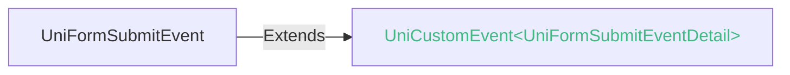
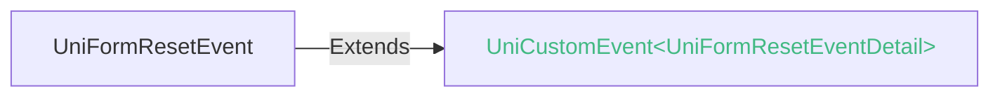

<!-- ## form -->

::: sourceCode
## form

> GitCode: https://gitcode.com/dcloud/uni-component/tree/alpha/uni_modules/uni-form


> GitHub: https://github.com/dcloudio/uni-component/tree/alpha/uni_modules/uni-form

:::

> 组件类型：UniFormElement 

 表单


### 兼容性
| Web | 微信小程序 | Android | iOS | HarmonyOS | HarmonyOS(Vapor) |
| :- | :- | :- | :- | :- | :- |
| 4.0 | 4.41 | 3.97 | 4.11 | 4.61 | 5.0 |


### 属性 
| 名称 | 类型 | 默认值 | 兼容性 | 描述 |
| :- | :- | :- |  :-: | :- |
| disabled | boolean | - | Web: 4.0; 微信小程序: x; Android: 3.97; iOS: 4.11; HarmonyOS: 4.61; HarmonyOS(Vapor): 5.0 | 是否禁用 |
| report-submit | boolean | - | Web: x; 微信小程序: 4.41; Android: x; iOS: x; HarmonyOS: x; HarmonyOS(Vapor): - | 是否返回 formId 用于发送模板消息 |
| report-submit-timeout | number | - | Web: x; 微信小程序: 4.41; Android: x; iOS: x; HarmonyOS: x; HarmonyOS(Vapor): - | *(number)*<br/>等待一段时间（毫秒数）以确认 formId 是否生效。如果未指定这个参数，formId 有很小的概率是无效的（如遇到网络失败的情况）。指定这个参数将可以检测 formId 是否有效，以这个参数的时间作为这项检测的超时时间。如果失败，将返回 requestFormId:fail 开头的 formId |
| @submit | (event: [UniFormSubmitEvent](#uniformsubmitevent)) => void | - | Web: 4.0; 微信小程序: 4.41; Android: 3.97; iOS: 4.11; HarmonyOS: 4.61; HarmonyOS(Vapor): 5.0 | 携带 form 中的数据触发 submit 事件，event.detail = {value : {'name': 'value'}} |
| @reset | (event: [UniFormResetEvent](#uniformresetevent)) => void | - | Web: 4.0; 微信小程序: 4.41; Android: 3.97; iOS: 4.11; HarmonyOS: 4.61; HarmonyOS(Vapor): 5.0 | 表单重置时会触发 reset 事件 |


### 事件
#### UniFormSubmitEvent


##### UniFormSubmitEventDetail


###### UniFormSubmitEventDetail 的属性值
| 名称 | 类型 | 必填 | 默认值 | 兼容性 | 描述 |
| :- | :- | :- | :- |  :-: | :- |
| value | [UTSJSONObject](/uts/buildin-object-api/utsjsonobject.md) | 是 | - | - | - |


#### UniFormResetEvent



<!-- UTSCOMJSON.form.component_type-->

## form内容项控制逻辑

form组件的内容子组件包括：input、textarea、checkbox、radio、switch、slider，以及负责提交或重置的button组件。

button可以设置form-type属性为submit或reset，点击时会分别触发form的提交或重置。

在表单submit或reset时，这些表单内容子组件的值会被提交或重置。

注意：目前不支持上述组件之外自行添加表单内容子组件。如有自定义组件，则不能使用form组件提交，需自行通过绑定data的方式获取组件值并自行编码提交数据。

### submit策略差异

form 组件的表单提交，微信小程序的实现策略，与浏览器W3C的策略略有差异。目前uni-app(x)在submit时，app和web上的实现与微信小程序相同。具体是：

- uni-app表单提交的数据是一个对象`{"name": "value"}`。而浏览器标准form是数组，每项为 pair，pair[0] 对应name，pair[1] 对应value 。
- 多个表单子项如果 name 相同，仅保留最后一个表单子项。而浏览器标准form整体是数组，不存在覆盖的情况。
- 设置 disabled 属性的表单子项，仍然会提交。而浏览器标准form提交时会忽略disabled的表单子项。

注意uni-app(x)编译到web平台，也是按uni-app(x)的策略，而不是浏览器的策略。uni-app(x) 的 web平台使用 uni-app 自己的 form 组件，而不是浏览器的 form 标签。

### reset策略差异

reset在浏览器W3C的策略是还原、重置。

在uni-app(x)中，不同平台的策略不同，有的是`还原`，有的是`清空`。

各平台策略如下：

**uni-app-x**

|App				|Web				|
|:-:				|:-:				|
|还原(3.97+)	|还原(4.0+)	|


**uni-app**

|App	|Web	|微信小程序	|支付宝小程序	|百度小程序	|抖音小程序	|
|:-:	|:-:	|:-:			|:-:				|:-:			|:-:			|
|清空	|清空	|清空			|还原				|清空			|清空			|


1. 还原初始值

```html
<!-- reset 后为 name -->
<input name="input1" value="name" />

<!-- reset 后为 true -->
<switch name="switch1" :checked="true" />

<!-- reset 后为 50 -->
<slider name="slider1" :value="50" :min="10" :max="110" />

<!-- reset 后为 "写字" 被 checked -->
<checkbox-group name="loves">
  <view>
    <checkbox value="0" /><text>读书</text>
  </view>
  <view>
    <checkbox value="1" :checked="true" /><text>写字</text>
  </view>
</checkbox-group>
```

2. 清空已有值(含初始值和改变后的值)

```html
<!-- reset 后为 "" -->
<input name="input1" value="name" />

<!-- reset 后为 false -->
<switch name="switch1" :checked="true" />

<!-- reset 后为 最小值10 -->
<slider name="slider1" :value="50" :min="10" :max="110" />

<!-- reset 后为 无任何 checked -->
<checkbox-group name="loves">
  <view>
    <checkbox value="0" /><text>读书</text>
  </view>
  <view>
    <checkbox value="1" :checked="true" /><text>写字</text>
  </view>
</checkbox-group>
```


### 示例
示例为[hello uni-app x alpha分支](https://gitcode.com/dcloud/hello-uni-app-x/blob/prod_alpha/pages/component/form/form.uvue)，与最新HBuilderX Alpha版同步。与最新正式版同步的master分支示例[另见](https://gitcode.com/dcloud/hello-uni-app-x/blob/master//pages/component/form/form.uvue) 
::: preview https://hellouniappx.dcloud.net.cn/web/#/pages/component/form/form

> appRedirect https://hellouniappx.dcloud.net.cn/appredirect.html?path=pages/component/form/form

>示例
```vue
<template>
  <!-- #ifdef APP -->
  <scroll-view class="scroll-view">
  <!-- #endif -->
    <view class="page">
      <form @submit="onFormSubmit" @reset="onFormReset">
        <view class="uni-form-item">
          <text class="title">姓名</text>
          <input class="uni-input" name="nickname" :value="data.nickname" placeholder="请输入姓名" :maxlength="-1" />
        </view>
        <view class="uni-form-item">
          <text class="title">性别</text>
          <radio-group name="gender" class="flex-row">
            <view class="group-item">
              <radio value="0" :checked="data.gender=='0'" /><text>男</text>
            </view>
            <view class="group-item">
              <radio value="1" :checked="data.gender=='1'" /><text>女</text>
            </view>
          </radio-group>
        </view>
        <view class="uni-form-item">
          <text class="title">爱好</text>
          <checkbox-group name="loves" class="flex-row">
            <view class="group-item">
              <checkbox value="0" :checked="data.loves.indexOf('0')>-1" /><text>读书</text>
            </view>
            <view class="group-item">
              <checkbox value="1" :checked="data.loves.indexOf('1')>-1" /><text>写字</text>
            </view>
          </checkbox-group>
        </view>
        <view class="uni-form-item">
          <text class="title">年龄</text>
          <slider name="age" :value="data.age" :show-value="true"></slider>
        </view>
        <view class="uni-form-item">
          <text class="title">保留选项</text>
          <view>
            <switch name="switch" :checked="data.switch" />
          </view>
        </view>
        <view class="uni-form-item">
          <text class="title">备注</text>
          <textarea name="comment" :value="data.comment" placeholder="请输入备注" style="background: #FFF;" />
          <!-- <textarea class="uni-input" name="comment" :value="comment" placeholder="这个class的写法，导致iOS和Android产生了高度差异"/> -->
        </view>
        <!-- picker -->
        <!-- #ifdef APP-HARMONY || WEB || MP -->
        <view class="uni-form-item flex-row">
          <text class="picker-title">时区</text>
          <picker class="picker" name="timeZone" @change="onTimeZoneChange" :value="data.timeZoneIndex" :range="data.timeZoneList">
            <view class="uni-picker-select-value pickerValue">{{data.timeZoneList[data.timeZoneIndex]}}</view>
          </picker>
        </view>
        <view class="uni-form-item flex-row">
          <text class="picker-title">多列选择器</text>
          <picker class="picker pickerMulti" mode="multiSelector" @columnchange="onMultiPickerColumnChange"
            :value="data.multiIndex" :range="data.multiArray">
            <view class="uni-picker-select-value pickerMultiValue">
              {{data.multiArray[0][data.multiIndex[0]]}}，{{data.multiArray[1][data.multiIndex[1]]}}，{{data.multiArray[2][data.multiIndex[2]]}}
            </view>
          </picker>
        </view>
        <view class="uni-form-item flex-row">
          <text class="picker-title">时间选择器</text>
          <picker class="picker pickerTime" mode="time" :value="data.timePickerValue" start="09:01" end="21:01" @change="onTimeChange">
            <view class="uni-picker-select-value">{{data.timePickerValue}}</view>
          </picker>
        </view>
        <view class="uni-form-item flex-row">
          <text class="picker-title">日期选择器</text>
          <picker class="picker pickerDate" mode="date" :value="data.datePickerValue" :start="data.startDate" :end="data.endDate"
            @change="onDateChange">
            <view class="uni-picker-select-value">{{data.datePickerValue}}</view>
          </picker>
        </view>
        <!-- #endif -->
        <view class="uni-form-item">
          <text class="title">时间</text>
          <picker-view class="picker-view" name="time" :value="data.time" indicator-style="height:50px">
            <picker-view-column>
              <view class="picker-view-item" v-for="(item,index) in data.hours" :key="index">
                <text class="picker-view-text">{{item}}时</text>
              </view>
            </picker-view-column>
            <picker-view-column>
              <view class="picker-view-item" v-for="(item,index) in data.minutes" :key="index">
                <text class="picker-view-text">{{item}}分</text>
              </view>
            </picker-view-column>
          </picker-view>
        </view>
        <view class="flex-row">
          <button class="btn btn-submit" form-type="submit" type="primary">Submit</button>
          <button class="btn btn-reset" type="default" form-type="reset">Reset</button>
        </view>
      </form>
      <view class="result">提交的表单数据</view>
      <textarea class="textarea" :value="formDataText" :maxlength="-1" :auto-height="true"></textarea>
    </view>
  <!-- #ifdef APP -->
  </scroll-view>
  <!-- #endif -->
</template>

<script setup lang="uts">
  function getDate(type?: string): string {
    const date = new Date();

    let year = date.getFullYear();
    let month = date.getMonth() + 1;
    let day = date.getDate();

    if (type === 'start') {
      year = year - 10;
    } else if (type === 'end') {
      year = year + 10;
    }

    const monthString = month > 9 ? month.toString() : '0' + month;
    const dayString = day > 9 ? day.toString() : '0' + day;

    return `${year}-${monthString}-${dayString}`;
  }

  type DataType = {
    nickname: string;
    gender: string;
    age: number;
    loves: string[];
    switch: boolean;
    timeZoneIndex: number;
    timeZoneList: string[];
    multiArray: string[][];
    multiIndex: number[];
    datePickerValue: string;
    startDate: string;
    endDate: string;
    timePickerValue: string;
    time: number[];
    hours: string[];
    minutes: string[];
    comment: string;
    formData: UTSJSONObject;
    // 仅测试
    testVerifySubmit: boolean;
    testVerifyReset: boolean;
  }

  let hours = new Array<string>()
  let minutes = new Array<string>()
  for (let i = 1; i <= 24; i++) {
    hours.push(i.toString())
  }
  for (let i = 1; i <= 60; i++) {
    minutes.push(i.toString())
  }
  const date = new Date()
  // 使用reactive避免ref数据在自动化测试中无法访问
  const data = reactive({
    nickname: '',
    gender: '0',
    age: 18,
    loves: ['0'],
    switch: true,
    timeZoneIndex: 0,
    timeZoneList: ['中国', '美国', '巴西', '日本'],
    multiArray: [
      ['亚洲', '欧洲'],
      ['中国', '日本'],
      ['北京', '上海', '广州']
    ],
    multiIndex: [0, 0, 0],
    datePickerValue: getDate(null),
    startDate: getDate('start'),
    endDate: getDate('end'),
    timePickerValue: '12:01',
    time: [date.getHours() - 1, date.getMinutes() - 1],
    hours: hours,
    minutes: minutes,
    comment: '',
    formData: {},
    // 仅测试
    testVerifySubmit: false,
    testVerifyReset: false
  } as DataType)

  const formDataText = computed((): string => {
    return JSON.stringify(data.formData)
  })

  // #ifdef APP-HARMONY
  const onTimeZoneChange = (e: UniPickerChangeEvent) => {
    data.timeZoneIndex = e.detail.value as number
    console.log('时区选择改变，携带值为：' + e.detail.value)
  }

  const onMultiPickerColumnChange = (e: UniPickerColumnChangeEvent) => {
    console.log('修改的列为：' + e.detail.column + '，值为：' + e.detail.value)
    data.multiIndex[e.detail.column] = e.detail.value
    switch (e.detail.column) {
      case 0: //拖动第1列
        switch (data.multiIndex[0]) {
          case 0:
            data.multiArray[1] = ['中国', '日本']
            data.multiArray[2] = ['北京', '上海', '广州']
            break
          case 1:
            data.multiArray[1] = ['英国', '法国']
            data.multiArray[2] = ['伦敦', '曼彻斯特']
            break
        }
        data.multiIndex.splice(1, 1, 0)
        data.multiIndex.splice(2, 1, 0)
        break
      case 1: //拖动第2列
        switch (data.multiIndex[0]) { //判断第一列是什么
          case 0:
            switch (data.multiIndex[1]) {
              case 0:
                data.multiArray[2] = ['北京', '上海', '广州']
                break
              case 1:
                data.multiArray[2] = ['东京', '北海道']
                break
            }
            break
          case 1:
            switch (data.multiIndex[1]) {
              case 0:
                data.multiArray[2] = ['伦敦', '曼彻斯特']
                break
              case 1:
                data.multiArray[2] = ['巴黎', '马赛']
                break
            }
            break
        }
        data.multiIndex.splice(2, 1, 0)
        break
    }
  }

  const onDateChange = (e: UniPickerChangeEvent) => {
    data.datePickerValue = e.detail.value as string
  }

  const onTimeChange = (e: UniPickerChangeEvent) => {
    data.timePickerValue = e.detail.value as string
  }
  // #endif

  const onFormSubmit = (e: UniFormSubmitEvent) => {
    data.formData = e.detail.value

    // 仅测试
    data.testVerifySubmit = (e.type == 'submit' && (e.target?.tagName ?? '') == "FORM")
  }

  const onFormReset = (e: UniFormResetEvent) => {
    data.formData = {}
    data.timeZoneIndex = 0

    // 仅测试
    data.testVerifyReset = (e.type == 'reset' && (e.target?.tagName ?? '') == "FORM")
  }

  defineExpose({
    data
  })
</script>

<style>
  .scroll-view {
    flex: 1;
  }

  .page {
    padding: 15px;
  }

  .flex-row {
    flex-direction: row;
    align-items: center;
  }

  .uni-form-item {
    padding: 15px 0;
  }

  .title {
    margin-bottom: 10px;
    opacity: 0.8;
  }

  .picker-title {
    opacity: 0.8;
  }

  .picker {
    margin-left: 15px;
  }

  .group-item {
    flex-direction: row;
    margin-right: 20px;
  }

  .picker-view {
    width: 200px;
    height: 320px;
    margin-top: 10px;
  }

  .picker-view-item {
    height: 50px;
  }

  .picker-view-text {
    line-height: 50px;
    text-align: center;
  }

  .btn {
    flex: 1;
  }

  .btn-submit {
    margin-right: 5px;
  }

  .btn-reset {
    margin-left: 5px;
  }

  .result {
    margin-top: 30px;
  }

  .textarea {
    margin-top: 5px;
    padding: 5px;
    background-color: #fff;
  }

  .uni-picker-select-value {
    height: 41px;
    padding: 0 13px;
    font-size: 14px;
    /* #ifndef VUE3-VAPOR */
    background: var(--list-background-color,#ffffff);
    /* #endif */
    /* #ifdef VUE3-VAPOR */
    background: #ffffff;
    /* #endif */
    justify-content: center;
  }
</style>

```

:::


### 参见
- [相关 Bug](https://issues.dcloud.net.cn/?mid=component.form-component.form)
- [参见uni-app相关文档](https://uniapp.dcloud.io/component/form.html)
- [微信小程序文档](https://developers.weixin.qq.com/miniprogram/dev/component/form.html)
- [支付宝小程序文档](https://open.alipay.com/portal/zhichi/search?keyword=form&pageIndex=1&pageSize=10&source=doc_top&type=all)
- [百度小程序文档](https://smartprogram.baidu.com/forum/search?query=form&scope=devdocs&source=docs)
- [抖音小程序文档](https://developer.open-douyin.com/search-page?keyword=form&secondType=all&type=1)
- [飞书小程序文档](https://open.feishu.cn/search?from=header&page=1&pageSize=10&q=form&topicFilter=)
- [钉钉小程序文档](https://open.dingtalk.com/search?keyword=form)
- [QQ小程序文档](https://q.qq.com/wiki/develop/miniprogram/frame/)
- [快手小程序文档](https://developers.kuaishou.com/page?keyword=form&from=docs)
- [京东小程序文档](https://mp-docs.jd.com/doc/dev/framework/-1)
- [华为快应用文档](https://developer.huawei.com/consumer/cn/doc/quickApp-References/webview-frame-overview-0000001124793625)
- [360小程序文档](https://mp.360.cn/doc/miniprogram/dev/#/b770a184ff1f06c6b3393a0fd1132380)
