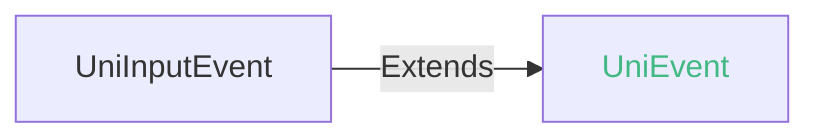
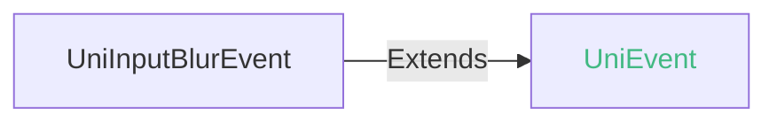
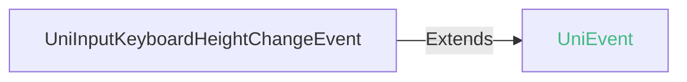
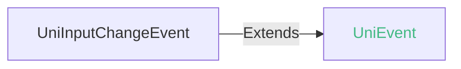
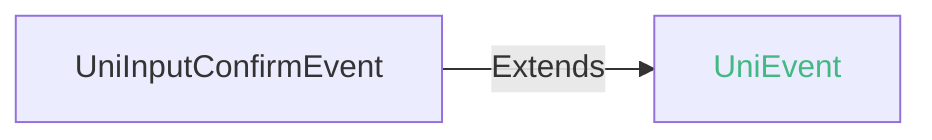

<!-- ## input -->

::: sourceCode
## input

> GitCode: https://gitcode.com/dcloud/uni-component/tree/alpha/uni_modules/uni-input


> GitHub: https://github.com/dcloudio/uni-component/tree/alpha/uni_modules/uni-input

:::

> 组件类型：[UniInputElement](/api/dom/uniinputelement.md) 

 输入框


### 兼容性
| Web | 微信小程序 | Android | iOS | HarmonyOS | HarmonyOS(Vapor) |
| :- | :- | :- | :- | :- | :- |
| 4.0 | 4.41 | 3.9 | 4.11 | 4.61 | 5.0 |


### 属性 
| 名称 | 类型 | 默认值 | 兼容性 | 描述 |
| :- | :- | :- |  :-: | :- |
| name | string | - | Web: 4.0; 微信小程序: 4.41; Android: 3.9; iOS: 4.11; HarmonyOS: 4.61; HarmonyOS(Vapor): 5.0 | 表单的控件名称，作为键值对的一部分与表单(form组件)一同提交 |
| disabled | boolean | false | Web: 4.0; 微信小程序: 4.41; Android: 3.9; iOS: 4.11; HarmonyOS: 4.61; HarmonyOS(Vapor): 5.0 | 是否禁用 |
| value | string | "" | Web: 4.0; 微信小程序: 4.41; Android: 3.9; iOS: 4.11; HarmonyOS: 4.61; HarmonyOS(Vapor): 5.0 | 输入框的初始内容 |
| type | none \| search \| email \| url \| text \| number \| idcard \| digit \| tel \| safe-password \| nickname \| decimal \| numeric | "text" | Web: 4.0; 微信小程序: 4.41; Android: 3.9; iOS: 4.11; HarmonyOS: 4.61; HarmonyOS(Vapor): 5.0 | input的类型 |
| password | boolean | false | Web: 4.0; 微信小程序: 4.41; Android: 3.9; iOS: 4.11; HarmonyOS: 4.61; HarmonyOS(Vapor): 5.0 | 是否是密码类型 |
| placeholder | string | "" | Web: 4.0; 微信小程序: 4.41; Android: 3.9; iOS: 4.11; HarmonyOS: 4.61; HarmonyOS(Vapor): 5.0 | 输入框为空时占位符 |
| placeholder-style | string | "" | Web: 4.0; 微信小程序: 4.41; Android: 3.9; iOS: 4.11; HarmonyOS: 4.61; HarmonyOS(Vapor): 5.0 | 指定 placeholder 的样式 |
| placeholder-class | string([string.ClassString](/uts/data-type.md#ide-string)) | "" | Web: 4.0; 微信小程序: 4.41; Android: 3.9; iOS: 4.11; HarmonyOS: 4.61; HarmonyOS(Vapor): 5.0 | 指定 placeholder 的样式类 |
| maxlength | number | "不限制长度" | Web: 4.0; 微信小程序: 4.41; Android: 3.9; iOS: 4.11; HarmonyOS: 4.61; HarmonyOS(Vapor): 5.0 | 最大输入长度，0和正数为合法值，非法值的时候不限制最大长度 |
| cursor-spacing | number | 0 | Web: x; 微信小程序: 4.41; Android: 3.9; iOS: 4.11; HarmonyOS: x; HarmonyOS(Vapor): x | 指定光标与键盘的距离，单位 px 。取 input 距离底部的距离和 cursor-spacing 指定的距离的最小值作为光标与键盘的距离 |
| cursor-color | string([string.ColorString](/uts/data-type.md#ide-string)) | "" | Web: 4.0; 微信小程序: 4.41; Android: 3.99; iOS: 4.11; HarmonyOS: 4.61; HarmonyOS(Vapor): 5.0 | 指定光标颜色 |
| auto-focus | boolean | false | Web: 4.0; 微信小程序: 4.41; Android: 3.9; iOS: 4.11; HarmonyOS: 4.61; HarmonyOS(Vapor): 5.0 | 自动获取焦点，与`focus`属性对比，此属性只会首次生效。 |
| focus | boolean | false | Web: 4.0; 微信小程序: 4.41; Android: 3.9; iOS: 4.11; HarmonyOS: 4.61; HarmonyOS(Vapor): 5.0 | 获取焦点 |
| confirm-type | send \| search \| next \| go \| done | "done" | Web: 4.0; 微信小程序: 4.41; Android: 3.9; iOS: 4.11; HarmonyOS: 4.61; HarmonyOS(Vapor): 5.0 | 设置键盘右下角按钮的文字，仅在 type为text 时生效。 |
| confirm-hold | boolean | false | Web: 4.0; 微信小程序: 4.41; Android: 3.9; iOS: 4.11; HarmonyOS: 4.61; HarmonyOS(Vapor): 5.0 | 点击键盘右下角按钮时是否保持键盘不收起 |
| cursor | number | 0 | Web: 4.0; 微信小程序: 4.41; Android: 3.9; iOS: 4.11; HarmonyOS: 4.61; HarmonyOS(Vapor): 5.0 | 指定focus时的光标位置 |
| selection-start | number | -1 | Web: 4.0; 微信小程序: 4.41; Android: 3.9; iOS: 4.11; HarmonyOS: 4.61; HarmonyOS(Vapor): 5.0 | 光标起始位置，自动聚集时有效，需与selection-end搭配使用 |
| selection-end | number | -1 | Web: 4.0; 微信小程序: 4.41; Android: 3.9; iOS: 4.11; HarmonyOS: 4.61; HarmonyOS(Vapor): 5.0 | 光标结束位置，自动聚集时有效，需与selection-satrt搭配使用 |
| adjust-position | boolean | true | Web: x; 微信小程序: 4.41; Android: 3.9; iOS: 4.11; HarmonyOS: 4.61; HarmonyOS(Vapor): 5.0 | 键盘弹起时，是否自动上推页面 |
| ~~inputmode~~ | none \| text \| decimal \| numeric \| tel \| search \| email \| url | "text" | Web: 4.0; 微信小程序: x; Android: x; iOS: x; HarmonyOS: x; HarmonyOS(Vapor): - | 是一个枚举属性，它提供了用户在编辑元素或其内容时可能输入的数据类型的提示。在符合条件的高版本webview里，uni-app的 web 和 app-vue 平台中可使用本属性。(自 5.0+ 废弃，推荐使用 type，同时配置以 inputmode 为准) |
| text-content-type | string | - | Web: x; 微信小程序: x; Android: x; iOS: x; HarmonyOS: -; HarmonyOS(Vapor): - | 文本区域的语义，根据类型自动填充 |
| hold-keyboard | boolean | false | Web: x; 微信小程序: 4.41; Android: 4.0; iOS: 4.11; HarmonyOS: 4.61; HarmonyOS(Vapor): x | focus时，点击页面的时候不收起键盘 |
| safe-password-cert-path | string | - | Web: x; 微信小程序: 4.41; Android: x; iOS: x; HarmonyOS: -; HarmonyOS(Vapor): - | 安全键盘加密公钥的路径，只支持包内路径 |
| safe-password-length | number | - | Web: x; 微信小程序: 4.41; Android: x; iOS: x; HarmonyOS: -; HarmonyOS(Vapor): - | 安全键盘输入密码长度 |
| safe-password-time-stamp | number | - | Web: x; 微信小程序: 4.41; Android: x; iOS: x; HarmonyOS: -; HarmonyOS(Vapor): - | 安全键盘加密时间戳 |
| safe-password-nonce | string | - | Web: x; 微信小程序: 4.41; Android: x; iOS: x; HarmonyOS: -; HarmonyOS(Vapor): - | 安全键盘加密盐值 |
| safe-password-salt | string | - | Web: x; 微信小程序: 4.41; Android: x; iOS: x; HarmonyOS: -; HarmonyOS(Vapor): - | 安全键盘计算 hash 盐值，若指定custom-hash 则无效 |
| safe-password-custom-hash | string | - | Web: x; 微信小程序: 4.41; Android: x; iOS: x; HarmonyOS: -; HarmonyOS(Vapor): - | 安全键盘计算 hash 的算法表达式 |
| random-number | boolean | - | Web: x; 微信小程序: x; Android: x; iOS: x; HarmonyOS: x; HarmonyOS(Vapor): - | 当 type 为 number, digit, idcard 数字键盘是否随机排列 |
| controlled | boolean | - | Web: x; 微信小程序: x; Android: x; iOS: x; HarmonyOS: x; HarmonyOS(Vapor): - | 是否为受控组件。为 true 时，value 内容会完全受 setData 控制 |
| always-system | boolean | - | Web: x; 微信小程序: x; Android: x; iOS: x; HarmonyOS: x; HarmonyOS(Vapor): - | 是否强制使用系统键盘和 Web-view 创建的 input 元素。为 true 时，confirm-type、confirm-hold 可能失效 |
| always-embed | boolean | - | Web: x; 微信小程序: 4.41; Android: x; iOS: x; HarmonyOS: -; HarmonyOS(Vapor): - | 强制 input 处于同层状态，默认 focus 时 input 会切到非同层状态 (仅在 iOS 下生效) |
| @input | (event: [UniInputEvent](#uniinputevent)) => void | - | Web: 4.0; 微信小程序: 4.41; Android: 3.9; iOS: 4.11; HarmonyOS: 4.61; HarmonyOS(Vapor): - | 当键盘输入时，触发input事件，event.detail = {value, cursor}，处理函数可以直接 return 一个字符串，将替换输入框的内容。 |
| @focus | (event: [UniInputFocusEvent](#uniinputfocusevent)) => void | - | Web: 4.0; 微信小程序: 4.41; Android: 3.9; iOS: 4.11; HarmonyOS: 4.61; HarmonyOS(Vapor): - | 输入框聚焦时触发，event.detail = { value, height }，height 为键盘高度 |
| @blur | (event: [UniInputBlurEvent](#uniinputblurevent)) => void | - | Web: 4.0; 微信小程序: 4.41; Android: 3.9; iOS: 4.11; HarmonyOS: 4.61; HarmonyOS(Vapor): - | 输入框失去焦点时触发，event.detail = {value: value} |
| @keyboardheightchange | (event: [UniInputKeyboardHeightChangeEvent](#uniinputkeyboardheightchangeevent)) => void | - | Web: x; 微信小程序: 4.41; Android: 3.9; iOS: 4.11; HarmonyOS: 4.61; HarmonyOS(Vapor): - | 键盘高度发生变化的时候触发此事件，event.detail = {height: height, duration: duration} |
| @change | (event: [UniInputChangeEvent](#uniinputchangeevent)) => void | - | Web: x; 微信小程序: 4.41; Android: 4.73; iOS: 4.73; HarmonyOS: 4.73; HarmonyOS(Vapor): - | 非聚焦状态内容改变时触发（仅组件失去焦点时且用户输入改变内容才触发），event.detail = {value: value} |
| @confirm | (event: [UniInputConfirmEvent](#uniinputconfirmevent)) => void | - | Web: 4.0; 微信小程序: 4.41; Android: 3.9; iOS: 4.11; HarmonyOS: 4.61; HarmonyOS(Vapor): - | 点击完成按钮时触发，event.detail = {value: value} |
| @nicknamereview | eventhandle | - | Web: x; 微信小程序: 4.41; Android: x; iOS: x; HarmonyOS: x; HarmonyOS(Vapor): - | *(eventhandle)*<br/>用户昵称审核完毕后触发，仅在 type 为 "nickname" 时有效，event.detail = { pass, timeout } |

#### type 的属性描述

| 合法值 | 兼容性 | 描述 |
| :- |  :-: | :- |
| none | Web: 5.0; 微信小程序: x; Android: 4.73; iOS: 4.73; HarmonyOS: x; HarmonyOS(Vapor): - | 获取焦点时不显示软键盘 |
| search | Web: 5.0; 微信小程序: x; Android: 4.73; iOS: 4.73; HarmonyOS: 4.73; HarmonyOS(Vapor): - | 为搜索输入优化的虚拟键盘 |
| email | Web: 5.0; 微信小程序: x; Android: 4.73; iOS: 4.73; HarmonyOS: 4.73; HarmonyOS(Vapor): - | 为邮件地址输入优化的虚拟键盘 |
| url | Web: 5.0; 微信小程序: x; Android: 4.73; iOS: 4.73; HarmonyOS: 4.73; HarmonyOS(Vapor): - | 为网址输入优化的虚拟键盘 |
| text | Web: 4.0; 微信小程序: 4.41; Android: 3.9; iOS: 4.11; HarmonyOS: 4.61; HarmonyOS(Vapor): - | 文本输入键盘 |
| number | Web: 4.0; 微信小程序: 4.41; Android: 3.9; iOS: 4.11; HarmonyOS: 4.61; HarmonyOS(Vapor): - | 数字输入键盘 |
| idcard | Web: 4.0; 微信小程序: 4.41; Android: x; iOS: x; HarmonyOS: -; HarmonyOS(Vapor): - | 身份证输入键盘 |
| digit | Web: 4.0; 微信小程序: 4.41; Android: 3.9; iOS: 4.11; HarmonyOS: 4.61; HarmonyOS(Vapor): - | 带小数点数字输入键盘 |
| tel | Web: 4.0; 微信小程序: 4.41; Android: 3.9; iOS: 4.11; HarmonyOS: 4.61; HarmonyOS(Vapor): - | 电话输入键盘 |
| safe-password | Web: x; 微信小程序: 4.41; Android: x; iOS: x; HarmonyOS: 4.61; HarmonyOS(Vapor): - | 密码安全输入键盘 |
| nickname | Web: x; 微信小程序: 4.41; Android: x; iOS: x; HarmonyOS: -; HarmonyOS(Vapor): - | 昵称输入键盘 |
| decimal | Web: 5.0; 微信小程序: -; Android: x; iOS: x; HarmonyOS: -; HarmonyOS(Vapor): - | 小数输入键盘，包含数字和分隔符（通常是“ . ”或者“ , ”），设备可能也可能不显示减号键。 |
| numeric | Web: 5.0; 微信小程序: -; Android: x; iOS: x; HarmonyOS: -; HarmonyOS(Vapor): - | 数字输入键盘，所需要的就是 0 到 9 的数字，设备可能也可能不显示减号键。 |

#### confirm-type 的属性描述

| 合法值 | 兼容性 | 描述 |
| :- |  :-: | :- |
| send | Web: 4.0; 微信小程序: 4.41; Android: 3.9; iOS: 4.11; HarmonyOS: 4.61; HarmonyOS(Vapor): - | 发送 |
| search | Web: 4.0; 微信小程序: 4.41; Android: 3.9; iOS: 4.11; HarmonyOS: -; HarmonyOS(Vapor): - | 搜索 |
| next | Web: 4.0; 微信小程序: 4.41; Android: 3.9; iOS: 4.11; HarmonyOS: -; HarmonyOS(Vapor): - | 下一个 |
| go | Web: 4.0; 微信小程序: 4.41; Android: 3.9; iOS: 4.11; HarmonyOS: -; HarmonyOS(Vapor): - | 前往 |
| done | Web: 4.0; 微信小程序: 4.41; Android: 3.9; iOS: 4.11; HarmonyOS: -; HarmonyOS(Vapor): - | 完成 |

#### inputmode 的属性描述

| 合法值 | 兼容性 | 描述 |
| :- |  :-: | :- |
| none | Web: 4.0; 微信小程序: -; Android: x; iOS: x; HarmonyOS: -; HarmonyOS(Vapor): - | 无虚拟键盘。在应用程序或者站点需要实现自己的键盘输入控件时很有用。 |
| text | Web: 4.0; 微信小程序: -; Android: x; iOS: x; HarmonyOS: -; HarmonyOS(Vapor): - | 使用用户本地区域设置的标准文本输入键盘。 |
| decimal | Web: 4.0; 微信小程序: -; Android: x; iOS: x; HarmonyOS: -; HarmonyOS(Vapor): - | 小数输入键盘，包含数字和分隔符（通常是“ . ”或者“ , ”），设备可能也可能不显示减号键。 |
| numeric | Web: 4.0; 微信小程序: -; Android: x; iOS: x; HarmonyOS: -; HarmonyOS(Vapor): - | 数字输入键盘，所需要的就是 0 到 9 的数字，设备可能也可能不显示减号键。 |
| tel | Web: 4.0; 微信小程序: -; Android: x; iOS: x; HarmonyOS: -; HarmonyOS(Vapor): - | 电话输入键盘，包含 0 到 9 的数字、星号（*）和井号（#）键。表单输入里面的电话输入通常应该使用 \<input type="tel"\> 。 |
| search | Web: 4.0; 微信小程序: -; Android: x; iOS: x; HarmonyOS: -; HarmonyOS(Vapor): - | 为搜索输入优化的虚拟键盘，比如，返回键可能被重新标记为“搜索”，也可能还有其他的优化。 |
| email | Web: 4.0; 微信小程序: -; Android: x; iOS: x; HarmonyOS: -; HarmonyOS(Vapor): - | 为邮件地址输入优化的虚拟键盘，通常包含"@"符号和其他优化。表单里面的邮件地址输入应该使用 \<input type="email"\> 。 |
| url | Web: 4.0; 微信小程序: -; Android: x; iOS: x; HarmonyOS: -; HarmonyOS(Vapor): - | 为网址输入优化的虚拟键盘，比如，“/”键会更加明显、历史记录访问等。表单里面的网址输入通常应该使用 \<input type="url"\> 。 |

#### text-content-type 的属性描述

| 合法值 | 兼容性 | 描述 |
| :- |  :-: | :- |
| oneTimeCode | Web: x; 微信小程序: -; Android: x; iOS: x; HarmonyOS: x; HarmonyOS(Vapor): - | 一次性验证码 |


### 事件
#### UniInputEvent


##### UniInputEvent 的属性值
| 名称 | 类型 | 必填 | 默认值 | 兼容性 | 描述 |
| :- | :- | :- | :- |  :-: | :- |
| detail | **UniInputEventDetail** | 是 | - | - | - |

#### detail 的属性描述

| 名称 | 类型 | 必备 | 默认值 | 兼容性 | 描述 |
| :- | :- | :- | :- |  :-: | :- |
| value | string | 是 | - | - | 输入框内容 |
| cursor | number | 是 | - | - | 光标的位置 |
| keyCode | number | 是 | - | - | 输入字符的Unicode值 |


#### UniInputFocusEvent


##### UniInputFocusEvent 的属性值
| 名称 | 类型 | 必填 | 默认值 | 兼容性 | 描述 |
| :- | :- | :- | :- |  :-: | :- |
| detail | **UniInputFocusEventDetail** | 是 | - | - | - |

#### detail 的属性描述

| 名称 | 类型 | 必备 | 默认值 | 兼容性 | 描述 |
| :- | :- | :- | :- |  :-: | :- |
| height | number | 是 | - | Web: x; 微信小程序: -; Android: 3.9; iOS: 4.11; HarmonyOS: -; HarmonyOS(Vapor): - | 键盘高度 |
| value | string | 是 | - | - | 输入框内容 |


#### UniInputBlurEvent


##### UniInputBlurEvent 的属性值
| 名称 | 类型 | 必填 | 默认值 | 兼容性 | 描述 |
| :- | :- | :- | :- |  :-: | :- |
| detail | **UniInputBlurEventDetail** | 是 | - | - | - |

#### detail 的属性描述

| 名称 | 类型 | 必备 | 默认值 | 兼容性 | 描述 |
| :- | :- | :- | :- |  :-: | :- |
| value | string | 是 | - | - | 输入框内容 |
| cursor | number | 是 | - | - | 选择区域的起始位置 |


#### UniInputKeyboardHeightChangeEvent


##### UniInputKeyboardHeightChangeEvent 的属性值
| 名称 | 类型 | 必填 | 默认值 | 兼容性 | 描述 |
| :- | :- | :- | :- |  :-: | :- |
| detail | **UniInputKeyboardHeightChangeEventDetail** | 是 | - | - | - |

#### detail 的属性描述

| 名称 | 类型 | 必备 | 默认值 | 兼容性 | 描述 |
| :- | :- | :- | :- |  :-: | :- |
| height | number | 是 | - | - | 键盘高度 |
| duration | number | 是 | - | - | 持续时间 |


#### UniInputChangeEvent


##### UniInputChangeEvent 的属性值
| 名称 | 类型 | 必填 | 默认值 | 兼容性 | 描述 |
| :- | :- | :- | :- |  :-: | :- |
| detail | **UniInputChangeEventDetail** | 是 | - | - | - |

#### detail 的属性描述

| 名称 | 类型 | 必备 | 默认值 | 兼容性 | 描述 |
| :- | :- | :- | :- |  :-: | :- |
| value | string | 是 | - | - | 输入框内容 |


#### UniInputConfirmEvent


##### UniInputConfirmEvent 的属性值
| 名称 | 类型 | 必填 | 默认值 | 兼容性 | 描述 |
| :- | :- | :- | :- |  :-: | :- |
| detail | **UniInputConfirmEventDetail** | 是 | - | - | - |

#### detail 的属性描述

| 名称 | 类型 | 必备 | 默认值 | 兼容性 | 描述 |
| :- | :- | :- | :- |  :-: | :- |
| value | string | 是 | - | - | 输入框内容 |


<!-- UTSCOMJSON.input.component_type-->

#### 获取原生view对象

为增强uni-app x组件的开放性，从 `HBuilderX 4.25` 起，UniElement对象提供了 [getAndroidView](../dom/unielement.md#getandroidview) 和 [getIOSView](../dom/unielement.md#getiosview) 方法。

该方法可以获取到 textarea 组件对应的原生对象，即Android的`AppCompatEditText`对象、iOS的`UITextField`对象。

进而可以调用原生对象提供的方法，这极大的扩展了组件的能力。

**Android 平台：**

获取input组件对应的UniElement对象，通过UniElement对象的[getAndroidView](../dom/unielement.md#getandroidview-2)方法获取组件原生AppCompatEditText对象

```uts
//导入安卓原生AppCompatEditText对象
import AppCompatEditText from "androidx.appcompat.widget.AppCompatEditText"

//通过input组件定义的id属性值，获取input标签的UniElement对象
const inputElement = uni.getElementById(id)
//UniElement.getAndroidView设置泛型为安卓底层AppCompatEditText对象，直接获取AppCompatEditText， 如果泛型不匹配会返回null
if(inputElement != null) {
	//editText就是input组件对应的原生view对象
	const editText = inputElement.getAndroidView<AppCompatEditText>()
}
```

**iOS 平台：**

获取input组件对应的UniElement对象，通过UniElement对象的[getIOSView](../dom/unielement.md#getiosview)方法获取组件原生UITextField对象

```uts
//通过 input 组件定义的 id 属性值，获取 input 标签的 UniElement 对象
const inputElement = uni.getElementById(id)
//获取原生 view
const view = inputElement?.getIOSView();
//判断 view 是否存在，类型是否为 UITextField
if (view != null && view instanceof UITextField) {
    //将 view 转换为 UITextField 类型
    const textField = view! as UITextField;
}
```

+ iOS平台 uvue 环境使用 js 驱动无法处理原生类型，getIOSView 方法需要在 uts 插件中使用。

更多示例请参考 uts 插件 [uts-get-native-view](https://gitcode.com/dcloud/hello-uni-app-x/blob/alpha/uni_modules/uts-get-native-view/utssdk/app-ios/index.uts)

### 子组件 @children-tags
不可以嵌套组件

### 示例
示例为[hello uni-app x alpha分支](https://gitcode.com/dcloud/hello-uni-app-x/blob/prod_alpha/pages/component/input/input.uvue)，与最新HBuilderX Alpha版同步。与最新正式版同步的master分支示例[另见](https://gitcode.com/dcloud/hello-uni-app-x/blob/master//pages/component/input/input.uvue) 
::: preview https://hellouniappx.dcloud.net.cn/web/#/pages/component/input/input

> appRedirect https://hellouniappx.dcloud.net.cn/appredirect.html?path=pages/component/input/input

>示例
```vue
<template>
  <!-- #ifdef APP -->
  <scroll-view style="flex: 1">
  <!-- #endif -->
    <page-head :title="data.title"></page-head>
    <view class="uni-common-mt uni-padding-wrap" style="padding-bottom: 30px;">
      <view>
        <view class="uni-title">
          <text class="uni-title-text">设置输入框的初始内容</text>
        </view>
        <view class="input-wrapper">
          <input id="uni-input-default" :focus="data.firstInputFocus" class="uni-input" value="hello uni-app x" />
        </view>
      </view>

      <view>
        <view class="uni-title">
          <text class="uni-title-text">type取值（不同输入法表现可能不一致）</text>
        </view>
        <view class="input-wrapper">
          <input id="uni-input-type-text" class="uni-input" type="text" placeholder="文本输入键盘" />
        </view>
        <view class="input-wrapper">
          <input id="uni-input-type-number" class="uni-input" type="number" placeholder="数字输入键盘" />
        </view>
        <view class="input-wrapper">
          <input id="uni-input-type-digit" class="uni-input" type="digit" placeholder="带小数点的数字输入键盘" />
        </view>
        <view class="input-wrapper">
          <input id="uni-input-type-tel" class="uni-input" :type="data.inputTypeTel" placeholder="电话输入键盘" />
        </view>
        <!-- #ifndef MP-WEIXIN -->
        <view class="input-wrapper">
          <input id="uni-input-type-search" class="uni-input" type="search" placeholder="搜索输入键盘" />
        </view>
        <view class="input-wrapper">
          <input id="uni-input-type-email" class="uni-input" type="email" placeholder="邮箱输入键盘" />
        </view>
        <view class="input-wrapper">
          <input id="uni-input-type-url" class="uni-input" type="url" placeholder="url输入键盘" />
        </view>
        <view class="input-wrapper">
          <input id="uni-input-type-none" class="uni-input" type="none" placeholder="聚焦但不弹出键盘" />
        </view>
        <!-- #endif -->
      </view>

      <view>
        <view class="uni-title">
          <text class="uni-title-text">密码输入框</text>
        </view>
        <view class="input-wrapper">
          <input id="uni-input-password" class="uni-input" :password="data.inputPassword" type="text" :value="data.inputPasswordValue" />
        </view>
      </view>

      <view>
        <view class="uni-title">
          <text class="uni-title-text">无value设置的密码输入框</text>
        </view>
        <view class="input-wrapper">
          <input class="uni-input" :password="true" type="text" />
        </view>
      </view>

      <view>
        <view class="uni-title">
          <text class="uni-title-text">占位符样式</text>
        </view>
        <view class="input-wrapper">
          <input id="uni-input-placeholder1" class="uni-input" :placeholder-style="data.inputPlaceHolderStyle"
            placeholder="占位符文字颜色为红色" />
        </view>
        <view class="input-wrapper">
          <input id="uni-input-placeholder2" class="uni-input" :placeholder-class="data.inputPlaceHolderClass"
            placeholder="占位符字体大小为10px" />
        </view>
        <view class="input-wrapper">
          <input id="uni-input-placeholder3" class="uni-input" placeholder-class=""
            placeholder="placeholder-class 传入空字符串" />
        </view>
        <view class="input-wrapper">
          <input class="uni-input" :placeholder-style="data.inputPlaceHolderStyle"
            value="不设置placeholder只设置placeholder-style" />
        </view>
        <view class="input-wrapper">
          <input id="uni-input-placeholder2" style="font-family: AlimamaDaoLiTiOTF;font-weight: bold;text-align: right;" class="uni-input" :placeholder-style="data.placeholderStyle"
            placeholder="占位符以及内容右对齐" />
        </view>
      </view>

      <view>
        <view class="uni-title">
          <text class="uni-title-text">设置禁用输入框</text>
        </view>
        <view class="input-wrapper">
          <input id="uni-input-disable" class="uni-input" :disabled="true" value="禁用状态 input" />
        </view>
      </view>

      <view>
        <view class="uni-title">
          <text class="uni-title-text">设置最大输入长度</text>
        </view>
        <view class="input-wrapper">
          <input id="uni-input-maxlength" class="uni-input" :maxlength="10" placeholder="最大输入长度为10"
            :value="data.inputMaxLengthValue" @input="onMaxLengthInput" :focus="data.inputMaxLengthFocus" />
        </view>
      </view>

      <view>
        <view class="uni-title">
          <text class="uni-title-text">设置光标与键盘的距离</text>
        </view>
        <view class="input-wrapper">
          <input class="uni-input" :cursor-spacing="1000" placeholder="光标与键盘的距离为1000px" />
        </view>
      </view>

      <view>
        <view class="uni-title">
          <text class="uni-title-text">自动获取焦点</text>
        </view>
        <view class="input-wrapper">
          <input id="uni-input-focus" class="uni-input" :focus="data.focus"
            @keyboardheightchange="inputFocusKeyBoardChange" />
        </view>
      </view>

      <view>
        <view class="uni-title">
          <text class="uni-title-text">confirm-type取值（不同输入法表现可能不一致）</text>
        </view>
        <view class="input-wrapper">
          <input id="uni-input-confirm-send" class="uni-input" confirmType="send" placeholder="键盘右下角按钮显示为发送" />
        </view>
        <view class="input-wrapper">
          <input id="uni-input-confirm-search" class="uni-input" confirmType="search" placeholder="键盘右下角按钮显示为搜索" />
        </view>
        <view class="input-wrapper">
          <input id="uni-input-confirm-next" class="uni-input" confirmType="next" placeholder="键盘右下角按钮显示为下一个" />
        </view>
        <view class="input-wrapper">
          <input id="uni-input-confirm-go" class="uni-input" confirmType="go" placeholder="键盘右下角按钮显示为前往" />
        </view>
        <view class="input-wrapper">
          <input id="uni-input-confirm-done" class="uni-input" confirmType="done" placeholder="键盘右下角按钮显示为完成" />
        </view>
      </view>

      <view>
        <view class="uni-title">
          <text class="uni-title-text">点击键盘右下角按钮时保持键盘不收起</text>
        </view>
        <view class="input-wrapper">
          <input class="uni-input" :confirm-hold="true" />
        </view>
      </view>

      <view>
        <view class="uni-title" @click="setCursor(4)">
          <text class="uni-title-text">设置输入框聚焦时光标的位置（点这里）</text>
        </view>
        <view class="input-wrapper">
          <input ref="input" class="uni-input" value="0123456789" :focus="data.cursorInputFocus" :cursor="data.cursor" @blur="onCursorBlurChange" />
        </view>
      </view>

      <view>
        <view class="uni-title" @click="setSelection(0, 4)">
          <text class="uni-title-text">设置输入框聚焦时光标的起始位置和结束位置（点这里）</text>
        </view>
        <view class="input-wrapper">
          <input ref="input2" class="uni-input" value="0123456789" :selection-start="data.selectionStart"
            :selection-end="data.selectionEnd" :focus="data.selectionInputFocus" @blur="onSelectionBlurChange" />
        </view>
      </view>

      <view>
        <view class="uni-title" style="flex-direction: row; align-items: center">
          <text class="uni-title-text" style="flex-shrink: 1;">设置光标颜色为红色（Android的微信小程序非skyline下仅支持黑和绿）</text>
          <switch style="margin-left: 10px" @change="changeCursorColor" :checked="data.cursor_color == '#FF0000'"></switch>
        </view>
        <view class="input-wrapper">
          <input id="uni-input-cursor-color" class="uni-input" :cursor-color="data.cursor_color" :focus="data.cursorColorInputFocus" @blur="cursorColorInputBlur" value="光标颜色" />
        </view>
      </view>

      <view>
        <view class="uni-title">
          <text class="uni-title-text">键盘弹起时，自动上推页面</text>
        </view>
        <view class="input-wrapper">
          <input class="uni-input" :adjust-position="true" />
        </view>
      </view>

      <view>
        <view class="uni-title" style="flex-direction: row; align-items: center">
          <text class="uni-title-text" style="flex-shrink: 1;">设置hold-keyboard</text>
          <switch style="margin-left: 10px" @change="changeHoldKeyboard" :checked="data.holdKeyboard"></switch>
        </view>
        <view class="input-wrapper">
          <input class="uni-input" :hold-keyboard="data.holdKeyboard" value="hold keyboard " />
        </view>
      </view>

      <view>
        <view class="uni-title">
          <text class="uni-title-text">通过 style 设置 padding</text>
        </view>
        <view class="input-wrapper">
          <input class="uni-input" style="height: 60px;padding: 20px;" value="style padding:20px" placeholder="style padding:20px"></input>
        </view>
      </view>

      <view>
        <view class="uni-title">
          <text class="uni-title-text">input事件</text>
          <text class="uni-subtitle-text" v-if="data.inputEventDetail">{{
            data.inputEventDetail
          }}</text>
        </view>
        <view class="input-wrapper">
          <input class="uni-input" @input="onInput" />
        </view>
      </view>

      <view>
        <view class="uni-title">
          <text class="uni-title-text" @click="triggerFocusOrBlur">点击触发focus事件或blur事件</text>
          <text class="uni-subtitle-text" v-if="data.focusAndBlurEventDetail">{{
            data.focusAndBlurEventDetail
          }}</text>
        </view>
        <view class="input-wrapper">
          <input id="trigger-focus-blur-input" class="uni-input" @focus="onFocus" @blur="onBlur" />
        </view>
      </view>

      <view>
        <view class="uni-title">
          <text class="uni-title-text">confirm事件</text>
          <text class="uni-subtitle-text" v-if="data.confirmEventDetail">{{
            data.confirmEventDetail
          }}</text>
        </view>
        <view class="input-wrapper">
          <input class="uni-input" @confirm="onConfirm" />
        </view>
      </view>

      <view>
        <view class="uni-title">
          <text class="uni-title-text">change事件</text>
          <text class="uni-subtitle-text" v-if="data.changeEventDetail">{{
            data.changeEventDetail
          }}</text>
        </view>
        <view class="input-wrapper">
          <input class="uni-input" @change="onChange" />
        </view>
      </view>

      <view>
        <view class="uni-title">
          <text class="uni-title-text">带清除按钮的输入框</text>
        </view>
        <view class="input-wrapper">
          <input class="uni-input" placeholder="带清除按钮的输入框" :value="data.inputClearValue" @input="clearInput" />
          <image class="uni-icon" src="/static/icons/clear.png" v-if="data.showClearIcon" @click="clearIcon">
          </image>
        </view>
      </view>

      <view>
        <view class="uni-title">
          <text class="uni-title-text">可查看密码的输入框</text>
        </view>
        <view class="input-wrapper">
          <input class="uni-input" placeholder="请输入密码" :password="data.showPassword" />
          <image class="uni-icon" :src="
              !data.showPassword
                ? '/static/icons/eye-active.png'
                : '/static/icons/eye.png'
            " @click="changePassword"></image>
        </view>
      </view>
      <view>
        <view class="uni-title">
          <text class="uni-title-text">同时存在 v-model 和 value</text>
        </view>
        <view class="input-wrapper">
          <input id="both-model-value" class="uni-input" v-model="data.demoValue" value="456" />
        </view>
      </view>

      <view>
        <view class="uni-title">
          <text class="uni-title-text">同时存在 v-model 和 change事件</text>
        </view>
        <view class="input-wrapper">
          <input class="uni-input" v-model="data.demoValue2" value="123" @change="onChange" />
        </view>
      </view>

      <view>
        <view class="uni-title" style="flex-direction: row; align-items: center">
          <text class="uni-title-text" style="flex-shrink: 1;">设置adjust-position</text>
          <switch style="margin-left: 10px" @change="changeAdjustPosition" :checked="data.adjustPosition"></switch>
        </view>
        <view class="input-wrapper">
          <input class="uni-input" :adjust-position="data.adjustPosition" />
        </view>
      </view>

      <view>
        <view class="uni-title">
          <text class="uni-title-text">输入内容的同步更新UI</text>
        </view>
        <text>{{data.syncDisplayValue}}</text>
        <view class="input-wrapper">
          <input class="uni-input" v-model="data.syncDisplayValue"/>
        </view>
      </view>

      <view>
        <view class="uni-title">
          <text class="uni-title-text">maxlength初始化生效</text>
        </view>
        <view class="input-wrapper">
          <input class="uni-input" :maxlength="5" value="123456789"/>
        </view>
      </view>

      <view>
        <view class="uni-title">
          <text class="uni-title-text">focus时type是none，键盘是否弹出</text>
          <boolean-data :defaultValue="false" title="显示<input />示例" @change="changeCheckedTypeNoneAndFocusCase"></boolean-data>
        </view>
        <view v-if="data.showTypeNoneAndFocusCase" class="input-wrapper">
          <input class="uni-input" focus="true" type="none"/>
        </view>
      </view>

      <view>
        <view class="uni-title">
          <text class="uni-title-text">style 设置 font-size:20px</text>
        </view>
        <view class="input-wrapper">
          <input class="uni-input" style="font-size:20px" placeholder="placeholder" />
        </view>
      </view>

      <view>
        <view class="uni-title">
          <text class="uni-title-text">style 设置 font-size:20px</text>
          <text class="uni-title-text">placeholder-class 设置 30px</text>
        </view>
        <view class="input-wrapper">
          <input class="uni-input" style="font-size:20px" placeholder-class="placeholder-class" placeholder="placeholder" />
        </view>
      </view>

      <view>
        <view class="uni-title">
          <text class="uni-title-text">style 设置 font-size:20px</text>
          <text class="uni-title-text">placeholder-class 设置 30px</text>
          <text class="uni-title-text">placeholder-style 设置 40px</text>
        </view>
        <view class="input-wrapper">
          <input class="uni-input" style="font-size:20px" placeholder-class="placeholder-class" placeholder-style="font-size:40px" placeholder="placeholder" />
        </view>
      </view>

      <!-- 保证这个示例在页面底部，添加新的示例时请放在上面 -->
      <view>
        <view class="uni-title">
          <text class="uni-title-text">keyboardheightchange事件</text>
          <text class="uni-subtitle-text"
            v-if="data.keyboardHeightChangeEventDetail">{{ data.keyboardHeightChangeEventDetail }}</text>
        </view>
        <view class="input-wrapper">
          <input class="uni-input" @keyboardheightchange="onKeyboardHeightChange"
            :focus="data.focusedForKeyboardHeightChangeTest" />
        </view>
      </view>

      <text class="uni-title-text">input样式大合集</text>
      <view class="input-wrap">
        <input class="input-all-styles" value="样式效果：文本颜色深蓝色、字号16px、字重400、文本居左对齐；外边距10px、内边距10px；圆角8px；浅蓝色渐变背景、蓝色边框、透明度70%、阴影效果。" />
      </view>

      <!-- 保证这个示例在页面底部，添加新的示例时请放在上面 -->
      <navigator url="/pages/component/input/input-performance" style="margin-top: 10px;">
        <button type="primary">
          input 性能测试
        </button>
      </navigator>
    </view>
  <!-- #ifdef APP -->
  </scroll-view>
  <!-- #endif -->
</template>
<script setup lang="uts">
  type DataType = {
    title: string;
    firstInputFocus: boolean;
    showClearIcon: boolean;
    inputClearValue: string;
    showPassword: boolean;
    cursor: number;
    cursorInputFocus: boolean;
    cursor_color: string;
    cursorColorInputFocus: boolean;
    selectionStart: number;
    selectionEnd: number;
    selectionInputFocus: boolean;
    inputEventDetail: string;
    focusAndBlurEventDetail: string;
    confirmEventDetail: string;
    changeEventDetail: string;
    keyboardHeightChangeEventDetail: string;
    focus: boolean;
    inputPassword: boolean;
    inputTypeTel: string;
    inputPlaceHolderStyle: string;
    placeholderStyle: string;
    inputPlaceHolderClass: string.ClassString;
    inputMaxLengthValue: string;
    onMaxLengthInputValue: string;
    inputMaxLengthFocus: boolean;
    inputPasswordValue: string;
    inputFocusKeyBoardChangeValue: boolean;
    holdKeyboard: boolean;
    keyboardHeight: number;
    focusedForKeyboardHeightChangeTest: boolean;
    demoValue: string;
    demoValue2: string;
    adjustPosition: boolean;
    syncDisplayValue: string;
    triggerFocus: boolean;
    triggerBlur: boolean;
    showTypeNoneAndFocusCase: boolean;
  }

  // 使用reactive避免ref数据在自动化测试中无法访问
  const data = reactive({
    title: 'input',
    firstInputFocus: false,
    showClearIcon: false,
    inputClearValue: '',
    showPassword: true,
    cursor: -1,
    cursorInputFocus: false,
    cursor_color: "#3393E2",
    cursorColorInputFocus: false,
    selectionStart: -1,
    selectionEnd: -1,
    selectionInputFocus: false,
    inputEventDetail: '',
    focusAndBlurEventDetail: '',
    confirmEventDetail: '',
    changeEventDetail: '',
    keyboardHeightChangeEventDetail: '',
    focus: true,
    inputPassword: true,
    inputTypeTel: "tel",
    inputPlaceHolderStyle: "color:red",
    placeholderStyle: "font-family: AlimamaDaoLiTiOTF;font-weight: bold;text-align: right",
    inputPlaceHolderClass: "uni-input-placeholder-class",
    inputMaxLengthValue: "",
    onMaxLengthInputValue: "",
    inputMaxLengthFocus: false,
    inputPasswordValue: "cipher",
    inputFocusKeyBoardChangeValue: true,
    holdKeyboard: false,
    keyboardHeight: 0,
    focusedForKeyboardHeightChangeTest: false,
    demoValue: '123',
    demoValue2: '123',
    adjustPosition: false,
    syncDisplayValue: '',
    triggerFocus: false,
    triggerBlur: false,
    showTypeNoneAndFocusCase: false
  } as DataType)

  const inputFocusKeyBoardChange = (e : UniInputKeyboardHeightChangeEvent) => {
    data.inputFocusKeyBoardChangeValue = e.detail.height > 50
  }

  const onMaxLengthInput = (event : UniInputEvent) => {
    data.onMaxLengthInputValue = event.detail.value
  }

  const setCursor = (cursor : number) => {
    // (this.$refs['input'] as UniInputElement).focus();
    data.cursorInputFocus = true
    data.cursor = cursor;
  }

  const onCursorBlurChange = () => {
    data.cursor = 0
    data.cursorInputFocus = false
  }

  const setSelection = (selectionStart : number, selectionEnd : number) => {
    // (this.$refs['input2'] as UniInputElement).focus();
    data.selectionInputFocus = true
    data.selectionStart = selectionStart;
    data.selectionEnd = selectionEnd;
  }

  const onSelectionBlurChange = () => {
    data.selectionEnd = 0;
    data.selectionInputFocus = false
  }

  const clearInput = (event : UniInputEvent) => {
    data.inputClearValue = event.detail.value
    if (event.detail.value.length > 0) {
      data.showClearIcon = true
    } else {
      data.showClearIcon = false
    }
  }

  const clearIcon = () => {
    data.inputClearValue = ''
    data.showClearIcon = false
  }

  const changePassword = () => {
    data.showPassword = !data.showPassword
  }

  const onInput = (event : UniInputEvent) => {
    console.log("键盘输入", JSON.stringify(event.detail));
    data.inputEventDetail = JSON.stringify(event.detail)
  }

  const onFocus = (event : UniInputFocusEvent) => {
    data.triggerFocus = true
    console.log("输入框聚焦", JSON.stringify(event.detail));
    data.focusAndBlurEventDetail = JSON.stringify(event.detail);
  }

  const onBlur = (event : UniInputBlurEvent) => {
    data.triggerBlur = true
    console.log("输入框失去焦点", JSON.stringify(event.detail));
    data.focusAndBlurEventDetail = JSON.stringify(event.detail);
  }

  const onConfirm = (event : UniInputConfirmEvent) => {
    console.log("点击完成按钮", JSON.stringify(event.detail));
    data.confirmEventDetail = JSON.stringify(event.detail);
  }

  const onChange = (event : UniInputChangeEvent) => {
    console.log("输入内容变化", JSON.stringify(event.detail));
    data.changeEventDetail = JSON.stringify(event.detail);
  }

  const onKeyboardHeightChange = (event : UniInputKeyboardHeightChangeEvent) => {
    console.log("键盘高度发生变化", JSON.stringify(event.detail));
    data.keyboardHeightChangeEventDetail = JSON.stringify(event.detail);
    data.keyboardHeight = event.detail.height;
  }

  const test_check_input_value = () : number => {
    return data.onMaxLengthInputValue.length
  }

  const changeCursorColor = (event : UniSwitchChangeEvent) => {
    const checked = event.detail.value;
    if (checked) {
      data.cursor_color = "#FF0000"
    } else {
      data.cursor_color = "#3393E2"
    }
    // const input = uni.getElementById<UniInputElement>("uni-input-cursor-color")
    // input?.focus()
    data.cursorColorInputFocus = true
  }

  const cursorColorInputBlur = (event : UniInputBlurEvent) => {
    data.cursorColorInputFocus = false
  }

  const changeHoldKeyboard = (event : UniSwitchChangeEvent) => {
    const checked = event.detail.value;
    data.holdKeyboard = checked
  }

  const changeAdjustPosition = (event : UniSwitchChangeEvent) => {
    const checked = event.detail.value;
    data.adjustPosition = checked
  }

  const triggerFocusOrBlur = () => {
    const input = uni.getElementById("trigger-focus-blur-input")!
    if(data.triggerFocus){
      data.triggerFocus = false
      input.blur()
    } else {
      data.triggerBlur = false
      input.focus()
    }
  }


  const changeCheckedTypeNoneAndFocusCase = (checked : boolean) => {
    data.showTypeNoneAndFocusCase = checked
  }

  defineExpose({
    data,
    triggerFocusOrBlur
  })
</script>

<style scoped>
  .input-wrapper {
    display: flex;
    padding: 8px 13px;
    margin: 5px 0;
    flex-direction: row;
    flex-wrap: nowrap;
    background-color: #ffffff;
  }

  .uni-input {
    height: 28px;
    font-size: 15px;
    padding: 0px;
    flex: 1;
    background-color: #ffffff;
  }

  .uni-icon {
    width: 24px;
    height: 24px;
  }

  .uni-input-placeholder-class {
    font-size: 10px;
  }

  .placeholder-class{
    font-size: 30px;
  }

  .input-wrap {
    flex-direction: row;
    justify-content: center;
  }

  .input-all-styles {
    color: #0008a7;
    font-family: Arial, sans-serif;
    font-size: 16px;
    font-weight: 400;
    text-align: left;
    width: 90%;
    height: 40px;
    min-width: 200px;
    margin: 10px;
    padding: 10px;
    border-radius: 8px;
    background-color: #e3f2fd;
    background-image: linear-gradient(to right, #e3f2fd, #a9d5fa);
    border: 1px solid #007aff;
    opacity: 0.7;
    box-shadow: 0 2px 4px rgba(0, 0, 0, 0.1);
  }

  @font-face {
    font-family: AlimamaDaoLiTiOTF;
    src: url('/static/font/AlimamaDaoLiTi.otf');
  }
</style>

```

:::


### 参见
- [相关 Bug](https://issues.dcloud.net.cn/?mid=component.form-component.input)
- [参见uni-app相关文档](https://uniapp.dcloud.io/component/input.html)
- [微信小程序文档](https://developers.weixin.qq.com/miniprogram/dev/component/input.html)
- [支付宝小程序文档](https://open.alipay.com/portal/zhichi/search?keyword=input&pageIndex=1&pageSize=10&source=doc_top&type=all)
- [百度小程序文档](https://smartprogram.baidu.com/forum/search?query=input&scope=devdocs&source=docs)
- [抖音小程序文档](https://developer.open-douyin.com/search-page?keyword=input&secondType=all&type=1)
- [飞书小程序文档](https://open.feishu.cn/search?from=header&page=1&pageSize=10&q=input&topicFilter=)
- [钉钉小程序文档](https://open.dingtalk.com/search?keyword=input)
- [QQ小程序文档](https://q.qq.com/wiki/develop/miniprogram/frame/)
- [快手小程序文档](https://developers.kuaishou.com/page?keyword=input&from=docs)
- [京东小程序文档](https://mp-docs.jd.com/doc/dev/framework/-1)
- [华为快应用文档](https://developer.huawei.com/consumer/cn/doc/quickApp-References/webview-frame-overview-0000001124793625)
- [360小程序文档](https://mp.360.cn/doc/miniprogram/dev/#/b770a184ff1f06c6b3393a0fd1132380)

## 键盘上推专题@adjust-position

在App平台，input和textarea组件都一个属性`adjust-position`，默认为true，即软键盘弹出时，默认上推页面以显示出输入框，避免输入框被软键盘遮挡。

软键盘弹出后会挡住输入框，此时启动上推逻辑。默认的上推策略是：
- 如果输入框在scroll-view里，会优先滚动scroll-view，以保证显示出输入框(App-Harmony 暂不支持)。
- 如果没有可滚动区域，会transform上移页面，以保证显示出输入框。

但是默认的上推策略无法适配所有场景，有些场景需要关闭默认上推策略，即把属性`adjust-position`设为false，然后在输入框的focus或keyboardheightchange事件中获取键盘高度，手动调整界面。

默认上推策略时，如果页面使用了自定义导航栏，常见注意事项是软键盘弹出后可能把自定义导航栏推出可视范围。\
此时注意顶部导航栏不能在滚动视图中，且需要使用css固定在顶部，然后下面放一个scroll-view，输入框放在scroll-view中，就不会把自定义导航栏顶飞。\
如果这种方式仍然不能满足需求，那么就需要关闭默认的上推策略，手动控制。

在web端平台，输入框上推逻辑是由浏览器自动完成的，属性`adjust-position`无效。
但iOS safari软键盘弹出时，整个页面会上推而不是挤压，导致pages.json配置的导航栏会上移到屏幕之外。

推荐参考代码：[hello uni-app x -> 模板 -> 自定义导航栏](https://gitcode.com/dcloud/hello-uni-app-x/blob/alpha/pages/template/navbar-lite/navbar-lite.uvue)。为了避免自定义导航栏被顶飞，有的可以自动上推，有的需手动控制，这里均有示例。

## comfirm-type和inputmode说明

1. comfirm-type
Web平台弹出键盘使用的是浏览器控制的键盘，在Chrome81+、Safari13.7+之前，键盘右下角文字只能设置完成和搜索，从Chrome81+、Safari13.7+起支持设置发送、下一个。

2. inputmode

web平台的inputmode的浏览器兼容性如下： Chrome >= 66、Edge >= 79、Firefox >= 95、Chrome Android >= 66、Firefox for Android >= 79、Safari on iOS >= 12.2、WebView Android >= 66

3. input组件有 inputmode 和 type、comfirm-type 3个相似的属性，它们的区别详解如下：

- type：在 uni-app 和小程序中仅仅是输入框，定义 input 的工作方式，此值决定可输入什么值。比如 number 只能输入数字。
- comfirm-type：定义键盘右下角按键的文字
- inputmode：inputmode 属性是当使用某些值时会对键盘所作出的优化。

同时使用 inputmode 和 comfirm-type 时，若设值冲突，键盘右下角按键类型由 comfirm-type 决定。type 属性和 inputmode 属性并不冲突

## placeholder-style和placeholder-class说明
- uni-app x 4.41前，App平台仅支持`color`、`font-size`、`font-weight`。
- uni-app x 4.41后，App平台新增支持`font-family`、`font-style`、`text-align`，其中`text-align`仅App-Android平台支持，App-iOS平台的placeholder位置取决于input的`text-align`。
- placeholder-style的`font-size`样式不支持rpx单位。
- App-HarmonyOS `placeholder-class` 暂不支持 css 变量。


## Tips
- html规范中input不仅是输入框，还有radio、checkbox、时间、日期、文件选择功能。但在uni-app规范中，input仅仅是输入框，其type属性代表不同的输入框。其他功能有单独的组件或API：[radio组件](radio-group.md)、[checkbox组件](checkbox-group.md)、[图片选择](../api/choose-image.md)、[视频选择](../api/choose-video.md)等。
- input组件默认 width （宽度）为 100%。
- 从uni-app x 4.0起，App-Android平台 input 点击输入框外的屏幕会自动收起软键盘。
- 从uni-app x 4.0起，App-Android平台 input 的 font-size 默认值统一为 16px。
- `Web` 平台，iOS 自带键盘的智能标点功能会导致：在 type 为 `number`、`digit` 时，连续输入两次 `.` 后，在第三次输入 `.` 时，会触发两次 deleteContentBackward（删除） 的输入外加一次 insertText 为 `…`（三个点） 的输入。会导致表现异常，关闭智能标点功能后正常。
- 如需输入负数，不推荐使用type=number或digit，这2个类型在不同平台表现不同，比如微信小程序上不允许输入负数，app不同rom也有差异。这类需求推荐设置type为text，自行写正则校验数据。在支持的平台，可以通过input-mode设置默认弹出键盘样式。
- `微信小程序` 平台，如果不设置高度，在一些复杂布局的情况下会可能会出现placeholder高度不正确的问题，暂时通过手动设置样式 height 解决，示例: height: 28px
- 小程序的input还有一些限制，比如光标颜色cursor-color，微信小程序Android版非skyline仅支持default和green，iOS版仅支持十六进制颜色值 [详见](https://developers.weixin.qq.com/miniprogram/dev/component/input.html)
- 如需模拟输入框，比如一些验证码输入框、连续扫码，在插件市场搜索[模拟输入框](https://ext.dcloud.net.cn/search?q=%E6%A8%A1%E6%8B%9F%E8%BE%93%E5%85%A5%E6%A1%86&orderBy=Relevance&uni-appx=1)
- 如需自定义软键盘，比如车牌键盘，在插件市场搜索[自定义键盘](https://ext.dcloud.net.cn/search?q=%E8%87%AA%E5%AE%9A%E4%B9%89%E9%94%AE%E7%9B%98&orderBy=Relevance&uni-appx=1)
- 如需hideKeyBoard隐藏软键盘，在插件市场搜索[hideKeyBoard](https://ext.dcloud.net.cn/search?q=hideKeyBoard&orderBy=Relevance&uni-appx=1)
