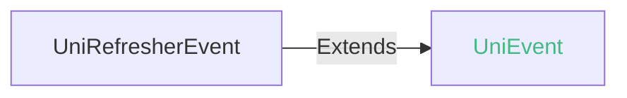
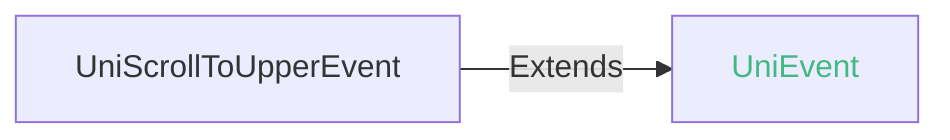
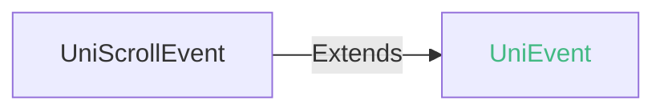

<!-- ## list-view -->

::: sourceCode
## list-view

> GitCode: https://gitcode.com/dcloud/uni-component/tree/alpha/uni_modules/uni-list-view


> GitHub: https://github.com/dcloudio/uni-component/tree/alpha/uni_modules/uni-list-view

:::

> 组件类型：UniListViewElement 

 列表组件

list-view和scroll-view都是滚动组件，list适用于长列表场景，其他场景适用于scroll-view。

在App中，基于recycle-view的list，才能实现长列表的渲染资源复用，以保障列表加载很多项目时，不会一直增加渲染内容。list-view就是基于recycle-view的list组件。

每个list由1个父组件list-view及若干子组件list-item构成。仅有有限子组件可识别，[见下](#children-tags)


### 兼容性
| Web | 微信小程序 | Android | iOS | HarmonyOS | HarmonyOS(Vapor) |
| :- | :- | :- | :- | :- | :- |
| 4.02 | 4.41 | 3.9 | 4.11 | 4.61 | 5.0 |


目前微信小程序下，list-view被编译为scroll-view。目前uni-app x还未优化skyline的配置，未来会把list-view编译为skyline的list-view。

### 属性 
| 名称 | 类型 | 默认值 | 兼容性 | 描述 |
| :- | :- | :- |  :-: | :- |
| direction | string | "vertical" | Web: x; 微信小程序: 4.41; Android: 4.0; iOS: 4.11; HarmonyOS: 4.61; HarmonyOS(Vapor): - | 滚动方向，可取值 none、horizontal、vertical，默认值vertical。注：iOS 平台仅支持vertical |
| ~~scroll-x~~ | boolean | false | Web: x; 微信小程序: 4.41; Android: 3.9; iOS: x; HarmonyOS: x; HarmonyOS(Vapor): - | 允许横向滚动，不支持同时设置scroll-y属性为true，同时设置true时scroll-y生效。已废弃，请改用direction |
| ~~scroll-y~~ | boolean | true | Web: x; 微信小程序: 4.41; Android: 3.9; iOS: 4.11; HarmonyOS: x; HarmonyOS(Vapor): - | 允许纵向滚动，不支持同时设置scroll-x属性为true，同时设置true时scroll-y生效。已废弃，请改用direction |
| ~~rebound~~ | boolean | true | Web: x; 微信小程序: 4.41; Android: 3.9; iOS: 4.11; HarmonyOS: 4.61; HarmonyOS(Vapor): - | 控制是否回弹效果。已废弃，请改用bounces |
| associative-container | string | "" | Web: x; 微信小程序: x; Android: 4.11; iOS: 4.11; HarmonyOS: 4.61; HarmonyOS(Vapor): - | 关联的滚动容器 |
| bounces | boolean | true | Web: x; 微信小程序: 4.41; Android: 4.0; iOS: 4.11; HarmonyOS: 4.61; HarmonyOS(Vapor): - | 控制是否回弹效果 优先级高于rebound |
| upper-threshold | number | 50 | Web: 4.02; 微信小程序: 4.41; Android: 3.9; iOS: 4.11; HarmonyOS: 4.61; HarmonyOS(Vapor): - | 距顶部/左边多远时（单位px），触发 scrolltoupper 事件 |
| lower-threshold | number | 50 | Web: 4.02; 微信小程序: 4.41; Android: 3.9; iOS: 4.11; HarmonyOS: 4.61; HarmonyOS(Vapor): - | 距底部/右边多远时（单位px），触发 scrolltolower 事件 |
| scroll-top | number | 0 | Web: 4.02; 微信小程序: 4.41; Android: 3.9; iOS: 4.11; HarmonyOS: 4.61; HarmonyOS(Vapor): - | 设置竖向滚动条位置 |
| scroll-left | number | 0 | Web: x; 微信小程序: 4.41; Android: 3.9; iOS: 4.11; HarmonyOS: x; HarmonyOS(Vapor): - | 设置横向滚动条位置 |
| show-scrollbar | boolean | true | Web: 4.02; 微信小程序: 4.41; Android: 3.9; iOS: 4.11; HarmonyOS: 4.61; HarmonyOS(Vapor): - | 控制是否出现滚动条 |
| scroll-into-view | string([string.IDString](/uts/data-type.md#ide-string)) | - | Web: x; 微信小程序: 4.41; Android: 3.9; iOS: 4.11; HarmonyOS: 4.61; HarmonyOS(Vapor): - | 值应为某子元素id（id不能以数字开头）。设置哪个方向可滚动，则在哪个方向滚动到该元素起始位置 |
| scroll-with-animation | boolean | false | Web: 4.02; 微信小程序: 4.41; Android: 3.9; iOS: 4.11; HarmonyOS: 4.61; HarmonyOS(Vapor): - | 是否在设置滚动条位置时使用滚动动画，设置false没有滚动动画 |
| refresher-enabled | boolean | false | Web: 4.11; 微信小程序: 4.41; Android: 3.9; iOS: 4.11; HarmonyOS: 4.61; HarmonyOS(Vapor): - | 开启下拉刷新，暂时不支持scroll-x = true横向刷新 |
| refresher-threshold | number | 45 | Web: 4.11; 微信小程序: 4.41; Android: 3.9; iOS: 4.11; HarmonyOS: 4.61; HarmonyOS(Vapor): - | 设置下拉刷新阈值, 仅 refresher-default-style = 'none' 自定义样式下生效 |
| refresher-max-drag-distance | number | - | Web: x; 微信小程序: 4.41; Android: 3.9; iOS: 4.11; HarmonyOS: 4.61; HarmonyOS(Vapor): - | 设置下拉最大拖拽距离（单位px），默认是下拉刷新控件高度的2.5倍 |
| refresher-default-style | string | "black" | Web: 4.11; 微信小程序: 4.41; Android: 3.9; iOS: 4.11; HarmonyOS: 4.61; HarmonyOS(Vapor): - | 设置下拉刷新默认样式，支持设置 black \| white \| none， none 表示不使用默认样式 |
| refresher-background | string([string.ColorString](/uts/data-type.md#ide-string)) | "transparent" | Web: 4.11; 微信小程序: 4.41; Android: 3.9; iOS: 4.11; HarmonyOS: 4.61; HarmonyOS(Vapor): - | 设置下拉刷新区域背景颜色，默认透明 |
| refresher-triggered | boolean | false | Web: 4.11; 微信小程序: 4.41; Android: 3.9; iOS: 4.11; HarmonyOS: 4.61; HarmonyOS(Vapor): - | 设置当前下拉刷新状态，true 表示下拉刷新已经被触发，false 表示下拉刷新未被触发 |
| enable-back-to-top | boolean | false | Web: x; 微信小程序: x; Android: x; iOS: 4.11; HarmonyOS: x; HarmonyOS(Vapor): - | iOS点击顶部状态栏滚动条返回顶部，只支持竖向 |
| custom-nested-scroll | boolean | false | Web: x; 微信小程序: x; Android: 3.9; iOS: x; HarmonyOS: x; HarmonyOS(Vapor): - | 子元素是否开启嵌套滚动 将滚动事件与父元素协商处理 |
| padding | Array | - | Web: x; 微信小程序: x; Android: x; iOS: x; HarmonyOS: x; HarmonyOS(Vapor): - | *(Array)*<br/>长度为 4 的数组，按 top、right、bottom、left 顺序指定内边距 |
| @refresherpulling | (event: [UniRefresherEvent](#unirefresherevent)) => void | - | Web: 4.11; 微信小程序: x; Android: 3.9; iOS: 4.11; HarmonyOS: 4.61; HarmonyOS(Vapor): - | 下拉刷新控件被下拉 |
| @refresherrefresh | (event: [UniRefresherEvent](#unirefresherevent)) => void | - | Web: 4.11; 微信小程序: 4.41; Android: 3.9; iOS: 4.11; HarmonyOS: 4.61; HarmonyOS(Vapor): - | 下拉刷新被触发 |
| @refresherrestore | (event: [UniRefresherEvent](#unirefresherevent)) => void | - | Web: 4.11; 微信小程序: 4.41; Android: 3.9; iOS: 4.11; HarmonyOS: 4.61; HarmonyOS(Vapor): - | 下拉刷新被复位 |
| @refresherabort | (event: [UniRefresherEvent](#unirefresherevent)) => void | - | Web: 4.11; 微信小程序: 4.41; Android: 3.9; iOS: 4.11; HarmonyOS: 4.61; HarmonyOS(Vapor): - | 下拉刷新被中止 |
| @scrolltoupper | (event: [UniScrollToUpperEvent](#uniscrolltoupperevent)) => void | - | Web: 4.02; 微信小程序: 4.41; Android: 3.9; iOS: 4.11; HarmonyOS: 4.61; HarmonyOS(Vapor): - | 滚动到顶部/左边，会触发 scrolltoupper 事件 |
| @scrolltolower | (event: [UniScrollToLowerEvent](#uniscrolltolowerevent)) => void | - | Web: 4.02; 微信小程序: 4.41; Android: 3.9; iOS: 4.11; HarmonyOS: 4.61; HarmonyOS(Vapor): - | 滚动到底部/右边，会触发 scrolltolower 事件 |
| @scroll | (event: [UniScrollEvent](#uniscrollevent)) => void | - | Web: 4.02; 微信小程序: 4.41; Android: 3.9; iOS: 4.11; HarmonyOS: 4.61; HarmonyOS(Vapor): - | 滚动时触发，event.detail = {scrollLeft, scrollTop, scrollHeight, scrollWidth, deltaX, deltaY} |
| @scrollend | (event: [UniScrollEvent](#uniscrollevent)) => void | - | Web: x; 微信小程序: 4.41; Android: 3.9; iOS: 4.11; HarmonyOS: 4.61; HarmonyOS(Vapor): - | 滚动结束时触发，event.detail = {scrollLeft, scrollTop, scrollHeight, scrollWidth, deltaX, deltaY} |

#### direction 的属性描述

| 合法值 | 兼容性 | 描述 |
| :- |  :-: | :- |
| none | Web: 4.02; 微信小程序: 4.41; Android: 4.0; iOS: 4.11; HarmonyOS: 4.61; HarmonyOS(Vapor): - | 禁止滚动 |
| horizontal | Web: x; 微信小程序: 4.41; Android: 4.0; iOS: x; HarmonyOS: x; HarmonyOS(Vapor): - | 横向滚动 |
| vertical | Web: 4.02; 微信小程序: 4.41; Android: 4.0; iOS: 4.11; HarmonyOS: 4.61; HarmonyOS(Vapor): - | 竖向滚动 |

#### associative-container 的属性描述

| 合法值 | 兼容性 | 描述 |
| :- |  :-: | :- |
| nested-scroll-view | Web: x; 微信小程序: -; Android: 4.11; iOS: 4.11; HarmonyOS: 4.61; HarmonyOS(Vapor): - | 嵌套滚动 |

#### refresher-default-style 的属性描述

| 合法值 | 兼容性 | 描述 |
| :- |  :-: | :- |
| black | Web: -; 微信小程序: 4.41; Android: 3.9; iOS: 4.11; HarmonyOS: 4.61; HarmonyOS(Vapor): - | 深颜色雪花样式 |
| white | Web: -; 微信小程序: 4.41; Android: 3.9; iOS: 4.11; HarmonyOS: 4.61; HarmonyOS(Vapor): - | 浅白色雪花样式 |
| none | Web: 4.11; 微信小程序: 4.41; Android: 3.93; iOS: 4.11; HarmonyOS: 4.61; HarmonyOS(Vapor): - | 不使用默认样式 |


### 事件
#### UniRefresherEvent


##### UniRefresherEvent 的属性值
| 名称 | 类型 | 必填 | 默认值 | 兼容性 | 描述 |
| :- | :- | :- | :- |  :-: | :- |
| detail | **UniRefresherEventDetail** | 是 | - | - | - |

#### detail 的属性描述

| 名称 | 类型 | 必备 | 默认值 | 兼容性 | 描述 |
| :- | :- | :- | :- |  :-: | :- |
| dy | number | 是 | - | - | - |


#### UniScrollToUpperEvent


##### UniScrollToUpperEvent 的属性值
| 名称 | 类型 | 必填 | 默认值 | 兼容性 | 描述 |
| :- | :- | :- | :- |  :-: | :- |
| detail | **UniScrollToUpperEventDetail** | 是 | - | - |  |

#### detail 的属性描述

| 名称 | 类型 | 必备 | 默认值 | 兼容性 | 描述 |
| :- | :- | :- | :- |  :-: | :- |
| direction | string | 是 | - | - | 滚动方向 top 或 left |


#### UniScrollToLowerEvent


##### UniScrollToLowerEvent 的属性值
| 名称 | 类型 | 必填 | 默认值 | 兼容性 | 描述 |
| :- | :- | :- | :- |  :-: | :- |
| detail | **UniScrollToLowerEventDetail** | 是 | - | - |  |

#### detail 的属性描述

| 名称 | 类型 | 必备 | 默认值 | 兼容性 | 描述 |
| :- | :- | :- | :- |  :-: | :- |
| direction | string | 是 | - | - | 滚动方向 bottom 或 right |


#### UniScrollEvent


##### UniScrollEvent 的属性值
| 名称 | 类型 | 必填 | 默认值 | 兼容性 | 描述 |
| :- | :- | :- | :- |  :-: | :- |
| detail | **UniScrollEventDetail** | 是 | - | - |  |

#### detail 的属性描述

| 名称 | 类型 | 必备 | 默认值 | 兼容性 | 描述 |
| :- | :- | :- | :- |  :-: | :- |
| scrollTop | number | 是 | - | - | 竖向滚动的距离 |
| scrollLeft | number | 是 | - | - | 横向滚动的距离 |
| scrollHeight | number | 是 | - | - | 滚动区域的高度 |
| scrollWidth | number | 是 | - | - | 滚动区域的宽度 |
| deltaY | number | 是 | - | - | 当次滚动事件竖向滚动量 |
| deltaX | number | 是 | - | - | 当次滚动事件横向滚动量 |


<!-- UTSCOMJSON.list-view.component_type-->

### 自定义下拉刷新样式

list-view组件有默认的下拉刷新样式，如果想自定义，则需使用自定义下拉刷新。

1. 设置`refresher-default-style`属性为 none 不使用默认样式
2. 设置 list-item 定义自定义下拉刷新元素并声明为 `slot="refresher"`，需要设置刷新元素宽高信息否则可能无法正常显示！
   ```html
   <template>
   	<list-view refresher-default-style="none" :refresher-enabled="true" :refresher-triggered="refresherTriggered"
   			 @refresherpulling="onRefresherpulling" @refresherrefresh="onRefresherrefresh"
   			 @refresherrestore="onRefresherrestore" style="flex:1" >

   		<list-item v-for="i in 10" class="content-item">
   			<text class="text">item-{{i}}</text>
   		</list-item>

   		<!-- 自定义下拉刷新元素 -->
   		<list-item slot="refresher" class="refresh-box">
   			<text class="tip-text">{{text[state]}}</text>
   		</list-item>
   	</list-view>
   </template>
   ```
3. 通过组件提供的refresherpulling、refresherrefresh、refresherrestore、refresherabort下拉刷新事件调整自定义下拉刷新元素！实现预期效果

**注意：**
+ 3.93版本开始支持
+ 目前自定义下拉刷新元素不支持放在list-view的首个子元素位置上。可能无法正常显示

### 嵌套模式

scroll-view开启嵌套模式后，list-view 可作为内层滚动视图与外层 scroll-view 实现嵌套滚动

设置内层 list-view 的 `associative-container` 属性为 "nested-scroll-view"，开启内层 list-view 支持与外层 scroll-view 嵌套滚动

### 子组件 @children-tags
| 子组件 | 兼容性 |
| :- | :- |
| [list-item](list-item.md)<br/>[sticky-header](sticky-header.md)<br/>[sticky-section](sticky-section.md) | Web: 4.02; 微信小程序: 4.41; Android: 3.9; iOS: 4.11; HarmonyOS: 4.61; HarmonyOS(Vapor): - |

子组件sticky-header/section用于处理吸顶的场景。

### 示例
示例为[hello uni-app x alpha分支](https://gitcode.com/dcloud/hello-uni-app-x/blob/prod_alpha/pages/component/list-view/list-view.uvue)，与最新HBuilderX Alpha版同步。与最新正式版同步的master分支示例[另见](https://gitcode.com/dcloud/hello-uni-app-x/blob/master//pages/component/list-view/list-view.uvue) 
::: preview https://hellouniappx.dcloud.net.cn/web/#/pages/component/list-view/list-view

> appRedirect https://hellouniappx.dcloud.net.cn/appredirect.html?path=pages/component/list-view/list-view

>示例
```vue
<script setup lang="uts">
  type ScrollEventTest = {
    type : string;
    target : UniElement | null;
    currentTarget : UniElement | null;
    direction ?: string
  }

  import { ItemType } from '@/components/enum-data/enum-data-types'

  type DataType = {
    refresher_triggered_boolean: boolean;
    refresher_enabled_boolean: boolean;
    scroll_with_animation_boolean: boolean;
    show_scrollbar_boolean: boolean;
    bounces_boolean: boolean;
    scroll_y_boolean: boolean;
    scroll_x_boolean: boolean;
    scroll_direction: string;
    upper_threshold_input: number;
    lower_threshold_input: number;
    scroll_top_input: number;
    scroll_left_input: number;
    refresher_background_input: string;
    scrollData: Array<string>;
    size_enum: ItemType[];
    scrollIntoView: string;
    refresherrefresh: boolean;
    refresher_default_style_input: string;
    text: string[];
    state: number;
    reset: boolean;
    // 自动化测试
    isScrollTest: string;
    isScrolltolowerTest: string;
    isScrolltoupperTest: string;
    scrollDetailTest: UniScrollEventDetail | null;
    scrollEndDetailTest: UniScrollEventDetail | null;
  }

  // 使用reactive解决ref数据在自动化测试中无法访问
  const data = reactive({
    refresher_triggered_boolean: false,
    refresher_enabled_boolean: false,
    scroll_with_animation_boolean: false,
    show_scrollbar_boolean: false,
    bounces_boolean: true,
    scroll_y_boolean: true,
    scroll_x_boolean: false,
    scroll_direction: "vertical",
    upper_threshold_input: 50,
    lower_threshold_input: 50,
    scroll_top_input: 0,
    scroll_left_input: 0,
    refresher_background_input: "#FFF",
    scrollData: [],
    size_enum: [{ "value": 0, "name": "item---0" }, { "value": 3, "name": "item---3" }],
    scrollIntoView: "",
    refresherrefresh: false,
    refresher_default_style_input: "black",
    text: ['继续下拉执行刷新', '释放立即刷新', '刷新中', ""],
    state: 3,
    reset: true,
    // 自动化测试
    isScrollTest: '',
    isScrolltolowerTest: '',
    isScrolltoupperTest: '',
    scrollDetailTest: null,
    scrollEndDetailTest: null,
  } as DataType)

  onLoad(() => {
    let lists : Array<string> = []
    for (let i = 0; i < 10; i++) {
      lists.push("item---" + i)
    }
    data.scrollData = lists
  })
  const list_view_click = () => { console.log("组件被点击时触发") }
  const list_view_touchstart = () => { console.log("手指触摸动作开始") }
  const list_view_touchmove = () => { console.log("手指触摸后移动") }
  const list_view_touchcancel = () => { console.log("手指触摸动作被打断，如来电提醒，弹窗") }
  const list_view_touchend = () => { console.log("手指触摸动作结束") }
  const list_view_tap = () => { console.log("手指触摸后马上离开") }
  const list_view_longpress = () => { console.log("如果一个组件被绑定了 longpress 事件，那么当用户长按这个组件时，该事件将会被触发。") }

  const list_view_refresherpulling = (e: RefresherEvent) => {
    console.log("下拉刷新控件被下拉")
    if (data.reset) {
      if (e.detail.dy > 45) {
        data.state = 1
      } else {
        data.state = 0
      }
    }
  }

  const list_view_refresherrefresh = () => {
    console.log("下拉刷新被触发 ")
    data.refresherrefresh = true
    data.refresher_triggered_boolean = true
    data.state = 2
    data.reset = false;
    setTimeout(() => {
      data.refresher_triggered_boolean = false
    }, 1500)
  }

  const list_view_refresherrestore = () => {
    data.refresherrefresh = false
    data.state = 3
    data.reset = true
    console.log("下拉刷新被复位")
  }

  const list_view_refresherabort = () => { console.log("下拉刷新被中止") }

  // 自动化测试专用（由于事件event参数对象中存在循环引用，在ios端JSON.stringify报错，自动化测试无法page.data获取）
  const checkEventTest = (e: ScrollEventTest, eventName: String) => {
    const isPass = e.type === eventName && e.target instanceof UniElement && e.currentTarget instanceof UniElement;
    const result = isPass ? `${eventName}:Success` : `${eventName}:Fail`;
    switch (eventName) {
      case 'scroll':
        data.isScrollTest = result
        break;
      case 'scrolltolower':
        data.isScrolltolowerTest = result + `-${e.direction}`
        break;
      case 'scrolltoupper':
        data.isScrolltoupperTest = result + `-${e.direction}`
        break;
      default:
        break;
    }
  }


  const list_view_scrolltoupper = (e: UniScrollToUpperEvent) => {
    console.log("滚动到顶部/左边，会触发 scrolltoupper 事件  direction=" + e.detail.direction)
    checkEventTest({
      type: e.type,
      target: e.target,
      currentTarget: e.currentTarget,
      direction: e.detail.direction,
    } as ScrollEventTest, 'scrolltoupper')
  }

  const list_view_scrolltolower = (e: UniScrollToLowerEvent) => {
    console.log("滚动到底部/右边，会触发 scrolltolower 事件  direction=" + e.detail.direction)
    checkEventTest({
      type: e.type,
      target: e.target,
      currentTarget: e.currentTarget,
      direction: e.detail.direction,
    } as ScrollEventTest, 'scrolltolower')
  }

  const list_view_scroll = (e: UniScrollEvent) => {
    console.log("滚动时触发，event.detail = {scrollLeft, scrollTop, scrollHeight, scrollWidth, deltaX, deltaY}")
    data.scrollDetailTest = e.detail
    checkEventTest({
      type: e.type,
      target: e.target,
      currentTarget: e.currentTarget
    } as ScrollEventTest, 'scroll')
  }

  const list_view_scrollend = (e: UniScrollEvent) => {
    console.log("滚动结束时触发", e.detail)
    data.scrollEndDetailTest = e.detail
    checkEventTest({
      type: e.type,
      target: e.target,
      currentTarget: e.currentTarget
    } as ScrollEventTest, 'scrollend')
  }

  const list_item_click = () => { console.log("list-item组件被点击时触发") }
  const list_item_touchstart = () => { console.log("手指触摸list-item组件动作开始") }
  const list_item_touchmove = () => { console.log("手指触摸list-item组件后移动") }
  const list_item_touchcancel = () => { console.log("手指触摸list-item组件动作被打断，如来电提醒，弹窗") }
  const list_item_touchend = () => { console.log("手指触摸list-item组件动作结束") }
  const list_item_tap = () => { console.log("手指触摸list-item组件后马上离开") }
  const list_item_longpress = () => { console.log("list-item组件被绑定了 longpress 事件，那么当用户长按这个组件时，该事件将会被触发。") }

  const change_refresher_triggered_boolean = (checked: boolean) => { data.refresher_triggered_boolean = checked }
  const change_refresher_enabled_boolean = (checked: boolean) => { data.refresher_enabled_boolean = checked }
  const change_scroll_with_animation_boolean = (checked: boolean) => { data.scroll_with_animation_boolean = checked }
  const change_show_scrollbar_boolean = (checked: boolean) => { data.show_scrollbar_boolean = checked }
  const change_bounces_boolean = (checked: boolean) => { data.bounces_boolean = checked }

  const change_scroll_direction = () => {
    if (data.scroll_y_boolean && data.scroll_x_boolean || data.scroll_y_boolean) {
      data.scroll_direction = "vertical"
    } else if (!data.scroll_y_boolean && !data.scroll_x_boolean) {
      data.scroll_direction = "none"
    } else if (!data.scroll_y_boolean && data.scroll_x_boolean) {
      data.scroll_direction = "horizontal"
    }
  }

  const change_scroll_y_boolean = (checked: boolean) => {
    data.scroll_y_boolean = checked
    change_scroll_direction()
  }

  const change_scroll_x_boolean = (checked: boolean) => {
    data.scroll_x_boolean = checked
    change_scroll_direction()
  }

  const confirm_upper_threshold_input = (value: number) => { data.upper_threshold_input = value }
  const confirm_lower_threshold_input = (value: number) => { data.lower_threshold_input = value }
  const confirm_scroll_top_input = (value: number) => { data.scroll_top_input = value }
  const confirm_scroll_left_input = (value: number) => { data.scroll_left_input = value }
  const confirm_refresher_background_input = (value: string) => { data.refresher_background_input = value }
  const item_change_size_enum = (index: number) => { data.scrollIntoView = "item---" + index }

  //自动化测试专用
  const setScrollIntoView = (id: string) => { data.scrollIntoView = id }

  //自动化测试例专用
  const check_scroll_height = (): Boolean => {
    var listElement = uni.getElementById("listview") as UniElement
    console.log("check_scroll_height--" + listElement.scrollHeight)
    if (listElement.scrollHeight > 2000) {
      return true
    }
    return false
  }

  //自动化测试例专用
  const check_scroll_width = (): Boolean => {
    var listElement = uni.getElementById("listview") as UniElement
    console.log("check_scroll_width" + listElement.scrollWidth)
    if (listElement.scrollWidth > 2000) {
      return true
    }
    return false
  }

  const change_refresher_style_boolean = (checked: boolean) => {
    if (checked) {
      data.refresher_default_style_input = "none"
    } else {
      data.refresher_default_style_input = "black"
    }
  }

  defineExpose({
    data,
    confirm_scroll_top_input,
    change_scroll_x_boolean,
    change_scroll_y_boolean,
    confirm_scroll_left_input,
    check_scroll_height,
    check_scroll_width,
    item_change_size_enum,
    setScrollIntoView
  })
</script>

<template>
  <view class="main">
    <list-view :direction="data.scroll_direction" :bounces="data.bounces_boolean" :upper-threshold="data.upper_threshold_input"
      :lower-threshold="data.lower_threshold_input" :scroll-top="data.scroll_top_input" :scroll-left="data.scroll_left_input"
      :show-scrollbar="data.show_scrollbar_boolean" :scroll-into-view="data.scrollIntoView"
      :scroll-with-animation="data.scroll_with_animation_boolean" :refresher-enabled="data.refresher_enabled_boolean"
      :refresher-background="data.refresher_background_input" :refresher-triggered="data.refresher_triggered_boolean"
      :refresher-default-style="data.refresher_default_style_input" @click="list_view_click"
      @touchstart="list_view_touchstart" @touchmove="list_view_touchmove" @touchcancel="list_view_touchcancel"
      @touchend="list_view_touchend" @tap="list_view_tap" @longpress="list_view_longpress"
      @refresherpulling="list_view_refresherpulling" @refresherrefresh="list_view_refresherrefresh"
      @refresherrestore="list_view_refresherrestore" @refresherabort="list_view_refresherabort"
      @scrolltoupper="list_view_scrolltoupper" ref="listview" @scrolltolower="list_view_scrolltolower"
      @scroll="list_view_scroll" @scrollend="list_view_scrollend" style="width:100%;" id="listview">
      <list-item v-for="key in data.scrollData" :key="key" :id="key" @click="list_item_click"
        @touchstart="list_item_touchstart" @touchmove="list_item_touchmove" @touchcancel="list_item_touchcancel"
        @touchend="list_item_touchend" @tap="list_item_tap" @longpress="list_item_longpress" class="list-item">
        <text>{{key}}</text>
      </list-item>
      <!-- #ifdef APP -->
      <list-item slot="refresher" class="refresh-box">
        <text class="tip-text">{{data.text[data.state]}}</text>
      </list-item>
      <!-- #endif -->
    </list-view>
  </view>

  <scroll-view style="flex:1" direction="vertical">
    <view class="content">
      <!-- #ifdef APP -->
      <boolean-data :defaultValue="false" title="设置当前下拉刷新状态，true 表示下拉刷新已经被触发，false 表示下拉刷新未被触发"
        @change="change_refresher_triggered_boolean"></boolean-data>
      <boolean-data :defaultValue="false" title="开启下拉刷新" @change="change_refresher_enabled_boolean"></boolean-data>
      <boolean-data :defaultValue="false" title="开启自定义样式" @change="change_refresher_style_boolean"></boolean-data>
      <!-- #endif -->
      <boolean-data :defaultValue="false" title="是否在设置滚动条位置时使用滚动动画，设置false没有滚动动画"
        @change="change_scroll_with_animation_boolean"></boolean-data>
      <boolean-data :defaultValue="false" title="控制是否出现滚动条" @change="change_show_scrollbar_boolean"></boolean-data>
      <!-- #ifdef APP -->
      <boolean-data :defaultValue="true" title="控制是否回弹效果" @change="change_bounces_boolean"></boolean-data>
      <!-- #endif -->
      <boolean-data :defaultValue="true" title="允许纵向滚动" @change="change_scroll_y_boolean"></boolean-data>
      <!-- #ifdef APP -->
      <boolean-data :defaultValue="false" title="允许横向滚动" @change="change_scroll_x_boolean"></boolean-data>
      <!-- #endif -->
      <input-data defaultValue="50" title="距顶部/左边多远时（单位px），触发 scrolltoupper 事件" type="number"
        @confirm="confirm_upper_threshold_input"></input-data>
      <input-data defaultValue="50" title="距底部/右边多远时（单位px），触发 scrolltolower 事件" type="number"
        @confirm="confirm_lower_threshold_input"></input-data>
      <input-data defaultValue="0" title="设置竖向滚动条位置" type="number" @confirm="confirm_scroll_top_input"></input-data>
      <!-- #ifdef APP -->
      <input-data defaultValue="0" title="设置横向滚动条位置" type="number" @confirm="confirm_scroll_left_input"></input-data>
      <input-data defaultValue="#FFF" title="设置下拉刷新区域背景颜色" type="text"
        @confirm="confirm_refresher_background_input"></input-data>
      <enum-data :items="data.size_enum" title="通过id位置跳转" @change="item_change_size_enum"></enum-data>
      <navigator url="/pages/component/list-view/list-view-refresh">
        <button type="primary" class="button">
          list-view 下拉刷新
        </button>
      </navigator>
      <!-- #endif -->
      <navigator url="/pages/component/list-view/list-view-multiplex">
        <button type="primary" class="button">
          list-view 对list-item复用测试
        </button>
      </navigator>
      <navigator url="/pages/component/list-view/list-view-multiplex-input">
        <button type="primary" class="button">
          list-view 复用测试（item中嵌入input）
        </button>
      </navigator>
      <navigator url="/pages/component/list-view/list-view-multiplex-video">
        <button type="primary" class="button">
          list-view 复用测试（item中嵌入video）
        </button>
      </navigator>
      <navigator url="/pages/component/list-view/list-view-children-in-slot">
        <button type="primary" class="button">
          list-view 测试插槽中子组件增删
        </button>
      </navigator>
      <navigator url="/pages/component/list-view/list-view-children-if-show">
        <button type="primary" class="button">
          list-item v-if v-show 组合增删
        </button>
      </navigator>
      <navigator url="/pages/template/im/im">
        <button type="primary" class="button">
          list-item 中设置长按事件测试
        </button>
      </navigator>
      <navigator url="/pages/component/list-view/list-view-form-item">
        <button type="primary" class="button">
          list-item 中使用表单元素测试
        </button>
      </navigator>
      <navigator url="/pages/component/list-view/list-view-with-type">
        <button type="primary" class="button">
          list-item 上使用 type 属性测试
        </button>
      </navigator>
      <navigator url="/pages/component/list-view/list-view-issue-17610">
        <button type="primary" class="button">
          list-view 子节点为多根节点组件
        </button>
      </navigator>
    </view>
  </scroll-view>
</template>

<style>
  .main {
    max-height: 250px;
    padding: 5px 0;
    border-bottom: 1px solid rgba(0, 0, 0, .06);
    flex-direction: row;
    justify-content: center;
  }

  .list-item {
    width: 100%;
    height: 250px;
    border: 1px solid #666;
    background-color: #66ccff;
    align-items: center;
    justify-content: center;
  }

  .tip-text {
    color: #888;
    font-size: 12px;
  }

  .refresh-box {
    justify-content: center;
    align-items: center;
    flex-direction: row;
    height: 45px;
    width: 100%;
  }

  .button {
    margin-top: 15px;
  }
  .content{
    padding-bottom: 20px;
  }
</style>

```

:::


### 参见
- [相关 Bug](https://issues.dcloud.net.cn/?mid=component.view-container.list-view.list-view)
- [微信小程序文档](https://developers.weixin.qq.com/miniprogram/dev/component/list-view.html)
- [支付宝小程序文档](https://open.alipay.com/portal/zhichi/search?keyword=list-view&pageIndex=1&pageSize=10&source=doc_top&type=all)
- [百度小程序文档](https://smartprogram.baidu.com/forum/search?query=list-view&scope=devdocs&source=docs)
- [抖音小程序文档](https://developer.open-douyin.com/search-page?keyword=list-view&secondType=all&type=1)
- [飞书小程序文档](https://open.feishu.cn/search?from=header&page=1&pageSize=10&q=list-view&topicFilter=)
- [钉钉小程序文档](https://open.dingtalk.com/search?keyword=list-view)
- [QQ小程序文档](https://q.qq.com/wiki/develop/miniprogram/frame/)
- [快手小程序文档](https://developers.kuaishou.com/page?keyword=list-view&from=docs)
- [京东小程序文档](https://mp-docs.jd.com/doc/dev/framework/-1)
- [华为快应用文档](https://developer.huawei.com/consumer/cn/doc/quickApp-References/webview-frame-overview-0000001124793625)
- [360小程序文档](https://mp.360.cn/doc/miniprogram/dev/#/b770a184ff1f06c6b3393a0fd1132380)

### 蒸汽模式list-view调整 <Badge text="App Vapor"/>

蒸汽模式下app端list-view调整为使用vue组件实现，list-view在滚动期间会复用出屏幕的list-item组件用于渲染新的列表数据，从而提升长列表的渲染性能，减少内存占用。

在蒸汽模式使用list-view需要注意以下几点：

- list-item内部组件如果有内部状态不受绑定数据影响则需要依赖onReuse、onRecycle等生命周期函数进行状态重置，否则会出现状态错乱的问题，参考：[组件生命周期文档](../vue/component.md#component-lifecycle)
- 蒸汽模式list-view内暂不支持sticky-header、sticky-section组件
- list-view下仅第一个在list-item上的v-for支持复用，其他list-item会被当做view对待。
- list-item的v-for必须要有:key属性，否则不会复用，此时list-item也会被当做view对待
- list-item不支持设置margin样式
- 不支持scroll-into-view属性
- 不支持横向滚动

## 性能优化
长列表是非常需要注意性能优化的。
当你的长列表卡顿时，请注意：

1. 尽可能减少列表item中的组件数量。
2. 排查代码的内存泄漏，尤其是on后没有off。
3. 不要一次性加载太多数据，而是分批加载。
4. 对VNode、DOM进行虚拟化

这些技巧另有专门[教程](../performance.md#长列表)


## 示例代码

- 联网联表：[hello uni-app x 的 /pages/template/list-news/list-news.uvue](https://gitcode.com/dcloud/hello-uni-app-x/blob/master/pages/template/list-news/list-news.uvue)
- 可左右滑动的多个列表：[hello uni-app x 的 /pages/template/long-list](https://gitcode.com/dcloud/hello-uni-app-x/tree/master/pages/template/long-list)
- 分批加载列表：[hello uni-app x 的 /pages/template/long-list-batch/long-list-batch.uvue](https://gitcode.com/dcloud/hello-uni-app-x/blob/alpha/pages/template/long-list-batch/long-list-batch.uvue)

### Bug & Tips@tips

- 如需im那样的倒序列表，App端可给组件style配置 `transform: rotate(180deg)` 来实现。注意与下拉刷新有冲突，此时应避免启用下拉刷新。可参考[uni-ai x源码](https://ext.dcloud.net.cn/plugin?id=23902)
- list-view组件的overflow属性不支持配置visible
- list-view组件不适合做瀑布流，多列瀑布流另见 [waterflow组件](./waterflow.md)
