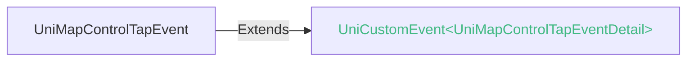
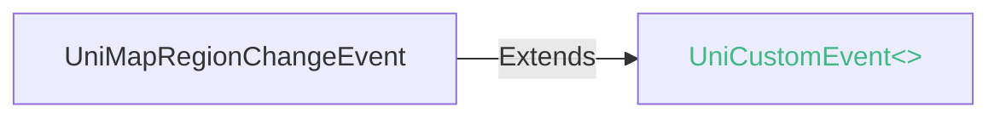
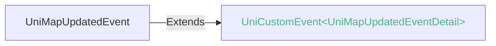

<!-- ## map -->

::: sourceCode
## map
:::

地图

地图由三方专业地图厂商提供SDK。在App和Web中，使用三方SDK需在[manifest](../collocation/manifest.md)中进行配置。


### 兼容性
| Web | 微信小程序 | Android | iOS | HarmonyOS | HarmonyOS(Vapor) |
| :- | :- | :- | :- | :- | :- |
| 4.0 | 4.41 | 4.31 | 4.31 | 4.61 | 5.0 |


不同图商在不同平台的兼容性
|图商		|Web|Android|iOS	|harmony|
|:-:		|:-:|:-:		|:-:	|:-:		|
|腾讯		|√	|4.31+	|4.31+|4.61+	|
|高德		|√	|x			|x		|x			|
|Google	|√	|x			|x		|x			|

除了内置支持的图商，还可以在插件市场寻找更多地图解决方案：
1. [插件市场的三方地图插件](https://ext.dcloud.net.cn/search?q=%E5%9C%B0%E5%9B%BE&orderBy=Relevance&uni-appx=1)
2. 使用web-view中的地图

### 属性 
| 名称 | 类型 | 默认值 | 兼容性 | 描述 |
| :- | :- | :- |  :-: | :- |
| longitude | number | - | Web: 4.0; 微信小程序: 4.41; Android: 4.31; iOS: 4.31; HarmonyOS: -; HarmonyOS(Vapor): - | 中心经度 |
| latitude | number | - | Web: 4.0; 微信小程序: 4.41; Android: 4.31; iOS: 4.31; HarmonyOS: -; HarmonyOS(Vapor): - | 中心纬度 |
| scale | number | - | Web: 4.0; 微信小程序: 4.41; Android: 4.31; iOS: 4.31; HarmonyOS: -; HarmonyOS(Vapor): - | 缩放级别，web端取值范围为5-18 , app端取值范围为3-20 |
| ~~theme~~ | string | "normal" | Web: x; 微信小程序: x; Android: 4.31; iOS: 4.31; HarmonyOS: -; HarmonyOS(Vapor): - | 主题（satellite 或 normal） |
| min-scale | number | 3 | Web: x; 微信小程序: 4.41; Android: 4.31; iOS: 4.31; HarmonyOS: -; HarmonyOS(Vapor): - | 最小缩放级别 |
| max-scale | number | 20 | Web: x; 微信小程序: 4.41; Android: 4.31; iOS: 4.31; HarmonyOS: -; HarmonyOS(Vapor): - | 最大缩放级别 |
| layer-style | string | "1" | Web: x; 微信小程序: 4.41; Android: 4.31; iOS: 4.31; HarmonyOS: -; HarmonyOS(Vapor): - | 个性化地图（如实现地图暗黑模式） |
| markers | Array\<**Marker**> | - | Web: 4.0; 微信小程序: 4.41; Android: 4.31; iOS: 4.31; HarmonyOS: -; HarmonyOS(Vapor): - | 标记点 |

#### markers 的属性描述

| 名称 | 类型 | 必备 | 默认值 | 兼容性 | 描述 |
| :- | :- | :- | :- |  :-: | :- |
| id | number | 是 | - | Web: -; 微信小程序: -; Android: 4.31; iOS: 4.31; HarmonyOS: 4.61; HarmonyOS(Vapor): 5.0 | 标记点id，marker点击事件回调会返回此id。建议为每个marker设置上Number类型id，保证更新marker时有更好的性能。最大限制9位数 |
| latitude | number | 是 | - | Web: -; 微信小程序: -; Android: 4.31; iOS: 4.31; HarmonyOS: 4.61; HarmonyOS(Vapor): 5.0 | 纬度，浮点数，范围 -90 ~ 90 |
| longitude | number | 是 | - | Web: -; 微信小程序: -; Android: 4.31; iOS: 4.31; HarmonyOS: 4.61; HarmonyOS(Vapor): 5.0 | 经度，浮点数，范围 -180 ~ 180 |
| iconPath | string | 是 | - | Web: -; 微信小程序: -; Android: 4.31; iOS: 4.31; HarmonyOS: 4.61; HarmonyOS(Vapor): 5.0 | 显示的图标，项目目录下的图片路径，支持相对路径写法，以'/'开头则表示相对小程序根目录；也支持临时路径 |
| title | string | 否 | null | Web: -; 微信小程序: -; Android: 4.31; iOS: 4.31; HarmonyOS: 4.61; HarmonyOS(Vapor): 5.0 | 标注点名，点击时显示，callout存在时将被忽略 |
| rotate | number | 否 | 0 | Web: -; 微信小程序: -; Android: 4.31; iOS: 4.31; HarmonyOS: 4.61; HarmonyOS(Vapor): 5.0 | 旋转角度，顺时针旋转的角度，范围 0 ~ 360 |
| alpha | number | 否 | 1 | Web: -; 微信小程序: -; Android: 4.31; iOS: 4.31; HarmonyOS: 4.61; HarmonyOS(Vapor): 5.0 | 标注的透明度，范围 0 ~ 1 |
| width | number | 否 | 默认为图片实际宽度 | Web: -; 微信小程序: -; Android: 4.31; iOS: 4.31; HarmonyOS: 4.61; HarmonyOS(Vapor): 5.0 | 标注图标宽度 |
| height | number | 否 | 默认为图片实际高度 | Web: -; 微信小程序: -; Android: 4.31; iOS: 4.31; HarmonyOS: 4.61; HarmonyOS(Vapor): 5.0 | 标注图标高度 |
| ariaLabel | string | 否 | null | Web: -; 微信小程序: -; Android: x; iOS: 4.31; HarmonyOS: 4.61; HarmonyOS(Vapor): 5.0 | 无障碍访问，（属性）元素的额外描述 |
| anchor | **Anchor** | 否 | [0.5, 1\] | Web: -; 微信小程序: -; Android: 4.31; iOS: 4.31; HarmonyOS: 4.61; HarmonyOS(Vapor): 5.0 | 经纬度在标注图标的锚点，默认底边中点	{x, y}，x表示横向(0-1)，y表示竖向(0-1)。{x: .5, y: 1} 表示底边中点 |
| callout | **MapMarkerCallout** | 否 | null | Web: -; 微信小程序: -; Android: 4.51; iOS: 4.51; HarmonyOS: x; HarmonyOS(Vapor): - | 自定义标记点上方的气泡窗口 |
| label | **MapMarkerLabel** | 否 | null | Web: -; 微信小程序: -; Android: x; iOS: x; HarmonyOS: x; HarmonyOS(Vapor): - | 为标记点旁边增加标签 |
| clusterId | number | 否 | null | Web: -; 微信小程序: -; Android: x; iOS: x; HarmonyOS: x; HarmonyOS(Vapor): - | 自定义点聚合簇效果时使用 |
| customCallout | **MapMarkerCallout** | 否 | null | Web: -; 微信小程序: -; Android: x; iOS: x; HarmonyOS: x; HarmonyOS(Vapor): - | 自定义气泡窗口 |
| joinCluster | boolean | 否 | null | Web: -; 微信小程序: -; Android: x; iOS: x; HarmonyOS: x; HarmonyOS(Vapor): - | 是否参与点聚合 |

##### anchor 的属性描述

| 名称 | 类型 | 必备 | 默认值 | 兼容性 | 描述 |
| :- | :- | :- | :- |  :-: | :- |
| x | number | 是 | - | - | - |
| y | number | 是 | - | - | - |

##### callout 的属性描述

| 名称 | 类型 | 必备 | 默认值 | 兼容性 | 描述 |
| :- | :- | :- | :- |  :-: | :- |
| content | string | 否 | "" | Web: -; 微信小程序: -; Android: 4.51; iOS: 4.51; HarmonyOS: -; HarmonyOS(Vapor): - | 文本 |
| color | [string.ColorString](/uts/data-type.md#ide-string) | 否 | "black" | Web: -; 微信小程序: -; Android: 4.51; iOS: 4.51; HarmonyOS: -; HarmonyOS(Vapor): - | 文本颜色 |
| fontSize | number | 否 | null | Web: -; 微信小程序: -; Android: 4.51; iOS: 4.51; HarmonyOS: -; HarmonyOS(Vapor): - | 文字大小 |
| borderRadius | number | 否 | 0 | Web: -; 微信小程序: -; Android: 4.51; iOS: 4.51; HarmonyOS: -; HarmonyOS(Vapor): - | 边框圆角 |
| borderWidth | number | 否 | 0 | Web: -; 微信小程序: -; Android: 4.51; iOS: 4.51; HarmonyOS: -; HarmonyOS(Vapor): - | 边框宽度 |
| borderColor | [string.ColorString](/uts/data-type.md#ide-string) | 否 | "transparent" | Web: -; 微信小程序: -; Android: 4.51; iOS: 4.51; HarmonyOS: -; HarmonyOS(Vapor): - | 边框颜色 |
| bgColor | [string.ColorString](/uts/data-type.md#ide-string) | 否 | "#fff" | Web: -; 微信小程序: -; Android: 4.51; iOS: 4.51; HarmonyOS: -; HarmonyOS(Vapor): - | 背景色 |
| padding | number | 否 | 0 | Web: -; 微信小程序: -; Android: 4.51; iOS: 4.51; HarmonyOS: -; HarmonyOS(Vapor): - | 文本边缘留白 |
| display | string | 否 | "BYCLICK" | Web: -; 微信小程序: -; Android: 4.51; iOS: 4.51; HarmonyOS: -; HarmonyOS(Vapor): - | 'BYCLICK':点击显示; 'ALWAYS':常显 |
| textAlign | string | 否 | "left" | Web: -; 微信小程序: -; Android: 4.51; iOS: 4.51; HarmonyOS: -; HarmonyOS(Vapor): - | 文本对齐方式。 |
| anchorX | number | 否 | 0.5 | Web: -; 微信小程序: -; Android: x; iOS: x; HarmonyOS: -; HarmonyOS(Vapor): - | 横向偏移量，向右为正数 |
| anchorY | number | 否 | 1 | Web: -; 微信小程序: -; Android: x; iOS: x; HarmonyOS: -; HarmonyOS(Vapor): - | 纵向偏移量，向下为正数 |

###### display 的属性描述

| 合法值 | 兼容性 | 描述 |
| :- |  :-: | :- |
| BYCLICK | - | - |
| ALWAYS | - | - |

###### textAlign 的属性描述

| 合法值 | 兼容性 | 描述 |
| :- |  :-: | :- |
| left | - | - |
| center | - | - |
| right | - | - |

##### label 的属性描述

| 名称 | 类型 | 必备 | 默认值 | 兼容性 | 描述 |
| :- | :- | :- | :- |  :-: | :- |
| content | string | 否 | 1 | Web: -; 微信小程序: -; Android: x; iOS: x; HarmonyOS: -; HarmonyOS(Vapor): - | 文本 |
| color | string | 否 | 1 | Web: -; 微信小程序: -; Android: x; iOS: x; HarmonyOS: -; HarmonyOS(Vapor): - | 文本颜色 |
| fontSize | number | 否 | 1 | Web: -; 微信小程序: -; Android: x; iOS: x; HarmonyOS: -; HarmonyOS(Vapor): - | 文字大小 |
| x | number | 否 | 1 | Web: -; 微信小程序: -; Android: x; iOS: x; HarmonyOS: -; HarmonyOS(Vapor): - | label的坐标，原点是 marker 对应的经纬度 |
| y | number | 否 | 1 | Web: -; 微信小程序: -; Android: x; iOS: x; HarmonyOS: -; HarmonyOS(Vapor): - | label的坐标，原点是 marker 对应的经纬度 |
| anchorX | number | 否 | 1 | Web: -; 微信小程序: -; Android: x; iOS: x; HarmonyOS: -; HarmonyOS(Vapor): - | label的坐标，原点是 marker 对应的经纬度 |
| anchorY | number | 否 | 1 | Web: -; 微信小程序: -; Android: x; iOS: x; HarmonyOS: -; HarmonyOS(Vapor): - | label的坐标，原点是 marker 对应的经纬度 |
| borderWidth | number | 否 | 1 | Web: -; 微信小程序: -; Android: x; iOS: x; HarmonyOS: -; HarmonyOS(Vapor): - | 边框宽度 |
| borderColor | string | 否 | 1 | Web: -; 微信小程序: -; Android: x; iOS: x; HarmonyOS: -; HarmonyOS(Vapor): - | 边框颜色 |
| borderRadius | number | 否 | 1 | Web: -; 微信小程序: -; Android: x; iOS: x; HarmonyOS: -; HarmonyOS(Vapor): - | 边框圆角 |
| bgColor | string | 否 | 1 | Web: -; 微信小程序: -; Android: x; iOS: x; HarmonyOS: -; HarmonyOS(Vapor): - | 背景色 |
| padding | number | 否 | 1 | Web: -; 微信小程序: -; Android: x; iOS: x; HarmonyOS: -; HarmonyOS(Vapor): - | 文本边缘留白 |
| textAlign | string | 否 | 1 | Web: -; 微信小程序: -; Android: x; iOS: x; HarmonyOS: -; HarmonyOS(Vapor): - | 文本对齐方式。 |
| ariaLabel | string | 否 | 1 | Web: -; 微信小程序: -; Android: x; iOS: x; HarmonyOS: -; HarmonyOS(Vapor): - | 无障碍访问，（属性）元素的额外描述 |

###### textAlign 的属性描述

| 合法值 | 兼容性 | 描述 |
| :- |  :-: | :- |
| left | - | - |
| center | - | - |
| right | - | - |

##### customCallout 的属性描述

| 名称 | 类型 | 必备 | 默认值 | 兼容性 | 描述 |
| :- | :- | :- | :- |  :-: | :- |
| content | string | 否 | "" | Web: -; 微信小程序: -; Android: 4.51; iOS: 4.51; HarmonyOS: -; HarmonyOS(Vapor): - | 文本 |
| color | [string.ColorString](/uts/data-type.md#ide-string) | 否 | "black" | Web: -; 微信小程序: -; Android: 4.51; iOS: 4.51; HarmonyOS: -; HarmonyOS(Vapor): - | 文本颜色 |
| fontSize | number | 否 | null | Web: -; 微信小程序: -; Android: 4.51; iOS: 4.51; HarmonyOS: -; HarmonyOS(Vapor): - | 文字大小 |
| borderRadius | number | 否 | 0 | Web: -; 微信小程序: -; Android: 4.51; iOS: 4.51; HarmonyOS: -; HarmonyOS(Vapor): - | 边框圆角 |
| borderWidth | number | 否 | 0 | Web: -; 微信小程序: -; Android: 4.51; iOS: 4.51; HarmonyOS: -; HarmonyOS(Vapor): - | 边框宽度 |
| borderColor | [string.ColorString](/uts/data-type.md#ide-string) | 否 | "transparent" | Web: -; 微信小程序: -; Android: 4.51; iOS: 4.51; HarmonyOS: -; HarmonyOS(Vapor): - | 边框颜色 |
| bgColor | [string.ColorString](/uts/data-type.md#ide-string) | 否 | "#fff" | Web: -; 微信小程序: -; Android: 4.51; iOS: 4.51; HarmonyOS: -; HarmonyOS(Vapor): - | 背景色 |
| padding | number | 否 | 0 | Web: -; 微信小程序: -; Android: 4.51; iOS: 4.51; HarmonyOS: -; HarmonyOS(Vapor): - | 文本边缘留白 |
| display | string | 否 | "BYCLICK" | Web: -; 微信小程序: -; Android: 4.51; iOS: 4.51; HarmonyOS: -; HarmonyOS(Vapor): - | 'BYCLICK':点击显示; 'ALWAYS':常显 |
| textAlign | string | 否 | "left" | Web: -; 微信小程序: -; Android: 4.51; iOS: 4.51; HarmonyOS: -; HarmonyOS(Vapor): - | 文本对齐方式。 |
| anchorX | number | 否 | 0.5 | Web: -; 微信小程序: -; Android: x; iOS: x; HarmonyOS: -; HarmonyOS(Vapor): - | 横向偏移量，向右为正数 |
| anchorY | number | 否 | 1 | Web: -; 微信小程序: -; Android: x; iOS: x; HarmonyOS: -; HarmonyOS(Vapor): - | 纵向偏移量，向下为正数 |

###### display 的属性描述

| 合法值 | 兼容性 | 描述 |
| :- |  :-: | :- |
| BYCLICK | - | - |
| ALWAYS | - | - |

###### textAlign 的属性描述

| 合法值 | 兼容性 | 描述 |
| :- |  :-: | :- |
| left | - | - |
| center | - | - |
| right | - | - |
@
| covers | array | - | Web: 4.0; 微信小程序: 4.41; Android: x; iOS: x; HarmonyOS: -; HarmonyOS(Vapor): - | 即将移除，请使用 markers |
| polyline | Array\<**Polyline**> | - | Web: 4.0; 微信小程序: 4.41; Android: 4.31; iOS: 4.31; HarmonyOS: -; HarmonyOS(Vapor): - | 路线 |

| 名称 | 类型 | 必备 | 默认值 | 兼容性 | 描述 |
| :- | :- | :- | :- |  :-: | :- |
| points | Array&lt;**LocationObject**&gt; | 是 | - | Web: -; 微信小程序: -; Android: 4.31; iOS: 4.31; HarmonyOS: 4.61; HarmonyOS(Vapor): 5.0 | 经纬度数组 |
| color | [string.ColorString](/uts/data-type.md#ide-string) | 否 | null | Web: -; 微信小程序: -; Android: 4.31; iOS: 4.31; HarmonyOS: 4.61; HarmonyOS(Vapor): 5.0 | 线的颜色 |
| width | number | 否 | 0 | Web: -; 微信小程序: -; Android: 4.31; iOS: 4.31; HarmonyOS: 4.61; HarmonyOS(Vapor): 5.0 | 线的宽度 |
| dottedLine | boolean | 否 | false | Web: -; 微信小程序: -; Android: 4.31; iOS: 4.31; HarmonyOS: 4.61; HarmonyOS(Vapor): 5.0 | 是否虚线 |
| arrowLine | boolean | 否 | false | Web: -; 微信小程序: -; Android: 4.31; iOS: 4.31; HarmonyOS: 4.61; HarmonyOS(Vapor): 5.0 | 带箭头的线 |
| arrowIconPath | string | 否 | null | Web: -; 微信小程序: -; Android: 4.31; iOS: 4.31; HarmonyOS: 4.61; HarmonyOS(Vapor): 5.0 | 更换箭头图标 |
| borderColor | [string.ColorString](/uts/data-type.md#ide-string) | 否 | null | Web: -; 微信小程序: -; Android: x; iOS: x; HarmonyOS: -; HarmonyOS(Vapor): - | 线的边框颜色 |
| borderWidth | number | 否 | null | Web: -; 微信小程序: -; Android: x; iOS: x; HarmonyOS: -; HarmonyOS(Vapor): - | 线的厚度 |
| colorList | Array&lt;string&gt; | 否 | null | Web: -; 微信小程序: -; Android: 4.31; iOS: 4.31; HarmonyOS: 4.61; HarmonyOS(Vapor): 5.0 | 彩虹线 |

##### points 的属性描述

| 名称 | 类型 | 必备 | 默认值 | 兼容性 | 描述 |
| :- | :- | :- | :- |  :-: | :- |
| latitude | number | 是 | - | Web: -; 微信小程序: -; Android: 4.31; iOS: 4.31; HarmonyOS: 4.61; HarmonyOS(Vapor): 5.0 | 纬度，浮点数，范围为-90~90，负数表示南纬 |
| longitude | number | 是 | - | Web: -; 微信小程序: -; Android: 4.31; iOS: 4.31; HarmonyOS: 4.61; HarmonyOS(Vapor): 5.0 | 经度，范围为-180~180，负数表示西经 |
@
| polygons | Array\<**Polygon**> | - | Web: 4.0; 微信小程序: 4.41; Android: 4.31; iOS: 4.31; HarmonyOS: -; HarmonyOS(Vapor): - | 多边形 |

| 名称 | 类型 | 必备 | 默认值 | 兼容性 | 描述 |
| :- | :- | :- | :- |  :-: | :- |
| points | Array&lt;**LocationObject**&gt; | 是 | - | Web: -; 微信小程序: -; Android: 4.31; iOS: 4.31; HarmonyOS: 4.61; HarmonyOS(Vapor): 5.0 | 经纬度数组 |
| strokeWidth | number | 否 | 0 | Web: -; 微信小程序: -; Android: 4.31; iOS: 4.31; HarmonyOS: 4.61; HarmonyOS(Vapor): 5.0 | 描边的宽度 |
| strokeColor | [string.ColorString](/uts/data-type.md#ide-string) | 否 | null | Web: -; 微信小程序: -; Android: 4.31; iOS: 4.31; HarmonyOS: 4.61; HarmonyOS(Vapor): 5.0 | 描边的颜色 |
| fillColor | [string.ColorString](/uts/data-type.md#ide-string) | 否 | null | Web: -; 微信小程序: -; Android: 4.31; iOS: 4.31; HarmonyOS: 4.61; HarmonyOS(Vapor): 5.0 | 填充颜色 |
| zIndex | number | 否 | 0 | Web: -; 微信小程序: -; Android: 4.31; iOS: 4.31; HarmonyOS: 4.61; HarmonyOS(Vapor): 5.0 | 设置多边形 Z 轴数值 |

##### points 的属性描述

| 名称 | 类型 | 必备 | 默认值 | 兼容性 | 描述 |
| :- | :- | :- | :- |  :-: | :- |
| latitude | number | 是 | - | Web: -; 微信小程序: -; Android: 4.31; iOS: 4.31; HarmonyOS: 4.61; HarmonyOS(Vapor): 5.0 | 纬度，浮点数，范围为-90~90，负数表示南纬 |
| longitude | number | 是 | - | Web: -; 微信小程序: -; Android: 4.31; iOS: 4.31; HarmonyOS: 4.61; HarmonyOS(Vapor): 5.0 | 经度，范围为-180~180，负数表示西经 |
@
| circles | Array\<**Circle**> | - | Web: 4.0; 微信小程序: 4.41; Android: 4.31; iOS: 4.31; HarmonyOS: -; HarmonyOS(Vapor): - | 圆 |

| 名称 | 类型 | 必备 | 默认值 | 兼容性 | 描述 |
| :- | :- | :- | :- |  :-: | :- |
| latitude | number | 是 | - | Web: -; 微信小程序: -; Android: 4.31; iOS: 4.31; HarmonyOS: 4.61; HarmonyOS(Vapor): 5.0 | 纬度 |
| longitude | number | 是 | - | Web: -; 微信小程序: -; Android: 4.31; iOS: 4.31; HarmonyOS: 4.61; HarmonyOS(Vapor): 5.0 | 经度 |
| radius | number | 是 | - | Web: -; 微信小程序: -; Android: 4.31; iOS: 4.31; HarmonyOS: 4.61; HarmonyOS(Vapor): 5.0 | 半径 |
| color | [string.ColorString](/uts/data-type.md#ide-string) | 否 | null | Web: -; 微信小程序: -; Android: 4.31; iOS: 4.31; HarmonyOS: 4.61; HarmonyOS(Vapor): 5.0 | 描边的颜色 |
| fillColor | [string.ColorString](/uts/data-type.md#ide-string) | 否 | null | Web: -; 微信小程序: -; Android: 4.31; iOS: 4.31; HarmonyOS: 4.61; HarmonyOS(Vapor): 5.0 | 填充颜色 |
| strokeWidth | number | 否 | 0 | Web: -; 微信小程序: -; Android: 4.31; iOS: 4.31; HarmonyOS: 4.61; HarmonyOS(Vapor): 5.0 | 描边的宽度 |
@
| controls | Array\<**Control**> | - | Web: 4.0; 微信小程序: 4.41; Android: 4.31; iOS: 4.31; HarmonyOS: -; HarmonyOS(Vapor): - | 控件 |

| 名称 | 类型 | 必备 | 默认值 | 兼容性 | 描述 |
| :- | :- | :- | :- |  :-: | :- |
| position | **ControlPosition** | 是 | - | Web: -; 微信小程序: -; Android: 4.31; iOS: 4.31; HarmonyOS: x; HarmonyOS(Vapor): - | 控件相对地图位置 |
| iconPath | string | 是 | - | Web: -; 微信小程序: -; Android: 4.31; iOS: 4.31; HarmonyOS: x; HarmonyOS(Vapor): - | 项目目录下的图片路径，支持相对路径写法，以'/'开头则表示相对项目根目录；也支持临时路径 |
| id | number | 否 | null | Web: -; 微信小程序: -; Android: 4.31; iOS: 4.31; HarmonyOS: x; HarmonyOS(Vapor): - | 在控件点击事件回调会返回此id |
| clickable | boolean | 否 | false | Web: -; 微信小程序: -; Android: 4.31; iOS: 4.31; HarmonyOS: x; HarmonyOS(Vapor): - | 默认不可点击 |

##### position 的属性描述

| 名称 | 类型 | 必备 | 默认值 | 兼容性 | 描述 |
| :- | :- | :- | :- |  :-: | :- |
| left | number | 否 | 0 | Web: -; 微信小程序: -; Android: 4.31; iOS: 4.31; HarmonyOS: 4.61; HarmonyOS(Vapor): 5.0 | 距离地图的左边界多远 |
| top | number | 否 | 0 | Web: -; 微信小程序: -; Android: 4.31; iOS: 4.31; HarmonyOS: 4.61; HarmonyOS(Vapor): 5.0 | 距离地图的上边界多远 |
| width | number | 否 | 0 | Web: -; 微信小程序: -; Android: 4.31; iOS: 4.31; HarmonyOS: 4.61; HarmonyOS(Vapor): 5.0 | 控件宽度 |
| height | number | 否 | 0 | Web: -; 微信小程序: -; Android: 4.31; iOS: 4.31; HarmonyOS: 4.61; HarmonyOS(Vapor): 5.0 | 控件高度 |
@
| include-points | Array\<**LocationObject**> | - | Web: 4.0; 微信小程序: 4.41; Android: 4.31; iOS: 4.31; HarmonyOS: -; HarmonyOS(Vapor): - | 缩放视野以包含所有给定的坐标点 |

| 名称 | 类型 | 必备 | 默认值 | 兼容性 | 描述 |
| :- | :- | :- | :- |  :-: | :- |
| latitude | number | 是 | - | Web: -; 微信小程序: -; Android: 4.31; iOS: 4.31; HarmonyOS: 4.61; HarmonyOS(Vapor): 5.0 | 纬度，浮点数，范围为-90~90，负数表示南纬 |
| longitude | number | 是 | - | Web: -; 微信小程序: -; Android: 4.31; iOS: 4.31; HarmonyOS: 4.61; HarmonyOS(Vapor): 5.0 | 经度，范围为-180~180，负数表示西经 |
@
| show-location | boolean | - | Web: 4.0; 微信小程序: 4.41; Android: 4.31; iOS: 4.31; HarmonyOS: -; HarmonyOS(Vapor): - | 显示带有方向的当前定位点 |
| enable-3D | boolean | false | Web: x; 微信小程序: 4.41; Android: 4.31; iOS: 4.31; HarmonyOS: -; HarmonyOS(Vapor): - | 是否显示3D楼块 |
| show-compass | boolean | false | Web: x; 微信小程序: 4.41; Android: 4.31; iOS: 4.31; HarmonyOS: -; HarmonyOS(Vapor): - | 是否显示指南针 |
| enable-zoom | boolean | true | Web: x; 微信小程序: 4.41; Android: 4.31; iOS: 4.31; HarmonyOS: -; HarmonyOS(Vapor): - | 是否支持缩放 |
| enable-scroll | boolean | true | Web: x; 微信小程序: 4.41; Android: 4.31; iOS: 4.31; HarmonyOS: -; HarmonyOS(Vapor): - | 是否支持拖动 |
| enable-rotate | boolean | false | Web: x; 微信小程序: 4.41; Android: 4.31; iOS: 4.31; HarmonyOS: -; HarmonyOS(Vapor): - | 是否支持旋转 |
| rotate | number | 0 | Web: x; 微信小程序: 4.41; Android: 4.31; iOS: 4.31; HarmonyOS: -; HarmonyOS(Vapor): - | 旋转角度(范围0-360)地图正北和设备 y 轴角度的夹角 |
| skew | number | 0 | Web: x; 微信小程序: 4.41; Android: 4.31; iOS: 4.31; HarmonyOS: -; HarmonyOS(Vapor): - | 倾斜角度，范围 0 ~ 40 , 关于 z 轴的倾角 |
| enable-overlooking | boolean | false | Web: x; 微信小程序: 4.41; Android: 4.31; iOS: 4.31; HarmonyOS: -; HarmonyOS(Vapor): - | 是否开启俯视（是否开启手势修改倾斜角度） |
| enable-satellite | boolean | false | Web: x; 微信小程序: 4.41; Android: 4.31; iOS: 4.31; HarmonyOS: -; HarmonyOS(Vapor): - | 是否开启卫星图 |
| enable-traffic | boolean | false | Web: x; 微信小程序: 4.41; Android: 4.31; iOS: 4.31; HarmonyOS: -; HarmonyOS(Vapor): - | 是否开启实时路况 |
| enable-poi | boolean | false | Web: x; 微信小程序: 4.41; Android: 4.31; iOS: 4.31; HarmonyOS: -; HarmonyOS(Vapor): - | 是否展示 POI 点 |
| enable-building | boolean | false | Web: x; 微信小程序: 4.41; Android: 4.31; iOS: 4.31; HarmonyOS: -; HarmonyOS(Vapor): - | 是否展示建筑物 |
| enable-indoorMap | boolean | false | Web: x; 微信小程序: x; Android: 4.31; iOS: 4.31; HarmonyOS: -; HarmonyOS(Vapor): - | 是否展示室内地图 |
| subkey | string | - | Web: x; 微信小程序: 4.41; Android: x; iOS: x; HarmonyOS: x; HarmonyOS(Vapor): - | *(string)*<br/>地图能力【个性化地图】使用的key，不支持动态修改 |
| show-scale | boolean | - | Web: x; 微信小程序: 4.41; Android: x; iOS: x; HarmonyOS: x; HarmonyOS(Vapor): - | *(boolean)*<br/>显示比例尺，工具暂不支持 |
| enable-auto-max-overlooking | boolean | - | Web: x; 微信小程序: 4.41; Android: x; iOS: x; HarmonyOS: x; HarmonyOS(Vapor): - | *(boolean)*<br/>开启最大俯视角，俯视角度从 45 度拓展到 75 度 |
| setting | object | - | Web: x; 微信小程序: 4.41; Android: x; iOS: x; HarmonyOS: x; HarmonyOS(Vapor): - | *(object)*<br/>配置项 |
| enable3-d | boolean | - | - | - |
| enable-indoor-map | boolean | - | - | - |
| @markertap | (event: [UniMapMarkerTapEvent](#unimapmarkertapevent)) => void | - | Web: 4.0; 微信小程序: 4.41; Android: 4.31; iOS: 4.31; HarmonyOS: -; HarmonyOS(Vapor): - | 点击标记点时触发 |
| @callouttap | (event: [UniEvent](/component/common.md#unievent)) => void | - | Web: 4.0; 微信小程序: 4.41; Android: x; iOS: x; HarmonyOS: -; HarmonyOS(Vapor): - | 点击标记点对应的气泡时触发 |
| @controltap | (event: [UniMapControlTapEvent](#unimapcontroltapevent)) => void | - | Web: 4.0; 微信小程序: 4.41; Android: 4.31; iOS: 4.31; HarmonyOS: -; HarmonyOS(Vapor): - | 点击控件时触发 |
| @regionchange | (event: [UniMapRegionChangeEvent](#unimapregionchangeevent)) => void | - | Web: 4.0; 微信小程序: 4.41; Android: 4.31; iOS: 4.31; HarmonyOS: -; HarmonyOS(Vapor): - | 视野发生变化时触发 |
| @updated | (event: [UniMapUpdatedEvent](#unimapupdatedevent)) => void | - | Web: 4.0; 微信小程序: 4.41; Android: 4.31; iOS: 4.31; HarmonyOS: -; HarmonyOS(Vapor): - | 在地图渲染更新完成时触发 |
| @tap | (event: [UniMapTapEvent](#unimaptapevent)) => void | - | Web: x; 微信小程序: 4.41; Android: 4.31; iOS: 4.31; HarmonyOS: -; HarmonyOS(Vapor): - | 点击地图时触发 |
| @anchorpointtap | (event: [UniMapAnchorPointTapEvent](#unimapanchorpointtapevent)) => void | - | Web: x; 微信小程序: x; Android: 4.31; iOS: 4.31; HarmonyOS: -; HarmonyOS(Vapor): - | 点击定位标时触发 |
| @poitap | (event: [UniMapPoiTapEvent](#unimappoitapevent)) => void | - | Web: x; 微信小程序: 4.41; Android: 4.31; iOS: 4.31; HarmonyOS: -; HarmonyOS(Vapor): - | 点击地图poi点时触发 |
| @labeltap | eventhandle | - | Web: x; 微信小程序: 4.41; Android: x; iOS: x; HarmonyOS: x; HarmonyOS(Vapor): - | *(eventhandle)*<br/>点击label时触发，`e.detail = {markerId}` |
| @polylinetap | eventhandle | - | Web: x; 微信小程序: 4.41; Android: x; iOS: x; HarmonyOS: x; HarmonyOS(Vapor): - | *(eventhandle)*<br/>点击地图路线时触发，`e.detail = {longitude, latitude}` |
| @abilitysuccess | eventhandle | - | Web: x; 微信小程序: 4.41; Android: x; iOS: x; HarmonyOS: x; HarmonyOS(Vapor): - | *(eventhandle)*<br/>地图能力生效时触发，`e.detail = {ability, errCode, errMsg}` |
| @abilityfail | eventhandle | - | Web: x; 微信小程序: 4.41; Android: x; iOS: x; HarmonyOS: x; HarmonyOS(Vapor): - | *(eventhandle)*<br/>地图能力失败时触发，`e.detail = {ability, errCode, errMsg}` |
| @authsuccess | eventhandle | - | Web: x; 微信小程序: 4.41; Android: x; iOS: x; HarmonyOS: x; HarmonyOS(Vapor): - | *(eventhandle)*<br/>地图鉴权结果成功时触发，`e.detail = {errCode, errMsg}` |
| @interpolatepoint | eventhandle | - | Web: x; 微信小程序: 4.41; Android: x; iOS: x; HarmonyOS: x; HarmonyOS(Vapor): - | *(eventhandle)*<br/>MapContext.moveAlong 插值动画时触发。`e.detail = {markerId, longitude, latitude, animationStatus: "interpolating" |
| @error | eventhandle | - | Web: x; 微信小程序: 4.41; Android: x; iOS: x; HarmonyOS: x; HarmonyOS(Vapor): - | *(eventhandle)*<br/>组件错误时触发，例如创建或鉴权失败，`e.detail = {longitude, latitude}` |


### 事件
#### UniMapMarkerTapEvent


##### UniMapMarkerTapEvent 的属性值
| 名称 | 类型 | 必填 | 默认值 | 兼容性 | 描述 |
| :- | :- | :- | :- |  :-: | :- |
| detail | **UniMapMarkerTapEventDetail** | 否 | - | - | - |

#### detail 的属性描述

| 名称 | 类型 | 必备 | 默认值 | 兼容性 | 描述 |
| :- | :- | :- | :- |  :-: | :- |
| markerId | number | 否 | - | - |  |


#### UniMapControlTapEvent


##### UniMapControlTapEventDetail


###### UniMapControlTapEventDetail 的属性值
| 名称 | 类型 | 必填 | 默认值 | 兼容性 | 描述 |
| :- | :- | :- | :- |  :-: | :- |
| controlId | number | 否 | - | - |  |


#### UniMapRegionChangeEvent


##### UniMapRegionChangeEvent 的属性值
| 名称 | 类型 | 必填 | 默认值 | 兼容性 | 描述 |
| :- | :- | :- | :- |  :-: | :- |
| causedBy | string | 否 | - | - |  |


#### UniMapUpdatedEvent


#### UniMapTapEvent


##### UniMapTapEvent 的属性值
| 名称 | 类型 | 必填 | 默认值 | 兼容性 | 描述 |
| :- | :- | :- | :- |  :-: | :- |
| detail | **UniMapTapEventDetail** | 否 | - | - | - |

#### detail 的属性描述

| 名称 | 类型 | 必备 | 默认值 | 兼容性 | 描述 |
| :- | :- | :- | :- |  :-: | :- |
| latitude | number | 否 | - | - |  |
| longitude | number | 否 | - | - |  |


#### UniMapAnchorPointTapEvent


##### UniMapAnchorPointTapEvent 的属性值
| 名称 | 类型 | 必填 | 默认值 | 兼容性 | 描述 |
| :- | :- | :- | :- |  :-: | :- |
| detail | **UniMapAnchorPointTapEventDetail** | 否 | - | - | - |

#### detail 的属性描述

| 名称 | 类型 | 必备 | 默认值 | 兼容性 | 描述 |
| :- | :- | :- | :- |  :-: | :- |
| latitude | number | 否 | - | - |  |
| longitude | number | 否 | - | - |  |


#### UniMapPoiTapEvent


##### UniMapPoiTapEvent 的属性值
| 名称 | 类型 | 必填 | 默认值 | 兼容性 | 描述 |
| :- | :- | :- | :- |  :-: | :- |
| detail | **UniMapPoiTapEventDetail** | 否 | - | - | - |

#### detail 的属性描述

| 名称 | 类型 | 必备 | 默认值 | 兼容性 | 描述 |
| :- | :- | :- | :- |  :-: | :- |
| latitude | number | 否 | - | - |  |
| longitude | number | 否 | - | - |  |
| name | string | 否 | - | - |  |


<!-- UTSCOMJSON.map.component_type -->

### 子组件 @children-tags
不可以嵌套组件

::: warning 注意事项
- App平台 `layer-style` 属性用于设置个性化地图样式，可用于适配实现地图的暗黑模式。使用前需在腾讯位置服务后台 “个性化样式” 的 “[我的样式](https://lbs.qq.com/dev/console/custom/mapStyle)” 中创建，并在 “[样式应用](https://lbs.qq.com/dev/console/custom/apply)” 中将相应的Key绑定样式，`layer-style` 的值为绑定样式的序号。更多信息可参考腾讯地图官方文档[Android平台个性化地图](https://lbs.qq.com/mobile/androidMapSDK/developerGuide/personalized)、[iOS平台个性化地图](https://lbs.qq.com/mobile/iOSMapSDK/mapGuide/mapStyle)。
:::

### 上下文对象API

map组件的操作api为[uni.createMapContext()](../api/create-map-context.md)。

给map组件设一个id属性，将id的值传入uni.createMapContext()，即可得到map组件的上下文对象，进一步可使用`.addMarkers()`等方法。


### 示例
示例为[hello uni-app x alpha分支](https://gitcode.com/dcloud/hello-uni-app-x/blob/prod_alpha/pages/component/map/map.uvue)，与最新HBuilderX Alpha版同步。与最新正式版同步的master分支示例[另见](https://gitcode.com/dcloud/hello-uni-app-x/blob/master//pages/component/map/map.uvue) 
::: preview https://hellouniappx.dcloud.net.cn/web/#/pages/component/map/map

> appRedirect https://hellouniappx.dcloud.net.cn/appredirect.html?path=pages/component/map/map

>示例
```vue
<template>
  <view class="content">
    <map class="map" id="map1" ref="map1" :longitude="location.longitude" :latitude="location.latitude" :scale="scale"
      :markers="markers" :include-points="includePoints" :polyline="polyline" :polygons="polygons" :circles="circles"
      :controls="controls" :show-location="showLocation" :enable-3D="enable3D" :rotate="rotate" :skew="skew"
      :show-compass="showCompass" :enable-overlooking="enableOverlooking" :enable-zoom="enableZoom"
      :enable-scroll="enableScroll" :enable-rotate="enableRotate" :enable-satellite="enableSatellite"
      :enable-traffic="enableTraffic" @markertap="onmarkertap" @callouttap="oncallouttap" @controltap="oncontroltap"
      @regionchange="onregionchange" @tap="maptap" @updated="onupdated" @poitap="onpoitap"></map>
    <scroll-view class="scrollview">
      <view class="tips">注意：App和Web需要正确配置地图服务商的Key才能显示地图组件</view>
      <view class="uni-title">
        <text class="uni-title-text">属性示例</text>
      </View>
      <input-data defaultValue="13" title="scale: 缩放级别，取值范围为5-18" type="number"
        @confirm="confirm_scale_input"></input-data>
      <boolean-data :defaultValue="showLocation" title="开启显示带有方向的当前定位点" @change="change_show_location"></boolean-data>
      <boolean-data :default-value="enable3D" :disabled="enableSatellite" title="3D效果(放大缩放级别才能看到建筑物3D效果)" @change="change_enable_3d"></boolean-data>
      <boolean-data :default-value="showCompass" title="显示指南针" @change="change_show_campass"></boolean-data>
      <boolean-data :default-value="enableOverlooking" title="俯视支持" @change="change_enable_overlooking"></boolean-data>
      <boolean-data :default-value="enableRotate" title="旋转支持" @change="change_enable_rotate"></boolean-data>
      <boolean-data :default-value="enableZoom" title="缩放支持" @change="change_enable_zoom"></boolean-data>
      <boolean-data :default-value="enableScroll" title="拖动支持" @change="change_enable_scroll"></boolean-data>
      <boolean-data :default-value="enableSatellite" title="卫星图" @change="change_enable_satellite"></boolean-data>
      <boolean-data :default-value="enableTraffic" title="实时路况" @change="change_enable_traffic"></boolean-data>

      <button class="button" @click="addControls">控件</button>
      <button class="button" @click="addMarkers">添加标记点</button>
      <!-- #ifdef WEB || MP -->
      <button class="button" @click="addMarkersLabel">为标记点旁边增加标签</button>
      <!-- #endif -->
      <button class="button" @click="removeMarker">移除ID为4的标记点和标签</button>
      <button class="button" @click="addPolyline">添加路线</button>
      <button class="button" @click="removePolyline">移除一条路线</button>
      <button class="button" @click="addPolygons">添加多边形</button>
      <button class="button" @click="removePolygon">移除一个多边形</button>
      <button class="button" @click="addCircles">添加圆</button>
      <button class="button" @click="removeCircle">移除一个圆</button>
      <button class="button" @click="includePoint">缩放视野以包含所有给定的坐标点</button>
      <view class="uni-title">
        <text class="uni-title-text">方法示例</text>
      </View>
      <button class="button" @click="handleGetCenterLocation">获取当前地图中心的经纬度</button>
      <button class="button" @click="handleGetRegion">获取当前地图的视野范围</button>
      <button class="button" @click="handleTranslateMarker">平移marker</button>
      <button class="button" @click="handleMoveToLocation(true)">将地图中心移动到指定坐标</button>
      <button class="button" @click="handleMoveToMyLocation">将地图中心移动到当前位置</button>
      <button class="button" @click="handleGetScale">获取当前地图的缩放级别</button>
    </scroll-view>
  </view>
</template>

<script setup lang="uts">
  type TypeJestResult = {
    translateMarkerMsg : string,
    animationEnd : boolean,
    centerPoints : LocationObject,
    southwest : LocationObject,
    northeast : LocationObject,
    moveToLocationMsg : string,
    scale : number,
    eventDetailJsonStringify: string,
  }

  const testMarkers :Marker[]= [{
    id: 0,
    latitude: 39.989631,
    longitude: 116.481018,
    title: '方恒国际 阜通东大街6号',
    iconPath: '../../../static/location.png',
    rotate: 0,
    width: 20,
    height: 20,
    anchor: {
      x: 0.5,
      y: 1
    } ,
    callout: {
      content: '方恒国际 阜通东大街6号',
      color: '#00BFFF',
      fontSize: 10,
      borderRadius: 4,
      borderWidth: 1,
      borderColor: '#333300',
      bgColor: '#CCFF99',
      padding: 5,
      display: 'ALWAYS'
    } as MapMarkerCallout
  },
  {
    id: 1,
    latitude: 39.9086920000,
    longitude: 116.3974770000,
    title: '天安门',
    // zIndex: '1',
    iconPath: '../../../static/location.png',
    width: 40,
    height: 40,
    anchor: {
      x: 0.5,
      y: 1
    },
    callout: {
      content: '首都北京\n天安门',
      color: '#00BFFF',
      fontSize: 12,
      borderRadius: 10,
      borderWidth: 2,
      borderColor: '#333300',
      bgColor: '#CCFF11',
      padding: 5,
      display: 'ALWAYS'
    } as MapMarkerCallout
  },
  {
    id: 2,
    latitude: 39.894793,
    longitude: 116.321592,
    title: '北京西站',
    iconPath: '../../../static/location.png',
    width: 40,
    height: 40,
    anchor: {
      x: 0.5,
      y: 1
    },
    callout: {
      content: '北京西站',
      color: '#ffffff',
      fontSize: 12,
      borderRadius: 10,
      borderWidth: 2,
      borderColor: '#333300',
      bgColor: '#ff5500',
      padding: 5,
      display: 'ALWAYS'
    } as MapMarkerCallout
  },
  {
    id: 3,
    latitude: 39.902344,
    longitude: 116.484822,
    title: '北京东站',
    iconPath: '../../../static/location.png',
    width: 20,
    height: 20,
    anchor: {
      x: 0.5,
      y: 1
    },
    callout: {
      content: '北京东站',
      color: '#ffffff',
      fontSize: 12,
      borderRadius: 10,
      borderWidth: 2,
      borderColor: '#333300',
      bgColor: '#ff5500',
      padding: 5,
      display: 'ALWAYS'
    } as MapMarkerCallout
  },
  {
    id: 4,
    latitude: 39.865011,
    longitude: 116.379007,
    title: '北京南站',
    iconPath: '../../../static/location.png',
    width: 40,
    height: 40,
    anchor: {
      x: 0.5,
      y: 1
    },
    callout: {
      content: '北京南站',
      color: '#ffffff',
      fontSize: 12,
      borderRadius: 10,
      borderWidth: 2,
      borderColor: '#333300',
      bgColor: '#00aa00',
      padding: 5,
      display: 'ALWAYS'
    } as MapMarkerCallout
  },
  ];


  const testPolyline: Polyline[] = [{
    points: [{
      latitude: 39.925539,
      longitude: 116.279037
    },
    {
      latitude: 39.925539,
      longitude: 116.520285
    }],
    color: '#FFCCFF',
    width: 7,
    dottedLine: true,
    arrowLine: true,
    borderColor: '#000000',
    borderWidth: 2
  },
  {
    points: [{
      latitude: 39.938698,
      longitude: 116.275177
    },
    {
      latitude: 39.966069,
      longitude: 116.289253
    },
    {
      latitude: 39.944226,
      longitude: 116.306076
    },
    {
      latitude: 39.966069,
      longitude: 116.322899
    },
    {
      latitude: 39.938698,
      longitude: 116.336975
    }],
    color: '#CCFFFF',
    width: 5,
    dottedLine: false,
    arrowLine: true,
    borderColor: '#CC0000',
    borderWidth: 3
  }
  ];

  const testPolygons : Polygon[] = [{
    points: [{
      latitude: 39.781892,
      longitude: 116.293413
    },
    {
      latitude: 39.787600,
      longitude: 116.391842
    },
    {
      latitude: 39.733187,
      longitude: 116.417932
    },
    {
      latitude: 39.704653,
      longitude: 116.338255
    }],
    fillColor: '#FFCCFF',
    strokeWidth: 3,
    strokeColor: '#CC99CC',
    zIndex: 11
  },
  {
    points: [{
      latitude: 39.887600,
      longitude: 116.518932
    },
    {
      latitude: 39.781892,
      longitude: 116.518932
    },
    {
      latitude: 39.781892,
      longitude: 116.428932
    },
    {
      latitude: 39.887600,
      longitude: 116.428932
    }
    ],
    fillColor: '#CCFFFF',
    strokeWidth: 5,
    strokeColor: '#CC0000',
    zIndex: 3
  }
  ];

  const testCircles: Circle[] = [{
    latitude: 39.996441,
    longitude: 116.411146,
    radius: 15000,
    strokeWidth: 5,
    color: '#CCFFFF',
    fillColor: '#CC0000'
  },
  {
    latitude: 40.096441,
    longitude: 116.511146,
    radius: 12000,
    strokeWidth: 3,
    color: '#CCFFFF',
    fillColor: '#FFCCFF'
  },
  {
    latitude: 39.896441,
    longitude: 116.311146,
    radius: 9000,
    strokeWidth: 1,
    color: '#CCFFFF',
    fillColor: '#CC0000'
  }
  ];

  const testIncludePoints :LocationObject[] = [{
    latitude: 39.989631,
    longitude: 116.481018,
  },
  {
    latitude: 39.9086920000,
    longitude: 116.3974770000,
  }
  ];


  const mapContext = ref(null as MapContext | null);
  const location = ref({ longitude: 116.39742, latitude: 39.909 } as LocationObject);
  const rotate = ref(0);
  const skew = ref(0);
  // 自动化测试
  const autoTest = ref(false);
  const updateAutoTest = (value : boolean) => {
    autoTest.value = value
  }


  const jestResult = reactive({
    translateMarkerMsg: "",
    animationEnd: false,
    centerPoints: {
      latitude: 0,
      longitude: 0
    },
    southwest: {
      latitude: 0,
      longitude: 0
    },
    northeast: {
      latitude: 0,
      longitude: 0
    },
    moveToLocationMsg: "",
    scale: 0,
    eventDetailJsonStringify: "{}"
  } as TypeJestResult);


  onReady(() => {
    mapContext.value = uni.createMapContext("map1", getCurrentInstance()!.proxy!)
  });

  const scale = ref(13);
  const confirm_scale_input = (value : number) => {
    scale.value = value
  };

  const controls = ref([] as Control[]);
  const addControls = () => {
    controls.value = [{
      id: 1,
      position: {
        left: 5,
        top: 180,
        width: 30,
        height: 30
      } as ControlPosition,
      iconPath: '../../../static/test-image/logo.png',
      clickable: true
    } as Control]
  }

  const showLocation = ref(false);
  const enable3D = ref(false);
  const showCompass = ref(false);
  const enableOverlooking = ref(false);
  const enableRotate = ref(false);
  const enableZoom = ref(true);
  const enableScroll = ref(true);
  const enableSatellite = ref(false);
  const enableTraffic = ref(false);
  const change_show_location = (checked : boolean) => {
    showLocation.value = checked
  }

  const change_enable_3d = (checked : boolean) => {
    enable3D.value = checked
  }

  const change_show_campass = (checked : boolean) => {
    showCompass.value = checked
  }

  const change_enable_overlooking = (checked : boolean) => {
    enableOverlooking.value = checked
  }

  const change_enable_rotate = (checked : boolean) => {
    enableRotate.value = checked
  }

  const change_enable_zoom = (checked : boolean) => {
    enableZoom.value = checked
  }

  const change_enable_scroll = (checked : boolean) => {
    enableScroll.value = checked
  }

  const change_enable_satellite = (checked : boolean) => {
    enableSatellite.value = checked
  }

  const change_enable_traffic = (checked : boolean) => {
    enableTraffic.value = checked
  }

  const includePoints = ref([] as LocationObject[]);
  const includePoint = () => {
    includePoints.value = testIncludePoints;
  };


  let markers = ref([] as Marker[]);
  const addMarkers = () => {
    scale.value = 11
    const temp = JSON.parse<Marker[]>(JSON.stringify(testMarkers))!
    markers.value = temp
  };

  const removeMarker = () => {
    // #ifdef APP
    mapContext.value?.removeMarkers({markerIds:[4]})
    // #endif
    // #ifdef WEB || MP
    const index = markers.value.findIndex((marker: Marker):boolean=>{
       return marker.id == 4
    });
    if (index != -1) {
      delete markers.value[index].label;
      markers.value.splice(index, 1);
    } else {
      uni.showToast({
        title: '未找到该标记点',
        icon: 'none'
      });
    }
    // #endif
  };

  // #ifdef WEB || MP
  const addMarkersLabel = () => {
    markers.value.forEach((marker, index) => {
      marker.label = {
        content: 'Hello Label' + (index + 1),
        color: '#aa00ff',
        fontSize: 12,
        x: 5,
        y: 0,
        borderColor: '#333300',
        borderWidth: 2,
        borderRadius: 20,
        bgColor: '#aaffff',
        padding: 10
      };
    });
  };
  // #endif


  const polyline = ref([] as Polyline[]);
  const addPolyline = () => {
    scale.value = 11;
    polyline.value = JSON.parse<Polyline[]>(JSON.stringify(testPolyline))!;
  };
  const removePolyline = () => {
    if (polyline.value.length > 1) {
      polyline.value = JSON.parse<Polyline[]>(JSON.stringify(testPolyline))!.splice(0, 1);
    }
  };


  const polygons = ref([] as Polygon[]);
  const addPolygons = () => {
    scale.value = 10;
    polygons.value = JSON.parse<Polygon[]>(JSON.stringify(testPolygons))!;
  };
  const removePolygon = () => {
    if (polygons.value.length > 1) {
      polygons.value = JSON.parse<Polygon[]>(JSON.stringify(testPolygons))!.splice(0, 1);
    }
  };


  const circles = ref([] as Circle[]);
  const addCircles = () => {
    scale.value = 10;
    circles.value = JSON.parse<Circle[]>(JSON.stringify(testCircles))!;
  };
  const removeCircle = () => {
    if (circles.value.length > 1) {
      circles.value = JSON.parse<Circle[]>(JSON.stringify(testCircles))!.slice(1);
    }
  };

  const handleGetCenterLocation = () => {
    mapContext.value?.getCenterLocation({
      success: ret => {
        // console.log('getCenterLocation',ret);
        jestResult.centerPoints = ret;
        if (!autoTest.value) {
          uni.showModal({
            content: JSON.stringify(ret)
          });
        }
      }
    });
  };

  const handleGetRegion = () => {
      mapContext.value?.getRegion({
        success: ret => {
          // console.log('getRegion',JSON.stringify(ret));
          jestResult.southwest = ret.southwest;
          jestResult.northeast = ret.northeast
          if (!autoTest.value) {
            uni.showModal({
              content: JSON.stringify(ret)
            });
          }
        }
      });
  };


  const handleTranslateMarker = () => {
      mapContext.value?.translateMarker({
        markerId: 1,
        destination: {
          latitude: 39.989631,
          longitude: 116.481018
        },
        autoRotate: true,
        rotate: 10,
        duration: 2000,
        moveWithRotate: true,
        // #ifdef WEB || MP
        animationEnd: () => {
          console.log('动画结束');
          jestResult.animationEnd = true;
        },
        // #endif
        success: ret => {
          console.log('handleTranslateMarker',JSON.stringify(ret));
          const result = ret as UTSJSONObject
          jestResult.translateMarkerMsg = result["errMsg"] as string;
        },
        fail: error => {
          console.log(error)
        }
      });
      mapContext.value?.translateMarker({
        markerId: 2,
        destination: {
          latitude: 39.902344,
          longitude: 116.484822,
        },
        autoRotate: true,
        rotate: 0,
        duration: 2000,
        success: ret => {
          console.log('handleTranslateMarker', JSON.stringify(ret));
        },
        fail: error => {
          console.log(error)
        }
      });
  };


  const handleGetScale = () => {
      mapContext.value?.getScale({
        success: res => {
          // console.log('getScale',res);
          scale.value = res.scale
          jestResult.scale = res.scale
          if (!autoTest.value) {
            uni.showModal({
              content: '当前地图的缩放级别为：' + res.scale
            });
          }
        },
        fail: error => {
          console.log(error)
        },
      });
  };

  // showModal - 操作结束后是否显示 Modal 弹框，默认为 true。在自动化或内部调用时可设为 false。
  function handleMoveToLocation(showModal: boolean = true) {
      mapContext.value?.moveToLocation({
        latitude: 39.909,
        longitude: 116.39742,
        success: res => {
          // console.log('moveToLocation',res);
          const result = res as UTSJSONObject
          jestResult.moveToLocationMsg = result["errMsg"] as string;

          if (!autoTest.value && showModal) {
            uni.showModal({
              content: JSON.stringify(res)
            });
          }
        },
        fail: error => {
          console.log(error)
        }
      });
  }

  const handleMoveToMyLocation = () => {
    mapContext.value?.moveToLocation({
      success: res => {
        uni.showModal({
          content: '地图中心已经移动到当前位置'
        })
      },
      fail: error => {
        console.log(error);
      }
    })
  }

  const maptap = (e : UniMapTapEvent) => {
    // #ifdef WEB || MP
    uni.showModal({
      content: 'web端map组件tap事件不支持返回经纬度'
    });
    // #endif
    // #ifndef WEB || MP
    // console.log('点击地图时触发',e)
    //js运行环境删除多余的信息
    // #ifndef APP-ANDROID
    Reflect.deleteProperty(e, "target")
    Reflect.deleteProperty(e, "currentTarget")
    Reflect.deleteProperty(e, "_bubbles")
    Reflect.deleteProperty(e, "_cancelable")
    Reflect.deleteProperty(e, "timeStamp")
    // #endif
    uni.showModal({
      content: JSON.stringify(e)
    });
    // #endif
  };

  const onmarkertap = (e : UniMapMarkerTapEvent) => {
    // console.log('点击标记点时触发',e)
    //js运行环境删除多余的信息
    // #ifndef APP-ANDROID
    Reflect.deleteProperty(e, "target")
    Reflect.deleteProperty(e, "currentTarget")
    Reflect.deleteProperty(e, "_bubbles")
    Reflect.deleteProperty(e, "_cancelable")
    Reflect.deleteProperty(e, "timeStamp")
    // #endif
    uni.showModal({
      content: JSON.stringify(e)
    });
  };

  const oncontroltap = (e : UniMapControlTapEvent) => {
    // console.log('点击控件时触发',e)
    uni.showModal({
      content: JSON.stringify(e.detail)
    });
  };

  const oncallouttap = (e : UniMapCalloutTapEvent) => {
    // console.log('点击标记点对应的气泡时触发',e)
    uni.showModal({
      content: JSON.stringify(e.detail)
    });
  };

  const onupdated = (e : UniMapUpdatedEvent) => {
    // console.log('在地图渲染更新完成时触发', e)
    // 检查地图位置，如果经纬度为0则调用moveToLocation将地图中心移动到当前定位点
    // #ifdef MP
    if (mapContext.value) {
      mapContext.value.getCenterLocation({
        success: ret => {
          // console.log('地图更新后获取中心位置:', ret)
          if (ret.latitude === 0 && ret.longitude === 0) {
            // console.log('检测到无效经纬度')
            handleMoveToLocation(false); // 不显示弹框
          }
        }
      })
    }
    // #endif
  };

  const onregionchange = (e : UniMapRegionChangeEvent) => {
    // console.log('视野发生变化时触发', e.detail)
    jestResult.eventDetailJsonStringify = JSON.stringify(e.detail)
  };

  const onpoitap = (e : UniMapPoiTapEvent) => {
    // console.log('点击地图poi点时触发',e)
    //js运行环境删除多余的信息
    // #ifndef APP-ANDROID
    Reflect.deleteProperty(e, "target")
    Reflect.deleteProperty(e, "currentTarget")
    Reflect.deleteProperty(e, "_bubbles")
    Reflect.deleteProperty(e, "_cancelable")
    Reflect.deleteProperty(e, "timeStamp")
    // #endif
    uni.showModal({
      content: JSON.stringify(e)
    });
  };

  defineExpose({
    jestResult,
    autoTest,
    updateAutoTest,
    addControls,
    addMarkers,
    // #ifdef WEB || MP
    addMarkersLabel,
    // #endif
    removeMarker,
    addPolyline,
    removePolyline,
    addPolygons,
    removePolygon,
    addCircles,
    removeCircle,
    includePoint,
    handleGetCenterLocation,
    handleGetRegion,
    handleTranslateMarker,
    handleMoveToLocation,
    handleGetScale
  })
</script>

<style>
  .content {
    flex: 1;
  }

  .map {
    width: 100%;
    height: 300px;
    background-color: #f0f0f0;
  }

  .scrollview {
    flex: 1;
    padding: 10px;
  }

  .button {
    margin-top: 5px;
    margin-bottom: 5px;
  }

  .tips {
    font-size: 12px;
    margin-top: 15px;
    opacity: .8;
  }
</style>

```

:::

## 三方地图SDK@mapsdk

### 腾讯地图

#### app-android平台仓储依赖
- com.tencent.map:tencent-map-vector-sdk:5.6.0
- com.tencent.map:sdk-utilities:1.0.9
- com.tencent.map.geolocation:TencentLocationSdk-openplatform:7.5.4.3
- com.github.bumptech.glide:glide:4.16.0

#### app-ios平台Cocoapods依赖
- {"name":"Tencent-MapSDK", "version": "5.1.0"}
- {"name": "Tencent-MapVisualPlugin", "version": "3.1.0"}
- {"name": "Tencent-MapFoundation", "version": ">=3.3.0"}
- {"name": "Tencent-MapUtils", "version": "1.2.3"}

#### 审图号

GS粤（2023）1171号

#### Map Key配置

app平台目前还没有可视化界面，采用摇树机制，即调用地图相关api才会把地图组件编译到基座中，Map Key配置方式如下：

- iOS平台：需要在info.plist中配置对应的Key，参考[iOS平台配置腾讯地图Key](../collocation/manifest-modules.md#uni-map-tencent-ios-key)
- Android平台：需要在AndroidManifest.xml配置Key， 参考[Andoird平台配置腾讯地图Key](../collocation/manifest-modules.md#uni-map-tencent-android-key)
- Harmony平台：需要在`/harmony-configs/entry/src/main/module.json5`的metadata属性内配置Key，同时 manifest.json 内还需要配置 app.distribute.modules.uni-map 参考[Harmony平台配置腾讯地图Key](../collocation/manifest-modules.md#uni-map-tencent-harmony-key)

### 地图扩展

所谓地图扩展就是可以通过获取map组件的形式扩展地图功能，暂时只有Android支持，步骤如下：

1. 新建一个uts插件，配置依赖腾讯地图SDK
2. 在uvue页面调用`uni.getElementById()`获取组件对象`UniElement`，将`UniElement`对象传入uts插件
3. 在uts插件中通过`UniElement`的`getAndroidView`获取原生地图View，使用原生地图view与地图SDK提供的API开发扩展功能,例：

```ts
import { CameraUpdateFactory } from "com.tencent.tencentmap.mapsdk.maps"
import { MapView } from "com.tencent.tencentmap.mapsdk.maps"
export function setScale(element : UniElement, scale : number) : void {
	(element?.getAndroidView() as MapView)?.map?.moveCamera(CameraUpdateFactory.zoomTo(scale.toFloat()));
}
```


## Tips
- 在App和Web平台，没有在manifest中配置好图商的sdk key信息，将无法使用地图。某些图商的sdk key，区分Web、Android、iOS，注意别配混了。有些sdk key，会绑定校验web的域名或app的包名和签名证书摘要，都要匹配准确才能使用地图。
- 谷歌地图仅支持 `wgs84` 坐标，中国的各个地图仅支持 `gcj02` 坐标，注意使用定位API获取的位置，需与map组件的图商需求一致，把 wgs84 的坐标显示在中国地图上会导致偏移。
- 地图是商业服务，需购买商业地图授权（5万/年）。如果没有授权，不但使用会被限频，还会被某些应用商店拒绝上架。DCloud与地图厂商谈判，给开发者提供了优惠，点此详询 [地图商业授权咨询](https://ask.dcloud.net.cn/explore/map/)。
- 鸿蒙App蒸汽模式下仅支持鸿蒙真机运行，不支持模拟器运行


### 参见
- [相关 Bug](https://issues.dcloud.net.cn/?mid=component.map.map)
- [参见uni-app相关文档](https://uniapp.dcloud.io/component/map.html)
- [微信小程序文档](https://developers.weixin.qq.com/miniprogram/dev/component/map.html)
- [支付宝小程序文档](https://open.alipay.com/portal/zhichi/search?keyword=map&pageIndex=1&pageSize=10&source=doc_top&type=all)
- [百度小程序文档](https://smartprogram.baidu.com/forum/search?query=map&scope=devdocs&source=docs)
- [抖音小程序文档](https://developer.open-douyin.com/search-page?keyword=map&secondType=all&type=1)
- [飞书小程序文档](https://open.feishu.cn/search?from=header&page=1&pageSize=10&q=map&topicFilter=)
- [钉钉小程序文档](https://open.dingtalk.com/search?keyword=map)
- [QQ小程序文档](https://q.qq.com/wiki/develop/miniprogram/frame/)
- [快手小程序文档](https://developers.kuaishou.com/page?keyword=map&from=docs)
- [京东小程序文档](https://mp-docs.jd.com/doc/dev/framework/-1)
- [华为快应用文档](https://developer.huawei.com/consumer/cn/doc/quickApp-References/webview-frame-overview-0000001124793625)
- [360小程序文档](https://mp.360.cn/doc/miniprogram/dev/#/b770a184ff1f06c6b3393a0fd1132380)
