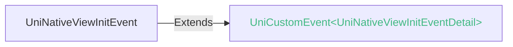

<!-- ## native-view -->

::: sourceCode
## native-view
:::

> 组件类型：[UniNativeViewElement](/api/dom/uninativeviewelement.md) 

 自定义原生View组件

`native-view`自身没有渲染内容，开发者可以通过DOM API获取到`native-view`对应的原生view，然后提供平台原生view与`native-view`进行绑定，`native-view`将展示该view的渲染内容。

`<native-view>`组件是uni-app x下扩展原生组件（如map）的重要方式。事实上官方的map组件就是使用`<native-view>`开发的。详见下方的使用场景章节。


### 兼容性
| Web | 微信小程序 | Android | iOS | HarmonyOS | HarmonyOS(Vapor) |
| :- | :- | :- | :- | :- | :- |
| <a style="color:unset;" href="https://vote.dcloud.net.cn/#/?name=uni-app%20x">x</a> | <a style="color:unset;" href="https://vote.dcloud.net.cn/#/?name=uni-app%20x">x</a> | 4.31 | 4.31 | 4.61 | 5.0 |


### 属性 
| 名称 | 类型 | 默认值 | 兼容性 | 描述 |
| :- | :- | :- |  :-: | :- |
| @init | (event: [UniNativeViewInitEvent](#uninativeviewinitevent)) => void | - | Web: x; 微信小程序: x; Android: 4.31; iOS: 4.31; HarmonyOS: 4.61; HarmonyOS(Vapor): 5.0 | native-view初始化时回调，event.detail = { element: 'native-view元素实例对象'} |


### 事件
#### UniNativeViewInitEvent
native-view 组件 init事件event

##### UniNativeViewInitEventDetail


###### UniNativeViewInitEventDetail 的属性值
| 名称 | 类型 | 必填 | 默认值 | 兼容性 | 描述 |
| :- | :- | :- | :- |  :-: | :- |
| element | [UniNativeViewElement](/api/dom/uninativeviewelement.md) | 是 | - | - | - |


<!-- UTSCOMJSON.native-view.component_type -->

### 使用场景

`native-view` 适用于开发[uts插件-标准模式组件](../plugin/uts-component-vue.md)

### 使用教程

#### 获取 UniNativeViewElement

`native-view`提供 @init 监听元素初始化，通过事件[UniNativeViewInitEvent](#uninativeviewinitevent)的 detail.element 获取到 [UniNativeViewElement](../dom/uninativeviewelement.md)。

#### UniNativeViewElement绑定原生view

**Android 平台：**

[UniNativeViewElement](../dom/uninativeviewelement.md) 提供[bindAndroidView](../dom/uninativeviewelement.md#bindandroidview)函数与`native-view`绑定android平台原生view

**IOS 平台：**

[UniNativeViewElement](../dom/uninativeviewelement.md) 提供[bindIOSView](../dom/uninativeviewelement.md#bindiosview)函数与`native-view`绑定ios平台原生view

**Harmony 平台：**

[UniNativeViewElement](../dom/uninativeviewelement.md) 提供 [bindHarmonyWrappedBuilder](../dom/uninativeviewelement.md#bindharmonywrappedbuilder) / [bindHarmonyFrameNode](../dom/uninativeviewelement.md#bindharmonyframenode) 函数与 `native-view` 绑定。

#### 分发自定义事件

[UniNativeViewElement](../dom/uninativeviewelement.md) 提供了dispatchEvent分发event事件API，注意：事件数据类型暂时只支持[UniNativeViewEvent](./common.md#uninativeviewevent)。

具体示例请参考：[native-button](https://gitcode.com/dcloud/hello-uni-app-x/blob/alpha/uni_modules/native-button/components/native-button/native-button.uvue)插件，该插件使用`native-view`封装原生button实现的native-button。

### 注意事项

+ app平台`native-view`组件绑定原生view后自动适配[组件全局属性](common.md#组件全局属性)
+ app平台`native-view`组件绑定原生view后自动适配[组件全局事件](common.md#组件全局事件)
	- android平台如果绑定的view设置了`setOnTouchListener`会导致touch部分全局事件失效
+ app平台`native-view`组件不支持自定义属性，使用[uts插件-标准模式组件-声明属性props](../plugin/uts-component-vue.md#组件声明属性props)实现自定义属性目的
+ app平台`native-view`组件不支持子组件
+ android平台`native-view`组件不支持[list-item复用机制](list-item.md#list-item复用机制)，list-item其他子组件不受影响正常启动复用业务。
+ android平台`native-view`组件不支持background、border、boxshadow属性
+ android平台`native-view`组件不支持overflow属性设置visible，仅支持hidden

### 子组件 @children-tags
不可以嵌套组件


NativeButton原生对象代码如下：

::: preview

> Android

```uts
import { Button } from "android.widget"

export class NativeButton {
	$element: UniNativeViewElement;

	constructor(element: UniNativeViewElement) {
		this.$element = element;
		this.bindView();
	}

	button: Button | null = null;
	bindView() {
		//通过UniElement.getAndroidActivity()获取android平台activity 用于创建view的上下文
		this.button = new Button(this.$element.getAndroidActivity()!);  //构建原生view
		//限制原生Button 文案描述不自动大写
		this.button?.setAllCaps(false)
		//监听原生Button点击事件
		this.button?.setOnClickListener(_ => {
			const detail = {}
			//构建自定义UniNativeViewEvent返回对象
			const event = new UniNativeViewEvent("customClick", detail)
			//响应分发原生Button的点击事件
			this.$element.dispatchEvent(event)
		})
		//UniNativeViewEvent 绑定 安卓原生view
		this.$element.bindAndroidView(this.button!);
	}

	updateText(text: string) {
		//更新原生Button 文案描述
		this.button?.setText(text)
	}

	destroy() {
		//数据回收
	}
}
```

> iOS

```uts
import { UIButton, UIControl } from "UIKit"

export class NativeButton {

	element : UniNativeViewElement;
	button : UIButton | null;

	constructor(element : UniNativeViewElement) {
    // 接收组件传递过来的UniNativeViewElement
		this.element = element;
		super.init()
		this.bindView();
	}

	// element 绑定原生view
	bindView() {
    // 初始化原生 UIButton
    this.button = new UIButton(type=UIButton.ButtonType.system)
    // 构建方法选择器
    const method = Selector("buttonClickAction")
    // button 绑定点击回调方法
    button?.addTarget(this, action = method, for = UIControl.Event.touchUpInside)
    // UniNativeViewElement 绑定原生 view
		this.element.bindIOSView(this.button!);
	}

	updateText(text : string) {
    // 更新 button 显示文字
		this.button?.setTitle(text, for = UIControl.State.normal)
	}

	/**
	 * 按钮点击回调方法
	 * 在 swift 中，所有target-action (例如按钮的点击事件，NotificationCenter 的通知事件等)对应的 action 函数前面都要使用 @objc 进行标记。
	 */
	@objc buttonClickAction() {
    //构建自定义 UniNativeViewEvent 对象
		let event = new UniNativeViewEvent("customClick")
    //触发自定义事件
		this.element.dispatchEvent(event)
	}

	destroy() {
    // 释放 UTS 实例对象，避免内存泄露
		UTSiOS.destroyInstance(this)
	}
}

```

> Harmony

```uts
import { BuilderNode } from "@kit.ArkUI"
// 导入混编实现的声明式UI构建函数
// 完整代码可参考 https://gitcode.com/dcloud/hello-uni-app-x/blob/alpha/uni_modules/native-button/utssdk/app-harmony
import { buildButton } from "./builder.ets"

import { INativeButtonContext } from "../interface.uts"
// 定义 buildButton 的参数类型
interface NativeButtonOptions {
    text : string
    onClick : () => void
}

export class NativeButton {
    private $element : UniNativeViewElement;
    private builder : BuilderNode<[NativeButtonOptions]> | null = null
    // 初始化 buildButton 默认参数
    private params : NativeButtonOptions = {
        text: '',
        onClick: () => {
            this.$element.dispatchEvent(new UniNativeViewEvent("customClick", {}))
        }
    }

    constructor(element : UniNativeViewElement) {
        // 绑定 wrapBuilder 函数
        this.builder = element.bindHarmonyWrappedBuilder(wrapBuilder<[NativeButtonOptions]>(buildButton), this.params)
    }

    updateText(text : string) {
        this.params.text = text
        // 调用 builder update 函数来更新 UI
        this.builder?.update(this.params)
    }
}

```

:::

具体示例请参考：[native-button](https://gitcode.com/dcloud/hello-uni-app-x/blob/alpha/uni_modules/native-button/components/native-button/native-button.uvue)插件


### 参见
- [相关 Bug](https://issues.dcloud.net.cn/?mid=component.basic-content.native-view)
- [微信小程序文档](https://developers.weixin.qq.com/doc/search.html?source=enter&query=native-view&doc_type=miniprogram)
- [支付宝小程序文档](https://open.alipay.com/portal/zhichi/search?keyword=native-view&pageIndex=1&pageSize=10&source=doc_top&type=all)
- [百度小程序文档](https://smartprogram.baidu.com/forum/search?query=native-view&scope=devdocs&source=docs)
- [抖音小程序文档](https://developer.open-douyin.com/search-page?keyword=native-view&secondType=all&type=1)
- [飞书小程序文档](https://open.feishu.cn/search?from=header&page=1&pageSize=10&q=native-view&topicFilter=)
- [钉钉小程序文档](https://open.dingtalk.com/search?keyword=native-view)
- [QQ小程序文档](https://q.qq.com/wiki/develop/miniprogram/frame/)
- [快手小程序文档](https://developers.kuaishou.com/page?keyword=native-view&from=docs)
- [京东小程序文档](https://mp-docs.jd.com/doc/dev/framework/-1)
- [华为快应用文档](https://developer.huawei.com/consumer/cn/doc/quickApp-References/webview-frame-overview-0000001124793625)
- [360小程序文档](https://mp.360.cn/doc/miniprogram/dev/#/b770a184ff1f06c6b3393a0fd1132380)
