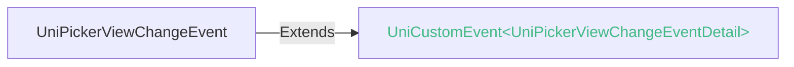

<!-- ## picker-view -->

::: sourceCode
## picker-view
:::

> 组件类型：UniPickerViewElement 

 嵌入页面的滚动选择器


### 兼容性
| Web | 微信小程序 | Android | iOS | HarmonyOS | HarmonyOS(Vapor) |
| :- | :- | :- | :- | :- | :- |
| 4.0 | 4.41 | 3.9 | 4.11 | 4.61 | 5.0 |


### 属性 
| 名称 | 类型 | 默认值 | 兼容性 | 描述 |
| :- | :- | :- |  :-: | :- |
| name | string | - | Web: 4.0; 微信小程序: 4.41; Android: 3.9; iOS: 4.11; HarmonyOS: 4.61; HarmonyOS(Vapor): 5.0 | 表单的控件名称，作为键值对的一部分与表单(form组件)一同提交 |
| value | Array\<number> | - | Web: 4.0; 微信小程序: 4.41; Android: 3.9; iOS: 4.11; HarmonyOS: 4.61; HarmonyOS(Vapor): 5.0 | 表单的控件值，作为键值对的一部分与表单(form组件)一同提交 |
| indicator-style | string([string.CSSString](/uts/data-type.md#ide-string)) | - | Web: 4.0; 微信小程序: 4.41; Android: 3.9; iOS: 4.11; HarmonyOS: 4.61; HarmonyOS(Vapor): 5.0 | 指示器样式 |
| indicator-class | string([string.ClassString](/uts/data-type.md#ide-string)) | - | Web: 4.0; 微信小程序: 4.41; Android: x; iOS: x; HarmonyOS: 4.61; HarmonyOS(Vapor): - | 设置选择器中间选中框的类名 |
| mask-style | string([string.CSSString](/uts/data-type.md#ide-string)) | - | Web: 4.0; 微信小程序: 4.41; Android: x; iOS: x; HarmonyOS: 4.61; HarmonyOS(Vapor): - | 设置蒙层的样式 |
| mask-top-style | string([string.CSSString](/uts/data-type.md#ide-string)) | - | Web: x; 微信小程序: x; Android: 3.9; iOS: 4.11; HarmonyOS: 4.61; HarmonyOS(Vapor): 5.0 | 遮罩顶部类 |
| mask-bottom-style | string([string.CSSString](/uts/data-type.md#ide-string)) | - | Web: x; 微信小程序: x; Android: 3.9; iOS: 4.11; HarmonyOS: 4.61; HarmonyOS(Vapor): 5.0 | 遮罩底部类 |
| mask-class | string([string.ClassString](/uts/data-type.md#ide-string)) | - | Web: 4.0; 微信小程序: 4.41; Android: x; iOS: x; HarmonyOS: 4.61; HarmonyOS(Vapor): 5.0 | 遮罩类 |
| @change | (event: [UniPickerViewChangeEvent](#unipickerviewchangeevent)) => void | - | Web: 4.0; 微信小程序: 4.41; Android: 3.9; iOS: 4.11; HarmonyOS: 4.61; HarmonyOS(Vapor): 5.0 | 当滚动选择，value 改变时触发 change 事件，event.detail = {value: value}；value为数组，表示 picker-view 内的 picker-view-column 当前选择的是第几项（下标从 0<br/>		开始） |
| @pickstart | eventhandle | - | Web: x; 微信小程序: 4.41; Android: x; iOS: x; HarmonyOS: x; HarmonyOS(Vapor): - | *(eventhandle)*<br/>当滚动选择开始时候触发事件 |
| @pickend | eventhandle | - | Web: x; 微信小程序: 4.41; Android: x; iOS: x; HarmonyOS: x; HarmonyOS(Vapor): - | *(eventhandle)*<br/>当滚动选择结束时候触发事件 |


### 事件
#### UniPickerViewChangeEvent


##### UniPickerViewChangeEventDetail


###### UniPickerViewChangeEventDetail 的属性值
| 名称 | 类型 | 必填 | 默认值 | 兼容性 | 描述 |
| :- | :- | :- | :- |  :-: | :- |
| value | Array&lt;number&gt; | 是 | - | - | - |


<!-- UTSCOMJSON.picker-view.component_type-->

### 子组件 @children-tags
| 子组件 | 兼容性 |
| :- | :- |
| [picker-view-column](picker-view-column.md) | Web: 4.0; 微信小程序: 4.41; Android: 3.9; iOS: 4.11; HarmonyOS: 4.61; HarmonyOS(Vapor): - |

### 示例
示例为[hello uni-app x alpha分支](https://gitcode.com/dcloud/hello-uni-app-x/blob/prod_alpha/pages/component/picker-view/picker-view.uvue)，与最新HBuilderX Alpha版同步。与最新正式版同步的master分支示例[另见](https://gitcode.com/dcloud/hello-uni-app-x/blob/master//pages/component/picker-view/picker-view.uvue) 
::: preview https://hellouniappx.dcloud.net.cn/web/#/pages/component/picker-view/picker-view

> appRedirect https://hellouniappx.dcloud.net.cn/appredirect.html?path=pages/component/picker-view/picker-view

>示例
```vue
<template>
  <view>
    <page-head :title="data.title"></page-head>
    <view class="uni-padding-wrap">
      <view class="uni-title">
        日期：{{data.year}}年{{data.month}}月{{data.day}}日
      </view>
    </view>
    <picker-view class="picker-view" :value="data.value" @change="bindChange" :indicator-style="data.indicatorStyle"
      :indicator-class="data.indicatorClass" :mask-style="data.maskStyle" :mask-class="data.maskClass" :mask-top-style="data.maskTopStyle"
      :mask-bottom-style="data.maskBottomStyle">
      <picker-view-column class="picker-view-column">
        <view class="item" v-for="(item,index) in data.years" :key="index"><text class="text">{{item}}年</text></view>
      </picker-view-column>
      <picker-view-column class="picker-view-column">
        <view class="item" v-for="(item,index) in data.months" :key="index"><text class="text">{{item}}月</text>
        </view>
      </picker-view-column>
      <picker-view-column class="picker-view-column">
        <view class="item" v-for="(item,index) in data.days" :key="index"><text class="text">{{item}}日</text></view>
      </picker-view-column>
    </picker-view>
    <boolean-data :defaultValue="false" title="设置选择器中间选中框的样式" @change="setIndicatorStyle"></boolean-data>
    <!-- #ifdef WEB || MP-WEIXIN -->
    <boolean-data :defaultValue="false" title="设置选择器中间选中框的类名" @change="setIndicatorClass"></boolean-data>
    <boolean-data :defaultValue="false" title="设置蒙层的样式" @change="setMaskStyle"></boolean-data>
    <boolean-data :defaultValue="false" title="设置蒙层的类名" @change="setMaskClass"></boolean-data>
    <!-- #endif -->
    <!-- #ifdef APP -->
    <boolean-data :defaultValue="false" title="设置蒙层上半部分的样式" @change="setMaskTopStyle"></boolean-data>
    <boolean-data :defaultValue="false" title="设置蒙层下半部分的样式" @change="setMaskBottomStyle"></boolean-data>
    <!-- #endif -->
  </view>
</template>

<script setup lang="uts">
  import { state, setEventCallbackNum } from '@/store/index.uts'

  type DataType = {
    title: string;
    years: number[];
    year: number;
    months: number[];
    month: number;
    days: number[];
    day: number;
    value: number[];
    result: number[];
    indicatorStyle: string;
    indicatorClass: string;
    maskStyle: string;
    maskClass: string;
    maskTopStyle: string;
    maskBottomStyle: string;
  }

  // 初始化数据
  // 20180112 HBuilderX内测开始 :)
  const _years : number[] = []
  const _year = 2018
  const _months : number[] = []
  const _month : number = 1
  const _days : number[] = []
  const _day = 12
  for (let i = 2000; i <= _year; i++) {
    _years.push(i)
  }
  for (let i = 1; i <= 12; i++) {
    _months.push(i)
  }
  for (let i = 1; i <= 31; i++) {
    _days.push(i)
  }

  // 使用reactive避免ref数据在自动化测试中无法访问
  const data = reactive({
    title: 'picker-view',
    years: _years,
    year: _year,
    months: _months,
    month: _month,
    days: _days,
    day: _day,
    value: [_year - 2000, _month - 1, _day - 1],
    result: [],
    indicatorStyle: 'height: 50px;',
    indicatorClass: '',
    maskStyle: '',
    maskClass: '',
    maskTopStyle: '',
    maskBottomStyle: ''
  } as DataType)

  const setIndicatorStyle = (checked : boolean) => {
    const extraStyle = 'height: 50px;border:#ff5500 solid 1px;background:rgba(182, 179, 255, 0.4);';
    // #ifdef APP-HARMONY
    data.indicatorStyle = checked ? extraStyle : "height: 50px;border:none;background:transparent;";
    // #endif
    // #ifndef APP-HARMONY
    data.indicatorStyle = checked ? extraStyle : "height: 50px;";
    // #endif
  }

  const setIndicatorClass = (checked : boolean) => {
    data.indicatorClass = checked ? "indicator-test" : ""
  }

  const setMaskStyle = (checked : boolean) => {
    const extraMaskStyle = "background-image: linear-gradient(to bottom, #d8e5ff, rgba(216, 229, 255, 0));"
    data.maskStyle = checked ? extraMaskStyle : ""
  }

  const setMaskClass = (checked : boolean) => {
    data.maskClass = checked ? "mask-test" : ""
  }

  const setMaskTopStyle = (checked : boolean) => {
    const linearToTop = "background-image: linear-gradient(to bottom, #f4ff73, rgba(216, 229, 255, 0));"
    // #ifdef APP-HARMONY && !VUE3-VAPOR
    data.maskTopStyle = checked ? linearToTop : "background-image: linear-gradient(to bottom, transparent, transparent);"
    // #endif
    // #ifdef APP-HARMONY && VUE3-VAPOR
    data.maskTopStyle = checked ? linearToTop : ""
    // #endif
    // #ifndef APP-HARMONY
    data.maskTopStyle = checked ? linearToTop : ""
    // #endif
  }

  const setMaskBottomStyle = (checked : boolean) => {
    const linearToBottom = "background-image: linear-gradient(to top, #f4ff73, rgba(216, 229, 255, 0));"
    // #ifdef APP-HARMONY && !VUE3-VAPOR
    data.maskBottomStyle = checked ? linearToBottom : "background-image: linear-gradient(to bottom, transparent, transparent);"
    // #endif
    // #ifdef APP-HARMONY && VUE3-VAPOR
    data.maskBottomStyle = checked ? linearToBottom : ""
    // #endif
    // #ifndef APP-HARMONY
    data.maskBottomStyle = checked ? linearToBottom : ""
    // #endif
  }

  // 自动化测试
  const getEventCallbackNum = () : number => {
    return state.eventCallbackNum
  }

  // 自动化测试
  const setEventCallbackNumTest = (num : number) => {
    setEventCallbackNum(num)
  }

  const bindChange = (e : UniPickerViewChangeEvent) => {
    // 自动化测试 触发事件元素、type 类型
    // console.log(e.target?.tagName, e.type);
    if ((e.target?.tagName ?? '').includes('PICKER-VIEW')) {
      setEventCallbackNumTest(state.eventCallbackNum + 1)
    }
    if (e.type === 'change') {
      setEventCallbackNumTest(state.eventCallbackNum + 2)
    }
    const val = e.detail.value
    data.result = val
    data.year = data.years[val[0]]
    data.month = data.months[val[1]]
    data.day = data.days[val[2]]
  }

  const setValue = () => {
    data.value = [0, 1, 30] as number[]
  }

  const setValue1 = () => {
    data.value = [10, 10, 10] as number[]
  }

  defineExpose({
    data,
    setIndicatorStyle,
    setIndicatorClass,
    setMaskStyle,
    setMaskClass,
    setMaskTopStyle,
    setMaskBottomStyle,
    getEventCallbackNum,
    setEventCallbackNumTest,
    setValue,
    setValue1
  })
</script>

<style>
  .picker-view {
    width: 100%;
    height: 320px;
    margin-top: 10px;
    margin-bottom: 20px;
  }

  .item {
    height: 50px;
  }

  .text {
    line-height: 50px;
    text-align: center;
  }

  /* 自动化测试 */
  .indicator-test {
    height: 50px;
    border: #ff5500 solid 1px;
    background:rgba(182, 179, 255, 0.4);
  }

  .mask-test {
    background-image: linear-gradient(to bottom, #d8e5ff, rgba(216, 229, 255, 0));
  }
</style>

```

:::


### 参见
- [相关 Bug](https://issues.dcloud.net.cn/?mid=component.form-component.picker-view.picker-view)
- [参见uni-app相关文档](https://uniapp.dcloud.io/component/picker-view.html)
- [微信小程序文档](https://developers.weixin.qq.com/miniprogram/dev/component/picker-view.html)
- [支付宝小程序文档](https://open.alipay.com/portal/zhichi/search?keyword=picker-view&pageIndex=1&pageSize=10&source=doc_top&type=all)
- [百度小程序文档](https://smartprogram.baidu.com/forum/search?query=picker-view&scope=devdocs&source=docs)
- [抖音小程序文档](https://developer.open-douyin.com/search-page?keyword=picker-view&secondType=all&type=1)
- [飞书小程序文档](https://open.feishu.cn/search?from=header&page=1&pageSize=10&q=picker-view&topicFilter=)
- [钉钉小程序文档](https://open.dingtalk.com/search?keyword=picker-view)
- [QQ小程序文档](https://q.qq.com/wiki/develop/miniprogram/frame/)
- [快手小程序文档](https://developers.kuaishou.com/page?keyword=picker-view&from=docs)
- [京东小程序文档](https://mp-docs.jd.com/doc/dev/framework/-1)
- [华为快应用文档](https://developer.huawei.com/consumer/cn/doc/quickApp-References/webview-frame-overview-0000001124793625)
- [360小程序文档](https://mp.360.cn/doc/miniprogram/dev/#/b770a184ff1f06c6b3393a0fd1132380)

## tips
- picker里如放置较长内容，应该使用list-view而不是scroll-view。
- uni ui的[uni-data-picker](https://ext.dcloud.net.cn/plugin?id=3796)，是封装好的弹出式、分列加载的、DataCom规范的多列选择组件，适用于地址选择等场景。
