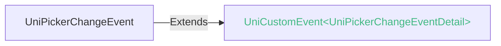
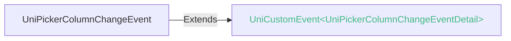

<!-- ## picker -->

::: sourceCode
## picker

> GitCode: https://gitcode.com/dcloud/uni-component/tree/alpha/uni_modules/uni-picker


> GitHub: https://github.com/dcloudio/uni-component/tree/alpha/uni_modules/uni-picker

:::

从底部弹起的滚动选择器，现支持五种选择器，通过mode来区分，分别是普通选择器，多列选择器，时间选择器，日期选择器，省市区选择器，默认是普通选择器。


### 兼容性
| Web | 微信小程序 | Android | iOS | HarmonyOS | HarmonyOS(Vapor) |
| :- | :- | :- | :- | :- | :- |
| 4.0 | 4.41 | <a style="color:unset;" href="https://vote.dcloud.net.cn/#/?name=uni-app%20x">x</a> | <a style="color:unset;" href="https://vote.dcloud.net.cn/#/?name=uni-app%20x">x</a> | 4.61 | 5.0 |


picker组件其实是基于[picker-view组件](picker-view.md)封装了一个弹出形态。

Android/iOS平台可改用[picker-view组件](picker-view.md)、或[uni.showActionSheet](../api/action-sheet.md)。

或者使用开源组件[uni-data-picker](https://ext.dcloud.net.cn/plugin?id=3796)。这是也是基于[picker-view组件](picker-view.md)封装的云端一体组件，如果需要选择城市，那么推荐使用该组件。

### 属性 
| 名称 | 类型 | 默认值 | 兼容性 | 描述 |
| :- | :- | :- |  :-: | :- |
| disabled | boolean | - | Web: 4.0; 微信小程序: 4.41; Android: 3.9; iOS: x; HarmonyOS: 4.61; HarmonyOS(Vapor): 5.0 | 是否禁用 |
| mode | string | - | Web: 4.0; 微信小程序: 4.41; Android: 3.9; iOS: x; HarmonyOS: 4.61; HarmonyOS(Vapor): 5.0 | 选择器类型 |
| range | array | - | Web: 4.0; 微信小程序: 4.41; Android: 3.9; iOS: x; HarmonyOS: 4.61; HarmonyOS(Vapor): 5.0 | mode为 selector 或 multiSelector 时，range 有效 |
| range-key | string | - | Web: 4.0; 微信小程序: 4.41; Android: 3.9; iOS: x; HarmonyOS: 4.61; HarmonyOS(Vapor): 5.0 | 当 range 是一个 Object Array 时，通过 range-key 来指定 Object 中 key 的值作为选择器显示内容 |
| value | string | - | Web: 4.0; 微信小程序: 4.41; Android: 3.9; iOS: x; HarmonyOS: 4.61; HarmonyOS(Vapor): 5.0 | 表示选择了 range 中的第几个（下标从 0 开始） |
| start | string | - | Web: 4.0; 微信小程序: 4.41; Android: 3.9; iOS: x; HarmonyOS: 4.61; HarmonyOS(Vapor): 5.0 | 表示有效时间范围的开始 |
| end | string | - | Web: 4.0; 微信小程序: 4.41; Android: 3.9; iOS: x; HarmonyOS: 4.61; HarmonyOS(Vapor): 5.0 | 表示有效时间范围的结束 |
| fields | string | - | Web: 4.0; 微信小程序: 4.41; Android: 3.9; iOS: x; HarmonyOS: 4.61; HarmonyOS(Vapor): 5.0 | 有效值 year,month,day，表示选择器的粒度 |
| custom-item | string | - | Web: 4.0; 微信小程序: 4.41; Android: 3.9; iOS: x; HarmonyOS: 4.61; HarmonyOS(Vapor): - | 可为每一列的顶部添加一个自定义的项 |
| header-text | string | - | Web: -; 微信小程序: 4.41; Android: -; iOS: -; HarmonyOS: -; HarmonyOS(Vapor): - | 选择器的标题，仅微信小程序安卓端可用 |
| level | string | - | Web: -; 微信小程序: 4.41; Android: -; iOS: -; HarmonyOS: -; HarmonyOS(Vapor): - | mode="region" 时有效，选择器层级 |
| name | string | - | Web: -; 微信小程序: -; Android: -; iOS: -; HarmonyOS: -; HarmonyOS(Vapor): 5.0 | 表单的控件名称，作为键值对的一部分与表单(form组件)一同提交 |
| @change | (event: [UniPickerChangeEvent](#unipickerchangeevent)) => void | - | Web: 4.0; 微信小程序: 4.41; Android: 3.9; iOS: x; HarmonyOS: 4.61; HarmonyOS(Vapor): 5.0 | value 改变时触发 change 事件，event.detail = {value: value} |
| @columnchange | (event: [UniPickerColumnChangeEvent](#unipickercolumnchangeevent)) => void | - | Web: 4.0; 微信小程序: 4.41; Android: 3.9; iOS: x; HarmonyOS: 4.61; HarmonyOS(Vapor): 5.0 | 某一列的值改变时触发 columnchange 事件，event.detail = {column: column, value: value}，column 的值表示改变了第几列（下标从0开始），value 的值表示变更值的下标 |
| @cancel | (event: [UniPickerCancelEvent](#unipickercancelevent)) => void | - | Web: 4.0; 微信小程序: 4.41; Android: 3.9; iOS: x; HarmonyOS: 4.61; HarmonyOS(Vapor): 5.0 | 取消选择时触发 |

#### mode 的属性描述

| 合法值 | 兼容性 | 描述 |
| :- |  :-: | :- |
| selector | Web: -; 微信小程序: 4.41; Android: -; iOS: -; HarmonyOS: 4.61; HarmonyOS(Vapor): 5.0 | 普通选择器 |
| multiSelector | Web: -; 微信小程序: 4.41; Android: -; iOS: -; HarmonyOS: 4.61; HarmonyOS(Vapor): 5.0 | 多列选择器 |
| time | Web: -; 微信小程序: 4.41; Android: -; iOS: -; HarmonyOS: 4.61; HarmonyOS(Vapor): 5.0 | 时间选择器 |
| date | Web: -; 微信小程序: 4.41; Android: -; iOS: -; HarmonyOS: 4.61; HarmonyOS(Vapor): 5.0 | 日期选择器 |
| region | Web: -; 微信小程序: 4.41; Android: -; iOS: -; HarmonyOS: -; HarmonyOS(Vapor): - | 省市选择器 |

#### fields 的属性描述

| 合法值 | 兼容性 | 描述 |
| :- |  :-: | :- |
| year | Web: -; 微信小程序: 4.41; Android: -; iOS: -; HarmonyOS: 4.61; HarmonyOS(Vapor): 5.0 | 选择器粒度为年 |
| month | Web: -; 微信小程序: 4.41; Android: -; iOS: -; HarmonyOS: 4.61; HarmonyOS(Vapor): 5.0 | 选择器粒度为月份 |
| day | Web: -; 微信小程序: 4.41; Android: -; iOS: -; HarmonyOS: 4.61; HarmonyOS(Vapor): 5.0 | 选择器粒度为天 |

#### level 的属性描述

| 合法值 | 兼容性 | 描述 |
| :- |  :-: | :- |
| province | Web: -; 微信小程序: 4.41; Android: -; iOS: -; HarmonyOS: -; HarmonyOS(Vapor): - | 省级选择器 |
| city | Web: -; 微信小程序: 4.41; Android: -; iOS: -; HarmonyOS: -; HarmonyOS(Vapor): - | 市级选择器 |
| region | Web: -; 微信小程序: 4.41; Android: -; iOS: -; HarmonyOS: -; HarmonyOS(Vapor): - | 区级选择器 |
| sub-district | Web: -; 微信小程序: 4.41; Android: -; iOS: -; HarmonyOS: -; HarmonyOS(Vapor): - | 街道选择器 |


### 事件
#### UniPickerChangeEvent


##### UniPickerChangeEventDetail


###### UniPickerChangeEventDetail 的属性值
| 名称 | 类型 | 必填 | 默认值 | 兼容性 | 描述 |
| :- | :- | :- | :- |  :-: | :- |
| value | any | 是 | - | - | - |


#### UniPickerColumnChangeEvent


##### UniPickerColumnChangeEventDetail


###### UniPickerColumnChangeEventDetail 的属性值
| 名称 | 类型 | 必填 | 默认值 | 兼容性 | 描述 |
| :- | :- | :- | :- |  :-: | :- |
| value | number | 是 | - | - | - |
| column | number | 是 | - | - | - |


<!-- UTSCOMJSON.picker.component_type -->


### 示例
示例为[hello uni-app x alpha分支](https://gitcode.com/dcloud/hello-uni-app-x/blob/prod_alpha/pages/component/picker/picker.uvue)，与最新HBuilderX Alpha版同步。与最新正式版同步的master分支示例[另见](https://gitcode.com/dcloud/hello-uni-app-x/blob/master//pages/component/picker/picker.uvue) 
::: preview https://hellouniappx.dcloud.net.cn/web/#/pages/component/picker/picker

>示例
```vue
<template>
  <!-- #ifdef APP -->
  <scroll-view style="flex: 1">
  <!-- #endif -->
    <page-head :title="data.title"></page-head>
    <text class="uni-title uni-common-pl">普通选择器</text>
    <view class="uni-list">
      <view class="uni-list-cell">
        <view class="uni-list-cell-left">当前选择</view>
        <view class="uni-list-cell-db">
          <picker class="picker-selector--test" @change="bindPickerChange" :value="data.index" :range="data.selectorArray" range-key="name">
            <text class="uni-input picker-selector--value">{{data.selectorArray[data.index].name}}</text>
          </picker>
        </view>
      </view>
    </view>

    <text class="uni-title uni-common-pl">多列选择器</text>
    <view class="uni-list">
      <view class="uni-list-cell">
        <text class="uni-list-cell-left">当前选择</text>
        <view class="uni-list-cell-db">
          <picker class="picker-multi--test" mode="multiSelector" @columnchange="bindMultiPickerColumnChange" :value="data.multiIndex" :range="data.multiArray">
            <text class="uni-input picker-multi--value">
              {{data.multiArray[0][data.multiIndex[0]]}}，{{data.multiArray[1][data.multiIndex[1]]}}，{{data.multiArray[2][data.multiIndex[2]]}}
            </text>
          </picker>
        </view>
      </view>
    </view>

    <text class="uni-title uni-common-pl">time选择器</text>
    <view class="uni-list">
      <view class="uni-list-cell">
        <view class="uni-list-cell-left">当前选择</view>
        <view class="uni-list-cell-db">
          <picker class="picker-time--test" mode="time" :value="data.time" start="09:01" end="21:01" @change="bindTimeChange">
            <text class="uni-input">{{data.time}}</text>
          </picker>
        </view>
      </view>
    </view>
    <text class="uni-picker-tips">注：选择 09:01 ~ 21:01 之间的时间, 不在区间内不能选中</text>

    <text class="uni-title uni-common-pl">date选择器 fields = day</text>
    <view class="uni-list">
      <view class="uni-list-cell">
        <text class="uni-list-cell-left">当前选择 </text>
        <view class="uni-list-cell-db">
          <picker class="picker-date-day--test" mode="date" :value="data.dayDate" :start="data.startDate" :end="data.endDate" @change="bindDayDateChange">
            <text class="uni-input">{{data.dayDate}}</text>
          </picker>
        </view>
      </view>
    </view>
    <text class="uni-picker-tips">注：选择当前时间往前90年和往后10年之间的时间, 不在区间内不能选中</text>

    <text class="uni-title uni-common-pl">日期选择器 fields = month</text>
    <view class="uni-list">
      <view class="uni-list-cell">
        <text class="uni-list-cell-left">当前选择 </text>
        <view class="uni-list-cell-db">
          <picker class="picker-date-month--test" mode="date" fields="month" :value="data.monthDate" :start="data.startDate" :end="data.endDate" @change="bindMonthDateChange">
            <text class="uni-input">{{data.monthDate}}</text>
          </picker>
        </view>
      </view>
    </view>
    <text class="uni-picker-tips">注：选择当前时间往前90年和往后10年之间的时间, 不在区间内不能选中。且只能选年和月</text>

    <text class="uni-title uni-common-pl">日期选择器 fields = year</text>
    <view class="uni-list">
      <view class="uni-list-cell">
        <text class="uni-list-cell-left">当前选择 </text>
        <view class="uni-list-cell-db">
          <picker class="picker-date-year--test" mode="date" fields="year" :value="data.yearDate" :start="data.startDate" :end="data.endDate" @change="bindYearDateChange">
            <text class="uni-input">{{data.yearDate}}</text>
          </picker>
        </view>
      </view>
    </view>
    <text class="uni-picker-tips">注：选择当前时间往前90年和往后10年之间的时间, 不在区间内不能选中</text>

    <text class="uni-title uni-common-pl">省市地区选择器</text>
    <view class="uni-list" style="margin-bottom: 15px;">
      <view class="uni-list-cell">
        <text class="uni-list-cell-left">当前选择</text>
        <view class="uni-list-cell-db" @click="initCityData">
          <!-- #ifndef MP-WEIXIN -->
            <picker class="picker-city--test" mode="multiSelector" @columnchange="bindCityPickerColumnChange" :value="data.cityIndex" :range="data.cityArray">
              <text class="uni-input picker-city--value">
                {{data.cityArray[0][data.cityIndex[0]]}}{{data.cityArray[1][data.cityIndex[1]] ? '，' : ''}}{{data.cityArray[1][data.cityIndex[1]]}}{{data.cityArray[2][data.cityIndex[2]] ? '，' : ''}}{{data.cityArray[2][data.cityIndex[2]]}}
              </text>
            </picker>
          <!-- #endif -->
          <!-- #ifdef MP-WEIXIN -->
            <picker class="picker-city--test" mode="region" @change="bindRegionChange" :value="data.region" >
              <text class="uni-input picker-city--value">
                {{data.region[0]}}{{data.region[1] ? '，' : ''}}{{data.region[1]}}{{data.region[2] ? '，' : ''}}{{data.region[2]}}
              </text>
            </picker>
          <!-- #endif -->
        </view>
      </view>
    </view>
    <text class="uni-picker-tips">注：省市地区数据并没有内置到uni-app x框架中，仅微信下由微信内置了，其他平台需单独加载地区数据</text>

    <text class="uni-title uni-common-pl">已禁用的picker，点击无效</text>
    <view class="uni-list">
      <view class="uni-list-cell">
        <view class="uni-list-cell-left">当前选择</view>
        <view class="uni-list-cell-db">
          <picker class="picker-disabled--test" @change="bindPickerChange" disabled :value="data.index" :range="data.selectorArray" range-key="name">
            <text class="uni-input picker-disabled--value">{{data.selectorArray[data.index].name}}</text>
          </picker>
        </view>
      </view>
    </view>
    <text class="uni-picker-tips">注：值与普通选择器同步，但不可选择</text>

  <!-- #ifdef APP -->
  </scroll-view>
  <!-- #endif -->
</template>
<script setup lang="uts">
  import { state, setEventCallbackNum } from '@/store/index.uts'
  // #ifndef MP-WEIXIN
  import { cityData } from './city.uts'
  // #endif

  type DataType = {
    name : string
  }

  type CityItemData = {
    title: string
    id: string
    disabled?: boolean
    children: Array<CityItemData>
  }

  type PageDataType = {
    title: string;
    selectorArray: DataType[];
    index: number;
    multiArray: Array<string[]>;
    multiIndex: number[];
    cityArray: Array<string[]>;
    allCityData: CityItemData[];
    cityIndex: number[];
    region: string[];
    dayDate: string;
    monthDate: string;
    yearDate: string;
    startDate: string;
    endDate: string;
    time: string;
  }

  function getDate(date_text : string = 'day', type ?: string) : string {
    const date = new Date();

    let year : string | number = date.getFullYear();
    let month : string | number = date.getMonth() + 1;
    let day : string | number = date.getDate();

    if (type == 'start') {
      year = year - 90;
    } else if (type == 'end') {
      year = year + 10;
    }
    month = month > 9 ? month : '0' + month;;
    day = day > 9 ? day : '0' + day;
    if (date_text == 'month') {
      return `${year}-${month}`;
    } else if (date_text == 'year') {
      return `${year}`;
    }
    return `${year}-${month}-${day}`;
  }

  // 使用reactive避免ref数据在自动化测试中无法访问
  const data = reactive({
    title: 'picker',
    selectorArray: [{ name: '中国' }, { name: '美国' }, { name: '巴西' }, { name: '日本' }],
    index: 0,
    multiArray: [
      ['亚洲', '欧洲'],
      ['中国', '日本'],
      ['北京', '上海', '广州']
    ],
    multiIndex: [0, 0, 0],
    cityArray: [[],[],[]],
    allCityData: [],
    region: [],
    cityIndex: [0, 0, 0],
    dayDate: getDate('day'),
    monthDate: getDate('month'),
    yearDate: getDate('year'),
    startDate: getDate('day', 'start'),
    endDate: getDate('day', 'end'),
    time: '12:01'
  } as PageDataType)

  // #ifndef MP-WEIXIN
  function initCityData() {
    const cityDataList = JSON.parse(cityData) as CityItemData[]
    data.allCityData = cityDataList
    data.cityArray[0] = cityDataList.map(item => item.title)
    // 使用当前选择的省份索引来初始化城市数据
    const provinceIndex = data.cityIndex[0]
    if (cityDataList[provinceIndex] && cityDataList[provinceIndex].children) {
      data.cityArray[1] = cityDataList[provinceIndex].children.map(item => item.title)
      const cityIndex = data.cityIndex[1]
      if (cityDataList[provinceIndex].children[cityIndex] && cityDataList[provinceIndex].children[cityIndex].children) {
        data.cityArray[2] = cityDataList[provinceIndex].children[cityIndex].children.map(item => item.title)
      } else {
        data.cityArray[2] = []
      }
    } else {
      data.cityArray[1] = []
      data.cityArray[2] = []
    }
  }
  // #endif

  // #ifdef MP-WEIXIN
  function bindRegionChange(e : UniPickerChangeEvent) {
    console.log('picker发送选择改变，携带值为', e.detail.value)
    data.region = e.detail.value
  }
  // #endif

  const bindPickerChange = (e : UniPickerChangeEvent) => {
    console.log('picker发送选择改变，携带值为：' + e.detail.value)
    data.index = e.detail.value
  }

  const bindMultiPickerColumnChange = (e : UniPickerColumnChangeEvent) => {
    console.log('修改的列为：' + e.detail.column + '，值为：' + e.detail.value)
    data.multiIndex[e.detail.column] = e.detail.value
    switch (e.detail.column) {
      case 0: //拖动第1列
        switch (data.multiIndex[0]) {
          case 0:
            data.multiArray[1] = ['中国', '日本']
            data.multiArray[2] = ['北京', '上海', '广州']
            break
          case 1:
            data.multiArray[1] = ['英国', '法国']
            data.multiArray[2] = ['伦敦', '曼彻斯特']
            break
        }
        data.multiIndex.splice(1, 1, 0)
        data.multiIndex.splice(2, 1, 0)
        break
      case 1: //拖动第2列
        switch (data.multiIndex[0]) { //判断第一列是什么
          case 0:
            switch (data.multiIndex[1]) {
              case 0:
                data.multiArray[2] = ['北京', '上海', '广州']
                break
              case 1:
                data.multiArray[2] = ['东京', '北海道']
                break
            }
            break
          case 1:
            switch (data.multiIndex[1]) {
              case 0:
                data.multiArray[2] = ['伦敦', '曼彻斯特']
                break
              case 1:
                data.multiArray[2] = ['巴黎', '马赛']
                break
            }
            break
        }
        data.multiIndex.splice(2, 1, 0)
        break
    }
    nextTick(() => {
      // 强制更新视图
    })
  }

  // #ifndef MP-WEIXIN
  const bindCityPickerColumnChange = (e : UniPickerColumnChangeEvent) => {
    console.log('修改的列为：' + e.detail.column + '，值为：' + e.detail.value)
    data.cityIndex[e.detail.column] = e.detail.value
    switch (e.detail.column) {
      case 0: //拖动第1列（省份）
        const provinceIndex = data.cityIndex[0]
        const cities = data.allCityData[provinceIndex].children
        data.cityArray[1] = cities.map(item => item.title)
        if (cities.length > 0) {
          data.cityArray[2] = cities[0].children.map(item => item.title)
        } else {
          data.cityArray[2] = []
        }
        data.cityIndex.splice(1, 1, 0)
        data.cityIndex.splice(2, 1, 0)
        break
      case 1: //拖动第2列（城市）
        const cityIndex = data.cityIndex[1]
        const province = data.allCityData[data.cityIndex[0]]
        if (province && province.children && province.children[cityIndex]) {
          const districts = province.children[cityIndex].children
          data.cityArray[2] = districts.map(item => item.title)
        } else {
          data.cityArray[2] = []
        }
        data.cityIndex.splice(2, 1, 0)
        break
    }
  }
  // #endif

  const bindDayDateChange = (e : UniPickerChangeEvent) => {
    data.dayDate = e.detail.value as string
  }

  const bindMonthDateChange = (e : UniPickerChangeEvent) => {
    data.monthDate = e.detail.value as string
  }

  const bindYearDateChange = (e : UniPickerChangeEvent) => {
    data.yearDate = e.detail.value as string
  }

  const bindTimeChange = (e : UniPickerChangeEvent) => {
    data.time = e.detail.value as string
  }

  // 自动化函数
  const setSelectorValue = () => {
    data.index = 2
  }

  const getEventCallbackNum = () : number => {
    return state.eventCallbackNum
  }

  // 自动化测试
  const setEventCallbackNum = (num : number) => {
    setEventCallbackNum(num)
  }

  defineExpose({
    data,
    setSelectorValue
  })
</script>

<style>
  .uni-title {
    font-size: 14px;
  }

  .uni-picker-tips {
    font-size: 12px;
    color: #666;
    margin-top: 5px;
    margin-bottom: 15px;
    padding: 0 15px;
  }

  /* #ifdef WEB */
  @media (prefers-color-scheme: dark) {
    .uni-input {
      background-color: #2d2d2d;
      color: #ffffff;
    }

    .uni-list {
      background-color: #2d2d2d;
    }
  }
  /* #endif */
</style>

```

:::


### 参见
- [相关 Bug](https://issues.dcloud.net.cn/?mid=component.form-component.picker)
- [参见uni-app相关文档](https://uniapp.dcloud.io/component/picker.html)
- [微信小程序文档](https://developers.weixin.qq.com/miniprogram/dev/component/picker.html)
- [支付宝小程序文档](https://open.alipay.com/portal/zhichi/search?keyword=picker&pageIndex=1&pageSize=10&source=doc_top&type=all)
- [百度小程序文档](https://smartprogram.baidu.com/forum/search?query=picker&scope=devdocs&source=docs)
- [抖音小程序文档](https://developer.open-douyin.com/search-page?keyword=picker&secondType=all&type=1)
- [飞书小程序文档](https://open.feishu.cn/search?from=header&page=1&pageSize=10&q=picker&topicFilter=)
- [钉钉小程序文档](https://open.dingtalk.com/search?keyword=picker)
- [QQ小程序文档](https://q.qq.com/wiki/develop/miniprogram/frame/)
- [快手小程序文档](https://developers.kuaishou.com/page?keyword=picker&from=docs)
- [京东小程序文档](https://mp-docs.jd.com/doc/dev/framework/-1)
- [华为快应用文档](https://developer.huawei.com/consumer/cn/doc/quickApp-References/webview-frame-overview-0000001124793625)
- [360小程序文档](https://mp.360.cn/doc/miniprogram/dev/#/b770a184ff1f06c6b3393a0fd1132380)
