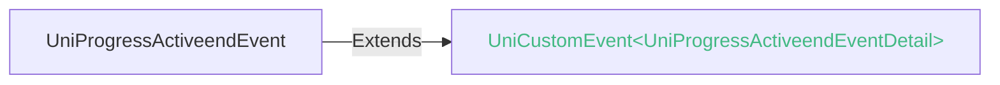

<!-- ## progress -->

::: sourceCode
## progress

> GitCode: https://gitcode.com/dcloud/uni-component/tree/alpha/uni_modules/uni-progress


> GitHub: https://github.com/dcloudio/uni-component/tree/alpha/uni_modules/uni-progress

:::

> 组件类型：UniProgressElement 

 进度条


### 兼容性
| Web | 微信小程序 | Android | iOS | HarmonyOS | HarmonyOS(Vapor) |
| :- | :- | :- | :- | :- | :- |
| 4.0 | 4.41 | 3.9 | 4.11 | 4.61 | 5.0 |


### 属性 
| 名称 | 类型 | 默认值 | 兼容性 | 描述 |
| :- | :- | :- |  :-: | :- |
| duration | number | 30 | Web: 4.0; 微信小程序: 4.41; Android: 3.9; iOS: 4.11; HarmonyOS: 4.61; HarmonyOS(Vapor): 5.0 | 进度增加1%所需毫秒数 |
| percent | number | 0 | Web: 4.0; 微信小程序: 4.41; Android: 3.9; iOS: 4.11; HarmonyOS: 4.61; HarmonyOS(Vapor): 5.0 | 进度百分比 |
| show-info | boolean | false | Web: 4.0; 微信小程序: 4.41; Android: 3.9; iOS: 4.11; HarmonyOS: 4.61; HarmonyOS(Vapor): 5.0 | 是否显示进度条值 |
| border-radius | number | 0 | Web: x; 微信小程序: 4.41; Android: 3.9; iOS: 4.11; HarmonyOS: -; HarmonyOS(Vapor): 5.0 | 进度条圆角 |
| font-size | number | 16 | Web: x; 微信小程序: 4.41; Android: 3.9; iOS: 4.11; HarmonyOS: -; HarmonyOS(Vapor): 5.0 | 进度条字体大小 |
| stroke-width | number | 6 | Web: 4.0; 微信小程序: 4.41; Android: 3.9; iOS: 4.11; HarmonyOS: 4.61; HarmonyOS(Vapor): 5.0 | 进度条宽度 |
| activeColor | string([string.ColorString](/uts/data-type.md#ide-string)) | "#09BB07" | Web: 4.0; 微信小程序: 4.41; Android: 3.9; iOS: 4.11; HarmonyOS: 4.61; HarmonyOS(Vapor): - | 已选择的进度条的颜色 |
| backgroundColor | string([string.ColorString](/uts/data-type.md#ide-string)) | "#EBEBEB" | Web: 4.0; 微信小程序: 4.41; Android: 3.9; iOS: 4.11; HarmonyOS: 4.61; HarmonyOS(Vapor): - | 未选择的进度条的颜色 |
| active | boolean | false | Web: 4.0; 微信小程序: 4.41; Android: 3.9; iOS: 4.11; HarmonyOS: 4.61; HarmonyOS(Vapor): 5.0 | 是否启用动画 |
| active-mode | string | "backwards" | Web: 4.0; 微信小程序: 4.41; Android: 3.9; iOS: 4.11; HarmonyOS: 4.61; HarmonyOS(Vapor): 5.0 | 动画模式 |
| ~~color~~ | string | - | Web: x; 微信小程序: 4.41; Android: x; iOS: x; HarmonyOS: x; HarmonyOS(Vapor): - | *(string)*<br/>进度条颜色（请使用activeColor） |
| background-color | string | - | Web: -; 微信小程序: -; Android: -; iOS: -; HarmonyOS: -; HarmonyOS(Vapor): 5.0 | 未选择的进度条的颜色 |
| active-color | string | - | Web: -; 微信小程序: -; Android: -; iOS: -; HarmonyOS: -; HarmonyOS(Vapor): 5.0 | 已选择的进度条的颜色 |
| @activeend | (event: [UniProgressActiveendEvent](#uniprogressactiveendevent)) => void | - | Web: x; 微信小程序: 4.41; Android: 3.9; iOS: 4.11; HarmonyOS: 4.61; HarmonyOS(Vapor): 5.0 | 动画完成事件 |

#### active-mode 的属性描述

| 合法值 | 兼容性 | 描述 |
| :- |  :-: | :- |
| backwards | Web: 4.0; 微信小程序: 4.41; Android: 3.9; iOS: 4.11; HarmonyOS: 4.61; HarmonyOS(Vapor): 5.0 | 动画从头播 |
| forwards | Web: 4.0; 微信小程序: 4.41; Android: 3.9; iOS: 4.11; HarmonyOS: 4.61; HarmonyOS(Vapor): 5.0 | 动画从上次结束点接着播 |


### 事件
#### UniProgressActiveendEvent


##### UniProgressActiveendEventDetail


###### UniProgressActiveendEventDetail 的属性值
| 名称 | 类型 | 必填 | 默认值 | 兼容性 | 描述 |
| :- | :- | :- | :- |  :-: | :- |
| curPercent | number | 是 | - | - | - |


<!-- UTSCOMJSON.progress.component_type-->


### 示例
示例为[hello uni-app x alpha分支](https://gitcode.com/dcloud/hello-uni-app-x/blob/prod_alpha/pages/component/progress/progress.uvue)，与最新HBuilderX Alpha版同步。与最新正式版同步的master分支示例[另见](https://gitcode.com/dcloud/hello-uni-app-x/blob/master//pages/component/progress/progress.uvue) 
::: preview https://hellouniappx.dcloud.net.cn/web/#/pages/component/progress/progress

> appRedirect https://hellouniappx.dcloud.net.cn/appredirect.html?path=pages/component/progress/progress

>示例
```vue
<script setup lang="uts">
  import { state, setEventCallbackNum } from '@/store/index.uts'
  import { ItemType } from '@/components/enum-data/enum-data-types'

  type DataType = {
    title: string;
    pgList: number[];
    curPercent: number;
    showInfo: boolean;
    borderRadius: number;
    fontSize: number;
    strokeWidth: number;
    backgroundColor: string;
    // 组件属性 autotest
    active_boolean: boolean;
    show_info_boolean: boolean;
    duration_input: number;
    percent_input: number;
    stroke_width_input: number;
    activeColor_input: string;
    backgroundColor_input: string;
    active_mode_enum: ItemType[];
    active_mode_enum_current: number;
  }

  // 使用reactive包装数据，避免ref数据在自动化测试中无法获取的问题
  const data = reactive({
    title: 'progress',
    pgList: [0, 0, 0, 0] as number[],
    curPercent: 0,
    showInfo: true,
    borderRadius: 0,
    fontSize: 16,
    strokeWidth: 3,
    backgroundColor: '#EBEBEB',
    // 组件属性 autotest
    active_boolean: false,
    show_info_boolean: false,
    duration_input: 30,
    percent_input: 0,
    stroke_width_input: 6,
    activeColor_input: "#09BB07",
    backgroundColor_input: "#EBEBEB",
    active_mode_enum: [{ "value": 0, "name": "backwards" }, { "value": 1, "name": "forwards" }] as ItemType[],
    active_mode_enum_current: 0
  } as DataType)

  // 自动化测试
  const getEventCallbackNum = () : number => {
    return state.eventCallbackNum
  }
  // 自动化测试
  const setEventCallbackNumTest = (num : number) => {
    setEventCallbackNum(num)
  }

  const setProgress = () => {
    data.pgList = [20, 40, 60, 80] as number[]
  }
  const clearProgress = () => {
    data.pgList = [0, 0, 0, 0] as number[]
  }
  const activeend = (e : UniProgressActiveendEvent) => {
    // 自动化测试
    if ((e.target?.tagName ?? '').includes('PROGRESS')) {
      setEventCallbackNumTest(state.eventCallbackNum + 1)
    }
    if (e.type === 'activeend') {
      setEventCallbackNumTest(state.eventCallbackNum + 2)
    }
    data.curPercent = e.detail.curPercent
  }
  const progress_touchstart = () => { console.log("手指触摸动作开始") }
  const progress_touchmove = () => { console.log("手指触摸后移动") }
  const progress_touchcancel = () => { console.log("手指触摸动作被打断，如来电提醒，弹窗") }
  const progress_touchend = () => { console.log("手指触摸动作结束") }
  const progress_tap = () => { console.log("手指触摸后马上离开") }
  const change_active_boolean = (checked : boolean) => { data.active_boolean = checked }
  const change_show_info_boolean = (checked : boolean) => { data.show_info_boolean = checked }
  const confirm_duration_input = (value : number) => { data.duration_input = value }
  const confirm_percent_input = (value : number) => { data.percent_input = value }
  const confirm_stroke_width_input = (value : number) => { data.stroke_width_input = value }
  const confirm_activeColor_input = (value : string) => { data.activeColor_input = value }
  const confirm_backgroundColor_input = (value : string) => { data.backgroundColor_input = value }
  const radio_change_active_mode_enum = (checked : number) => { data.active_mode_enum_current = checked }

  defineExpose({
    data,
    getEventCallbackNum,
    setEventCallbackNumTest,
    setProgress,
    clearProgress,
  })
</script>

<template>
  <view class="main">
    <progress :duration="data.duration_input" :percent="data.percent_input" :show-info="data.show_info_boolean"
      :stroke-width="data.stroke_width_input" :activeColor="data.activeColor_input" :backgroundColor="data.backgroundColor_input"
      :active="data.active_boolean" :active-mode="data.active_mode_enum[data.active_mode_enum_current].name"
      @touchstart="progress_touchstart" @touchmove="progress_touchmove" @touchcancel="progress_touchcancel"
      @touchend="progress_touchend" @tap="progress_tap" style="width: 80%">
    </progress>
  </view>

  <scroll-view style="flex: 1">
    <view class="content">
      <page-head title="组件属性"></page-head>
      <boolean-data :defaultValue="false" title="进度条从左往右的动画" @change="change_active_boolean"></boolean-data>
      <boolean-data :defaultValue="false" title="在进度条右侧显示百分比" @change="change_show_info_boolean"></boolean-data>
      <input-data defaultValue="30" title="进度增加1%所需毫秒数" type="number" @confirm="confirm_duration_input"></input-data>
      <input-data defaultValue="0" title="百分比0~100" type="number" @confirm="confirm_percent_input"></input-data>
      <input-data defaultValue="6" title="进度条线的宽度，单位px" type="number"
        @confirm="confirm_stroke_width_input"></input-data>
      <input-data defaultValue="#09BB07" title="已选择的进度条的颜色" type="text"
        @confirm="confirm_activeColor_input"></input-data>
      <input-data defaultValue="#EBEBEB" title="未选择的进度条的颜色" type="text"
        @confirm="confirm_backgroundColor_input"></input-data>
      <enum-data :items="data.active_mode_enum" title="backwards: 动画从头播；forwards：动画从上次结束点接着播"
        @change="radio_change_active_mode_enum"></enum-data>
    </view>

    <view>
      <page-head title="默认及使用"></page-head>
      <view class="uni-padding-wrap uni-common-mt">
        <view class="progress-box">
          <progress :percent="data.pgList[0]" :active="true" :border-radius="data.borderRadius" :show-info="data.showInfo"
            :font-size="data.fontSize" :stroke-width="data.strokeWidth" :background-color="data.backgroundColor" class="progress p"
            @activeend="activeend" />
        </view>
        <view class="progress-box">
          <progress :percent="data.pgList[1]" :stroke-width="3" class="progress p1" />
        </view>
        <view class="progress-box">
          <progress :percent="data.pgList[2]" :stroke-width="3" class="progress p2" />
        </view>
        <view class="progress-box">
          <progress :percent="data.pgList[3]" activeColor="#10AEFF" :stroke-width="3" class="progress p3" />
        </view>
        <view class="progress-control">
          <button type="primary" @click="setProgress" class="button">
            设置进度
          </button>
          <button type="warn" @click="clearProgress" class="button">
            清除进度
          </button>
        </view>
      </view>
    </view>

    <navigator class="uni-common-mb" url="/pages/template/progress-100/progress-100">
      <button>组件性能测试</button>
    </navigator>
  </scroll-view>
</template>

<style>
  .main {
    max-height: 250px;
    padding: 5px 0;
    border-bottom: 1px solid rgba(0, 0, 0, 0.06);
    flex-direction: row;
    justify-content: center;
  }

  .progress-box {
    height: 25px;
    margin-bottom: 30px;
  }

  .button {
    margin-top: 10px;
  }
</style>

```

:::


### 参见
- [相关 Bug](https://issues.dcloud.net.cn/?mid=component.basic-content.progress)
- [参见uni-app相关文档](https://uniapp.dcloud.io/component/progress.html)
- [微信小程序文档](https://developers.weixin.qq.com/miniprogram/dev/component/progress.html)
- [支付宝小程序文档](https://open.alipay.com/portal/zhichi/search?keyword=progress&pageIndex=1&pageSize=10&source=doc_top&type=all)
- [百度小程序文档](https://smartprogram.baidu.com/forum/search?query=progress&scope=devdocs&source=docs)
- [抖音小程序文档](https://developer.open-douyin.com/search-page?keyword=progress&secondType=all&type=1)
- [飞书小程序文档](https://open.feishu.cn/search?from=header&page=1&pageSize=10&q=progress&topicFilter=)
- [钉钉小程序文档](https://open.dingtalk.com/search?keyword=progress)
- [QQ小程序文档](https://q.qq.com/wiki/develop/miniprogram/frame/)
- [快手小程序文档](https://developers.kuaishou.com/page?keyword=progress&from=docs)
- [京东小程序文档](https://mp-docs.jd.com/doc/dev/framework/-1)
- [华为快应用文档](https://developer.huawei.com/consumer/cn/doc/quickApp-References/webview-frame-overview-0000001124793625)
- [360小程序文档](https://mp.360.cn/doc/miniprogram/dev/#/b770a184ff1f06c6b3393a0fd1132380)
