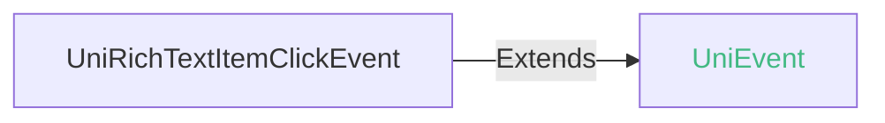

<!-- ## rich-text -->

::: sourceCode
## rich-text

> GitCode: https://gitcode.com/dcloud/uni-component/tree/alpha/uni_modules/uni-rich-text


> GitHub: https://github.com/dcloudio/uni-component/tree/alpha/uni_modules/uni-rich-text

:::

> 组件类型：UniRichTextElement 

 富文本。可渲染文字样式、图片、超链接。支持部分HTML标签


### 兼容性
| Web | 微信小程序 | Android | iOS | HarmonyOS | HarmonyOS(Vapor) |
| :- | :- | :- | :- | :- | :- |
| 4.0 | 4.41 | 3.9 | 4.11 | 4.61 | 5.0 |


### 支持的HTML标签和属性
|HTML   |属性    |样式   |
|-------|-------|-------|
|br     |       |       |
|p      |       |text-align color background-color text-decoration|
|ul     |       |       |
|li     |       |text-align color background-color text-decoration|
|span   |       |color background-color text-decoration|
|strong |       |       |
|i      |       |       |
|big    |       |       |
|small  |       |       |
|a      |href   |       |
|u      |       |       |
|del    |       |       |
|h1-h6  |       |       |
|img    |src    |       |

> text-decoration仅支持line-through
> 仅在 app-android 平台配置 mode=native 时受上述表格限制

### 属性 
| 名称 | 类型 | 默认值 | 兼容性 | 描述 |
| :- | :- | :- |  :-: | :- |
| nodes | array \| string | - | Web: 4.0; 微信小程序: 4.41; Android: 3.9; iOS: 4.11; HarmonyOS: 4.61; HarmonyOS(Vapor): 5.0 | 节点列表 \| HTML String |
| selectable | boolean | false | Web: 4.0; 微信小程序: 4.41; Android: 3.9; iOS: 4.11; HarmonyOS: 4.61; HarmonyOS(Vapor): 5.0 | 文本是否可选 |
| mode | string | "web" | Web: x; 微信小程序: x; Android: 4.71; iOS: x; HarmonyOS: x; HarmonyOS(Vapor): x | 渲染模式 |
| space | string | - | Web: x; 微信小程序: 4.41; Android: x; iOS: x; HarmonyOS: x; HarmonyOS(Vapor): - | *(string)*<br/>显示连续空格 |
| ~~user-select~~ | boolean | - | Web: x; 微信小程序: 4.41; Android: x; iOS: x; HarmonyOS: x; HarmonyOS(Vapor): - | *(boolean)*<br/>文本是否可选，该属性会使节点显示为 block。已废弃，请使用 selectable |
| @itemclick | (event: [UniRichTextItemClickEvent](#unirichtextitemclickevent)) => void | - | Web: 4.0; 微信小程序: x; Android: 3.9; iOS: 4.11; HarmonyOS: 4.71; HarmonyOS(Vapor): 5.0 | 拦截点击事件（只支持 a、img标签），返回img标签的src属性或a标签的href属性。event.detail={ src \| href } |

#### mode 的属性描述

| 合法值 | 兼容性 | 描述 |
| :- |  :-: | :- |
| web | Web: x; 微信小程序: x; Android: 4.71; iOS: x; HarmonyOS 系统版本: 6.0; HarmonyOS: x; HarmonyOS(Vapor): 5.0 | 使用webview渲染 |
| native | Web: x; 微信小程序: x; Android: 4.71; iOS: x; HarmonyOS 系统版本: 6.0; HarmonyOS: x; HarmonyOS(Vapor): 5.0 | 使用原生渲染 |

#### space 的属性描述

| 合法值 | 兼容性 | 描述 |
| :- |  :-: | :- |
| ensp | Web: x; 微信小程序: 4.41; Android: x; iOS: x; HarmonyOS: x; HarmonyOS(Vapor): x | 中文字符空格一半大小 |
| emsp | Web: x; 微信小程序: 4.41; Android: x; iOS: x; HarmonyOS: x; HarmonyOS(Vapor): - | 中文字符空格大小 |
| nbsp | Web: x; 微信小程序: 4.41; Android: x; iOS: x; HarmonyOS: x; HarmonyOS(Vapor): - | 根据字体设置的空格大小 |

### 节点列表数据结构
``` json
{
    name: "p", // 标签名
    attrs: {
        style: "color: red;" // 样式
    },
    children: [ // 子节点
        {
            text: "hello uni-app x" // 文本节点
        },
        {
            name: "img", // img 标签
            attrs: {
                src: "https://web-ext-storage.dcloud.net.cn/uni-app-x/logo.ico",
                width: "100",
                height: "100"
            }
        },
        {
            name: "a", // a 标签
            attrs: {
                href: "https://www.dcloud.io"
            }
        }
    ]
}
```


### 事件
#### UniRichTextItemClickEvent


##### UniRichTextItemClickEvent 的属性值
| 名称 | 类型 | 必填 | 默认值 | 兼容性 | 描述 |
| :- | :- | :- | :- |  :-: | :- |
| detail | **UniRichTextItemClickEventDetail** | 是 | - | - |  |

#### detail 的属性描述

| 名称 | 类型 | 必备 | 默认值 | 兼容性 | 描述 |
| :- | :- | :- | :- |  :-: | :- |
| src | string | 否 | - | - | \图片链接 |
| href | string | 否 | - | - | \<a/>超链接 |


<!-- UTSCOMJSON.rich-text.component_type-->

### 子组件 @children-tags
不可以嵌套组件

### 示例
示例为[hello uni-app x alpha分支](https://gitcode.com/dcloud/hello-uni-app-x/blob/prod_alpha/pages/component/rich-text/rich-text.uvue)，与最新HBuilderX Alpha版同步。与最新正式版同步的master分支示例[另见](https://gitcode.com/dcloud/hello-uni-app-x/blob/master//pages/component/rich-text/rich-text.uvue) 
::: preview https://hellouniappx.dcloud.net.cn/web/#/pages/component/rich-text/rich-text

> appRedirect https://hellouniappx.dcloud.net.cn/appredirect.html?path=pages/component/rich-text/rich-text

>示例
```vue
<template>
  <!-- #ifdef APP -->
  <scroll-view style="flex: 1;">
  <!-- #endif -->
		<view class="uni-padding-wrap uni-common-mt">
      <navigator url="/pages/component/rich-text/rich-text-tags" class="uni-btn-v">
        <button>rich-text渲染单个HTML标签示例</button>
      </navigator>
      <navigator url="/pages/component/rich-text/rich-text-complex" class="uni-btn-v">
        <button>rich-text渲染复杂HTML示例</button>
      </navigator>
      <navigator url="/pages/template/long-rich-text/long-rich-text" class="uni-btn-v">
        <button class="uni-btn">组件性能测试</button>
      </navigator>
      <!-- #ifdef APP-HARMONY || WEB -->
      <navigator url="/pages/component/rich-text/rich-text-test-cases" class="uni-btn-v">
        <button class="uni-btn">rich-text测试用例</button>
      </navigator>
      <!-- #endif -->
			<view class="uni-title">
				<button type="default" @click="changeText">修改文本内容</button>
			</view>
			<view class="uni-title">
				<button type="default" @click="changeFontSize">切换 font-size ({{ data.currentFontSize }})</button>
			</view>
			<view class="uni-title">
				<button type="default" @click="changeLineHeight">切换 line-height ({{ data.currentLineHeight }})</button>
			</view>
			<view class="uni-title">
				<button type="default" @click="changeFontFamily">切换 font-family ({{ data.currentFontFamily }})</button>
			</view>
			<view class="text-box" id="rich-text-parent" @click="richTextParentClick">
				<rich-text id='rich-text' :style="data.richTextStyle" :nodes="data.text" mode="native">
				</rich-text>
				<view>
					<text>rich-text-parent</text>
					<text id='rich-text-str'>{{ data.richTextStr }}</text>
				</view>
			</view>
			<view class="uni-title">
				<text class="uni-subtitle-text">selectable</text>
			</view>
			<view class="text-box2">
				<rich-text style="height: 80px;" :selectable="true" :nodes="data.text"></rich-text>
			</view>
		</view>
  <!-- #ifdef APP -->
  </scroll-view style="flex: 1;">
  <!-- #endif -->
	<rich-text v-if="data.autoTest" id="test-rich-text" :nodes="data.testNodes" :selectable="true"
		@itemclick="itemClickForTest" style="position: fixed;width: 100px;height: 100px;"></rich-text>
</template>

<script setup lang="uts">
	type DataType = {
		text : string;
		richTextHeight : number;
		richTextElement : UniElement | null;
		autoTest : boolean;
		testNodes : string;
		isItemClickTrigger : boolean;
		richTextStr : boolean;
		richTextStyle : string;
		currentFontSize : string;
		currentLineHeight : string;
		currentFontFamily : string;
		fontSizeIndex : number;
		lineHeightIndex : number;
		fontFamilyIndex : number;
	}
	// 定义各属性的可选值
	const fontSizeList : string[] = ["默认", "12px", "16px", "20px", "24px", "32px"]
	const lineHeightList : string[] = ["默认", "1", "1.5", "2", "2.5", "3"]
	const fontFamilyList : string[] = ["默认", "serif", "sans-serif", "monospace", "cursive"]

	// 使用reactive避免ref数据在自动化测试中无法访问
	const data = reactive({
		text: "<span>hello uni-app x!</span><br/><span>uni-app x，终极跨平台方案</span>",
		richTextHeight: 0,
		richTextElement: null,
		// 自动化测试
		autoTest: false,
		testNodes: '</img>',
		isItemClickTrigger: false,
		richTextStr: false,
		richTextStyle: "border: 1px; border-style: solid; border-color: red;",
		currentFontSize: "默认",
		currentLineHeight: "默认",
		currentFontFamily: "默认",
		fontSizeIndex: 0,
		lineHeightIndex: 0,
		fontFamilyIndex: 0
	} as DataType)

	const updateRichTextHeight = () => {
		if (data.richTextElement != null) {
			data.richTextElement!.getBoundingClientRectAsync()!.then((elRect : DOMRect) => {
				data.richTextHeight = elRect.height
				console.log('richTextHeight:', data.richTextHeight)
			})
		}
	}

	onReady(() => {

		data.richTextElement = uni.getElementById('rich-text') as UniElement
		console.log("onReady  加载完成，richTextElement= ", data.richTextElement?.tagName)
		setTimeout(() => {
			updateRichTextHeight()
		}, 2500)
	})

	const changeText = () => {
		if (data.text === "<span>hello uni-app x!</span><br/><span>uni-app x，终极跨平台方案</span>") {
			data.text = "<h1>hello uni-app x!</h1><br/><h2>uni-app x，终极跨平台方案</h2>"
		} else {
			data.text = "<span>hello uni-app x!</span><br/><span>uni-app x，终极跨平台方案</span>"
		}
    nextTick(() => {
      setTimeout(() => {
      	console.log("修改文本内容: ", data.text)

      	updateRichTextHeight()
      }, 1000)
    })
	}

	// 更新组合样式
	const updateRichTextStyle = () => {
		let style = "border: 1px; border-style: solid; border-color: red;"
		if (data.currentFontSize != "默认") {
			style += " font-size: " + data.currentFontSize + ";"
		}
		if (data.currentLineHeight != "默认") {
			style += " line-height: " + data.currentLineHeight + ";"
		}
		if (data.currentFontFamily != "默认") {
			style += " font-family: " + data.currentFontFamily + ";"
		}
		data.richTextStyle = style
		console.log("更新样式:", data.richTextStyle)
	}

	const changeFontSize = () => {
		data.fontSizeIndex = (data.fontSizeIndex + 1) % fontSizeList.length
		data.currentFontSize = fontSizeList[data.fontSizeIndex]
		console.log("切换 font-size:", data.currentFontSize)
		updateRichTextStyle()
	}

	const changeLineHeight = () => {
		data.lineHeightIndex = (data.lineHeightIndex + 1) % lineHeightList.length
		data.currentLineHeight = lineHeightList[data.lineHeightIndex]
		console.log("切换 line-height:", data.currentLineHeight)
		updateRichTextStyle()
	}

	const changeFontFamily = () => {
		data.fontFamilyIndex = (data.fontFamilyIndex + 1) % fontFamilyList.length
		data.currentFontFamily = fontFamilyList[data.fontFamilyIndex]
		console.log("切换 font-family:", data.currentFontFamily)
		updateRichTextStyle()
	}

	// 自动化测试
	const itemClickForTest = (_ : UniRichTextItemClickEvent) => {
		data.isItemClickTrigger = true;
	}

	const getBoundingClientRectForTest = () : DOMRect => {
		return uni.getElementById('test-rich-text')?.getBoundingClientRect()!;
	}

	const richTextParentClick = () => {
		data.richTextStr = true;
	}

	defineExpose({
		data,
		changeText,
		changeFontSize,
		changeLineHeight,
		changeFontFamily,
		getBoundingClientRectForTest
	})
</script>

<style>
	.text-box {
		padding: 20px 0;
		background-color: white;
	}

	.text-box2 {
		top: 20px;
		background-color: white;
	}
</style>

```

:::


### 参见
- [相关 Bug](https://issues.dcloud.net.cn/?mid=component.basic-content.rich-text)
- [参见uni-app相关文档](https://uniapp.dcloud.io/component/rich-text.html)
- [微信小程序文档](https://developers.weixin.qq.com/miniprogram/dev/component/rich-text.html)
- [支付宝小程序文档](https://open.alipay.com/portal/zhichi/search?keyword=rich-text&pageIndex=1&pageSize=10&source=doc_top&type=all)
- [百度小程序文档](https://smartprogram.baidu.com/forum/search?query=rich-text&scope=devdocs&source=docs)
- [抖音小程序文档](https://developer.open-douyin.com/search-page?keyword=rich-text&secondType=all&type=1)
- [飞书小程序文档](https://open.feishu.cn/search?from=header&page=1&pageSize=10&q=rich-text&topicFilter=)
- [钉钉小程序文档](https://open.dingtalk.com/search?keyword=rich-text)
- [QQ小程序文档](https://q.qq.com/wiki/develop/miniprogram/frame/)
- [快手小程序文档](https://developers.kuaishou.com/page?keyword=rich-text&from=docs)
- [京东小程序文档](https://mp-docs.jd.com/doc/dev/framework/-1)
- [华为快应用文档](https://developer.huawei.com/consumer/cn/doc/quickApp-References/webview-frame-overview-0000001124793625)
- [360小程序文档](https://mp.360.cn/doc/miniprogram/dev/#/b770a184ff1f06c6b3393a0fd1132380)

## 富文本显示的可选方案

rich-text组件是一个比较重的组件，需要注意适用场景。

- rich-text组件适合cms系统编排的、大量使用html能力的富文本文章显示
- rich-text不支持video组件，如果涉及video，需拆分文本内容，在video前后各放置一个rich-text组件

其他替代方案：
- 简单的、不同风格文字排布，应该仅使用text组件，必要时也可以使用text组件嵌套text组件
- 简单的图文混拍，用image组件+text组件拼接可以实现的，没必要使用rich-text组件
- 自行解析node节点，动态拼接text、image、video等原生组件，也是一种方案，类似小程序领域的mp-html插件。可自行在插件市场搜索是否有这类插件
- 原生markdown渲染：官方提供了markdown解析，动态拼接原生组件的方案，在[uni-ai x开源项目](https://ext.dcloud.net.cn/plugin?id=23902)中可以体验

## 调整历史@change
在4.7版以前，Android是原生实现rich-text，但与web规范拉齐度较低；iOS使用的是web-view；鸿蒙使用的是系统的rich-text，但该rich-text也是基于web-view实现且有细节问题。

从uni-app x4.7+，3个App平台统一使用web-view实现。鸿蒙平台直接替换了之前的实现，而Android平台则新增了mode属性配置，默认是web-view实现，但也可以通过mode=native继续使用之前的原生方式。

从5.0版本开始，鸿蒙平台新增支持原生实现的 rich-text。鸿蒙平台新增支持了 mode 属性配置，默认是 `web-view` 实现，可以通过设置 `mode=native` 使用原生方式。

## Bug & Tips@tips

- App-Android 平台且 mode=native 时，HTML String 类型的``不支持自定义宽高，默认以 rich-text 组件宽度为基准等比缩放；节点列表类型的``支持自定义宽高。
- App-Harmony 平台且 mode=native 时，暂不支持 `selectable` 属性。 
