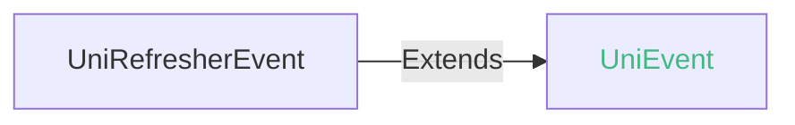
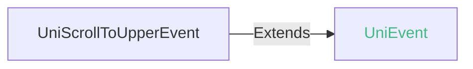
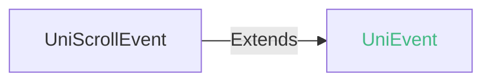
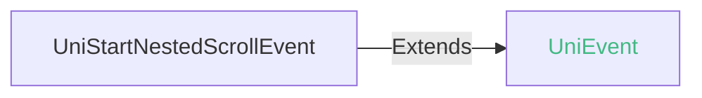
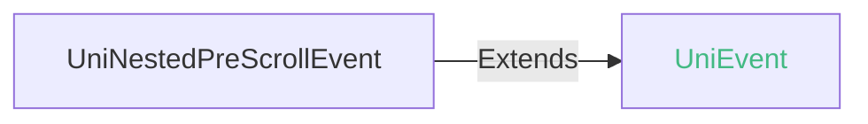
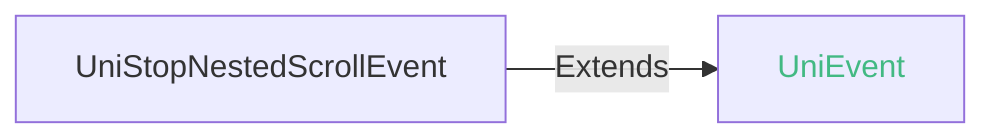

<!-- ## scroll-view -->

::: sourceCode
## scroll-view
:::

> 组件类型：UniScrollViewElement 

 可滚动视图容器


### 兼容性
| Web | 微信小程序 | Android | iOS | HarmonyOS | HarmonyOS(Vapor) |
| :- | :- | :- | :- | :- | :- |
| 4.0 | 4.41 | 3.9 | 4.11 | 4.61 | 5.0 |


### 属性 
| 名称 | 类型 | 默认值 | 兼容性 | 描述 |
| :- | :- | :- |  :-: | :- |
| type | string | - | Web: x; 微信小程序: x; Android: 4.11; iOS: 4.11; HarmonyOS: 4.61; HarmonyOS(Vapor): 5.0 | 渲染模式，用于支持使用 nested-scroll-header、nested-scroll-body 实现嵌套滚动 |
| direction | string | "vertical" | Web: 4.0; 微信小程序: 4.41; Android: 4.0; iOS: 4.11; HarmonyOS: 4.61; HarmonyOS(Vapor): 5.0 | 滚动方向，可取值 none、all、horizontal、vertical，默认值vertical |
| ~~scroll-x~~ | boolean | false | Web: 4.0; 微信小程序: 4.41; Android: 3.9; iOS: x; HarmonyOS: x; HarmonyOS(Vapor): x | 允许横向滚动，不支持同时设置scroll-y属性为true，同时设置true时scroll-y生效。已废弃，请改用direction |
| ~~scroll-y~~ | boolean | true | Web: 4.0; 微信小程序: 4.41; Android: 3.9; iOS: x; HarmonyOS: x; HarmonyOS(Vapor): x | 允许竖向滚动，不支持同时设置scroll-x属性为true，同时设置true时scroll-y生效。已废弃，请改用direction |
| ~~rebound~~ | boolean | true | Web: -; 微信小程序: x; Android: 3.9; iOS: x; HarmonyOS: x; HarmonyOS(Vapor): x | 是否开启回弹效果。已废弃，请改用bounces |
| associative-container | string | - | Web: x; 微信小程序: x; Android: 4.11; iOS: 4.11; HarmonyOS: 4.61; HarmonyOS(Vapor): 5.0 | 关联的滚动容器 |
| enable-back-to-top | boolean | false | Web: x; 微信小程序: x; Android: x; iOS: 4.11; HarmonyOS: x; HarmonyOS(Vapor): 5.0 | 点击系统状态栏滚动条返回顶部，只支持竖向 |
| bounces | boolean | true | Web: x; 微信小程序: 4.41; Android: 4.0; iOS: 4.11; HarmonyOS: 4.61; HarmonyOS(Vapor): 5.0 | 是否开启回弹效果 优先级高于rebound |
| upper-threshold | number | 50 | Web: 4.0; 微信小程序: 4.41; Android: 3.9; iOS: 4.11; HarmonyOS: 4.61; HarmonyOS(Vapor): 5.0 | 距顶部/左边多远时（单位px），触发 scrolltoupper 事件 |
| lower-threshold | number | 50 | Web: 4.0; 微信小程序: 4.41; Android: 3.9; iOS: 4.11; HarmonyOS: 4.61; HarmonyOS(Vapor): 5.0 | 距底部/右边多远时（单位px），触发 scrolltolower 事件 |
| scroll-top | number | 0 | Web: 4.0; 微信小程序: 4.41; Android: 3.9; iOS: 4.11; HarmonyOS: 4.61; HarmonyOS(Vapor): 5.0 | 设置竖向滚动条位置 |
| scroll-left | number | 0 | Web: 4.0; 微信小程序: 4.41; Android: 3.9; iOS: 4.11; HarmonyOS: 4.61; HarmonyOS(Vapor): 5.0 | 设置横向滚动条位置 |
| scroll-into-view | string([string.IDString](/uts/data-type.md#ide-string)) | - | Web: 4.0; 微信小程序: 4.41; Android: 3.9; iOS: 4.11; HarmonyOS: 4.61; HarmonyOS(Vapor): 5.0 | 值应为某子元素id（id不能以数字开头）。设置哪个方向可滚动，则在哪个方向滚动到该元素起始位置 |
| scroll-with-animation | boolean | false | Web: 4.0; 微信小程序: 4.41; Android: 3.9; iOS: 4.11; HarmonyOS: 4.61; HarmonyOS(Vapor): 5.0 | 是否在设置滚动条位置时使用滚动动画，设置false没有滚动动画 |
| refresher-enabled | boolean | false | Web: 4.11; 微信小程序: 4.41; Android: 3.9; iOS: 4.11; HarmonyOS: 4.61; HarmonyOS(Vapor): 5.0 | 开启下拉刷新，暂时不支持scroll-x = true横向刷新 |
| refresher-threshold | number | 45 | Web: 4.11; 微信小程序: 4.41; Android: 3.9; iOS: 4.11; HarmonyOS: 4.61; HarmonyOS(Vapor): 5.0 | 设置下拉刷新阈值 |
| refresher-max-drag-distance | number | - | Web: x; 微信小程序: x; Android: 3.9; iOS: 4.11; HarmonyOS: 4.61; HarmonyOS(Vapor): 5.0 | 设置下拉最大拖拽距离（单位px），默认是下拉刷新控件高度的2.5倍 |
| refresher-default-style | string | "black" | Web: 4.11; 微信小程序: 4.41; Android: 3.9; iOS: 4.11; HarmonyOS: 4.61; HarmonyOS(Vapor): 5.0 | 设置下拉刷新默认样式，支持设置 black \| white \| none， none 表示不使用默认样式 |
| refresher-background | string([string.ColorString](/uts/data-type.md#ide-string)) | "transparent" | Web: 4.11; 微信小程序: 4.41; Android: 3.9; iOS: 4.11; HarmonyOS: 4.61; HarmonyOS(Vapor): 5.0 | 设置下拉刷新区域背景颜色，默认透明 |
| refresher-triggered | boolean | false | Web: 4.11; 微信小程序: 4.41; Android: 3.9; iOS: 4.11; HarmonyOS: 4.61; HarmonyOS(Vapor): 5.0 | 设置当前下拉刷新状态，true 表示下拉刷新已经被触发，false 表示下拉刷新未被触发 |
| show-scrollbar | boolean | true | Web: 4.0; 微信小程序: 4.41; Android: 3.9; iOS: 4.11; HarmonyOS: 4.61; HarmonyOS(Vapor): 5.0 | 控制是否出现滚动条 |
| custom-nested-scroll | boolean | false | Web: x; 微信小程序: x; Android: 3.9; iOS: x; HarmonyOS: x; HarmonyOS(Vapor): x | 子元素是否开启嵌套滚动 将滚动事件与父元素协商处理 |
| nested-scroll-child | string([string.IDString](/uts/data-type.md#ide-string)) | "" | Web: x; 微信小程序: x; Android: 3.97; iOS: x; HarmonyOS: x; HarmonyOS(Vapor): x | 嵌套滚动子元素的id属性，不支持ref，scroll-view惯性滚动时会让对应id元素视图进行滚动，子元素滚动时会触发scroll-view的nestedprescroll事件，嵌套子元素需要设置custom-nested-scroll = true |
| enable-passive | boolean | - | Web: x; 微信小程序: 4.41; Android: x; iOS: x; HarmonyOS: x; HarmonyOS(Vapor): x | *(boolean)*<br/>开启 passive 特性，能优化一定的滚动性能 |
| fast-deceleration | boolean | - | Web: x; 微信小程序: 4.41; Android: x; iOS: x; HarmonyOS: x; HarmonyOS(Vapor): x | *(boolean)*<br/>滑动减速速率控制, 仅在 iOS 下生效 (同时开启 enhanced 属性后生效) |
| @refresherpulling | (event: [UniRefresherEvent](#unirefresherevent)) => void | - | Web: 4.11; 微信小程序: 4.41; Android: 3.9; iOS: 4.11; HarmonyOS: 4.61; HarmonyOS(Vapor): 5.0 | 下拉刷新控件被下拉 |
| @refresherrefresh | (event: [UniRefresherEvent](#unirefresherevent)) => void | - | Web: 4.11; 微信小程序: 4.41; Android: 3.9; iOS: 4.11; HarmonyOS: 4.61; HarmonyOS(Vapor): 5.0 | 下拉刷新被触发 |
| @refresherrestore | (event: [UniRefresherEvent](#unirefresherevent)) => void | - | Web: 4.11; 微信小程序: 4.41; Android: 3.9; iOS: 4.11; HarmonyOS: 4.61; HarmonyOS(Vapor): 5.0 | 下拉刷新被复位 |
| @refresherabort | (event: [UniRefresherEvent](#unirefresherevent)) => void | - | Web: x; 微信小程序: 4.41; Android: 3.9; iOS: 4.11; HarmonyOS: 4.61; HarmonyOS(Vapor): 5.0 | 下拉刷新被中止 |
| @scrolltoupper | (event: [UniScrollToUpperEvent](#uniscrolltoupperevent)) => void | - | Web: 4.0; 微信小程序: 4.41; Android: 3.9; iOS: 4.11; HarmonyOS: 4.61; HarmonyOS(Vapor): 5.0 | 滚动到顶部/左边，会触发 scrolltoupper 事件 |
| @scrolltolower | (event: [UniScrollToLowerEvent](#uniscrolltolowerevent)) => void | - | Web: 4.0; 微信小程序: 4.41; Android: 3.9; iOS: 4.11; HarmonyOS: 4.61; HarmonyOS(Vapor): 5.0 | 滚动到底部/右边，会触发 scrolltolower 事件 |
| @scroll | (event: [UniScrollEvent](#uniscrollevent)) => void | - | Web: 4.0; 微信小程序: 4.41; Android: 3.9; iOS: 4.11; HarmonyOS: 4.61; HarmonyOS(Vapor): 5.0 | 滚动时触发，event.detail = {scrollLeft, scrollTop, scrollHeight, scrollWidth, deltaX, deltaY} |
| @scrollend | (event: [UniScrollEvent](#uniscrollevent)) => void | - | Web: x; 微信小程序: 4.41; Android: 3.9; iOS: 4.11; HarmonyOS: 4.61; HarmonyOS(Vapor): 5.0 | 滚动结束时触发，event.detail = {scrollLeft, scrollTop, scrollHeight, scrollWidth, deltaX, deltaY} |
| @startnestedscroll | (event: [UniStartNestedScrollEvent](#unistartnestedscrollevent)) => Boolean | - | Web: x; 微信小程序: x; Android: 3.9; iOS: x; HarmonyOS: x; HarmonyOS(Vapor): x | 子元素开始滚动时触发, return true表示与子元素开启滚动协商 默认return false! event = {node} |
| @nestedprescroll | (event: [UniNestedPreScrollEvent](#uninestedprescrollevent)) => void | - | Web: x; 微信小程序: x; Android: 3.9; iOS: x; HarmonyOS: x; HarmonyOS(Vapor): x | 子元素滚动时触发，可执行event.consumed(x,y)告知子元素deltaX、deltaY各消耗多少。子元素将执行差值后的deltaX、deltaY滚动距离。不执行consumed(x,y)则表示父元素不消耗deltaX、deltaY。event = {deltaX, deltaY} |
| @stopnestedscroll | (event: [UniStopNestedScrollEvent](#unistopnestedscrollevent)) => void | - | Web: x; 微信小程序: x; Android: 3.9; iOS: x; HarmonyOS: x; HarmonyOS(Vapor): x | 子元素滚动结束或意外终止时触发 |
| @dragstart | eventhandle | - | Web: x; 微信小程序: 4.41; Android: x; iOS: x; HarmonyOS: x; HarmonyOS(Vapor): x | *(eventhandle)*<br/>滑动开始事件 (同时开启 enhanced 属性后生效) detail { scrollTop, scrollLeft } |
| @dragging | eventhandle | - | Web: x; 微信小程序: 4.41; Android: x; iOS: x; HarmonyOS: x; HarmonyOS(Vapor): x | *(eventhandle)*<br/>滑动事件 (同时开启 enhanced 属性后生效) detail { scrollTop, scrollLeft } |
| @dragend | eventhandle | - | Web: x; 微信小程序: 4.41; Android: x; iOS: x; HarmonyOS: x; HarmonyOS(Vapor): x | *(eventhandle)*<br/>滑动结束事件 (同时开启 enhanced 属性后生效) detail { scrollTop, scrollLeft, velocity } |

#### type 的属性描述

| 合法值 | 兼容性 | 描述 |
| :- |  :-: | :- |
| nested | Web: x; 微信小程序: x; Android: 4.11; iOS: 4.11; HarmonyOS: 4.61; HarmonyOS(Vapor): 5.0 | 嵌套模式。用于处理父子 scroll-view 间的嵌套滚动，此时子节点只能是 nested-scroll-header nested-scroll-body 组件或自定义 refresher |

#### direction 的属性描述

| 合法值 | 兼容性 | 描述 |
| :- |  :-: | :- |
| none | Web: 4.0; 微信小程序: -; Android: 4.0; iOS: 4.11; HarmonyOS: 4.61; HarmonyOS(Vapor): 5.0 | 禁止滚动 |
| all | Web: 4.0; 微信小程序: -; Android: x; iOS: x; HarmonyOS: 4.61; HarmonyOS(Vapor): 5.0 | 横向/竖向可同时滚动 |
| horizontal | Web: 4.0; 微信小程序: -; Android: 4.0; iOS: 4.11; HarmonyOS: 4.61; HarmonyOS(Vapor): 5.0 | 横向滚动 |
| vertical | Web: 4.0; 微信小程序: -; Android: 4.0; iOS: 4.11; HarmonyOS: 4.61; HarmonyOS(Vapor): 5.0 | 竖向滚动 |

#### associative-container 的属性描述

| 合法值 | 兼容性 | 描述 |
| :- |  :-: | :- |
| nested-scroll-view | Web: x; 微信小程序: x; Android: 4.11; iOS: 4.11; HarmonyOS: 4.61; HarmonyOS(Vapor): 5.0 | 关联 type=nested 嵌套模式 |

#### refresher-default-style 的属性描述

| 合法值 | 兼容性 | 描述 |
| :- |  :-: | :- |
| black | Web: 4.11; 微信小程序: 4.41; Android: 3.9; iOS: 4.11; HarmonyOS: 4.61; HarmonyOS(Vapor): x | 深颜色雪花样式 |
| white | Web: 4.11; 微信小程序: 4.41; Android: 3.9; iOS: 4.11; HarmonyOS: 4.61; HarmonyOS(Vapor): x | 浅白色雪花样式 |
| none | Web: 4.11; 微信小程序: 4.41; Android: 3.9; iOS: 4.11; HarmonyOS: 4.61; HarmonyOS(Vapor): 5.0 | 不使用默认样式 |


### 事件
#### UniRefresherEvent


##### UniRefresherEvent 的属性值
| 名称 | 类型 | 必填 | 默认值 | 兼容性 | 描述 |
| :- | :- | :- | :- |  :-: | :- |
| detail | **UniRefresherEventDetail** | 是 | - | - | - |

#### detail 的属性描述

| 名称 | 类型 | 必备 | 默认值 | 兼容性 | 描述 |
| :- | :- | :- | :- |  :-: | :- |
| dy | number | 是 | - | - | - |


#### UniScrollToUpperEvent


##### UniScrollToUpperEvent 的属性值
| 名称 | 类型 | 必填 | 默认值 | 兼容性 | 描述 |
| :- | :- | :- | :- |  :-: | :- |
| detail | **UniScrollToUpperEventDetail** | 是 | - | - |  |

#### detail 的属性描述

| 名称 | 类型 | 必备 | 默认值 | 兼容性 | 描述 |
| :- | :- | :- | :- |  :-: | :- |
| direction | string | 是 | - | - | 滚动方向 top 或 left |


#### UniScrollToLowerEvent


##### UniScrollToLowerEvent 的属性值
| 名称 | 类型 | 必填 | 默认值 | 兼容性 | 描述 |
| :- | :- | :- | :- |  :-: | :- |
| detail | **UniScrollToLowerEventDetail** | 是 | - | - |  |

#### detail 的属性描述

| 名称 | 类型 | 必备 | 默认值 | 兼容性 | 描述 |
| :- | :- | :- | :- |  :-: | :- |
| direction | string | 是 | - | - | 滚动方向 bottom 或 right |


#### UniScrollEvent


##### UniScrollEvent 的属性值
| 名称 | 类型 | 必填 | 默认值 | 兼容性 | 描述 |
| :- | :- | :- | :- |  :-: | :- |
| detail | **UniScrollEventDetail** | 是 | - | - |  |

#### detail 的属性描述

| 名称 | 类型 | 必备 | 默认值 | 兼容性 | 描述 |
| :- | :- | :- | :- |  :-: | :- |
| scrollTop | number | 是 | - | - | 竖向滚动的距离 |
| scrollLeft | number | 是 | - | - | 横向滚动的距离 |
| scrollHeight | number | 是 | - | - | 滚动区域的高度 |
| scrollWidth | number | 是 | - | - | 滚动区域的宽度 |
| deltaY | number | 是 | - | - | 当次滚动事件竖向滚动量 |
| deltaX | number | 是 | - | - | 当次滚动事件横向滚动量 |


#### UniStartNestedScrollEvent


##### UniStartNestedScrollEvent 的属性值
| 名称 | 类型 | 必填 | 默认值 | 兼容性 | 描述 |
| :- | :- | :- | :- |  :-: | :- |
| node | [UniElement](/api/dom/unielement.md) | 是 | - | - | 开始滚动子节点对象 |
| isTouch | boolean | 是 | - | Web: -; 微信小程序: -; Android: 3.99; iOS: x; HarmonyOS: -; HarmonyOS(Vapor): - | 是否由触摸行为发生的Event |


#### UniNestedPreScrollEvent


##### UniNestedPreScrollEvent 的属性值
| 名称 | 类型 | 必填 | 默认值 | 兼容性 | 描述 |
| :- | :- | :- | :- |  :-: | :- |
| deltaX | number | 是 | - | - | x轴滚动距离 |
| deltaY | number | 是 | - | - | y轴滚动距离 |
| isTouch | boolean | 是 | - | Web: -; 微信小程序: -; Android: 3.99; iOS: x; HarmonyOS: -; HarmonyOS(Vapor): - | 是否由触摸行为发生的Event |


##### UniNestedPreScrollEvent 的方法
| 名称 | 类型 | 必填 | 默认值 | 兼容性 | 描述 |
| :- | :- | :- | :- |  :-: | :- |
| consumed | (consumedX: number, consumedY: number) => void | 是 | - | - | 通知到子节点x,y轴滚动距离的消耗 |

#### UniStopNestedScrollEvent


##### UniStopNestedScrollEvent 的属性值
| 名称 | 类型 | 必填 | 默认值 | 兼容性 | 描述 |
| :- | :- | :- | :- |  :-: | :- |
| isTouch | boolean | 是 | - | - | 是否由触摸行为发生的Event |


<!-- UTSCOMJSON.scroll-view.component_type-->

### 自定义下拉刷新样式

1. 设置`refresher-default-style`属性为 none 不使用默认样式
2. 自定义下拉刷新元素必须要声明为 slot="refresher"，需要设置刷新元素宽高信息否则可能无法正常显示！
3. 通过组件提供的refresherpulling、refresherrefresh、refresherrestore、refresherabort下拉刷新事件调整自定义下拉刷新元素！实现预期效果

**注意：**
- 安卓、iOS平台目前自定义下拉刷新元素不支持放在scroll-view的首个子元素位置上。可能无法正常显示
- 鸿蒙平台自定义下拉刷新元素要放在最后一个子元素的位置，否则顶部可能出现空白区域

```vue
<scroll-view refresher-default-style="none" :refresher-enabled="true" :refresher-triggered="refresherTriggered"
			 @refresherpulling="onRefresherpulling" @refresherrefresh="onRefresherrefresh"
			 @refresherrestore="onRefresherrestore" style="flex:1" >

		<view v-for="i in 20" class="content-item">
			<text class="text">item-{{i}}</text>
		</view>

		<!-- 自定义下拉刷新元素 -->
		<view slot="refresher" class="refresh-box">
			<text class="tip-text">{{text[state]}}</text>
		</view>

</scroll-view>
```

**具体代码请参考：**[自定义下拉刷新样式示例](https://gitcode.com/dcloud/hello-uni-app-x/blob/alpha/pages/component/scroll-view/scroll-view-custom-refresher-props.uvue)

### 嵌套模式@nested-scroll-view

当存在两个 scroll-view 相互嵌套的场景时，两者滚动存在冲突不能很丝滑的进行衔接，可将外层 scroll-view 改成嵌套模式，这样可以让两个 scroll-view 的滚动衔接起来。

```html
<scroll-view style="flex:1" type="nested">
	<nested-scroll-header>
		<view style="height: 200px;background-color: #66ccff;align-items: center;justify-content: center;">
			<text>nested-scroll-header</text>
		</view>
	</nested-scroll-header>
	<nested-scroll-body>
		<view style="flex:1">
			<scroll-view style="flex:1" associative-container="nested-scroll-view">
				<view v-for="index in 20" style="background-color: aliceblue; height: 80px;justify-content: center;">
					<text style="color: black;">{{index}}</text>
				</view>
			</scroll-view>
		</view>
	</nested-scroll-body>
</scroll-view>
```

**开启嵌套模式设置如下：**

1. 设置外层 scroll-view 的 type 属性为 "nested" ，将外层 scroll-view 改成嵌套模式
2. 设置内层 scroll-view 的 `associative-container` 属性为 "nested-scroll-view"，开启内层 scroll-view 支持与外层 scroll-view 嵌套滚动

**嵌套滚动策略：**

当向下滚动（手指向上滑动）时，先滚动外层 scroll-view 再滚动内层 scroll-view；当向上滚动（手指向下滑动）时，先滚动内层 scroll-view 再滚动外层 scroll-view

**注意事项：**
+ 4.11版本开始支持嵌套模式
+ 外层 scroll-view 的子节点只支持`nested-scroll-header`和`nested-scroll-body`和自定义 refresher
+ 外层 scroll-view 的子节点中只能有一个 `nested-scroll-body`
+ `nested-scroll-header` 和 `nested-scroll-body` 只能有一个子节点
+ `nested-scroll-header` 只能渲染在 `nested-scroll-body` 上面
+ 与nested-scroll嵌套滚动协商互不兼容，`nested-scroll-header` 和 `nested-scroll-body`优先级高于nested-scroll嵌套滚动协商
+ 内层滚动视图支持 scroll-view、list-view、waterflow

**具体代码请参考：**[嵌套模式示例](https://gitcode.com/dcloud/hello-uni-app-x/blob/alpha/pages/template/long-list-nested/long-list-nested.uvue)

### nested-scroll嵌套滚动协商@nested

嵌套滚动是原生才有的概念，web没有。

它是指父子2个滚动容器嵌套，在滚动时可以互相协商，控制父容器怎么滚、子容器怎么滚。

1. 通过在子滚动容器设置`custom-nested-scroll = true`，开启与父组件实现嵌套滚动协商。仅list-view、waterflow、scroll-view组件支持与父组件嵌套滚动协商。

下面的示例代码，在一个scroll-view中嵌套了一个list-view。在list-view上设置了custom-nested-scroll="true"。

```html
<scroll-view style="height: 100%;" scroll-y="true" rebound ="false" nested-scroll-child="listview" @startnestedscroll="onStartNestedScroll" @nestedprescroll="onNestedPreScroll"
	@stopnestedscroll="onStopNestedScroll">
		...
		<view style="height: 100px;">停靠视图</view>
		<list-view id="listview"  class="child-scroll" scroll-y="true" custom-nested-scroll="true">
			...
		</list-view>
</scroll-view>
```

2. 子组件准备滚动时会触发父组件的`startnestedscroll`事件。父组件响应`startnestedscroll`事件return true则表示与子组件建立嵌套滚动协商。
```ts
onStartNestedScroll(event: StartNestedScrollEvent): Boolean {
	//开启与子组件建立嵌套滚动协商
	return true
}
```
3. 当建立嵌套滚动协商后，子组件滚动时父组件会持续收到`nestedprescroll`事件，这个事件的含义是嵌套滚动即将发生。
事件中会返回NestedPreScrollEvent子组件将要滚动的数据。
4. 父组件执行NestedPreScrollEvent.consumed(x,y)函数，告知子组件本次`nestedprescroll`事件deltaX、deltaY各消耗多少，即父组件要消费掉多少滚动距离。
子组件将执行差值后的deltaX、deltaY滚动距离，也就是剩余的滚动余量留给子组件。
```ts
onNestedPreScroll(event: NestedPreScrollEvent) {
	var deltaY = event.deltaY
	var deltaX = event.deltaX
	...
	if() {
		//告知子组件deltaX、deltaY各消耗多少
		event.consumed(x, y)
	}
}
```
5. 父组件配置`nested-scroll-child`后，父组件惯性滚动时会让`nested-scroll-child`配置的子元素进行滚动。从而触发`nestedprescroll`协商处理滚动事件
6. 滚动行为停止后会触发`stopnestedscroll`事件

**注意：**
+ 仅Android平台支持嵌套滚动协商
+ 嵌套滚动协商仅支持竖向滚动，横向滚动不支持
+ nested-scroll-child设置的元素必须配置custom-nested-scroll = true，否则配置无效
+ 与`nested-scroll-header` 和 `nested-scroll-body`不兼容，scroll-view 设置嵌套模式后，嵌套滚动手势协商相关事件将不会触发

**具体代码请参考：**[nested-scroll嵌套滚动示例](https://gitcode.com/dcloud/hello-uni-app-x/blob/alpha/pages/template/long-list/long-list.uvue)

#### App平台

+ App-Android、App-iOS平台scroll-x、scroll-y属性不支持同时设置为true, 同时设置true时仅scroll-y生效，4.0版本开始scroll-x、scroll-y已废弃，请使用direction属性。
如需同时水平和垂直滚动，可以套2层，一个横一个竖，来实现2个方向能滚动。
+ App平台scroll-view组件不支持动态切换横竖滚动方向
+ App平台scroll-view组件的overflow属性不支持配置visible
+ App平台scroll-view组件默认高度取值：
	- scroll-view组件的子元素高度之和未超过scroll-view组件的父元素高度：
		+ scroll-view组件的默认高度取值为子元素高度之和
	- scroll-view组件的子元素高度之和超过scroll-view组件的父元素高度：
		+ 3.9版本scroll-view组件默认高度取值为scroll-view组件父元素的高度。子元素高度之和超过scroll-view组件的高度，scroll-view组件可滚动。
		+ 4.0版本开始scroll-view组件的默认高度取值为子元素高度之和。
    注意：scroll-view组件的内容高度需要大于scroll-view组件的高度，才能滚动。如未给scroll-view设置高度，那么其高度默认与子内容相同，就会导致无法滚动。开发者需要设置css属性定义scroll-view组件高度，让scroll-view组件高度小于子元素高度之和，实现滚动能力。可以指定scroll-view的height，也可以设置flex:1来撑满剩余空间。

### 子组件 @children-tags
支持所有组件

### 示例
示例为[hello uni-app x alpha分支](https://gitcode.com/dcloud/hello-uni-app-x/blob/prod_alpha/pages/component/scroll-view/scroll-view.uvue)，与最新HBuilderX Alpha版同步。与最新正式版同步的master分支示例[另见](https://gitcode.com/dcloud/hello-uni-app-x/blob/master//pages/component/scroll-view/scroll-view.uvue) 
::: preview https://hellouniappx.dcloud.net.cn/web/#/pages/component/scroll-view/scroll-view

> appRedirect https://hellouniappx.dcloud.net.cn/appredirect.html?path=pages/component/scroll-view/scroll-view

>示例
```vue
<template>
  <!-- #ifdef APP -->
  <scroll-view class="page-scroll-view" :direction="data.scrollDirection">
  <!-- #endif -->
    <view>
      <page-head title="scroll-view,区域滚动视图"></page-head>
      <view class="uni-padding-wrap uni-common-mt">
        <view class="uni-title uni-common-mt">
          <text class="uni-title-text">Vertical Scroll</text>
          <text class="uni-subtitle-text">纵向滚动</text>
        </view>
        <view>
          <scroll-view :scroll-top="data.scrollTop" direction="vertical" class="scroll-Y" scroll-with-animation="true"
            @scrolltoupper="upper" @scrolltolower="lower" @scroll="scroll" @scrollend="end"
            :show-scrollbar="data.showScrollbar" id="verticalScrollView">
            <view class="scroll-view-item uni-bg-red"><text class="text">A</text></view>
            <view class="scroll-view-item uni-bg-green"><text class="text">B</text></view>
            <view class="scroll-view-item uni-bg-blue"><text class="text">C</text></view>
          </scroll-view>
        </view>
        <view @tap="goTop" class="uni-center uni-common-mt">
          <text class="uni-link">点击这里返回顶部</text>
        </view>

        <view class="uni-title uni-common-mt">
          <text class="uni-title-text">Horizontal Scroll</text>
          <text class="uni-subtitle-text">横向滚动</text>
        </view>
        <view>
          <scroll-view class="scroll-view_H" direction="horizontal" @scroll="scroll" @scrollend="end"
            :scroll-left="data.scrollLeft" :show-scrollbar="data.showScrollbar">
            <view class="scroll-view-item_H uni-bg-red"><text class="text">A</text></view>
            <view class="scroll-view-item_H uni-bg-green"><text class="text">B</text></view>
            <view class="scroll-view-item_H uni-bg-blue"><text class="text">C</text></view>
          </scroll-view>
        </view>
        <boolean-data :defaultValue="false" title="是否禁用外层scroll-view滚动" @change="change_disabled_boolean"></boolean-data>

        <text class="uni-title-text">scroll-view样式大合集</text>
        <scroll-view class="scroll-view-style-demo" direction="vertical">
          <view class="style-demo-item uni-bg-red"><text class="text">1</text></view>
          <view class="style-demo-item uni-bg-green"><text class="text">2</text></view>
          <view class="style-demo-item uni-bg-blue"><text class="text">3</text></view>
        </scroll-view>

        <navigator url="/pages/component/scroll-view/scroll-view-props" hover-class="none">
          <button type="primary" class="button">
            非下拉刷新的属性示例
          </button>
        </navigator>
        <view class="uni-common-pb"></view>

        <navigator url="/pages/component/scroll-view/scroll-view-refresher-props" hover-class="none">
          <button type="primary" class="button">
            下拉刷新的属性示例
          </button>
        </navigator>
        <view class="uni-common-pb"></view>
        <navigator url="/pages/component/scroll-view/scroll-view-refresher" hover-class="none">
          <button type="primary" class="button"> 默认下拉刷新示例 </button>
        </navigator>
        <view class="uni-common-pb"></view>
        <navigator url="/pages/component/scroll-view/scroll-view-custom-refresher-props" hover-class="none">
          <button type="primary" class="button">
            自定义下拉刷新示例
          </button>
        </navigator>
        <view class="uni-common-pb"></view>
      </view>
    </view>
  <!-- #ifdef APP -->
  </scroll-view>
  <!-- #endif -->
</template>
<script setup lang="uts">
  type ScrollEventTest = {
    type : string;
    target : UniElement | null;
    currentTarget : UniElement | null;
    direction ?: string
  }

  type DataType = {
    scrollTop: number;
    oldScrollTop: number;
    scrollLeft: number;
    showScrollbar: boolean;
    // 控制外层scroll-view的direction属性
    scrollDirection: string;
    // 自动化测试
    isScrollTest: string;
    isScrolltolowerTest: string;
    isScrolltoupperTest: string;
    scrollDetailTest: UniScrollEventDetail | null;
    scrollEndDetailTest: UniScrollEventDetail | null;

  }

  const data = reactive({
    scrollTop: 0,
    oldScrollTop: 0,
    scrollLeft: 120,
    showScrollbar: true,
    scrollDirection: "vertical",
    // 自动化测试
    isScrollTest: '',
    isScrolltolowerTest: '',
    isScrolltoupperTest: '',
    scrollDetailTest: null as UniScrollEventDetail | null,
    scrollEndDetailTest: null as UniScrollEventDetail | null,
  } as DataType)

  // 自动化测试专用（由于事件event参数对象中存在循环引用，在ios端JSON.stringify报错，自动化测试无法page.data获取）
  const checkEventTest = (e : ScrollEventTest, eventName : String) => {
    // #ifndef MP
    const isPass = e.type === eventName && e.target instanceof UniElement && e.currentTarget instanceof UniElement;
    // #endif
    // #ifdef MP
    const isPass = true
    // #endif
    const result = isPass ? `${eventName}:Success` : `${eventName}:Fail`;
    switch (eventName) {
      case 'scroll':
        data.isScrollTest = result
        break;
      case 'scrolltolower':
        data.isScrolltolowerTest = result + `-${e.direction}`
        break;
      case 'scrolltoupper':
        data.isScrolltoupperTest = result + `-${e.direction}`
        break;
      default:
        break;
    }
  }

  const upper = (e : UniScrollToUpperEvent) => {
    console.log('滚动到顶部/左边', e)
    checkEventTest({
      type: e.type,
      target: e.target,
      currentTarget: e.currentTarget,
      direction: e.detail.direction,
    } as ScrollEventTest, 'scrolltoupper')
  }

  const lower = (e : UniScrollToLowerEvent) => {
    console.log('滚动到底部/右边', e)
    checkEventTest({
      type: e.type,
      target: e.target,
      currentTarget: e.currentTarget,
      direction: e.detail.direction,
    } as ScrollEventTest, 'scrolltolower')
  }

  const scroll = (e : UniScrollEvent) => {
    data.scrollDetailTest = e.detail
    checkEventTest({
      type: e.type,
      target: e.target,
      currentTarget: e.currentTarget
    } as ScrollEventTest, 'scroll')
    data.oldScrollTop = e.detail.scrollTop
  }

  const end = (e : UniScrollEvent) => {
    console.log('滚动结束时触发', e)
    data.scrollEndDetailTest = e.detail
    checkEventTest({
      type: e.type,
      target: e.target,
      currentTarget: e.currentTarget
    } as ScrollEventTest, 'scrollend')
  }

  const goTop = () => {
    // 解决view层不同步的问题
    data.scrollTop = data.oldScrollTop
    nextTick(() => {
      data.scrollTop = 0
    })
    uni.showToast({
      icon: 'none',
      title: '纵向滚动 scrollTop 值已被修改为 0',
    })
  }

  // 自动化测试专用
  const setVerticalScrollBy = (y : number) => {
    const element = uni.getElementById("verticalScrollView")
    if (element != null) {
      element.scrollBy(0, y)
    }
  }

  defineExpose({
    data,
    setVerticalScrollBy
  })

  const change_disabled_boolean = (disabled: boolean) => {
    if(disabled) {
      data.scrollDirection = "none"
    } else {
      data.scrollDirection = "vertical"
    }
  }
</script>

<style>
  .scroll-Y {
    height: 150px;
  }

  .scroll-view_H {
    width: 100%;
    flex-direction: row;
  }

  .scroll-view-item {
    height: 150px;
    justify-content: center;
    align-items: center;
  }

  .scroll-view-item_H {
    width: 100%;
    height: 150px;
    justify-content: center;
    align-items: center;
  }

  .text {
    font-size: 18px;
    color: #ffffff;
  }

  .button {
    margin-top: 15px;
  }

  .scroll-view-style-demo {
    flex-direction: column;
    justify-content: flex-start;
    flex-wrap: nowrap;
    align-items: center;
    width: 90%;
    height: 80px;
    background-color: #e3f2fd;
    background-image: linear-gradient(to right, #e3f2fd, #a9d5fa);
    border: 1px solid #007aff;
    border-radius: 4px;
    margin: 10px;
    padding: 10px;
    display: flex;
    opacity: 0.95;
    box-shadow: 0 2px 8px rgba(0, 0, 0, 0.15);
  }
  .style-demo-item {
    width: 100px;
    height: 80px;
  }

</style>

```

:::


### 参见
- [相关 Bug](https://issues.dcloud.net.cn/?mid=component.view-container.scroll-view)
- [参见uni-app相关文档](https://uniapp.dcloud.io/component/scroll-view.html)
- [微信小程序文档](https://developers.weixin.qq.com/miniprogram/dev/component/scroll-view.html)
- [支付宝小程序文档](https://open.alipay.com/portal/zhichi/search?keyword=scroll-view&pageIndex=1&pageSize=10&source=doc_top&type=all)
- [百度小程序文档](https://smartprogram.baidu.com/forum/search?query=scroll-view&scope=devdocs&source=docs)
- [抖音小程序文档](https://developer.open-douyin.com/search-page?keyword=scroll-view&secondType=all&type=1)
- [飞书小程序文档](https://open.feishu.cn/search?from=header&page=1&pageSize=10&q=scroll-view&topicFilter=)
- [钉钉小程序文档](https://open.dingtalk.com/search?keyword=scroll-view)
- [QQ小程序文档](https://q.qq.com/wiki/develop/miniprogram/frame/)
- [快手小程序文档](https://developers.kuaishou.com/page?keyword=scroll-view&from=docs)
- [京东小程序文档](https://mp-docs.jd.com/doc/dev/framework/-1)
- [华为快应用文档](https://developer.huawei.com/consumer/cn/doc/quickApp-References/webview-frame-overview-0000001124793625)
- [360小程序文档](https://mp.360.cn/doc/miniprogram/dev/#/b770a184ff1f06c6b3393a0fd1132380)
