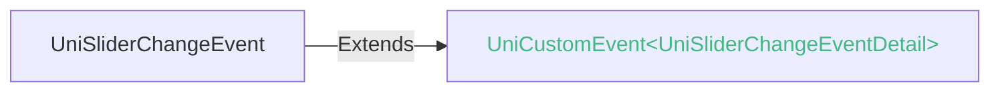

<!-- ## slider -->

::: sourceCode
## slider
:::

> 组件类型：UniSliderElement 

 滑动选择器


### 兼容性
| Web | 微信小程序 | Android | iOS | HarmonyOS | HarmonyOS(Vapor) |
| :- | :- | :- | :- | :- | :- |
| 4.0 | 4.41 | 3.9 | 4.11 | 4.61 | 5.0 |


### 属性 
| 名称 | 类型 | 默认值 | 兼容性 | 描述 |
| :- | :- | :- |  :-: | :- |
| name | string | - | Web: 4.0; 微信小程序: 4.41; Android: 3.9; iOS: 4.11; HarmonyOS: 4.61; HarmonyOS(Vapor): 5.0 | 表单的控件名称，作为键值对的一部分与表单(form组件)一同提交 |
| disabled | boolean | - | Web: 4.0; 微信小程序: 4.41; Android: 3.9; iOS: 4.11; HarmonyOS: 4.61; HarmonyOS(Vapor): 5.0 | 是否禁用 |
| min | number | 0 | Web: 4.0; 微信小程序: 4.41; Android: 3.9; iOS: 4.11; HarmonyOS: 4.61; HarmonyOS(Vapor): 5.0 | slider 最小值 |
| max | number | 100 | Web: 4.0; 微信小程序: 4.41; Android: 3.9; iOS: 4.11; HarmonyOS: 4.61; HarmonyOS(Vapor): 5.0 | slider 最大值 |
| step | number | 1 | Web: 4.0; 微信小程序: 4.41; Android: 3.9; iOS: 4.11; HarmonyOS: 4.61; HarmonyOS(Vapor): 5.0 | slider 步长，取值必须大于 0，并且可被(max - min)整除 |
| value | number | 0 | Web: 4.0; 微信小程序: 4.41; Android: 3.9; iOS: 4.11; HarmonyOS: 4.61; HarmonyOS(Vapor): 5.0 | slider 当前取值 |
| activeBackgroundColor | string([string.ColorString](/uts/data-type.md#ide-string)) | "#007aff" | Web: 4.18; 微信小程序: x; Android: 4.18; iOS: 4.18; HarmonyOS: 4.61; HarmonyOS(Vapor): x | slider 滑块左侧已选择部分的线条颜色 (vapor 模式请使用 track-active-class) |
| ~~activeColor~~ | string([string.ColorString](/uts/data-type.md#ide-string)) | "#007aff" | Web: 4.0; 微信小程序: 4.41; Android: 3.9; iOS: 4.11; HarmonyOS: 4.61; HarmonyOS(Vapor): - | slider 滑块左侧已选择部分的线条颜色 |
| backgroundColor | string([string.ColorString](/uts/data-type.md#ide-string)) | "#e9e9e9" | Web: 4.0; 微信小程序: 4.41; Android: 3.9; iOS: 4.11; HarmonyOS: 4.61; HarmonyOS(Vapor): x | slider 背景条的颜色 (vapor 模式请使用 track-class) |
| block-size | number | 28 | Web: 4.0; 微信小程序: 4.41; Android: 3.9; iOS: 4.11; HarmonyOS: 4.61; HarmonyOS(Vapor): x | slider 滑块的大小，取值范围为 12 - 28 (vapor 模式请使用 thumb-class) |
| ~~block-color~~ | string([string.ColorString](/uts/data-type.md#ide-string)) | "#ffffff" | Web: 4.0; 微信小程序: 4.41; Android: 3.9; iOS: 4.11; HarmonyOS: 4.61; HarmonyOS(Vapor): x | 滑块颜色 (使用foreColor替代) |
| foreColor | string([string.ColorString](/uts/data-type.md#ide-string)) | - | Web: 4.18; 微信小程序: x; Android: 4.18; iOS: 4.18; HarmonyOS: 4.61; HarmonyOS(Vapor): x | slider 的滑块背景颜色 (vapor 模式请使用 thumb-class) |
| show-value | boolean | false | Web: 4.0; 微信小程序: 4.41; Android: 3.9; iOS: 4.11; HarmonyOS: 4.61; HarmonyOS(Vapor): 5.0 | 是否显示当前 value |
| color | color | - | Web: -; 微信小程序: 4.41; Android: -; iOS: -; HarmonyOS: -; HarmonyOS(Vapor): - | *(color)*<br/>背景条的颜色（请使用 backgroundColor） |
| selected-color | color | - | Web: -; 微信小程序: 4.41; Android: -; iOS: -; HarmonyOS: -; HarmonyOS(Vapor): - | *(color)*<br/>已选择的颜色（请使用 activeColor） |
| track-class | [string.ClassString](/uts/data-type.md#ide-string) | - | Web: -; 微信小程序: -; Android: -; iOS: -; HarmonyOS: -; HarmonyOS(Vapor): 5.0 | slider 背景条样式类名 |
| track-active-class | [string.ClassString](/uts/data-type.md#ide-string) | - | Web: -; 微信小程序: -; Android: -; iOS: -; HarmonyOS: -; HarmonyOS(Vapor): 5.0 | slider 滑块左侧已选择部分的线条样式类名 |
| thumb-class | [string.ClassString](/uts/data-type.md#ide-string) | - | Web: -; 微信小程序: -; Android: -; iOS: -; HarmonyOS: -; HarmonyOS(Vapor): 5.0 | slider 滑块样式类名 |
| @change | (event: [UniSliderChangeEvent](#unisliderchangeevent)) => void | - | Web: 4.0; 微信小程序: 4.41; Android: 3.9; iOS: 4.11; HarmonyOS: 4.61; HarmonyOS(Vapor): - | 完成一次拖动后触发的事件，event.detail = {value: value} |
| @changing | (event: [UniSliderChangeEvent](#unisliderchangeevent)) => void | - | Web: 4.0; 微信小程序: 4.41; Android: 3.9; iOS: 4.11; HarmonyOS: 4.61; HarmonyOS(Vapor): - | 拖动过程中触发的事件，event.detail = {value: value} |


### 事件
#### UniSliderChangeEvent


##### UniSliderChangeEventDetail


###### UniSliderChangeEventDetail 的属性值
| 名称 | 类型 | 必填 | 默认值 | 兼容性 | 描述 |
| :- | :- | :- | :- |  :-: | :- |
| value | number | 是 | - | - | - |


<!-- UTSCOMJSON.slider.component_type-->

## tips
show-value属性设为true后，会在横条右侧显示一个数字。

但注意app-uvue中，value显示区的默认宽度是4位数字。超出宽度后，后面的数字无法显示。即最大9999。（其他平台不限制）

如您需要5位或更多数字，请将show-value设为false或不设，自行写一个text组件，绑定value的数值来显示。

- uni-app x 的 App 和 web 平台的样式效果和 W3C 的效果一致，球的左边距/右边距和轨道是对齐的，app-vue/web/小程序 平台会溢出球半径
- 在 uni-app x 的 App 和 web 平台高度为 `block-size(28px) 大小 + 阴影(4px * 2)`，默认 `margin: 1px 0;`，暂不支持设置 padding，实际占用高度为 `38px`
- 在 app-vue/web/小程序 平台高度为 18px, 默认 `margin: 10px 18px;`，实际占用高度为 `38px`
- 默认占用高度是一致的，调整样式后会出现差异
- 4.18+ App-Android 平台，优化了在滚动容器中的行为，当水平拖动 slider 超过 4 * dpi 时将阻止默认行为，避免滚动过程中触发 slider 变动
- app-ios平台不支持padding style（padding-top、padding-left、padding-right、padding-bottom）
- 平台差异：当 max 值不能整除 step 值时，app-android/web 平台滑块不能滑动到最末端，最大滑动值为 max 值整除 step 值的位置，app-ios/微信小程序平台滑块可以滑动到最末端，返回值会四舍五入到 step 的精度值，app-ios 平台 4.33 版本调整为和 app-android/web 平台一致，示例如下:
```html
<template>
  <view>
    <!-- app/web 平台滑块不能滑动到最末端，最大滑动值为10  -->
    <!-- 微信小程序 滑块可以滑动到最末端，取值会四舍五入为 11 -->
    <slider :min="0" :max="10.5" :step="1" :show-value="true" />
  </view>
</template>
```


### 示例
示例为[hello uni-app x alpha分支](https://gitcode.com/dcloud/hello-uni-app-x/blob/prod_alpha/pages/component/slider/slider.uvue)，与最新HBuilderX Alpha版同步。与最新正式版同步的master分支示例[另见](https://gitcode.com/dcloud/hello-uni-app-x/blob/master//pages/component/slider/slider.uvue) 
::: preview https://hellouniappx.dcloud.net.cn/web/#/pages/component/slider/slider

> appRedirect https://hellouniappx.dcloud.net.cn/appredirect.html?path=pages/component/slider/slider

>示例
```vue
<script setup lang="uts">
  type DataType = {
    sliderValue: number;
    sliderBlockSize: number;
    sliderBackgroundColor: string;
    sliderActiveColor: string;
    sliderBlockColor: string;
    // 组件属性 autotest
    show_value_boolean: boolean;
    disabled_boolean: boolean;
    min_input: number;
    max_input: number;
    step_input: number;
    value_input: number;
    activeColor_input: string;
    backgroundColor_input: string;
    block_size_input: number;
    block_color_input: string;
    valueColor: string;
  }
  // 使用reactive避免ref数据在自动化测试中无法访问
  const data = reactive({
    sliderValue: 50,
    sliderBlockSize: 20,
    sliderBackgroundColor: "#000000",
    sliderActiveColor: "#FFCC33",
    sliderBlockColor: "#8A6DE9",
    // 组件属性 autotest
    show_value_boolean: false,
    disabled_boolean: false,
    min_input: 0,
    max_input: 100,
    step_input: 1,
    value_input: 0,
    activeColor_input: "#007aff",
    backgroundColor_input: "#e9e9e9",
    block_size_input: 28,
    block_color_input: "#ffffff",
    valueColor: "#888888"
  } as DataType)

  const sliderChange = (e: UniSliderChangeEvent) => {
    console.log("value 发生变化：" + e.detail.value);
  }

  const slider_click = () => {
    console.log("组件被点击时触发");
  }

  const slider_touchstart = () => {
    console.log("手指触摸动作开始");
  }

  const slider_touchmove = () => {
    console.log("手指触摸后移动");
  }

  const slider_touchcancel = () => {
    console.log("手指触摸动作被打断，如来电提醒，弹窗");
  }

  const slider_touchend = () => {
    console.log("手指触摸动作结束");
  }

  const slider_tap = () => {
    console.log("手指触摸后马上离开");
  }

  const slider_longpress = () => {
    console.log(
      "如果一个组件被绑定了 longpress 事件，那么当用户长按这个组件时，该事件将会被触发。"
    );
  }

  const slider_change = () => {
    console.log("完成一次拖动后触发的事件，event.detail = {value: value}");
  }

  const slider_changing = () => {
    console.log("拖动过程中触发的事件，event.detail = {value: value}");
  }

  const change_show_value_boolean = (checked: boolean) => {
    data.show_value_boolean = checked;
  }

  const change_disabled_boolean = (checked: boolean) => {
    data.disabled_boolean = checked;
  }

  const confirm_min_input = (value: number) => {
    data.min_input = value;
  }

  const confirm_max_input = (value: number) => {
    data.max_input = value;
  }

  const confirm_step_input = (value: number) => {
    data.step_input = value;
  }

  const confirm_value_input = (value: number) => {
    data.value_input = value;
  }

  const confirm_activeColor_input = (value: string) => {
    data.activeColor_input = value;
  }

  const confirm_backgroundColor_input = (value: string) => {
    data.backgroundColor_input = value;
  }

  const confirm_block_size_input = (value: number) => {
    data.block_size_input = value;
  }

  const confirm_block_color_input = (value: string) => {
    data.block_color_input = value;
  }

  const confirm_value_color_input = (value: string) => {
    data.valueColor = value;
  }

  defineExpose({
    data
  })
</script>

<template>
  <view class="main">
    <slider :disabled="data.disabled_boolean" :min="data.min_input" :max="data.max_input" :step="data.step_input" :value="data.value_input"
      :activeColor="data.activeColor_input" :backgroundColor="data.backgroundColor_input" :block-size="data.block_size_input"
      :block-color="data.block_color_input" :show-value="data.show_value_boolean" :valueColor="data.valueColor" @click="slider_click"
      @touchstart="slider_touchstart" @touchmove="slider_touchmove" @touchcancel="slider_touchcancel"
      @touchend="slider_touchend" @tap="slider_tap" @longpress="slider_longpress" @change="slider_change"
      @changing="slider_changing" style="width: 90%"></slider>
  </view>

  <scroll-view style="flex: 1">
    <view class="content">
      <page-head title="组件属性"></page-head>
      <boolean-data :defaultValue="false" title="是否显示当前 value" @change="change_show_value_boolean"></boolean-data>
      <boolean-data :defaultValue="false" title="是否禁用" @change="change_disabled_boolean"></boolean-data>
      <input-data defaultValue="0" title="最小值(min)" type="number" @confirm="confirm_min_input"></input-data>
      <input-data defaultValue="100" title="最大值(max)" type="number" @confirm="confirm_max_input"></input-data>
      <input-data defaultValue="1" title="步长(step)，取值必须大于 0，并且可被(max - min)整除" type="number"
        @confirm="confirm_step_input"></input-data>
      <input-data defaultValue="0" title="当前取值(value)" type="number" @confirm="confirm_value_input"></input-data>
      <!-- #ifndef VUE3-VAPOR -->
      <input-data defaultValue="#007aff" title="滑块左侧已选择部分的线条颜色(active-color)" type="text"
        @confirm="confirm_activeColor_input"></input-data>
      <input-data defaultValue="#e9e9e9" title="背景条的颜色(background-color)" type="text"
        @confirm="confirm_backgroundColor_input"></input-data>
      <input-data defaultValue="28" title="滑块的大小(block-size)，取值范围为 12 - 28" type="number"
        @confirm="confirm_block_size_input"></input-data>
      <input-data defaultValue="#ffffff" title="滑块颜色(block-color)" type="text"
        @confirm="confirm_block_color_input"></input-data>
      <input-data defaultValue="#888888" title="Value颜色(value-color)" type="text"
        @confirm="confirm_value_color_input"></input-data>
      <!-- #endif -->
    </view>

    <view class="uni-padding-wrap">
      <page-head title="默认及使用"></page-head>
      <view class="uni-title">显示当前value</view>
      <view>
        <slider style="padding: 5px 0;" @change="sliderChange" :value="50" :show-value="true" />
      </view>

      <view class="uni-title">设置步进:step=10跳动</view>
      <view>
        <view class="uni-row">
          <text>0</text>
          <text class="m-l-a">100</text>
        </view>
        <slider style="padding: 5px 0;" @change="sliderChange" :value="60" :step="10" />
      </view>

      <view class="uni-title">浮点步进:step=0.01跳动</view>
      <view>
        <slider style="padding: 5px 0;" :value="0.5" :min="0" :max="1" :step="0.01" :show-value="true" />
      </view>

      <view class="uni-title">设置最小/最大值</view>
      <view>
        <slider style="padding: 5px 0;" @change="sliderChange" :value="100" :min="50" :max="200" :show-value="true" />
      </view>

      <view class="uni-title">不同颜色和大小的滑块</view>
      <view>
        <!-- vapor 模式不支持 activeColor、blockColor 等属性，需要使用 track-class、track-active-class、thumb-class -->
        <slider style="padding: 5px 0;" id="slider-custom-color-and-size" @change="sliderChange" :value="data.sliderValue"
          :backgroundColor="data.sliderBackgroundColor" :activeColor="data.sliderActiveColor"
          :activeBackgroundColor="data.sliderActiveColor" :blockColor="data.sliderBlockColor" :foreColor="data.sliderBlockColor"
          :block-size="data.sliderBlockSize"
          track-class="custom-track" track-active-class="custom-track-active" thumb-class="custom-thumb"/>
      </view>
      <view class="uni-title">暗黑模式</view>
      <view>
        <slider style="padding: 5px 0;" :show-value="true" backgroundColor="rgba(32,32,32,0.5)" valueColor="#555" track-class="dark-track" thumb-class="dark-thumb"/>
      </view>

      <navigator class="uni-common-mb" url="/pages/template/slider-100/slider-100">
        <button>组件性能测试</button>
      </navigator>

      <navigator class="uni-common-mb" url="./slider-in-swiper">
        <button>slider in swiper</button>
      </navigator>

      <navigator class="uni-common-mb" url="./slider-maxValue">
        <button>slider maxValue</button>
      </navigator>
    </view>
  </scroll-view>
</template>

<style>
  .main {
    padding: 5px 0;
    border-bottom: 1px solid rgba(0, 0, 0, 0.06);
    flex-direction: row;
    justify-content: center;
  }

  .m-l-a {
    margin-left: auto;
  }

  /* 自定义样式示例 */
  .custom-track {
    background-color: #000000;
  }

  .custom-track-active {
    background-color: #FFCC33;
  }

  .custom-thumb {
    width: 20px;
    height: 20px;
    background-color: #8A6DE9;
    border-radius: 10px;
  }

  /* 暗黑模式样式 */
  .dark-track {
    background-color: rgba(32, 32, 32, 0.5);
  }

  .dark-thumb {
    background-color: #555;
  }
</style>

```

:::


### 参见
- [相关 Bug](https://issues.dcloud.net.cn/?mid=component.form-component.slider)
- [参见uni-app相关文档](https://uniapp.dcloud.io/component/slider.html)
- [微信小程序文档](https://developers.weixin.qq.com/miniprogram/dev/component/slider.html)
- [支付宝小程序文档](https://open.alipay.com/portal/zhichi/search?keyword=slider&pageIndex=1&pageSize=10&source=doc_top&type=all)
- [百度小程序文档](https://smartprogram.baidu.com/forum/search?query=slider&scope=devdocs&source=docs)
- [抖音小程序文档](https://developer.open-douyin.com/search-page?keyword=slider&secondType=all&type=1)
- [飞书小程序文档](https://open.feishu.cn/search?from=header&page=1&pageSize=10&q=slider&topicFilter=)
- [钉钉小程序文档](https://open.dingtalk.com/search?keyword=slider)
- [QQ小程序文档](https://q.qq.com/wiki/develop/miniprogram/frame/)
- [快手小程序文档](https://developers.kuaishou.com/page?keyword=slider&from=docs)
- [京东小程序文档](https://mp-docs.jd.com/doc/dev/framework/-1)
- [华为快应用文档](https://developer.huawei.com/consumer/cn/doc/quickApp-References/webview-frame-overview-0000001124793625)
- [360小程序文档](https://mp.360.cn/doc/miniprogram/dev/#/b770a184ff1f06c6b3393a0fd1132380)
