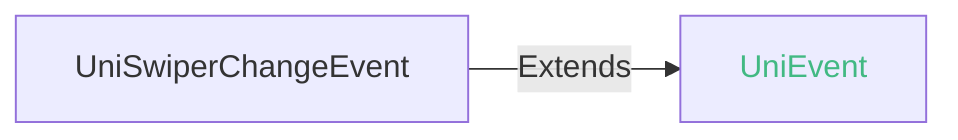
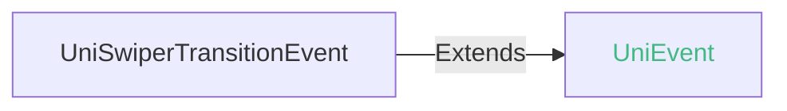
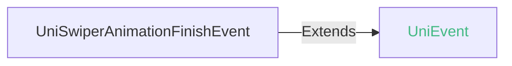

<!-- ## swiper -->

::: sourceCode
## swiper

> GitCode: https://gitcode.com/dcloud/uni-component/tree/alpha/uni_modules/uni-swiper


> GitHub: https://github.com/dcloudio/uni-component/tree/alpha/uni_modules/uni-swiper

:::

> 组件类型：UniSwiperElement 

 滑块视图容器


### 兼容性
| Web | 微信小程序 | Android | iOS | HarmonyOS | HarmonyOS(Vapor) |
| :- | :- | :- | :- | :- | :- |
| 4.0 | 4.41 | 3.9 | 4.11 | 4.61 | 5.0 |


### 属性 
| 名称 | 类型 | 默认值 | 兼容性 | 描述 |
| :- | :- | :- |  :-: | :- |
| indicator-dots | string \| boolean | false | Web: 4.0; 微信小程序: 4.41; Android: 3.9; iOS: 4.11; HarmonyOS: 4.61; HarmonyOS(Vapor): 5.0 | 是否显示面板指示点 |
| indicator-color | string([string.ColorString](/uts/data-type.md#ide-string)) | "rgba(0, 0, 0, .3)" | Web: 4.0; 微信小程序: 4.41; Android: 3.9; iOS: 4.11; HarmonyOS: 4.61; HarmonyOS(Vapor): x | 指示点颜色，蒸汽模式推荐使用 indicator-style 定制指示点颜色 |
| indicator-active-color | string([string.ColorString](/uts/data-type.md#ide-string)) | "#000000" | Web: 4.0; 微信小程序: 4.41; Android: 3.9; iOS: 4.11; HarmonyOS: 4.61; HarmonyOS(Vapor): x | 当前选中的指示点颜色，蒸汽模式推荐使用 indicator-active-style 定制指示点颜色 |
| active-class | string | - | Web: x; 微信小程序: x; Android: x; iOS: x; HarmonyOS: x; HarmonyOS(Vapor): - | swiper-item 可见时的 class |
| changing-class | boolean | - | Web: x; 微信小程序: x; Android: x; iOS: x; HarmonyOS: x; HarmonyOS(Vapor): - | acceleration 设置为 {{true}} 时且处于滑动过程中，中间若干屏处于可见时的class |
| acceleration | boolean | - | Web: x; 微信小程序: x; Android: x; iOS: x; HarmonyOS: x; HarmonyOS(Vapor): - | 当开启时，会根据滑动速度，连续滑动多屏 |
| disable-programmatic-animation | boolean | - | Web: x; 微信小程序: x; Android: x; iOS: x; HarmonyOS: x; HarmonyOS(Vapor): - | 是否禁用代码变动触发 swiper 切换时使用动画。 |
| disable-touch | string \| boolean | false | Web: 4.0; 微信小程序: x; Android: 3.9; iOS: 4.11; HarmonyOS: 4.61; HarmonyOS(Vapor): 5.0 | 是否禁止用户 touch 操作 |
| touchable | boolean | - | Web: x; 微信小程序: x; Android: x; iOS: x; HarmonyOS: x; HarmonyOS(Vapor): - | 是否监听用户的触摸事件 |
| easing-function | string | - | Web: x; 微信小程序: 4.41; Android: x; iOS: x; HarmonyOS: 4.61; HarmonyOS(Vapor): 5.0 | 指定 swiper 切换缓动动画类型，有效值：default、linear、easeInCubic、easeOutCubic、easeInOutCubic |
| autoplay | string \| boolean | false | Web: 4.0; 微信小程序: 4.41; Android: 3.9; iOS: 4.11; HarmonyOS: 4.61; HarmonyOS(Vapor): 5.0 | 是否自动切换 |
| current | number | 0 | Web: 4.0; 微信小程序: 4.41; Android: 3.9; iOS: 4.11; HarmonyOS: 4.61; HarmonyOS(Vapor): 5.0 | 当前所在滑块的 index |
| current-item-id | string | - | Web: 4.0; 微信小程序: x; Android: 3.9; iOS: 4.11; HarmonyOS: 4.61; HarmonyOS(Vapor): 5.0 | 当前所在滑块的 item-id ，不能与 current 被同时指定 |
| interval | number | 3000 | Web: 4.0; 微信小程序: 4.41; Android: 3.9; iOS: 4.11; HarmonyOS: 4.61; HarmonyOS(Vapor): 5.0 | 自动切换时间间隔 |
| duration | number | 500 | Web: 4.0; 微信小程序: 4.41; Android: 4.44; iOS: x; HarmonyOS: 4.61; HarmonyOS(Vapor): 5.0 | 滑动动画时长（Android平台仅autoplay模式下生效） |
| circular | string \| boolean | false | Web: 4.0; 微信小程序: 4.41; Android: 3.9; iOS: 4.11; HarmonyOS: 4.61; HarmonyOS(Vapor): 5.0 | 是否采用衔接滑动 |
| vertical | string \| boolean | false | Web: 4.0; 微信小程序: 4.41; Android: 3.9; iOS: 4.11; HarmonyOS: 4.61; HarmonyOS(Vapor): 5.0 | 滑动方向是否为纵向 |
| rebound | boolean | true | Web: x; 微信小程序: x; Android: 3.9; iOS: 4.11; HarmonyOS: 4.61; HarmonyOS(Vapor): x | 控制是否回弹效果 |
| previous-margin | string | - | Web: -; 微信小程序: 4.41; Android: x; iOS: x; HarmonyOS: 4.61; HarmonyOS(Vapor): 5.0 | 前边距，可用于露出前一项的一小部分，接受 px 和 rpx 值 |
| next-margin | string | - | Web: -; 微信小程序: 4.41; Android: x; iOS: x; HarmonyOS: 4.61; HarmonyOS(Vapor): 5.0 | 后边距，可用于露出后一项的一小部分，接受 px 和 rpx 值 |
| display-multiple-items | number | - | Web: -; 微信小程序: 4.41; Android: x; iOS: x; HarmonyOS: -; HarmonyOS(Vapor): - | 同时显示的滑块数量 |
| auto-height | string \| boolean | false | Web: -; 微信小程序: x; Android: x; iOS: x; HarmonyOS: x; HarmonyOS(Vapor): 5.0 | 自动高度。设置为 true 时，swiper 高度会随当前 item 的高度变化而变化。 |
| disable-bounce | string \| boolean | false | Web: -; 微信小程序: x; Android: x; iOS: x; HarmonyOS: x; HarmonyOS(Vapor): 5.0 | 控制是否回弹效果 |
| indicator-class | [string.ClassString](/uts/data-type.md#ide-string) | - | Web: -; 微信小程序: x; Android: x; iOS: x; HarmonyOS: x; HarmonyOS(Vapor): 5.0 | 指示点绑定的 class |
| indicator-active-class | [string.ClassString](/uts/data-type.md#ide-string) | - | Web: -; 微信小程序: x; Android: x; iOS: x; HarmonyOS: x; HarmonyOS(Vapor): 5.0 | 当前选中的指示点绑定的 class |
| indicator-style | string | - | Web: -; 微信小程序: x; Android: x; iOS: x; HarmonyOS: x; HarmonyOS(Vapor): 5.0 | 指示点样式 |
| indicator-active-style | string | - | Web: -; 微信小程序: x; Android: x; iOS: x; HarmonyOS: x; HarmonyOS(Vapor): 5.0 | 当前选中的指示点样式 |
| @change | (event: [UniSwiperChangeEvent](#uniswiperchangeevent)) => void | - | Web: 4.0; 微信小程序: 4.41; Android: 3.9; iOS: 4.11; HarmonyOS: 4.61; HarmonyOS(Vapor): 5.0 | current 改变时会触发 change 事件，event.detail = {current: current, source: source} |
| @transition | (event: [UniSwiperTransitionEvent](#uniswipertransitionevent)) => void | - | Web: 4.0; 微信小程序: 4.41; Android: 3.9; iOS: 4.11; HarmonyOS: 4.61; HarmonyOS(Vapor): 5.0 | swiper-item 的位置发生改变时会触发 transition 事件，event.detail = {dx: dx, dy: dy} |
| @animationfinish | (event: [UniSwiperAnimationFinishEvent](#uniswiperanimationfinishevent)) => void | - | Web: 4.0; 微信小程序: 4.41; Android: 3.9; iOS: 4.11; HarmonyOS: 4.61; HarmonyOS(Vapor): 5.0 | 动画结束时会触发 animationfinish 事件，event.detail = {current: current, source: source} |

#### easing-function 的属性描述

| 合法值 | 兼容性 | 描述 |
| :- |  :-: | :- |
| default | Web: -; 微信小程序: 4.41; Android: x; iOS: x; HarmonyOS: 4.61; HarmonyOS(Vapor): 5.0 | - |
| linear | Web: -; 微信小程序: 4.41; Android: x; iOS: x; HarmonyOS: -; HarmonyOS(Vapor): - | - |
| easeInCubic | Web: -; 微信小程序: 4.41; Android: x; iOS: x; HarmonyOS: -; HarmonyOS(Vapor): - | - |
| easeOutCubic | Web: -; 微信小程序: 4.41; Android: x; iOS: x; HarmonyOS: -; HarmonyOS(Vapor): - | - |
| easeInOutCubic | Web: -; 微信小程序: 4.41; Android: x; iOS: x; HarmonyOS: -; HarmonyOS(Vapor): - | - |


### 事件
#### UniSwiperChangeEvent


##### UniSwiperChangeEvent 的属性值
| 名称 | 类型 | 必填 | 默认值 | 兼容性 | 描述 |
| :- | :- | :- | :- |  :-: | :- |
| detail | **UniSwiperChangeEventDetail** | 是 | - | - | - |

#### detail 的属性描述

| 名称 | 类型 | 必备 | 默认值 | 兼容性 | 描述 |
| :- | :- | :- | :- |  :-: | :- |
| current | number | 是 | - | - | 发生change事件的滑块下标 |
| currentItemId | string | 否 | - | Web: √; 微信小程序: 4.41; Android: x; iOS: x; HarmonyOS: 4.61; HarmonyOS(Vapor): 5.0 | 切换结束的 swiper-item 的 item-id 属性值 |
| source | string | 是 | - | - | autoplay 自动播放导致swiper变化；touch 用户划动引起swiper变化 |


#### UniSwiperTransitionEvent


##### UniSwiperTransitionEvent 的属性值
| 名称 | 类型 | 必填 | 默认值 | 兼容性 | 描述 |
| :- | :- | :- | :- |  :-: | :- |
| detail | **UniSwiperTransitionEventDetail** | 是 | - | - | - |

#### detail 的属性描述

| 名称 | 类型 | 必备 | 默认值 | 兼容性 | 描述 |
| :- | :- | :- | :- |  :-: | :- |
| dx | number | 是 | - | - | 横向偏移量，单位是逻辑像素px |
| dy | number | 是 | - | - | 纵向偏移量，单位是逻辑像素px |


#### UniSwiperAnimationFinishEvent


##### UniSwiperAnimationFinishEvent 的属性值
| 名称 | 类型 | 必填 | 默认值 | 兼容性 | 描述 |
| :- | :- | :- | :- |  :-: | :- |
| detail | **UniSwiperAnimationFinishEventDetail** | 是 | - | - | - |

#### detail 的属性描述

| 名称 | 类型 | 必备 | 默认值 | 兼容性 | 描述 |
| :- | :- | :- | :- |  :-: | :- |
| current | number | 是 | - | - | 发生动画结束事件的滑块下标 |
| currentItemId | string | 否 | - | Web: √; 微信小程序: 4.41; Android: x; iOS: x; HarmonyOS: 4.61; HarmonyOS(Vapor): 5.0 | 动画结束的 swiper-item 的 item-id 属性值 |
| source | string | 是 | - | - | autoplay 自动播放导致swiper变化；touch 用户划动引起swiper变化 |


<!-- UTSCOMJSON.swiper.component_type-->

### 子组件 @children-tags
| 子组件 | 兼容性 |
| :- | :- |
| [swiper-item](swiper-item.md) | Web: 4.0; 微信小程序: 4.41; Android: 3.9; iOS: 4.11; HarmonyOS: 4.61; HarmonyOS(Vapor): 5.0 |

### 示例
示例为[hello uni-app x alpha分支](https://gitcode.com/dcloud/hello-uni-app-x/blob/prod_alpha/pages/component/swiper/swiper.uvue)，与最新HBuilderX Alpha版同步。与最新正式版同步的master分支示例[另见](https://gitcode.com/dcloud/hello-uni-app-x/blob/master//pages/component/swiper/swiper.uvue) 
::: preview https://hellouniappx.dcloud.net.cn/web/#/pages/component/swiper/swiper

> appRedirect https://hellouniappx.dcloud.net.cn/appredirect.html?path=pages/component/swiper/swiper

>示例
```vue
<template>
  <!-- #ifdef APP -->
  <scroll-view class="page-scroll-view">
  <!-- #endif -->
    <view class="uni-common-mb uni-common-pb">
      <page-head title="swiper,可滑动视图"></page-head>
      <view>
        <!-- 微信小程序自身Bug，autoplay为false时更新interval会导致swiper启用自动播放 -->
        <swiper id="swiper-view" class="swiper" :vertical="data.verticalSelect" :indicator-dots="data.dotsSelect"
          :autoplay="data.autoplaySelect" :bounces="data.reboundSelect" :interval="data.intervalSelect" :circular="data.circularSelect"
          :duration="data.durationSelect" :indicator-color="data.indicatorColor" :indicator-active-color="data.indicatorColorActive"
          :disable-touch="data.disableTouchSelect" :current="data.currentVal" :current-item-id="data.currentItemIdVal"
          @change="swiperChange" @transition="swiperTransition" @animationfinish="swiperAnimationfinish"
          @touchstart="swipertouchStart">
          <swiper-item item-id="A">
            <view class="swiper-item uni-bg-red"><text class="swiper-item-Text" @touchstart="viewtouchStart">A</text>
            </view>
          </swiper-item>
          <swiper-item item-id="B">
            <view class="swiper-item uni-bg-green"><text class="swiper-item-Text">B</text></view>
          </swiper-item>
          <swiper-item item-id="C">
            <view class="swiper-item uni-bg-blue"><text class="swiper-item-Text">C</text></view>
          </swiper-item>
        </swiper>
      </view>
      <view class="uni-list">
        <view class="uni-list-cell uni-list-cell-padding">
          <view class="uni-list-cell-db">显示面板指示点</view>
          <switch :checked="data.dotsSelect" @change="dotsChange" />
        </view>
        <view class="uni-list-cell uni-list-cell-padding">
          <view class="uni-list-cell-db">定制指示器颜色</view>
          <switch :checked="data.indicatorColorSelect" @change="indicatorColorChange" />
        </view>
        <view class="uni-list-cell uni-list-cell-padding">
          <view class="uni-list-cell-db">禁止 touch 操作</view>
          <switch :checked="data.disableTouchSelect" @change="disableTouchChange" />
        </view>
        <view class="uni-list-cell uni-list-cell-padding">
          <view class="uni-list-cell-db">是否自动切换</view>
          <switch :checked="data.autoplaySelect" @change="autoplayChange" />
        </view>
        <view class="uni-list-cell uni-list-cell-padding">
          <view class="uni-list-cell-db">是否衔接滑动</view>
          <switch :checked="data.circularSelect" @change="circularChange" />
        </view>
        <view class="uni-title uni-list-cell-padding">间隔时间(毫秒)</view>
        <view class="uni-padding-wrap">
          <slider @change="sliderChange" :value="2000" :min="500" :max="5000" :show-value="true" />
        </view>
        <view class="uni-title uni-list-cell-padding">动画时长(毫秒)</view>
        <view class="uni-padding-wrap">
          <slider @change="durationSliderChange" :value="500" :min="50" :max="2000" :show-value="true" />
        </view>
        <view class="uni-list-cell uni-list-cell-padding">
          <view class="uni-list-cell-db">是否纵向滑动</view>
          <switch :checked="data.verticalSelect" @change="verticalChange" />
        </view>
        <view class="uni-list-cell uni-list-cell-padding">
          <view class="uni-list-cell-db">是否回弹效果</view>
          <!-- 仅 android ios harmony 支持，web 微信小程序 bounces 为 true -->
          <switch :checked="data.reboundSelect" @change="reboundSelectChange" />
        </view>
        <view class="uni-list-cell uni-list-cell-padding">
          <view class="uni-list-cell-db">指定current为最后一个元素</view>
          <switch :checked="data.currentSelect" @change="currentChange" />
        </view>
        <view class="uni-list-cell uni-list-cell-padding">
          <view class="uni-list-cell-db">指定current-item-id为最后一个元素</view>
          <switch :checked="data.currentItemIdSelect" @change="currentItemIdChange" />
        </view>
        <view class="uni-list-cell uni-list-cell-padding">
          <view class="uni-list-cell-db">打印 swiperChange 日志</view>
          <switch :checked="data.swiperChangeSelect" @change="swiperChangeChange" />
        </view>
        <view class="uni-list-cell uni-list-cell-padding">
          <view class="uni-list-cell-db">打印 swiperTransition 日志</view>
          <switch :checked="data.swiperTransitionSelect" @change="swiperTransitionChange" />
        </view>
        <view class="uni-list-cell uni-list-cell-padding">
          <view class="uni-list-cell-db">打印 swiperAnimationfinish 日志</view>
          <switch :checked="data.swiperAnimationfinishSelect" @change="swiperAnimationfinishChange" />
        </view>

        <view class="uni-list-cell-padding">测试 swiper 默认行为</view>
        <swiper class="swiper" :autoplay="data.autoplayForDefault" :circular="data.circularForDefault">
          <swiper-item item-id="A">
            <view class="swiper-item uni-bg-red"><text class="swiper-item-Text">A</text></view>
          </swiper-item>
          <swiper-item item-id="B">
            <view class="swiper-item uni-bg-green"><text class="swiper-item-Text">B</text></view>
          </swiper-item>
          <swiper-item item-id="C">
            <view class="swiper-item uni-bg-blue"><text class="swiper-item-Text">C</text></view>
          </swiper-item>
        </swiper>
        <view class="uni-list-cell uni-list-cell-padding">
          <view class="uni-list-cell-db">是否自动切换</view>
          <switch :checked="data.autoplayForDefault" @change="() => {data.autoplayForDefault = !data.autoplayForDefault}" />
        </view>
        <view class="uni-list-cell uni-list-cell-padding">
          <view class="uni-list-cell-db">是否衔接滑动</view>
          <switch :checked="data.circularForDefault" @change="() => {data.circularForDefault = !data.circularForDefault}" />
        </view>
        <!-- #ifndef MP -->
        <navigator url="/pages/component/swiper/swiper-list-view">
          <button type="primary">
            swiper 嵌套 list-view 测试
          </button>
        </navigator>
        <navigator url="/pages/component/swiper/swiper-anim" style="margin-top: 10px;">
        	<button type="primary">
        		swiper 动画测试
        	</button>
        </navigator>
        <!-- #endif -->
        <!-- #ifdef VUE3-VAPOR && APP-HARMONY -->
        <navigator url="/pages/component/swiper/swiper-more" style="margin-top: 10px;">
        	<button type="primary">
        		更多 swiper
        	</button>
        </navigator>
        <!-- #endif -->
      </view>
    </view>
  <!-- #ifdef APP -->
  </scroll-view>
  <!-- #endif -->
</template>

<script setup lang="uts">
  type SwiperEventTest = {
    type : string;
    target : UniElement | null;
    currentTarget : UniElement | null;
  }

  type DataType = {
    background: string[];
    dotsSelect: boolean;
    reboundSelect: boolean;
    autoplaySelect: boolean;
    circularSelect: boolean;
    indicatorColorSelect: boolean;
    verticalSelect: boolean;
    currentSelect: boolean;
    currentItemIdSelect: boolean;
    intervalSelect: number;
    durationSelect: number;
    indicatorColor: string;
    indicatorColorActive: string;
    currentVal: number;
    currentItemIdVal: string;
    disableTouchSelect: boolean;
    swiperTransitionSelect: boolean;
    swiperAnimationfinishSelect: boolean;
    swiperChangeSelect: boolean;
    currentValChange: number;
    autoplayForDefault: boolean;
    circularForDefault: boolean;
    // 自动化测试
    changeDetailTest: UniSwiperChangeEventDetail | null;
    transitionDetailTest: UniSwiperTransitionEventDetail | null;
    animationfinishDetailTest: UniSwiperAnimationFinishEventDetail | null;
    isChangeTest: string;
    isTransitionTest: string;
    isAnimationfinishTest: string;
    swipeX: number;
    swipeY: number;
  }

  // 使用reactive避免ref数据在自动化测试中无法访问
  const data = reactive({
    background: ['color1', 'color2', 'color3'],
    dotsSelect: false,
    reboundSelect: false,
    autoplaySelect: false,
    circularSelect: false,
    indicatorColorSelect: false,
    verticalSelect: false,
    currentSelect: false,
    currentItemIdSelect: false,
    intervalSelect: 2000,
    durationSelect: 500,
    indicatorColor: "",
    indicatorColorActive: "",
    currentVal: 0,
    currentItemIdVal: "",
    disableTouchSelect: false,
    swiperTransitionSelect: false,
    swiperAnimationfinishSelect: false,
    swiperChangeSelect: false,
    currentValChange: 0,
    autoplayForDefault: false,
    circularForDefault: false,
    // 自动化测试
    changeDetailTest: null as UniSwiperChangeEventDetail | null,
    transitionDetailTest: null as UniSwiperTransitionEventDetail | null,
    animationfinishDetailTest: null as UniSwiperAnimationFinishEventDetail | null,
    isChangeTest: '',
    isTransitionTest: '',
    isAnimationfinishTest: '',
    swipeX: 0,
    swipeY: 0
  } as DataType)

  onReady(() => {
    // #ifndef MP
    // 获取模拟滑动手势的起始点
    let ele = uni.getElementById("swiper-view")
    let eleRect = ele?.getBoundingClientRect()
    if (eleRect != null) {
      // 避开右侧边界，避免滑动行为响应为侧滑
      data.swipeX = eleRect.width - 40
      data.swipeY += eleRect.y + uni.getSystemInfoSync().safeArea.top + 44 + 35
    }
    // #endif
  })

  const swipertouchStart = (e : UniTouchEvent) => {
    console.log("swiper touchstart")
  }

  const viewtouchStart = (e : UniTouchEvent) => {
    console.log("view touchstart:")
  }

  // 自动化测试专用（由于事件event参数对象中存在循环引用，在ios端JSON.stringify报错，自动化测试无法page.data获取）
  const checkEventTest = (e : SwiperEventTest, eventName : String) => {
    // #ifndef MP
    const isPass = e.type === eventName && e.target instanceof UniElement && e.currentTarget instanceof UniElement;
    // #endif
    // #ifdef MP
    const isPass = true;
    // #endif
    const result = isPass ? `${eventName}:Success` : `${eventName}:Fail`;
    switch (eventName) {
      case 'change':
        data.isChangeTest = result
        break;
      case 'transition':
        data.isTransitionTest = result
        break;
      case 'animationfinish':
        data.isAnimationfinishTest = result
        break;
      default:
        break;
    }
  }


  const swiperChange = (e : UniSwiperChangeEvent) => {
    data.changeDetailTest = e.detail
    checkEventTest({
      type: e.type,
      target: e.target,
      currentTarget: e.currentTarget
    } as SwiperEventTest, 'change')
    data.currentValChange = e.detail.current
    console.log(data.currentValChange)
    if (data.swiperChangeSelect) {
      console.log("swiperChange", e)
    }
  }

  const swiperTransition = (e : UniSwiperTransitionEvent) => {
    data.transitionDetailTest = e.detail
    checkEventTest({
      type: e.type,
      target: e.target,
      currentTarget: e.currentTarget
    } as SwiperEventTest, 'transition')
    if (data.swiperTransitionSelect) {
      console.log("swiperTransition", e)
    }
  }

  const swiperAnimationfinish = (e : UniSwiperAnimationFinishEvent) => {
    data.animationfinishDetailTest = e.detail
    checkEventTest({
      type: e.type,
      target: e.target,
      currentTarget: e.currentTarget
    } as SwiperEventTest, 'animationfinish')
    if (data.swiperAnimationfinishSelect) {
      console.log("swiperAnimationfinish", e)
    }
  }

  //自动化测试例专用
  const jest_getSystemInfo = () : GetSystemInfoResult => {
    return uni.getSystemInfoSync();
  }


  const dotsChange = (e : UniSwitchChangeEvent) => {
    data.dotsSelect = e.detail.value
  }

  const swiperTransitionChange = (e : UniSwitchChangeEvent) => {
    data.swiperTransitionSelect = e.detail.value
  }

  const swiperChangeChange = (e : UniSwitchChangeEvent) => {
    data.swiperChangeSelect = e.detail.value
  }

  const swiperAnimationfinishChange = (e : UniSwitchChangeEvent) => {
    data.swiperAnimationfinishSelect = e.detail.value
  }

  const autoplayChange = (e : UniSwitchChangeEvent) => {
    data.autoplaySelect = e.detail.value
  }

  const verticalChange = (e : UniSwitchChangeEvent) => {
    data.verticalSelect = e.detail.value
  }

  const disableTouchChange = (e : UniSwitchChangeEvent) => {
    data.disableTouchSelect = e.detail.value
  }

  const currentItemIdChange = (e : UniSwitchChangeEvent) => {
    data.currentItemIdSelect = e.detail.value
    if (data.currentItemIdSelect) {
      data.currentItemIdVal = 'C'
    } else {
      data.currentItemIdVal = 'A'
    }
  }

  const currentChange = (e : UniSwitchChangeEvent) => {
    data.currentSelect = e.detail.value
    if (data.currentSelect) {
      data.currentVal = 2
    } else {
      data.currentVal = 0
    }
  }

  const circularChange = (e : UniSwitchChangeEvent) => {
    data.circularSelect = e.detail.value
    console.log(data.circularSelect)
  }

  const reboundSelectChange = (e : UniSwitchChangeEvent) => {
    data.reboundSelect = e.detail.value
    console.log(data.reboundSelect)
  }

  const sliderChange = (e : UniSliderChangeEvent) => {
    data.intervalSelect = e.detail.value
  }

  const durationSliderChange = (e : UniSliderChangeEvent) => {
    data.durationSelect = e.detail.value
  }

  const indicatorColorChange = (e : UniSwitchChangeEvent) => {
    data.indicatorColorSelect = e.detail.value
    if (data.indicatorColorSelect) {
      // 选择了定制指示器颜色
      data.indicatorColor = "#ff00ff"
      data.indicatorColorActive = "#0000ff"
    } else {
      // 没有选择颜色
      data.indicatorColor = ""
      data.indicatorColorActive = ""
    }
  }

  defineExpose({
    data,
    jest_getSystemInfo
  })
</script>

<style>
  .swiper {
    height: 150px;
  }

  .swiper-item {
    width: 100%;
    height: 150px;
  }

  .swiper-item-Text {
    width: 100%;
    text-align: center;
    line-height: 150px;
  }
</style>

```

:::


**平台差异**

- web、小程序、app-harmony 端的swiper-item为绝对定位，无法撑开swiper。所以swiper组件的默认高度为150px。
- app-android和iOS的swiper目前默认会以内容高度撑开作为其高度。如果要多端拉齐应自行设置swiper的style里的高度。后续Android和iOS的swiper也会统一为其他平台的方式。

:::warning 注意
- 使用 `auto-height` 属性时，`swiper-item` 组件外层容器和 slot 内容之间会增加一层 `view`，这会导致设置在 `swiper-item` 上的布局样式无法直接影响插槽内的元素（比如 `align-items: center`），请注意避免影响布局。
- 蒸汽模式不再支持 `rebound` 属性，如需控制是否回弹效果，请使用 `disable-bounce` 属性。
- 蒸汽模式不再支持 `indicator-color` 和 `indicator-active-color` 属性，如需自定义指示点颜色及其他样式，请使用 `indicator-style`、`indicator-class` 和 `indicator-active-style`、`indicator-active-class` 属性。
- 蒸汽模式新增通过 `indicator` 具名插槽自定义指示点，示例代码如下：
:::
```vue
<template>
	<swiper :current="current" @change="handleSwiperChange">
		<swiper-item>
			<view style="height: 100%; align-items: center; justify-content: center; background-color: #16a085;">
				<text style="color: white;">Item 1</text>
			</view>
		</swiper-item>
		<swiper-item>
			<view style="height: 100%; align-items: center; justify-content: center; background-color: #cccccc;">
				<text style="color: black;">Item 2</text>
			</view>
		</swiper-item>
		<swiper-item>
			<view style="height: 100%; align-items: center; justify-content: center; background-color: #00cc00;">
				<text style="color: white;">Item 3</text>
			</view>
		</swiper-item>
		<template v-slot:indicator>
			<text v-for="(_, index) in 3" class="custom-indicator-text" :class="{ 'active': current === index }">{{index + 1}}</text>
		</template>
	</swiper>
</template>

<script setup lang="uts">
	const current = ref(0)

	const handleSwiperChange = (e : UniSwiperChangeEvent) => {
		current.value = e.detail.current
	}
</script>

<style>
	.custom-indicator-text {
		margin: 0 5px;
	}

	.custom-indicator-text.active {
		font-size: 18px;
		color: yellow;
		font-weight: bold;
	}
</style>
```


## swiper-item

> 组件类型：UniSwiperItemElement 

 swiper的唯一合法子组件。每个swiper-item代表一个滑块。宽高自动设置为100%


### 兼容性
| Web | 微信小程序 | Android | iOS | HarmonyOS | HarmonyOS(Vapor) |
| :- | :- | :- | :- | :- | :- |
| 4.0 | 4.41 | 3.9 | 4.11 | 4.61 | 5.0 |


### 属性 
| 名称 | 类型 | 默认值 | 兼容性 | 描述 |
| :- | :- | :- |  :-: | :- |
| item-id | string | - | Web: 4.0; 微信小程序: 4.41; Android: 3.9; iOS: 4.11; HarmonyOS: 4.61; HarmonyOS(Vapor): 5.0 | 该 swiper-item 的标识符 |
| skip-hidden-item-layout | boolean | - | Web: x; 微信小程序: 4.41; Android: x; iOS: x; HarmonyOS: x; HarmonyOS(Vapor): - | *(boolean)*<br/>是否跳过未显示的滑块布局，设为 true 可优化复杂情况下的滑动性能，但会丢失隐藏状态滑块的布局信息 |


<!-- UTSCOMJSON.swiper-item.component_type-->


### 参见
- [相关 Bug](https://issues.dcloud.net.cn/?mid=component.view-container.swiper.swiper-item)
- [参见uni-app相关文档](https://uniapp.dcloud.net.cn/component/swiper.html#swiper-item)
- [微信小程序文档](https://developers.weixin.qq.com/miniprogram/dev/component/swiper-item.html)
- [支付宝小程序文档](https://open.alipay.com/portal/zhichi/search?keyword=swiper-item&pageIndex=1&pageSize=10&source=doc_top&type=all)
- [百度小程序文档](https://smartprogram.baidu.com/forum/search?query=swiper-item&scope=devdocs&source=docs)
- [抖音小程序文档](https://developer.open-douyin.com/search-page?keyword=swiper-item&secondType=all&type=1)
- [飞书小程序文档](https://open.feishu.cn/search?from=header&page=1&pageSize=10&q=swiper-item&topicFilter=)
- [钉钉小程序文档](https://open.dingtalk.com/search?keyword=swiper-item)
- [QQ小程序文档](https://q.qq.com/wiki/develop/miniprogram/frame/)
- [快手小程序文档](https://developers.kuaishou.com/page?keyword=swiper-item&from=docs)
- [京东小程序文档](https://mp-docs.jd.com/doc/dev/framework/-1)
- [华为快应用文档](https://developer.huawei.com/consumer/cn/doc/quickApp-References/webview-frame-overview-0000001124793625)
- [360小程序文档](https://mp.360.cn/doc/miniprogram/dev/#/b770a184ff1f06c6b3393a0fd1132380)
