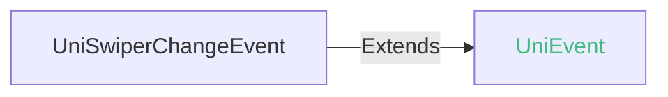
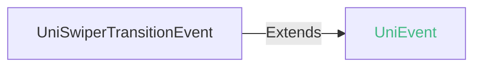
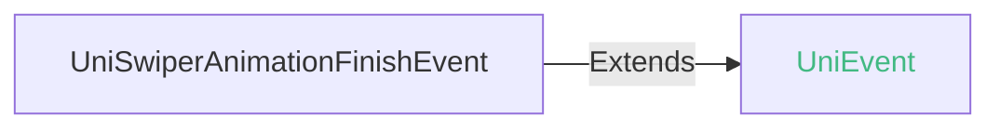

<!-- ## swiper -->

::: sourceCode
## swiper

> GitCode: https://gitcode.com/dcloud/uni-component/tree/alpha/uni_modules/uni-swiper


> GitHub: https://github.com/dcloudio/uni-component/tree/alpha/uni_modules/uni-swiper

:::

> 组件类型：UniSwiperElement 

 滑块视图容器


### 兼容性 <Help />
| Web | 微信小程序 | Android | iOS | HarmonyOS |
| :- | :- | :- | :- | :- |
| 4.0 | 4.41 | 3.9 | 4.11 | 4.61 |


### 属性 
| 名称 | 类型 | 默认值 | 兼容性 | 描述 |
| :- | :- | :- |  :-: | :- |
| indicator-dots | string \| boolean | false | Web: 4.0; 微信小程序: 4.41; Android: 3.9; iOS: 4.11; HarmonyOS: 4.61 | 是否显示面板指示点 |
| indicator-color | string([string.ColorString](/uts/data-type.md#ide-string)) | "rgba(0, 0, 0, .3)" | Web: 4.0; 微信小程序: 4.41; Android: 3.9; iOS: 4.11; HarmonyOS(VDOM): 4.61; HarmonyOS(Vapor): x | 指示点颜色，蒸汽模式推荐使用 indicator-style 定制指示点颜色 |
| indicator-active-color | string([string.ColorString](/uts/data-type.md#ide-string)) | "#000000" | Web: 4.0; 微信小程序: 4.41; Android: 3.9; iOS: 4.11; HarmonyOS(VDOM): 4.61; HarmonyOS(Vapor): x | 当前选中的指示点颜色，蒸汽模式推荐使用 indicator-active-style 定制指示点颜色 |
| active-class | string |   | Web: x; 微信小程序: x; Android: x; iOS: x; HarmonyOS: x | swiper-item 可见时的 class |
| changing-class | boolean |   | Web: x; 微信小程序: x; Android: x; iOS: x; HarmonyOS: x | acceleration 设置为 {{true}} 时且处于滑动过程中，中间若干屏处于可见时的class |
| acceleration | boolean |   | Web: x; 微信小程序: x; Android: x; iOS: x; HarmonyOS: x | 当开启时，会根据滑动速度，连续滑动多屏 |
| disable-programmatic-animation | boolean |   | Web: x; 微信小程序: x; Android: x; iOS: x; HarmonyOS: x | 是否禁用代码变动触发 swiper 切换时使用动画。 |
| disable-touch | string \| boolean | false | Web: 4.0; 微信小程序: x; Android: 3.9; iOS: 4.11; HarmonyOS: 4.61 | 是否禁止用户 touch 操作 |
| touchable | boolean |   | Web: x; 微信小程序: x; Android: x; iOS: x; HarmonyOS: x | 是否监听用户的触摸事件 |
| easing-function | string | "default" | Web: x; 微信小程序: 4.41; Android(VDOM): x; Android(Vapor): 5.21; iOS(VDOM): x; iOS(Vapor): 5.11; HarmonyOS: 4.61 | 指定 swiper 切换缓动动画类型，有效值：default、linear、easeInCubic、easeOutCubic、easeInOutCubic |
| autoplay | string \| boolean | false | Web: 4.0; 微信小程序: 4.41; Android: 3.9; iOS: 4.11; HarmonyOS: 4.61 | 是否自动切换 |
| current | number | 0 | Web: 4.0; 微信小程序: 4.41; Android: 3.9; iOS: 4.11; HarmonyOS: 4.61 | 当前所在滑块的 index |
| current-item-id | string |   | Web: 4.0; 微信小程序: x; Android: 3.9; iOS: 4.11; HarmonyOS: 4.61 | 当前所在滑块的 item-id ，不能与 current 被同时指定 |
| interval | number | 3000 | Web: 4.0; 微信小程序: 4.41; Android: 3.9; iOS: 4.11; HarmonyOS: 4.61 | 自动切换时间间隔 |
| duration | number | 500 | Web: 4.0; 微信小程序: 4.41; Android: 4.44; iOS(VDOM): x; iOS(Vapor): 5.11; HarmonyOS: 4.61 | 滑动动画时长（Android平台仅autoplay模式下生效） |
| circular | string \| boolean | false | Web: 4.0; 微信小程序: 4.41; Android: 3.9; iOS: 4.11; HarmonyOS: 4.61 | 是否采用衔接滑动 |
| vertical | string \| boolean | false | Web: 4.0; 微信小程序: 4.41; Android: 3.9; iOS: 4.11; HarmonyOS: 4.61 | 滑动方向是否为纵向 |
| rebound | boolean | true | Web: x; 微信小程序: x; Android: 3.9; iOS: 4.11; HarmonyOS: 4.61 | 控制是否回弹效果 |
| previous-margin | string | "0px" | Web: x; 微信小程序: 4.41; Android(VDOM): x; Android(Vapor): 5.21; iOS(VDOM): x; iOS(Vapor): 5.11; HarmonyOS: 4.61 | 前边距，可用于露出前一项的一小部分，接受 px 和 rpx 值 |
| next-margin | string | "0px" | Web: x; 微信小程序: 4.41; Android(VDOM): x; Android(Vapor): 5.21; iOS(VDOM): x; iOS(Vapor): 5.11; HarmonyOS: 4.61 | 后边距，可用于露出后一项的一小部分，接受 px 和 rpx 值 |
| display-multiple-items | number |   | Web: x; 微信小程序: 4.41; Android: x; iOS: x; HarmonyOS: x | 同时显示的滑块数量 |
| auto-height | string \| boolean | false | Web: x; 微信小程序: x; Android(VDOM): x; Android(Vapor): 5.21; iOS(VDOM): x; iOS(Vapor): 5.11; HarmonyOS(VDOM): x; HarmonyOS(Vapor): 5.0 | 自动高度。设置为 true 时，swiper 高度会随当前 item 的高度变化而变化。 |
| disable-bounce | string \| boolean | false | Web: x; 微信小程序: x; Android(VDOM): x; Android(Vapor): 5.21; iOS(VDOM): x; iOS(Vapor): 5.11; HarmonyOS(VDOM): x; HarmonyOS(Vapor): 5.0 | 控制是否回弹效果 |
| indicator-class | string([string.ClassString](/uts/data-type.md#ide-string)) |   | Web: x; 微信小程序: x; Android(VDOM): x; Android(Vapor): 5.21; iOS(VDOM): x; iOS(Vapor): 5.11; HarmonyOS(VDOM): x; HarmonyOS(Vapor): 5.0 | 指示点绑定的 class |
| indicator-active-class | string([string.ClassString](/uts/data-type.md#ide-string)) |   | Web: x; 微信小程序: x; Android(VDOM): x; Android(Vapor): 5.21; iOS(VDOM): x; iOS(Vapor): 5.11; HarmonyOS(VDOM): x; HarmonyOS(Vapor): 5.0 | 当前选中的指示点绑定的 class |
| indicator-style | string |   | Web: x; 微信小程序: x; Android(VDOM): x; Android(Vapor): 5.21; iOS(VDOM): x; iOS(Vapor): 5.11; HarmonyOS(VDOM): x; HarmonyOS(Vapor): 5.0 | 指示点样式 |
| indicator-active-style | string |   | Web: x; 微信小程序: x; Android(VDOM): x; Android(Vapor): 5.21; iOS(VDOM): x; iOS(Vapor): 5.11; HarmonyOS(VDOM): x; HarmonyOS(Vapor): 5.0 | 当前选中的指示点样式 |
| @change | (event: [UniSwiperChangeEvent](#uniswiperchangeevent)) => void |   | Web: 4.0; 微信小程序: 4.41; Android: 3.9; iOS: 4.11; HarmonyOS: 4.61 | current 改变时会触发 change 事件，event.detail = {current: current, source: source} |
| @transition | (event: [UniSwiperTransitionEvent](#uniswipertransitionevent)) => void |   | Web: 4.0; 微信小程序: 4.41; Android: 3.9; iOS: 4.11; HarmonyOS: 4.61 | swiper-item 的位置发生改变时会触发 transition 事件，event.detail = {dx: dx, dy: dy} |
| @animationfinish | (event: [UniSwiperAnimationFinishEvent](#uniswiperanimationfinishevent)) => void |   | Web: 4.0; 微信小程序: 4.41; Android: 3.9; iOS: 4.11; HarmonyOS: 4.61 | 动画结束时会触发 animationfinish 事件，event.detail = {current: current, source: source} |

#### easing-function 的属性描述

| 合法值 | 兼容性 |
| :- |  :-: |
| default | Web: x; 微信小程序: 4.41; Android: x; iOS: x; HarmonyOS: 4.61 |
| linear | Web: x; 微信小程序: 4.41; Android: x; iOS: x; HarmonyOS: 4.61 |
| easeInCubic | Web: x; 微信小程序: 4.41; Android: x; iOS: x; HarmonyOS(VDOM): 4.61; HarmonyOS(Vapor): x |
| easeOutCubic | Web: x; 微信小程序: 4.41; Android: x; iOS: x; HarmonyOS: 4.61 |
| easeInOutCubic | Web: x; 微信小程序: 4.41; Android: x; iOS: x; HarmonyOS(VDOM): 4.61; HarmonyOS(Vapor): x |


### 事件
#### UniSwiperChangeEvent


```mermaid
graph LR
  
UniSwiperChangeEvent -- Extends --> UniEvent
  style UniEvent color:#42b983
  click UniEvent "https://doc.dcloud.net.cn/uni-app-x/component/common.html#unievent"
```
##### UniSwiperChangeEvent 的属性值
| 名称 | 类型 | 必填 |
| :- | :- | :- |
| detail | **UniSwiperChangeEventDetail** | 是 |

#### detail 的属性描述

| 名称 | 类型 | 必备 | 兼容性 | 描述 |
| :- | :- | :- |  :-: | :- |
| current | number | 是 |   | 发生change事件的滑块下标 |
| currentItemId | string | 否 | Web: √; 微信小程序: 4.41; Android: x; iOS: x; HarmonyOS: 4.61 | 切换结束的 swiper-item 的 item-id 属性值 |
| source | string | 是 |   | autoplay 自动播放导致swiper变化；touch 用户划动引起swiper变化 |


#### UniSwiperTransitionEvent


```mermaid
graph LR
  
UniSwiperTransitionEvent -- Extends --> UniEvent
  style UniEvent color:#42b983
  click UniEvent "https://doc.dcloud.net.cn/uni-app-x/component/common.html#unievent"
```
##### UniSwiperTransitionEvent 的属性值
| 名称 | 类型 | 必填 |
| :- | :- | :- |
| detail | **UniSwiperTransitionEventDetail** | 是 |

#### detail 的属性描述

| 名称 | 类型 | 必备 | 描述 |
| :- | :- | :- | :- |
| dx | number | 是 | 横向偏移量，单位是逻辑像素px |
| dy | number | 是 | 纵向偏移量，单位是逻辑像素px |


#### UniSwiperAnimationFinishEvent


```mermaid
graph LR
  
UniSwiperAnimationFinishEvent -- Extends --> UniEvent
  style UniEvent color:#42b983
  click UniEvent "https://doc.dcloud.net.cn/uni-app-x/component/common.html#unievent"
```
##### UniSwiperAnimationFinishEvent 的属性值
| 名称 | 类型 | 必填 |
| :- | :- | :- |
| detail | **UniSwiperAnimationFinishEventDetail** | 是 |

#### detail 的属性描述

| 名称 | 类型 | 必备 | 兼容性 | 描述 |
| :- | :- | :- |  :-: | :- |
| current | number | 是 |   | 发生动画结束事件的滑块下标 |
| currentItemId | string | 否 | Web: √; 微信小程序: 4.41; Android: x; iOS: x; HarmonyOS: 4.61 | 动画结束的 swiper-item 的 item-id 属性值 |
| source | string | 是 |   | autoplay 自动播放导致swiper变化；touch 用户划动引起swiper变化 |


<!-- UTSCOMJSON.swiper.component_type-->

### 子组件 @children-tags
| 子组件 | 兼容性 |
| :- | :- |
| [swiper-item](swiper-item.md) | Web: 4.0; 微信小程序: 4.41; Android: 3.9; iOS: 4.11; HarmonyOS: 4.61 |

### 示例
示例为[hello uni-app x alpha分支](https://gitcode.com/dcloud/hello-uni-app-x/blob/prod_alpha/pages/component/swiper/swiper.uvue)，与最新HBuilderX Alpha版同步。与最新正式版同步的master分支示例[另见](https://gitcode.com/dcloud/hello-uni-app-x/blob/master//pages/component/swiper/swiper.uvue) 
::: preview https://hellouniappx.dcloud.net.cn/web/#/pages/component/swiper/swiper

> appRedirect https://hellouniappx.dcloud.net.cn/appredirect.html?path=pages/component/swiper/swiper

>示例
```vue
<template>
  <!-- #ifdef APP && !VUE3-VAPOR -->
  <scroll-view class="page-scroll-view uni-theme-root">
  <!-- #endif -->
    <view class="swiper-page uni-common-mb uni-common-pb uni-theme-root">
      <page-head title="swiper,可滑动视图"></page-head>
      <view>
        <!-- 微信小程序自身Bug，autoplay为false时更新interval会导致swiper启用自动播放 -->
        <swiper id="swiper-view" class="swiper" :vertical="data.verticalSelect" :indicator-dots="data.dotsSelect"
          :autoplay="data.autoplaySelect"
          <!-- #ifdef (APP && VUE3-VAPOR) -->
          :disable-bounce="data.disableBounceSelect"
          <!-- #endif -->
          <!-- #ifndef (APP && VUE3-VAPOR) -->
          :bounces="!data.disableBounceSelect"
          <!-- #endif -->
          :interval="data.intervalSelect" :circular="data.circularSelect"
          :duration="data.durationSelect" :indicator-color="data.indicatorColor" :indicator-active-color="data.indicatorColorActive"
          :disable-touch="data.disableTouchSelect" :current="data.currentVal" :current-item-id="data.currentItemIdVal"
          @change="swiperChange" @transition="swiperTransition" @animationfinish="swiperAnimationfinish"
          @touchstart="swipertouchStart">
          <swiper-item item-id="A">
            <view class="swiper-item uni-bg-red"><text class="swiper-item-Text" @touchstart="viewtouchStart">A</text>
            </view>
          </swiper-item>
          <swiper-item item-id="B">
            <view class="swiper-item uni-bg-green"><text class="swiper-item-Text">B</text></view>
          </swiper-item>
          <swiper-item item-id="C">
            <view class="swiper-item uni-bg-blue"><text class="swiper-item-Text">C</text></view>
          </swiper-item>
        </swiper>
      </view>
      <view class="uni-list">
        <view class="uni-list-cell uni-list-cell-padding">
          <view class="uni-list-cell-db"><text class="uni-theme-text">显示面板指示点</text></view>
          <switch :checked="data.dotsSelect" @change="dotsChange" />
        </view>
        <view class="uni-list-cell uni-list-cell-padding">
          <view class="uni-list-cell-db"><text class="uni-theme-text">定制指示器颜色</text></view>
          <switch :checked="data.indicatorColorSelect"
            <!-- #ifndef (APP && VUE3-VAPOR) -->
            :disabled="true"
            <!-- #endif -->
            @change="indicatorColorChange" />
        </view>
        <view class="uni-list-cell uni-list-cell-padding">
          <view class="uni-list-cell-db"><text class="uni-theme-text">禁止 touch 操作</text></view>
          <switch :checked="data.disableTouchSelect" @change="disableTouchChange" />
        </view>
        <view class="uni-list-cell uni-list-cell-padding">
          <view class="uni-list-cell-db"><text class="uni-theme-text">是否自动切换</text></view>
          <switch :checked="data.autoplaySelect" @change="autoplayChange" />
        </view>
        <view class="uni-list-cell uni-list-cell-padding">
          <view class="uni-list-cell-db"><text class="uni-theme-text">是否衔接滑动</text></view>
          <switch :checked="data.circularSelect" @change="circularChange" />
        </view>
        <view class="uni-title uni-list-cell-padding"><text class="uni-theme-text">间隔时间(毫秒)</text></view>
        <view class="uni-padding-wrap">
          <slider @change="sliderChange" :value="2000" :min="500" :max="5000" :show-value="true" />
        </view>
        <view class="uni-title uni-list-cell-padding"><text class="uni-theme-text">动画时长(毫秒)</text></view>
        <view class="uni-padding-wrap">
          <slider @change="durationSliderChange" :value="500" :min="50" :max="2000" :show-value="true" />
        </view>
        <view class="uni-list-cell uni-list-cell-padding">
          <view class="uni-list-cell-db"><text class="uni-theme-text">是否纵向滑动</text></view>
          <switch :checked="data.verticalSelect" @change="verticalChange" />
        </view>
        <!-- #ifndef MP-ALIPAY -->
        <view class="uni-list-cell uni-list-cell-padding">
          <view class="uni-list-cell-db"><text class="uni-theme-text">是否禁用回弹效果</text></view>
          <!-- 仅 android ios harmony 支持，web 微信小程序 bounces 为 true -->
          <switch :checked="data.disableBounceSelect" @change="disableBounceSelectChange" />
        </view>
        <!-- #endif -->
        <view class="uni-list-cell uni-list-cell-padding">
          <view class="uni-list-cell-db"><text class="uni-theme-text">指定current为最后一个元素</text></view>
          <switch :checked="data.currentSelect" @change="currentChange" />
        </view>
        <!-- #ifndef MP-ALIPAY -->
        <view class="uni-list-cell uni-list-cell-padding">
          <view class="uni-list-cell-db"><text class="uni-theme-text">指定current-item-id为最后一个元素</text></view>
          <switch :checked="data.currentItemIdSelect" @change="currentItemIdChange" />
        </view>
        <!-- #endif -->
        <view class="uni-list-cell uni-list-cell-padding">
          <view class="uni-list-cell-db"><text class="uni-theme-text">打印 swiperChange 日志</text></view>
          <switch :checked="data.swiperChangeSelect" @change="swiperChangeChange" />
        </view>
        <view class="uni-list-cell uni-list-cell-padding">
          <view class="uni-list-cell-db"><text class="uni-theme-text">1打印 swiperTransition 日志</text></view>
          <switch :checked="data.swiperTransitionSelect" @change="swiperTransitionChange" />
        </view>
        <view class="uni-list-cell uni-list-cell-padding">
          <view class="uni-list-cell-db"><text class="uni-theme-text">打印 swiperAnimationfinish 日志</text></view>
          <switch :checked="data.swiperAnimationfinishSelect" @change="swiperAnimationfinishChange" />
        </view>

        <view class="uni-list-cell-padding"><text class="uni-theme-text">测试 swiper 默认行为</text></view>
        <swiper class="swiper" :autoplay="data.autoplayForDefault" :circular="data.circularForDefault">
          <swiper-item item-id="A">
            <view class="swiper-item uni-bg-red"><text class="swiper-item-Text">A</text></view>
          </swiper-item>
          <swiper-item item-id="B">
            <view class="swiper-item uni-bg-green"><text class="swiper-item-Text">B</text></view>
          </swiper-item>
          <swiper-item item-id="C">
            <view class="swiper-item uni-bg-blue"><text class="swiper-item-Text">C</text></view>
          </swiper-item>
        </swiper>
        <view class="uni-list-cell uni-list-cell-padding">
          <view class="uni-list-cell-db"><text class="uni-theme-text">是否自动切换</text></view>
          <switch :checked="data.autoplayForDefault" @change="() => {data.autoplayForDefault = !data.autoplayForDefault}" />
        </view>
        <view class="uni-list-cell uni-list-cell-padding">
          <view class="uni-list-cell-db"><text class="uni-theme-text">是否衔接滑动</text></view>
          <switch :checked="data.circularForDefault" @change="() => {data.circularForDefault = !data.circularForDefault}" />
        </view>
        <!-- #ifndef MP -->
        <navigator url="/pages/component/swiper/swiper-list-view">
          <button type="primary">
            swiper 嵌套 list-view 测试
          </button>
        </navigator>
        <navigator url="/pages/component/swiper/swiper-anim" style="margin-top: 10px;">
        	<button type="primary">
        		swiper 动画测试
        	</button>
        </navigator>
        <!-- #endif -->
        <!-- #ifdef (APP && VUE3-VAPOR) || MP -->
        <navigator url="/pages/component/swiper/swiper-more" style="margin-top: 10px;">
        	<button type="primary">
        		更多 swiper
        	</button>
        </navigator>
        <navigator url="/pages/component/swiper/swiper-in-swiper" style="margin-top: 10px;">
          <button type="primary">嵌套测试</button>
        </navigator>
        <!-- #ifndef MP-ALIPAY -->
          <navigator url="/pages/component/swiper/swiper-item-100" style="margin-top: 10px;">
            <button>组件性能测试</button>
          </navigator>
        <!-- #endif -->
        <!-- #endif -->
      </view>
    </view>
  <!-- #ifdef APP && !VUE3-VAPOR -->
  </scroll-view>
  <!-- #endif -->
</template>

<script setup lang="uts">
  type SwiperEventTest = {
    type : string;
    target : UniElement | null;
    currentTarget : UniElement | null;
  }

  type DataType = {
    background: string[];
    dotsSelect: boolean;
    disableBounceSelect: boolean;
    autoplaySelect: boolean;
    circularSelect: boolean;
    indicatorColorSelect: boolean;
    verticalSelect: boolean;
    currentSelect: boolean;
    currentItemIdSelect: boolean;
    intervalSelect: number;
    durationSelect: number;
    indicatorColor: string;
    indicatorColorActive: string;
    currentVal: number;
    currentItemIdVal: string;
    disableTouchSelect: boolean;
    swiperTransitionSelect: boolean;
    swiperAnimationfinishSelect: boolean;
    swiperChangeSelect: boolean;
    currentValChange: number;
    autoplayForDefault: boolean;
    circularForDefault: boolean;
    // 自动化测试
    changeDetailTest: UniSwiperChangeEventDetail | null;
    transitionDetailTest: UniSwiperTransitionEventDetail | null;
    animationfinishDetailTest: UniSwiperAnimationFinishEventDetail | null;
    isChangeTest: string;
    isTransitionTest: string;
    isAnimationfinishTest: string;
    swipeX: number;
    swipeY: number;
  }

  // 使用reactive避免ref数据在自动化测试中无法访问
  const data = reactive({
    background: ['color1', 'color2', 'color3'],
    dotsSelect: false,
    disableBounceSelect: false,
    autoplaySelect: false,
    circularSelect: false,
    indicatorColorSelect: false,
    verticalSelect: false,
    currentSelect: false,
    currentItemIdSelect: false,
    intervalSelect: 2000,
    durationSelect: 500,
    indicatorColor: "",
    indicatorColorActive: "",
    currentVal: 0,
    currentItemIdVal: "",
    disableTouchSelect: false,
    swiperTransitionSelect: false,
    swiperAnimationfinishSelect: false,
    swiperChangeSelect: false,
    currentValChange: 0,
    autoplayForDefault: false,
    circularForDefault: false,
    // 自动化测试
    changeDetailTest: null as UniSwiperChangeEventDetail | null,
    transitionDetailTest: null as UniSwiperTransitionEventDetail | null,
    animationfinishDetailTest: null as UniSwiperAnimationFinishEventDetail | null,
    isChangeTest: '',
    isTransitionTest: '',
    isAnimationfinishTest: '',
    swipeX: 0,
    swipeY: 0
  } as DataType)

  onReady(() => {
    // #ifndef MP
    // 获取模拟滑动手势的起始点
    let ele = uni.getElementById("swiper-view")
    let eleRect = ele?.getBoundingClientRect()
    if (eleRect != null) {
      // 避开右侧边界，避免滑动行为响应为侧滑
      data.swipeX = eleRect.width - 40
      data.swipeY += eleRect.y + uni.getSystemInfoSync().safeArea.top + 44 + 35
    }
    // #endif
  })

  const swipertouchStart = (e : UniTouchEvent) => {
    console.log("swiper touchstart")
  }

  const viewtouchStart = (e : UniTouchEvent) => {
    console.log("view touchstart:")
  }

  // 自动化测试专用（由于事件event参数对象中存在循环引用，在ios端JSON.stringify报错，自动化测试无法page.data获取）
  const checkEventTest = (e : SwiperEventTest, eventName : String) => {
    // #ifndef MP
    const isPass = e.type === eventName && e.target instanceof UniElement && e.currentTarget instanceof UniElement;
    // #endif
    // #ifdef MP
    const isPass = true;
    // #endif
    const result = isPass ? `${eventName}:Success` : `${eventName}:Fail`;
    switch (eventName) {
      case 'change':
        data.isChangeTest = result
        break;
      case 'transition':
        data.isTransitionTest = result
        break;
      case 'animationfinish':
        data.isAnimationfinishTest = result
        break;
      default:
        break;
    }
  }


  const swiperChange = (e : UniSwiperChangeEvent) => {
    data.changeDetailTest = e.detail
    checkEventTest({
      type: e.type,
      target: e.target,
      currentTarget: e.currentTarget
    } as SwiperEventTest, 'change')
    data.currentValChange = e.detail.current
    console.log(data.currentValChange)
    if (data.swiperChangeSelect) {
      console.log("swiperChange", e)
    }
  }

  const swiperTransition = (e : UniSwiperTransitionEvent) => {
    data.transitionDetailTest = e.detail
    checkEventTest({
      type: e.type,
      target: e.target,
      currentTarget: e.currentTarget
    } as SwiperEventTest, 'transition')
    if (data.swiperTransitionSelect) {
      console.log("swiperTransition", e)
    }
  }

  const swiperAnimationfinish = (e : UniSwiperAnimationFinishEvent) => {
    data.animationfinishDetailTest = e.detail
    checkEventTest({
      type: e.type,
      target: e.target,
      currentTarget: e.currentTarget
    } as SwiperEventTest, 'animationfinish')
    if (data.swiperAnimationfinishSelect) {
      console.log("swiperAnimationfinish", e)
    }
  }

  //自动化测试例专用
  const jest_getSystemInfo = () : GetSystemInfoResult => {
    return uni.getSystemInfoSync();
  }


  const dotsChange = (e : UniSwitchChangeEvent) => {
    data.dotsSelect = e.detail.value
  }

  const swiperTransitionChange = (e : UniSwitchChangeEvent) => {
    data.swiperTransitionSelect = e.detail.value
  }

  const swiperChangeChange = (e : UniSwitchChangeEvent) => {
    data.swiperChangeSelect = e.detail.value
  }

  const swiperAnimationfinishChange = (e : UniSwitchChangeEvent) => {
    data.swiperAnimationfinishSelect = e.detail.value
  }

  const autoplayChange = (e : UniSwitchChangeEvent) => {
    data.autoplaySelect = e.detail.value
  }

  const verticalChange = (e : UniSwitchChangeEvent) => {
    data.verticalSelect = e.detail.value
  }

  const disableTouchChange = (e : UniSwitchChangeEvent) => {
    data.disableTouchSelect = e.detail.value
  }

  const currentItemIdChange = (e : UniSwitchChangeEvent) => {
    data.currentItemIdSelect = e.detail.value
    if (data.currentItemIdSelect) {
      data.currentItemIdVal = 'C'
    } else {
      data.currentItemIdVal = 'A'
    }
  }

  const currentChange = (e : UniSwitchChangeEvent) => {
    data.currentSelect = e.detail.value
    if (data.currentSelect) {
      data.currentVal = 2
    } else {
      data.currentVal = 0
    }
  }

  const circularChange = (e : UniSwitchChangeEvent) => {
    data.circularSelect = e.detail.value
    console.log(data.circularSelect)
  }

  const disableBounceSelectChange = (e : UniSwitchChangeEvent) => {
    data.disableBounceSelect = e.detail.value
    console.log(data.disableBounceSelect)
  }

  const sliderChange = (e : UniSliderChangeEvent) => {
    data.intervalSelect = e.detail.value
  }

  const durationSliderChange = (e : UniSliderChangeEvent) => {
    data.durationSelect = e.detail.value
  }

  const indicatorColorChange = (e : UniSwitchChangeEvent) => {
    data.indicatorColorSelect = e.detail.value
    if (data.indicatorColorSelect) {
      // 选择了定制指示器颜色
      data.indicatorColor = "#ff00ff"
      data.indicatorColorActive = "#0000ff"
    } else {
      // 没有选择颜色
      data.indicatorColor = ""
      data.indicatorColorActive = ""
    }
  }

  defineExpose({
    data,
    jest_getSystemInfo
  })
</script>

<style>
  .swiper {
    height: 150px;
  }

  .swiper-item {
    width: 100%;
    height: 150px;
  }

  .swiper-item-Text {
    width: 100%;
    text-align: center;
    line-height: 150px;
  }
</style>

```

:::

### 示例：swiper嵌套list-view

示例源码 [pages/component/swiper/swiper-list-view.uvue](https://gitcode.com/dcloud/hello-uni-app-x/blob/prod_alpha/pages/component/swiper/swiper-list-view.uvue)

```uvue
<template>
  <view class="swiper-list-page uni-theme-root">
    <view class="content-item">
      <text class="text">左右滑动页面，体验swiper嵌套list-view效果。</text>
    </view>
    <swiper style="flex: 1;" :current="data.currentVal" @change="swiperChange">
      <swiper-item v-for="index in 3">
        <list-view :id="'list'+index" style="flex: 1;  border: 3px solid lime;" refresher-enabled="true" @refresherrefresh="onRefresherrefresh"
          :refresher-triggered="data.refresherTriggeredArray[index-1]" :scroll-top="data.scrollTop">
          <sticky-section>
            <sticky-header>
              <text class="header">上下滑动体验吸顶效果 swiper-item{{index}}</text>
            </sticky-header>
            <list-item v-for="itemIndex in 40" :key="itemIndex" class="item">
              <text class="item-text">item----------{{itemIndex}}</text>
            </list-item>
          </sticky-section>
        </list-view>
      </swiper-item>
    </swiper>
  </view>
</template>

<script setup lang="uts">

type DataType = {
  swiperCurrentIndex: number,
  currentVal: number,
  scrollTop: number,
  refresherTriggeredArray: boolean[],
}

// 使用reactive包装数据，便于自动化测试获取
const data = reactive({
  swiperCurrentIndex: 0,
  currentVal: 0,
  scrollTop: 0,
  refresherTriggeredArray: [false, false, false] as boolean[],
} as DataType)

// Methods
function swiperChange(e : SwiperChangeEvent) {
  data.swiperCurrentIndex = e.detail.current
}

function onRefresherrefresh() {
  data.refresherTriggeredArray[data.swiperCurrentIndex] = true
  setTimeout(() => {
    data.refresherTriggeredArray[data.swiperCurrentIndex] = false
  }, 100)
}

defineExpose({
  data
})
</script>

<style>
  .item {
    padding: 15px;
    margin: 0 0 5px 0;
    background-color: var(--list-background-color, #fff);
    border-radius: 5px;
  }

  .text {
    font-size: 14px;
    color: var(--active-color, #666);
    line-height: 20px;
  }

  .content-item {
    padding: 15px;
    margin-bottom: 10px;
    background-color: var(--list-background-color, #fff);
  }

  .header {
    background-color: #ffaa00;
    padding: 15px;
    text-align: center;
    color: #fff;
  }

  .swiper-list-page {
    flex: 1;
  }

  .item-text {
    color: var(--text-color, #333333);
  }
</style>

```

### 示例：swiper更多用法

示例源码 [pages/component/swiper/swiper-more.uvue](https://gitcode.com/dcloud/hello-uni-app-x/blob/prod_alpha/pages/component/swiper/swiper-more.uvue)

```uvue
<template>
	<!-- #ifdef APP && !VUE3-VAPOR -->
	<scroll-view style="flex: 1;">
	<!-- #endif -->
	<view style="padding: 10px;">
		<text style="font-size: 18px; font-weight: bold; color: #333; margin-bottom: 10px;">Swiper组件演示</text>

		<view style="margin-bottom: 20px;">
			<text style="color: #666; margin-bottom: 10px;">不等高slider测试（Auto Height）harmony 微信小程序 无效：</text>
			<text style="color: #999; font-size: 12px; margin-bottom: 5px;">容器高度随当前slider内容自动调整</text>
			<swiper auto-height>
				<swiper-item>
					<view style="background-color: #ff6b6b; padding: 20px;">
						<view style="background-color: white; padding: 15px; border-radius: 8px;">
							<text style="color: #333; font-size: 16px; line-height: 24px;">短内容 - 高度约100px</text>
						</view>
					</view>
				</swiper-item>
				<swiper-item>
					<view style="background-color: #4ecdc4; padding: 20px;">
						<view style="background-color: white; padding: 15px; border-radius: 8px;">
							<text style="color: #333; font-size: 16px; line-height: 24px;">中等内容 - 高度约150px
这里有更多的文字来测试不同高度的slider是否能正常显示和切换。容器应该自动调整到这个高度。</text>
						</view>
					</view>
				</swiper-item>
				<swiper-item>
					<view style="background-color: #95e1d3; padding: 20px;">
						<view style="background-color: white; padding: 15px; border-radius: 8px;">
							<text style="color: #333; font-size: 16px; line-height: 24px;">长内容 - 高度约200px
这是一个高度较大的内容。这里有很多文字来测试不同高度的slider。
包含了更多的信息和描述内容，用于验证swiper在处理不等高内容时的表现。
容器高度应该自动调整到这个slider的高度。</text>
						</view>
					</view>
				</swiper-item>
			</swiper>
		</view>

		<view style="margin-bottom: 20px;">
			<text style="color: #666; margin-bottom: 10px;">基础用法（横向滑动，测试指示器可见性）：</text>
			<swiper style="height: 150px;" :indicator-dots="true">
				<swiper-item>
					<view style="width: 100%; height: 100%; background-color: #ff6b6b; align-items: center; justify-content: center;">
						<text style="color: white; font-size: 24px;">Item 1 红</text>
					</view>
				</swiper-item>
				<swiper-item>
					<view style="width: 100%; height: 100%; background-color: #fff; align-items: center; justify-content: center;">
						<text style="color: #333; font-size: 24px;">Item 2 白</text>
					</view>
				</swiper-item>
				<swiper-item>
					<view style="width: 100%; height: 100%; background-color: #000; align-items: center; justify-content: center;">
						<text style="color: white; font-size: 24px;">Item 3 黑</text>
					</view>
				</swiper-item>
			</swiper>
		</view>

		<view style="margin-bottom: 20px;">
			<text style="color: #666; margin-bottom: 10px;">3D卡片（previousMargin + nextMargin + circular），应用层实现缩放：</text>
			<swiper
				circular
				previous-margin="40px"
				next-margin="40px"
				style="height: 120px;"
				@change="handleScaleChange1"
			>
				<swiper-item>
					<view class="scale-card" :class="{'scale-card-active': scaleCurrentIndex1 == 0}">
						<view style="width: 100%; height: 100%; background-color: #e74c3c; align-items: center; justify-content: center; border-radius: 8px;">
							<text style="color: white; font-size: 20px;">A</text>
						</view>
					</view>
				</swiper-item>
				<swiper-item>
					<view class="scale-card" :class="{'scale-card-active': scaleCurrentIndex1 == 1}">
						<view style="width: 100%; height: 100%; background-color: #3498db; align-items: center; justify-content: center; border-radius: 8px;">
							<text style="color: white; font-size: 20px;">B</text>
						</view>
					</view>
				</swiper-item>
				<swiper-item>
					<view class="scale-card" :class="{'scale-card-active': scaleCurrentIndex1 == 2}">
						<view style="width: 100%; height: 100%; background-color: #2ecc71; align-items: center; justify-content: center; border-radius: 8px;">
							<text style="color: white; font-size: 20px;">C</text>
						</view>
					</view>
				</swiper-item>
			</swiper>
		</view>

		<view style="margin-bottom: 20px;">
			<text style="color: #666; margin-bottom: 10px;">3D卡片（previousMargin + nextMargin + circular），应用层实现缩放：</text>
			<swiper
				circular
				previous-margin="40px"
				next-margin="40px"
				style="height: 120px;"
				@change="handleScaleChange2"
			>
				<swiper-item>
					<view class="scale-card" :class="{'scale-card-active': scaleCurrentIndex2 == 0}">
						<view style="width: 100%; height: 100%; background-color: #e74c3c; align-items: center; justify-content: center; border-radius: 8px;">
							<text style="color: white; font-size: 20px;">A</text>
						</view>
					</view>
				</swiper-item>
				<swiper-item>
					<view class="scale-card" :class="{'scale-card-active': scaleCurrentIndex2 == 1}">
						<view style="width: 100%; height: 100%; background-color: #3498db; align-items: center; justify-content: center; border-radius: 8px;">
							<text style="color: white; font-size: 20px;">B</text>
						</view>
					</view>
				</swiper-item>
			</swiper>
		</view>

		<view style="margin-bottom: 20px;">
			<text style="color: #666; margin-bottom: 10px;">垂直滑动（vertical）：</text>
			<swiper vertical style="height: 200px;">
				<swiper-item>
					<view style="width: 100%; height: 100%; background-color: #8e44ad; align-items: center; justify-content: center;">
						<text style="color: white; font-size: 24px;">Vertical 1</text>
					</view>
				</swiper-item>
				<swiper-item>
					<view style="width: 100%; height: 100%; background-color: #2c3e50; align-items: center; justify-content: center;">
						<text style="color: white; font-size: 24px;">Vertical 2</text>
					</view>
				</swiper-item>
				<swiper-item>
					<view style="width: 100%; height: 100%; background-color: #e67e22; align-items: center; justify-content: center;">
						<text style="color: white; font-size: 24px;">Vertical 3</text>
					</view>
				</swiper-item>
			</swiper>
		</view>

		<!-- #ifndef MP-ALIPAY -->
		<view style="margin-bottom: 20px;">
			<text style="color: #666; margin-bottom: 10px;">垂直滑动（vertical）且开启 disable-rebound：</text>
			<swiper vertical :disable-bounce="true" style="height: 200px;">
				<swiper-item>
					<view style="width: 100%; height: 100%; background-color: #8e44ad; align-items: center; justify-content: center;">
						<text style="color: white; font-size: 24px;">Vertical 1</text>
					</view>
				</swiper-item>
				<swiper-item>
					<view style="width: 100%; height: 100%; background-color: #2c3e50; align-items: center; justify-content: center;">
						<text style="color: white; font-size: 24px;">Vertical 2</text>
					</view>
				</swiper-item>
				<swiper-item>
					<view style="width: 100%; height: 100%; background-color: #e67e22; align-items: center; justify-content: center;">
						<text style="color: white; font-size: 24px;">Vertical 3</text>
					</view>
				</swiper-item>
			</swiper>
		</view>
		<!-- #endif -->

		<view style="margin-bottom: 20px;">
			<text style="color: #666; margin-bottom: 10px;">垂直滑动（vertical）且开启 circular：</text>
			<swiper vertical circular style="height: 200px;">
				<swiper-item>
					<view style="width: 100%; height: 100%; background-color: #8e44ad; align-items: center; justify-content: center;">
						<text style="color: white; font-size: 24px;">Vertical 1</text>
					</view>
				</swiper-item>
				<swiper-item>
					<view style="width: 100%; height: 100%; background-color: #2c3e50; align-items: center; justify-content: center;">
						<text style="color: white; font-size: 24px;">Vertical 2</text>
					</view>
				</swiper-item>
				<swiper-item>
					<view style="width: 100%; height: 100%; background-color: #e67e22; align-items: center; justify-content: center;">
						<text style="color: white; font-size: 24px;">Vertical 3</text>
					</view>
				</swiper-item>
			</swiper>
		</view>

		<view style="margin-bottom: 20px;">
			<text style="color: #666; margin-bottom: 10px;">自动播放 + 循环（autoplay + circular）：</text>
			<swiper autoplay circular :interval="2000" style="height: 150px;">
				<swiper-item>
					<view style="width: 100%; height: 100%; background-color: #ee5a6f; align-items: center; justify-content: center;">
						<text style="color: white; font-size: 24px;">Auto 1</text>
					</view>
				</swiper-item>
				<swiper-item>
					<view style="width: 100%; height: 100%; background-color: #f368e0; align-items: center; justify-content: center;">
						<text style="color: white; font-size: 24px;">Auto 2</text>
					</view>
				</swiper-item>
				<swiper-item>
					<view style="width: 100%; height: 100%; background-color: #ff9ff3; align-items: center; justify-content: center;">
						<text style="color: white; font-size: 24px;">Auto 3</text>
					</view>
				</swiper-item>
			</swiper>
		</view>

		<view style="margin-bottom: 20px;">
			<text style="color: #666; margin-bottom: 10px;">2卡片 + 循环circular：</text>
			<swiper circular :interval="2000" style="height: 150px;">
				<swiper-item>
					<view style="width: 100%; height: 100%; background-color: #ee5a6f; align-items: center; justify-content: center;">
						<text style="color: white; font-size: 24px;">A</text>
					</view>
				</swiper-item>
				<swiper-item>
					<view style="width: 100%; height: 100%; background-color: #f368e0; align-items: center; justify-content: center;">
						<text style="color: white; font-size: 24px;">B</text>
					</view>
				</swiper-item>
			</swiper>
		</view>

		<!-- #ifndef MP-ALIPAY -->
		<view style="margin-bottom: 20px;">
			<text style="color: #666; margin-bottom: 10px;">指示器短横线样式（item-style）：</text>
			<swiper style="height: 150px;" :indicator-dots="true" indicator-style="width: 20px; height: 3px; border-radius: 2px;">
				<swiper-item>
					<view style="width: 100%; height: 100%; background-color: #9b59b6; align-items: center; justify-content: center;">
						<text style="color: white; font-size: 24px;">Line 1</text>
					</view>
				</swiper-item>
				<swiper-item>
					<view style="width: 100%; height: 100%; background-color: #ffffff; align-items: center; justify-content: center;">
						<text style="color: black; font-size: 24px;">Line 2</text>
					</view>
				</swiper-item>
				<swiper-item>
					<view style="width: 100%; height: 100%; background-color: #000000; align-items: center; justify-content: center;">
						<text style="color: white; font-size: 24px;">Line 3</text>
					</view>
				</swiper-item>
			</swiper>
		</view>

		<view style="margin-bottom: 20px;">
			<text style="color: #666; margin-bottom: 10px;">高亮指示器加长（item-active-style）：</text>
			<swiper style="height: 150px;" :indicator-dots="true" indicator-style="width: 8px; height: 8px;" indicator-active-style="width: 12px; height: 8px;">
				<swiper-item>
					<view style="width: 100%; height: 100%; background-color: #e84118; align-items: center; justify-content: center;">
						<text style="color: white; font-size: 24px;">Scale 1</text>
					</view>
				</swiper-item>
				<swiper-item>
					<view style="width: 100%; height: 100%; background-color: #c23616; align-items: center; justify-content: center;">
						<text style="color: white; font-size: 24px;">Scale 2</text>
					</view>
				</swiper-item>
			</swiper>
		</view>

		<view style="margin-bottom: 20px;">
			<text style="color: #666; margin-bottom: 10px;">指示器class定制（item-class + item-active-class）：</text>
			<swiper style="height: 150px;" :indicator-dots="true" indicator-class="custom-item" indicator-active-class="custom-item-active">
				<swiper-item>
					<view style="width: 100%; height: 100%; background-color: #f39c12; align-items: center; justify-content: center;">
						<text style="color: white; font-size: 24px;">Class 1</text>
					</view>
				</swiper-item>
				<swiper-item>
					<view style="width: 100%; height: 100%; background-color: #d35400; align-items: center; justify-content: center;">
						<text style="color: white; font-size: 24px;">Class 2</text>
					</view>
				</swiper-item>
			</swiper>
		</view>

		<view style="margin-bottom: 20px;">
			<text style="color: #666; margin-bottom: 10px;">指示器样式定制（item-style + item-active-style）：</text>
			<swiper style="height: 150px;" :indicator-dots="true" indicator-style="width: 16px; height: 4px; border-radius: 2px; background-color: rgba(100, 100, 255, 0.5);" indicator-active-style="width: 24px; background-color: rgba(100, 100, 255, 1);">
				<swiper-item>
					<view style="width: 100%; height: 100%; background-color: #8e44ad; align-items: center; justify-content: center;">
						<text style="color: white; font-size: 24px;">Style 1</text>
					</view>
				</swiper-item>
				<swiper-item>
					<view style="width: 100%; height: 100%; background-color: #9b59b6; align-items: center; justify-content: center;">
						<text style="color: white; font-size: 24px;">Style 2</text>
					</view>
				</swiper-item>
			</swiper>
		</view>
		<!-- #endif -->

		<view style="margin-bottom: 20px;">
			<text style="color: #666; margin-bottom: 10px;">事件监听（@change、@transition、@animationfinish）：</text>
			<text style="color: #999; font-size: 12px; margin-bottom: 5px;">当前索引: {{eventCurrentIndex}}</text>
			<text style="color: #999; font-size: 12px; margin-bottom: 5px;">上次触发: {{eventSource}}</text>
			<text style="color: #999; font-size: 12px; margin-bottom: 5px;">过渡位置: dx={{transitionDx}}, dy={{transitionDy}}</text>
			<swiper
				@change="handleChange"
				@transition="handleTransition"
				@animationfinish="handleAnimationFinish"
				style="height: 150px;"
			>
				<swiper-item>
					<view style="width: 100%; height: 100%; background-color: #2d3436; align-items: center; justify-content: center;">
						<text style="color: white; font-size: 24px;">Event 1</text>
					</view>
				</swiper-item>
				<swiper-item>
					<view style="width: 100%; height: 100%; background-color: #636e72; align-items: center; justify-content: center;">
						<text style="color: white; font-size: 24px;">Event 2</text>
					</view>
				</swiper-item>
				<swiper-item>
					<view style="width: 100%; height: 100%; background-color: #b2bec3; align-items: center; justify-content: center;">
						<text style="color: white; font-size: 24px;">Event 3</text>
					</view>
				</swiper-item>
			</swiper>
		</view>

		<!-- #ifndef MP-ALIPAY -->
		<view style="margin-bottom: 20px;">
			<text style="color: #666; margin-bottom: 10px;">自定义数字指示器（slot）：</text>
			<swiper @change="handleCustomIndicatorChange" style="height: 150px;">
				<swiper-item>
					<view style="width: 100%; height: 100%; background-color: #16a085; align-items: center; justify-content: center;">
						<text style="color: white; font-size: 24px;">Custom 1</text>
					</view>
				</swiper-item>
				<swiper-item>
					<view style="width: 100%; height: 100%; background-color: #ffffff; align-items: center; justify-content: center;">
						<text style="color: black; font-size: 24px;">Custom 2</text>
					</view>
				</swiper-item>
				<swiper-item>
					<view style="width: 100%; height: 100%; background-color: #000000; align-items: center; justify-content: center;">
						<text style="color: white; font-size: 24px;">Custom 3</text>
					</view>
				</swiper-item>
				<template v-slot:indicator>
					<view style="position: absolute; bottom: 10px; right: 10px; background-color: rgba(0,0,0,0.6); padding: 4px 12px; border-radius: 12px;">
						<text style="color: white; font-size: 14px; font-weight: bold;">{{customIndicatorIndex + 1}}/{{customIndicatorTotal}}</text>
					</view>
				</template>
			</swiper>
		</view>
		<!-- #endif -->

		<!-- #ifndef MP-ALIPAY -->
		<view style="margin-bottom: 20px;">
			<text style="color: #666; margin-bottom: 10px;">自定义指示器并绑定点击事件(仅web支持点击)：</text>
			<swiper :current='customIndicatorCurrent' style="height: 150px;" @change="handleCustomIndicatorHandleClickChange">
				<swiper-item>
					<view style="width: 100%; height: 100%; background-color: #16a085; align-items: center; justify-content: center;">
						<text style="color: white; font-size: 24px;">Custom 1</text>
					</view>
				</swiper-item>
				<swiper-item>
					<view style="width: 100%; height: 100%; background-color: #ffffff; align-items: center; justify-content: center;">
						<text style="color: black; font-size: 24px;">Custom 2</text>
					</view>
				</swiper-item>
				<swiper-item>
					<view style="width: 100%; height: 100%; background-color: #000000; align-items: center; justify-content: center;">
						<text style="color: white; font-size: 24px;">Custom 3</text>
					</view>
				</swiper-item>
				<template v-slot:indicator>
					<view v-for="item in 3" style="margin: 0 10px;">
						<text class="custom-indicator-text" :class="{ 'active': customIndicatorCurrent == item - 1 }" @click="handleCustomIndicatorClick(item - 1)">{{item - 1}}</text>
					</view>
				</template>
			</swiper>
		</view>
		<!-- #endif -->

		<!-- #ifndef MP-ALIPAY -->
		<view style="margin-bottom: 20px;">
			<text style="color: #666; margin-bottom: 10px;">circular 和 disabled-bounce 同时设置：</text>
			<text style="color: #999; font-size: 12px; margin-bottom: 5px;">以circular为优先</text>
			<swiper :disable-bounce="false" :circular="true" style="height: 150px;">
				<swiper-item>
					<view style="width: 100%; height: 100%; background-color: #3742fa; align-items: center; justify-content: center;">
						<text style="color: white; font-size: 24px;">Rebound 1</text>
					</view>
				</swiper-item>
				<swiper-item>
					<view style="width: 100%; height: 100%; background-color: #5352ed; align-items: center; justify-content: center;">
						<text style="color: white; font-size: 24px;">Rebound 2</text>
					</view>
				</swiper-item>
				<swiper-item>
					<view style="width: 100%; height: 100%; background-color: #a29bfe; align-items: center; justify-content: center;">
						<text style="color: white; font-size: 24px;">Rebound 3</text>
					</view>
				</swiper-item>
			</swiper>
		</view>
		<!-- #endif -->
	</view>
	<!-- #ifdef APP && !VUE3-VAPOR -->
	</scroll-view>
	<!-- #endif -->
</template>

<script setup lang="uts">
	import { ref } from 'vue'

	const scaleCurrentIndex1 = ref<number>(0)
	const scaleCurrentIndex2 = ref<number>(0)


	const eventCurrentIndex = ref<number>(0)
	const eventSource = ref<string>('none')
	const transitionDx = ref<number>(0)
	const transitionDy = ref<number>(0)

	const customIndicatorIndex = ref<number>(0)
	const customIndicatorTotal = ref<number>(3)
	const customIndicatorCurrent = ref<number>(0)

	const handleScaleChange1 = (e: UniSwiperChangeEvent) => {
		scaleCurrentIndex1.value = e.detail.current
	}
	const handleScaleChange2 = (e: UniSwiperChangeEvent) => {
		scaleCurrentIndex2.value = e.detail.current
	}

	const handleChange = (e: UniSwiperChangeEvent) => {
		eventCurrentIndex.value = e.detail.current
		eventSource.value = 'change-' + e.detail.source
	}

	const handleTransition = (e: UniSwiperTransitionEvent) => {
		transitionDx.value = Math.round(e.detail.dx)
		transitionDy.value = Math.round(e.detail.dy)
	}

	const handleAnimationFinish = (e: UniSwiperAnimationFinishEvent) => {
		eventSource.value = 'animationfinish-' + e.detail.source
	}

	const handleCustomIndicatorChange = (e: UniSwiperChangeEvent) => {
		customIndicatorIndex.value = e.detail.current
	}
	const handleCustomIndicatorHandleClickChange = (e: UniSwiperChangeEvent) => {
		customIndicatorCurrent.value = e.detail.current
	}
	const handleCustomIndicatorClick = (index: number) => {
		customIndicatorCurrent.value = index
	}
</script>

<style>
	.scale-card {
		width: 100%;
		height: 100%;
		align-items: center;
		justify-content: center;
		transform: scale(0.9);
		opacity: 0.7;
		transition: all 300ms ease;
	}

	.scale-card-active {
		transform: scale(1);
		opacity: 1;
	}

	.custom-item {
		width: 16px;
		height: 4px;
		border-radius: 2px;
		background-color: rgba(255, 165, 0, 0.5);
	}

	.custom-item-active {
		width: 24px;
		background-color: rgba(255, 165, 0, 1);
	}
	.custom-indicator-text {
		padding: 10px;
		font-size: 14px;
		color: #ccc;
	}
	.custom-indicator-text.active {
		font-size: 18px;
		color: yellow;
		font-weight: bold;
	}
</style>

```

**平台差异**

- web、小程序、app-harmony 端的swiper-item为绝对定位，无法撑开swiper。所以swiper组件的默认高度为150px。
- app-android和iOS的swiper目前默认会以内容高度撑开作为其高度。如果要多端拉齐应自行设置swiper的style里的高度。后续Android和iOS的swiper也会统一为其他平台的方式。

:::warning 注意
- 使用 `auto-height` 属性时，`swiper-item` 组件外层容器和 slot 内容之间会增加一层 `view`，这会导致设置在 `swiper-item` 上的布局样式无法直接影响插槽内的元素（比如 `align-items: center`），请注意避免影响布局。
- 蒸汽模式不再支持 `rebound` 属性，如需控制是否回弹效果，请使用 `disable-bounce` 属性。
- 蒸汽模式不再支持 `indicator-color` 和 `indicator-active-color` 属性，如需自定义指示点颜色及其他样式，请使用 `indicator-style`、`indicator-class` 和 `indicator-active-style`、`indicator-active-class` 属性。
- 蒸汽模式新增通过 `<template v-slot:indicator>` 具名插槽自定义指示点，示例代码如下：
:::
```vue
<template>
	<swiper :current="current" @change="handleSwiperChange">
		<swiper-item>
			<view style="height: 100%; align-items: center; justify-content: center; background-color: #16a085;">
				<text style="color: white;">Item 1</text>
			</view>
		</swiper-item>
		<swiper-item>
			<view style="height: 100%; align-items: center; justify-content: center; background-color: #cccccc;">
				<text style="color: black;">Item 2</text>
			</view>
		</swiper-item>
		<swiper-item>
			<view style="height: 100%; align-items: center; justify-content: center; background-color: #00cc00;">
				<text style="color: white;">Item 3</text>
			</view>
		</swiper-item>
		<template v-slot:indicator>
			<text v-for="(_, index) in 3" class="custom-indicator-text" :class="{ 'active': current === index }">{{index + 1}}</text>
		</template>
	</swiper>
</template>

<script setup lang="uts">
	const current = ref(0)

	const handleSwiperChange = (e : UniSwiperChangeEvent) => {
		current.value = e.detail.current
	}
</script>

<style>
	.custom-indicator-text {
		margin: 0 5px;
	}

	.custom-indicator-text.active {
		font-size: 18px;
		color: yellow;
		font-weight: bold;
	}
</style>
```


## swiper-item

> 组件类型：UniSwiperItemElement 

 swiper的唯一合法子组件。每个swiper-item代表一个滑块。宽高自动设置为100%


### 兼容性 <Help />
| Web | 微信小程序 | Android | iOS | HarmonyOS |
| :- | :- | :- | :- | :- |
| 4.0 | 4.41 | 3.9 | 4.11 | 4.61 |


### 属性 
| 名称 | 类型 | 兼容性 | 描述 |
| :- | :- |  :-: | :- |
| item-id | string | Web: 4.0; 微信小程序: 4.41; Android: 3.9; iOS: 4.11; HarmonyOS: 4.61 | 该 swiper-item 的标识符 |
| skip-hidden-item-layout | boolean | Web: x; 微信小程序: 4.41; Android: x; iOS: x; HarmonyOS: x | *(boolean)*<br/>是否跳过未显示的滑块布局，设为 true 可优化复杂情况下的滑动性能，但会丢失隐藏状态滑块的布局信息 |


<!-- UTSCOMJSON.swiper-item.component_type-->


### 参见
- [相关 Bug](https://issues.dcloud.net.cn/?mid=component.view-container.swiper.swiper-item)
- [参见uni-app相关文档](https://uniapp.dcloud.net.cn/component/swiper.html#swiper-item)
- [微信小程序文档](https://developers.weixin.qq.com/miniprogram/dev/component/swiper-item.html)
- [支付宝小程序文档](https://open.alipay.com/portal/zhichi/search?keyword=swiper-item&pageIndex=1&pageSize=10&source=doc_top&type=all)
- [百度小程序文档](https://smartprogram.baidu.com/forum/search?query=swiper-item&scope=devdocs&source=docs)
- [抖音小程序文档](https://developer.open-douyin.com/search-page?keyword=swiper-item&secondType=all&type=1)
- [飞书小程序文档](https://open.feishu.cn/search?from=header&page=1&pageSize=10&q=swiper-item&topicFilter=)
- [钉钉小程序文档](https://open.dingtalk.com/search?keyword=swiper-item)
- [QQ小程序文档](https://q.qq.com/wiki/develop/miniprogram/frame/)
- [快手小程序文档](https://developers.kuaishou.com/page?keyword=swiper-item&from=docs)
- [京东小程序文档](https://mp-docs.jd.com/doc/dev/framework/-1)
- [华为快应用文档](https://developer.huawei.com/consumer/cn/doc/quickApp-References/webview-frame-overview-0000001124793625)
- [360小程序文档](https://mp.360.cn/doc/miniprogram/dev/#/b770a184ff1f06c6b3393a0fd1132380)
