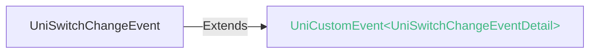

<!-- ## switch -->

::: sourceCode
## switch
:::

> 组件类型：UniSwitchElement 

 开关选择器


### 兼容性
| Web | 微信小程序 | Android | iOS | HarmonyOS | HarmonyOS(Vapor) |
| :- | :- | :- | :- | :- | :- |
| 4.0 | 4.41 | 3.9 | 4.11 | 4.61 | 5.0 |


### 属性 
| 名称 | 类型 | 默认值 | 兼容性 | 描述 |
| :- | :- | :- |  :-: | :- |
| name | string | - | Web: 4.0; 微信小程序: 4.41; Android: 3.9; iOS: 4.11; HarmonyOS: 4.61; HarmonyOS(Vapor): 5.0 | 表单的控件名称，作为键值对的一部分与表单(form组件)一同提交 |
| checked | boolean | - | Web: 4.0; 微信小程序: 4.41; Android: 3.9; iOS: 4.11; HarmonyOS: 4.61; HarmonyOS(Vapor): 5.0 | 当前是否选中，可用来设置默认选中 |
| type | string | - | Web: 4.0; 微信小程序: 4.41; Android: x; iOS: x; HarmonyOS: x; HarmonyOS(Vapor): - | 样式，有效值：switch, checkbox |
| ~~color~~ | string([string.ColorString](/uts/data-type.md#ide-string)) | - | Web: 4.0; 微信小程序: 4.41; Android: 3.9; iOS: 4.11; HarmonyOS: 4.61; HarmonyOS(Vapor): - | switch 的颜色，同 css 的 color (使用foreColor替代) |
| backgroundColor | string([string.ColorString](/uts/data-type.md#ide-string)) | - | Web: 4.18; 微信小程序: x; Android: 4.18; iOS: 4.18; HarmonyOS: 4.61; HarmonyOS(Vapor): - | switch 的关闭状态背景颜色 |
| activeBackgroundColor | string([string.ColorString](/uts/data-type.md#ide-string)) | - | Web: 4.18; 微信小程序: x; Android: 4.18; iOS: 4.18; HarmonyOS: 4.61; HarmonyOS(Vapor): - | switch 的开启状态背景颜色 |
| foreColor | string([string.ColorString](/uts/data-type.md#ide-string)) | - | Web: 4.18; 微信小程序: x; Android: 4.18; iOS: 4.18; HarmonyOS: 4.61; HarmonyOS(Vapor): - | switch 的滑块背景颜色 |
| activeForeColor | string([string.ColorString](/uts/data-type.md#ide-string)) | - | Web: 4.18; 微信小程序: x; Android: 4.18; iOS: 4.18; HarmonyOS: 4.61; HarmonyOS(Vapor): - | switch 的开启状态下的滑块背景颜色 |
| disabled | boolean | - | Web: 4.0; 微信小程序: 4.41; Android: 3.9; iOS: 4.11; HarmonyOS: 4.61; HarmonyOS(Vapor): 5.0 | 是否禁用 |
| thumb-class | [string.ClassString](/uts/data-type.md#ide-string) | - | Web: -; 微信小程序: -; Android: -; iOS: -; HarmonyOS: -; HarmonyOS(Vapor): 5.0 | 开关选择器滑块的类名 |
| thumb-active-class | [string.ClassString](/uts/data-type.md#ide-string) | - | Web: -; 微信小程序: -; Android: -; iOS: -; HarmonyOS: -; HarmonyOS(Vapor): 5.0 | 开关选择器滑块选中的类名 |
| switch-active-class | [string.ClassString](/uts/data-type.md#ide-string) | - | Web: -; 微信小程序: -; Android: -; iOS: -; HarmonyOS: -; HarmonyOS(Vapor): 5.0 | 开关选择器选中的类名 |
| @change | (event: [UniSwitchChangeEvent](#uniswitchchangeevent)) => void | - | Web: 4.0; 微信小程序: 4.41; Android: 3.9; iOS: 4.11; HarmonyOS: 4.61; HarmonyOS(Vapor): 5.0 | checked 改变时触发 change 事件，event.detail={ value:checked} |

#### type 的属性描述

| 合法值 | 兼容性 | 描述 |
| :- |  :-: | :- |
| switch | Web: 4.0; 微信小程序: 4.41; Android: x; iOS: x; HarmonyOS: -; HarmonyOS(Vapor): - | - |
| checkbox | Web: 4.0; 微信小程序: 4.41; Android: x; iOS: x; HarmonyOS: -; HarmonyOS(Vapor): - | - |

type为checkbox只有微信小程序和Web平台支持。一般建议使用标准的[checkbox组件](checkbox-group.md)


### 事件
#### UniSwitchChangeEvent


##### UniSwitchChangeEventDetail


###### UniSwitchChangeEventDetail 的属性值
| 名称 | 类型 | 必填 | 默认值 | 兼容性 | 描述 |
| :- | :- | :- | :- |  :-: | :- |
| value | boolean | 是 | - | - | - |


<!-- UTSCOMJSON.switch.component_type-->


### 注意事项：
- app-ios平台不支持padding style（padding-top、padding-left、padding-right、padding-bottom）
### 示例
示例为[hello uni-app x alpha分支](https://gitcode.com/dcloud/hello-uni-app-x/blob/prod_alpha/pages/component/switch/switch.uvue)，与最新HBuilderX Alpha版同步。与最新正式版同步的master分支示例[另见](https://gitcode.com/dcloud/hello-uni-app-x/blob/master//pages/component/switch/switch.uvue) 
::: preview https://hellouniappx.dcloud.net.cn/web/#/pages/component/switch/switch

> appRedirect https://hellouniappx.dcloud.net.cn/appredirect.html?path=pages/component/switch/switch

>示例
```vue
<template>
  <view>
    <view class="uni-padding-wrap uni-common-mt">
      <view class="uni-title">默认样式</view>
      <view class="flex-row">
        <switch class="switch-checked" :checked="data.checked" @change="switch1Change" />
        <switch @change="switch2Change" />
      </view>
      <view class="uni-title">暗黑样式</view>
      <view class="flex-row">
        <!-- #ifndef VUE3-VAPOR -->
        <switch id="darkChecked" background-color="#1f1f1f" activeBackgroundColor="#007aff" foreColor="#f0f0f0"
          activeForeColor="#ffffff" :checked="data.checked" />
        <switch id="dark" background-color="#1f1f1f" activeBackgroundColor="#007aff" foreColor="#f0f0f0"
          activeForeColor="#ffffff" />
        <!-- #endif -->
        <!-- #ifdef VUE3-VAPOR -->
        <switch id="darkChecked" :class="{ 'dark-class': !data.darkChecked1 }" switch-active-class="custom-switch-active" thumb-active-class="custom-thumb-active1" thumb-class="custom-thumb1" :checked="data.checked" @change="switch3Change" />
        <switch id="dark" :class="{ 'dark-class': !data.darkChecked2 }" switch-active-class="custom-switch-active" thumb-active-class="custom-thumb-active1" thumb-class="custom-thumb1" @change="switch4Change" />
        <!-- #endif -->
      </view>
      <view class="uni-title">禁用样式</view>
      <view class="flex-row">
        <switch class="switch-checked" :checked="data.checked" :disabled="true" />
        <switch :disabled="true" />
      </view>
      <view class="uni-title">不同颜色和尺寸的switch</view>
      <view class="flex-row">
        <!-- #ifndef VUE3-VAPOR -->
        <switch class="switch-color-checked" :color="data.color" style="transform:scale(0.7)" :checked="true" />
        <switch class="switch-color" :color="data.color" style="transform:scale(0.7)" />
        <!-- #endif -->
        <!-- #ifdef VUE3-VAPOR -->
        <switch switch-active-class="custom-switch-active-color" style="transform:scale(0.7)" :checked="true" />
        <switch switch-active-class="custom-switch-active-color" style="transform:scale(0.7)" />
        <!-- #endif -->
      </view>
      <view class="uni-title">推荐展示样式</view>
    </view>
    <view class="uni-list">
      <view class="uni-list-cell uni-list-cell-padding">
        <view class="uni-list-cell-db">开启中</view>
        <switch :checked="true" />
      </view>
      <view class="uni-list-cell uni-list-cell-padding">
        <view class="uni-list-cell-db">关闭</view>
        <switch />
      </view>

      <!-- #ifdef VUE3-VAPOR -->
      <view class="uni-list-cell uni-list-cell-padding">
        <view class="uni-list-cell-db">自定义 thumb 样式</view>
        <switch thumb-class="custom-thumb" thumb-active-class="custom-thumb-active"  />
      </view>
      <!-- #endif -->
    </view>

    <navigator class="uni-common-mb" url="/pages/template/switch-100/switch-100">
      <button>组件性能测试</button>
    </navigator>
  </view>
</template>

<script setup lang="uts">
  type DataType = {
    title: string;
    checked: boolean;
    // #ifdef VUE3-VAPOR
    darkChecked1: boolean;
    darkChecked2: boolean;
    // #endif
    color: string;
    clickCheckedValue: boolean;
    testVerifyEvent: boolean;
  }
  // 使用reactive避免ref数据在自动化测试中无法访问
  const data = reactive({
    title: 'switch 开关',
    checked: true,
    // #ifdef VUE3-VAPOR
    darkChecked1: true,
    darkChecked2: false,
    // #endif
    color: '#FFCC33',
    clickCheckedValue: true,
    testVerifyEvent: false
  } as DataType)

  const switch1Change = (e: UniSwitchChangeEvent) => {
    data.clickCheckedValue = e.detail.value
    console.log('switch1 发生 change 事件，携带值为', e.detail.value)
    // 仅测试
    data.testVerifyEvent = (e.type == 'change' && (e.target?.tagName ?? '') == "SWITCH")
  }

  const switch2Change = (e: UniSwitchChangeEvent) => {
    console.log('switch2 发生 change 事件，携带值为', e.detail.value)
  }

  // #ifdef VUE3-VAPOR
  const switch3Change = (e: UniSwitchChangeEvent) => {
    data.darkChecked1 = e.detail.value
  }

  const switch4Change = (e: UniSwitchChangeEvent) => {
    data.darkChecked2 = e.detail.value
  }
  // #endif

  defineExpose({
    data
  })
</script>

<style>
  .flex-row {
    flex-direction: row;
  }

  /* #ifdef VUE3-VAPOR */
  .dark-class {
    background-color: #1f1f1f;
    border-color: #1f1f1f;
  }

  .custom-switch-active {
    background-color: #007aff;
    border-color: #007aff;
  }

  .custom-switch-active-color {
    background-color: #FFCC33;
    border-color: #FFCC33;
  }

  .custom-thumb-active1 {
    background-color: #ffffff;
  }

  .custom-thumb {
    background-color: #f0f0f0;
  }

  .custom-thumb {
    background-color: #007aff;
  }

  .custom-thumb-active {
    background-color: #e64340;
  }
  /* #endif */
</style>

```

:::


### 参见
- [相关 Bug](https://issues.dcloud.net.cn/?mid=component.form-component.switch)
- [参见uni-app相关文档](https://uniapp.dcloud.io/component/switch.html)
- [微信小程序文档](https://developers.weixin.qq.com/miniprogram/dev/component/switch.html)
- [支付宝小程序文档](https://open.alipay.com/portal/zhichi/search?keyword=switch&pageIndex=1&pageSize=10&source=doc_top&type=all)
- [百度小程序文档](https://smartprogram.baidu.com/forum/search?query=switch&scope=devdocs&source=docs)
- [抖音小程序文档](https://developer.open-douyin.com/search-page?keyword=switch&secondType=all&type=1)
- [飞书小程序文档](https://open.feishu.cn/search?from=header&page=1&pageSize=10&q=switch&topicFilter=)
- [钉钉小程序文档](https://open.dingtalk.com/search?keyword=switch)
- [QQ小程序文档](https://q.qq.com/wiki/develop/miniprogram/frame/)
- [快手小程序文档](https://developers.kuaishou.com/page?keyword=switch&from=docs)
- [京东小程序文档](https://mp-docs.jd.com/doc/dev/framework/-1)
- [华为快应用文档](https://developer.huawei.com/consumer/cn/doc/quickApp-References/webview-frame-overview-0000001124793625)
- [360小程序文档](https://mp.360.cn/doc/miniprogram/dev/#/b770a184ff1f06c6b3393a0fd1132380)
