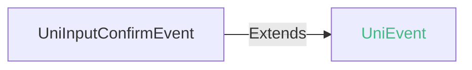
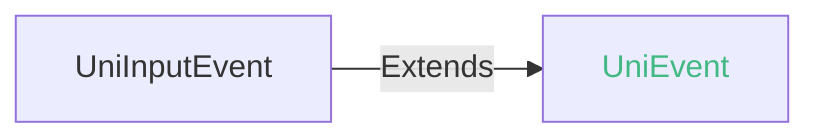
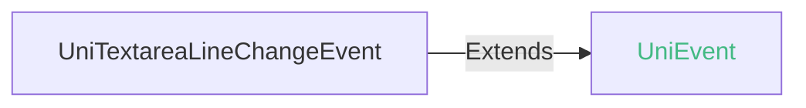
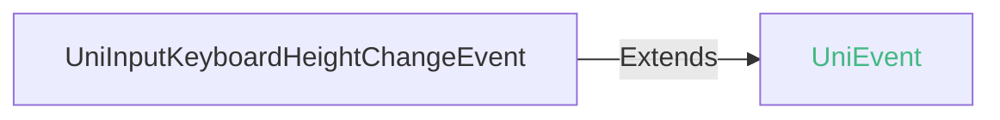
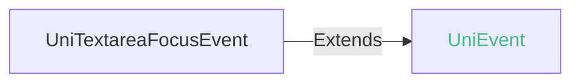
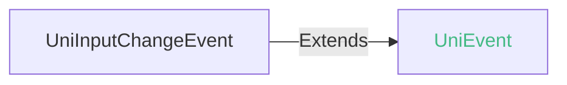

<!-- ## textarea -->

::: sourceCode
## textarea

> GitCode: https://gitcode.com/dcloud/uni-component/tree/alpha/uni_modules/uni-textarea


> GitHub: https://github.com/dcloudio/uni-component/tree/alpha/uni_modules/uni-textarea

:::

> 组件类型：[UniTextareaElement](/api/dom/unitextareaelement.md) 

 多行输入框


### 兼容性
| Web | 微信小程序 | Android | iOS | HarmonyOS | HarmonyOS(Vapor) |
| :- | :- | :- | :- | :- | :- |
| 4.0 | 4.41 | 3.9 | 4.11 | 4.61 | 5.0 |


### 属性 
| 名称 | 类型 | 默认值 | 兼容性 | 描述 |
| :- | :- | :- |  :-: | :- |
| name | string | - | Web: 4.0; 微信小程序: 4.41; Android: 3.9; iOS: 4.11; HarmonyOS: 4.61; HarmonyOS(Vapor): 5.0 | 表单的控件名称，作为键值对的一部分与表单(form组件)一同提交 |
| disabled | boolean | false | Web: 4.0; 微信小程序: 4.41; Android: 3.9; iOS: 4.11; HarmonyOS: 4.61; HarmonyOS(Vapor): 5.0 | 是否禁用 |
| value | string | "" | Web: 4.0; 微信小程序: 4.41; Android: 3.9; iOS: 4.11; HarmonyOS: 4.61; HarmonyOS(Vapor): 5.0 | 输入框的初始内容 |
| placeholder | string | "" | Web: 4.0; 微信小程序: 4.41; Android: 3.9; iOS: 4.11; HarmonyOS: 4.61; HarmonyOS(Vapor): 5.0 | 输入框为空时占位符 |
| placeholder-style | string | "" | Web: 4.0; 微信小程序: 4.41; Android: 3.9; iOS: 4.11; HarmonyOS: 4.61; HarmonyOS(Vapor): 5.0 | 指定 placeholder 的样式 |
| placeholder-class | string([string.ClassString](/uts/data-type.md#ide-string)) | "" | Web: 4.0; 微信小程序: 4.41; Android: 3.9; iOS: 4.11; HarmonyOS: 4.61; HarmonyOS(Vapor): 5.0 | 指定 placeholder 的样式类 |
| maxlength | number | "不限制长度" | Web: 4.0; 微信小程序: 4.41; Android: 3.9; iOS: 4.11; HarmonyOS: 4.61; HarmonyOS(Vapor): 5.0 | 最大输入长度，0和正数为合法值，非法值的时候不限制最大长度 |
| auto-focus | boolean | false | Web: 4.0; 微信小程序: 4.41; Android: 3.9; iOS: 4.11; HarmonyOS: 4.61; HarmonyOS(Vapor): 5.0 | 自动获取焦点，与`focus`属性对比，此属性只会首次生效。 |
| focus | boolean | false | Web: 4.0; 微信小程序: 4.41; Android: 3.9; iOS: 4.11; HarmonyOS: 4.61; HarmonyOS(Vapor): 5.0 | 获取焦点 |
| confirm-type | return \| send \| search \| next \| go \| done | "return" | Web: 4.0; 微信小程序: 4.41; Android: 3.9; iOS: 4.15; HarmonyOS: 4.61; HarmonyOS(Vapor): 5.0 | 设置键盘右下角按钮的文字 |
| cursor | number | 0 | Web: 4.0; 微信小程序: 4.41; Android: 3.9; iOS: 4.11; HarmonyOS: 4.61; HarmonyOS(Vapor): 5.0 | 指定focus时的光标位置 |
| confirm-hold | boolean | false | Web: 4.0; 微信小程序: 4.41; Android: 3.9; iOS: 4.11; HarmonyOS: 4.61; HarmonyOS(Vapor): 5.0 | 点击键盘右下角按钮时是否保持键盘不收起 |
| auto-height | boolean | false | Web: 4.0; 微信小程序: 4.41; Android: 3.9; iOS: 4.11; HarmonyOS: 4.65; HarmonyOS(Vapor): 5.0 | 是否自动增高，设置auto-height时，style.height不生效 |
| cursor-spacing | number | 0 | Web: x; 微信小程序: 4.41; Android: 3.9; iOS: 4.11; HarmonyOS: x; HarmonyOS(Vapor): x | 指定光标与键盘的距离，单位 px 。取 textarea 距离底部的距离和 cursor-spacing 指定的距离的最小值作为光标与键盘的距离 |
| cursor-color | string([string.ColorString](/uts/data-type.md#ide-string)) | "" | Web: -; 微信小程序: 4.41; Android: 3.99; iOS: 4.11; HarmonyOS: 4.61; HarmonyOS(Vapor): 5.0 | 指定光标颜色 |
| selection-start | number | -1 | Web: 4.0; 微信小程序: 4.41; Android: 3.9; iOS: 4.11; HarmonyOS: 4.61; HarmonyOS(Vapor): 5.0 | 光标起始位置，自动聚集时有效，需与selection-end搭配使用 |
| selection-end | number | -1 | Web: 4.0; 微信小程序: 4.41; Android: 3.9; iOS: 4.11; HarmonyOS: 4.61; HarmonyOS(Vapor): 5.0 | 光标结束位置，自动聚集时有效，需与selection-satrt搭配使用 |
| adjust-position | boolean | true | Web: x; 微信小程序: 4.41; Android: 3.9; iOS: 4.11; HarmonyOS: 4.61; HarmonyOS(Vapor): 5.0 | 键盘弹起时，是否自动上推页面 |
| hold-keyboard | boolean | false | Web: x; 微信小程序: 4.41; Android: 4.0; iOS: 4.11; HarmonyOS: 4.61; HarmonyOS(Vapor): x | focus时，点击页面的时候不收起键盘 |
| inputmode | none \| text \| decimal \| numeric \| tel \| search \| email \| url | "text" | Web: 4.0; 微信小程序: x; Android: x; iOS: x; HarmonyOS: x; HarmonyOS(Vapor): - | 是一个枚举属性，它提供了用户在编辑元素或其内容时可能输入的数据类型的提示。在符合条件的高版本webview里，uni-app的 web 和 app-vue 平台中可使用本属性。 |
| fixed | boolean | - | Web: x; 微信小程序: 4.41; Android: x; iOS: x; HarmonyOS: -; HarmonyOS(Vapor): - | 如果 textarea 是在一个 position:fixed 的区域，需要显示指定属性 fixed 为 true |
| show-confirm-bar | boolean | - | Web: x; 微信小程序: 4.41; Android: x; iOS: x; HarmonyOS: -; HarmonyOS(Vapor): - | 是否显示键盘上方带有”完成“按钮那一栏 |
| disabled | boolean | - | Web: -; 微信小程序: 4.41; Android: -; iOS: -; HarmonyOS: -; HarmonyOS(Vapor): - | *(boolean)*<br/>是否禁用 |
| disable-default-padding | boolean | - | Web: -; 微信小程序: 4.41; Android: -; iOS: -; HarmonyOS: -; HarmonyOS(Vapor): - | *(boolean)*<br/>是否去掉 iOS 下的默认内边距 |
| adjust-keyboard-to | boolean | - | Web: -; 微信小程序: 4.41; Android: -; iOS: -; HarmonyOS: -; HarmonyOS(Vapor): - | *(boolean)*<br/>键盘对齐位置 |
| @confirm | (event: [UniInputConfirmEvent](#uniinputconfirmevent)) => void | - | Web: 4.0; 微信小程序: 4.41; Android: 4.73; iOS: 4.73; HarmonyOS: 4.61; HarmonyOS(Vapor): - | 点击完成时， 触发 confirm 事件，event.detail = {value: value} |
| @input | (event: [UniInputEvent](#uniinputevent)) => void | - | Web: 4.0; 微信小程序: 4.41; Android: 3.9; iOS: 4.11; HarmonyOS: 4.61; HarmonyOS(Vapor): - | 当键盘输入时，触发 input 事件，event.detail = {value, cursor}， @input 处理函数的返回值并不会反映到 textarea 上 |
| @linechange | (event: [UniTextareaLineChangeEvent](#unitextarealinechangeevent)) => void | - | Web: 4.0; 微信小程序: 4.41; Android: 3.9; iOS: 4.11; HarmonyOS: 4.65; HarmonyOS(Vapor): - | 输入框行数变化时调用，event.detail = {height: 0, heightRpx: 0, lineCount: 0} |
| @blur | (event: [UniTextareaBlurEvent](#unitextareablurevent)) => void | - | Web: 4.0; 微信小程序: 4.41; Android: 3.9; iOS: 4.11; HarmonyOS: 4.61; HarmonyOS(Vapor): - | 输入框失去焦点时触发，event.detail = {value, cursor} |
| @keyboardheightchange | (event: [UniInputKeyboardHeightChangeEvent](#uniinputkeyboardheightchangeevent)) => void | - | Web: x; 微信小程序: 4.41; Android: 3.9; iOS: 4.11; HarmonyOS: 4.61; HarmonyOS(Vapor): - | 键盘高度发生变化的时候触发此事件，event.detail = {height: height, duration: duration} |
| @focus | (event: [UniTextareaFocusEvent](#unitextareafocusevent)) => void | - | Web: 4.0; 微信小程序: 4.41; Android: 3.9; iOS: 4.11; HarmonyOS: 4.61; HarmonyOS(Vapor): - | 输入框聚焦时触发，event.detail = { value, height }，height 为键盘高度，在基础库 1.9.90 起支持 |
| @change | (event: [UniInputChangeEvent](#uniinputchangeevent)) => void | - | Web: 4.81; 微信小程序: 4.41; Android: 4.73; iOS: 4.73; HarmonyOS: 4.73; HarmonyOS(Vapor): - | 非聚焦状态内容改变时触发（仅组件失去焦点时且用户输入改变内容才触发） |

#### confirm-type 的属性描述

| 合法值 | 兼容性 | 描述 |
| :- |  :-: | :- |
| return | Web: 4.0; 微信小程序: 4.41; Android: 3.9; iOS: 4.15; HarmonyOS: 4.61; HarmonyOS(Vapor): - | 换行 |
| send | Web: 4.0; 微信小程序: 4.41; Android: 4.73; iOS: 4.15; HarmonyOS: 4.61; HarmonyOS(Vapor): - | 发送 |
| search | Web: 4.0; 微信小程序: 4.41; Android: 4.73; iOS: 4.15; HarmonyOS: 4.61; HarmonyOS(Vapor): - | 搜索 |
| next | Web: 4.0; 微信小程序: 4.41; Android: 4.73; iOS: 4.15; HarmonyOS: 4.61; HarmonyOS(Vapor): - | 下一个 |
| go | Web: 4.0; 微信小程序: 4.41; Android: 4.73; iOS: 4.15; HarmonyOS: 4.61; HarmonyOS(Vapor): - | 前往 |
| done | Web: 4.0; 微信小程序: 4.41; Android: 4.73; iOS: 4.15; HarmonyOS: 4.61; HarmonyOS(Vapor): - | 完成 |

#### inputmode 的属性描述

| 合法值 | 兼容性 | 描述 |
| :- |  :-: | :- |
| none | Web: -; 微信小程序: -; Android: x; iOS: x; HarmonyOS: -; HarmonyOS(Vapor): - | 无虚拟键盘。在应用程序或者站点需要实现自己的键盘输入控件时很有用。 |
| text | Web: -; 微信小程序: -; Android: x; iOS: x; HarmonyOS: -; HarmonyOS(Vapor): - | 使用用户本地区域设置的标准文本输入键盘。 |
| decimal | Web: -; 微信小程序: -; Android: x; iOS: x; HarmonyOS: -; HarmonyOS(Vapor): - | 小数输入键盘，包含数字和分隔符（通常是“ . ”或者“ , ”），设备可能也可能不显示减号键。 |
| numeric | Web: -; 微信小程序: -; Android: x; iOS: x; HarmonyOS: -; HarmonyOS(Vapor): - | 数字输入键盘，所需要的就是 0 到 9 的数字，设备可能也可能不显示减号键。 |
| tel | Web: -; 微信小程序: -; Android: x; iOS: x; HarmonyOS: -; HarmonyOS(Vapor): - | 电话输入键盘，包含 0 到 9 的数字、星号（*）和井号（#）键。表单输入里面的电话输入通常应该使用 \<input type="tel"\> 。 |
| search | Web: -; 微信小程序: -; Android: x; iOS: x; HarmonyOS: -; HarmonyOS(Vapor): - | 为搜索输入优化的虚拟键盘，比如，返回键可能被重新标记为“搜索”，也可能还有其他的优化。 |
| email | Web: -; 微信小程序: -; Android: x; iOS: x; HarmonyOS: -; HarmonyOS(Vapor): - | 为邮件地址输入优化的虚拟键盘，通常包含"@"符号和其他优化。表单里面的邮件地址输入应该使用 \<input type="email"\> 。 |
| url | Web: -; 微信小程序: -; Android: x; iOS: x; HarmonyOS: -; HarmonyOS(Vapor): - | 为网址输入优化的虚拟键盘，比如，“/”键会更加明显、历史记录访问等。表单里面的网址输入通常应该使用 \<input type="url"\> 。 |

#### adjust-keyboard-to 的属性描述

| 合法值 | 兼容性 | 描述 |
| :- |  :-: | :- |
| cursor | Web: -; 微信小程序: 4.41; Android: -; iOS: -; HarmonyOS: -; HarmonyOS(Vapor): - | 对齐光标位置 |
| bottom | Web: -; 微信小程序: 4.41; Android: -; iOS: -; HarmonyOS: -; HarmonyOS(Vapor): - | 对齐输入框底部 |


### 事件
#### UniInputConfirmEvent


##### UniInputConfirmEvent 的属性值
| 名称 | 类型 | 必填 | 默认值 | 兼容性 | 描述 |
| :- | :- | :- | :- |  :-: | :- |
| detail | **UniInputConfirmEventDetail** | 是 | - | - | - |

#### detail 的属性描述

| 名称 | 类型 | 必备 | 默认值 | 兼容性 | 描述 |
| :- | :- | :- | :- |  :-: | :- |
| value | string | 是 | - | - | 输入框内容 |


#### UniInputEvent


##### UniInputEvent 的属性值
| 名称 | 类型 | 必填 | 默认值 | 兼容性 | 描述 |
| :- | :- | :- | :- |  :-: | :- |
| detail | **UniInputEventDetail** | 是 | - | - | - |

#### detail 的属性描述

| 名称 | 类型 | 必备 | 默认值 | 兼容性 | 描述 |
| :- | :- | :- | :- |  :-: | :- |
| value | string | 是 | - | - | 输入框内容 |
| cursor | number | 是 | - | - | 光标的位置 |
| keyCode | number | 是 | - | - | 输入字符的Unicode值 |


#### UniTextareaLineChangeEvent


##### UniTextareaLineChangeEvent 的属性值
| 名称 | 类型 | 必填 | 默认值 | 兼容性 | 描述 |
| :- | :- | :- | :- |  :-: | :- |
| detail | **UniTextareaLineChangeEventDetail** | 是 | - | - | - |

#### detail 的属性描述

| 名称 | 类型 | 必备 | 默认值 | 兼容性 | 描述 |
| :- | :- | :- | :- |  :-: | :- |
| lineCount | number | 是 | - | - | 行数 |
| heightRpx | number | 是 | - | - | textarea的高度 |
| height | number | 是 | - | - | textarea的高度 |


#### UniTextareaBlurEvent


##### UniTextareaBlurEvent 的属性值
| 名称 | 类型 | 必填 | 默认值 | 兼容性 | 描述 |
| :- | :- | :- | :- |  :-: | :- |
| detail | **UniTextareaBlurEventDetail** | 是 | - | - | - |

#### detail 的属性描述

| 名称 | 类型 | 必备 | 默认值 | 兼容性 | 描述 |
| :- | :- | :- | :- |  :-: | :- |
| value | string | 是 | - | - | 输入框内容 |
| cursor | number | 是 | - | - | 选择区域的起始位置 |


#### UniInputKeyboardHeightChangeEvent


##### UniInputKeyboardHeightChangeEvent 的属性值
| 名称 | 类型 | 必填 | 默认值 | 兼容性 | 描述 |
| :- | :- | :- | :- |  :-: | :- |
| detail | **UniInputKeyboardHeightChangeEventDetail** | 是 | - | - | - |

#### detail 的属性描述

| 名称 | 类型 | 必备 | 默认值 | 兼容性 | 描述 |
| :- | :- | :- | :- |  :-: | :- |
| height | number | 是 | - | - | 键盘高度 |
| duration | number | 是 | - | - | 持续时间 |


#### UniTextareaFocusEvent


##### UniTextareaFocusEvent 的属性值
| 名称 | 类型 | 必填 | 默认值 | 兼容性 | 描述 |
| :- | :- | :- | :- |  :-: | :- |
| detail | **UniTextareaFocusEventDetail** | 是 | - | - | - |

#### detail 的属性描述

| 名称 | 类型 | 必备 | 默认值 | 兼容性 | 描述 |
| :- | :- | :- | :- |  :-: | :- |
| height | number | 是 | - | Web: x; 微信小程序: -; Android: 3.9; iOS: 4.11; HarmonyOS: -; HarmonyOS(Vapor): - | 键盘高度 |
| value | string | 是 | - | - | 输入框内容 |


#### UniInputChangeEvent


##### UniInputChangeEvent 的属性值
| 名称 | 类型 | 必填 | 默认值 | 兼容性 | 描述 |
| :- | :- | :- | :- |  :-: | :- |
| detail | **UniInputChangeEventDetail** | 是 | - | - | - |

#### detail 的属性描述

| 名称 | 类型 | 必备 | 默认值 | 兼容性 | 描述 |
| :- | :- | :- | :- |  :-: | :- |
| value | string | 是 | - | - | 输入框内容 |


<!-- UTSCOMJSON.textarea.component_type-->

#### 获取原生view对象

为增强uni-app x组件的开放性，从 `HBuilderX 4.25` 起，UniElement对象提供了 [getAndroidView](../dom/unielement.md#getandroidview) 和 [getIOSView](../dom/unielement.md#getiosview) 方法。

该方法可以获取到 textarea 组件对应的原生对象，即Android的`AppCompatEditText`对象、iOS的`UITextView`对象。

进而可以调用原生对象提供的方法，这极大的扩展了组件的能力。

**Android 平台：**

获取textarea组件对应的UniElement对象，通过UniElement对象的[getAndroidView](../dom/unielement.md#getandroidview-2)方法获取组件原生AppCompatEditText对象

```uts
//导入安卓原生AppCompatEditText对象
import AppCompatEditText from "androidx.appcompat.widget.AppCompatEditText"

//通过textarea组件定义的id属性值，获取textarea标签的UniElement对象
const textareaElement = uni.getElementById(id)
//UniElement.getAndroidView设置泛型为安卓底层AppCompatEditText对象，直接获取AppCompatEditText， 如果泛型不匹配会返回null
if(textareaElement != null) {
	//editText就是textarea组件对应的原生view对象
	const editText = textareaElement.getAndroidView<AppCompatEditText>()
}
```

**iOS 平台：**

获取textarea组件对应的UniElement对象，通过UniElement对象的[getIOSView](../dom/unielement.md#getiosview)方法获取组件原生UITextView对象。

```uts
//通过 textarea 组件定义的 id 属性值，获取 textarea 标签的 UniElement 对象
const textareaElement = uni.getElementById(id)
//获取原生 view
const view = inputElement?.getIOSView();
//判断 view 是否存在，类型是否为 UITextView
if (view != null && view instanceof UITextView) {
    //将 view 转换为 UITextView 类型
    const textField = view! as UITextView;
}
```

+ iOS平台 uvue 环境使用 js 驱动无法处理原生类型，getIOSView 方法需要在 uts 插件中使用。

更多示例请参考 uts 插件 [uts-get-native-view](https://gitcode.com/dcloud/hello-uni-app-x/blob/alpha/uni_modules/uts-get-native-view/utssdk/app-ios/index.uts)

### 子组件 @children-tags
不可以嵌套组件

### 示例
示例为[hello uni-app x alpha分支](https://gitcode.com/dcloud/hello-uni-app-x/blob/prod_alpha/pages/component/textarea/textarea.uvue)，与最新HBuilderX Alpha版同步。与最新正式版同步的master分支示例[另见](https://gitcode.com/dcloud/hello-uni-app-x/blob/master//pages/component/textarea/textarea.uvue) 
::: preview https://hellouniappx.dcloud.net.cn/web/#/pages/component/textarea/textarea

> appRedirect https://hellouniappx.dcloud.net.cn/appredirect.html?path=pages/component/textarea/textarea

>示例
```vue
<script setup lang="uts">
  import { ItemType } from '@/components/enum-data/enum-data-types'

  type DataType = {
    value2: string;
    adjust_position_boolean: boolean;
    show_confirm_bar_boolean: boolean;
    fixed_boolean: boolean;
    auto_height_boolean: boolean;
    confirm_hold_boolean: boolean;
    focus_boolean: boolean;
    auto_focus_boolean: boolean;
    default_value: string;
    inputmode_enum: ItemType[];
    confirm_type_list: ItemType[];
    cursor_color: string;
    cursor: number;
    inputmode_enum_current: number;
    confirm_type_current: number;
    placeholder_value: string;
    defaultModel: string;
    textareaMaxLengthValue: string;
    isSelectionFocus: boolean;
    selectionStart: number;
    selectionEnd: number;
    hold_keyboard: boolean;
    adjust_position: boolean;
    disabled: boolean;
    jest_result: boolean;
    isAutoTest: boolean;
    changeValue: string;
    textareaRect: DOMRect | null;
  }
  // 使用reactive避免ref数据在自动化测试中无法访问
  const data = reactive({
    value2: '第一行\n第二行\n第三行\n第四行\n第五行\n第六行\n第七行\n第八行\n第九行\n第十行\n十一行',
    adjust_position_boolean: false,
    show_confirm_bar_boolean: false,
    fixed_boolean: false,
    auto_height_boolean: false,
    confirm_hold_boolean: false,
    focus_boolean: true,
    auto_focus_boolean: false,
    default_value: "1\n2\n3\n4\n5\n6",
    inputmode_enum: [{ "value": 1, "name": "text" }, { "value": 2, "name": "decimal" }, { "value": 3, "name": "numeric" }, { "value": 4, "name": "tel" }, { "value": 5, "name": "search" }, { "value": 6, "name": "email" }, { "value": 7, "name": "url" }, { "value": 0, "name": "none" }],
    confirm_type_list: [{ "value": 0, "name": "return" }, { "value": 1, "name": "done" }, { "value": 2, "name": "send" }, { "value": 3, "name": "search" }, { "value": 4, "name": "next" }, { "value": 5, "name": "go" }],
    cursor_color: "#3393E2",
    cursor: 0,
    inputmode_enum_current: 0,
    confirm_type_current: 0,
    placeholder_value: "请输入",
    defaultModel: '123',
    textareaMaxLengthValue: "",
    isSelectionFocus: false,
    selectionStart: -1,
    selectionEnd: -1,
    hold_keyboard: false,
    adjust_position: false,
    disabled: false,
    jest_result: false,
    isAutoTest: false,
    changeValue: "",
    textareaRect: null
  } as DataType)

  // #ifdef APP
  onReady(() => {
    const textarea = uni.getElementById("uni-textarea")
    data.textareaRect = textarea?.getBoundingClientRect()
    // 加上导航栏及状态栏高度
    data.textareaRect!.y += uni.getSystemInfoSync().safeArea.top + 44
  })
  // #endif

  const textarea_click = () => { console.log("组件被点击时触发") }
  const textarea_touchstart = () => { console.log("手指触摸动作开始") }
  const textarea_touchmove = () => { console.log("手指触摸后移动") }
  const textarea_touchcancel = () => { console.log("手指触摸动作被打断，如来电提醒，弹窗") }
  const textarea_touchend = () => { console.log("手指触摸动作结束") }
  const textarea_tap = () => { console.log("手指触摸后马上离开") }
  const textarea_longpress = () => { console.log("如果一个组件被绑定了 longpress 事件，那么当用户长按这个组件时，该事件将会被触发。") }
  const textarea_confirm = () => { console.log("点击完成时， 触发 confirm 事件，event.detail = {value: value}") }

  const textarea_input = (e: UniInputEvent) => {
    console.log("当键盘输入时，触发 input 事件，event.detail = {value, cursor}， @input 处理函数的返回值并不会反映到 textarea 上")
    // #ifdef WEB
    data.jest_result = e.detail.value == '11\n2\n3\n4\n5\n6'
    // #endif
    // #ifdef APP
    data.jest_result = e.detail.value == '1\n2\n3\n4\n5\n61'
    // #endif
  }

  const textarea_linechange = () => { console.log("输入框行数变化时调用，event.detail = {height: 0, height: 0, lineCount: 0}") }
  const textarea_blur = () => { console.log("输入框失去焦点时触发，event.detail = {value, cursor}") }
  const textarea_keyboardheightchange = () => { console.log("键盘高度发生变化的时候触发此事件，event.detail = {height: height, duration: duration}") }

  const textarea_focus = (event: UniTextareaFocusEvent) => {
    data.jest_result = event.detail.height >= 0
  }

  const textarea_change = (event: UniInputChangeEvent) => {
    console.log("textarea_change", event.detail.value);
    data.changeValue = event.detail.value
  }

  const change_adjust_position_boolean = (checked: boolean) => { data.adjust_position_boolean = checked }
  const change_show_confirm_bar_boolean = (checked: boolean) => { data.show_confirm_bar_boolean = checked }
  const change_fixed_boolean = (checked: boolean) => { data.fixed_boolean = checked }
  const change_auto_height_boolean = (checked: boolean) => { data.auto_height_boolean = checked }
  const change_confirm_hold_boolean = (checked: boolean) => { data.confirm_hold_boolean = checked }
  const change_focus_boolean = (checked: boolean) => { data.focus_boolean = checked }
  const change_auto_focus_boolean = (checked: boolean) => { data.auto_focus_boolean = checked }

  const change_cursor_color_boolean = (checked: boolean) => {
    if (checked) {
      data.cursor_color = "transparent"
    } else {
      data.cursor_color = "#3393E2"
    }
  }

  const radio_change_inputmode_enum = (checked: number) => { data.inputmode_enum_current = checked }
  const radio_change_confirm_type = (checked: number) => { data.confirm_type_current = checked }

  const setSelection = (selectionStart: number, selectionEnd: number) => {
    data.isSelectionFocus = true;
    data.selectionStart = selectionStart;
    data.selectionEnd = selectionEnd;
  }

  const onSelectionBlurChange = () => {
    data.isSelectionFocus = false;
    data.selectionEnd = 0;
  }

  const changeHoldKeyboard = (event: UniSwitchChangeEvent) => {
    const checked = event.detail.value;
    data.hold_keyboard = checked;
  }

  const changeAdjustPosition = (event: UniSwitchChangeEvent) => {
    const checked = event.detail.value;
    data.adjust_position = checked;
  }

  const change_disabled_boolean = (checked: boolean) => {
    data.disabled = checked
  }

  const getBoundingClientRectForTest = (): DOMRect | null => {
    return uni.getElementById('test-width')?.getBoundingClientRect();
  }

  defineExpose({
    data,
    radio_change_inputmode_enum,
    getBoundingClientRectForTest
  })
</script>

<template>
  <!-- #ifdef APP -->
  <scroll-view style="flex: 1">
  <!-- #endif -->
    <view class="main">
      <textarea :value="data.default_value" id="uni-textarea" class="uni-textarea" :auto-focus="true" :focus="data.focus_boolean"
        :confirm-hold="data.confirm_hold_boolean" :auto-height="data.auto_height_boolean" :fixed="data.fixed_boolean"
        :show-confirm-bar="data.show_confirm_bar_boolean" :adjust-position="data.adjust_position_boolean"
        :cursor-color="data.cursor_color" :cursor="data.cursor" :placeholder="data.placeholder_value"
        :inputmode="data.inputmode_enum[data.inputmode_enum_current].name"
        :confirm-type="data.confirm_type_list[data.confirm_type_current].name" :disabled="data.disabled" @click="textarea_click"
        @touchstart="textarea_touchstart" @touchmove="textarea_touchmove" @touchcancel="textarea_touchcancel"
        @touchend="textarea_touchend" @tap="textarea_tap" @longpress="textarea_longpress" @confirm="textarea_confirm"
        @input="textarea_input" @linechange="textarea_linechange" @blur="textarea_blur"
        @keyboardheightchange="textarea_keyboardheightchange" @focus="textarea_focus" @change="textarea_change"
        style="padding: 10px; border: 1px solid #666;height: 200px" />
    </view>
    <view style="margin-bottom: 40px;">
      <boolean-data :defaultValue="false" title="键盘弹起时，是否自动上推页面（限非 Web 平台）"
        @change="change_adjust_position_boolean"></boolean-data>
      <boolean-data :defaultValue="false" title="是否自动增高，设置auto-height时，style.height不生效"
        @change="change_auto_height_boolean"></boolean-data>
      <boolean-data :defaultValue="data.focus_boolean" title="获取焦点" @change="change_focus_boolean"></boolean-data>
      <boolean-data :defaultValue="true" title="首次自动获取焦点" @change="change_auto_focus_boolean"></boolean-data>
      <boolean-data :defaultValue="false" title="改变光标颜色为透明" @change="change_cursor_color_boolean"></boolean-data>
      <boolean-data :defaultValue="false" title="设置禁用输入框"
        @change="change_disabled_boolean"></boolean-data>
      <enum-data :items="data.confirm_type_list" title="confirm-type，设置键盘右下角按钮。"
        @change="radio_change_confirm_type"></enum-data>
      <boolean-data :defaultValue="false" title="点击软键盘右下角按钮时是否保持键盘不收起(confirm-type为return时必然不收起)"
        @change="change_confirm_hold_boolean"></boolean-data>
      <enum-data :items="data.inputmode_enum" title="input-mode，控制软键盘类型。（仅限 Web 平台符合条件的高版本浏览器或webview）。"
        @change="radio_change_inputmode_enum"></enum-data>
      <boolean-data :defaultValue="false" title="是否显示键盘上方带有“完成”按钮那一栏（仅限小程序平台）"
        @change="change_show_confirm_bar_boolean"></boolean-data>
      <boolean-data :defaultValue="false" title="如果 textarea 是在一个 position:fixed 的区域，需要显示指定属性 fixed 为 true（仅限小程序平台）"
        @change="change_fixed_boolean"></boolean-data>


      <view class="title-wrap">
        <view>maxlength 输入最大长度为10</view>
      </view>
      <view class="textarea-wrap">
        <textarea id="textarea-instance-maxlength" class="textarea-instance" :value="data.textareaMaxLengthValue"
          :maxlength="10" />
      </view>

      <view class="title-wrap">
        <view>cursor-spacing、placeholder-class、placeholder-style例子(harmony 不支持设置 placeholder backgroundColor)</view>
      </view>
      <view class="textarea-wrap">
        <textarea id="textarea-height-exception" class="textarea-instance" placeholder="底部textarea测试键盘遮挡"
          placeholder-class="placeholder" placeholder-style="background-color:red" :cursor-spacing="300" />
      </view>
      <view class="title-wrap">
        <view @click="setSelection(2, 5)">设置输入框聚焦时光标的起始位置和结束位置（点击生效）</view>
      </view>
      <view class="textarea-wrap">
        <textarea id="textarea-instance-2" class="textarea-instance" value="Hello UniApp X Textarea TestCase" :focus="data.isSelectionFocus"
          :selection-start="data.selectionStart" :selection-end="data.selectionEnd" @blur="onSelectionBlurChange" />
      </view>

      <view class="title-wrap">
        <view>设置hold-keyboard</view>
        <switch style="margin-left: 10px;" @change="changeHoldKeyboard" :checked="data.hold_keyboard"></switch>
      </view>
      <view class="textarea-wrap">
        <textarea class="textarea-instance" :hold-keyboard="data.hold_keyboard" />
      </view>
      <view class="title-wrap">
        <view>同时存在 v-model 和 value</view>
      </view>
      <!-- harmony 不符合预期因为 switch 组件存在时，textarea 非预期 update 导致 -->
      <view class="textarea-wrap">
          <textarea id="both-model-value" class="textarea-instance" v-model='data.defaultModel' value='456'></textarea>
      </view>

      <view class="title-wrap">
        <view>设置adjust-position</view>
        <switch style="margin-left: 10px;" @change="changeAdjustPosition" :checked="data.adjust_position"></switch>
      </view>
      <view class="textarea-wrap">
        <textarea class="textarea-instance" :adjust-position="data.adjust_position" />
      </view>
      <view v-if="data.isAutoTest" class="textarea-wrap">
        <textarea id="test-width" class="test-width" value="123456" placeholder="" />
      </view>
      <view class="title-wrap">
        <view>设置line-height</view>
      </view>
      <view class="textarea-wrap">
        <textarea class="textarea-instance" style="line-height: 1.2em;" value="设置line-height为1.2em" ></textarea>
      </view>
      <view class="title-wrap">
        <view>设置min-height</view>
      </view>
      <view class="textarea-wrap">
        <textarea class="textarea-instance" style="min-height: 100px;" :value="data.default_value"></textarea>
      </view>
      <view class="title-wrap">
        <view>设置max-height</view>
      </view>
      <view class="textarea-wrap">
        <textarea class="textarea-instance" style="max-height: 50px;" :value="data.default_value"></textarea>
      </view>
      <view class="title-wrap">
        <view>设置min-height与auto-height</view>
      </view>
      <view class="textarea-wrap">
        <textarea class="textarea-instance" style="min-height: 100px;" auto-height="true" :value="data.default_value"></textarea>
      </view>
      <view class="title-wrap">
        <view>设置max-height与auto-height</view>
      </view>
      <view class="textarea-wrap">
        <textarea class="textarea-instance" style="max-height: 50px;" auto-height="true" :value="data.default_value"></textarea>
      </view>
      <view class="title-wrap">
        <view>同时设置value与text-align</view>
      </view>
      <view class="textarea-wrap">
        <textarea class="textarea-instance" style="height: 50px;text-align: right;" value="同时设置value与text-align"></textarea>
      </view>
      <view class="title-wrap">
        <view>scroll-view嵌套textarea滚动</view>
      </view>
      <scroll-view  style="height: 150px;" direction="vertical">
      	<textarea class="textarea-instance" :adjust-position="false" :auto-height="true" :value="data.value2" />
      </scroll-view>
      <view class="textarea-wrap">
        <textarea class="textarea-instance" style="height: 60px;padding: 20px;" value="style padding:20px"></textarea>
      </view>
      <view class="title-wrap">
        <view>注册confirm事件，点击换行效果</view>
      </view>
      <view class="textarea-wrap">
        <textarea class="textarea-instance" @confirm="()=>{}"></textarea>
      </view>

      <view class="title-wrap">
        <text>style 设置 font-size:20px</text>
      </view>
      <view class="textarea-wrap">
        <textarea class="textarea-instance" style="height: 60px;font-size:20px" placeholder="placeholder" />
      </view>
      <view style="padding-left: 10px;flex-direction: column;">
        <text>style 设置 font-size:20px</text>
        <text>placeholder-class 设置 30px</text>
      </view>
      <view class="textarea-wrap">
        <textarea class="textarea-instance" style="height: 60px;font-size:20px" placeholder-class="placeholder-class" placeholder="placeholder" />
      </view>
      <view style="padding-left: 10px;flex-direction: column;">
        <text>style 设置 font-size:20px</text>
        <text>placeholder-class 设置 30px</text>
        <text>placeholder-style 设置 40px</text>
      </view>
      <view class="textarea-wrap">
        <textarea class="textarea-instance" style="height: 60px;font-size:20px" placeholder-class="placeholder-class" placeholder-style="font-size:40px" placeholder="placeholder" />
      </view>

      <text class="uni-title-text">textarea样式大合集</text>
      <view class="textarea-wrap">
        <textarea class="textarea-all-styles" value="样式效果：文本颜色深蓝色、字号16px、字重400、行高1.5、文本居左对齐；外边距10px、内边距10px；圆角8px；浅蓝色渐变背景、蓝色边框、透明度70%、阴影效果。" />
      </view>

      <navigator url="/pages/component/textarea/textarea-performance" style="margin: 10px;">
        <button type="primary">
          textarea 性能测试
        </button>
      </navigator>
    </view>
  <!-- #ifdef APP -->
  </scroll-view>
  <!-- #endif -->
</template>

<style>
  .main {
    min-height: 100px;
    padding: 5px 0;
    border-bottom: 1px solid rgba(0, 0, 0, 0.06);
    flex-direction: row;
    justify-content: center;
  }

  .test-width {
    width: 100px;
    height: 100px;
    background-color: aqua;
  }

  .textarea-wrap {
    flex-direction: row;
    justify-content: center;
  }

  .title-wrap {
    flex-direction: row;
    align-items: center;
    margin-left: 10px;
  }

  .textarea-instance {
    flex: 1;
    border: 1px solid #666;
    margin: 10px;
  }

  .placeholder {
    background-color: yellow;
  }
  .placeholder-class{
    font-size: 30px;
  }

  .textarea-all-styles {
    color: #0008a7;
    font-family: Arial, sans-serif;
    font-size: 16px;
    font-weight: 400;
    line-height: 1.5;
    text-align: left;
    width: 90%;
    height: 150px;
    min-width: 200px;
    min-height: 100px;
    max-height: 300px;
    margin: 10px;
    padding: 10px;
    border-radius: 8px;
    background-color: #e3f2fd;
    background-image: linear-gradient(to right, #e3f2fd, #a9d5fa);
    border: 1px solid #007aff;
    opacity: 0.7;
    box-shadow: 0 2px 4px rgba(0, 0, 0, 0.1);
  }
</style>

```

:::


### 参见
- [相关 Bug](https://issues.dcloud.net.cn/?mid=component.form-component.textarea)
- [参见uni-app相关文档](https://uniapp.dcloud.io/component/textarea.html)
- [微信小程序文档](https://developers.weixin.qq.com/miniprogram/dev/component/textarea.html)
- [支付宝小程序文档](https://open.alipay.com/portal/zhichi/search?keyword=textarea&pageIndex=1&pageSize=10&source=doc_top&type=all)
- [百度小程序文档](https://smartprogram.baidu.com/forum/search?query=textarea&scope=devdocs&source=docs)
- [抖音小程序文档](https://developer.open-douyin.com/search-page?keyword=textarea&secondType=all&type=1)
- [飞书小程序文档](https://open.feishu.cn/search?from=header&page=1&pageSize=10&q=textarea&topicFilter=)
- [钉钉小程序文档](https://open.dingtalk.com/search?keyword=textarea)
- [QQ小程序文档](https://q.qq.com/wiki/develop/miniprogram/frame/)
- [快手小程序文档](https://developers.kuaishou.com/page?keyword=textarea&from=docs)
- [京东小程序文档](https://mp-docs.jd.com/doc/dev/framework/-1)
- [华为快应用文档](https://developer.huawei.com/consumer/cn/doc/quickApp-References/webview-frame-overview-0000001124793625)
- [360小程序文档](https://mp.360.cn/doc/miniprogram/dev/#/b770a184ff1f06c6b3393a0fd1132380)

## 键盘上推专题
input和textarea组件都一个属性`adjust-position`，默认为true，即软键盘弹出时，默认上推页面以显示出输入框，避免输入框被软键盘遮挡。

因为此处内容与input重复，详见[input文档](input.md#adjust-position)

## inputmode说明

inputmode 兼容性：Chrome >= 66、Edge >= 79、Firefox >= 95、Chrome Android >= 66、Firefox for Android >= 79、Safari on iOS >= 12.2、WebView Android >= 66

## placeholder-style和placeholder-class说明
- uni-app x 4.41前，App平台仅支持`color`、`font-size`、`font-weight`。
- uni-app x 4.41后，App平台新增支持`font-family`、`font-style`、`text-align`，其中`text-align`仅App-Android平台支持，App-iOS平台的placeholder位置取决于textarea的`text-align`。
- App-HarmonyOS `placeholder-class` 暂不支持 css 变量。

## Tips

* uni-app x 4.0 起，App-Android平台 textarea 点击输入框外的屏幕会自动收起软键盘。
* uni-app x 4.0 起，App-Android平台 textarea 的 font-size 默认值统一为 16px，line-height 默认值为 1.2em，width 默认值为300px。
* uni-app x 4.15 起，App-iOS平台 textarea 软键盘默认右下角改为 return(换行) ，换行时，键盘不会收起。
* 由于Android系统限制，textarea的键盘右下角按钮只能是`换行`，所以暂时不提供`confirm-type`属性。
* 当软键盘右下角为 换行 时，confirm-hold 恒为 true，设置为false也不生效，即按下 换行 时，软键盘不会消失。
* 在Android 9以下的系统版本，样式`line-height`点击键盘换行时行间距设置无效，此问题是Android系统的的bug，后续解决。
