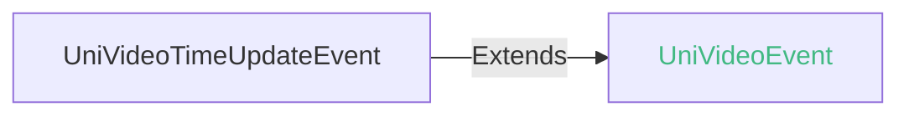
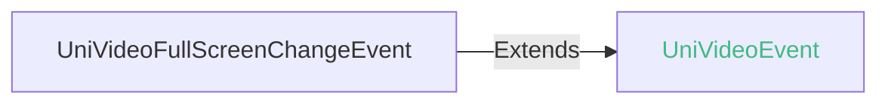
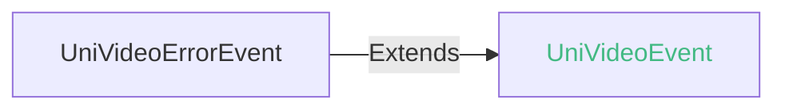
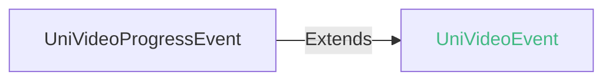
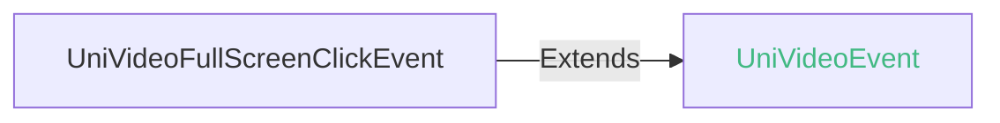
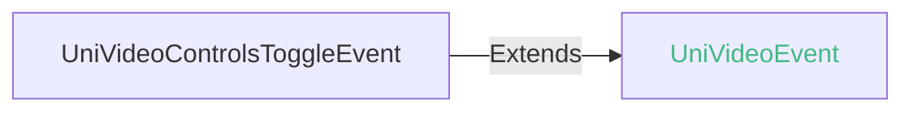
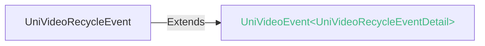
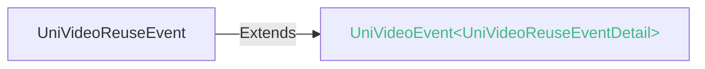

<!-- ## video -->

::: sourceCode
## video

> GitCode: https://gitcode.com/dcloud/uni-component/tree/alpha/uni_modules/uni-video


> GitHub: https://github.com/dcloudio/uni-component/tree/alpha/uni_modules/uni-video

:::

> 组件类型：[UniVideoElement](/api/dom/univideoelement.md) 

 视频


### 兼容性
| Web | 微信小程序 | Android | iOS | HarmonyOS | HarmonyOS(Vapor) |
| :- | :- | :- | :- | :- | :- |
| 4.0 | 4.41 | 3.9 | 4.11 | 4.61 | 5.0 |


### 属性 
| 名称 | 类型 | 默认值 | 兼容性 | 描述 |
| :- | :- | :- |  :-: | :- |
| loop | boolean | false | Web: 4.0; 微信小程序: 4.41; Android: 3.9; iOS: 4.11; HarmonyOS: 4.61; HarmonyOS(Vapor): 5.0 | 是否循环播放 |
| src | string([string.VideoURIString](/uts/data-type.md#ide-string)) | - | Web: 4.0; 微信小程序: 4.41; Android: 3.9; iOS: 4.11; HarmonyOS: 4.61; HarmonyOS(Vapor): 5.0 | 视频资源地址 |
| initial-time | number | 0 | Web: 4.0; 微信小程序: 4.41; Android: 3.9; iOS: 4.11; HarmonyOS: 4.61; HarmonyOS(Vapor): 5.0 | 指定视频初始播放位置 |
| duration | number | - | Web: 4.0; 微信小程序: 4.41; Android: 3.9; iOS: 4.11; HarmonyOS: 4.61; HarmonyOS(Vapor): 5.0 | 指定视频长度 |
| controls | boolean | true | Web: 4.0; 微信小程序: 4.41; Android: 3.9; iOS: 4.11; HarmonyOS: 4.61; HarmonyOS(Vapor): 5.0 | 是否显示默认播放控件（播放/暂停按钮、播放进度、时间） |
| danmu-list | array | - | Web: 4.0; 微信小程序: 4.41; Android: 3.9; iOS: 4.11; HarmonyOS: 4.61; HarmonyOS(Vapor): x | 弹幕列表 |
| danmu-btn | boolean | false | Web: 4.0; 微信小程序: 4.41; Android: 3.9; iOS: 4.11; HarmonyOS: 4.61; HarmonyOS(Vapor): x | 是否显示弹幕按钮，只在初始化时有效，不能动态变更 |
| enable-danmu | boolean | false | Web: 4.0; 微信小程序: 4.41; Android: 3.9; iOS: 4.11; HarmonyOS: 4.61; HarmonyOS(Vapor): x | 是否展示弹幕，只在初始化时有效，不能动态变更 |
| autoplay | boolean | false | Web: 4.0; 微信小程序: 4.41; Android: 3.9; iOS: 4.11; HarmonyOS: 4.61; HarmonyOS(Vapor): 5.0 | 是否自动播放 |
| muted | boolean | false | Web: 4.0; 微信小程序: 4.41; Android: 3.9; iOS: 4.11; HarmonyOS: 4.61; HarmonyOS(Vapor): 5.0 | 是否静音播放 |
| page-gesture | boolean | false | Web: 4.0; 微信小程序: 4.41; Android: 3.9; iOS: 4.11; HarmonyOS: 4.61; HarmonyOS(Vapor): x | 在非全屏模式下，是否开启亮度与音量调节手势 |
| direction | number | - | Web: 4.0; 微信小程序: 4.41; Android: 3.9; iOS: 4.11; HarmonyOS: 4.61; HarmonyOS(Vapor): x | 设置全屏时视频的方向，不指定则根据宽高比自动判断。有效值为 0（正常竖向）, 90（屏幕逆时针90度）, -90（屏幕顺时针90度） |
| show-progress | boolean | true | Web: 4.0; 微信小程序: 4.41; Android: 3.9; iOS: 4.11; HarmonyOS: 4.61; HarmonyOS(Vapor): x | 是否显示进度条 |
| show-fullscreen-btn | boolean | true | Web: 4.0; 微信小程序: 4.41; Android: 3.9; iOS: 4.11; HarmonyOS: 4.61; HarmonyOS(Vapor): x | 是否显示全屏按钮 |
| show-play-btn | boolean | true | Web: 4.0; 微信小程序: 4.41; Android: 3.9; iOS: 4.11; HarmonyOS: 4.61; HarmonyOS(Vapor): x | 是否显示视频底部控制栏的播放按钮 |
| show-center-play-btn | boolean | true | Web: 4.0; 微信小程序: 4.41; Android: 3.9; iOS: 4.11; HarmonyOS: 4.61; HarmonyOS(Vapor): x | 是否显示视频中间的播放按钮 |
| show-loading | boolean | true | Web: x; 微信小程序: x; Android: 3.9; iOS: 4.11; HarmonyOS: 4.61; HarmonyOS(Vapor): x | 是否显示loading控件 |
| enable-progress-gesture | boolean | true | Web: 4.0; 微信小程序: 4.41; Android: 3.9; iOS: 4.11; HarmonyOS: 4.61; HarmonyOS(Vapor): x | 是否开启播放手势，即双击切换播放、暂停 |
| object-fit | string | "contain" | Web: 4.0; 微信小程序: 4.41; Android: 3.9; iOS: 4.11; HarmonyOS: 4.61; HarmonyOS(Vapor): 5.0 | 当视频大小与 video 容器大小不一致时，视频的表现形式。 |
| poster | string | - | Web: 4.0; 微信小程序: 4.41; Android: 3.9; iOS: 4.11; HarmonyOS: 4.61; HarmonyOS(Vapor): 5.0 | 视频封面的图片网络资源地址，如果 controls 属性值为 false 则设置 poster 无效 |
| show-mute-btn | boolean | false | Web: x; 微信小程序: 4.41; Android: 3.9; iOS: 4.11; HarmonyOS: 4.61; HarmonyOS(Vapor): x | 是否显示静音按钮 |
| title | string | - | Web: 4.0; 微信小程序: 4.41; Android: 3.9; iOS: 4.11; HarmonyOS: 4.61; HarmonyOS(Vapor): x | 视频的标题，全屏时在顶部展示 |
| play-btn-position | string | - | Web: 4.0; 微信小程序: 4.41; Android: x; iOS: x; HarmonyOS: x; HarmonyOS(Vapor): - | 播放按钮的位置 |
| enable-play-gesture | boolean | false | Web: x; 微信小程序: 4.41; Android: 3.9; iOS: 4.11; HarmonyOS: 4.61; HarmonyOS(Vapor): x | 是否开启播放手势，即双击切换播放、暂停 |
| auto-pause-if-navigate | boolean | - | Web: 4.0; 微信小程序: 4.41; Android: x; iOS: x; HarmonyOS: x; HarmonyOS(Vapor): - | 当跳转到其它页面时，是否自动暂停本页面的视频 |
| auto-pause-if-open-native | boolean | - | Web: 4.0; 微信小程序: 4.41; Android: x; iOS: x; HarmonyOS: x; HarmonyOS(Vapor): - | 当跳转到其它小程序宿主原生页面时，是否自动暂停本页面的视频 |
| vslide-gesture | boolean | false | Web: 4.0; 微信小程序: 4.41; Android: 3.9; iOS: x; HarmonyOS: 4.61; HarmonyOS(Vapor): x | 在非全屏模式下，是否开启亮度与音量调节手势（同 page-gesture） |
| vslide-gesture-in-fullscreen | boolean | true | Web: 4.0; 微信小程序: 4.41; Android: 3.9; iOS: 4.11; HarmonyOS: 4.61; HarmonyOS(Vapor): x | 在全屏模式下，是否开启亮度与音量调节手势 |
| ad-unit-id | string | - | Web: x; 微信小程序: 4.41; Android: x; iOS: x; HarmonyOS: -; HarmonyOS(Vapor): - | 视频前贴广告单元ID |
| poster-for-crawler | string | - | Web: 4.0; 微信小程序: 4.41; Android: x; iOS: x; HarmonyOS: x; HarmonyOS(Vapor): - | 用于给搜索等场景作为视频封面展示，建议使用无播放 icon 的视频封面图，只支持网络地址 |
| codec | string | "hardware" | Web: x; 微信小程序: x; Android: 3.9; iOS: 4.11; HarmonyOS: -; HarmonyOS(Vapor): - | 解码器选择 |
| http-cache | boolean | false | Web: x; 微信小程序: x; Android: 3.9; iOS: 4.11; HarmonyOS: -; HarmonyOS(Vapor): - | 是否对 http、https 视频源开启本地缓存 |
| play-strategy | number | 0 | Web: x; 微信小程序: x; Android: 3.9; iOS: 4.11; HarmonyOS: x; HarmonyOS(Vapor): - | 播放策略 |
| is-live | boolean | - | Web: 4.0; 微信小程序: 4.41; Android: x; iOS: x; HarmonyOS: x; HarmonyOS(Vapor): - | 是否为直播源 |
| show-bottom-progress | boolean | - | Web: x; 微信小程序: 4.41; Android: x; iOS: x; HarmonyOS: x; HarmonyOS(Vapor): - | *(boolean)*<br/>是否展示底部进度条 |
| show-casting-button | boolean | - | Web: x; 微信小程序: 4.41; Android: x; iOS: x; HarmonyOS: x; HarmonyOS(Vapor): - | *(boolean)*<br/>显示投屏按钮。安卓在同层渲染下生效，支持 DLNA 协议；iOS 支持 AirPlay 和 DLNA 协议。可以通过[VideoContext]((VideoContext))的相关方法进行操作。 |
| picture-in-picture-mode | string/Array | - | Web: x; 微信小程序: 4.41; Android: x; iOS: x; HarmonyOS: x; HarmonyOS(Vapor): - | *(string/Array)*<br/>设置小窗模式： push, pop，空字符串或通过数组形式设置多种模式（如： \["push", "pop"] |
| picture-in-picture-show-progress | boolean | - | Web: x; 微信小程序: 4.41; Android: x; iOS: x; HarmonyOS: x; HarmonyOS(Vapor): - | *(boolean)*<br/>是否在小窗模式下显示播放进度 |
| picture-in-picture-init-position= | string | - | Web: x; 微信小程序: 4.41; Android: x; iOS: x; HarmonyOS: x; HarmonyOS(Vapor): - | *(string)*<br/>小窗模式下小窗的初始显示位置，格式为 (alignment, y)，其中 alignment 表示小窗吸附屏幕左侧还是右侧，可选值为 left、right，y 代表小窗最顶部所在的屏幕高度百分比 |
| enable-auto-rotation | boolean | - | Web: x; 微信小程序: 4.41; Android: x; iOS: x; HarmonyOS: x; HarmonyOS(Vapor): - | *(boolean)*<br/>是否开启手机横屏时自动全屏，当系统设置开启自动旋转时生效 |
| show-screen-lock-button | boolean | - | Web: x; 微信小程序: 4.41; Android: x; iOS: x; HarmonyOS: x; HarmonyOS(Vapor): - | *(boolean)*<br/>是否显示锁屏按钮，仅在全屏时显示，锁屏后控制栏的操作 |
| show-snapshot-button | boolean | - | Web: x; 微信小程序: 4.41; Android: x; iOS: x; HarmonyOS: x; HarmonyOS(Vapor): - | *(boolean)*<br/>是否显示截屏按钮，仅在全屏时显示 |
| show-background-playback-button | boolean | - | Web: x; 微信小程序: 4.41; Android: x; iOS: x; HarmonyOS: x; HarmonyOS(Vapor): - | *(boolean)*<br/>是否展示后台音频播放按钮 |
| background-poster | string | - | Web: x; 微信小程序: 4.41; Android: x; iOS: x; HarmonyOS: x; HarmonyOS(Vapor): - | *(string)*<br/>进入后台音频播放后的通知栏图标（Android 独有） |
| referrer-policy | string | - | Web: x; 微信小程序: 4.41; Android: x; iOS: x; HarmonyOS: x; HarmonyOS(Vapor): - | *(string)*<br/>格式固定为 `https://servicewechat.com/{appid}/{version}/page-frame.html`，其中 {appid} 为小程序的 appid，{version} 为小程序的版本号，版本号为 0 表示为开发版、体验版以及审核版本，版本号为 devtools 表示为开发者工具，其余为正式版本； |
| is-drm | boolean | - | Web: x; 微信小程序: 4.41; Android: x; iOS: x; HarmonyOS: x; HarmonyOS(Vapor): - | *(boolean)*<br/>是否为 DRM 视频源 |
| provision-url | string | - | Web: x; 微信小程序: 4.41; Android: x; iOS: x; HarmonyOS: x; HarmonyOS(Vapor): - | *(string)*<br/>DRM 设备身份认证 url，仅 is-drm 为 true 时生效 (Android) |
| certificate-url | string | - | Web: x; 微信小程序: 4.41; Android: x; iOS: x; HarmonyOS: x; HarmonyOS(Vapor): - | *(string)*<br/>DRM 设备身份认证 url，仅 is-drm 为 true 时生效 (iOS) |
| license-url | string | - | Web: x; 微信小程序: 4.41; Android: x; iOS: x; HarmonyOS: x; HarmonyOS(Vapor): - | *(string)*<br/>DRM 获取加密信息 url，仅 is-drm 为 true 时生效 |
| preferred-peak-bit-rate | number | - | Web: x; 微信小程序: 4.41; Android: x; iOS: x; HarmonyOS: x; HarmonyOS(Vapor): - | *(number)*<br/>指定码率上界，单位为比特每秒 |
| @loadedmetadata | (event: [UniVideoLoadedMetadataEvent](#univideoloadedmetadataevent)) => void | - | Web: 4.0; 微信小程序: 4.41; Android: x; iOS: x; HarmonyOS: x; HarmonyOS(Vapor): - | 视频元数据加载完成时触发 |
| @play | (event: [UniEvent](/component/common.md#unievent)) => void | - | Web: 4.0; 微信小程序: 4.41; Android: 3.9; iOS: 4.11; HarmonyOS: 4.61; HarmonyOS(Vapor): - | 当开始/继续播放时触发 |
| @pause | (event: [UniEvent](/component/common.md#unievent)) => void | - | Web: 4.0; 微信小程序: 4.41; Android: 3.9; iOS: 4.11; HarmonyOS: 4.61; HarmonyOS(Vapor): - | 当暂停播放时触发 |
| @ended | (event: [UniEvent](/component/common.md#unievent)) => void | - | Web: 4.0; 微信小程序: 4.41; Android: 3.9; iOS: 4.11; HarmonyOS: 4.61; HarmonyOS(Vapor): - | 当播放到视频末尾时触发 |
| @timeupdate | (event: [UniVideoTimeUpdateEvent](#univideotimeupdateevent)) => void | - | Web: 4.0; 微信小程序: 4.41; Android: 3.9; iOS: 4.11; HarmonyOS: 4.61; HarmonyOS(Vapor): - | 播放进度变化时触发，event.detail = { currentTime, duration }。触发频率 250ms 一次 |
| @fullscreenchange | (event: [UniVideoFullScreenChangeEvent](#univideofullscreenchangeevent)) => void | - | Web: 4.0; 微信小程序: 4.41; Android: 3.9; iOS: 4.11; HarmonyOS: 4.61; HarmonyOS(Vapor): - | 当视频进入和退出全屏时触发，event.detail = { fullScreen, direction }，direction取为 vertical 或 horizontal |
| @waiting | (event: [UniEvent](/component/common.md#unievent)) => void | - | Web: 4.0; 微信小程序: 4.41; Android: 3.9; iOS: 4.11; HarmonyOS: x; HarmonyOS(Vapor): - | 视频出现缓冲时触发 |
| @error | (event: [UniVideoErrorEvent](#univideoerrorevent)) => void | - | Web: 4.0; 微信小程序: 4.41; Android: 3.9; iOS: 4.11; HarmonyOS: 4.61; HarmonyOS(Vapor): - | 播放出错时触发 |
| @progress | (event: [UniVideoProgressEvent](#univideoprogressevent)) => void | - | Web: 4.0; 微信小程序: 4.41; Android: 3.9; iOS: 4.11; HarmonyOS: 4.61; HarmonyOS(Vapor): - | 加载进度变化时触发，只支持一段加载。event.detail = { buffered }，百分比 |
| @fullscreenclick | (event: [UniVideoFullScreenClickEvent](#univideofullscreenclickevent)) => void | - | Web: 4.0; 微信小程序: x; Android: 3.9; iOS: 4.11; HarmonyOS: 4.61; HarmonyOS(Vapor): - | 视频全屏播放时点击屏幕触发。event.detail = { screenX, screenY, screenWidth, screenHeight } |
| @controlstoggle | (event: [UniVideoControlsToggleEvent](#univideocontrolstoggleevent)) => void | - | Web: x; 微信小程序: 4.41; Android: 3.9; iOS: 4.11; HarmonyOS: 4.61; HarmonyOS(Vapor): - | 切换 controls 显示隐藏时触发。event.detail = { show } |
| @recycle | (event: [UniVideoRecycleEvent](#univideorecycleevent)) => void | - | Web: x; 微信小程序: x; Android: x; iOS: x; HarmonyOS 系统版本: 6.0; HarmonyOS: 5.0; HarmonyOS(Vapor): - | 组件回收时的生命周期钩子 |
| @reuse | (event: [UniVideoReuseEvent](#univideoreuseevent)) => void | - | Web: x; 微信小程序: x; Android: x; iOS: x; HarmonyOS 系统版本: 6.0; HarmonyOS: 5.0; HarmonyOS(Vapor): - | 组件复用时的生命周期钩子 |
| @enterpictureinpicture | eventhandler | - | Web: x; 微信小程序: 4.41; Android: x; iOS: x; HarmonyOS: x; HarmonyOS(Vapor): - | *(eventhandler)*<br/>播放器进入小窗 |
| @leavepictureinpicture | eventhandler | - | Web: x; 微信小程序: 4.41; Android: x; iOS: x; HarmonyOS: x; HarmonyOS(Vapor): - | *(eventhandler)*<br/>播放器退出小窗 |
| @seekcomplete | eventhandler | - | Web: x; 微信小程序: 4.41; Android: x; iOS: x; HarmonyOS: x; HarmonyOS(Vapor): - | *(eventhandler)*<br/>seek 完成时触发 (position iOS 单位 s, Android 单位 ms) |
| @castinguserselect | eventhandler | - | Web: x; 微信小程序: 4.41; Android: x; iOS: x; HarmonyOS: x; HarmonyOS(Vapor): - | *(eventhandler)*<br/>用户选择投屏设备时触发 detail = { state: "success"/"fail" } |
| @castingstatechange | eventhandler | - | Web: x; 微信小程序: 4.41; Android: x; iOS: x; HarmonyOS: x; HarmonyOS(Vapor): - | *(eventhandler)*<br/>投屏成功/失败时触发 detail = { type, state: "success"/"fail" } |
| @castinginterrupt | eventhandler | - | Web: x; 微信小程序: 4.41; Android: x; iOS: x; HarmonyOS: x; HarmonyOS(Vapor): - | *(eventhandler)*<br/>投屏被中断时触发 |

#### direction 的属性描述

| 合法值 | 兼容性 | 描述 |
| :- |  :-: | :- |
| 0 | Web: x; 微信小程序: 4.41; Android: -; iOS: -; HarmonyOS: -; HarmonyOS(Vapor): - | 正常竖向 |
| 90 | Web: x; 微信小程序: 4.41; Android: -; iOS: -; HarmonyOS: -; HarmonyOS(Vapor): - | 屏幕逆时针90度 |
| -90 | Web: x; 微信小程序: 4.41; Android: -; iOS: -; HarmonyOS: -; HarmonyOS(Vapor): - | 屏幕顺时针90度 |

#### object-fit 的属性描述

| 合法值 | 兼容性 | 描述 |
| :- |  :-: | :- |
| contain | Web: 4.0; 微信小程序: 4.41; Android: 3.9; iOS: 4.11; HarmonyOS: -; HarmonyOS(Vapor): - | 包含 |
| fill | Web: 4.0; 微信小程序: 4.41; Android: 3.9; iOS: 4.11; HarmonyOS: -; HarmonyOS(Vapor): - | 填充 |
| cover | Web: 4.0; 微信小程序: 4.41; Android: 3.9; iOS: 4.11; HarmonyOS: -; HarmonyOS(Vapor): - | 覆盖 |

#### play-btn-position 的属性描述

| 合法值 | 兼容性 | 描述 |
| :- |  :-: | :- |
| bottom | Web: x; 微信小程序: 4.41; Android: x; iOS: x; HarmonyOS: x; HarmonyOS(Vapor): - | controls bar上 |
| center | Web: x; 微信小程序: 4.41; Android: x; iOS: x; HarmonyOS: x; HarmonyOS(Vapor): - | 视频中间 |

#### picture-in-picture-mode 的属性描述

| 合法值 | 兼容性 | 描述 |
| :- |  :-: | :- |
| [] | Web: x; 微信小程序: 4.41; Android: x; iOS: x; HarmonyOS: x; HarmonyOS(Vapor): - | 取消小窗 |
| push | Web: x; 微信小程序: 4.41; Android: x; iOS: x; HarmonyOS: x; HarmonyOS(Vapor): - | 路由 push 时触发小窗 |
| pop | Web: x; 微信小程序: 4.41; Android: x; iOS: x; HarmonyOS: x; HarmonyOS(Vapor): - | 路由 pop 时触发小窗 |

#### referrer-policy 的属性描述

| 合法值 | 兼容性 | 描述 |
| :- |  :-: | :- |
| origin | Web: x; 微信小程序: 4.41; Android: x; iOS: x; HarmonyOS: x; HarmonyOS(Vapor): - | 发送完整的referrer |
| no-referrer | Web: x; 微信小程序: 4.41; Android: x; iOS: x; HarmonyOS: x; HarmonyOS(Vapor): - | 不发送 |


### 事件
#### UniVideoTimeUpdateEvent
timeupdate 事件<br/>播放进度变化时触发

##### UniVideoTimeUpdateEvent 的属性值
| 名称 | 类型 | 必填 | 默认值 | 兼容性 | 描述 |
| :- | :- | :- | :- |  :-: | :- |
| detail | **UniVideoTimeUpdateEventDetail** | 是 | - | - | - |

#### detail 的属性描述

| 名称 | 类型 | 必备 | 默认值 | 兼容性 | 描述 |
| :- | :- | :- | :- |  :-: | :- |
| currentTime | number | 是 | - | - | 当前进度 |
| duration | number | 是 | - | - | 总进度 |


#### UniVideoFullScreenChangeEvent
fullscreenchange 事件<br/>当视频进入和退出全屏是触发

##### UniVideoFullScreenChangeEvent 的属性值
| 名称 | 类型 | 必填 | 默认值 | 兼容性 | 描述 |
| :- | :- | :- | :- |  :-: | :- |
| detail | **UniVideoFullScreenChangeEventDetail** | 是 | - | - | - |

#### detail 的属性描述

| 名称 | 类型 | 必备 | 默认值 | 兼容性 | 描述 |
| :- | :- | :- | :- |  :-: | :- |
| fullScreen | boolean | 是 | - | - | 是否全屏 |
| direction | string | 是 | - | - | 横竖屏 |

##### direction 的属性描述

| 合法值 | 兼容性 | 描述 |
| :- |  :-: | :- |
| vertical | - | 竖屏 |
| horizontal | - | 横屏 |


#### UniVideoErrorEvent
error 事件<br/>视频播放出错时触发

##### UniVideoErrorEvent 的属性值
| 名称 | 类型 | 必填 | 默认值 | 兼容性 | 描述 |
| :- | :- | :- | :- |  :-: | :- |
| detail | **VideoError** | 是 | - | - | - |

#### detail 的属性描述

| 名称 | 类型 | 必备 | 默认值 | 兼容性 | 描述 |
| :- | :- | :- | :- |  :-: | :- |
| errCode | number | 是 | - | - | 统一错误码 |
| errSubject | string | 是 | - | - | 统一错误主题（模块）名称 |
| data | any | 否 | - | - | 错误信息中包含的数据 |
| cause | [Error](https://uniapp.dcloud.net.cn/tutorial/err-spec.html#unierror) | 否 | - | - | 源错误信息，可以包含多个错误，详见SourceError |
| errMsg | string | 是 | - | - | - |

##### errCode 的属性描述

| 合法值 | 兼容性 | 描述 |
| :- |  :-: | :- |
| 100001 | - | 网络错误 |
| 200001 | - | 内部错误 |
| 300001 | - | SDK错误 |


#### UniVideoProgressEvent
progress 事件<br/>加载进度变化时触发

##### UniVideoProgressEvent 的属性值
| 名称 | 类型 | 必填 | 默认值 | 兼容性 | 描述 |
| :- | :- | :- | :- |  :-: | :- |
| detail | **UniVideoProgressEventDetail** | 是 | - | - | - |

#### detail 的属性描述

| 名称 | 类型 | 必备 | 默认值 | 兼容性 | 描述 |
| :- | :- | :- | :- |  :-: | :- |
| buffered | number | 是 | - | - | 加载进度百分比 |


#### UniVideoFullScreenClickEvent
fullscreenclick 事件<br/>视频播放全屏播放时点击事件

##### UniVideoFullScreenClickEvent 的属性值
| 名称 | 类型 | 必填 | 默认值 | 兼容性 | 描述 |
| :- | :- | :- | :- |  :-: | :- |
| detail | **UniVideoFullScreenClickEventDetail** | 是 | - | - | - |

#### detail 的属性描述

| 名称 | 类型 | 必备 | 默认值 | 兼容性 | 描述 |
| :- | :- | :- | :- |  :-: | :- |
| screenX | number | 是 | - | - | 点击点相对于屏幕左侧边缘的 X 轴坐标 |
| screenY | number | 是 | - | - | 点击点相对于屏幕顶部边缘的 Y 轴坐标 |
| screenWidth | number | 是 | - | - | 屏幕总宽度 |
| screenHeight | number | 是 | - | - | 屏幕总高度 |


#### UniVideoControlsToggleEvent
controlstoggle 事件<br/>切换播放控件显示隐藏时触发

##### UniVideoControlsToggleEvent 的属性值
| 名称 | 类型 | 必填 | 默认值 | 兼容性 | 描述 |
| :- | :- | :- | :- |  :-: | :- |
| detail | **UniVideoControlsToggleEventDetail** | 是 | - | - | - |

#### detail 的属性描述

| 名称 | 类型 | 必备 | 默认值 | 兼容性 | 描述 |
| :- | :- | :- | :- |  :-: | :- |
| show | boolean | 是 | - | - | 是否显示 |


#### UniVideoRecycleEvent
video组件回收事件对象

##### UniVideoRecycleEventDetail


###### UniVideoRecycleEventDetail 的属性值
| 名称 | 类型 | 必填 | 默认值 | 兼容性 | 描述 |
| :- | :- | :- | :- |  :-: | :- |
| isPlaying | boolean | 是 | - | - | 回收时是否处于播放状态。回收时暂停状态此值为false |
| currentTime | number | 是 | - | - | 回收时播放视频的进度 |
| duration | number | 是 | - | - | 回收时播放视频的总时长 |


#### UniVideoReuseEvent


##### UniVideoReuseEventDetail


###### UniVideoReuseEventDetail 的属性值
| 名称 | 类型 | 必填 | 默认值 | 兼容性 | 描述 |
| :- | :- | :- | :- |  :-: | :- |
| isPlaying | boolean | 是 | - | - | 回收时是否处于播放状态。回收时暂停状态此值为false |
| currentTime | number | 是 | - | - | 回收时播放视频的进度 |
| duration | number | 是 | - | - | 回收时播放视频的总时长 |


<!-- UTSCOMJSON.video.component_type -->


### 视频格式
- web端支持的视频格式，不同浏览器有差异，可查询caniuse。
- 小程序平台支持的视频格式，需要具体查阅小程序平台的video组件文档。
- 鸿蒙next平台的video组件使用arkUI的video组件，视频格式[另见](https://developer.huawei.com/consumer/cn/doc/harmonyos-references/ts-media-components-video?ha_source=Dcloud&ha_sourceId=89000448)
	* [x] mp4
	* [x] m4v
	* [x] mov
	* [x] 3gp
	* [x] flv
	* [x] m3u8 (本地 m3u8 文件不支持)
- Android和iOS平台支持的视频格式如下：
	* [x] mp4
	* [x] m4v
	* [x] mov
	* [x] 3gp
	* [x] flv
	* [x] webm (安卓端支持，iOS端不支持)
	* [x] m3u8 (本地m3u8文件安卓端需3.99+，iOS端需4.11+)

如需其他视频格式，可自行开发uts组件插件或搜索插件市场。

### src路径支持说明
- 本地路径/static方式
	由于uni-app/uni-app x编译时，只把/static目录下的静态资源copy到app中，所以src均需指向/static目录下。
	其他目录的视频文件由于不会被打包进去，所以无法访问。
	app平台文件路径会存在大小写敏感问题，为了有更好的兼容性，建议统一按大小写敏感原则处理 [详情](../api/file-system-spec.md#casesensitive)

- iOS/Android支持的网络路径
	* 网络媒体 http、https协议
	* 流媒体 rtmp/hls/rtsp 协议

### app平台组件实现
App-Android/iOS平台video组件使用ijkplayer库实现：[https://github.com/bilibili/ijkplayer](https://github.com/bilibili/ijkplayer)；

弹幕功能使用DanmakuFlameMaster库实现：[https://github.com/bilibili/DanmakuFlameMaster](https://github.com/bilibili/DanmakuFlameMaster)

ijkplayer库底层又使用了ffmpeg，这些库的功能较多，官方的video组件并非完全封装。有需要的开发者可以使用uts直接操作这些库。插件市场已经有一批uts库直接调用该库，[见插件市场](https://ext.dcloud.net.cn/search?q=ffmpeg&orderBy=Relevance&uni-appx=1)

video组件的源码[详见](https://gitcode.com/dcloud/uni-component/tree/master/uni_modules/uni-video)。下载该uni_modules到工程下，修改源码打包，可覆盖内置的video组件。

另外ijkplayer作为一个开源库，比腾讯视频等商业sdk仍有差距。如无法在开源库上满足需求，可在插件市场寻找其他插件：见插件市场[视频播放](https://ext.dcloud.net.cn/search?q=%E8%A7%86%E9%A2%91%E6%92%AD%E6%94%BE&orderBy=Relevance&uni-appx=1)

### 子组件 @children-tags
支持所有组件

- 小程序平台、web平台均支持子组件
- App-Android平台需HBuilderX 4.25+
- App-iOS平台需HBuilderX 4.33+

子组件，可自定义视频全屏时的UI表现。开发者可以通过子组件替换默认的控件样式以及进一步扩展组件能力。hello uni-app x中给出了如何通过子组件实现自定义快进、快退控件的示例。

### 上下文对象API

video的操作api为[uni.createVideoContext()](../api/create-video-context.md)。

给video组件设一个id属性，将id的值传入uni.createVideoContext()，即可得到video组件的上下文对象，进一步可使用`.play()`、`.stop()`等方法。

### 在 list-view 中复用 @video-reuse <Badge text="HBuilderX 5.0+"/> <Badge text="HarmonyOS Vapor"/>

在使用 list-view 进行列表渲染时，如果列表项中包含 video 组件，video 组件会被复用，可以使用 `recycle`、`reuse` 来控制 video 组件的复用行为。复用示例参考：[list-view-multiplex-video](https://gitcode.com/dcloud/hello-uni-app-x/blob/alpha/pages/component/list-view/list-view-multiplex-video.uvue)，伪代码如下：

```vue
<list-view class="list" @scrolltolower="onScrollTolower">
	<list-item v-for="(_,index) in data.item_count" :key="index">
		<text>第{{index + 1}}个视频</text>
		<video class="video" :src="data.src" :controls="true" @recycle="e => _onRecycle(e, index)" @reuse="e => _onReuse(e, index)"/>
	</list-item>
</list-view>

<script setup lang="uts">
//... 其他代码
function _onRecycle(e: UniVideoRecycleEvent, index: number) {
  console.log(`onRecycle ${index}`, JSON.stringify(e.detail));
}

function _onReuse(e: UniVideoReuseEvent, index: number) {
  console.log(`onReuse ${index}`, JSON.stringify(e.detail));
  const element = e.target as UniVideoElement | null;
  if (element && (element instanceof UniVideoElement)) {
    nextTick(() => {
      element.seek(e.detail.currentTime)
    })
  }
}
//... 其他代码
</script>
```

### 示例
示例为[hello uni-app x alpha分支](https://gitcode.com/dcloud/hello-uni-app-x/blob/prod_alpha/pages/component/video/video.uvue)，与最新HBuilderX Alpha版同步。与最新正式版同步的master分支示例[另见](https://gitcode.com/dcloud/hello-uni-app-x/blob/master//pages/component/video/video.uvue) 
::: preview https://hellouniappx.dcloud.net.cn/web/#/pages/component/video/video

> appRedirect https://hellouniappx.dcloud.net.cn/appredirect.html?path=pages/component/video/video

>示例
```vue
<template>
  <view class="uni-flex-item">
    <video class="video" ref="video" id="video" :header="data.header" :src="data.src" :autoplay="data.autoplay" :loop="data.loop"
      :muted="data.muted" :initial-time="data.initialTime" :duration="data.duration" :controls="data.controls" :danmu-btn="data.danmuBtn && fullscreenShowDanmuBtn"
      :enable-danmu="data.enableDanmu" :page-gesture="data.pageGesture" :direction="data.direction" :show-progress="data.showProgress"
      :show-fullscreen-btn="data.showFullscreenBtn && fullscreenShowFullscreenBtn" :show-play-btn="data.showPlayBtn && fullscreenShowPlayBtn" :show-center-play-btn="data.showCenterPlayBtn"
      :show-loading="data.showLoading" :enable-progress-gesture="data.enableProgressGesture" :object-fit="data.objectFit"
      :poster="data.poster" :show-mute-btn="data.showMuteBtn && fullscreenShowMuteBtn" :title="data.title" :enable-play-gesture="data.enablePlayGesture"
      :vslide-gesture="data.vslideGesture" :vslide-gesture-in-fullscreen="data.vslideGestureInFullscreen" :codec="data.codec"
      :http-cache="data.httpCache" :play-strategy="data.playStrategy" :danmu-list="data.danmuList" @play="onPlay" @pause="onPause"
      @ended="onEnded" @timeupdate="onTimeUpdate" @waiting="onWaiting" @error="onError" @progress="onProgress"
      @fullscreenclick="onFullScreenClick" @controlstoggle="onControlsToggle" @fullscreenchange="onFullScreenChange">

      <image v-if="data.subCompEnable && data.subCompShow" class="img-fast-backward"
        src="../../../static/test-video/fast-backward.png" @tap.stop="fastBackward"></image>
      <image v-if="data.subCompEnable && data.subCompShow" class="img-fast-forward"
        src="../../../static/test-video/fast-forward.png" @tap.stop="fastForward"></image>
      <input v-if="data.subCompEnable && data.subCompShow" id="input-send-danmu" class="input-send-danmu" placeholder="请输入弹幕内容"
        placeholder-style="color: white;" confirm-type="send" @confirm="onSendDanmuConfirm"
        @keyboardheightchange="onSendDanmuKeyboardHeightChange" @blur="onSendDanmuBlur"></input>

      <!-- #ifdef APP-HARMONY -->
      <template #controls>
        <view  v-if="data.subCompControlsShow" class="video-fullscreen_controls">
          <view class="control-btn" @click="togglePlay">
            <text class="control-icon">{{ data.isPlaying ? ICON_PAUSH : ICON_PLAY }}</text>
          </view>
          <view class="control-btn" @click="toggleDanmu">
            <text class="control-icon">{{ data.enableDanmu ? ICON_DANMU_ACTIVE : ICON_DANMU }}</text>
          </view>
          <view class="control-btn" @click="toggleMute">
            <text class="control-icon">{{ data.muted ? ICON_VOLUME_MUTE : ICON_VOLUME }}</text>
          </view>
        </view>
      </template>
      <!-- #endif -->
    </video>
    <scroll-view class="uni-padding-wrap uni-common-mt uni-flex-item">
      <view class="uni-btn-v">
        <navigator url="/pages/component/video/video-format">
          <button type="primary" @click="pause">视频格式示例</button>
        </navigator>
      </view>
      <!-- #ifdef APP-HARMONY -->
      <view class="uni-btn-v">
        <navigator url="/pages/component/list-view/list-view-multiplex-video">
          <button type="primary" @click="pause">list-view嵌套视频复用示例</button>
        </navigator>
      </view>
      <!-- #endif -->
      <!-- #ifdef APP-HARMONY -->
      <view class="uni-btn-v">
        <button type="primary" @click="openDialogPageVideo">dialogPage 视频格式示例</button>
      </view>
      <view class="uni-flex uni-btn-v" style="justify-content: space-between;align-items: center;">
        <text class="uni-title" style="width: 80%;">全屏后自定义 controls</text>
        <switch :checked="data.subCompControlsEnable" @change="onSubCompControlsEnable" />
      </view>
      <!-- #endif -->
      <view class="uni-flex uni-btn-v" style="justify-content: space-between;align-items: center;">
        <text class="uni-title" style="width: 80%;">子组件实现快进、快退、发送弹幕功能（全屏后显示）</text>
        <switch :checked="data.subCompEnable" @change="onSubCompEnableChange" />
      </view>
      <view class="uni-title">
        <text class="uni-title-text">API示例</text>
      </View>
      <view class="uni-btn-v">
        <button type="primary" @click="play">播放</button>
      </view>
      <view class="uni-btn-v">
        <button type="primary" @click="pause">暂停</button>
      </view>
      <view class="uni-btn-v">
        <input class="input" placeholder="输入要跳转的位置,单位s" type="number" @input="onSeekInput"></input>
        <button type="primary" @click="seek(data.pos)">跳转到指定位置</button>
      </view>
      <view class="uni-btn-v">
        <enum-data title="选择进入全屏时的视频方向" :items="data.directionItemTypes"
          @change="onRequestFullScreenDirectionChange"></enum-data>
        <button type="primary" @click="requestFullScreen">进入全屏</button>
      </view>
      <view class="uni-btn-v">
        <button type="primary" @click="exitFullScreen">退出全屏</button>
      </view>
      <view class="uni-btn-v">
        <button type="primary" @click="stop">停止</button>
      </view>
      <view class="uni-btn-v">
        <input class="input" placeholder="输入弹幕" value="{ 'text': '要显示的文本', 'color': '#FF0000' }" type="string"
          @input="onSendDanmuInput"></input>
        <button type="primary" :disabled="!data.enableDanmu" @click="sendDanmu">发送弹幕</button>
      </view>
      <view class="uni-btn-v">
        <enum-data title="选择倍速" :items="data.rateItemTypes" @change="onPlaybackRateChange"></enum-data>
        <button type="primary" @click="playbackRate">设置倍速</button>
      </view>
      <view class="uni-title">
        <text class="uni-title-text">属性示例</text>
      </view>
      <input class="input margin-10" type="string" placeholder="设置播放资源" @confirm="onSrcComfirm"></input>
      <input class="input margin-10" type="number" placeholder="设置初始播放位置（播放前设置有效）"
        @confirm="onInitialTimeComfirm"></input>
      <input class="input margin-10" type="number" placeholder="设置视频时长（播放前设置有效）" @confirm="onDurationComfirm"></input>
      <input class="input margin-10" type="string" placeholder="设置视频封面" @confirm="onPosterComfirm"></input>
      <input class="input margin-10" type="string" placeholder="设置视频标题（仅限非 Web 平台）" @confirm="onTitleComfirm"></input>
      <input class="input margin-10" type="string" placeholder="设置header(json格式)" @confirm="onHeaderComfirm"></input>
      <boolean-data title="设置是否展示弹幕（播放前设置有效）" :defaultValue="data.enableDanmu" @change="onEnableDanmuChange"></boolean-data>
      <boolean-data title="设置是否自动播放（播放前设置有效）" :defaultValue="data.autoplay" @change="onAutoplayChange"></boolean-data>
      <boolean-data title="设置是否循环播放（播放完成后生效）" :defaultValue="data.loop" @change="onLoopChange"></boolean-data>
      <boolean-data title="设置是否静音播放" :defaultValue="data.muted" @change="onMutedChange"></boolean-data>
      <boolean-data title="设置是否显示默认播放控件" :defaultValue="data.controls" @change="onControlsChange"></boolean-data>
      <boolean-data title="设置是否显示弹幕按钮" :defaultValue="data.danmuBtn" @change="onDanmuBtnChange"></boolean-data>
      <boolean-data title="设置是否显示进度条" :defaultValue="data.showProgress" @change="onShowProgressChange"></boolean-data>
      <boolean-data title="设置是否显示全屏按钮" :defaultValue="data.showFullscreenBtn"
        @change="onShowFullscreenBtnChange"></boolean-data>
      <boolean-data title="设置是否显示视频底部控制栏的播放按钮" :defaultValue="data.showPlayBtn" @change="onShowPlayBtnChange"></boolean-data>
      <boolean-data title="设置是否显示静音按钮（仅限非 Web 平台）" :defaultValue="data.showMuteBtn"
        @change="onShowMuteBtnChange"></boolean-data>
      <boolean-data title="设置是否显示视频中间的播放按钮" :defaultValue="data.showCenterPlayBtn"
        @change="onShowCenterPlayBtnChange"></boolean-data>
      <boolean-data title="设置是否显示loading控件" :defaultValue="data.showLoading" @change="onShowLoadingChange"></boolean-data>
      <boolean-data title="设置是否开启控制进度的手势" :defaultValue="data.enableProgressGesture"
        @change="onEnableProgressGestureChange"></boolean-data>
      <boolean-data title="设置是否开启播放手势,双击播放暂停（仅限非 Web 平台）" :defaultValue="data.enablePlayGesture"
        @change="onEnablePlayGestureChange"></boolean-data>
      <!-- #ifndef WEB -->
      <boolean-data title="非全屏模式下，设置是否开启亮度与音量调节手势 page-gesture" :defaultValue="data.pageGesture"
        @change="onPageGestureChange"></boolean-data>
      <!-- #endif -->
      <boolean-data title="非全屏模式下，设置是否开启亮度与音量调节手势 vslide-gesture（仅限非 Web 平台）" :defaultValue="data.vslideGesture"
        @change="onVslideGestureChange"></boolean-data>
      <boolean-data title="全屏模式下，设置是否开启亮度与音量调节手势（仅限非 Web 平台）" :defaultValue="data.vslideGestureInFullscreen"
        @change="onVslideGestureInFullscreenChange"></boolean-data>
      <enum-data title="视频与video容器大小不一致时的表现" :items="data.objectFitItemTypes"
        @change="onObjectFitChange"></enum-data>
      <!-- #ifndef APP-HARMONY -->
      <boolean-data title="设置是否对http、https视频源开启本地缓存（仅 Android、iOS 平台，播放前设置有效）" :defaultValue="data.httpCache"
        @change="onHttpCacheChange"></boolean-data>
      <enum-data title="设置解码器（仅 Android、iOS 平台，播放前设置有效）" :items="data.codecItemTypes" @change="onCodecChange"></enum-data>
      <enum-data title="设置播放策略（仅 Android、iOS 平台，播放前设置有效）" :items="data.playStrategyItemTypes"
        @change="onPlayStrategyChange"></enum-data>
      <!-- #endif -->
    </scroll-view>
  </view>
</template>

<script setup lang="uts">
  import { ItemType } from '@/components/enum-data/enum-data-types';
  // #ifdef APP-ANDROID
  import ViewGroup from 'android.view.ViewGroup';
  // #endif

  type DataType = {
    videoContext: VideoContext | null;
    // 属性
    src: string;
    autoplay: boolean;
    loop: boolean;
    muted: boolean;
    initialTime: number;
    duration: number;
    controls: boolean;
    danmuList: Array<Danmu>;
    danmuBtn: boolean;
    enableDanmu: boolean;
    pageGesture: boolean;
    direction: number;
    directionItemTypes: ItemType[];
    directionItems: number[];
    showProgress: boolean;
    showFullscreenBtn: boolean;
    showPlayBtn: boolean;
    showCenterPlayBtn: boolean;
    showLoading: boolean;
    enableProgressGesture: boolean;
    objectFit: string;
    objectFitItemTypes: ItemType[];
    objectFitItems: string[];
    poster: string;
    showMuteBtn: boolean;
    title: string;
    enablePlayGesture: boolean;
    vslideGesture: boolean;
    vslideGestureInFullscreen: boolean;
    codec: string;
    codecItemTypes: ItemType[];
    codecItems: string[];
    httpCache: boolean;
    playStrategy: number;
    playStrategyItemTypes: ItemType[];
    playStrategyItems: number[];
    header: UTSJSONObject;
    // API
    pos: number;
    requestFullScreenOptions: RequestFullScreenOptions | null;
    danmu: Danmu;
    rate: number;
    rateItemTypes: ItemType[];
    rateItems: number[];
    subCompEnable: boolean;
    subCompControlsEnable: boolean;
    subCompShow: boolean;
    subCompControlsShow: boolean;
    curPos: number;
    endPos: number;
    // 自动化测试
    autoTest: boolean;
    isPlaying: boolean;
    isPause: boolean;
    isError: boolean;
    eventPlay: UTSJSONObject | null;
    eventPause: UTSJSONObject | null;
    eventEnded: UTSJSONObject | null;
    eventTimeupdate: UTSJSONObject | null;
    eventFullscreenchange: UTSJSONObject | null;
    eventWaiting: UTSJSONObject | null;
    eventError: UTSJSONObject | null;
    eventProgress: UTSJSONObject | null;
    eventFullscreenclick: UTSJSONObject | null;
    eventControlstoggle: UTSJSONObject | null;
    dialogPageVideo: UniPage | null;
  }

  const ICON_PLAY = '\uea24';
  const ICON_PAUSH = '\uea25';
  const ICON_DANMU = '\uea26';
  const ICON_DANMU_ACTIVE = '\uea27';
  const ICON_VOLUME = '\uea30';
  const ICON_VOLUME_MUTE = '\uea31';

  // 使用reactive避免ref数据在自动化测试中无法访问
  const data = reactive({
    videoContext: null,
    // 属性
    src: "https://web-ext-storage.dcloud.net.cn/video/sample/2minute-demo.mp4",
    autoplay: false,
    loop: false,
    muted: false,
    initialTime: 0,
    duration: 0,
    controls: true,
    danmuList: [{
      text: '要显示的文本',
      color: '#FF0000',
      time: 3
    }, {
      text: '要显示的文本2',
      color: '#31ff23',
      time: 5
    }, {
      text: '要显示的文本3',
      color: '#f13ef8',
      time: 7
    }, {
      text: '要显示的文本4',
      color: '#4972f8',
      time: 9
    }, {
      text: '要显示的文本5',
      color: '#000000',
      time: 11
    }],
    danmuBtn: false,
    enableDanmu: true,
    pageGesture: false,
    direction: -1,
    directionItemTypes: [{ "value": 0, "name": "0(正常竖向)" }, { "value": 1, "name": "90(屏幕逆时针90度)" }, { "value": 2, "name": "-90(屏幕顺时针90度)" }],
    directionItems: [0, 90, -90],
    showProgress: true,
    showFullscreenBtn: true,
    showPlayBtn: true,
    showCenterPlayBtn: true,
    showLoading: true,
    enableProgressGesture: true,
    objectFit: "contain",
    objectFitItemTypes: [{ "value": 0, "name": "contain(包含)" }, { "value": 1, "name": "fill(填充)" }, { "value": 2, "name": "cover(覆盖)" }],
    objectFitItems: ["contain", "fill", "cover"],
    poster: "https://qiniu-web-assets.dcloud.net.cn/unidoc/zh/uni-android.png",
    showMuteBtn: false,
    title: "video-component",
    enablePlayGesture: false,
    vslideGesture: false,
    vslideGestureInFullscreen: true,
    codec: "hardware",
    codecItemTypes: [{ "value": 0, "name": "hardware(硬解码)" }, { "value": 1, "name": "software(软解码)" }],
    codecItems: ["hardware", "software"],
    httpCache: true,
    playStrategy: 0,
    playStrategyItemTypes: [{ "value": 0, "name": "0(普通模式)" }, { "value": 1, "name": "1(平滑播放模式)" }, { "value": 2, "name": "2(M3U8优化模式)" }],
    playStrategyItems: [0, 1, 2],
    header: {
      'User-Agent': 'User-Agent test',
      'header': 'header test',
      'cookie': 'cookie test'
    },
    // API
    pos: 0,
    requestFullScreenOptions: null,
    danmu: {
      text: '要显示的文本',
      color: '#FF0000'
    },
    rate: 1,
    rateItemTypes: [{ "value": 0, "name": "0.5" }, { "value": 1, "name": "0.8" }, { "value": 2, "name": "1.0" }, { "value": 3, "name": "1.25" }, { "value": 4, "name": "1.5" }],
    rateItems: [0.5, 0.8, 1.0, 1.25, 1.5],
    subCompEnable: false,
    subCompControlsEnable: false,
    subCompShow: false,
    subCompControlsShow: false,
    curPos: 0,
    endPos: 0,
    // 自动化测试
    autoTest: false,
    isPlaying: false,
    isPause: false,
    isError: false,
    eventPlay: null,
    eventPause: null,
    eventEnded: null,
    eventTimeupdate: null,
    eventFullscreenchange: null,
    eventWaiting: null,
    eventError: null,
    eventProgress: null,
    eventFullscreenclick: null,
    eventControlstoggle: null,
    dialogPageVideo: null
  } as DataType)

  onReady(() => {
    data.videoContext = uni.createVideoContext('video');
    // data.videoContext = uni.createVideoContext('video', this);
  })

  const pause = () => {
    console.log("pause");
    // #ifdef MP || WEB
    data.videoContext?.pause();
    // #endif
    // #ifdef APP
    (uni.getElementById("video") as UniVideoElement).pause(); //as写法测试。注意id不对时as会崩溃
    // #endif
  }

  const openDialogPageVideo = () => {
    pause()
    data.dialogPageVideo = uni.openDialogPage({
      url: '/pages/component/video/video-dialog-page'
    })
  }

  const closeDialogPageVideo = () => {
    uni.closeDialogPage({
      dialogPage: data.dialogPageVideo
    })
  }

  // API
  const play = () => {
    console.log("play");
    data.videoContext?.play();
  }

  const seek = (pos : number) => {
    console.log("seek -> " + pos);
    data.videoContext?.seek(pos);
  }

  const onSeekInput = (event : UniInputEvent) => {
    data.pos = parseInt(event.detail.value);
  }

  const requestFullScreen = () => {
    console.log("requestFullScreen -> " + data.requestFullScreenOptions);
    data.videoContext?.requestFullScreen(data.requestFullScreenOptions);
  }

  const exitFullScreen = () => {
    console.log("exitFullScreen");
    data.videoContext?.exitFullScreen();
  }

  const stop = () => {
    console.log("stop");
    // #ifdef MP
    data.videoContext?.stop();
    // #endif
    // #ifndef MP
    uni.getElementById<UniVideoElement>("video")?.stop(); //泛型写法测试
    // #endif
  }

  const sendDanmu = () => {
    console.log("sendDanmu -> " + data.danmu);
    data.videoContext?.sendDanmu(data.danmu);
  }

  const onSendDanmuInput = (event : UniInputEvent) => {
    let json = JSON.parse<Danmu>(event.detail.value)
    if (json == null) return;
    data.danmu = json as Danmu;
  }

  const playbackRate = () => {
    console.log("playbackRate -> " + data.rate);
    data.videoContext?.playbackRate(data.rate);
  }

  const onPlaybackRateChange = (value : number) => {
    data.rate = data.rateItems[value];
  }

  const togglePlay = () => {
    if (data.isPlaying) {
      pause();
    } else {
      play();
    }
  }

  const toggleDanmu = () => {
    data.enableDanmu = !data.enableDanmu;
  }

  const toggleMute = () => {
    data.muted = !data.muted;
  }

  const fastBackward = () => {
    let posValue = data.curPos - 15;
    if (posValue < 0) posValue = 0;
    seek(posValue);
  }

  const fastForward = () => {
    let posValue = data.curPos + 15;
    if (posValue > data.endPos) posValue = data.endPos;
    seek(posValue);
  }

  const onSendDanmuConfirm = (event : UniInputConfirmEvent) => {
    data.videoContext?.sendDanmu({
      text: event.detail.value,
      color: '#ff0000'
    } as Danmu);
  }

  const onSendDanmuKeyboardHeightChange = (event : UniInputKeyboardHeightChangeEvent) => {
    const element = uni.getElementById('input-send-danmu') as UniElement;
    if (event.detail.height.toInt() == 0) {
      element.style.setProperty('bottom', '50px');
    } else {
      element.style.setProperty('bottom', event.detail.height + element.getBoundingClientRect().height);
    }
  }

  const onSendDanmuBlur = (_ : UniInputBlurEvent) => {
    (uni.getElementById('input-send-danmu') as UniElement).style.setProperty('bottom', '50px');
  }

  // 属性
  const onSrcComfirm = (event : UniInputConfirmEvent) => {
    let value = event.detail.value;
    if (value == '') return;
    data.src = value;
    console.log("src -> " + data.src)
  }

  const onAutoplayChange = (value : boolean) => {
    data.autoplay = value;
    console.log("autoplay -> " + data.autoplay)
  }

  const onLoopChange = (value : boolean) => {
    data.loop = value;
    console.log("loop -> " + data.loop)
  }

  const onMutedChange = (value : boolean) => {
    data.muted = value;
    console.log("muted -> " + data.muted)
  }

  const onInitialTimeComfirm = (event : UniInputConfirmEvent) => {
    let value = parseInt(event.detail.value)
    if (isNaN(value)) value = 0;
    data.initialTime = value;
    console.log("initialTime -> " + data.initialTime)
  }

  const onDurationComfirm = (event : UniInputConfirmEvent) => {
    let value = parseInt(event.detail.value)
    if (isNaN(value)) value = 0;
    data.duration = value;
    console.log("duration -> " + data.duration)
  }

  const onControlsChange = (value : boolean) => {
    data.controls = value;
    console.log("controls -> " + data.controls)
  }

  const onEnableDanmuChange = (value : boolean) => {
    data.enableDanmu = value;
    console.log("enableDanmu -> " + data.enableDanmu)
  }

  const onDanmuBtnChange = (value : boolean) => {
    data.danmuBtn = value;
    console.log("danmuBtn -> " + data.danmuBtn)
  }

  const onPageGestureChange = (value : boolean) => {
    data.pageGesture = value;
    console.log("pageGesture -> " + data.pageGesture)
  }

  const onRequestFullScreenDirectionChange = (value : number) => {
    let directionValue = data.directionItems[value];
    data.requestFullScreenOptions = {
      direction: directionValue
    } as RequestFullScreenOptions;
  }

  const onShowProgressChange = (value : boolean) => {
    data.showProgress = value;
    console.log("showProgress -> " + data.showProgress)
  }

  const onShowFullscreenBtnChange = (value : boolean) => {
    data.showFullscreenBtn = value;
    console.log("showFullscreenBtn -> " + data.showFullscreenBtn)
  }

  const onShowPlayBtnChange = (value : boolean) => {
    data.showPlayBtn = value;
    console.log("showPlayBtn -> " + data.showPlayBtn)
  }

  const onShowCenterPlayBtnChange = (value : boolean) => {
    data.showCenterPlayBtn = value;
    console.log("showCenterPlayBtn -> " + data.showCenterPlayBtn)
  }

  const onShowLoadingChange = (value : boolean) => {
    data.showLoading = value;
    console.log("showLoading -> " + data.showLoading)
  }

  const onEnableProgressGestureChange = (value : boolean) => {
    data.enableProgressGesture = value;
    console.log("enableProgressGesture -> " + data.enableProgressGesture)
  }

  const onObjectFitChange = (value : number) => {
    data.objectFit = data.objectFitItems[value];
    console.log("objectFit -> " + data.objectFit)
  }

  const onPosterComfirm = (event : UniInputConfirmEvent) => {
    let value = event.detail.value;
    if (value == '') return;
    data.poster = value;
    console.log("poster -> " + data.poster)
  }

  const onShowMuteBtnChange = (value : boolean) => {
    data.showMuteBtn = value;
    console.log("showMuteBtn -> " + data.showMuteBtn)
  }

  const onTitleComfirm = (event : UniInputConfirmEvent) => {
    let value = event.detail.value;
    if (value == '') return;
    data.title = value;
    console.log("title -> " + data.title)
  }

  const onEnablePlayGestureChange = (value : boolean) => {
    data.enablePlayGesture = value;
    console.log("enablePlayGesture -> " + data.enablePlayGesture)
  }

  const onVslideGestureChange = (value : boolean) => {
    data.vslideGesture = value;
    console.log("vslideGesture -> " + data.vslideGesture)
  }

  const onVslideGestureInFullscreenChange = (value : boolean) => {
    data.vslideGestureInFullscreen = value;
    console.log("vslideGestureInFullscreen -> " + data.vslideGestureInFullscreen)
  }

  const onCodecChange = (value : number) => {
    data.codec = data.codecItems[value];
    console.log("codec -> " + data.codec)
  }

  const onHttpCacheChange = (value : boolean) => {
    data.httpCache = value;
    console.log("httpCache -> " + data.httpCache)
  }

  const onPlayStrategyChange = (value : number) => {
    data.playStrategy = data.playStrategyItems[value];
    console.log("playStrategy -> " + data.playStrategy)
  }

  const onHeaderComfirm = (event : UniInputConfirmEvent) => {
    let json = JSON.parse(event.detail.value)
    if (json == null) return;
    data.header = json as UTSJSONObject;
    console.log("header -> " + JSON.stringify(data.header))
  }

  const onSubCompEnableChange = (event : UniSwitchChangeEvent) => {
    data.subCompEnable = event.detail.value;
  }

  function onSubCompControlsEnable(event: UniSwitchChangeEvent) {
    data.subCompControlsEnable = event.detail.value;
  }

  const isHorizontalFullscreen = ref(false)
  const fullscreenShowPlayBtn = ref(data.showPlayBtn)
  const fullscreenShowMuteBtn = ref(data.showMuteBtn)
  const fullscreenShowFullscreenBtn = ref(data.showFullscreenBtn)
  const fullscreenShowDanmuBtn = ref(data.danmuBtn)
  watchEffect(() => {
    data.subCompControlsShow = isHorizontalFullscreen.value && data.subCompControlsEnable
    // 当全屏显示自定义 controls 时，不显示 video 组件原本 controls 按钮
    fullscreenShowPlayBtn.value = !data.subCompControlsShow
    fullscreenShowMuteBtn.value = !data.subCompControlsShow
    fullscreenShowFullscreenBtn.value = !data.subCompControlsShow // 不显示全屏按钮，返回手势或者右上角退出全屏
    fullscreenShowDanmuBtn.value = !data.subCompControlsShow
  })

  // 事件
  const onPlay = (res : UniEvent) => {
    console.log(res.type);
    data.isPlaying = true;
    data.isPause = false;
    if (data.autoTest) {
      data.eventPlay = {
        "tagName": res.target?.tagName,
        "type": res.type
      };
    }
  }

  const onPause = (res : UniEvent) => {
    console.log(res.type);
    data.isPlaying = false;
    data.isPause = true;
    if (data.autoTest) {
      data.eventPause = {
        "tagName": res.target?.tagName,
        "type": res.type
      };
    }
  }

  const onEnded = (res : UniEvent) => {
    console.log(res.type);
    if (data.autoTest) {
      data.eventEnded = {
        "tagName": res.target?.tagName,
        "type": res.type
      };
    }
  }

  const onTimeUpdate = (res : UniVideoTimeUpdateEvent) => {
    console.log(res.type + " -> " + JSON.stringify(res.detail));
    data.curPos = res.detail.currentTime;
    data.endPos = res.detail.duration;
    if (data.autoTest) {
      data.eventTimeupdate = {
        "tagName": res.target?.tagName,
        "type": res.type,
        "currentTime": Math.trunc(res.detail.currentTime),
        "duration": Math.trunc(res.detail.duration)
      };
    }
  }

  const onFullScreenChange = (res : UniVideoFullScreenChangeEvent) => {
    const detail = res.detail
    console.log(res.type + " -> " + JSON.stringify(detail));
    data.subCompShow = detail.fullScreen;
    isHorizontalFullscreen.value = detail.fullScreen && detail.direction === 'horizontal'
    if (data.autoTest) {
      data.eventFullscreenchange = {
        "tagName": res.target?.tagName,
        "type": res.type,
        "fullScreen": res.detail.fullScreen,
        "direction": res.detail.direction
      };
    }
  }

  const onWaiting = (res : UniEvent) => {
    console.log(res.type);
    if (data.autoTest) {
      data.eventWaiting = {
        "tagName": res.target?.tagName,
        "type": res.type
      };
    }
  }

  const onError = (res : UniVideoErrorEvent) => {
    console.log(res.type + " -> " + JSON.stringify(res.detail));
    data.isError = true;
    if (data.autoTest) {
      data.eventError = {
        "tagName": res.target?.tagName,
        "type": res.type,
        "errCode": res.detail.errCode
      };
    }
  }

  const onProgress = (res : UniVideoProgressEvent) => {
    console.log(res.type + " -> " + JSON.stringify(res.detail));
    if (data.autoTest) {
      data.eventProgress = {
        "tagName": res.target?.tagName,
        "type": res.type,
        "isBufferedValid": res.detail.buffered >= 0
      };
    }
  }

  const onFullScreenClick = (res : UniVideoFullScreenClickEvent) => {
    console.log(res.type + " -> " + JSON.stringify(res.detail));
    if (data.autoTest) {
      data.eventFullscreenclick = {
        "tagName": res.target?.tagName,
        "type": res.type,
        "screenX": Math.trunc(res.detail.screenX),
        "screenY": Math.trunc(res.detail.screenY),
        "screenWidth": Math.trunc(res.detail.screenWidth),
        "screenHeight": Math.trunc(res.detail.screenHeight)
      };
    }
  }

  const onControlsToggle = (res : UniVideoControlsToggleEvent) => {
    console.log(res.type + " -> " + JSON.stringify(res.detail));
    if (data.autoTest) {
      data.eventControlstoggle = {
        "tagName": res.target?.tagName,
        "type": res.type,
        "show": res.detail.show
      };
    }
  }

  // 自动化测试
  const downloadSource = () => {
    uni.downloadFile({
      url: 'https://qiniu-web-assets.dcloud.net.cn/video/sample/2minute-demo.mp4',
      success: (res) => {
        data.src = res.tempFilePath;
      },
      fail: (_) => {
        data.isError = true;
      }
    })
  }

  const getWindowInfo = () : GetWindowInfoResult => {
    return uni.getWindowInfo();
  }

  // #ifdef APP-ANDROID
  const hasSubComponent = () : boolean => {
    const view = uni.getElementById('video')?.getAndroidView<ViewGroup>();
    return view == null ? false : view.getChildAt(0) instanceof ViewGroup;
  }
  // #endif

  const requestVerticalFullScreen = () => {
    data.videoContext?.requestFullScreen({
      direction: 0
    } as RequestFullScreenOptions);
  }

  defineExpose({
    data,
    play,
    pause,
    downloadSource,
    seek,
    requestFullScreen,
    exitFullScreen,
    // #ifdef APP-ANDROID
    hasSubComponent,
    // #endif
    requestVerticalFullScreen,
    openDialogPageVideo,
    closeDialogPageVideo,
    getWindowInfo
  })
</script>

<style>
  .video {
    width: 100%;
    height: 200px;
  }

  .input {
    height: 40px;
    background: #FFF;
    padding: 8px 13px;
  }

  .margin-10 {
    margin: 10px;
  }

  .img-fast-backward {
    width: 40px;
    height: 40px;
    top: 50%;
    left: 12%;
    transform: translate(-50%, -50%);
    position: absolute;
  }

  .img-fast-forward {
    width: 40px;
    height: 40px;
    top: 50%;
    right: 12%;
    transform: translate(50%, -50%);
    position: absolute;
  }

  .input-send-danmu {
    height: 40px;
    padding: 8px 13px;
    margin: 0 var(--status-bar-height);
    bottom: 100px;
    position: absolute;
    background-color: rgba(0, 0, 0, 0.5);
    color: #FFF;
  }

  .video-fullscreen_controls {
    position: absolute;
    left: 0;
    right: 0;
    bottom: 8px;
    height: 50px;
    flex-direction: row;
    justify-content: flex-start;
    align-items: center;
  }

  .control-btn {
    width: 60px;
    height: 100%;
    justify-content: center;
    align-items: center;
    margin: 0 15px;
  }

  .control-icon {
    font-family: 'uni-video-icon';
    font-size: 24px;
    color: rgba(255, 255, 255, 0.8);
    text-align: center;
  }
</style>

```

:::


### 参见
- [相关 Bug](https://issues.dcloud.net.cn/?mid=component.media.video)
- [参见uni-app相关文档](https://uniapp.dcloud.io/component/video.html)
- [微信小程序文档](https://developers.weixin.qq.com/miniprogram/dev/component/video.html)
- [支付宝小程序文档](https://open.alipay.com/portal/zhichi/search?keyword=video&pageIndex=1&pageSize=10&source=doc_top&type=all)
- [百度小程序文档](https://smartprogram.baidu.com/forum/search?query=video&scope=devdocs&source=docs)
- [抖音小程序文档](https://developer.open-douyin.com/search-page?keyword=video&secondType=all&type=1)
- [飞书小程序文档](https://open.feishu.cn/search?from=header&page=1&pageSize=10&q=video&topicFilter=)
- [钉钉小程序文档](https://open.dingtalk.com/search?keyword=video)
- [QQ小程序文档](https://q.qq.com/wiki/develop/miniprogram/frame/)
- [快手小程序文档](https://developers.kuaishou.com/page?keyword=video&from=docs)
- [京东小程序文档](https://mp-docs.jd.com/doc/dev/framework/-1)
- [华为快应用文档](https://developer.huawei.com/consumer/cn/doc/quickApp-References/webview-frame-overview-0000001124793625)
- [360小程序文档](https://mp.360.cn/doc/miniprogram/dev/#/b770a184ff1f06c6b3393a0fd1132380)

#### 本地文件播放
本地视频文件，有2种方式：
- static目录下（项目下或uni_modules下都支持static目录）
- 使用绝对路径。相对路径转绝对路径[详见](https://doc.dcloud.net.cn/uni-app-x/uts/utsandroid.html#convert2absfullpath)

### Bug & Tips@tips
- 标准运行基座默认不包含intel x86 cpu的兼容so库，所以video组件在标准基座运行时无法在x86 cpu的设备上运行（常见于模拟器）。如需支持x86 cpu，请在manifest里配置`abiFilters`，打包或自定义基座后生效 [详见](https://doc.dcloud.net.cn/uni-app-x/collocation/manifest.html#android)
- App的video默认拦截触摸事件，目前会导致父组件无法响应触摸事件
- video 默认宽度为300px，高度为225px。（App平台从 uni-app x 4.0起支持该默认宽高）
- `HarmonyOS` 平台适配小窗需要在 `modules.json5` 中配置 `"preferMultiWindowOrientation": "landscape_auto"` [详情](https://developer.huawei.com/consumer/cn/doc/harmonyos-guides-V13/module-configuration-file-V13#abilities%E6%A0%87%E7%AD%BE?ha_source=Dcloud&ha_sourceId=89000448)
- app-android、app-iOS平台暂不支持在dialogPage中调用createVideoContext。
