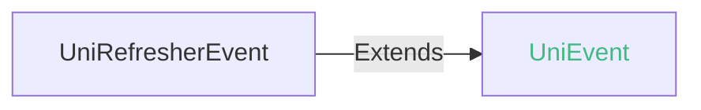
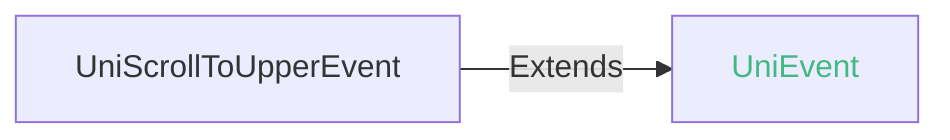
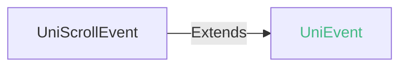

<!-- ## waterflow -->

::: sourceCode
## waterflow
:::

> 组件类型：UniWaterFlowElement 

 瀑布流组件


### 兼容性
| Web | 微信小程序 | Android | iOS | HarmonyOS | HarmonyOS(Vapor) |
| :- | :- | :- | :- | :- | :- |
| <a style="color:unset;" href="https://vote.dcloud.net.cn/#/?name=uni-app%20x">x</a> | <a style="color:unset;" href="https://vote.dcloud.net.cn/#/?name=uni-app%20x">x</a> | 4.41 | 4.41 | 4.81 | 5.02 |


在App中，waterflow 底层实现与list-view底层实现方式基本一致，仅子组件排列方式存在差异，适用于多元素瀑布流长列表场景，子组件滑动出屏幕会及时回收复用。性能优于 scroll-view

> waterflow 暂时只支持 flow-item 组件为子组件，其他组件不可见

> waterflow 只支持竖向滚动，暂时不支持横向滚动

> 鸿蒙平台api 20及以上版本支持滚动相关事件，api 18及以上版本支持load-more插槽

### 属性 
| 名称 | 类型 | 默认值 | 兼容性 | 描述 |
| :- | :- | :- |  :-: | :- |
| cross-axis-count | number | 2 | Web: x; 微信小程序: x; Android: 4.41; iOS: 4.41; HarmonyOS: 4.81; HarmonyOS(Vapor): 5.02 | 交叉轴元素数量 |
| main-axis-gap | number | 0 | Web: x; 微信小程序: x; Android: 4.41; iOS: 4.41; HarmonyOS: 4.81; HarmonyOS(Vapor): 5.02 | 主轴方向间隔 |
| cross-axis-gap | number | 0 | Web: x; 微信小程序: x; Android: 4.41; iOS: 4.41; HarmonyOS: 4.81; HarmonyOS(Vapor): 5.02 | 交叉轴方向间隔 |
| max-cross-axis-extent | number | 0 | Web: x; 微信小程序: x; Android: x; iOS: x; HarmonyOS: x; HarmonyOS(Vapor): 5.02 | flow-item交叉轴方向最大尺寸 |
| padding | Array | [0,0,0,0\] | Web: x; 微信小程序: x; Android: 4.41; iOS: 4.41; HarmonyOS: x; HarmonyOS(Vapor): x | 长度为 4 的数组，按 top、right、bottom、left 顺序指定内边距 |
| associative-container | string | - | Web: x; 微信小程序: x; Android: 4.41; iOS: 4.41; HarmonyOS: x; HarmonyOS(Vapor): x | 关联的滚动容器 |
| bounces | boolean | true | Web: x; 微信小程序: x; Android: 4.41; iOS: 4.41; HarmonyOS: 4.81; HarmonyOS(Vapor): 5.02 | 控制是否回弹效果 |
| upper-threshold | number | 50 | Web: x; 微信小程序: x; Android: 4.41; iOS: 4.41; HarmonyOS: 4.81; HarmonyOS(Vapor): 5.02 | 距顶部/左边多远时（单位px），触发 scrolltoupper 事件 |
| lower-threshold | number | 50 | Web: x; 微信小程序: x; Android: 4.41; iOS: 4.41; HarmonyOS: 4.81; HarmonyOS(Vapor): 5.02 | 距底部/右边多远时（单位px），触发 scrolltolower 事件 |
| scroll-top | number | 0 | Web: x; 微信小程序: x; Android: 4.41; iOS: 4.41; HarmonyOS: 4.81; HarmonyOS(Vapor): 5.02 | 设置竖向滚动条位置 |
| show-scrollbar | boolean | true | Web: x; 微信小程序: x; Android: 4.41; iOS: 4.41; HarmonyOS: 4.81; HarmonyOS(Vapor): 5.02 | 控制是否出现滚动条 |
| scroll-into-view | string([string.IDString](/uts/data-type.md#ide-string)) | - | Web: x; 微信小程序: x; Android: 4.41; iOS: 4.41; HarmonyOS: x; HarmonyOS(Vapor): x | 值应为某子元素id（id不能以数字开头）。设置哪个方向可滚动，则在哪个方向滚动到该元素起始位置 |
| scroll-with-animation | boolean | false | Web: x; 微信小程序: x; Android: 4.41; iOS: 4.41; HarmonyOS: 4.81; HarmonyOS(Vapor): 5.02 | 是否在设置滚动条位置时使用滚动动画，设置false没有滚动动画 |
| refresher-enabled | boolean | false | Web: x; 微信小程序: x; Android: 4.41; iOS: 4.41; HarmonyOS: 4.81; HarmonyOS(Vapor): 5.02 | 开启下拉刷新，暂时不支持scroll-x = true横向刷新 |
| refresher-threshold | number | 45 | Web: x; 微信小程序: x; Android: 4.41; iOS: 4.41; HarmonyOS: 4.81; HarmonyOS(Vapor): 5.02 | 设置下拉刷新阈值, 仅 refresher-default-style = 'none' 自定义样式下生效 |
| refresher-max-drag-distance | number | - | Web: x; 微信小程序: x; Android: 4.41; iOS: 4.41; HarmonyOS: 4.81; HarmonyOS(Vapor): 5.02 | 设置下拉最大拖拽距离（单位px），默认是下拉刷新控件高度的2.5倍 |
| refresher-default-style | string | "black" | Web: x; 微信小程序: x; Android: 4.41; iOS: 4.41; HarmonyOS: 4.81; HarmonyOS(Vapor): 5.02 | 设置下拉刷新默认样式，支持设置 black \| white \| none， none 表示不使用默认样式 |
| refresher-background | string([string.ColorString](/uts/data-type.md#ide-string)) | "transparent" | Web: x; 微信小程序: x; Android: 4.41; iOS: 4.41; HarmonyOS: 4.81; HarmonyOS(Vapor): 5.02 | 设置下拉刷新区域背景颜色，默认透明 |
| refresher-triggered | boolean | false | Web: x; 微信小程序: x; Android: 4.41; iOS: 4.41; HarmonyOS: 4.81; HarmonyOS(Vapor): 5.02 | 设置当前下拉刷新状态，true 表示下拉刷新已经被触发，false 表示下拉刷新未被触发 |
| enable-back-to-top | boolean | false | Web: x; 微信小程序: x; Android: x; iOS: 4.41; HarmonyOS: x; HarmonyOS(Vapor): 5.02 | iOS点击顶部状态栏滚动条返回顶部，只支持竖向 |
| custom-nested-scroll | boolean | false | Web: x; 微信小程序: x; Android: 4.41; iOS: x; HarmonyOS: x; HarmonyOS(Vapor): x | 子元素是否开启嵌套滚动 将滚动事件与父元素协商处理 |
| @refresherpulling | (event: [UniRefresherEvent](#unirefresherevent)) => void | - | Web: x; 微信小程序: x; Android: 4.41; iOS: 4.41; HarmonyOS: 4.81; HarmonyOS(Vapor): 5.02 | 下拉刷新控件被下拉 |
| @refresherrefresh | (event: [UniRefresherEvent](#unirefresherevent)) => void | - | Web: x; 微信小程序: x; Android: 4.41; iOS: 4.41; HarmonyOS: 4.81; HarmonyOS(Vapor): 5.02 | 下拉刷新被触发 |
| @refresherrestore | (event: [UniRefresherEvent](#unirefresherevent)) => void | - | Web: x; 微信小程序: x; Android: 4.41; iOS: 4.41; HarmonyOS: 4.81; HarmonyOS(Vapor): 5.02 | 下拉刷新被复位 |
| @refresherabort | (event: [UniRefresherEvent](#unirefresherevent)) => void | - | Web: x; 微信小程序: x; Android: 4.41; iOS: 4.41; HarmonyOS: 4.81; HarmonyOS(Vapor): 5.02 | 下拉刷新被中止 |
| @scrolltoupper | (event: [UniScrollToUpperEvent](#uniscrolltoupperevent)) => void | - | Web: x; 微信小程序: x; Android: 4.41; iOS: 4.41; HarmonyOS: 4.81; HarmonyOS(Vapor): 5.02 | 滚动到顶部/左边，会触发 scrolltoupper 事件 |
| @scrolltolower | (event: [UniScrollToLowerEvent](#uniscrolltolowerevent)) => void | - | Web: x; 微信小程序: x; Android: 4.41; iOS: 4.41; HarmonyOS: 4.81; HarmonyOS(Vapor): 5.02 | 滚动到底部/右边，会触发 scrolltolower 事件 |
| @scroll | (event: [UniScrollEvent](#uniscrollevent)) => void | - | Web: x; 微信小程序: x; Android: 4.41; iOS: 4.41; HarmonyOS: 4.81; HarmonyOS(Vapor): 5.02 | 滚动时触发，event.detail = {scrollLeft, scrollTop, scrollHeight, scrollWidth, deltaX, deltaY} |
| @scrollend | (event: [UniScrollEvent](#uniscrollevent)) => void | - | Web: x; 微信小程序: x; Android: 4.41; iOS: 4.41; HarmonyOS: 4.81; HarmonyOS(Vapor): 5.02 | 滚动结束时触发，event.detail = {scrollLeft, scrollTop, scrollHeight, scrollWidth, deltaX, deltaY} |

#### associative-container 的属性描述

| 合法值 | 兼容性 | 描述 |
| :- |  :-: | :- |
| nested-scroll-view | Web: x; 微信小程序: x; Android: 4.41; iOS: 4.41; HarmonyOS: x; HarmonyOS(Vapor): x | 嵌套滚动 |

#### refresher-default-style 的属性描述

| 合法值 | 兼容性 | 描述 |
| :- |  :-: | :- |
| black | Web: x; 微信小程序: x; Android: 4.41; iOS: 4.41; HarmonyOS: 4.81; HarmonyOS(Vapor): 5.02 | 深颜色雪花样式 |
| white | Web: x; 微信小程序: x; Android: 4.41; iOS: 4.41; HarmonyOS: 4.81; HarmonyOS(Vapor): 5.02 | 浅白色雪花样式 |
| none | Web: x; 微信小程序: x; Android: 4.41; iOS: 4.41; HarmonyOS: 4.81; HarmonyOS(Vapor): 5.02 | 不使用默认样式 |


### 事件
#### UniRefresherEvent


##### UniRefresherEvent 的属性值
| 名称 | 类型 | 必填 | 默认值 | 兼容性 | 描述 |
| :- | :- | :- | :- |  :-: | :- |
| detail | **UniRefresherEventDetail** | 是 | - | - | - |

#### detail 的属性描述

| 名称 | 类型 | 必备 | 默认值 | 兼容性 | 描述 |
| :- | :- | :- | :- |  :-: | :- |
| dy | number | 是 | - | - | - |


#### UniScrollToUpperEvent


##### UniScrollToUpperEvent 的属性值
| 名称 | 类型 | 必填 | 默认值 | 兼容性 | 描述 |
| :- | :- | :- | :- |  :-: | :- |
| detail | **UniScrollToUpperEventDetail** | 是 | - | - |  |

#### detail 的属性描述

| 名称 | 类型 | 必备 | 默认值 | 兼容性 | 描述 |
| :- | :- | :- | :- |  :-: | :- |
| direction | string | 是 | - | - | 滚动方向 top 或 left |


#### UniScrollToLowerEvent


##### UniScrollToLowerEvent 的属性值
| 名称 | 类型 | 必填 | 默认值 | 兼容性 | 描述 |
| :- | :- | :- | :- |  :-: | :- |
| detail | **UniScrollToLowerEventDetail** | 是 | - | - |  |

#### detail 的属性描述

| 名称 | 类型 | 必备 | 默认值 | 兼容性 | 描述 |
| :- | :- | :- | :- |  :-: | :- |
| direction | string | 是 | - | - | 滚动方向 bottom 或 right |


#### UniScrollEvent


##### UniScrollEvent 的属性值
| 名称 | 类型 | 必填 | 默认值 | 兼容性 | 描述 |
| :- | :- | :- | :- |  :-: | :- |
| detail | **UniScrollEventDetail** | 是 | - | - |  |

#### detail 的属性描述

| 名称 | 类型 | 必备 | 默认值 | 兼容性 | 描述 |
| :- | :- | :- | :- |  :-: | :- |
| scrollTop | number | 是 | - | - | 竖向滚动的距离 |
| scrollLeft | number | 是 | - | - | 横向滚动的距离 |
| scrollHeight | number | 是 | - | - | 滚动区域的高度 |
| scrollWidth | number | 是 | - | - | 滚动区域的宽度 |
| deltaY | number | 是 | - | - | 当次滚动事件竖向滚动量 |
| deltaX | number | 是 | - | - | 当次滚动事件横向滚动量 |


<!-- UTSCOMJSON.waterflow.component_type -->

### 自定义下拉刷新样式

waterflow组件有默认的下拉刷新样式，如果想自定义，则需使用自定义下拉刷新。

1. 设置`refresher-default-style`属性为 none 不使用默认样式
2. 设置 flow-item 定义自定义下拉刷新元素并声明为 `slot="refresher"`，需要设置刷新元素宽高信息否则可能无法正常显示！
   ```html
   <template>
   	<waterflow refresher-default-style="none" :refresher-enabled="true" :refresher-triggered="refresherTriggered"
   			 @refresherpulling="onRefresherpulling" @refresherrefresh="onRefresherrefresh"
   			 @refresherrestore="onRefresherrestore" style="flex:1" >

   		<flow-item v-for="i in 10" class="content-item" type=1>
   			<text class="text">item-{{i}}</text>
   		</flow-item>

   		<!-- 自定义下拉刷新元素 -->
   		<flow-item slot="refresher" class="refresh-box" type=2>
   			<text class="tip-text">{{text[state]}}</text>
   		</flow-item>
   	</waterflow>
   </template>
   ```
3. 通过组件提供的refresherpulling、refresherrefresh、refresherrestore、refresherabort下拉刷新事件调整自定义下拉刷新元素！实现预期效果

**注意：**
+ 目前自定义下拉刷新元素不支持放在waterflow的首个子元素位置上。可能无法正常显示

### 加载更多(load-more)

由于 waterflow 组件是多列的，单个 flow-item 组件无法占用一整行，加载更多展示不太友好，所以我们提供了slot="load-more"属性配置，waterflow 组件会特殊处理最后一个 flow-item 子组件，如果配置了slot="load-more"则显示一整行

   ```html
   <template>
   	<waterflow style="flex:1" >

   		<flow-item v-for="i in 10" class="content-item" type=1>
   			<text class="text">item-{{i}}</text>
   		</flow-item>

   		<flow-item slot="load-more" id="loadmore" type=3 class="load-more-box">
            <text>加载更多</text>
        </flow-item>
   	</waterflow>
   </template>
   ```

**注意：**
+ slot="load-more"仅对 waterflow 最后一个 flow-item 子组件生效

### 嵌套模式

scroll-view开启嵌套模式后，waterflow 可作为内层滚动视图与外层 scroll-view 实现嵌套滚动

设置内层 waterflow 的 `associative-container` 属性为 "nested-scroll-view"，开启内层 waterflow 支持与外层 scroll-view 嵌套滚动

### 子组件 @children-tags
| 子组件 | 兼容性 |
| :- | :- |
| [flow-item](flow-item.md) | Web: x; 微信小程序: x; Android: 4.41; iOS: 4.41; HarmonyOS: 4.81; HarmonyOS(Vapor): 5.02 |

### 示例
示例为[hello uni-app x alpha分支](https://gitcode.com/dcloud/hello-uni-app-x/blob/prod_alpha/pages/component/waterflow/waterflow.uvue)，与最新HBuilderX Alpha版同步。与最新正式版同步的master分支示例[另见](https://gitcode.com/dcloud/hello-uni-app-x/blob/master//pages/component/waterflow/waterflow.uvue) 
>
> 该 API 不支持 Web，请运行 hello uni-app x 到 App 平台体验 
```uvue
<script setup lang="uts">
  type ScrollEventTest = {
    type : string;
    target : UniElement | null;
    currentTarget : UniElement | null;
    direction ?: string
  }
  type flowItemData = {
    height : number,
    text : string
  }
  type DataType = {
    refresher_triggered_boolean: boolean;
    refresher_enabled_boolean: boolean;
    scroll_with_animation_boolean: boolean;
    show_scrollbar_boolean: boolean;
    bounces_boolean: boolean;
    upper_threshold_input: number;
    lower_threshold_input: number;
    scroll_top_input: number;
    scroll_left_input: number;
    refresher_background_input: string;
    scrollData: Array<flowItemData>;
    size_enum: ItemType[];
    scrollIntoView: string;
    refresherrefresh: boolean;
    refresher_default_style_input: string;
    text: string[];
    state: number;
    reset: boolean;
    isScrollTest: string;
    isScrolltolowerTest: string;
    isScrolltoupperTest: string;
    scrollDetailTest: UniScrollEventDetail | null;
    scrollEndDetailTest: UniScrollEventDetail | null;
    cross_axis_count: number;
    main_axis_gap: number;
    cross_axis_gap: number;
    waterflowPadding: Array<number>;
    isLoadingMore: boolean;
    hasMore: boolean;
  }
  import { ItemType } from '@/components/enum-data/enum-data-types'

  const data = reactive({
    refresher_triggered_boolean: false,
    refresher_enabled_boolean: false,
    scroll_with_animation_boolean: false,
    show_scrollbar_boolean: false,
    bounces_boolean: true,
    upper_threshold_input: 50,
    lower_threshold_input: 50,
    scroll_top_input: 0,
    scroll_left_input: 0,
    refresher_background_input: "#FFF",
    scrollData: [],
    size_enum: [{ "value": 0, "name": "item---0" }, { "value": 3, "name": "item---3" }],
    scrollIntoView: "",
    refresherrefresh: false,
    refresher_default_style_input: "black",
    text: ['继续下拉执行刷新', '释放立即刷新', '刷新中', ""],
    state: 3,
    reset: true,
    // 自动化测试
    isScrollTest: '',
    isScrolltolowerTest: '',
    isScrolltoupperTest: '',
    scrollDetailTest: null,
    scrollEndDetailTest: null,
    cross_axis_count: 2,
    main_axis_gap: 2,
    cross_axis_gap: 2,
    waterflowPadding: [10, 5, 10, 5],
    isLoadingMore: false,
    hasMore: true
  } as DataType)

  const waterflowRef = ref<UniWaterFlowElement | null>(null)

  onLoad(() => {
    //静态瀑布流数据
    data.scrollData = [
      { height: 300, text: "item---0" },
      { height: 150, text: "item---1" },
      { height: 120, text: "item---2" },
      { height: 100, text: "item---3" },
      { height: 100, text: "item---4" },
      { height: 150, text: "item---5" },
      { height: 140, text: "item---6" },
      { height: 190, text: "item---7" },
      { height: 160, text: "item---8" },
      { height: 120, text: "item---9" },
      { height: 109, text: "item---10" },
      { height: 102, text: "item---11" },
      { height: 123, text: "item---12" },
      { height: 156, text: "item---13" },
      { height: 177, text: "item---14" },
      { height: 105, text: "item---15" },
      { height: 110, text: "item---16" },
      { height: 90, text: "item---17" },
      { height: 130, text: "item---18" },
      { height: 140, text: "item---19" },
    ] as Array<flowItemData>
  })

  const waterflow_click = () => { console.log("组件被点击时触发") }
  const waterflow_touchstart = () => { console.log("手指触摸动作开始") }
  const waterflow_touchmove = () => { console.log("手指触摸后移动") }
  const waterflow_touchcancel = () => { console.log("手指触摸动作被打断，如来电提醒，弹窗") }
  const waterflow_touchend = () => { console.log("手指触摸动作结束") }
  const waterflow_tap = () => { console.log("手指触摸后马上离开") }
  const waterflow_longpress = () => { console.log("如果一个组件被绑定了 longpress 事件，那么当用户长按这个组件时，该事件将会被触发。") }
  const waterflow_refresherpulling = (e : RefresherEvent) => {
    console.log("下拉刷新控件被下拉")
    if (data.reset) {
      if (e.detail.dy > 45) {
        data.state = 1
      } else {
        data.state = 0
      }
    }
  }
  const waterflow_refresherrefresh = () => {
    console.log("下拉刷新被触发 ")
    data.refresherrefresh = true
    data.refresher_triggered_boolean = true
    data.state = 2
    data.reset = false;
    setTimeout(() => {
      data.refresher_triggered_boolean = false
    }, 1500)
  }
  const waterflow_refresherrestore = () => {
    data.refresherrefresh = false
    data.state = 3
    data.reset = true
    console.log("下拉刷新被复位")
  }
  const waterflow_refresherabort = () => { console.log("下拉刷新被中止") }

  // 自动化测试专用（由于事件event参数对象中存在循环引用，在ios端JSON.stringify报错，自动化测试无法page.data获取）
  const checkEventTest = (e : ScrollEventTest, eventName : String) => {
    const isPass = e.type === eventName && e.target instanceof UniElement && e.currentTarget instanceof UniElement;
    const result = isPass ? `${eventName}:Success` : `${eventName}:Fail`;
    switch (eventName) {
      case 'scroll':
        data.isScrollTest = result
        break;
      case 'scrolltolower':
        data.isScrolltolowerTest = result + `-${e.direction}`
        break;
      case 'scrolltoupper':
        data.isScrolltoupperTest = result + `-${e.direction}`
        break;
      default:
        break;
    }
  }

  const waterflow_scrolltoupper = (e : UniScrollToUpperEvent) => {
    console.log("滚动到顶部/左边，会触发 scrolltoupper 事件  direction=" + e.detail.direction)
    checkEventTest({
      type: e.type,
      target: e.target,
      currentTarget: e.currentTarget,
      direction: e.detail.direction,
    } as ScrollEventTest, 'scrolltoupper')
  }
  const waterflow_scrolltolower = (e : UniScrollToLowerEvent) => {
    console.log("滚动到底部/右边，会触发 scrolltolower 事件  direction=" + e.detail.direction)
    checkEventTest({
      type: e.type,
      target: e.target,
      currentTarget: e.currentTarget,
      direction: e.detail.direction,
    } as ScrollEventTest, 'scrolltolower')
  }
  const waterflow_scroll = (e : UniScrollEvent) => {
    console.log("滚动时触发，event.detail = ", e.detail)
    data.scrollDetailTest = e.detail
    checkEventTest({
      type: e.type,
      target: e.target,
      currentTarget: e.currentTarget
    } as ScrollEventTest, 'scroll')
  }
  const waterflow_scrollend = (e : UniScrollEvent) => {
    console.log("滚动结束时触发", e.detail)
    data.scrollEndDetailTest = e.detail
    checkEventTest({
      type: e.type,
      target: e.target,
      currentTarget: e.currentTarget
    } as ScrollEventTest, 'scrollend')
  }
  const flow_item_click = () => { console.log("flow-item组件被点击时触发") }
  const flow_item_touchstart = () => { console.log("手指触摸flow-item组件动作开始") }
  const flow_item_touchmove = () => { console.log("手指触摸flow-item组件后移动") }
  const flow_item_touchcancel = () => { console.log("手指触摸flow-item组件动作被打断，如来电提醒，弹窗") }
  const flow_item_touchend = () => { console.log("手指触摸flow-item组件动作结束") }
  const flow_item_tap = () => { console.log("手指触摸flow-item组件后马上离开") }
  const flow_item_longpress = () => { console.log("flow-item组件被绑定了 longpress 事件，那么当用户长按这个组件时，该事件将会被触发。") }
  const change_refresher_triggered_boolean = (checked : boolean) => { data.refresher_triggered_boolean = checked }
  const change_refresher_enabled_boolean = (checked : boolean) => { data.refresher_enabled_boolean = checked }
  const change_scroll_with_animation_boolean = (checked : boolean) => { data.scroll_with_animation_boolean = checked }
  const change_show_scrollbar_boolean = (checked : boolean) => { data.show_scrollbar_boolean = checked }
  const change_bounces_boolean = (checked : boolean) => { data.bounces_boolean = checked }
  const confirm_upper_threshold_input = (value : number) => { data.upper_threshold_input = value }
  const confirm_lower_threshold_input = (value : number) => { data.lower_threshold_input = value }
  const confirm_scroll_top_input = (value : number) => { data.scroll_top_input = value }
  const confirm_scroll_left_input = (value : number) => { data.scroll_left_input = value }
  const confirm_refresher_background_input = (value : string) => { data.refresher_background_input = value }
  const item_change_size_enum = (index : number) => { data.scrollIntoView = "item---" + index }

  //自动化测试专用
  const setScrollIntoView = (id : string) => { data.scrollIntoView = id }

  //自动化测试例专用
  const check_scroll_height = () : Boolean => {
    if (waterflowRef.value == null) {
      console.log("check_scroll_height--waterflowRef is null")
      return false
    }
    var listElement = waterflowRef.value as UniWaterFlowElement
    console.log("check_scroll_height--" + listElement.scrollHeight)
    return listElement.scrollHeight > 1400
  }
  const getScrollTop = () : number => {
    var ret = waterflowRef.value?.scrollTop ?? 0
    console.log(ret)
    return ret
  }
  const change_refresher_style_boolean = (checked : boolean) => {
    if (checked) {
      data.refresher_default_style_input = "none"
    } else {
      data.refresher_default_style_input = "black"
    }
  }
  const change_load_more_boolean = (checked : boolean) => {
    data.hasMore = checked
  }
  const handleChangeCrossAxisCount = (value : number) => {
    if (value < 1) {
      uni.showToast({ title: "cross-axis-count 最小值为 1 请重新设置" })
      return
    }
    data.cross_axis_count = value
  }
  const handleChangeCrossAxisGap = (e : UniSliderChangeEvent) => {
    data.cross_axis_gap = e.detail.value
  }
  const handleChangeMainAxisGap = (e : UniSliderChangeEvent) => {
    data.main_axis_gap = e.detail.value
  }
  //仅自动化测试调用
  const testModifyWaterflowProps = () => {
    data.cross_axis_count = 4
    data.main_axis_gap = 6
    data.cross_axis_gap = 6
    data.waterflowPadding = [5, 10, 5, 10]
  }
  //仅自动化测试调用
  const testModifyWaterflowSingleRow = () => {
    data.cross_axis_count = 1
    data.main_axis_gap = 6
    data.cross_axis_gap = 6
  }

  const PAGE_SIZE = 5;
  const NETWORK_DELAY = 800;

  const load_more_click = () => {
    if (!data.hasMore) return; // 已无更多
    if (data.isLoadingMore) return; // 正在加载中，忽略重复点击
    data.isLoadingMore = true
    console.log("加载更多：开始加载")
    setTimeout(() => {

      const start = data.scrollData.length
      for (let i = 0; i < PAGE_SIZE; i++) {
        data.scrollData.push({
          height: 90 + Math.floor(Math.random() * 120),
          text: `item---${start + i}`
        } as flowItemData)
      }
      data.isLoadingMore = false
      console.log("加载更多：完成，当前总数：" + data.scrollData.length)
    }, NETWORK_DELAY) // 模拟网络延迟
  }

  defineExpose({
    data,
    confirm_scroll_top_input,
    change_load_more_boolean,
    check_scroll_height,
    setScrollIntoView,
    getScrollTop,
    testModifyWaterflowProps,
    testModifyWaterflowSingleRow
  })
</script>

<template>
  <view class="main">
    <waterflow :cross-axis-count="data.cross_axis_count" :main-axis-gap="data.main_axis_gap" :cross-axis-gap="data.cross_axis_gap"
      :bounces="data.bounces_boolean" :upper-threshold="data.upper_threshold_input" :lower-threshold="data.lower_threshold_input"
      :scroll-top="data.scroll_top_input" :scroll-left="data.scroll_left_input" :show-scrollbar="data.show_scrollbar_boolean"
      :scroll-into-view="data.scrollIntoView" :scroll-with-animation="data.scroll_with_animation_boolean"
      :refresher-enabled="data.refresher_enabled_boolean" :refresher-background="data.refresher_background_input"
      :refresher-triggered="data.refresher_triggered_boolean" :refresher-default-style="data.refresher_default_style_input"
      @click="waterflow_click" @touchstart="waterflow_touchstart" @touchmove="waterflow_touchmove"
      @touchcancel="waterflow_touchcancel" @touchend="waterflow_touchend" @tap="waterflow_tap"
      @longpress="waterflow_longpress" @refresherpulling="waterflow_refresherpulling"
      @refresherrefresh="waterflow_refresherrefresh" @refresherrestore="waterflow_refresherrestore"
      @refresherabort="waterflow_refresherabort" @scrolltoupper="waterflow_scrolltoupper" ref="waterflowRef"
      @scrolltolower="waterflow_scrolltolower" @scroll="waterflow_scroll" @scrollend="waterflow_scrollend"
      style="width:100%; " id="waterflow" :padding="data.waterflowPadding">

      <flow-item v-for="(item, index) in data.scrollData" :key="index" :id="item.text" @click="flow_item_click"
        :style="{'height' : item.height}" @touchstart="flow_item_touchstart" @touchmove="flow_item_touchmove"
        @touchcancel="flow_item_touchcancel" @touchend="flow_item_touchend" @tap="flow_item_tap"
        @longpress="flow_item_longpress" class="flow-item" type=1>
        <text>{{item.text}}</text>
      </flow-item>

      <flow-item slot="refresher" id="refresher" type=2 class="refresh-box">
        <text class="tip-text">{{data.text[data.state]}}</text>
      </flow-item>
      <flow-item v-show="data.hasMore" slot="load-more" id="loadmore" type=6 class="load-more-box" @click="load_more_click">
        <text>加载更多</text>
      </flow-item>
    </waterflow>
  </view>

  <scroll-view style="flex:1" direction="vertical">
    <view class="content">
      <boolean-data :defaultValue="false" title="设置当前下拉刷新状态，true 表示下拉刷新已经被触发，false 表示下拉刷新未被触发"
        @change="change_refresher_triggered_boolean"></boolean-data>
      <boolean-data :defaultValue="false" title="开启下拉刷新" @change="change_refresher_enabled_boolean"></boolean-data>
      <boolean-data :defaultValue="false" title="开启自定义样式" @change="change_refresher_style_boolean"></boolean-data>
      <boolean-data :defaultValue="false" title="是否在设置滚动条位置时使用滚动动画，设置false没有滚动动画"
        @change="change_scroll_with_animation_boolean"></boolean-data>
      <boolean-data :defaultValue="false" title="控制是否出现滚动条" @change="change_show_scrollbar_boolean"></boolean-data>
      <boolean-data :defaultValue="true" title="控制是否回弹效果" @change="change_bounces_boolean"></boolean-data>
      <boolean-data :defaultValue="true" title="是否显示加载更多" @change="change_load_more_boolean"></boolean-data>
      <input-data defaultValue="2" title="设置cross-axis-count，触发 scrolltoupper 事件" type="number"
        @confirm="handleChangeCrossAxisCount"></input-data>
      <view class="uni-slider uni-list-cell-padding">
        <text>拖动设置cross-axis-gap</text>
      </view>
      <view class="uni-slider uni-list-cell-padding">
        <slider :max="20" :min="0" :step="1" :value="data.cross_axis_gap" :show-value="true"
          @change="handleChangeCrossAxisGap" />
      </view>
      <view class="uni-slider uni-list-cell-padding">
        <text>拖动设置main-axis-gap</text>
      </view>
      <view class="uni-slider uni-list-cell-padding">
        <slider :max="20" :min="0" :step="1" :value="data.main_axis_gap" :show-value="true"
          @change="handleChangeMainAxisGap" />
      </view>
      <input-data defaultValue="50" title="距顶部/左边多远时（单位px），触发 scrolltoupper 事件" type="number"
        @confirm="confirm_upper_threshold_input"></input-data>
      <input-data defaultValue="50" title="距底部/右边多远时（单位px），触发 scrolltolower 事件" type="number"
        @confirm="confirm_lower_threshold_input"></input-data>
      <input-data defaultValue="0" title="设置竖向滚动条位置" type="number" @confirm="confirm_scroll_top_input"></input-data>
      <input-data defaultValue="#FFF" title="设置下拉刷新区域背景颜色" type="text"
        @confirm="confirm_refresher_background_input"></input-data>
      <enum-data :items="data.size_enum" title="通过id位置跳转" @change="item_change_size_enum"></enum-data>
      <navigator url="/pages/component/waterflow/waterflow-fit-height">
        <button type="primary" class="button">
          item高度自适应
        </button>
      </navigator>
    </view>
  </scroll-view>
</template>

<style>
  .main {
    max-height: 250px;
    padding: 5px 0;
    border-bottom: 1px solid rgba(0, 0, 0, .06);
    flex-direction: row;
    justify-content: center;
  }

  .flow-item {
    width: 100%;
    height: 200px;
    border: 1px solid #666;
    background-color: #66ccff;
    align-items: center;
    justify-content: center;
  }

  .tip-text {
    color: #888;
    font-size: 12px;
  }

  .refresh-box {
    justify-content: center;
    align-items: center;
    flex-direction: row;
    height: 45px;
    width: 100%;
  }

  .load-more-box {
    justify-content: center;
    align-items: center;
    flex-direction: row;
    height: 45px;
    width: 100%;
    border-style: solid;
  }

  .button {
    margin-top: 15px;
  }
</style>

```


### 参见
- [相关 Bug](https://issues.dcloud.net.cn/?mid=component.view-container.waterflow.waterflow)
- [微信小程序文档](https://developers.weixin.qq.com/doc/search.html?source=enter&query=waterflow&doc_type=miniprogram)
- [支付宝小程序文档](https://open.alipay.com/portal/zhichi/search?keyword=waterflow&pageIndex=1&pageSize=10&source=doc_top&type=all)
- [百度小程序文档](https://smartprogram.baidu.com/forum/search?query=waterflow&scope=devdocs&source=docs)
- [抖音小程序文档](https://developer.open-douyin.com/search-page?keyword=waterflow&secondType=all&type=1)
- [飞书小程序文档](https://open.feishu.cn/search?from=header&page=1&pageSize=10&q=waterflow&topicFilter=)
- [钉钉小程序文档](https://open.dingtalk.com/search?keyword=waterflow)
- [QQ小程序文档](https://q.qq.com/wiki/develop/miniprogram/frame/)
- [快手小程序文档](https://developers.kuaishou.com/page?keyword=waterflow&from=docs)
- [京东小程序文档](https://mp-docs.jd.com/doc/dev/framework/-1)
- [华为快应用文档](https://developer.huawei.com/consumer/cn/doc/quickApp-References/webview-frame-overview-0000001124793625)
- [360小程序文档](https://mp.360.cn/doc/miniprogram/dev/#/b770a184ff1f06c6b3393a0fd1132380)

#### App平台

+ waterflow 组件默认高度是计算后瀑布流高度，无法滚动，如需要滚动要设置高度小于瀑布流高度，推荐配置 "flex:1"
+ waterflow 组件在排版完毕UI展示后，如果子组件高度放生变化，则会重新排版，flow-item 组件的UI会出现短暂的错乱和位置位移，建议控制子元素高度固定避免动态修改高度
	+ 场景一 image组件设置mode=widthFix，加载的网络图片会出现异步图片下载动态修改高度的情况，容易出现上述问题
	+ 场景二 rich-text组件nodes节点内容存在网络图片，出现异步加载情况，会出现动态修改高度导致出现上述问题
+ waterflow 组件的 overflow 属性不支持配置 visible
