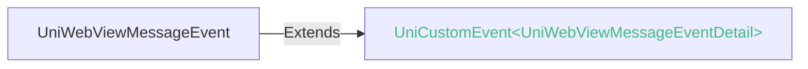
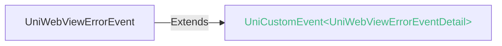
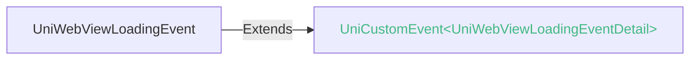
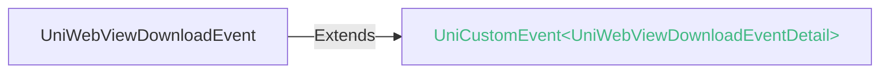
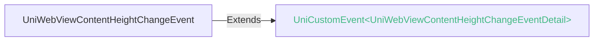

<!-- ## web-view -->

::: sourceCode
## web-view

> GitCode: https://gitcode.com/dcloud/uni-component/tree/alpha/uni_modules/uni-web-view


> GitHub: https://github.com/dcloudio/uni-component/tree/alpha/uni_modules/uni-web-view

:::

> 组件类型：[UniWebViewElement](/api/dom/uniwebviewelement.md) 

 承载网页的容器


### 兼容性
| Web | 微信小程序 | Android | iOS | HarmonyOS | HarmonyOS(Vapor) |
| :- | :- | :- | :- | :- | :- |
| 4.0 | 4.41 | 3.9 | 4.11 | 4.61 | 5.0 |


### 属性 
| 名称 | 类型 | 默认值 | 兼容性 | 描述 |
| :- | :- | :- |  :-: | :- |
| src | string([string.HTMLURIString](/uts/data-type.md#ide-string)) | - | Web: 4.0; 微信小程序: 4.41; Android: 3.9; iOS: 4.11; HarmonyOS: 4.61; HarmonyOS(Vapor): 5.0 | webview 指向网页的链接 |
| allow | string | - | Web: 4.0; 微信小程序: x; Android: x; iOS: x; HarmonyOS: x; HarmonyOS(Vapor): - | 用于为 [iframe](https://developer.mozilla.org/zh-CN/docs/Web/HTML/Element/iframe) 指定其[特征策略](https://developer.mozilla.org/zh-CN/docs/Web/HTTP/策略特征) |
| sandbox | string | - | Web: 4.0; 微信小程序: x; Android: x; iOS: x; HarmonyOS: x; HarmonyOS(Vapor): - | 该属性对呈现在 [iframe](https://developer.mozilla.org/zh-CN/docs/Web/HTML/Element/iframe) 框架中的内容启用一些额外的限制条件。 |
| fullscreen | boolean | - | Web: 4.0; 微信小程序: x; Android: x; iOS: x; HarmonyOS: x; HarmonyOS(Vapor): - | 是否铺满整个页面，默认值：`true`。 |
| webview-styles | **WebViewStyles** | {"progress":{"color":"#00FF00"}} | Web: x; 微信小程序: x; Android: 3.9; iOS: 4.11; HarmonyOS: x; HarmonyOS(Vapor): x | webview 网络地址页面加载进度条样式 |

#### webview-styles 的属性描述

| 名称 | 类型 | 必备 | 默认值 | 兼容性 | 描述 |
| :- | :- | :- | :- |  :-: | :- |
| progress | [WebViewProgressStyles](#webviewprogressstyles-values) \| boolean | 是 | {"color": "#00FF00"} | - | 网络地址页面加载进度条样式，设置为 false 时表示不显示加载进度条。 |
@
| horizontal-scroll-bar-access | boolean | true | Web: x; 微信小程序: x; Android: 4.11; iOS: 4.13; HarmonyOS: 4.61; HarmonyOS(Vapor): 5.0 | 设置是否显示横向滚动条 |
| vertical-scroll-bar-access | boolean | true | Web: x; 微信小程序: x; Android: 4.11; iOS: 4.13; HarmonyOS: 4.61; HarmonyOS(Vapor): 5.0 | 设置是否显示纵向滚动条 |
| bounces | boolean | true | Web: x; 微信小程序: x; Android: 4.61; iOS: 4.61; HarmonyOS: 4.63; HarmonyOS(Vapor): 5.0 | 设置是否开启回弹效果 |
| android-nested-scroll | string | "all" | Web: x; 微信小程序: x; Android: 4.61; iOS: x; HarmonyOS: x; HarmonyOS(Vapor): x | 设置嵌套滚动方向 |
| disable-user-select-menu | boolean | false | Web: x; 微信小程序: x; Android: 4.81; iOS: 4.84; HarmonyOS: x; HarmonyOS(Vapor): 5.0 | 设置是否禁用文本选择时弹出的系统菜单 |
| dark-mode | boolean | - | Web: -; 微信小程序: -; Android: -; iOS: -; HarmonyOS: -; HarmonyOS(Vapor): x | - |
| @message | (event: [UniWebViewMessageEvent](#uniwebviewmessageevent)) => void | - | Web: x; 微信小程序: 4.41; Android: 3.9; iOS: 4.11; HarmonyOS: 4.61; HarmonyOS(Vapor): - | 网页向应用 postMessage 时触发。e.detail = { data } |
| @error | (event: [UniWebViewErrorEvent](#uniwebviewerrorevent)) => void | - | Web: x; 微信小程序: 4.41; Android: 3.9; iOS: 4.11; HarmonyOS: 4.61; HarmonyOS(Vapor): - | 网页加载错误时触发。e.detail = { errSubject, errCode, errMsg, url, fullUrl, src } |
| @load | (event: [UniWebViewLoadEvent](#uniwebviewloadevent)) => void | - | Web: 4.72; 微信小程序: 4.41; Android: 4.0; iOS: 4.11; HarmonyOS: 4.61; HarmonyOS(Vapor): - | 网页加载完成后触发。e.detail = { url, src } |
| ~~@loaded~~ | (event: [UniWebViewLoadEvent](#uniwebviewloadevent)) => void | - | Web: x; 微信小程序: 4.41; Android: x; iOS: x; HarmonyOS: x; HarmonyOS(Vapor): - | 网页加载完成后触发。e.detail = { url, src }。已废弃，请改用load |
| @loading | (event: [UniWebViewLoadingEvent](#uniwebviewloadingevent)) => void | - | Web: x; 微信小程序: x; Android: 3.9; iOS: 4.11; HarmonyOS: 4.61; HarmonyOS(Vapor): - | 网页开始加载时触发。e.detail = { url, src } |
| @download | (event: [UniWebViewDownloadEvent](#uniwebviewdownloadevent)) => void | - | Web: x; 微信小程序: x; Android: 3.9; iOS: 4.11; HarmonyOS: 4.61; HarmonyOS(Vapor): - | 点击网页中可下载链接时触发。e.detail = { url, userAgent, contentDisposition, mimetype, contentLength } |
| @contentheightchange | (event: [UniWebViewContentHeightChangeEvent](#uniwebviewcontentheightchangeevent)) => void | - | Web: x; 微信小程序: x; Android: 4.63; iOS: 4.63; HarmonyOS: 4.63; HarmonyOS(Vapor): - | 网页内容高度变化时触发。e.detail = { height } |
| @didterminate | (event: [UniWebViewDidTerminateEvent](#uniwebviewdidterminateevent)) => void | - | Web: x; 微信小程序: x; Android: x; iOS: 5.0; HarmonyOS: x; HarmonyOS(Vapor): - | 检测到web-view压后台再回来出现白屏时触发 |
| @onWebViewServiceMessage | Event | - | Web: -; 微信小程序: -; Android: -; iOS: -; HarmonyOS: -; HarmonyOS(Vapor): 5.0 | - |

#### android-nested-scroll 的属性描述

| 合法值 | 兼容性 | 描述 |
| :- |  :-: | :- |
| all | Web: x; 微信小程序: x; Android: 4.61; iOS: x; HarmonyOS: x; HarmonyOS(Vapor): - | 横向竖向均可嵌套滚动 |
| vertical | Web: x; 微信小程序: x; Android: 4.61; iOS: x; HarmonyOS: x; HarmonyOS(Vapor): - | 竖向可嵌套滚动 |
| horizontal | Web: x; 微信小程序: x; Android: 4.61; iOS: x; HarmonyOS: x; HarmonyOS(Vapor): - | 横向均可嵌套滚动 |
| none | Web: x; 微信小程序: x; Android: 4.61; iOS: x; HarmonyOS: x; HarmonyOS(Vapor): - | 横向竖向均不可嵌套滚动 |


### 事件
#### UniWebViewMessageEvent


##### UniWebViewMessageEvent 的属性值
| 名称 | 类型 | 必填 | 默认值 | 兼容性 | 描述 |
| :- | :- | :- | :- |  :-: | :- |
| type | string | 是 | - | - | 事件类型，固定值message |


##### UniWebViewMessageEventDetail


###### UniWebViewMessageEventDetail 的属性值
| 名称 | 类型 | 必填 | 默认值 | 兼容性 | 描述 |
| :- | :- | :- | :- |  :-: | :- |
| data | UTSJSONObject[\] | 是 | - | - | 消息包含的数据，4.13版本之前类型为Map\<string, any \| null> \| null，4.13版本（含）之后类型为Array\<UTSJSONObject> |


#### UniWebViewErrorEvent


##### UniWebViewErrorEvent 的属性值
| 名称 | 类型 | 必填 | 默认值 | 兼容性 | 描述 |
| :- | :- | :- | :- |  :-: | :- |
| type | string | 是 | - | - | 事件类型，固定值error |


##### UniWebViewErrorEventDetail


###### UniWebViewErrorEventDetail 的属性值
| 名称 | 类型 | 必填 | 默认值 | 兼容性 | 描述 |
| :- | :- | :- | :- |  :-: | :- |
| errSubject | string | 是 | - | - | 统一错误主题（模块）名称，固定值uni-web-view |
| errCode | number | 是 | - | - | 统一错误码<br/>100001 ssl error<br/>100002 page error<br/>100003 http error  |
| errMsg | string | 是 | - | - | 统一错误描述信息 |
| url | string | 是 | - | - | 加载错误的网页链接，非完整链接，仅包含scheme://authority部分，4.13版本起支持 |
| fullUrl | string | 是 | - | - | 加载错误的网页链接，完整链接，4.13版本起支持 |
| src | string | 是 | - | - | 加载错误的网页链接，完整链接，4.13版本起支持 |

#### errCode 的属性描述

| 合法值 | 兼容性 | 描述 |
| :- |  :-: | :- |
| 100001 | - | - |
| 100002 | - | - |
| 100003 | - | - |


#### UniWebViewLoadEvent


##### UniWebViewLoadEvent 的属性值
| 名称 | 类型 | 必填 | 默认值 | 兼容性 | 描述 |
| :- | :- | :- | :- |  :-: | :- |
| type | string | 是 | - | - | 事件类型，固定值load |


##### UniWebViewLoadEventDetail


###### UniWebViewLoadEventDetail 的属性值
| 名称 | 类型 | 必填 | 默认值 | 兼容性 | 描述 |
| :- | :- | :- | :- |  :-: | :- |
| ~~url~~ | string | 是 | - | - | 加载完成的网页链接 |
| src | string | 是 | - | - | 加载完成的网页链接，4.13版本起支持 |


#### UniWebViewLoadingEvent


##### UniWebViewLoadingEvent 的属性值
| 名称 | 类型 | 必填 | 默认值 | 兼容性 | 描述 |
| :- | :- | :- | :- |  :-: | :- |
| type | string | 是 | - | - | 事件类型，固定值loading |


##### UniWebViewLoadingEventDetail


###### UniWebViewLoadingEventDetail 的属性值
| 名称 | 类型 | 必填 | 默认值 | 兼容性 | 描述 |
| :- | :- | :- | :- |  :-: | :- |
| ~~url~~ | string | 是 | - | - | 加载中的网页链接 |
| src | string | 是 | - | - | 加载中的网页链接，4.13版本起支持 |


#### UniWebViewDownloadEvent


##### UniWebViewDownloadEvent 的属性值
| 名称 | 类型 | 必填 | 默认值 | 兼容性 | 描述 |
| :- | :- | :- | :- |  :-: | :- |
| type | string | 是 | - | - | 事件类型，固定值download |


##### UniWebViewDownloadEventDetail


###### UniWebViewDownloadEventDetail 的属性值
| 名称 | 类型 | 必填 | 默认值 | 兼容性 | 描述 |
| :- | :- | :- | :- |  :-: | :- |
| url | string | 是 | - | - | 下载链接 |
| userAgent | string | 是 | - | - | 用户代理 |
| contentDisposition | string | 是 | - | - | 指示回复的内容该以何种形式展示，是以内联的形式（即网页或者页面的一部分），还是以附件的形式下载并保存到本地 |
| mimetype | string | 是 | - | - | 媒体类型 |
| contentLength | number | 是 | - | - | 文件大小 |


#### UniWebViewContentHeightChangeEvent


##### UniWebViewContentHeightChangeEvent 的属性值
| 名称 | 类型 | 必填 | 默认值 | 兼容性 | 描述 |
| :- | :- | :- | :- |  :-: | :- |
| type | string | 是 | - | - | 事件类型，固定值contentheightchange |


##### UniWebViewContentHeightChangeEventDetail


###### UniWebViewContentHeightChangeEventDetail 的属性值
| 名称 | 类型 | 必填 | 默认值 | 兼容性 | 描述 |
| :- | :- | :- | :- |  :-: | :- |
| height | number | 是 | - | - | 内容高度 |


<!-- UTSCOMJSON.web-view.component_type -->


### 组件宽高说明
- web和小程序平台上，web-view是全屏的，即页面只能显示一个铺满的web-view。
- app平台的web-view组件可以自由调整大小和位置。在uni-app x 4.0以前，默认宽、高为0px，页面中使用时需设置相应的 css 属性控制组件宽高才能正常显示。从4.0起改为默认宽高100%。

### 嵌套滚动说明
App平台 web-view 组件可在 scroll-view、list-view/list-item 等可滚动容器中使用，如果 web-view 中的内容可以滚动，则会出现嵌套滚动的问题，细节如下：
- app-android平台，默认开启嵌套滚动，在web-view区域操作时，会优先滚动web页面内容（web页面的body内容），web页面内容无法滚动了再滚动外层嵌套滚动容器。如果web页面使用了区域滚动，嵌套滚动逻辑不会受页面中touch事件的默认行为（[Event：preventDefault](https://developer.mozilla.org/zh-CN/docs/Web/API/Event/preventDefault)）影响，仅判断web页面内容是否可滚动，web页面内容无法滚动则触发外层嵌套滚动容器，如需配置外层嵌套容器不处理滚动需配置 android-nested-scroll 属性为 none。
- app-ios平台，在web-view区域操作时，会优先滚动web-view内容（web页面的body内容），web页面内容无法滚动并且滚动条消失后才能操作滚动外层嵌套滚动容器。如果web页面使用了区域滚动，则受页面中touch事件的默认行为（[Event：preventDefault](https://developer.mozilla.org/zh-CN/docs/Web/API/Event/preventDefault)）逻辑控制，即阻止了默认行为则不滚动外层嵌套滚动容器，不阻止默认行为则滚动外层嵌套滚动容器。

### src路径支持说明

- 本地路径/static方式
	由于uni-app/uni-app x编译时，只把/static目录下的静态资源copy到app中，所以src均需指向/static目录下。
	其他目录的html文件由于不会被打包进去，所以无法访问。
	app平台文件路径会存在大小写敏感问题，为了有更好的兼容性，建议统一按大小写敏感原则处理 [详情](../api/file-system-spec.md#casesensitive)

- 支持网络路径
	支持http、https。
	app平台使用系统Webview组件，由系统Webview管理缓存。

### 子组件 @children-tags
不可以嵌套组件

### 示例
示例为[hello uni-app x alpha分支](https://gitcode.com/dcloud/hello-uni-app-x/blob/prod_alpha/pages/component/web-view/web-view.uvue)，与最新HBuilderX Alpha版同步。与最新正式版同步的master分支示例[另见](https://gitcode.com/dcloud/hello-uni-app-x/blob/master//pages/component/web-view/web-view.uvue) 
::: preview https://hellouniappx.dcloud.net.cn/web/#/pages/component/web-view/web-view

> appRedirect https://hellouniappx.dcloud.net.cn/appredirect.html?path=pages/component/web-view/web-view

>示例
```vue
<template>
  <view class="uni-flex-item">
    <web-view id="web-view" class="uni-flex-item" :style="webViewStyle" :src="data.src"
      :webview-styles="{ progress: {color:data.webview_progress_color} }" :horizontalScrollBarAccess="data.horizontalScrollBarAccess" :verticalScrollBarAccess="data.verticalScrollBarAccess"
      :bounces="data.bounces" :disable-user-select-menu="data.disableUserSelectMenu" @message="message" @error="error" @loading="loading"
      @load="load" @download="download" @contentheightchange="contentheightchange" @touchstart="touchstart" @tap="tap">
    </web-view>
    <!-- #ifdef APP -->
    <view class="uni-padding-wrap uni-common-mt">
      <view class="uni-btn-v">
        <input class="uni-input" confirmType="go" placeholder="输入网址跳转" @confirm="confirm" :maxlength="-1" />
      </view>
      <view class="uni-row uni-btn-v">
        <button class="uni-flex-item" type="primary" :disabled="!data.canGoBack" @click="back">后退</button>
        <button class="margin-left-5 uni-flex-item" type="primary" :disabled="!data.canGoForward"
          @click="forward">前进</button>
      </view>
      <view class="uni-row uni-btn-v">
        <button class="uni-flex-item" type="primary" @click="reload">重新加载</button>
        <button class="margin-left-5 uni-flex-item" type="primary" @click="stop">停止加载</button>
      </view>
      <view class="uni-row uni-btn-v">
        <button class="uni-flex-item" type="primary" @click="nativeToWeb">原生和Web通信</button>
        <!-- #ifdef APP-ANDROID || APP-IOS || APP-HARMONY -->
        <button class="margin-left-5 uni-flex-item" type="primary" @click="getContentHeight">获取内容高度</button>
        <!-- #endif -->
      </view>
      <view class="uni-row uni-btn-v">
        <button class="uni-flex-item" type="primary" @click="loadData">加载页面内容</button>
        <!-- 用于演示大尺寸平板中能用窄屏展示响应式内容 -->
        <button id="half-screen-toggle" class="margin-left-5 uni-flex-item" type="primary" @click="setHalfScreen">宽窄屏切换</button>
      </view>
      <view class="uni-btn-v">
        <navigator url="/pages/component/web-view/web-view-scroll">
          <button type="primary">scroll-view嵌套web-view</button>
        </navigator>
      </view>
      <!-- #ifdef APP-ANDROID || APP-HARMONY || APP-IOS -->
      <view class="uni-row uni-btn-v">
        <view class="uni-row uni-flex-item align-items-center">
          <text>显示横向滚动条</text>
          <switch :checked="true" @change="changeHorizontalScrollBarAccess"></switch>
        </view>
        <view class="uni-row uni-flex-item align-items-center">
          <text>显示竖向滚动条</text>
          <switch :checked="true" @change="changeVerticalScrollBarAccess"></switch>
        </view>
      </view>
      <view class="uni-row uni-btn-v">
        <view class="uni-row uni-flex-item align-items-center">
          <text>开启bounces</text>
          <switch :checked="true" @change="changeBounces"></switch>
          <!-- #ifdef APP-ANDROID || APP-IOS-->
          <text>禁用选择菜单</text>
          <switch :checked="false" @change="changeDisableUserSelectMenu"></switch>
          <!-- #endif -->
        </view>
      </view>
      <!-- #endif -->
      <!-- #ifdef APP-IOS -->
      <view class="uni-row uni-btn-v" v-if="isProd() === false">
        <view class="uni-row uni-flex-item align-items-center">
          <text>前进、后退功能在Windows端需要打自定义基座，MAC端需要配置Xcode环境后进行真机运行或者打自定义基座</text>
        </view>
      </view>
      <!-- #endif -->
    </view>
    <!-- #endif -->
    <!-- #ifdef APP-ANDROID || APP-IOS -->
    <view class="safe-area-inset-bottom"></view>
    <!-- #endif -->
  </view>
</template>

<script setup lang="uts">
  // #ifdef APP
  import { canWebViewGoBack, canWebViewGoForward, hasNativeView } from '@/uni_modules/uts-get-native-view';
  // #endif

  type DataType = {
    src: string;
    webview_progress_color: string;
    halfWindowMode: boolean;
    webviewContext: WebviewContext | null;
    loadError: boolean;
    horizontalScrollBarAccess: boolean;
    verticalScrollBarAccess: boolean;
    bounces: boolean;
    disableUserSelectMenu: boolean;
    canGoBack: boolean;
    canGoForward: boolean;
    autoTest: boolean;
    eventLoading: UTSJSONObject | null;
    eventLoad: UTSJSONObject | null;
    eventError: UTSJSONObject | null;
    eventContentHeightChange: UTSJSONObject | null;
    pointerEvents: string;
    isTouchEnable: boolean;
    loadingCount: number;
  }
  // 使用reactive避免ref数据在自动化测试中无法访问
  const data = reactive({
    src: 'https://www.dcloud.io',
    webview_progress_color:'#FF3333',
    halfWindowMode: false,
    webviewContext: null as WebviewContext | null,
    loadError: false,
    horizontalScrollBarAccess: true,
    verticalScrollBarAccess: true,
    bounces: true,
    disableUserSelectMenu: false,
    canGoBack: false,
    canGoForward: false,
    autoTest: false,
    eventLoading: null as UTSJSONObject | null,
    eventLoad: null as UTSJSONObject | null,
    eventError: null as UTSJSONObject | null,
    eventContentHeightChange: null as UTSJSONObject | null,
    pointerEvents: 'auto',
    isTouchEnable: false,
    loadingCount: 0
  } as DataType)

  let webviewElement = null as UniWebViewElement | null

  const fullScreen = computed(() => {
    return !data.halfWindowMode
  })

  const webViewStyle = computed(() => {
    return {
      width: data.halfWindowMode ? '50%' : '100%',
      'pointer-events': data.pointerEvents
    }
  })

  const getPackageName = (): string => {
    let packageName: string = ""

    // #ifdef APP-IOS
    const res = uni.getAppBaseInfo();
    packageName = res.bundleId
    // #endif

    return packageName
  }

  const isProd = (): boolean => {
    if (getPackageName() == 'io.dcloud.hellouniappx') {
      return true
    }
    return false
  }

  const setHalfScreen = () => {
    data.halfWindowMode = !data.halfWindowMode
  }

  const back = () => {
    webviewElement?.back();
  }

  const forward = () => {
    webviewElement?.forward();
  }

  const reload = () => {
    data.loadingCount = 0
    webviewElement?.reload();
  }

  const stop = () => {
    webviewElement?.stop();
  }

  const nativeToWeb = () => {
    webviewElement?.evalJS("alert('hello uni-app x')");
  }

  // #ifdef APP-ANDROID || APP-IOS || APP-HARMONY
  const getContentHeight = (): number => {
    const height = webviewElement?.getContentHeight() ?? 0;
    console.log('contentHeight', height);
    if (!data.autoTest) {
      uni.showModal({
        content: ' 当前内容高度: ' + height,
        showCancel: false
      });
    }
    return height;
  }

  const loadData = () => {
    webviewElement?.loadData({
      data: '<p><a href="https://www.dcloud.io/hbuilderx.html">HBuilderX</a><br/></img><h1>HBuilderX，轻巧、极速，极客编辑器</h1><p style="color:red;"><small>HBuilderX，轻巧、极速，极客编辑器 </small><big>HBuilderX，轻巧、极速，极客编辑器</big><strong>HBuilderX，轻巧、极速，极客编辑器</strong><i>HBuilderX，轻巧、极速，极客编辑器 </i><u>HBuilderX，轻巧、极速，极客编辑器</u><del>HBuilderX，轻巧、极速，极客编辑器</del></p><h2>uni-app x，终极跨平台方案</h2>、<p style="background-color: yellow;"><small>uni-app x，终极跨平台方案 </small><big>uni-app x，终极跨平台方案</big><strong>uni-appx，终极跨平台方案 </strong><i>uni-app x，终极跨平台方案 </i><u>uni-app x，终极跨平台方案 </u><del>uni-appx，终极跨平台方案</del></p><h3>uniCloud，js serverless云服务</h3><p style="text-decoration: line-through;"><small>uniCloud，js serverless云服务 </small><big>uniCloud，jsserverless云服务</big><strong>uniCloud，js serverless云服务 </strong><i>uniCloud，js serverless云服务 </i><u>uniCloud，jsserverless云服务</u><del>uniCloud，js serverless云服务</del></p><h4>uts，大一统语言</h4><p style="text-align: center;"><small>uts，大一统语言 </small><big>uts，大一统语言 </big><strong>uts，大一统语言</strong><i>uts，大一统语言</i><u>uts，大一统语言 </u><del>uts，大一统语言</del></p><h5>uniMPSdk，让你的App具备小程序能力</h5><h6>uni-admin，开源、现成的全端管理后台</h6><ul><li style="color: red; text-align: left;">uni-app x，终极跨平台方案</li><li style="color: green; text-align: center;">uni-app x，终极跨平台方案</li><li style="color: blue; text-align: right;">uni-app x，终极跨平台方案</li></ul><a href="https://uniapp.dcloud.net.cn">uni-app</a><br/></img></p>',
      baseURL: 'https://qiniu-web-assets.dcloud.net.cn'
    });
  }
  // #endif

  const message = (event: UniWebViewMessageEvent) => {
    console.log(JSON.stringify(event.detail));
  }

  const error = (event: UniWebViewErrorEvent) => {
    data.loadError = true
    console.log(JSON.stringify(event.detail));
    if (data.autoTest) {
      data.eventError = {
        "tagName": event.target?.tagName,
        "type": event.type,
        "errCode": event.detail.errCode,
        "errMsg": event.detail.errMsg,
        "url": event.detail.url,
        "fullUrl": event.detail.fullUrl,
        "src": event.detail.src
      };
    }
  }

  const loading = (event: UniWebViewLoadingEvent) => {
    data.loadingCount++
    // console.log(JSON.stringify(event.detail));
    if (data.autoTest) {
      data.eventLoading = {
        "tagName": event.target?.tagName,
        "type": event.type,
        "src": event.detail.src
      };
    }
  }

  const load = (event: UniWebViewLoadEvent) => {
    console.log(JSON.stringify(event.detail));
    // #ifdef APP
    data.canGoBack = canWebViewGoBack('web-view');
    data.canGoForward = canWebViewGoForward('web-view');
    // #endif
    if (data.autoTest) {
      data.eventLoad = {
        "tagName": event.target?.tagName,
        "type": event.type,
        "src": event.detail.src,
        "url": event.detail.url,
      };
    }
  }

  const download = (event: UniWebViewDownloadEvent) => {
    console.log(JSON.stringify(event.detail));
    uni.showModal({
      content: "下载链接: " + event.detail.url + "\n文件大小: " + event.detail.contentLength / 1024 + "KB",
      showCancel: false
    });
  }

  const contentheightchange = (event: UniWebViewContentHeightChangeEvent) => {
    console.log(JSON.stringify(event.detail));
    data.eventContentHeightChange = {
      "tagName": event.target?.tagName,
      "type": event.type,
      "isValidHeight": event.detail.height > 0
    };
  }

  const confirm = (event: UniInputConfirmEvent) => {
    let url = event.detail.value;
    if (!url.startsWith('https://') && !url.startsWith('http://')) {
      url = 'https://' + url;
    }
    data.src = url;
  }

  const changeHorizontalScrollBarAccess = (event: UniSwitchChangeEvent) => {
    data.horizontalScrollBarAccess = event.detail.value;
  }

  const changeVerticalScrollBarAccess = (event: UniSwitchChangeEvent) => {
    data.verticalScrollBarAccess = event.detail.value;
  }

  const changeBounces = (event: UniSwitchChangeEvent) => {
    data.bounces = event.detail.value;
  }

  const changeDisableUserSelectMenu = (event: UniSwitchChangeEvent) => {
    data.disableUserSelectMenu = event.detail.value;
  }

  const touchstart = (event: UniTouchEvent) => {
    if (data.autoTest) {
      data.isTouchEnable = event.touches[0].clientX > 0 && event.touches[0].clientY > 0;
    }
  }

  const tap = (event: UniPointerEvent) => {
    if (data.autoTest) {
      data.isTouchEnable = event.clientX > 0 && event.clientY > 0;
    }
  }

  const checkNativeWebView = (): boolean => {
    // #ifdef APP
    return hasNativeView('web-view')
    // #endif
    // #ifdef WEB
    return true
    // #endif
  }

  const checkLoadingCount = () => {
    data.loadingCount = 0
    webviewElement?.reload();
  }

  onReady(() => {
    // #ifdef APP
    // TODO web 实现createWebviewContext
    // this.webviewContext = uni.createWebviewContext('web-view', this)
    // NOTE 绑定到 this 上会被代理导致无法调用方法
    webviewElement = uni.getElementById('web-view') as UniWebViewElement //推荐使用element，功能更丰富
    // console.log('url: ',this.webviewElement?.getAttribute("src"));
    // this.webviewElement?.setAttribute("src","https://ext.dcloud.net.cn/")
    // #endif
  })

  onUnload(() => {
    webviewElement = null;
  })

  defineExpose({
    data,
    reload,
    checkNativeWebView,
    checkLoadingCount,
    // #ifdef APP-ANDROID || APP-IOS || APP-HARMONY
    getContentHeight,
    loadData
    // #endif
  })
</script>

<style>
  .margin-left-5 {
    margin-left: 5px;
  }

  .align-items-center {
    align-items: center;
  }

  .safe-area-inset-bottom {
    height: var(--uni-safe-area-inset-bottom);
  }
</style>

```

:::


### 参见
- [相关 Bug](https://issues.dcloud.net.cn/?mid=component.web-view.web-view)
- [参见uni-app相关文档](https://uniapp.dcloud.io/component/web-view.html)
- [微信小程序文档](https://developers.weixin.qq.com/miniprogram/dev/component/web-view.html)
- [支付宝小程序文档](https://open.alipay.com/portal/zhichi/search?keyword=web-view&pageIndex=1&pageSize=10&source=doc_top&type=all)
- [百度小程序文档](https://smartprogram.baidu.com/forum/search?query=web-view&scope=devdocs&source=docs)
- [抖音小程序文档](https://developer.open-douyin.com/search-page?keyword=web-view&secondType=all&type=1)
- [飞书小程序文档](https://open.feishu.cn/search?from=header&page=1&pageSize=10&q=web-view&topicFilter=)
- [钉钉小程序文档](https://open.dingtalk.com/search?keyword=web-view)
- [QQ小程序文档](https://q.qq.com/wiki/develop/miniprogram/frame/)
- [快手小程序文档](https://developers.kuaishou.com/page?keyword=web-view&from=docs)
- [京东小程序文档](https://mp-docs.jd.com/doc/dev/framework/-1)
- [华为快应用文档](https://developer.huawei.com/consumer/cn/doc/quickApp-References/webview-frame-overview-0000001124793625)
- [360小程序文档](https://mp.360.cn/doc/miniprogram/dev/#/b770a184ff1f06c6b3393a0fd1132380)

### 上下文对象API

web-view的操作api为[uni.createWebviewContext()](../api/create-webview-context.md)。

给web-view组件设一个id属性，将id的值传入uni.createWebviewContext()，即可得到web-view组件的上下文对象，进一步可使用`.evalJS()`、`.reload()`等封装好的跨平台方法。

#### 获取原生WebView对象@nativeview

为增强uni-app x组件的开放性，从 `HBuilderX 4.25` 起，UniElement对象提供了 [getAndroidView](../dom/unielement.md#getandroidview) 和 [getIOSView](../dom/unielement.md#getiosview) 方法。

该方法可以获取到 web-view 组件对应的原生 `WebView` 对象，从而可以调用原生 API 以扩展当前 web-view 组件和上下文对象未提供的能力。

比如：Android 平台和 iOS 平台的原生 WebView 都提供了 canGoBack 和 canGoForward 两个 API，用来判断当前网页是否可以回退和前进。但 uni-app x 的 web-view 组件上下文对象没有封装上述 API。

下面则举例说明在 Android 平台如何通过获取原生 WebView 对象来实现上述能力（iOS 平台写法类似）。

```js
import WebView from 'android.webkit.WebView';

function canGoBack() : boolean {
	// 第一步获取web-view组件的UniElement对象
	const element = uni.getElementById(elementId); //elementId为页面上web-view组件的id。不过一般建议从uvue页面给uts插件传入指定的UniElement对象，而不是在uts插件中直接获取页面组件的id。
	// 第二步通过UniElement的getAndroidView方法，通过泛型指定的方式，获取Android原生的WebView对象。泛型参数即为原生对象的类型名称
  const webview = element?.getAndroidView<WebView>();
	// 然后就可以调用原生WebView的各种方法，比如 canGoBack 方法
  return webview == null ? false : webview.canGoBack();
}

function canGoForward() : boolean {
  const element = uni.getElementById(elementId); //elementId为页面上web-view组件的id
  const webview = element?.getAndroidView<WebView>();
  return webview == null ? false : webview.canGoForward();
}
```

详细的示例源码，在 hello uni-app x 的 组件 -> [web-view 示例](https://gitcode.com/dcloud/hello-uni-app-x/blob/alpha/pages/component/web-view/web-view.uvue) 中，
获取原生WebView对象，然后进一步使用了可否前进后退的方法，封装代码如下：
- [Android](https://gitcode.com/dcloud/hello-uni-app-x/blob/alpha/uni_modules/uts-get-native-view/utssdk/app-android/index.uts)
- [iOS](https://gitcode.com/dcloud/hello-uni-app-x/blob/alpha/uni_modules/uts-get-native-view/utssdk/app-ios/index.uts)


### web-view组件的内外通信
- uts向web-view的网页发消息

	使用`evalJS()`方法，详见上方示例代码

- web-view里的网页向uts发消息

	在网页中引入[uni.webview.1.5.5.js](https://gitcode.com/dcloud/hello-uni-app-x/blob/alpha/hybrid/html/uni.webview.1.5.5.js)。即可在网页中调用一批uni的api，包括：

|方法名|说明|平台差异说明|
|:-|:-|:-|
|uni.webView.navigateTo|[navigateTo](../api/navigator.md#uni-navigateto)|Web平台暂不支持|
|uni.webView.redirectTo|[redirectTo](../api/navigator#redirectto)|Web平台暂不支持|
|uni.webView.reLaunch|[reLaunch](../api/navigator#relaunch)|Web平台暂不支持|
|uni.webView.switchTab|[switchTab](../api/navigator#switchtab)|Web平台暂不支持|
|uni.webView.navigateBack|[navigateBack](../api/navigator#navigateback)|Web平台暂不支持|
|uni.webView.getEnv|获取当前webView环境|uvue/nvue/plus/h5|
|uni.webView.postMessage|向应用发送消息|Web平台暂不支持|

在网页中使用`uni.webView.postMessage()`即可向uts发送消息。

uts端在 `<web-view>` 组件的 `message` 事件回调 `event.detail.data` 中接收消息。

示例代码详见[hello uni-app x 的 /hybrid/html/local.html](https://gitcode.com/dcloud/hello-uni-app-x/blob/alpha/hybrid/html/local.html)

**Tips**

- 传递的消息信息，必须写在 data 对象中。
- `event.detail.data` 中的数据，以数组的形式接收每次 post 的消息。（注：支付宝小程序除外，支付宝小程序中以对象形式接受）
- web平台web-view组件底层使用iframe实现，会有浏览器安全策略限制。一般不推荐在web平台使用web-view组件，如确需使用，且需要通信，请自行根据iframe的浏览器规范进行通信。

### 本地网页跨域@cors
web-view组件有跨域问题，服务器网页的跨域问题属于常规web开发范畴，请自行查阅文档。\
但当App平台加载本地磁盘的html文件时，跨域问题需要单独说明。

各App平台的webview对本地网页跨域的策略不同，Android、iOS、鸿蒙，要求依次严格。

#### 鸿蒙
鸿蒙其自身有设计问题，在同一时间，web-view只能配置允许访问下列2种本地目录中的一种。
1. App 包资源（如项目 static 文件夹内容）
2. 沙盒文件（如使用 uni.downloadFile 下载的文件等，[详见](../api/file-system-spec.md)）

uni-app x中，web-view组件在鸿蒙上**默认**配置为允许跨域访问 App包资源。

所以，默认情况下，**web-view访问应用沙盒文件会报不允许访问**。

- 如果开发者需要访问应用沙盒，需要用如下代码对web-view切换设置：

```ts
// 获取web-view组件对应的鸿蒙原生Controller
const webviewController = uni.getElementById(elementId)?.getHarmonyController() as webview.WebviewController | null
// 修改跨域设置
webviewController?.setPathAllowingUniversalAccess([])
```

- 上述修改将允许该web-view访问应用沙箱目录，但会造成该web-view无法再访问 App包资源。如需再访问 App 资源（如项目 static 文件夹内容），需要再调用如下代码切换：
```ts
const webviewController = uni.getElementById(elementId)?.getHarmonyController() as webview.WebviewController | null

webviewController?.setPathAllowingUniversalAccess([
	getContext()!.filesDir,
	getContext()!.getApplicationContext().filesDir,
	getContext()!.resourceDir,
	getContext()!.getApplicationContext().resourceDir
].filter(item => !!item).map(item => item + '/uni-app-x/apps'))
```

鸿蒙的安全团队认为过多开放目录访问会造成安全漏洞，但同时也限制了开发者需求的实现。DCloud正在与华为交涉，[详见](https://issuereporter.developer.huawei.com/detail/250515172631027/comment?ha_source=Dcloud&ha_sourceId=89000448)

## 注意
- app平台web-view组件为系统Webview组件，内核版本号不由uni-app x框架控制。
- app-android平台，web-view版本不一定是手机默认浏览器的版本。在部分手机上系统web-view的升级需要升级rom，部分手机则可以单独升级Android System Webview包。如需x5等三方webview，需使用uts插件，[见插件市场](https://ext.dcloud.net.cn/search?q=x5)。使用三方webview可减少系统webview的碎片化问题。
- app-ios平台，web-view的版本与iOS的版本绑定，也即是手机Safari浏览器的版本。WKWebview的限制比Android要多一些，比如无法使用跨域cookie，具体见Apple开发者文档。
- app-ios平台不支持padding style（padding-top、padding-left、padding-right、padding-bottom）
- 页面中的web-view组件数量不宜太多，每个web-view都会占用不少内存。
- uni.postMessage已不推荐使用（将废弃），功能与uni.webView.postMessage一致，推荐使用uni.webView.postMessage。
