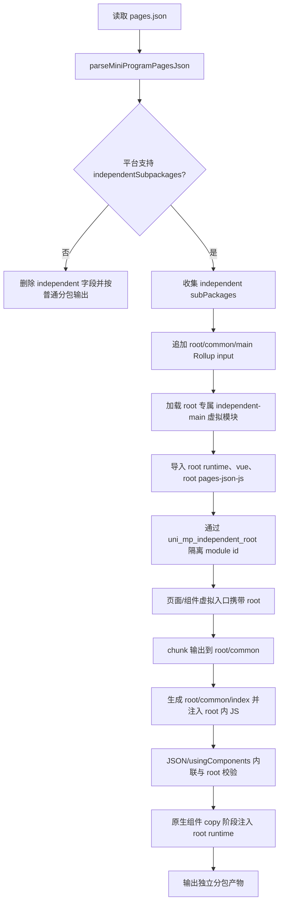

# 微信小程序独立分包实现文档

## 当前结论

vue3 小程序独立分包采用“单次 Vite/Rollup 构建 + 独立分包额外 input + root query 隔离 module id”的方案实现。

核心原则：

- 独立分包冷启动严格对齐微信原生规范：不执行主包 `app.js`、不执行项目根 `main.js/main.ts/main.uts`、不执行 `App.vue`，也不主动触发 `App.onLaunch/onShow/onHide`。
- 每个独立分包 root 都有自己的 `common/main.js`、`common/vendor.js`、`common/index.js`，并在 root 内自包含运行时依赖。
- `manifest-json-js` 保持 app 级入口；`pages-json-js` 支持 `uni_mp_independent_root`，用于只导入当前独立分包页面。
- 第一阶段要求开发者主动隔离业务资源：独立分包业务源码、页面局部组件、原生组件、静态资源、样式都应放在当前 root 内。
- 不支持独立分包的平台会在 JSON 解析阶段移除 `subPackages[].independent`，按普通分包输出。

## 启用方式

不新增 `manifest.json` 配置，沿用微信原生 `pages.json` 配置：

```jsonc
{
  "subPackages": [
    {
      "root": "package-a",
      "independent": true,
      "pages": [
        {
          "path": "pages/index/index"
        }
      ]
    }
  ]
}
```

平台能力由各小程序平台 compiler options 声明：

```ts
app: {
  subpackages: true,
  independentSubpackages: true
}
```

当前 `mp-weixin` 配置 `independentSubpackages: true`。`parseMiniProgramPagesJson()` 根据该能力决定是否保留 `independent` 字段；不支持的平台不需要独立判断，会自然退回普通分包。

## 整体流程



## 编译期设计

### 1. 独立分包元信息

实现位置：

- `packages/uni-cli-shared/src/json/mp/subpackage.ts`
- `packages/uni-mp-vite/src/plugins/independentUtils.ts`

`parseIndependentSubPackages(pagesJson)` 只接收已解析的 pagesJson 对象，不在内部读取 `pages.json` 文件。它负责：

- 兼容 `subPackages` 与 `subpackages`。
- 只收集 `independent === true` 的分包。
- 过滤非法 root、空 pages。
- 将 root 规范化为不带首尾 `/` 的路径。

Vite 侧通过 `initIndependentSubPackages()` / `updateIndependentSubPackages()` 维护当前构建中的独立分包状态。该状态会被 input、resolve、pages-json-js、copy 原生组件等流程复用，避免各处重复读取文件。

### 2. Rollup input

实现位置：`packages/uni-mp-vite/src/plugin/build.ts`

普通主包入口保持不变：

```ts
input: {
  app: resolveMainPathOnce(inputDir)
}
```

当平台支持独立分包时，`parseRollupInput()` 使用 `parsePagesJson(inputDir, platform, false)` 获取未被小程序 appJson normalize 合并的 pagesJson，并为每个独立分包追加 input：

```ts
input: {
  app: resolveMainPathOnce(inputDir),
  'package-a/common/main': '\0uni:mp-independent-main?root=package-a'
}
```

注意：

- `package-a/common/main` 是输出入口名，不要求源码中存在 `package-a/common/main.ts`。
- `UNI_MP_PLUGIN` 场景不启用独立分包 input。
- 多 input 本身不会自动复制共享依赖；必须通过 root query 让独立分包模块拥有独立 module id。

### 3. root query 隔离

实现位置：`packages/uni-mp-vite/src/plugins/independentUtils.ts`

统一使用 `uni_mp_independent_root` 标识独立分包 root：

```text
vue?uni_mp_independent_root=package-a
uni-mp-runtime?uni_mp_independent_root=package-a
src/package-a/pages/index/index.vue?uni_mp_independent_root=package-a
```

核心工具：

- `parseIndependentRoot(id)`：读取 root。
- `withIndependentRoot(id, root)`：追加或替换 root query。
- `withoutIndependentRoot(id)`：移除 root query。
- `getIndependentRootByFilename(filename, inputDir)`：根据真实文件路径匹配所属独立分包 root。

这样 Rollup 会把主包、普通分包、不同独立分包看到的同一依赖识别为不同 module id，从而允许它们分别输出到各自 root 内。

### 4. 独立分包 main 虚拟模块

实现位置：`packages/uni-mp-vite/src/plugins/independent.ts`

虚拟模块 `\0uni:mp-independent-main?root=package-a` 生成当前 root 专属启动代码：

```ts
import { createIndependentSubpackageApp } from 'uni-mp-runtime?uni_mp_independent_root=package-a'
import { createSSRApp } from 'vue?uni_mp_independent_root=package-a'
import 'pages-json-js?uni_mp_independent_root=package-a'

createSSRApp({}).mount('#app', 'package-a', {
  independent: true,
  createApp: createIndependentSubpackageApp,
})
```

该模块只做独立分包运行时初始化：

- 不 import 项目根 `main.*`。
- 不 import `App.vue`。
- 不复用主包 app factory。
- 只创建空 Vue app 上下文，供当前独立分包页面/组件挂载。
- `createApp` 使用当前 root runtime 导出的 `createIndependentSubpackageApp`，避免先后进入主包/独立分包时拿到错误 runtime。

### 5. root-scoped pages-json-js

实现位置：

- `packages/uni-cli-shared/src/vite/plugins/jsonJs.ts`
- `packages/uni-mp-vite/src/plugins/pagesJson.ts`

`manifest-json-js` 仍保持 app 级，不允许独立分包 root query。

`pages-json-js` 允许唯一的 `uni_mp_independent_root` query：

```ts
import 'pages-json-js?uni_mp_independent_root=package-a'
```

pagesJson 插件解析到 root 后，只生成当前 root 下页面的虚拟入口 import：

```ts
import('uniPage://...root=package-a...')
```

普通 app 级 `pages-json-js` 仍负责导入主包页面、普通分包页面，以及非 root-scoped 场景所需页面。

开发模式中，`pages.json` 的读取、解析和 watch 仍统一由 pagesJson 插件负责。root 列表变化时输出 restart 提示并退出，由外层重启机制重新构建；root 列表未变化时复用同一 watcher 更新页面导入。

### 6. 页面/组件虚拟入口

实现位置：`packages/uni-mp-vite/src/plugins/entry.ts`

`virtualPagePath(filepath, root?)` 与 `virtualComponentPath(filepath, root?)` 通过 base64 JSON 携带 root：

```json
{
  "filepath": "package-a/pages/index/index.vue",
  "root": "package-a"
}
```

加载独立分包页面/组件时：

- 真实 Vue 文件 import 会附加 root query。
- `createPage` / `createComponent` 从当前 root 的 `uni-mp-runtime` 导入。
- 不再依赖全局 `wx.createPage` / `wx.createComponent` 当前指向。

示例产物逻辑：

```ts
import { createPage as __uniCreatePage } from 'uni-mp-runtime?uni_mp_independent_root=package-a'
import MiniProgramPage from '/input/package-a/pages/index/index.vue?uni_mp_independent_root=package-a'

__uniCreatePage(MiniProgramPage)
```

### 7. root query 传播与依赖校验

实现位置：`packages/uni-mp-vite/src/plugins/independent.ts`

当 importer 带有 root query 时，独立分包插件会尝试解析依赖并继续附加相同 root query。

不会传播 root query 的资源包括：

- 已带独立分包 root query 的 id。
- `uniPage://`、`uniComponent://` 虚拟入口。
- `plugin://`、`dynamicLib://`、`ext://`、`data:`、`http(s):` 等小程序或外部协议。
- `?raw`、`?url` 资源。
- CSS/SCSS/LESS/Stylus 请求。

第一阶段会校验 root 内 JS/Vue 不能同步引用 root 外项目文件。`node_modules` 与内置运行时依赖允许重复打包到当前 root 内。

### 8. chunk 输出

实现位置：`packages/uni-mp-vite/src/plugin/build.ts`

chunk 命名先解析 root query，再决定输出位置：

- 独立分包 runtime/vendor/assets 输出到 `${root}/common/*`。
- 独立分包项目内公共 JS 输出到 `${root}/common/<path>.js`。
- 独立分包动态 chunk 输出到当前 root 内或 `${root}/common`。
- 普通主包、普通分包未带 root query，沿用原输出策略。

构建后会再次校验 `${root}/` 内 JS 不引用 root 外产物，避免独立分包冷启动时依赖主包 `common/*`。

### 9. bootstrap 注入

实现位置：`packages/uni-mp-vite/src/plugins/independent.ts`

每个独立分包会生成：

```text
${root}/common/index.js
```

内容：

```js
require('./main.js');
```

插件会给 `${root}/` 下非 `common/` 的 JS chunk 顶部注入到该 bootstrap 的相对 require，确保页面/组件执行前当前 root 的 `common/main.js` 已初始化。

### 10. 样式与资源约束

实现位置：`packages/uni-mp-vite/src/plugins/independent.ts`

独立分包遵循微信原生样式规则：冷启动不加载主包 `app.wxss`。

当前策略：

- 不复制主包 `app.wxss`。
- 不生成来自主包 app 样式的 `${root}/common/main.wxss`。
- 校验独立分包 WXSS 不能引用 `app.wxss`。
- 校验独立分包 WXSS 不能引用 root 外本地资源。
- root 内 Vue style 产生的可重定位 JS chunk 会复制到 `${root}/common/`，避免引用主包 common。

如需独立分包公共样式，业务应放在当前 root 内并由页面或组件显式引用。

### 11. JSON 与 usingComponents

实现位置：

- `packages/uni-cli-shared/src/json/mp/jsonFile.ts`
- `packages/uni-cli-shared/src/mp/usingComponents.ts`
- `packages/uni-mp-vite/src/plugins/usingComponents.ts`
- `packages/uni-mp-vite/src/plugins/mainJs.ts`

关键规则：

- `addMiniProgramAppJson()` 会从当前 appJson 中缓存独立分包 roots。
- `findChangedJsonFiles()` 发现页面/组件属于独立分包时，会把 app 级 `usingComponents` 与全局组件 usingComponents 内联到当前页面/组件 JSON，避免冷启动依赖主包 `app.json`。
- 独立分包 JSON 中的本地 `usingComponents` 必须位于当前 root 内；root 外本地组件会报错。
- 页面局部或组件局部 `usingComponents` 的相对路径按 owner JSON 所在路径解析；绝对路径按项目根解析。
- Vue SFC descriptor cache key 增加 root 维度，避免同一真实文件以主包和独立分包身份编译时互相覆盖。
- 主包或普通分包同步引用独立分包目录内组件会报错，避免未来分包异步化能力被同步依赖破坏。

### 12. uni-app x 内置资源

实现位置：

- `packages/uni-mp-vite/src/plugin/configResolved.ts`
- `packages/uni-mp-vite/src/plugin/index.ts`
- `packages/uni-mp-compiler/src/template/codegen.ts`

`uvue.wxss`、`nvue.wxss` 与 `common/uniView.wxs` 是小程序编译器生成的内置运行资源，不属于业务 root 外依赖。独立分包需要拥有自己的副本，且引用路径在源头生成时就指向当前 root：

- 主包继续输出 `uvue.wxss` / `nvue.wxss`，每个独立分包额外输出 `${root}/uvue.wxss` / `${root}/nvue.wxss`。
- 独立分包页面 WXSS 自动引用 `${root}/uvue.wxss` 或 `${root}/nvue.wxss` 的相对路径，例如 `../../uvue.wxss`。
- 主包继续输出 `common/uniView.wxs`，每个独立分包额外输出 `${root}/common/uniView.wxs`。
- 独立分包模板自动导入 `${root}/common/uniView.wxs` 的相对路径，例如 `../../common/uniView.wxs`。

这些路径不在 independent 插件中后置扫描改写，而是在 `uvue.wxss` / `nvue.wxss` import 与 auto import filter 生成时直接写正确。`uniView.wxs` 通过 Vite 侧包装现有 `filter.generate`，结合模板 owner filename 计算独立分包相对路径，不新增平台级 `template.filter` 配置；非独立分包继续保持 `uvue.wxss`、`nvue.wxss` 与 `/common/uniView.wxs` 原路径。

### 13. 原生小程序组件 copy 处理

实现位置：`packages/uni-mp-vite/src/plugin/copy.ts`

普通原生小程序组件会继续沿用现有 copy 流程。启用独立分包能力且平台配置了 `template.component.dir` 时，`normalizeCopyOptions()` 会把原生组件 copy asset 转成带 transform 的 target。

copy 阶段会基于已维护的独立分包 root 状态判断文件是否属于独立分包 root 内的原生组件。若命中 `${root}/${componentDir}/**/*.js` 或 `${root}/uni_modules/*/${componentDir}/**/*.js`，会在组件 JS 注册前注入当前 root runtime：

```js
require('../../common/vendor.js');
Component({})
```

注入会保留 `"use strict"` 指令顺序。这样独立分包原生组件在执行 `Component(...)` 前能加载当前 root 的 runtime，确保 Vue3 小程序运行时的 `u-p` props 缓存、事件桥接等逻辑命中同一份 runtime。

## 运行时设计

### 1. app.mount 分发

实现位置：`packages/uni-mp-vue/src/plugin.ts`

`app.mount()` 支持第三个参数：

```ts
app.mount('#app', 'package-a', {
  independent: true,
  createApp: createIndependentSubpackageApp,
})
```

分发优先级：

1. `UNI_MP_PLUGIN`：使用 `createPluginApp`。
2. 传入 root 且 `independent: true`：使用 `createIndependentSubpackageApp`，并优先使用 mount options 传入的 root 专属 `createApp`。
3. 传入 root 或存在 `process.env.UNI_SUBPACKAGE`：使用普通 `createSubpackageApp`。
4. 其它情况：使用主包 `createApp`。

### 2. 独立分包 app 创建

实现位置：

- `packages/uni-mp-core/src/runtime/app.ts`
- `packages/uni-mp-core/src/runtime/subpackage.ts`
- `packages/uni-mp-weixin/src/runtime/index.ts`

`initCreateIndependentSubpackageApp()` 只注册当前 root 的空 app vm：

```ts
setSubpackageAppVm(resolveSubpackageRoot(root), vm, true)
```

它不会：

- 调用 `getApp()`。
- 调用或模拟 `App.onLaunch/onShow/onHide`。
- 注册 `wx.onAppShow` / `wx.onAppHide` 转发 App 生命周期。
- 合并 `globalData`。
- 把用户 App options 写回原生 App 实例。

独立分包 app vm 存储在当前 runtime 内部缓存中；普通分包继续使用历史的 `__GLOBAL__.$subpackages` 存储，兼容旧的 `process.env.UNI_SUBPACKAGE` 路径。

`setSubpackageAppVm()` 会同步设置 runtime 当前 root，页面/组件通过 `getRuntimeSubpackageRoot()` 读取 root，再从当前 runtime 缓存中取 app vm。这样可避免“先进入独立分包 -> 再进入主包 -> 再进入独立分包”时，因为主包 runtime 重建全局对象导致独立分包 vm 丢失。

## 当前能力边界

已经支持：

- `mp-weixin` 独立分包冷启动。
- build 与 dev/watch 使用同一套 Vite/Rollup 构建图。
- 独立分包 root 专属 runtime、Vue、pages-json-js 与页面/组件入口。
- 独立分包页面/组件 JSON 内联 app 级 usingComponents。
- root 内 Vue 组件、原生小程序组件、静态资源、样式。
- 原生小程序组件在独立分包中使用 Vue3 `u-p` 机制传递属性。
- root 外 JS/Vue/WXSS/本地资源/本地 usingComponents 的第一阶段错误提示。
- 不支持独立分包的平台自动退回普通分包。

当前不支持：

- 独立分包自动引用 root 外业务 JS/TS/Vue 文件。
- 独立分包自动复制 root 外原生小程序组件。
- 独立分包自动复制 root 外静态资源。
- 独立分包复用项目根 `main.*` 中的 `app.use()`、`globalProperties`、`provide`、store、i18n、全局 mixin 等初始化逻辑。
- 独立分包复用 `App.vue` app 级样式。
- 独立分包冷启动模拟主包 App 生命周期。

## 开发模式

开发模式不能通过多次 Vite 构建实现，必须保持在同一个 watcher 内：

- 独立分包 extra input 与主包共享同一 Rollup graph。
- root query 模块通过同一 watcher 增量更新。
- 页面/组件虚拟入口读取真实文件时调用 `this.addWatchFile()`。
- `pages.json` 和 locale 文件由 pagesJson 插件统一 watch。
- root 列表变化时输出 `dev.watching.restart.independentSubPackages` 对应提示并退出，由外层重启机制重新构建。
- 当前没有针对“仅 pages.json usingComponents 变化”强制 invalidate 已编译页面的完整机制，后续需要统一设计。

## 验收重点

自动化测试覆盖方向：

- `app.json` 保留或移除 `subPackages[].independent` 符合平台能力配置。
- 独立分包生成 `${root}/common/main.js`、`${root}/common/vendor.js`、`${root}/common/index.js`。
- `${root}/common/main.js` 包含 `createSSRApp({})` 与 `{ independent: true }`，且不包含项目根 `main.*` 业务代码。
- 独立分包 JS 不引用主包 `common/*`。
- 独立分包 WXSS 不引用 `app.wxss` 或 root 外资源。
- 独立分包 JSON 内联必要 usingComponents，并拒绝 root 外本地组件。
- root 内原生小程序组件 JS 注入当前 root `common/vendor.js`。
- 主包、普通分包、插件、其它小程序平台旧用例保持不变。

微信开发者工具手工验证重点：

- 清缓存后直接以独立分包页面启动。
- 主包页面跳转到独立分包页面。
- 独立分包页面启动后跳转主包，再跳回独立分包。
- 独立分包冷启动不打印根 `main.*` 顶层日志，不触发主包 `App.onLaunch/onShow`。
- 首次进入主包或普通分包时，再按微信原生规范触发主包 App 生命周期。
- 独立分包 root 内 Vue 组件、原生小程序组件、静态资源、样式均可用。

## 未来 TODO

### T01 自动处理 root 外业务依赖

目标：开发者不再需要手动把所有业务依赖移动到独立分包 root 内。

需要处理：

- root 外 JS/TS 自动附加当前 root query 并重复打包。
- root 外 Vue 组件输出到当前 root 内，并递归处理组件依赖。
- root 外原生小程序组件复制 `.json/.wxml/.wxss/.js` 及递归依赖。
- root 外静态资源复制到当前 root 内，并重写 JS/WXSS/WXML 引用。
- app 级或全局组件按实际使用复制或重写到当前 root。

约束：不能恢复“执行项目根 `main.*` / 模拟主包 App 生命周期”的旧行为。

### T02 pages.json usingComponents 热更新

当前 `pages-json-js` 虚拟 id 不携带 pages.json 内容版本。开发期如果只修改 `pages.json` 中影响模板编译的 `usingComponents`，可能无法强制已编译页面重新 transform。

后续需要统一设计 invalidate 策略，避免在虚拟 id 中直接携带大体积 pages.json 内容。

### T03 独立分包公共样式入口

当前仅支持 root 内页面/组件显式引入样式，不复制主包 `app.wxss`。后续可评估新增独立分包专属公共样式入口，用于承载 root 内共享样式，但仍不复用主包 app 级样式。

### T04 分包异步化与跨包依赖协同

后续支持分包异步化时，需要重新定义主包、普通分包、独立分包之间的跨包组件引用规则：

- 同步引用仍应避免主包或普通分包直接依赖独立分包目录。
- 可异步加载的跨包组件需要明确产物位置、运行时加载顺序与错误提示。
- 自动处理 root 外依赖时需与异步化策略保持一致，避免重复复制或错误共享。

### T05 Vite/Rolldown 输出策略评估

升级到 Vite/Rolldown 后，核心隔离原则仍是“每个独立分包一个额外 input + root query 或等价 module id 隔离”。未来可评估是否用 Rolldown 的 chunk 分组能力简化 manualChunks/chunkFileNames，但不能依赖多 input 自动复制共享依赖。
