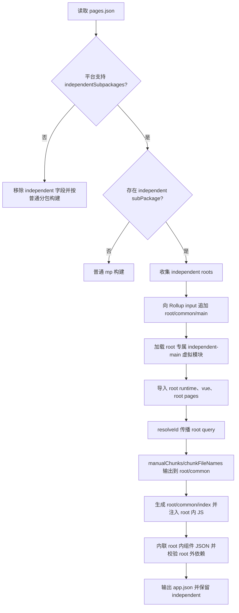

# 微信小程序独立分包实现方案

## 背景

微信小程序独立分包支持从分包页面冷启动。冷启动独立分包时，主包不会被下载，因此主包的 `app.js`、`app.wxss`、主包 `common/*` 不会先执行或加载。

微信官方规范的关键约束是：

- 从独立分包页面启动时，主包不存在，`App` 也不存在，`getApp()` 可能返回 `undefined`。
- 主包 `App.onLaunch` 和首次 `App.onShow` 会在用户首次进入主包或普通分包页面时才调用。
- 独立分包中不能定义 `App`，小程序生命周期监听应使用 `wx.onAppShow`、`wx.onAppHide`。
- 主包 `app.wxss` 对独立分包无效。

uni-app vue2 的 webpack 版曾通过运行时包装 `App/getApp` 来模拟主包 App 生命周期，提升旧业务兼容性；但这不符合微信原生冷启动行为。vue3 先按微信原生规范实现：独立分包冷启动不执行项目根 `main.js/main.ts/main.uts`，不执行 `App.vue`，不主动触发主包 App 生命周期。

## 目标

- 支持 `mp-weixin` 独立分包冷启动。
- build 和 dev/watch 使用同一套 Vite/Rollup 构建与 watcher。
- 第一阶段要求开发者主动隔离独立分包业务资源。
- 后续第二阶段再由编译器自动处理 root 外业务依赖。
- 不影响主包、普通分包、插件编译、其它小程序平台。

## 配置约定

不新增 `manifest.json` 配置，仅使用微信原生 `pages.json` 字段启用独立分包：

```jsonc
{
  "subPackages": [
    {
      "root": "package-a",
      "independent": true,
      "pages": [{ "path": "pages/index/index" }]
    }
  ]
}
```

平台是否支持独立分包由各平台 compiler options 配置：`mp-weixin` 设置 `app.independentSubpackages: true`。JSON 解析阶段根据该配置决定是否保留 `subPackages[].independent`；不支持的平台会移除该字段并退回普通分包输出。

## vue2 实现参考

vue2 不是为独立分包单独跑编译，而是在同一次 webpack 构建中增加入口并做产物处理：

- `parseEntry()` 给每个独立分包增加 `${root}/common/main` 入口。
- 入口 value 指向项目根 `main.js/main.ts`，所以会把用户 app 初始化逻辑编译出一份 root 内 `common/main.js`。
- 插件生成 `${root}/common/index.js`，并注入到独立分包页面/组件 JS 前面。
- 运行时包装 `App/getApp`，独立分包启动时会模拟执行 `app.onLaunch`，并通过 `wx.onAppShow/onAppHide` 转发到用户 App 生命周期。

该方案兼容旧业务，但会导致独立分包冷启动时也执行根 `main.*` 和 App 生命周期，行为与微信原生规范不一致。vue3 不沿用该 runtime hack。

## Vite/Rollup 核心方案

采用“单 Vite/Rollup 构建 + 每个独立分包一个额外 input + root query 隔离 module id”的方案。

Rollup 多 input 会共享相同 resolved module id，没有“每个 input 完整复制依赖”的开关。独立分包需要 root 内自包含产物，因此必须让独立分包入口看到 root 专属 module id。

示例：

```ts
input: {
  app: resolveMainPathOnce(inputDir),
  'package-a/common/main': '\0uni:mp-independent-main?root=package-a'
}
```

`package-a/common/main` 是 Rollup input name，即最终产物名；源码目录不需要存在 `package-a/common/main.ts`。

### 独立分包 main 虚拟模块

`\0uni:mp-independent-main?root=package-a` 返回编译器生成的 root 专属启动代码：

```ts
import 'uni-mp-runtime?uni_mp_independent_root=package-a'
import { createSSRApp } from 'vue?uni_mp_independent_root=package-a'
import '\0uni:mp-independent-pages?root=package-a'

createSSRApp({}).mount('#app', 'package-a', { independent: true })
```

要点：

- 不 import 项目根 `main.js/main.ts/main.uts`。
- 不 import `App.vue`。
- 不复用 app factory。
- 只创建一个空 Vue app 上下文，用于小程序页面/组件运行时挂载。
- 第三个参数 `{ independent: true }` 让 `uni-mp-vue` 选择独立分包专用运行时创建方法。

### 独立分包 bootstrap

额外生成 `${root}/common/index.js`，并注入到独立分包页面/组件 JS 顶部：

```js
require('./main.js')
```

页面 JS 先执行 `common/index.js`，确保当前 root 的 runtime、Vue app 空上下文、页面模块已经初始化。

### root query 传播

独立分包模块通过 `uni_mp_independent_root` 区分 module id：

```text
src/package-a/pages/index/index.vue
src/package-a/pages/index/index.vue?uni_mp_independent_root=package-a
vue?uni_mp_independent_root=package-a
uni-mp-runtime?uni_mp_independent_root=package-a
```

这样主包和独立分包不会因为相同 module id 被 Rollup 合并到同一份 chunk。第一阶段允许重复打包 `vue`、`uni-mp-runtime`、`@dcloudio/*` 运行时依赖。

## 运行时行为

`uni-mp-vue` 的 `app.mount()` 支持第三个参数：

```ts
app.mount('#app', 'package-a', { independent: true })
```

选择规则：

- `UNI_MP_PLUGIN` 存在：仍走 `createPluginApp`。
- 传入 root 且 `independent: true`：走 `createIndependentSubpackageApp(vm, root)`。
- 传入 root 或 `process.env.UNI_SUBPACKAGE`：走普通 `createSubpackageApp`。
- 否则走主包 `createApp`。

`createIndependentSubpackageApp` 只做一件事：

```ts
setSubpackageAppVm(resolveSubpackageRoot(root), vm)
```

它不会：

- 调用 `getApp()`。
- 调用或模拟 `onLaunch`。
- 注册 `wx.onAppShow` / `wx.onAppHide` 来转发 App 生命周期。
- 合并 `globalData` 或把用户 App options 写回原生 App 实例。

页面/组件侧通过当前页面 route 反查 `__GLOBAL__.$subpackages[root].$vm`，独立分包冷启动时不依赖 `getApp().$vm`。

## 第一阶段能力边界

第一阶段采用“开发者主动隔离”。

必须放在当前独立分包 root 内：

- 独立分包业务源码。
- 页面局部 Vue 组件。
- 微信原生组件。
- 本地静态资源。
- 独立分包页面需要的局部样式。

第一阶段会报错的情况：

- 独立分包 JS/Vue 引用 root 外业务文件。
- 独立分包 WXSS 引用主包 `app.wxss` 或 root 外本地资源。
- 独立分包 JSON/usingComponents 引用 root 外本地组件。
- 主包或普通分包同步引用独立分包目录内组件。

第一阶段不会提供：

- 根 `main.*` 中的 `app.use()`、`globalProperties`、`provide`、store、i18n、全局 mixin、全局组件注册。
- `App.vue` 的 app 级样式。
- `App.onLaunch/onShow/onHide` 的模拟触发。
- 主包 `app.wxss` 复制或注入。
- `copyWxComponentsOnDemand`、`insertAppCssToIndependent` 开关。

## 第二阶段能力边界

第二阶段由编译器自动处理 root 外业务依赖，仍保持微信原生 App 生命周期行为：

- root 外 JS/TS 自动附加 root query，重复打包到当前 root。
- root 外 Vue 组件生成当前 root 内 JS/WXML/WXSS/JSON 产物。
- root 外微信原生组件复制 `.json/.wxml/.wxss/.js` 及递归依赖树。
- root 外静态资源复制到当前 root 内并重写引用。
- 全局组件按实际使用自动内联到独立分包页面/组件 JSON。

注意：第二阶段可以自动处理依赖，但不应恢复“执行根 `main.*` / 模拟 App 生命周期”的旧行为。

## 整体流程



## 关键实现点

### 1. 独立分包元信息

`packages/uni-cli-shared/src/json/mp/subpackage.ts`

- `parseIndependentSubPackages(pagesJson)` 只接收已解析的 pagesJson 对象，不在内部读文件。
- 兼容 `subPackages` 与 `subpackages`。
- 只收集 `independent === true` 且 root/pages 有效的配置。
- root 规范化为不带首尾 `/`。

### 2. Rollup input

`packages/uni-mp-vite/src/plugin/build.ts`

- 使用 `parsePagesJson(inputDir, platform, false)` 获取原始 pagesJson。
- 根据 `options.app.independentSubpackages` 判断是否解析独立分包。
- 为每个 root 追加 `\0uni:mp-independent-main?root=xxx` input。
- `UNI_MP_PLUGIN` 场景不启用独立分包 input。

### 3. pages.json watch 更新

`packages/uni-mp-vite/src/plugins/pagesJson.ts`

- pagesJson 插件本身负责监听 `pages.json`。
- transform 时更新独立分包 root 缓存。
- 如果 root 列表发生变化，输出现有 restart 提示并退出，由外层重启机制重新构建。

### 4. 独立分包插件

`packages/uni-mp-vite/src/plugins/independent.ts`

- 解析并加载 `\0uni:mp-independent-main?root=xxx`。
- 解析并加载 `\0uni:mp-independent-pages?root=xxx`，只导入当前 root 下页面。
- 解析并加载 `\0uni:mp-independent-page?root=xxx&page=xxx`。
- 对独立分包 importer 传播 root query。
- 生成 `${root}/common/index.js`。
- 给 `${root}/` 下非 `common/` JS 注入 bootstrap require。
- 把 root 内 style chunk relocate 到 `${root}/common/`。
- 校验 root 内 JS/WXSS 不引用 root 外产物。

### 5. 页面/组件虚拟路径

`packages/uni-mp-vite/src/plugins/entry.ts`

- `virtualPagePath(filepath, root?)`、`virtualComponentPath(filepath, root?)` 通过 base64 JSON 携带 root。
- 普通旧格式仍兼容。
- 带 root 的 page/component 加载真实文件时附加 root query。
- 输出小程序 JSON 文件名时仍使用真实路径，不能带 query。

### 6. chunk 输出

`packages/uni-mp-vite/src/plugin/build.ts`

- `manualChunks` 先解析 root query，再 strip query。
- 带 root query 的 runtime/vendor/assets 输出到 `${root}/common/*`。
- 带 root query 的动态 chunk 输出到当前 root 内。
- 构建后由 independent 插件校验 root 内 JS 不引用主包 `common/*`。

### 7. JSON 与 usingComponents

`packages/uni-cli-shared/src/json/mp/jsonFile.ts`、`packages/uni-cli-shared/src/mp/usingComponents.ts`

- 独立分包页面/组件 JSON 内联全局 usingComponents，避免依赖主包 `app.json`。
- 第一阶段校验本地组件必须在当前 root 内。
- descriptor cache key 增加 root 维度，避免同一真实文件以主包和独立分包身份进入时互相覆盖。

### 8. 运行时

`packages/uni-mp-core/src/runtime/app.ts`

- 新增 `initCreateIndependentSubpackageApp()`。
- 只注册 root 对应的 subpackage app vm。
- 保留普通 `initCreateSubpackageApp()` 的旧行为，避免影响普通分包兼容性。

`packages/uni-mp-weixin/src/runtime/index.ts`

- 注册 `createIndependentSubpackageApp` 到 `wx` 与 `global`。

`packages/uni-mp-vue/src/plugin.ts`

- `app.mount(rootContainer, root, { independent: true })` 选择 `createIndependentSubpackageApp`。
- 普通 subpackage 和插件路径保持原有优先级。

## 样式策略

按微信原生规范，独立分包冷启动不加载主包 `app.wxss`。第一阶段不复制、不注入主包 app 级样式。

当前仅做校验：

- 独立分包 WXSS 不能引用 `app.wxss`。
- 独立分包 WXSS 不能引用 root 外本地资源。
- root 内页面/组件自己的样式保持原路径输出。
- root 内 Vue style 拆出的 JS chunk 如被页面引用，会复制到 `${root}/common/`，避免引用主包 common。

如果业务需要独立分包级公共样式，第一阶段建议放在 root 内并由页面显式引入；后续可增加“独立分包专属全局样式入口”，但不复用主包 `app.wxss`。

## 开发模式

独立分包不能通过多次 Vite 构建实现，开发模式必须进入同一个 watcher：

- 独立分包额外 input 在同一 Rollup graph 内。
- root query 模块通过同一 watcher 增量更新。
- 虚拟模块读取真实页面文件时调用 `this.addWatchFile()`。
- `pages.json` 内容变化由 pagesJson 插件重新解析；root 列表变化时触发 restart。
- 产物校验在 build 和 watch 都执行。

## 测试计划

自动化断言：

- `app.json` 中 `subPackages[].independent === true`。
- 独立分包目录内存在 `${root}/common/index.js`、`${root}/common/main.js`、页面 JS/JSON/WXML/WXSS。
- `${root}/common/main.js` 包含 `createSSRApp({})` 和 `{ independent: true }`。
- `${root}/common/main.js` 不包含根 `main.*` 中的业务标记、`App Launch` 等代码。
- 独立分包目录内不生成 `${root}/common/main.wxss` 作为主包样式复制产物。
- 独立分包页面 WXSS 不 import 主包 `common/main.wxss` 或 `app.wxss`。
- 独立分包 JS 不引用主包 `common/*`。
- root 外业务 JS/Vue/静态资源/原生组件引用报错清晰。
- 普通分包和主包现有 snapshot 保持一致。

手工验证：

- 微信开发者工具中以独立分包页面作为启动页冷启动。
- 清缓存后冷启动独立分包页面。
- 独立分包冷启动时不打印根 `main.*` 顶层日志，不触发 `App.onLaunch` / 首次 `App.onShow`。
- 从独立分包跳转到主包或普通分包时，再触发主包 `App.onLaunch` / 首次 `App.onShow`。
- 主包页面跳转到独立分包页面后，主包已存在，此时 `getApp()` 按微信原生行为可获取真实 App。
- 验证独立分包 root 内组件、原生组件、静态资源可用。

## 任务 TODO（可独立提交）

### 第一阶段：主动隔离 + 微信原生生命周期

#### C01 配置识别与元信息解析

- 新增 `parseIndependentSubPackages(pagesJson)`。
- 仅接收 pagesJson 对象，不在内部读文件。
- 兼容 `subPackages/subpackages`、非法 root、空 pages。
- 建议提交：`feat(mp-weixin): 解析独立分包配置`

#### C02 平台能力配置与 app.json 输出

- 在 `mp-weixin` compiler options 中增加 `app.independentSubpackages: true`。
- `parseMiniProgramPagesJson()` 根据该配置保留或删除 `independent` 字段。
- 建议提交：`feat(mp): 配置化独立分包能力`

#### C03 Rollup input 追加独立分包入口

- 为每个 root 追加 `${root}/common/main` input。
- input value 指向 `\0uni:mp-independent-main?root=xxx`。
- 建议提交：`feat(mp-vite): 为独立分包追加 rollup input`

#### C04 root query 工具

- 增加 `parseIndependentRoot`、`withIndependentRoot`、`withoutIndependentRoot`、`hasIndependentRoot`。
- 保留 Vue SFC 其它 query。
- 建议提交：`feat(mp-vite): 增加独立分包 root query 工具`

#### C05 独立分包插件骨架

- 注册 `uniIndependentSubpackagePlugin`。
- 无 independent 配置时空转。
- 识别 independent main/pages/page 虚拟 id。
- 建议提交：`feat(mp-vite): 增加独立分包插件骨架`

#### C06 独立分包 common/main 虚拟模块

- 生成 root 专属 `common/main.js`。
- 只导入 root runtime、root vue、root pages。
- 使用 `createSSRApp({}).mount('#app', root, { independent: true })`。
- 不导入用户 `main.*`、不导入 `App.vue`、不触发 app factory。
- 建议提交：`feat(mp-vite): 生成独立分包 common main`

#### C07 root-specific pages 虚拟模块

- `\0uni:mp-independent-pages?root=xxx` 只导入当前 root 页面。
- 页面虚拟路径携带 root 元信息。
- 建议提交：`feat(mp-vite): 生成独立分包页面虚拟模块`

#### C08 root query 传播接入

- importer 带 root query 时，resolved id 继续附加相同 root。
- 跳过插件协议、外部 URL、raw/url、CSS 等不适合传播的资源。
- root 外业务依赖第一阶段报错。
- 建议提交：`feat(mp-vite): 传播独立分包 root query`

#### C09 页面/组件虚拟路径携带 root

- 扩展 `virtualPagePath`、`virtualComponentPath`。
- 兼容旧 base64 字符串格式。
- 加载真实文件时附加 root query。
- 建议提交：`feat(mp-vite): 支持页面组件虚拟路径携带 root`

#### C10 chunk 输出到 root/common

- 带 root query 的 vendor/runtime/assets 输出到 `${root}/common/*`。
- 动态 chunk 根据 root 输出。
- 校验 root 内 JS 不引用主包 common。
- 建议提交：`feat(mp-vite): 输出独立分包 root 内 chunk`

#### C11 生成并注入 common/index bootstrap

- emit `${root}/common/index.js`。
- 给 root 下非 common JS 注入 `require('../common/index.js')`。
- 建议提交：`feat(mp-vite): 注入独立分包 bootstrap`

#### C12 运行时独立分包 app 创建

- 新增 `initCreateIndependentSubpackageApp()`。
- 微信运行时注册 `createIndependentSubpackageApp`。
- `uni-mp-vue` 在 `independent: true` 时调用它。
- 不调用 `getApp`，不模拟 App 生命周期。
- 建议提交：`feat(mp-runtime): 支持独立分包原生生命周期`

#### C13 JSON 与 usingComponents root 维度

- 独立分包页面/组件 JSON 内联必要 global usingComponents。
- descriptor cache 增加 root 维度。
- root 外组件第一阶段报错。
- 建议提交：`feat(mp): 支持独立分包 JSON root 维度`

#### C14 第一阶段依赖隔离校验

- 校验 JS/Vue、本地静态资源、微信原生组件、WXSS root 外引用。
- 错误信息包含 root、importer/source 或产物路径。
- 建议提交：`feat(mp-weixin): 校验独立分包 root 外依赖`

#### C15 样式原生规范处理

- 不复制主包 `app.wxss`。
- 不生成主包样式来源的 `${root}/common/main.wxss`。
- 校验独立分包 WXSS 不引用主包 `app.wxss` 和 root 外资源。
- 建议提交：`feat(mp-weixin): 校验独立分包样式依赖`

#### C16 dev/watch 支持

- 虚拟模块读取真实文件时 `addWatchFile()`。
- `pages.json` 在 pagesJson 插件内重新解析。
- independent root 列表变化时输出 restart 提示。
- 建议提交：`feat(mp-vite): 支持独立分包 watch 更新`

#### C17 playground 正向用例

- 增加 `independent: true` 分包。
- 覆盖 root 内页面、Vue 组件、微信原生组件、静态资源。
- 用例不依赖根 `main.*` 注入的 store/global/plugin。
- 建议提交：`test(mp-weixin): 增加独立分包正向用例`

#### C18 负向用例与产物断言

- 断言 root 外业务依赖报错。
- 断言 independent main 不包含根 `main.*` 代码。
- 断言不复制主包 app 样式。
- 建议提交：`test(mp-weixin): 增加独立分包边界断言`

#### C19 微信开发者工具手工验收记录

- 记录冷启动、清缓存冷启动、独立分包跳主包、主包跳独立分包。
- 重点记录 App 生命周期触发时机与微信原生规范一致。
- 建议提交：`docs(mp-weixin): 记录独立分包手工验收结果`

### 第二阶段：自动处理 root 外业务依赖

#### C20 root 外 JS/TS 自动隔离

- 自动附加 root query 并重复打包到当前 root。
- 保持不执行根 `main.*`。
- 建议提交：`feat(mp-weixin): 自动隔离独立分包 root 外脚本`

#### C21 root 外 Vue 组件自动处理

- root 外 Vue 组件生成当前 root 内 JS/WXML/WXSS/JSON。
- 递归处理组件依赖与资源引用。
- 建议提交：`feat(mp-weixin): 自动处理独立分包 root 外 Vue 组件`

#### C22 root 外微信原生组件自动复制

- 复制并重写 `.json/.wxml/.wxss/.js` 及递归依赖。
- 建议提交：`feat(mp-weixin): 自动复制独立分包原生组件`

#### C23 root 外静态资源自动复制

- 复制图片/字体等本地资源到当前 root 内。
- 重写 JS/WXSS/WXML 引用。
- 建议提交：`feat(mp-weixin): 自动复制独立分包静态资源`

#### C24 全局组件自动复制与内联

- 分析独立分包实际使用的全局组件。
- root 外全局组件按 Vue/原生组件规则复制或重写。
- 建议提交：`feat(mp-weixin): 自动处理独立分包全局组件`

## Vite 8.1 / Rolldown 评估

升级到 Vite 8.1 / Rolldown 后，核心方案仍不会变成“只靠多 input 自动复制依赖”。Rolldown 的自动 code splitting 仍以相同 module id 共享为基础；独立分包要自包含，仍需要 root query 或等价机制让模块身份唯一。

未来可评估简化的是 chunk 输出策略：

```text
当前 Vite/Rollup:
  root query -> manualChunks -> chunkFileNames

未来 Vite/Rolldown:
  root query -> output.codeSplitting.groups -> entry/chunk naming
```

无论底层是 Rollup 还是 Rolldown，都应保持：

- 每个独立分包一个额外 input。
- root 专属虚拟 main。
- root query 传播或等价 module id 隔离。
- root 内 bootstrap。
- 严格微信原生 App 生命周期行为。
