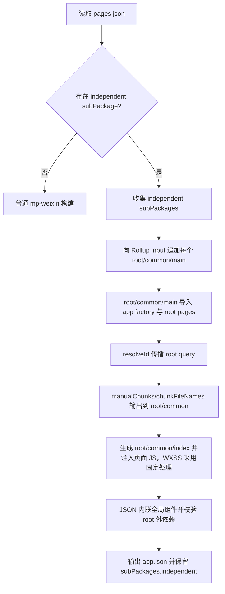

# 微信小程序独立分包实现方案

## 背景

微信小程序独立分包支持从分包页面冷启动。冷启动独立分包时，主包的 `app.js`、`app.wxss`、主包 `common/*` 不会先执行或加载，因此独立分包必须具备自启动所需的入口代码、运行时、样式和组件资源。

uni-app vue2 的 webpack 编译器在 `uni-app-vue2-dev` 分支中已经支持过该能力。vue3 迁移到 Vite/Rollup 后，不适合为每个独立分包额外启动一套 Vite 编译流程；尤其开发模式是长期 watch，无法维护多套构建。最终方案应在同一个 Vite/Rollup 构建和 watcher 内完成。

## 目标

- 支持 `mp-weixin` 独立分包冷启动。
- build 和 dev/watch 使用同一套机制。
- 第一阶段要求开发者主动隔离业务资源，降低实现复杂度。
- 后续第二阶段再由编译器自动处理 root 外业务依赖。
- 不影响普通分包、插件编译、其它小程序平台。

## 配置约定

不新增 `manifest.json` 配置，仅使用微信原生 `pages.json` 字段启用独立分包：

```jsonc
// pages.json
{
  "subPackages": [
    {
      "root": "package-a",
      "independent": true,
      "pages": [
        { "path": "pages/index/index" }
      ]
    }
  ]
}
```

- `subPackages[].independent`：微信原生字段，作为编译器启用独立分包增强逻辑的唯一配置，同时必须保留输出到 `app.json`。

## vue2 实现参考

vue2 不是为独立分包单独跑编译，而是在同一次 webpack 构建中增加入口并做产物处理：

- `packages/uni-cli-shared/lib/pages.js`
  - `parseEntry()` 给每个独立分包增加 `${root}/common/main` 入口。
  - 该入口的 value 仍然是项目根目录的用户 `main.js/main.ts`，不是 `${root}/main.js`。
  - 维护 `process.UNI_SUB_PACKAGES_ROOT`，用于通过页面路径反查分包 root。
- `packages/vue-cli-plugin-uni/lib/mp/index.js`
  - webpack `entry()` 返回 `process.UNI_ENTRY`，独立分包入口与主包进入同一张图。
- `packages/uni-mp-weixin/lib/independent-plugins/*`
  - 生成 `${root}/common/index.js` 作为独立分包冷启动执行入口，内容类似 `require('runtime.js');require('library.js');require('vendor.js');require('main.js')`。
  - 给独立分包内 JS 注入 `${root}/common/index.js` 依赖，用它代替主包 `app.js` 的启动作用。
  - 拆分/复制 runtime、vendor、library。
  - 给页面 `wxss` 注入独立分包全局样式。
  - 处理 `App()`、`getApp()`、包外组件、微信原生组件、JSON 路径重写。
- `packages/uni-cli-shared/lib/cache.js`
  - 独立分包开启时，把全局组件内联到页面/组件 JSON，避免依赖主包 `app.json`。

因此 vue2 里有两个容易混淆的入口概念：

- **webpack input**：`${root}/common/main -> 用户 main.js/main.ts`，用于把用户 app 初始化逻辑编译出一份 root 内 `common/main.js`。
- **独立分包冷启动入口**：`${root}/common/index.js`，由插件生成，并注入到独立分包页面/组件 JS 前面，负责加载 root 内 `runtime/library/vendor/main`。

vue3 + Vite/Rollup 可以保留“root 内有 `common/main.js` 产物”的形态，但不应直接把项目 `main.uts/main.ts/main.js` 当成独立分包的真实 module id；需要先经过 root 专属 app factory，并用 root 内 bootstrap 触发执行，避免与主包共享同一个 Rollup module id。

## 当前 Vite 版相关代码

- `packages/uni-mp-weixin/src/compiler/options.ts`：微信小程序平台配置。
- `packages/uni-mp-vite/src/plugin/build.ts`：Rollup input、`manualChunks`、`chunkFileNames`。
- `packages/uni-mp-vite/src/plugins/pagesJson.ts`：解析 `pages.json`，生成 `app.json`、页面 JSON，并导入页面。
- `packages/uni-mp-vite/src/plugins/entry.ts`：实现 `uniPage://`、`uniComponent://` 虚拟模块。
- `packages/uni-mp-vite/src/plugins/mainJs.ts`：转换主包用户 `main.js/main.ts/main.uts`，独立分包不能直接把该文件作为入口。
- `packages/uni-cli-shared/src/json/mp/pages.ts`：生成小程序 `appJson/pageJsons`。
- `packages/uni-cli-shared/src/json/mp/jsonFile.ts`：缓存并输出小程序 JSON。
- `packages/uni-cli-shared/src/mp/usingComponents.ts`：分析组件引用并生成 `usingComponents`。
- `packages/uni-mp-vue/src/plugin.ts`、`packages/uni-mp-core/src/runtime/app.ts`、`packages/uni-mp-core/src/runtime/component.ts`：小程序 app/page/component 运行时。

## Vite 8.1 / Rolldown 评估

截至 2026-06-24，官方资料显示 Vite 8 已切换为 Rolldown 驱动的统一 bundler，Vite 8.1 新增的重点能力是 experimental bundled dev mode，用于让开发模式也走 bundle 以提升大项目启动和刷新性能。参考：

- [Vite 8.0 is out](https://vite.dev/blog/announcing-vite8)
- [Vite 8.1 is out](https://vite.dev/blog/announcing-vite8-1)
- [Rolldown Automatic Code Splitting](https://rolldown.rs/in-depth/automatic-code-splitting)
- [Rolldown output.codeSplitting](https://rolldown.rs/reference/OutputOptions.codeSplitting)

结论：升级到 Vite 8.1 / Rolldown 后，独立分包核心方案不会变得可以“只靠多 input 自动复制依赖”。原因是 Rolldown 的自动 code splitting 仍然会把被多个 entry 静态引用的同一个 module id 放入 common chunk，并以保持最终 bundle 中 JS module singleton 为目标。这与微信独立分包冷启动的诉求冲突：独立分包不能依赖主包 `common/*`。

因此仍然需要保留：

- 每个独立分包一个额外 input。
- root 专属虚拟入口。
- root query 传播，使独立分包看到不同 module id。
- root-specific pages 模块。
- app factory 与运行时 root 动态化。

Vite 8.1 / Rolldown 可能简化的是 chunk 策略，而不是 module 隔离策略：

- 当前 Rollup 方案需要调整 `manualChunks`、`chunkFileNames`。
- 后续 Rolldown 可优先评估用 `output.codeSplitting.groups` 或 Vite 暴露的 `rolldownOptions.output.codeSplitting` 替代部分 `manualChunks` 逻辑。
- `codeSplitting.groups` 可以更方便地把已带 root query 的模块分组到 `${root}/common/*`，但不能把同一个真实 module id 自动复制成多份。
- bundled dev mode 有助于 dev/watch 与 build 行为趋同，但官方仍标记 experimental，且当前重点是 browser side、basic plugins；小程序编译涉及虚拟模块、JSON/WXML/WXSS 产物，不能把它作为第一阶段依赖能力。

后续升级 Vite 8.1 时，可把 chunk 输出策略抽象成两套实现：

```text
当前 Vite/Rollup:
  root query -> manualChunks -> chunkFileNames

未来 Vite/Rolldown:
  root query -> output.codeSplitting.groups -> entry/chunk naming
```

需要注意：Rolldown manual code splitting 可能改变带副作用模块的执行顺序。若后续改用 `codeSplitting.groups`，需要重点验证 `common/index.js -> common/main.js -> app factory -> pages` 的执行顺序，并评估是否需要接入 `strictExecutionOrder` 或显式 `require()` 顺序。

## 核心方案

采用“单 Vite/Rollup 构建 + 每个独立分包一个额外 input + root query 隔离 module id”的方案。

Rollup 多 input 共享内容的根因是：相同 resolved module id 只会进入同一份模块图。Rollup 没有“多 input 但每个入口完整复制依赖”的简单开关。因此需要让独立分包入口看到一套 root 专属 module id。

示例：

```ts
input: {
  app: resolveMainPathOnce(inputDir),
  'package-a/common/main': '\0uni:mp-independent-main?root=package-a'
}
```

注意：`package-a/common/main` 是 Rollup input 的 name，也就是产物名；它不表示源码目录里存在 `package-a/common/main.ts`，也不应把 input value 直接指向项目根目录的 `main.uts/main.ts/main.js`。input value 应是编译器生成的 root 专属 app 初始化虚拟模块，再由该虚拟模块通过 app factory 执行用户 main 中的初始化逻辑。最终仍输出 `${root}/common/main.js`，但模块身份是 root 专属的，不会和主包 `main.*` 共用同一个 Rollup module id。

- 设置当前独立分包 root。
- 初始化分包 app 上下文。
- 导入当前 root 下的页面模块。

如果需要复用用户 `main.*` 中的插件、全局属性、store 等 app 初始化逻辑，应把用户 main 的“创建 app”逻辑转换为 root 专属 app factory 虚拟模块，而不是把用户 `main.*` 直接作为独立分包入口。

为了贴近 vue2 的执行关系，建议额外生成 `${root}/common/index.js` 作为真正注入到独立分包页面/组件 JS 前的冷启动 bootstrap：

```js
// package-a/common/index.js
require('./main.js')
```

如果 Rollup 后续拆出了 root 内公共 chunk，`index.js` 可以显式加载这些 root 内依赖，或依赖 `main.js` 自身生成的 `require()` 关系。

`${root}/common/main.js` 对应的虚拟模块示意：

```ts
// \0uni:mp-independent-main?root=package-a
import 'uni-mp-runtime?uni_mp_independent_root=package-a'
import { createApp as createUserApp } from '\0uni:mp-app-factory?root=package-a'
import '\0uni:mp-independent-pages?root=package-a'

global.__uniSubpackageRoot = 'package-a'
createUserApp().app.mount('#app')
global.__uniSubpackageRoot = ''
```

这里有两个 `createApp` 概念需要区分：

- 用户 main 导出的 `createApp()`：创建 Vue app 实例，执行 `app.use()`、全局属性、store、i18n、mixin 等用户初始化逻辑。
- 小程序运行时的 `createApp/createSubpackageApp`：由 `app.mount()` 内部触发，用于把 Vue app vm 挂到小程序 App 或独立分包上下文。

独立分包冷启动时仍然需要执行用户 Vue app 初始化逻辑，否则页面/组件无法获得 app 级上下文；但小程序侧应走 `createSubpackageApp`，挂到 `getApp({ allowDefault: true })` 和当前 root 对应的 `$subpackages[root].$vm`，不能重复调用主包的原生 `App()` 注册。

`global.__uniSubpackageRoot` 只是运行时 root 标记，用来在 `app.mount()` 触发 mp runtime 时判断“当前这次 app 初始化属于哪个独立分包”。它替代的是现有单分包编译里的 `process.env.UNI_SUBPACKAGE` 判断，不参与编译期分包识别和 chunk 拆分；初始化完成后应清理，后续页面/组件取 app vm 应根据页面 route 反查 root。

app factory 内部可以基于用户 `main.*` 转换得到，并在依赖解析时传播 root query：

```text
\0uni:mp-app-factory?root=package-a
  -> App.vue?uni_mp_independent_root=package-a
  -> vue?uni_mp_independent_root=package-a
  -> uni-mp-runtime?uni_mp_independent_root=package-a
  -> package-a/pages/index/index.vue?uni_mp_independent_root=package-a
```

这样主包和独立分包看到的是不同 module id：

```text
src/utils/foo.ts
src/utils/foo.ts?uni_mp_independent_root=package-a
```

两者不会被 Rollup 合并为同一模块，独立分包可以自然生成自己的 `${root}/common/*` chunk。第一阶段接受重复打包，优先保证冷启动正确和 dev/watch 可用。

## 整体流程



## 第一阶段能力边界

第一阶段采用“开发者主动隔离”。

- 独立分包业务源码、Vue 组件、微信原生组件、静态资源必须放在当前分包 root 内。
- 独立分包引用 root 外业务文件、root 外组件、root 外本地静态资源时报错。
- 全局组件如果不在当前 root 内，报错或提示改为页面局部组件。
- 编译器负责 root 内入口、运行时、基础依赖自包含。
- build 和 dev/watch 都必须支持。

第一阶段允许重复打包以下内容：

- `vue`
- `uni-mp-runtime`
- `@dcloudio/*` 运行时依赖
- 当前独立分包 root 内业务模块

## 第二阶段能力边界

第二阶段由编译器自动处理 root 外业务依赖。

- 自动分析独立分包页面/组件的 JS、Vue、JSON、WXSS、静态资源依赖闭包。
- root 外 JS/TS 通过独立分包虚拟 module id 隔离，允许重复打包。
- root 外 Vue 组件处理 JS、WXML、WXSS、JSON 产物及递归 `usingComponents`。
- root 外微信原生组件复制 `.json/.wxml/.wxss/.js` 及递归依赖树，并重写 JSON 路径。
- root 外静态资源复制到当前 root 内，并重写 JS/WXSS/WXML 引用。
- 全局组件内联到独立分包页面/组件 JSON，并自动处理其依赖资源。

第二阶段目标是开发者无需主动搬目录；只要微信允许，编译器负责把冷启动需要的业务依赖复制或重复打包到当前 root 内。

## 实施模块

### 1. 独立分包元信息

新增共享方法，建议放在 `packages/uni-cli-shared/src/json/mp/subpackage.ts`：

```ts
interface IndependentSubPackage {
  root: string
  pages: string[]
  independent: true
}

function parseIndependentSubPackages(inputDir: string): IndependentSubPackage[]
```

职责：

- 读取 `pages.json`。
- 仅 `UNI_PLATFORM === 'mp-weixin'` 且存在 `subPackages[].independent === true` 时返回结果。
- root 规范化为不带首尾 `/` 的形式。
- 过滤 root 为空或 pages 为空的非法配置。

### 2. 独立分包 input

调整 `packages/uni-mp-vite/src/plugin/build.ts` 的 `parseRollupInput()`：

```ts
inputOptions.app = resolveMainPathOnce(inputDir)

for (const { root } of parseIndependentSubPackages(inputDir)) {
  inputOptions[`${root}/common/main`] = `\0uni:mp-independent-main?root=${encodeURIComponent(root)}`
}
```

注意：只给每个独立分包加一个入口，不给每个页面加 input。

### 3. 独立分包 main 与 bootstrap 插件

新增 `packages/uni-mp-vite/src/plugins/independent.ts`。

职责：

- 识别 `\0uni:mp-independent-main?root=xxx`。
- 生成 root 专属 app 初始化代码，输出为 `${root}/common/main.js`。
- `${root}/common/main.js` 本身不直接等同于项目 `main.uts/main.ts/main.js`。
- 通过 app factory 虚拟模块复用用户 `main.*` 中的 app 创建逻辑。
- 导入 root-specific pages 模块，只导入当前 root 下页面。
- 执行 app factory 前设置当前 root，执行后清理。
- 生成 `${root}/common/index.js` bootstrap，并给独立分包页面/组件 JS 注入该文件。

插件实现时，`resolveId()` 保留该虚拟 id，`load('\0uni:mp-independent-main?root=package-a')` 返回的代码示意：

```ts
import 'uni-mp-runtime?uni_mp_independent_root=package-a'
import { createApp as createUserApp } from '\0uni:mp-app-factory?root=package-a'
import '\0uni:mp-independent-pages?root=package-a'

global.__uniSubpackageRoot = 'package-a'
createUserApp().app.mount('#app')
global.__uniSubpackageRoot = ''
```

这段代码就是 `${root}/common/main.js` 的源码来源。它不直接 `import '/src/main.ts'`，而是通过 `\0uni:mp-app-factory?root=package-a` 复用用户 main 的 app 创建逻辑，并保证 app factory 内部依赖继续携带 root query。

`${root}/common/index.js` 示意：

```js
require('./main.js')
```

需要抽取 `packages/uni-mp-vite/src/plugins/mainJs.ts` 中“从用户 main 生成 app 创建逻辑”的能力，供 app factory 复用；不能依赖 `defineUniMainJsPlugin` 的精确 main 文件匹配。

### 4. root query 工具

新增统一工具，避免各插件手写 query 处理：

```ts
const INDEPENDENT_ROOT_QUERY = 'uni_mp_independent_root'

function parseIndependentRoot(id: string): string | undefined
function withIndependentRoot(id: string, root: string): string
function withoutIndependentRoot(id: string): string
function hasIndependentRoot(id: string): boolean
```

要求：

- 与 Vue SFC query 合并，不覆盖 `vue&type=script/template/style`。
- `withoutIndependentRoot()` 保留其它 query。
- 对 `uniPage://`、`uniComponent://` 需要单独处理，不能直接拼 query 到 base64 后面导致解码失败。

### 5. root query 传播

在独立插件的 `resolveId` 中传播 root query：

- 如果 importer 带 `uni_mp_independent_root`，source 解析后继续附加相同 root。
- 使用 `this.resolve(source, importerWithoutRoot, { skipSelf: true })` 先走原解析逻辑。
- 对外部 URL、`plugin://`、`dynamicLib://`、`ext://`、`data:`、`http:`、`https:` 跳过。
- 第一阶段对 CSS、图片、字体可以先不传播，样式和静态资源由 root 内校验处理。

### 6. root-specific pages 模块

现有 `pages-json-js` 会导入所有页面，且 `jsonJs.ts` 只识别 `id.endsWith(PAGES_JSON_JS)`，不适合直接带 root query。

需要新增 root-specific pages 虚拟模块，例如：

```text
\0uni:mp-independent-pages?root=package-a
```

职责：

- 只导入 `package-a` 下的页面。
- 导入页面时使用携带 root 信息的 `uniPage` 虚拟路径，或直接导入 root query 版本页面。
- 不影响主包 `pages-json-js`。

### 7. `uniPage` / `uniComponent` 携带 root

现有 `uniPage://base64`、`uniComponent://base64` 不能直接在 base64 后拼 query。

建议扩展为两类 helper：

```ts
virtualPagePath(filepath: string, root?: string)
virtualComponentPath(filepath: string, root?: string)
parseVirtualPagePath(id): { filepath: string; root?: string }
parseVirtualComponentPath(id): { filepath: string; root?: string }
```

实现方式可选：

- base64 编码 JSON：`{ filepath, root }`。
- 或新增 prefix：`uniIndependentPage://`、`uniIndependentComponent://`。

`entry.ts` 加载带 root 的 page/component 时，导入真实文件需附加 root query：

```ts
import MiniProgramPage from '${filepath}?uni_mp_independent_root=${root}'
```

组件 JSON 路径生成时必须 strip root query，仍输出真实小程序路径。

### 8. chunk 策略

调整 `packages/uni-mp-vite/src/plugin/build.ts`：

- `manualChunks` 优先识别 `uni_mp_independent_root`。
- 带 root query 的 JS/TS/Vue/runtime 模块输出到 `${root}/common/*` 或 root 内对应 chunk。
- 不要先 `split('?')[0]` 后再判断，否则 root 信息会丢失。
- `chunkFileNames` 对 `facadeModuleId` 带 root query 的动态 chunk 输出到 root 内。
- 构建后校验 `${root}/` 下 JS 不引用主包 `common/*`。

第一阶段可以先采用粗粒度输出：

```text
package-a/common/index.js
package-a/common/vendor.js
package-a/common/main.js
package-a/common/[name].js
```

后续再优化 chunk 数量和命名。

### 9. 样式处理

独立分包冷启动不加载主包 `app.wxss`。

第一阶段样式采用固定策略：

- 输出或复制独立分包需要的全局样式到 `${root}/common/main.wxss` 或 `${root}/app.wxss`。
- 给 root 下页面 wxss 注入 root 内全局样式 import。
- 校验独立分包 WXSS 不引用主包 `app.wxss` 或 root 外本地资源。

### 10. JSON 与全局组件

调整 `packages/uni-cli-shared/src/json/mp/pages.ts`：

- `subPackages[].independent` 保留输出到 `app.json`。

调整 `packages/uni-cli-shared/src/json/mp/jsonFile.ts`：

- `findChangedJsonFiles()` 支持按文件判断是否内联全局组件。
- 独立分包 root 下页面/组件 JSON 内联全局组件。
- 第一阶段如果全局组件路径不在当前 root 内，报错。

### 11. usingComponents cache

`packages/uni-cli-shared/src/mp/usingComponents.ts` 中 descriptor cache 当前以真实 filename 为 key。同一真实文件同时以主包和独立分包 root query 进入时可能互相覆盖。

需要调整：

- cache key 增加 root 维度，例如 `filename + '?uni_mp_independent_root=' + root`。
- 生成小程序 JSON 文件名时 strip root query。
- 第一阶段仍需要处理 `App.vue`、app factory 依赖到的运行时模块这类天然复用文件，不能依赖“业务主动隔离”规避。

### 12. 运行时 root 动态化

当前 `packages/uni-mp-vue/src/plugin.ts` 使用 `process.env.UNI_SUBPACKAGE` 判断 `createSubpackageApp`，不适合同构建多 root。

需要调整：

- root 专属 app 初始化代码 mount 前设置 `global.__uniSubpackageRoot = root`，mount 后立即清理。
- `getCreateApp()` 优先读取运行时 root，存在时选择 `createSubpackageApp`，否则仍走主包 `createApp`。
- `createSubpackageApp` 支持 root 参数或读取运行时 root，并写入 `wx.$subpackages[root].$vm`。
- `getAppVm()` 根据当前页面 route 找到对应 root：

```ts
const route = getCurrentPages().slice(-1)[0]?.route || ''
const root = Object.keys(__GLOBAL__.$subpackages || {}).find((root) =>
  route === root || route.startsWith(root + '/')
)
return root ? __GLOBAL__.$subpackages[root].$vm : getApp().$vm
```

## 已知冲突点与规避

- `defineUniMainJsPlugin` 精确匹配 `main.js/main.ts/main.uts`，独立分包 root 专属 app 初始化模块不是这些真实入口文件。规避：抽取 app factory 转换能力，供独立分包 main 复用。
- `pages-json-js` 不能直接带 root query，且会导入所有页面。规避：新增 root-specific pages 虚拟模块。
- `uniPage://base64` 不能直接拼 query。规避：扩展编码结构或新增独立 prefix。
- `manualChunks` 当前先 `split('?')[0]`，会丢 root。规避：先解析 root，再 strip query。
- `chunkFileNames` 当前 `removeExt(normalizeMiniProgramFilename(id))` 会丢 root。规避：先解析 root，带 root 的 chunk 输出到 root 内。
- CSS `chunkCssFilename()` 使用 `id === mainPath`，带 root 不匹配。规避：独立分包样式在独立插件中处理，后续再深度接入 CSS chunk。
- `usingComponents` descriptor cache 以真实 filename 为 key。规避：key 增加 root 维度。

## 开发模式

独立分包不能通过多次 Vite 构建实现，开发模式必须进入同一个 watcher。

要求：

- 独立分包额外 input 在同一 Rollup graph 内。
- root query 模块通过同一 watcher 增量更新。
- 如果插件主动读取真实文件，需要 `this.addWatchFile(realId)`。
- `pages.json` 中独立分包配置变化，建议触发 full rebuild 或提示重启。
- 产物校验在 build 和 watch 都执行。

## 测试计划

新增或扩展 `packages/playground/subpackage`：

- `pages.json` 增加一个 `independent: true` 的分包。
- 第一阶段覆盖 root 内 Vue 组件、root 内微信原生组件、root 内静态资源。
- 第一阶段增加负向用例：引用 root 外业务文件、组件、静态资源时报错。
- 第二阶段覆盖 root 外 Vue 组件、全局组件、微信原生组件、`uni_modules` 组件、静态资源。
- 保留普通分包，验证普通分包不受影响。

自动化断言：

- `app.json` 中 `subPackages[].independent === true`。
- 独立分包目录内存在 `${root}/common/index.js`、`${root}/common/main.js`、页面 JS/JSON/WXML/WXSS、全局样式文件。
- 独立分包 JS 不引用主包 `common/*`。
- 独立分包 WXSS 不引用主包 `app.wxss` 和 root 外本地资源。
- 独立分包页面/组件 JSON 已内联必要全局组件。
- 普通分包和主包现有 snapshot 保持一致。

手工验证：

- 微信开发者工具中以独立分包页面作为启动页冷启动。
- 清缓存后冷启动独立分包页面。
- 主包页面跳转到独立分包页面。
- 独立分包页面跳回主包页面。
- 校验 `getApp()`、`uni` API、全局组件、全局样式、静态资源是否正常。

## 建议落地顺序

1. 增加独立分包元信息解析，并确保 `app.json` 保留 `subPackages[].independent`。
2. 在 `parseRollupInput()` 中追加独立分包虚拟 input。
3. 抽取用户 main 的 app factory 转换能力，生成独立分包 root 专属 `common/main` 与 `common/index`。
4. 新增 root query 工具与独立插件，完成 root query 传播。
5. 新增 root-specific pages 虚拟模块。
6. 扩展 `uniPage/uniComponent` 携带 root。
7. 调整 `manualChunks/chunkFileNames`，带 root 的 chunk 输出到 `${root}/common/*`。
8. 调整运行时，支持按 root 动态 `createSubpackageApp/getAppVm`。
9. 处理独立分包全局样式注入。
10. 调整 JSON 输出和全局组件内联策略。
11. 修正 `usingComponents` cache key。
12. 增加第一阶段 root 外业务依赖校验和错误提示。
13. 补充 playground、snapshot 和微信开发者工具手工验证。
14. 第二阶段实现 root 外业务依赖自动处理。
